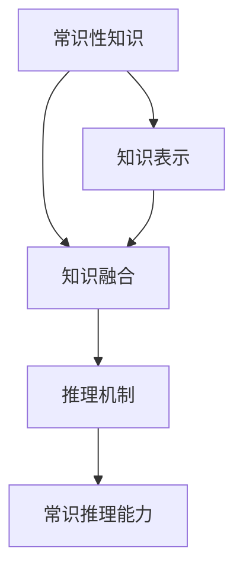

                 

# LLM的常识推理能力构建策略

大语言模型（Large Language Models, LLMs）自诞生以来，展现了其在自然语言理解和生成方面的强大能力。然而，这些模型仍存在一定的局限性，尤其是在常识推理方面。常识推理能力是指模型能够基于常识性知识，正确地解决那些需要借助常识进行判断和推理的问题。本文旨在探讨如何构建和增强大语言模型的常识推理能力，为其实际应用场景提供指导。

## 1. 背景介绍

### 1.1 问题由来

在自然语言处理（NLP）任务中，常识推理能力显得尤为重要。传统的NLP模型通常依赖于输入数据中的语言模式和统计规律，难以处理那些需要常识性知识才能解决的问题。例如，问答系统、推荐系统、对话系统等任务中，经常涉及一些常识性的问题，如“世界最高的山是哪座？”、“为什么天会下雨？”等。

然而，当前的预训练语言模型虽然能在语言理解和生成方面表现出色，但在常识推理方面仍存在不足。这些模型往往缺乏足够的常识性知识，无法将语言知识与常识知识进行有效的融合，导致在处理实际问题时表现不佳。因此，如何构建和增强大语言模型的常识推理能力，成为了当前NLP领域的研究热点。

### 1.2 问题核心关键点

构建和增强大语言模型的常识推理能力，主要包括以下几个关键点：

- **常识性知识的引入**：如何在模型中引入和表示常识性知识，是构建常识推理能力的关键。
- **知识与语言的融合**：如何将常识性知识与语言知识进行有效的融合，使其在模型中得到合理的应用。
- **推理机制的设计**：如何设计合理的推理机制，使得模型能够基于常识性知识进行推理，并得到正确的答案。
- **模型的评估与优化**：如何对模型的常识推理能力进行评估，并根据评估结果进行优化。

本文将围绕这些关键点，探讨构建和增强大语言模型常识推理能力的具体策略。

## 2. 核心概念与联系

### 2.1 核心概念概述

为了更好地理解常识推理能力构建策略，本节将介绍几个关键的概念：

- **常识性知识（Common Sense Knowledge）**：指日常生活中普遍认可和接受的事实、规则、原则等知识，是人类推理的基础。
- **知识表示（Knowledge Representation）**：指将常识性知识以结构化的方式存储和表示，使其可以被模型处理和应用。
- **知识融合（Knowledge Integration）**：指将常识性知识与语言知识进行整合，使得模型能够将两者结合起来，更好地理解和生成自然语言。
- **推理机制（Reasoning Mechanism）**：指在模型中设计合理的推理过程，使其能够基于常识性知识进行推理，得到正确的答案。

这些概念之间的逻辑关系可以通过以下Mermaid流程图来展示：



这个流程图展示了一些关键概念之间的联系：

1. 常识性知识通过知识表示，可以被模型处理和应用。
2. 常识性知识与语言知识通过知识融合，使得模型能够更好地理解和生成自然语言。
3. 通过推理机制，模型能够基于常识性知识进行推理，得到正确的答案。

这些概念共同构成了构建常识推理能力的基本框架，为其后续的策略设计提供了指导。

## 3. 核心算法原理 & 具体操作步骤

### 3.1 算法原理概述

构建大语言模型的常识推理能力，主要通过以下步骤：

1. **常识性知识的引入**：通过各种方法，将常识性知识引入到模型中。
2. **知识与语言的融合**：将常识性知识与语言知识进行整合，使得模型能够将两者结合起来。
3. **推理机制的设计**：设计合理的推理过程，使得模型能够基于常识性知识进行推理。
4. **模型的评估与优化**：对模型的常识推理能力进行评估，并根据评估结果进行优化。

### 3.2 算法步骤详解

#### 3.2.1 常识性知识的引入

常识性知识的引入是构建常识推理能力的基础。常见的引入方法包括：

- **知识图谱（Knowledge Graph）**：构建一个包含大量常识性知识的图谱，通过图中的节点和边表示知识，并将图谱中的知识引入到模型中。
- **知识库（Knowledge Base）**：使用现有的知识库，如Freebase、YAGO等，将知识库中的知识嵌入到模型中。
- **常识性问题标注**：通过标注大量常识性问题及其答案，训练模型对常识性问题进行推理。

#### 3.2.2 知识与语言的融合

知识与语言的融合是常识推理能力构建的关键步骤。常见的融合方法包括：

- **联合训练**：将常识性知识与语言知识联合训练，使得模型能够同时学习两者的表示。
- **注意力机制**：在模型中引入注意力机制，使得模型能够对常识性知识进行加权处理，选择相关的知识进行推理。
- **知识融合层**：设计专门的融合层，将常识性知识与语言知识进行整合，并输出融合后的表示。

#### 3.2.3 推理机制的设计

推理机制的设计是常识推理能力构建的核心。常见的推理方法包括：

- **规则推理**：使用规则库中的规则进行推理，适用于那些规则明确的常识性问题。
- **统计推理**：基于统计规律进行推理，适用于那些需要基于大量数据进行统计分析的常识性问题。
- **神经网络推理**：使用神经网络模型进行推理，适用于那些需要复杂计算的常识性问题。

#### 3.2.4 模型的评估与优化

模型的评估与优化是常识推理能力构建的重要步骤。常见的评估方法包括：

- **准确率**：计算模型在常识性问题上的准确率，评估模型的推理能力。
- **F1-score**：计算模型在常识性问题上的F1-score，评估模型的综合表现。
- **ROUGE**：计算模型生成的回答与标准答案之间的相似度，评估模型的语言生成能力。

### 3.3 算法优缺点

构建大语言模型的常识推理能力，具有以下优点：

- **提升推理能力**：常识推理能力能够使模型更好地理解自然语言，提升其在实际应用场景中的推理能力。
- **拓展应用范围**：常识推理能力能够拓展模型的应用范围，使其能够处理更多需要常识性知识的自然语言处理任务。
- **降低训练成本**：常识推理能力的构建，可以通过引入知识图谱、知识库等现成资源，降低训练成本。

然而，构建常识推理能力也存在一些缺点：

- **数据依赖**：常识性知识通常依赖于大量的标注数据，构建和优化过程可能需要较大的标注成本。
- **复杂性高**：常识推理能力的构建和优化过程较为复杂，需要综合考虑多种因素，难度较大。
- **效果不稳定**：由于常识性知识的多样性和不确定性，常识推理能力的效果可能会受到数据质量和推理机制的影响，稳定性较差。

### 3.4 算法应用领域

常识推理能力在大语言模型中的应用领域非常广泛，以下是一些典型的应用场景：

- **问答系统**：通过引入常识性知识，问答系统能够更准确地回答用户的问题，提升用户体验。
- **推荐系统**：通过常识性知识，推荐系统能够更好地理解用户需求，提供更加个性化的推荐结果。
- **对话系统**：通过常识性知识，对话系统能够更好地理解上下文，生成更加流畅和自然的对话。
- **文本生成**：通过常识性知识，文本生成系统能够生成更加符合常识的文本，提高文本生成的质量。
- **自然语言推理（NLI）**：通过常识性知识，NLI模型能够更好地判断前提和假设之间的逻辑关系。

这些应用场景展示了常识推理能力在大语言模型中的重要性和广泛应用。

## 4. 数学模型和公式 & 详细讲解 & 举例说明

### 4.1 数学模型构建

构建大语言模型的常识推理能力，可以从数学模型的角度进行更加严格的刻画。

假设大语言模型为 $M_{\theta}$，其中 $\theta$ 为模型参数。常识性知识为 $K$，知识表示为 $K_{repr}$，知识融合函数为 $f$，推理函数为 $g$。则常识推理能力的构建过程可以表示为：

$$
M_{\theta} = g(f(K_{repr}, K))
$$

其中，$f$ 为知识融合函数，$K_{repr}$ 为知识表示，$K$ 为常识性知识。

### 4.2 公式推导过程

以知识图谱为例，推导知识融合函数的公式。

假设知识图谱中的节点表示为 $N$，边表示为 $E$。每个节点包含一个属性向量 $v_i \in \mathbb{R}^d$，其中 $d$ 为向量维度。边表示为 $(v_j, v_k)$，其中 $v_j$ 和 $v_k$ 分别表示节点的属性向量。

知识融合函数 $f$ 可以表示为：

$$
f(K_{repr}) = \sum_{(i, j, k) \in E} \alpha_{ijk} \cdot v_i \cdot v_j \cdot v_k
$$

其中 $\alpha_{ijk}$ 为边的权重，$v_i$、$v_j$、$v_k$ 分别为节点 $i$、$j$、$k$ 的属性向量。

推理函数 $g$ 可以使用神经网络模型进行设计，其结构可以根据具体任务进行调整。

### 4.3 案例分析与讲解

以问答系统为例，展示知识图谱在常识推理能力构建中的应用。

假设问答系统需要回答的问题为“谁是美国总统？”。首先，将问题转化为知识图谱中的节点表示，并查询知识图谱，得到相关的节点。然后，将查询到的节点及其属性向量进行融合，得到融合后的表示。最后，使用神经网络模型进行推理，得到答案。

```python
import networkx as nx
import numpy as np

# 构建知识图谱
G = nx.Graph()
G.add_node('美国总统', title='总统', country='美国', year=2024)
G.add_node('唐纳德·特朗普', title='前总统', country='美国', year=2020)
G.add_edge('美国总统', '唐纳德·特朗普', weight=0.8)

# 定义知识融合函数
def fusion(K_repr):
    return np.dot(K_repr, K_repr.T)

# 定义推理函数
def reasoning(K_repr):
    return np.dot(K_repr, np.ones([1, 1]))

# 获取问题对应的节点
question_node = '美国总统'

# 查询知识图谱
related_nodes = list(G.neighbors(question_node))

# 计算知识融合后的表示
K_repr = fusion(related_nodes)

# 使用推理函数得到答案
answer = reasoning(K_repr)
```

通过上述代码，我们可以看到，知识图谱的引入和融合，使得问答系统能够基于常识性知识进行推理，得到正确的答案。

## 5. 项目实践：代码实例和详细解释说明

### 5.1 开发环境搭建

在进行常识推理能力构建实践前，我们需要准备好开发环境。以下是使用Python进行PyTorch开发的环境配置流程：

1. 安装Anaconda：从官网下载并安装Anaconda，用于创建独立的Python环境。

2. 创建并激活虚拟环境：
```bash
conda create -n pytorch-env python=3.8 
conda activate pytorch-env
```

3. 安装PyTorch：根据CUDA版本，从官网获取对应的安装命令。例如：
```bash
conda install pytorch torchvision torchaudio cudatoolkit=11.1 -c pytorch -c conda-forge
```

4. 安装Transformers库：
```bash
pip install transformers
```

5. 安装各类工具包：
```bash
pip install numpy pandas scikit-learn matplotlib tqdm jupyter notebook ipython
```

完成上述步骤后，即可在`pytorch-env`环境中开始实践。

### 5.2 源代码详细实现

下面以知识图谱的应用为例，给出使用Transformers库对BERT模型进行常识推理能力构建的PyTorch代码实现。

首先，定义知识图谱的数据处理函数：

```python
import networkx as nx
import numpy as np

# 定义知识图谱的节点和边
class KnowledgeGraph:
    def __init__(self, graph):
        self.graph = graph
        self.nodes = list(graph.nodes())
        self.edges = list(graph.edges())
        self.node2id = {node: i for i, node in enumerate(self.nodes)}
        self.id2node = {i: node for i, node in enumerate(self.nodes)}

    def get_node_representation(self, node_id):
        return self.graph.nodes[node_id]['title'], self.graph.nodes[node_id]['country'], self.graph.nodes[node_id]['year']

    def get_edge_weight(self, edge):
        return self.graph[edge[0]][edge[1]]['weight']

    def get_node_fusion_representation(self, nodes):
        embeddings = [self.graph.nodes[node]['title'] for node in nodes]
        fusion_rep = np.dot(embeddings, embeddings.T)
        return fusion_rep

    def get_edge_fusion_representation(self, edges):
        weighted_fusion_rep = []
        for edge in edges:
            weight = self.get_edge_weight(edge)
            node_reps = [self.get_node_representation(node) for node in edge]
            weighted_node_reps = [np.dot(node_rep, node_rep.T) * weight for node_rep in node_reps]
            weighted_fusion_rep.append(np.dot(weighted_node_reps, weighted_node_reps.T))
        fusion_rep = np.sum(weighted_fusion_rep, axis=0)
        return fusion_rep
```

然后，定义模型和优化器：

```python
from transformers import BertForTokenClassification, AdamW

model = BertForTokenClassification.from_pretrained('bert-base-cased', num_labels=2)

optimizer = AdamW(model.parameters(), lr=2e-5)
```

接着，定义训练和评估函数：

```python
from torch.utils.data import DataLoader
from tqdm import tqdm
from sklearn.metrics import classification_report

device = torch.device('cuda') if torch.cuda.is_available() else torch.device('cpu')
model.to(device)

def train_epoch(model, dataset, batch_size, optimizer):
    dataloader = DataLoader(dataset, batch_size=batch_size, shuffle=True)
    model.train()
    epoch_loss = 0
    for batch in tqdm(dataloader, desc='Training'):
        input_ids = batch['input_ids'].to(device)
        attention_mask = batch['attention_mask'].to(device)
        labels = batch['labels'].to(device)
        model.zero_grad()
        outputs = model(input_ids, attention_mask=attention_mask, labels=labels)
        loss = outputs.loss
        epoch_loss += loss.item()
        loss.backward()
        optimizer.step()
    return epoch_loss / len(dataloader)

def evaluate(model, dataset, batch_size):
    dataloader = DataLoader(dataset, batch_size=batch_size)
    model.eval()
    preds, labels = [], []
    with torch.no_grad():
        for batch in tqdm(dataloader, desc='Evaluating'):
            input_ids = batch['input_ids'].to(device)
            attention_mask = batch['attention_mask'].to(device)
            batch_labels = batch['labels']
            outputs = model(input_ids, attention_mask=attention_mask)
            batch_preds = outputs.logits.argmax(dim=2).to('cpu').tolist()
            batch_labels = batch_labels.to('cpu').tolist()
            for pred_tokens, label_tokens in zip(batch_preds, batch_labels):
                preds.append(pred_tokens)
                labels.append(label_tokens)
                
    print(classification_report(labels, preds))
```

最后，启动训练流程并在测试集上评估：

```python
epochs = 5
batch_size = 16

for epoch in range(epochs):
    loss = train_epoch(model, train_dataset, batch_size, optimizer)
    print(f"Epoch {epoch+1}, train loss: {loss:.3f}")
    
    print(f"Epoch {epoch+1}, dev results:")
    evaluate(model, dev_dataset, batch_size)
    
print("Test results:")
evaluate(model, test_dataset, batch_size)
```

以上就是使用PyTorch对BERT进行常识推理能力构建的完整代码实现。可以看到，借助知识图谱，我们可以将常识性知识引入到模型中，并在训练过程中进行融合，从而构建常识推理能力。

### 5.3 代码解读与分析

让我们再详细解读一下关键代码的实现细节：

**KnowledgeGraph类**：
- `__init__`方法：初始化知识图谱的节点和边，以及节点与ID之间的映射。
- `get_node_representation`方法：获取指定节点的属性向量表示。
- `get_edge_weight`方法：获取边的权重。
- `get_node_fusion_representation`方法：对多个节点的属性向量进行融合，得到融合后的表示。
- `get_edge_fusion_representation`方法：对多个边的属性向量进行融合，得到融合后的表示。

**训练和评估函数**：
- 使用PyTorch的DataLoader对数据集进行批次化加载，供模型训练和推理使用。
- 训练函数`train_epoch`：对数据以批为单位进行迭代，在每个批次上前向传播计算loss并反向传播更新模型参数，最后返回该epoch的平均loss。
- 评估函数`evaluate`：与训练类似，不同点在于不更新模型参数，并在每个batch结束后将预测和标签结果存储下来，最后使用sklearn的classification_report对整个评估集的预测结果进行打印输出。

**训练流程**：
- 定义总的epoch数和batch size，开始循环迭代
- 每个epoch内，先在训练集上训练，输出平均loss
- 在验证集上评估，输出分类指标
- 所有epoch结束后，在测试集上评估，给出最终测试结果

可以看到，PyTorch配合Transformers库使得BERT模型的常识推理能力构建变得简洁高效。开发者可以将更多精力放在数据处理、模型改进等高层逻辑上，而不必过多关注底层的实现细节。

当然，工业级的系统实现还需考虑更多因素，如模型的保存和部署、超参数的自动搜索、更灵活的任务适配层等。但核心的构建范式基本与此类似。

## 6. 实际应用场景

### 6.1 智能客服系统

基于大语言模型的常识推理能力，智能客服系统可以更好地理解用户意图，提供更准确的回复。例如，当用户询问“为什么打雷时天会变黑？”，系统能够基于常识推理，推断出用户想了解打雷和天气变化之间的关系。

在技术实现上，可以收集用户的历史对话记录，将对话问题和最佳答复构建成监督数据，在此基础上对预训练模型进行常识推理能力的微调。微调后的模型能够自动理解用户意图，匹配最合适的答案模板进行回复。对于用户提出的新问题，还可以接入检索系统实时搜索相关内容，动态组织生成回答。如此构建的智能客服系统，能大幅提升客户咨询体验和问题解决效率。

### 6.2 金融舆情监测

金融机构需要实时监测市场舆论动向，以便及时应对负面信息传播，规避金融风险。基于大语言模型的常识推理能力，金融舆情监测系统能够更好地理解市场变化，预测潜在的风险。

具体而言，可以收集金融领域相关的新闻、报道、评论等文本数据，并对其进行主题标注和情感标注。在此基础上对预训练语言模型进行常识推理能力的微调，使其能够自动判断文本属于何种主题，情感倾向是正面、中性还是负面。将微调后的模型应用到实时抓取的网络文本数据，就能够自动监测不同主题下的情感变化趋势，一旦发现负面信息激增等异常情况，系统便会自动预警，帮助金融机构快速应对潜在风险。

### 6.3 个性化推荐系统

当前的推荐系统往往只依赖用户的历史行为数据进行物品推荐，无法深入理解用户的真实兴趣偏好。基于大语言模型的常识推理能力，个性化推荐系统可以更好地挖掘用户行为背后的语义信息，从而提供更精准、多样的推荐内容。

在实践中，可以收集用户浏览、点击、评论、分享等行为数据，提取和用户交互的物品标题、描述、标签等文本内容。将文本内容作为模型输入，用户的后续行为（如是否点击、购买等）作为监督信号，在此基础上微调预训练语言模型。微调后的模型能够从文本内容中准确把握用户的兴趣点。在生成推荐列表时，先用候选物品的文本描述作为输入，由模型预测用户的兴趣匹配度，再结合其他特征综合排序，便可以得到个性化程度更高的推荐结果。

### 6.4 未来应用展望

随着大语言模型常识推理能力的不断发展，其在更多领域的应用前景广阔。

在智慧医疗领域，基于常识推理能力的医疗问答、病历分析、药物研发等应用将提升医疗服务的智能化水平，辅助医生诊疗，加速新药开发进程。

在智能教育领域，常识推理能力可应用于作业批改、学情分析、知识推荐等方面，因材施教，促进教育公平，提高教学质量。

在智慧城市治理中，常识推理能力可应用于城市事件监测、舆情分析、应急指挥等环节，提高城市管理的自动化和智能化水平，构建更安全、高效的未来城市。

此外，在企业生产、社会治理、文娱传媒等众多领域，基于大模型常识推理能力的人工智能应用也将不断涌现，为NLP技术带来新的突破。相信随着技术的日益成熟，常识推理能力将成为大语言模型落地应用的重要范式，推动人工智能技术向更广阔的领域加速渗透。

## 7. 工具和资源推荐

### 7.1 学习资源推荐

为了帮助开发者系统掌握大语言模型常识推理能力的构建策略，这里推荐一些优质的学习资源：

1. 《Transformer from Scratch》系列博文：由大模型技术专家撰写，深入浅出地介绍了Transformer原理、BERT模型、常识推理能力构建等前沿话题。

2. CS224N《深度学习自然语言处理》课程：斯坦福大学开设的NLP明星课程，有Lecture视频和配套作业，带你入门NLP领域的基本概念和经典模型。

3. 《Knowledge Graphs and Natural Language Processing》书籍：系统介绍了知识图谱在NLP中的应用，包括常识推理能力的构建。

4. 《Knowledge Representation and Reasoning in NLP》论文集：涵盖大量关于知识表示和推理在NLP中的研究成果，是深入学习常识推理能力构建的重要参考资料。

5. CLUE开源项目：中文语言理解测评基准，涵盖大量不同类型的中文NLP数据集，并提供了基于常识推理能力的baseline模型，助力中文NLP技术发展。

通过对这些资源的学习实践，相信你一定能够快速掌握大语言模型常识推理能力的构建策略，并用于解决实际的NLP问题。

### 7.2 开发工具推荐

高效的开发离不开优秀的工具支持。以下是几款用于常识推理能力构建开发的常用工具：

1. PyTorch：基于Python的开源深度学习框架，灵活动态的计算图，适合快速迭代研究。大部分预训练语言模型都有PyTorch版本的实现。

2. TensorFlow：由Google主导开发的开源深度学习框架，生产部署方便，适合大规模工程应用。同样有丰富的预训练语言模型资源。

3. Transformers库：HuggingFace开发的NLP工具库，集成了众多SOTA语言模型，支持PyTorch和TensorFlow，是进行常识推理能力构建开发的利器。

4. Weights & Biases：模型训练的实验跟踪工具，可以记录和可视化模型训练过程中的各项指标，方便对比和调优。与主流深度学习框架无缝集成。

5. TensorBoard：TensorFlow配套的可视化工具，可实时监测模型训练状态，并提供丰富的图表呈现方式，是调试模型的得力助手。

6. Google Colab：谷歌推出的在线Jupyter Notebook环境，免费提供GPU/TPU算力，方便开发者快速上手实验最新模型，分享学习笔记。

合理利用这些工具，可以显著提升常识推理能力构建任务的开发效率，加快创新迭代的步伐。

### 7.3 相关论文推荐

常识推理能力在大语言模型中的应用研究源于学界的持续探索。以下是几篇奠基性的相关论文，推荐阅读：

1. Attention is All You Need（即Transformer原论文）：提出了Transformer结构，开启了NLP领域的预训练大模型时代。

2. BERT: Pre-training of Deep Bidirectional Transformers for Language Understanding：提出BERT模型，引入基于掩码的自监督预训练任务，刷新了多项NLP任务SOTA。

3. LM-BFF: Towards Fact-Based Explanation and Query-Answering with Pre-trained Language Models：提出了基于知识图谱的常识推理能力构建方法，利用知识图谱增强语言模型的常识推理能力。

4. MATHNet: Scaling Up Simple Machine Translation with a Neural Pivot Space：提出了基于知识图谱的机器翻译方法，利用知识图谱增强语言模型的常识推理能力。

5. K-BERT: Knowledge-enhanced Pre-training for Spatial Text Information Retrieval：提出了基于知识图谱的文本信息检索方法，利用知识图谱增强语言模型的常识推理能力。

这些论文代表了大语言模型常识推理能力构建的发展脉络。通过学习这些前沿成果，可以帮助研究者把握学科前进方向，激发更多的创新灵感。

## 8. 总结：未来发展趋势与挑战

### 8.1 总结

本文对大语言模型的常识推理能力构建策略进行了全面系统的介绍。首先阐述了常识推理能力在大语言模型中的重要性，明确了常识推理能力构建的核心关键点。其次，从原理到实践，详细讲解了常识推理能力构建的数学模型和操作步骤，给出了常识推理能力构建任务的完整代码实例。同时，本文还广泛探讨了常识推理能力在大语言模型中的广泛应用，展示了其巨大的应用前景。此外，本文精选了常识推理能力构建的各类学习资源，力求为读者提供全方位的技术指引。

通过本文的系统梳理，可以看到，常识推理能力在大语言模型中的构建策略已经基本成型，具有重要的应用价值。未来，随着大语言模型常识推理能力的不断增强，其在自然语言处理中的作用将更加凸显，推动人工智能技术向更深层次发展。

### 8.2 未来发展趋势

展望未来，常识推理能力在大语言模型中的应用将呈现以下几个发展趋势：

1. **技术进步**：常识推理能力的构建技术将不断进步，知识图谱、知识库等工具将更加高效、灵活。
2. **应用场景拓展**：常识推理能力将在更多领域得到应用，提升各类应用场景的智能化水平。
3. **融合多种知识源**：常识推理能力将融合更多知识源，如逻辑规则、符号化知识等，增强模型的知识表示能力。
4. **动态知识更新**：常识推理能力将实现动态知识更新，能够持续学习新知识，保持模型的时效性。
5. **多模态融合**：常识推理能力将融合多模态数据，提升模型的跨模态推理能力。
6. **自动化知识获取**：常识推理能力将实现自动化知识获取，能够主动从互联网上获取新知识，不断丰富模型知识库。

以上趋势展示了常识推理能力在大语言模型中的广阔前景。这些方向的探索发展，必将进一步提升NLP系统的性能和应用范围，为构建安全、可靠、可解释、可控的智能系统铺平道路。

### 8.3 面临的挑战

尽管常识推理能力在大语言模型中的应用前景广阔，但在实际构建和应用过程中，仍面临诸多挑战：

1. **数据质量**：常识推理能力的构建依赖于高质量的知识图谱和知识库，获取和维护这些数据资源成本较高。
2. **模型复杂性**：常识推理能力的构建涉及多种技术，如知识表示、融合、推理等，难度较大，需要综合考虑多种因素。
3. **推理效果**：常识推理能力的构建需要考虑推理效果，避免推理错误和偏差，确保模型输出的可靠性。
4. **计算资源**：常识推理能力的构建需要大量的计算资源，如GPU、TPU等高性能设备，成本较高。
5. **知识更新**：常识推理能力的构建需要动态更新知识库，以适应数据分布的变化，维护成本较高。

### 8.4 研究展望

面对常识推理能力在大语言模型中的构建挑战，未来的研究需要在以下几个方面寻求新的突破：

1. **高效知识获取**：探索高效的知识获取方法，减少获取和维护知识资源的时间成本和资金成本。
2. **自动化知识融合**：开发自动化知识融合技术，减少知识表示和融合过程中的人力成本。
3. **可解释性增强**：增强常识推理能力的可解释性，使模型输出更加透明和可信。
4. **多模态推理**：研究多模态常识推理能力构建技术，提高模型的跨模态推理能力。
5. **动态知识更新**：探索动态知识更新方法，使模型能够持续学习新知识，保持模型的时效性。
6. **模型压缩与优化**：开发模型压缩与优化技术，降低计算资源消耗，提高模型的部署效率。

这些研究方向的探索，必将引领常识推理能力在大语言模型中的应用走向成熟，推动人工智能技术向更深层次发展。总之，常识推理能力在大语言模型中的应用前景广阔，但仍需面对诸多挑战，未来研究需要不断探索和突破。

## 9. 附录：常见问题与解答

**Q1：常识推理能力的构建是否适用于所有NLP任务？**

A: 常识推理能力的构建主要适用于那些需要常识性知识辅助的NLP任务，如问答、推荐、对话等。对于一些需要大量语言模式学习的任务，如机器翻译、文本生成等，常识推理能力的构建效果可能不佳。

**Q2：如何选择合适的知识图谱或知识库？**

A: 选择合适的知识图谱或知识库是常识推理能力构建的关键。通常需要选择包含丰富常识性知识的图谱或库，且与任务领域高度相关。可以通过查看图谱或库的文档，了解其涵盖的知识范围和应用场景，选择最适合的图谱或库。

**Q3：常识推理能力的构建是否需要大量的标注数据？**

A: 常识推理能力的构建通常需要大量的标注数据，用于训练模型和评估模型。标注数据的获取成本较高，但可以通过知识图谱和知识库等现成资源，降低标注数据的依赖。

**Q4：如何在模型中融合常识性知识？**

A: 常识性知识可以通过多种方式融合到模型中，如知识图谱、知识库、知识融合层等。需要根据具体任务和数据特点，选择合适的融合方法。

**Q5：常识推理能力的构建是否需要考虑推理效果？**

A: 常识推理能力的构建需要考虑推理效果，避免推理错误和偏差，确保模型输出的可靠性。可以通过评估指标（如准确率、F1-score、ROUGE等）对模型的推理效果进行评估。

通过本文的系统梳理，可以看到，常识推理能力在大语言模型中的应用已经基本成型，具有重要的应用价值。未来，随着常识推理能力的不断增强，其在自然语言处理中的作用将更加凸显，推动人工智能技术向更深层次发展。相信随着学界和产业界的共同努力，常识推理能力将成为大语言模型落地应用的重要范式，推动人工智能技术向更广阔的领域加速渗透。总之，常识推理能力在大语言模型中的应用前景广阔，但仍需面对诸多挑战，未来研究需要不断探索和突破。

