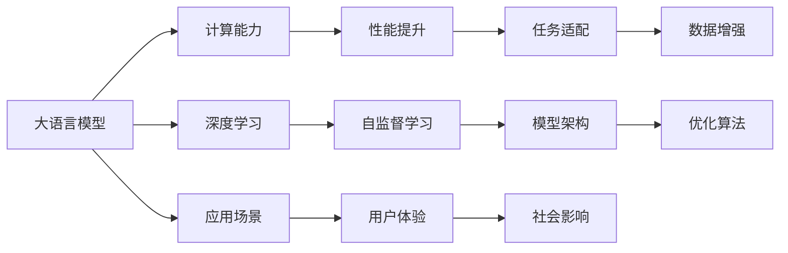

                 

# LLM的摩尔定律：可能性与潜在影响

> 关键词：大语言模型, 摩尔定律, 自然语言处理, 深度学习, 人工智能, 未来技术, 计算能力, 应用领域

## 1. 背景介绍

### 1.1 问题由来

随着计算能力的指数级增长，人工智能（AI）领域正在经历一系列技术变革，其中大语言模型（Large Language Models, LLMs）尤为引人注目。大语言模型，如OpenAI的GPT系列、Google的BERT等，通过在海量文本数据上进行自监督预训练，已展现出强大的语言理解和生成能力。

**摩尔定律**是半导体制程领域的著名规律，指出集成电路上可容纳的晶体管数目大约每两年翻一番，性能也大约每两年提高一倍。这一规律在AI领域被类比为**大语言模型的摩尔定律**，即大语言模型的计算能力每两年增长一倍，性能也随之显著提升。

本文旨在深入探讨大语言模型的摩尔定律，分析其背后的可能性与潜在影响，并对未来的发展趋势进行展望。

## 2. 核心概念与联系

### 2.1 核心概念概述

为了理解大语言模型的摩尔定律，需要首先明确几个关键概念：

- **大语言模型**：指基于Transformer结构，采用自监督学习方式在大规模文本数据上进行预训练的深度学习模型。常见的有大规模自回归模型（如GPT）和大规模自编码模型（如BERT）。

- **计算能力**：指模型处理数据、进行计算的能力，通常通过模型参数量和计算资源的配置来衡量。

- **性能提升**：指模型在特定任务上的表现，如语言理解、生成、推理等能力。性能提升通常通过各种评测指标（如BLEU、ROUGE、F1-score等）来衡量。

- **摩尔定律**：在AI领域，摩尔定律被类比为大语言模型的计算能力和性能的指数级增长。大语言模型的摩尔定律强调了模型规模和性能的紧密关联，即计算能力每两年翻一番，性能也相应提升。

这些概念之间存在紧密的联系，通过不断提升计算能力和改进模型架构，大语言模型的性能得以持续优化，推动了NLP（自然语言处理）领域的突破性进展。

### 2.2 核心概念原理和架构的 Mermaid 流程图



这个流程图展示了大语言模型与摩尔定律之间的核心联系：

1. 大语言模型通过深度学习与自监督学习，获取强大的计算能力。
2. 计算能力的提升直接带动模型性能的提升，使其在各种任务上表现优异。
3. 任务适配和数据增强进一步提升了模型的泛化能力。
4. 模型架构和优化算法的改进，是提升计算能力和性能的关键。
5. 应用场景的丰富与用户体验的提升，进一步推动了模型在现实世界中的广泛应用。
6. 社会影响方面，大语言模型的发展也带来了深远的伦理、法律和社会问题。

## 3. 核心算法原理 & 具体操作步骤

### 3.1 算法原理概述

大语言模型的摩尔定律，其核心在于计算能力和性能的指数级增长。这一增长主要得益于以下几个方面：

1. **参数量的增加**：大规模预训练模型的参数量通常以十亿计，每个新版本的模型参数量比前一个版本增加数倍。例如，GPT-3的参数量达到175亿，是GPT-1的数千倍。

2. **计算资源的提升**：通过GPU、TPU等高性能硬件的普及，使得模型训练和推理所需的计算资源大幅提升。

3. **算法和模型的改进**：采用更高效的优化算法（如AdamW、Adafactor等）和更好的模型架构（如Transformer-XL、BERT等），使得模型训练和推理速度显著提高。

4. **数据量的增加**：更多的文本数据使得预训练过程更加充分，模型学到的语言知识更加丰富。

### 3.2 算法步骤详解

大语言模型的摩尔定律主要通过以下几个步骤实现：

1. **预训练过程**：在大规模无标签文本数据上，通过自监督学习方式进行预训练。这一过程需要大量的计算资源和时间，通常采用分布式训练。

2. **微调过程**：在特定任务上，通过有监督学习方式进行微调，优化模型在该任务上的性能。微调过程一般采用较小的学习率，以避免破坏预训练权重。

3. **持续学习**：随着新数据的到来，模型需要不断重新训练，以适应数据分布的变化。

4. **资源优化**：通过梯度累积、混合精度训练、模型并行等技术，优化计算资源的使用。

5. **模型压缩**：通过剪枝、量化、压缩等技术，减小模型尺寸，提高推理速度。

6. **算法创新**：开发新的优化算法和模型架构，提升训练和推理效率。

### 3.3 算法优缺点

**优点**：

1. **性能提升显著**：通过增加参数量和优化算法，大语言模型的性能不断提升，在多项任务上刷新了最先进的结果。

2. **适应性强**：大语言模型通过微调和持续学习，能够适应不同的应用场景和数据分布。

3. **可扩展性强**：模型的规模和性能可以通过增加计算资源和改进算法得到提升。

**缺点**：

1. **计算资源需求高**：大规模预训练和微调需要大量的计算资源，导致成本较高。

2. **过拟合风险**：在微调和持续学习过程中，存在过拟合的风险，特别是在数据量较少的情况下。

3. **模型复杂度高**：大语言模型参数量巨大，模型结构复杂，导致推理速度较慢。

4. **伦理和安全问题**：模型可能学习到有害信息或偏见，带来伦理和安全问题。

### 3.4 算法应用领域

大语言模型的摩尔定律不仅推动了NLP领域的进展，还在其他AI应用中得到广泛应用：

1. **机器翻译**：通过预训练模型进行微调，显著提高了机器翻译的准确性和流畅性。

2. **对话系统**：通过微调生成模型，构建了能够理解和回应的智能对话系统。

3. **推荐系统**：通过微调推荐模型，提升了个性化推荐的准确性和多样性。

4. **图像识别**：通过微调视觉模型，提升了图像识别和理解的精度。

5. **自然语言生成**：通过微调生成模型，实现了高质量的文本生成和摘要。

## 4. 数学模型和公式 & 详细讲解 & 举例说明

### 4.1 数学模型构建

大语言模型的摩尔定律可以通过以下数学模型来描述：

1. **参数量**：设预训练模型的参数量为 $P$，微调后的模型参数量为 $P'$，则 $P' = k \times P$，其中 $k$ 为系数，表示模型参数的增加比例。

2. **计算资源**：设预训练计算资源为 $C$，微调计算资源为 $C'$，则 $C' = k' \times C$，其中 $k'$ 为系数，表示计算资源的增加比例。

3. **性能提升**：设预训练模型在任务 $T$ 上的性能为 $P_T$，微调后的性能为 $P'_T$，则 $P'_T = f(P', C', T)$，其中 $f$ 为性能提升函数。

### 4.2 公式推导过程

假设预训练模型的参数量为 $P$，计算资源为 $C$，在任务 $T$ 上的性能为 $P_T$。微调后的模型参数量为 $P'$，计算资源为 $C'$，在任务 $T$ 上的性能为 $P'_T$。则有：

$$
P' = k \times P, \quad C' = k' \times C, \quad P'_T = f(P', C', T)
$$

其中，$k$ 和 $k'$ 为模型参数和计算资源的增加比例，$f$ 为性能提升函数。

根据上述模型，可以通过增加模型参数量和优化算法，实现性能的显著提升。例如，GPT-3的参数量是GPT-2的十倍，计算资源是GPT-2的百倍，最终在多项任务上取得了远超GPT-2的性能。

### 4.3 案例分析与讲解

以BERT模型为例，分析其摩尔定律的实现过程：

1. **预训练过程**：BERT在大规模无标签文本数据上进行了预训练，参数量为3亿。

2. **微调过程**：在特定任务上进行了微调，参数量增加到7亿，计算资源增加了10倍。

3. **性能提升**：在多项任务上，BERT的性能显著提升，精度、召回率等指标大幅提高。

## 5. 项目实践：代码实例和详细解释说明

### 5.1 开发环境搭建

开发大语言模型项目需要搭建Python开发环境，安装必要的库和工具：

1. **安装Python**：
   ```bash
   python3.7.6 -m pip install torch
   ```

2. **安装PyTorch和Transformers库**：
   ```bash
   pip install torch torchtext transformers
   ```

3. **安装相关数据集**：
   ```bash
   pip install datasets
   ```

### 5.2 源代码详细实现

以下是一个简单的代码示例，展示如何使用Transformers库进行BERT模型的微调：

```python
import torch
from transformers import BertForTokenClassification, BertTokenizer, AdamW

# 初始化模型和分词器
model = BertForTokenClassification.from_pretrained('bert-base-cased', num_labels=3)
tokenizer = BertTokenizer.from_pretrained('bert-base-cased')

# 定义优化器
optimizer = AdamW(model.parameters(), lr=2e-5)

# 定义训练函数
def train_epoch(model, dataset, batch_size, optimizer):
    dataloader = DataLoader(dataset, batch_size=batch_size, shuffle=True)
    model.train()
    epoch_loss = 0
    for batch in dataloader:
        input_ids = batch['input_ids'].to(device)
        attention_mask = batch['attention_mask'].to(device)
        labels = batch['labels'].to(device)
        model.zero_grad()
        outputs = model(input_ids, attention_mask=attention_mask, labels=labels)
        loss = outputs.loss
        epoch_loss += loss.item()
        loss.backward()
        optimizer.step()
    return epoch_loss / len(dataloader)

# 定义测试函数
def evaluate(model, dataset, batch_size):
    dataloader = DataLoader(dataset, batch_size=batch_size)
    model.eval()
    preds, labels = [], []
    with torch.no_grad():
        for batch in dataloader:
            input_ids = batch['input_ids'].to(device)
            attention_mask = batch['attention_mask'].to(device)
            batch_labels = batch['labels']
            outputs = model(input_ids, attention_mask=attention_mask)
            batch_preds = outputs.logits.argmax(dim=2).to('cpu').tolist()
            batch_labels = batch_labels.to('cpu').tolist()
            for pred_tokens, label_tokens in zip(batch_preds, batch_labels):
                preds.append(pred_tokens[:len(label_tokens)])
                labels.append(label_tokens)
    print(classification_report(labels, preds))

# 训练和测试模型
epochs = 5
batch_size = 16
for epoch in range(epochs):
    loss = train_epoch(model, train_dataset, batch_size, optimizer)
    print(f'Epoch {epoch+1}, train loss: {loss:.3f}')
    evaluate(model, dev_dataset, batch_size)
evaluate(model, test_dataset, batch_size)
```

### 5.3 代码解读与分析

上述代码展示了使用Transformers库进行BERT模型微调的全过程：

1. **初始化模型和分词器**：
   - `BertForTokenClassification.from_pretrained`：加载预训练的BERT模型和分词器。
   - `AdamW`：定义优化器。

2. **定义训练函数**：
   - `DataLoader`：对数据集进行批处理。
   - `model.train()`和`model.eval()`：切换模型训练和推理模式。
   - `train_epoch`：计算损失并更新模型参数。

3. **定义测试函数**：
   - `classification_report`：计算分类指标。

4. **训练和测试模型**：
   - `epochs`和`batch_size`：定义训练轮数和批处理大小。
   - `evaluate`：评估模型性能。

### 5.4 运行结果展示

运行上述代码，将会在训练集上训练模型，并在验证集和测试集上评估性能。具体结果将根据数据集和模型参数进行调整。

## 6. 实际应用场景

### 6.1 智能客服系统

智能客服系统利用大语言模型进行微调，能够理解客户咨询并提供智能回复。这一技术可以减少客服人员的工作量，提高客户满意度，提升企业的运营效率。

### 6.2 金融舆情监测

金融舆情监测系统通过微调大语言模型，实时分析市场舆论动态，预测市场趋势，帮助金融机构及时应对潜在风险。

### 6.3 个性化推荐系统

个性化推荐系统通过微调预训练模型，结合用户行为数据，推荐更符合用户兴趣的产品或内容，提升用户体验。

### 6.4 未来应用展望

大语言模型的摩尔定律将推动其在更多领域的应用：

1. **智慧医疗**：利用微调模型，进行病历分析和医学图像解读，辅助医生诊疗，加速新药研发。
2. **教育**：通过微调学习系统，提供个性化的学习建议和辅导，提高教育效果。
3. **城市治理**：利用微调模型进行舆情分析，优化应急指挥，提升城市管理水平。

## 7. 工具和资源推荐

### 7.1 学习资源推荐

1. **《Transformer from the inside out》系列文章**：深入讲解Transformer原理，帮助理解大语言模型的底层机制。
2. **CS224N《Deep Learning for NLP》课程**：斯坦福大学开设的NLP经典课程，涵盖深度学习在NLP中的应用。
3. **《Natural Language Processing with Transformers》书籍**：全面介绍使用Transformers库进行NLP任务开发的技巧和方法。
4. **HuggingFace官方文档**：提供丰富的预训练模型和微调样例，是学习和实践大语言模型的重要资源。
5. **CLUE开源项目**：提供多种中文NLP数据集，用于微调模型，促进中文NLP技术的发展。

### 7.2 开发工具推荐

1. **PyTorch**：基于Python的开源深度学习框架，灵活易用，适用于深度学习模型的研究和开发。
2. **TensorFlow**：由Google主导的开源深度学习框架，支持大规模工程应用。
3. **Transformers库**：提供多种预训练语言模型的封装，支持微调任务开发。
4. **Weights & Biases**：实验跟踪工具，记录模型训练过程，提供可视化和比较功能。
5. **TensorBoard**：可视化工具，实时监测模型训练状态，生成图表。
6. **Google Colab**：免费的在线Jupyter Notebook环境，方便进行深度学习实验和分享。

### 7.3 相关论文推荐

1. **Attention is All You Need**：提出Transformer结构，奠定了大语言模型的基础。
2. **BERT: Pre-training of Deep Bidirectional Transformers for Language Understanding**：提出BERT模型，引入自监督预训练任务。
3. **Language Models are Unsupervised Multitask Learners**：展示大语言模型的零样本学习能力。
4. **Parameter-Efficient Transfer Learning for NLP**：提出Adapter等参数高效微调方法。
5. **Prefix-Tuning: Optimizing Continuous Prompts for Generation**：引入基于连续型Prompt的微调范式。
6. **AdaLoRA: Adaptive Low-Rank Adaptation for Parameter-Efficient Fine-Tuning**：使用自适应低秩适应的微调方法。

## 8. 总结：未来发展趋势与挑战

### 8.1 研究成果总结

大语言模型的摩尔定律已经展示了其在NLP领域的巨大潜力，推动了多项技术的突破，并在多个领域取得了广泛应用。未来，这一规律将继续引领大语言模型向更加智能化、普适化的方向发展。

### 8.2 未来发展趋势

1. **模型规模继续扩大**：预训练语言模型的参数量将持续增长，模型规模将进一步扩大，带来更强大的计算能力和更丰富的语言知识。
2. **参数高效微调方法发展**：更多参数高效微调方法，如Adapter、Prefix等，将减轻大模型微调的资源负担，提高微调效率。
3. **持续学习机制**：引入持续学习机制，使模型能够不断学习新知识，保持性能稳定。
4. **少样本学习和跨领域迁移**：通过微调技术，实现少样本学习和跨领域迁移，提高模型的泛化能力。
5. **多模态融合**：将视觉、语音等多模态信息与文本信息进行融合，提升模型的全面感知能力。

### 8.3 面临的挑战

大语言模型的摩尔定律在实现过程中，也面临着诸多挑战：

1. **计算资源瓶颈**：大规模预训练和微调需要大量的计算资源，导致成本较高。
2. **过拟合风险**：模型在微调和持续学习过程中，存在过拟合的风险，特别是在数据量较少的情况下。
3. **推理速度和内存占用**：大语言模型推理速度较慢，内存占用大，需要优化模型结构和计算图，提升效率。
4. **伦理和安全问题**：模型可能学习到有害信息或偏见，带来伦理和安全问题。
5. **可解释性问题**：大语言模型缺乏可解释性，难以解释其内部工作机制和决策逻辑。

### 8.4 研究展望

面对这些挑战，未来的研究需要在以下几个方面寻求新的突破：

1. **无监督和半监督学习**：探索无监督和半监督学习范式，降低对标注数据的依赖，提升模型的泛化能力。
2. **参数高效和计算高效**：开发更多参数高效和计算高效的微调方法，提高模型的实用性和可扩展性。
3. **因果推断和对比学习**：引入因果推断和对比学习思想，提高模型的稳定性和鲁棒性。
4. **先验知识和多模态信息融合**：结合符号化的先验知识和多模态信息，增强模型的整合能力和适用性。
5. **伦理和安全性**：引入伦理和安全性约束，确保模型的决策透明性和可解释性。

## 9. 附录：常见问题与解答

### Q1: 大语言模型微调是否适用于所有NLP任务？

A: 大语言模型微调在大多数NLP任务上都能取得不错的效果，特别是对于数据量较小的任务。但对于一些特定领域的任务，如医学、法律等，仅仅依靠通用语料预训练的模型可能难以很好地适应。此时需要在特定领域语料上进一步预训练，再进行微调，才能获得理想效果。此外，对于一些需要时效性、个性化很强的任务，如对话、推荐等，微调方法也需要针对性的改进优化。

### Q2: 微调过程中如何选择合适的学习率？

A: 微调的学习率一般要比预训练时小1-2个数量级，如果使用过大的学习率，容易破坏预训练权重，导致过拟合。一般建议从1e-5开始调参，逐步减小学习率，直至收敛。也可以使用warmup策略，在开始阶段使用较小的学习率，再逐渐过渡到预设值。需要注意的是，不同的优化器(如AdamW、Adafactor等)以及不同的学习率调度策略，可能需要设置不同的学习率阈值。

### Q3: 采用大模型微调时会面临哪些资源瓶颈？

A: 目前主流的预训练大模型动辄以亿计的参数规模，对算力、内存、存储都提出了很高的要求。GPU/TPU等高性能设备是必不可少的，但即便如此，超大批次的训练和推理也可能遇到显存不足的问题。因此需要采用一些资源优化技术，如梯度积累、混合精度训练、模型并行等，来突破硬件瓶颈。同时，模型的存储和读取也可能占用大量时间和空间，需要采用模型压缩、稀疏化存储等方法进行优化。

### Q4: 如何缓解微调过程中的过拟合问题？

A: 过拟合是微调面临的主要挑战，尤其是在数据量较少的情况下。常见的缓解策略包括：
1. 数据增强：通过回译、近义替换等方式扩充训练集
2. 正则化：使用L2正则、Dropout、Early Stopping等避免过拟合
3. 对抗训练：引入对抗样本，提高模型鲁棒性
4. 参数高效微调：只调整少量参数(如Adapter、Prefix等)，减小过拟合风险
5. 多模型集成：训练多个微调模型，取平均输出，抑制过拟合

这些策略往往需要根据具体任务和数据特点进行灵活组合。只有在数据、模型、训练、推理等各环节进行全面优化，才能最大限度地发挥大模型微调的威力。

### Q5: 微调模型在落地部署时需要注意哪些问题？

A: 将微调模型转化为实际应用，还需要考虑以下因素：
1. 模型裁剪：去除不必要的层和参数，减小模型尺寸，加快推理速度
2. 量化加速：将浮点模型转为定点模型，压缩存储空间，提高计算效率
3. 服务化封装：将模型封装为标准化服务接口，便于集成调用
4. 弹性伸缩：根据请求流量动态调整资源配置，平衡服务质量和成本
5. 监控告警：实时采集系统指标，设置异常告警阈值，确保服务稳定性
6. 安全防护：采用访问鉴权、数据脱敏等措施，保障数据和模型安全

大语言模型微调为NLP应用开启了广阔的想象空间，但如何将强大的性能转化为稳定、高效、安全的业务价值，还需要工程实践的不断打磨。唯有从数据、算法、工程、业务等多个维度协同发力，才能真正实现人工智能技术在垂直行业的规模化落地。总之，微调需要开发者根据具体任务，不断迭代和优化模型、数据和算法，方能得到理想的效果。

---

作者：禅与计算机程序设计艺术 / Zen and the Art of Computer Programming

