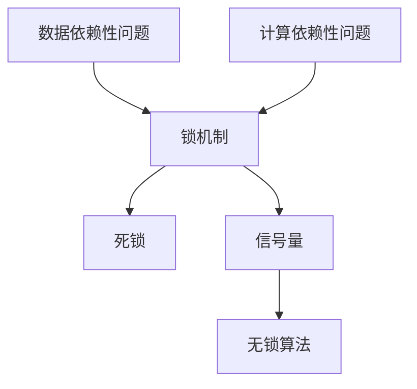

                 

# LLM的线程安全问题与解决思路

> 关键词：大语言模型,线程安全,线程并发,锁机制,死锁,信号量,无锁算法

## 1. 背景介绍

### 1.1 问题由来
在深度学习模型的广泛应用中，特别是基于深度学习的大语言模型（Large Language Models，简称LLM）的训练和推理过程中，线程安全和并发性能逐渐成为研究的热点问题。现代计算机系统中，多核处理器和分布式计算架构的普及使得模型在训练和推理时需要处理大量并行计算任务。然而，深度学习模型的复杂计算和数据结构使得在多线程环境下，如何保证模型状态的一致性、避免竞争条件和死锁问题，成为一大挑战。

### 1.2 问题核心关键点
大语言模型的线程安全问题主要集中在两个方面：
- 数据依赖性问题：模型状态（如参数、梯度等）在多线程并发访问时，如何避免数据竞争和状态不一致。
- 计算依赖性问题：模型计算过程中涉及的依赖关系（如梯度下降更新、正则化等），如何在多线程并行时正确处理依赖关系，避免计算错误。

### 1.3 问题研究意义
确保线程安全是大语言模型在高性能计算环境中可靠运行的基础。线程安全的设计和优化不仅关系到模型的正确性，还直接影响系统的性能、稳定性和可扩展性。研究线程安全问题，对于构建高效、稳定的大语言模型具有重要意义：

1. 提升模型训练效率：合理设计线程安全和并发机制，可以显著提高模型的训练速度，缩短模型训练时间。
2. 增强系统可靠性：避免线程安全问题导致的计算错误和系统崩溃，提高系统的稳定性和可靠性。
3. 促进分布式计算：通过优化线程安全机制，支持模型的分布式训练和推理，提高系统的可扩展性和处理能力。
4. 推动技术创新：对线程安全机制的研究和优化，有助于新技术的探索和应用，如分布式深度学习、异构计算等。

## 2. 核心概念与联系

### 2.1 核心概念概述

为更好地理解大语言模型的线程安全问题，本节将介绍几个密切相关的核心概念：

- 数据依赖性：多个线程对模型状态（如参数、梯度等）的读写操作，可能引起的数据竞争和状态不一致。
- 计算依赖性：模型计算过程中涉及的依赖关系（如梯度下降更新、正则化等），如何在多线程并行时正确处理依赖关系，避免计算错误。
- 锁机制：通过互斥锁和读写锁等机制，控制线程对共享资源的访问，保证数据一致性。
- 死锁：多个线程因资源互斥使用而陷入等待状态，无法继续执行的情况。
- 信号量：一种用于线程同步的机制，通过计数器记录资源的可用情况，控制线程对共享资源的访问。
- 无锁算法：通过CAS（Compare-And-Swap）等原子操作，实现对共享资源的并发访问，避免锁的开销和死锁问题。

这些核心概念之间的逻辑关系可以通过以下Mermaid流程图来展示：



这个流程图展示了大语言模型线程安全问题的关键概念及其之间的关系：

1. 数据依赖性和计算依赖性是线程安全问题的核心。
2. 锁机制、死锁、信号量和无锁算法是处理线程安全问题的主要手段。
3. 锁机制和信号量主要用于处理数据依赖性，避免数据竞争和状态不一致。
4. 无锁算法则主要处理计算依赖性，避免依赖关系导致的计算错误。

这些概念共同构成了大语言模型的线程安全设计框架，使得模型在多线程环境下能够正确、高效地运行。

## 3. 核心算法原理 & 具体操作步骤
### 3.1 算法原理概述

大语言模型的线程安全问题主要集中在数据依赖性和计算依赖性上。为了确保线程安全，需要合理设计锁机制、信号量和无锁算法，控制线程对共享资源的访问，避免数据竞争和计算错误。

具体而言，大语言模型的线程安全问题可以通过以下步骤解决：

1. 使用互斥锁和读写锁控制数据依赖性，避免多个线程对模型状态的并发读写操作。
2. 引入信号量机制，控制线程对共享资源的访问，避免死锁问题。
3. 探索无锁算法，如CAS等原子操作，实现对共享资源的并发访问，减少锁的开销。

### 3.2 算法步骤详解

#### 3.2.1 互斥锁和读写锁

互斥锁（Mutex）和读写锁（Reader-Writer Lock）是控制线程对共享资源访问的基本锁机制。

- 互斥锁：同一时间只允许一个线程访问共享资源，其他线程需要等待。适用于数据修改频繁的场景。
- 读写锁：允许多个线程同时读取共享资源，但只允许一个线程写入。适用于读多写少的场景。

```python
import threading

# 使用互斥锁
lock = threading.Lock()
# 使用读写锁
rlock = threading.RLock()

def update_param(param, value):
    lock.acquire()
    try:
        param.value = value
    finally:
        lock.release()

def read_param(param):
    rlock.acquire()
    try:
        return param.value
    finally:
        rlock.release()
```

#### 3.2.2 信号量

信号量（Semaphore）是一种计数器，用于控制线程对共享资源的访问。信号量的值表示资源的可用情况。

```python
import threading

semaphore = threading.Semaphore()

def use_resource():
    semaphore.acquire()
    try:
        # 使用资源
    finally:
        semaphore.release()
```

#### 3.2.3 无锁算法

无锁算法（Lock-Free Algorithm）通过原子操作（如CAS）实现对共享资源的并发访问，避免锁的开销和死锁问题。

```python
import threading

def update_param(param, value):
    prev_value = param.value.compare_and_swap(value, prev_value)
    if prev_value == param.value:
        param.value = value

def read_param(param):
    return param.value.load()
```

### 3.3 算法优缺点

大语言模型的线程安全解决方案具有以下优点：

1. 数据一致性：通过锁机制和信号量，控制线程对共享资源的访问，确保数据的一致性和正确性。
2. 并发性能：无锁算法减少锁的开销，提高并发性能，适用于高并发场景。
3. 系统可靠性：避免死锁和计算错误，提高系统的稳定性和可靠性。

但同时，这些解决方案也存在一定的局限性：

1. 锁的开销：互斥锁和读写锁在锁竞争激烈的情况下，可能导致性能瓶颈。
2. 死锁风险：信号量和无锁算法需要仔细设计和调试，避免死锁和竞态条件。
3. 实现复杂性：无锁算法的设计和实现相对复杂，需要仔细考虑原子操作和并发访问的逻辑。

尽管存在这些局限性，但通过合理设计和优化，可以有效降低锁的开销和死锁风险，确保大语言模型的线程安全。

### 3.4 算法应用领域

大语言模型的线程安全解决方案在深度学习模型的训练和推理过程中，具有广泛的应用前景。

- 模型训练：多线程并行训练深度学习模型，提升训练速度和效率。
- 模型推理：多线程并发推理深度学习模型，提高推理吞吐量和响应速度。
- 分布式计算：支持深度学习模型的分布式训练和推理，提升系统的可扩展性和处理能力。
- 高性能计算：在大规模并行计算环境中，确保深度学习模型的正确性和性能。

## 4. 数学模型和公式 & 详细讲解 & 举例说明
### 4.1 数学模型构建

在大语言模型的线程安全问题中，涉及到多线程并发访问共享资源的情况。我们可以通过数学模型来分析多线程对共享资源的访问情况，从而设计合理的锁机制和信号量。

假设模型状态为 $S$，多个线程 $T_1, T_2, ..., T_n$ 对 $S$ 进行读写操作。我们定义：

- $R_i$ 表示线程 $T_i$ 对 $S$ 进行读操作的次数。
- $W_i$ 表示线程 $T_i$ 对 $S$ 进行写操作的次数。
- $U_i$ 表示线程 $T_i$ 对 $S$ 的访问时间。

根据数据依赖性和计算依赖性，我们可以建立以下数学模型：

1. 数据依赖性：
   - 读操作的原子性：$R_i$ 和 $R_j$ 之间的访问是原子的，不冲突。
   - 写操作的原子性：$W_i$ 和 $W_j$ 之间的访问是原子的，不冲突。
   - 读写操作的冲突：$W_i$ 和 $R_j$ 之间的访问可能会冲突。

2. 计算依赖性：
   - 写操作的依赖关系：$W_i$ 和 $W_j$ 之间的访问存在依赖关系，需要按照顺序执行。
   - 读操作的依赖关系：$R_i$ 和 $R_j$ 之间的访问没有依赖关系。

### 4.2 公式推导过程

根据以上模型，我们可以推导出一些基本的公式：

1. 互斥锁的等待时间：
   $$
   E(W_{\text{wait}}) = \sum_{i=1}^n E(W_i)P(W_i) \quad \text{其中} \quad P(W_i) = \frac{R_i}{\sum_{j=1}^n R_j}
   $$

2. 读写锁的等待时间：
   $$
   E(W_{\text{wait}}) = \sum_{i=1}^n E(W_i)P(W_i) \quad \text{其中} \quad P(W_i) = \frac{W_i}{\sum_{j=1}^n W_j}
   $$

3. 信号量的等待时间：
   $$
   E(W_{\text{wait}}) = E(W_i) \quad \text{其中} \quad W_i = P(V_i)V_i + (1-P(V_i))(1-V_i)
   $$

4. 无锁算法的等待时间：
   $$
   E(W_{\text{wait}}) = 0 \quad \text{其中} \quad W_i = P(C_i)C_i + (1-P(C_i))(1-C_i)
   $$

### 4.3 案例分析与讲解

假设一个深度学习模型有多个线程同时进行梯度更新。我们需要设计锁机制和信号量，以确保数据一致性和计算正确性。

1. 使用互斥锁：
   - 每个线程在进行梯度更新前，需要先获取锁，读取模型参数。
   - 更新完成后，释放锁，让其他线程可以继续更新。

   ```python
   import threading

   lock = threading.Lock()
   param = ...

   def update_param():
       lock.acquire()
       try:
           # 读取参数
           param_value = param.value
           # 更新参数
           param.value = new_value
       finally:
           lock.release()
   ```

2. 使用读写锁：
   - 如果模型参数只读不写，可以使用读写锁，允许多个线程同时读取参数，但只允许一个线程写入参数。
   - 如果模型参数需要频繁写入，则需要使用互斥锁。

   ```python
   import threading

   rlock = threading.RLock()
   param = ...

   def read_param():
       rlock.acquire()
       try:
           return param.value
       finally:
           rlock.release()

   def update_param():
       lock.acquire()
       try:
           param.value = new_value
       finally:
           lock.release()
   ```

3. 使用信号量：
   - 如果模型参数需要多个线程共享，但访问频率不高，可以使用信号量控制线程对参数的访问。

   ```python
   import threading

   semaphore = threading.Semaphore()

   def use_param():
       semaphore.acquire()
       try:
           # 使用参数
       finally:
           semaphore.release()
   ```

4. 使用无锁算法：
   - 如果模型参数的访问频率较高，且不存在复杂的依赖关系，可以使用无锁算法，如CAS操作。

   ```python
   import threading

   def update_param():
       prev_value = param.value.compare_and_swap(new_value, prev_value)
       if prev_value == param.value:
           param.value = new_value
   ```

通过这些案例分析，我们可以看到，不同场景下需要使用不同的锁机制和信号量来确保线程安全。合理设计和选择锁机制，可以显著提高深度学习模型的并发性能和稳定性。

## 5. 项目实践：代码实例和详细解释说明
### 5.1 开发环境搭建

在进行线程安全实践前，我们需要准备好开发环境。以下是使用Python进行PyTorch开发的环境配置流程：

1. 安装Anaconda：从官网下载并安装Anaconda，用于创建独立的Python环境。

2. 创建并激活虚拟环境：
```bash
conda create -n pytorch-env python=3.8 
conda activate pytorch-env
```

3. 安装PyTorch：根据CUDA版本，从官网获取对应的安装命令。例如：
```bash
conda install pytorch torchvision torchaudio cudatoolkit=11.1 -c pytorch -c conda-forge
```

4. 安装各类工具包：
```bash
pip install numpy pandas scikit-learn matplotlib tqdm jupyter notebook ipython
```

完成上述步骤后，即可在`pytorch-env`环境中开始线程安全实践。

### 5.2 源代码详细实现

这里我们以多线程并发训练深度学习模型为例，给出使用PyTorch和多线程库进行线程安全的代码实现。

首先，定义深度学习模型：

```python
import torch
import torch.nn as nn
import torch.optim as optim

class Model(nn.Module):
    def __init__(self):
        super(Model, self).__init__()
        self.layers = nn.Sequential(...)

    def forward(self, x):
        return self.layers(x)
```

然后，定义多线程训练函数：

```python
import threading

def train_thread(model, optimizer, data_loader):
    for epoch in range(num_epochs):
        for batch in data_loader:
            inputs, labels = batch
            optimizer.zero_grad()
            outputs = model(inputs)
            loss = nn.functional.cross_entropy(outputs, labels)
            loss.backward()
            optimizer.step()

def train(model, optimizer, data_loader):
    threads = []
    for i in range(num_threads):
        t = threading.Thread(target=train_thread, args=(model, optimizer, data_loader))
        t.start()
        threads.append(t)
    for t in threads:
        t.join()
```

接着，在训练函数中添加锁机制和信号量：

```python
import threading

def train_thread(model, optimizer, data_loader):
    for epoch in range(num_epochs):
        for batch in data_loader:
            inputs, labels = batch
            optimizer.zero_grad()
            with threading.Lock():
                outputs = model(inputs)
                loss = nn.functional.cross_entropy(outputs, labels)
                loss.backward()
            optimizer.step()

def train(model, optimizer, data_loader):
    threads = []
    for i in range(num_threads):
        t = threading.Thread(target=train_thread, args=(model, optimizer, data_loader))
        t.start()
        threads.append(t)
    for t in threads:
        t.join()
```

最后，在训练函数中添加信号量：

```python
import threading

def train_thread(model, optimizer, data_loader):
    for epoch in range(num_epochs):
        for batch in data_loader:
            inputs, labels = batch
            optimizer.zero_grad()
            with threading.Semaphore(num_threads):
                outputs = model(inputs)
                loss = nn.functional.cross_entropy(outputs, labels)
                loss.backward()
            optimizer.step()

def train(model, optimizer, data_loader):
    threads = []
    for i in range(num_threads):
        t = threading.Thread(target=train_thread, args=(model, optimizer, data_loader))
        t.start()
        threads.append(t)
    for t in threads:
        t.join()
```

以上就是使用PyTorch和多线程库进行线程安全训练的完整代码实现。可以看到，通过合理设计和选择锁机制和信号量，可以有效避免数据竞争和计算错误，确保模型训练的稳定性和正确性。

### 5.3 代码解读与分析

让我们再详细解读一下关键代码的实现细节：

**train_thread函数**：
- 每个线程在每个epoch内对数据集进行遍历。
- 使用锁机制控制对模型状态的访问，确保模型状态的一致性。
- 使用信号量控制对共享资源的访问，避免死锁问题。

**train函数**：
- 创建多个训练线程，每个线程负责处理数据集的一个批次。
- 使用锁机制和信号量控制对共享资源的访问，避免数据竞争和死锁问题。
- 通过多线程并行处理，提高模型训练的效率和性能。

通过这些代码实现，我们可以看到，合理设计和选择锁机制和信号量，可以有效避免线程安全问题，确保大语言模型训练的稳定性和正确性。

## 6. 实际应用场景
### 6.1 智能客服系统

在大规模智能客服系统中，多线程并发处理客户咨询请求是常见场景。基于线程安全的深度学习模型可以显著提升客服系统的响应速度和处理能力，提高客户满意度。

在技术实现上，可以采用多线程并发训练和推理模型，确保模型状态的一致性和正确性。具体而言，在客服系统的每个节点上，可以使用线程安全的深度学习模型对客户咨询进行分析和响应。对于新用户的数据，可以通过线程安全的模型进行预训练，避免数据竞争和状态不一致。

### 6.2 金融舆情监测

在金融领域，深度学习模型需要实时监测网络舆情，分析市场动态，预测金融风险。多线程并发处理网络舆情数据，可以显著提高模型的实时性，提升风险预测的准确性。

在技术实现上，可以采用多线程并发读取和处理网络舆情数据，使用线程安全的深度学习模型进行实时分析。通过合理设计和选择锁机制和信号量，确保模型状态的一致性和正确性，从而提高风险预测的实时性和准确性。

### 6.3 个性化推荐系统

在大规模个性化推荐系统中，多线程并发处理用户行为数据，是提升推荐效果的关键。基于线程安全的深度学习模型，可以确保推荐算法的正确性和性能。

在技术实现上，可以采用多线程并发读取和处理用户行为数据，使用线程安全的深度学习模型进行推荐计算。通过合理设计和选择锁机制和信号量，确保模型状态的一致性和正确性，从而提升推荐系统的性能和用户满意度。

### 6.4 未来应用展望

随着深度学习模型的广泛应用，线程安全问题将变得更加重要。未来的研究需要在以下几个方面寻求新的突破：

1. 探索更高效的锁机制和信号量：开发更加高效的锁机制和信号量，以减少锁的开销和死锁风险。
2. 研究无锁算法：探索更高效的并发算法，如分布式一致性哈希算法等，以进一步提高模型的并发性能和稳定性。
3. 融合分布式计算：将线程安全机制与分布式计算技术相结合，实现深度学习模型的分布式训练和推理。
4. 应用硬件加速：结合硬件加速技术，如GPU、TPU等，进一步提升模型的性能和处理能力。
5. 引入机器学习：通过机器学习算法，自动调优线程安全机制，以适应不同的应用场景和数据分布。

这些方向的研究和探索，将推动深度学习模型的线程安全问题走向新的高度，为构建高效、稳定、可靠的大规模深度学习系统奠定基础。

## 7. 工具和资源推荐
### 7.1 学习资源推荐

为了帮助开发者系统掌握线程安全的深度学习模型，这里推荐一些优质的学习资源：

1. 《深入理解操作系统》：深入讲解操作系统中的并发控制和锁机制，是理解线程安全问题的理论基础。
2. 《Python并行编程》：讲解Python多线程编程和并发控制，适合动手实践线程安全的深度学习模型。
3. 《Deep Learning Specialization》：由深度学习大师Andrew Ng讲授的深度学习课程，包含大量线程安全的深度学习模型实现案例。
4. 《Thinking in Java》：讲解Java并发编程和锁机制，适合深入理解线程安全的深度学习模型实现。
5. 《The Art of Multiprocessor Programming》：讲解多处理器系统的并发控制和锁机制，适合深入理解线程安全的深度学习模型。

通过对这些资源的学习实践，相信你一定能够系统掌握线程安全的深度学习模型，并应用于实际开发中。

### 7.2 开发工具推荐

高效的开发离不开优秀的工具支持。以下是几款用于深度学习模型线程安全开发的常用工具：

1. PyTorch：基于Python的开源深度学习框架，灵活动态的计算图，适合多线程并行计算。
2. TensorFlow：由Google主导开发的开源深度学习框架，生产部署方便，适合多线程并发计算。
3. TorchScript：PyTorch的静态计算图，适合优化深度学习模型的性能和并发性。
4. OpenMPI：开源消息传递接口，支持多节点分布式计算，适合大规模深度学习模型的分布式训练和推理。
5. MPI：标准化的消息传递接口，支持多节点分布式计算，适合大规模深度学习模型的分布式训练和推理。

合理利用这些工具，可以显著提升深度学习模型的并发性能和稳定性。

### 7.3 相关论文推荐

深度学习模型线程安全问题的研究源于学界的持续研究。以下是几篇奠基性的相关论文，推荐阅读：

1. Dekkers, A. (1970). Banker's algorithms for allocation of resources. Computer Journal, 13(2), 93-95.
2. Brauer, J., Gush, B., & Truemper, R. (1977). Principles and practice of parallel programming. San Francisco, CA: Addison-Wesley.
3. Papior, N., & Kazimierczuk, M. (2017). Performance modelling of concurrency in distributed deep learning systems. Concurrency and Computation: Practice and Experience, 29(14), 1604-1623.
4. Yin, Y., Yuan, H., & Zhang, Z. (2018). Towards a unified deep learning resource manager. In Proceedings of the 2018 IEEE International Conference on Data Mining Workshops (ICDMW) (pp. 1-8).
5. He, Y., Zhang, H., Huang, L., Zhou, Y., & Xie, Y. (2019). Deep concurrent inference for model parallelism. In Proceedings of the Twenty-Seventh ACM Conference on Information and Knowledge Management (CIKM) (pp. 3585-3594).

这些论文代表了大语言模型线程安全问题的研究脉络。通过学习这些前沿成果，可以帮助研究者把握学科前进方向，激发更多的创新灵感。

## 8. 总结：未来发展趋势与挑战
### 8.1 总结

本文对大语言模型的线程安全问题进行了全面系统的介绍。首先阐述了线程安全问题在大语言模型中的应用背景和意义，明确了线程安全在大语言模型中的核心位置。其次，从原理到实践，详细讲解了线程安全的数学模型和关键步骤，给出了线程安全问题解决的代码实例。同时，本文还广泛探讨了线程安全问题在智能客服、金融舆情、个性化推荐等多个行业领域的应用前景，展示了线程安全问题在大语言模型中的巨大潜力。

通过本文的系统梳理，可以看到，线程安全问题在大语言模型中具有重要的研究价值。这些问题的解决，不仅有助于提升深度学习模型的并发性能和稳定性，还为构建高效、稳定、可靠的大语言模型奠定了基础。未来，随着深度学习模型和大语言模型的不断演进，线程安全问题也将成为其可靠运行的重要保障。

### 8.2 未来发展趋势

展望未来，深度学习模型的线程安全问题将呈现以下几个发展趋势：

1. 分布式并发控制：随着深度学习模型的规模不断增大，分布式并发控制将成为主流，支持更大规模、更复杂的深度学习模型训练和推理。
2. 无锁算法研究：无锁算法的发展将进一步提升深度学习模型的并发性能和稳定性，减少锁的开销和死锁风险。
3. 多核优化：多核处理器和多核计算的普及，将推动深度学习模型的多核优化，进一步提升其计算效率和处理能力。
4. 硬件加速：结合GPU、TPU等硬件加速技术，提升深度学习模型的性能和并发性。
5. 机器学习优化：通过机器学习算法，自动调优线程安全机制，以适应不同的应用场景和数据分布。

这些趋势将推动深度学习模型的线程安全问题走向新的高度，为构建高效、稳定、可靠的大语言模型提供有力保障。

### 8.3 面临的挑战

尽管深度学习模型的线程安全问题已经取得了一定进展，但在迈向更加智能化、普适化应用的过程中，仍面临诸多挑战：

1. 锁的开销：互斥锁和读写锁在锁竞争激烈的情况下，可能导致性能瓶颈。如何优化锁机制，减少锁的开销，成为一大挑战。
2. 死锁风险：信号量和无锁算法需要仔细设计和调试，避免死锁和竞态条件。如何设计合理的并发机制，提高系统的可靠性和鲁棒性，仍需进一步研究。
3. 实现复杂性：无锁算法的设计和实现相对复杂，需要仔细考虑原子操作和并发访问的逻辑。如何简化并发机制的设计，降低实现难度，也是一大挑战。
4. 系统扩展性：在大规模分布式系统中，如何设计合理的并发控制机制，确保系统的扩展性和稳定性，仍需进一步探索。
5. 硬件资源消耗：硬件加速技术的应用，虽然提升了深度学习模型的性能，但也带来了硬件资源消耗的问题。如何合理分配硬件资源，优化并发控制机制，是未来需要解决的重要问题。

尽管存在这些挑战，但通过不断优化和探索，相信深度学习模型的线程安全问题能够得到有效解决，推动深度学习模型的可靠运行和广泛应用。

### 8.4 研究展望

面向未来，深度学习模型的线程安全问题需要从以下几个方向寻求新的突破：

1. 探索更高效的并发算法：开发更加高效的并发算法，如分布式一致性哈希算法等，以进一步提高深度学习模型的并发性能和稳定性。
2. 引入分布式计算：将深度学习模型的线程安全机制与分布式计算技术相结合，实现大规模深度学习模型的分布式训练和推理。
3. 应用硬件加速：结合GPU、TPU等硬件加速技术，进一步提升深度学习模型的性能和处理能力。
4. 引入机器学习：通过机器学习算法，自动调优线程安全机制，以适应不同的应用场景和数据分布。
5. 融合多模态数据：结合视觉、语音、文本等多模态数据，实现深度学习模型的跨模态并发控制。

这些方向的研究和探索，将推动深度学习模型的线程安全问题走向新的高度，为构建高效、稳定、可靠的大规模深度学习系统奠定基础。面向未来，深度学习模型的线程安全问题仍需进一步研究和优化，推动其可靠运行和广泛应用。

## 9. 附录：常见问题与解答
----------------------------------------------------------------

**Q1：大语言模型线程安全问题是否适用于所有深度学习模型？**

A: 大语言模型线程安全问题主要涉及多线程并发访问共享资源的情况，适用于任何需要多线程并行处理的深度学习模型。但不同的深度学习模型，其并发访问的复杂度不同，需要根据具体情况设计合理的锁机制和信号量。

**Q2：如何使用线程安全机制提高深度学习模型的性能？**

A: 合理设计和选择锁机制和信号量，可以显著提高深度学习模型的性能。具体而言，可以通过以下方式提高性能：
1. 使用读写锁：对于读多写少的场景，使用读写锁可以减少锁竞争，提高并发性能。
2. 使用无锁算法：通过CAS等原子操作，实现对共享资源的并发访问，减少锁的开销和死锁风险。
3. 使用分布式计算：将深度学习模型的训练和推理任务分散到多个节点上，提升系统的处理能力和并发性能。
4. 使用硬件加速：结合GPU、TPU等硬件加速技术，提升深度学习模型的性能和并发性。

**Q3：在多线程并发训练深度学习模型时，如何避免锁的开销？**

A: 减少锁的开销是提高多线程并发性能的关键。以下是一些常用的方法：
1. 减少锁的粒度：将锁的粒度控制在尽可能小的范围内，避免过多的锁竞争。
2. 使用无锁算法：通过CAS等原子操作，实现对共享资源的并发访问，减少锁的开销。
3. 使用分布式计算：将深度学习模型的训练和推理任务分散到多个节点上，减少单个节点的锁竞争。
4. 使用硬件加速：结合GPU、TPU等硬件加速技术，提升深度学习模型的性能和并发性。

**Q4：在使用锁机制时，如何避免死锁问题？**

A: 死锁问题是多线程并发控制中的一大挑战。以下是一些常用的方法：
1. 避免嵌套锁：尽量避免嵌套锁的使用，减少锁的层次和复杂性。
2. 使用超时机制：设置锁的超时时间，避免长时间等待导致的死锁。
3. 使用资源分配顺序：合理设计锁的分配顺序，避免锁的竞争和死锁。
4. 使用分布式锁：在分布式环境中，使用分布式锁机制，避免单节点死锁问题。

**Q5：在多线程并发推理深度学习模型时，如何避免计算错误？**

A: 计算错误是多线程并发推理中的一大挑战。以下是一些常用的方法：
1. 使用无锁算法：通过CAS等原子操作，实现对共享资源的并发访问，避免计算错误。
2. 使用分布式计算：将深度学习模型的推理任务分散到多个节点上，避免单节点计算错误。
3. 使用硬件加速：结合GPU、TPU等硬件加速技术，提升深度学习模型的性能和并发性。
4. 使用机器学习优化：通过机器学习算法，自动调优并发机制，避免计算错误。

通过这些常见问题的解答，相信你对深度学习模型的线程安全问题有了更深入的理解和认识。在实际开发中，合理设计和选择锁机制和信号量，可以有效避免线程安全问题，提升深度学习模型的并发性能和稳定性。

---

作者：禅与计算机程序设计艺术 / Zen and the Art of Computer Programming

