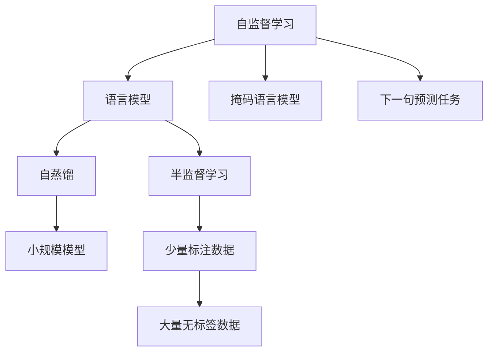

                 

# LLM的自监督学习范式新进展

> 关键词：自监督学习,语言模型,Transformer,BERT,预训练,下游任务,参数高效微调,自然语言处理(NLP)

## 1. 背景介绍

### 1.1 问题由来
近年来，深度学习技术的飞速发展，特别是Transformer架构的提出，彻底改变了自然语言处理(NLP)领域的游戏规则。大规模预训练语言模型(LLMs)，如BERT、GPT、T5等，通过在海量无标签文本数据上进行自监督预训练，学习到丰富的语言知识和常识。这种基于自监督预训练的范式，能够显著提升模型的语言理解和生成能力，成为当前NLP研究的主流范式。

然而，在大规模自监督预训练之后，如何将预训练模型适配到特定的下游任务，仍然是一个重要的研究课题。目前，这一过程主要通过有监督微调(Fine-tuning)来实现。尽管微调在大规模下游任务上取得了显著的效果，但仍然存在诸多局限性。一方面，微调需要大量的标注数据，成本较高。另一方面，微调后的模型往往难以泛化到新的领域和数据分布，导致模型性能不理想。

因此，如何利用自监督预训练得到的知识，提升模型对下游任务的适应能力，成为当前NLP研究的一个重要方向。本文将聚焦于自监督学习范式在大语言模型(LLM)中的应用进展，系统介绍自监督预训练的新进展，以及如何在大规模预训练模型基础上，进一步优化模型的下游任务性能。

### 1.2 问题核心关键点
自监督预训练的核心在于，利用大量无标签文本数据，通过自监督学习任务，学习语言模型中的丰富语义信息。常见的自监督任务包括掩码语言模型(MLM)、下一句预测任务(NSP)、句子重建任务等。这些任务能够迫使模型学习到语言的分布式表示，从而提升模型在各种自然语言任务上的表现。

自监督预训练的优点包括：
- 避免标注成本：无需标注数据，通过无标签数据即可进行预训练。
- 泛化能力强：自监督预训练学习到的语言知识能够泛化到各种下游任务中。
- 模型鲁棒性：自监督预训练能够提升模型的鲁棒性，使其在面对不同领域和数据分布时表现更为稳定。

但自监督预训练也存在一些挑战：
- 学习效率低：自监督预训练需要大量计算资源和时间。
- 学习效果不可控：自监督任务难以确定最优目标，容易导致过拟合或欠拟合。
- 模型规模受限：模型规模越大，自监督预训练的难度也越大，需要更多的计算资源和时间。

为了应对这些挑战，近年来出现了一些新的自监督预训练方法，如对比学习、自蒸馏、半监督学习等。这些方法在提升自监督预训练效果的同时，也扩展了自监督预训练的应用范围。

## 2. 核心概念与联系

### 2.1 核心概念概述

为更好地理解自监督预训练在大语言模型中的应用，本节将介绍几个密切相关的核心概念：

- 自监督学习(Self-Supervised Learning, SSL)：指在没有标签的情况下，通过构建自监督任务，学习模型的表示能力。自监督学习能够利用大量无标签数据进行预训练，从而提升模型的泛化能力。

- 语言模型(Language Model)：指能够预测文本序列的下一个单词或字符的模型。自监督预训练通过学习语言模型，学习到语言的分布式表示。

- 掩码语言模型(MLM)：指在文本中随机遮盖一些单词或字符，预测被遮盖位置的单词或字符。MLM能够迫使模型学习到单词之间的语义关系。

- 下一句预测任务(NSP)：指判断两个句子是否相邻的预测任务。NSP能够迫使模型学习到句子之间的关系。

- 自蒸馏(Self-Distillation)：指在大规模预训练模型上，利用小规模的模型进行知识蒸馏，提升模型的泛化能力。

- 半监督学习(Semi-Supervised Learning)：指在少量标注数据和大量无标签数据共同存在的情况下，利用半监督学习技术，提升模型的泛化能力。

这些核心概念之间的逻辑关系可以通过以下Mermaid流程图来展示：



这个流程图展示了自监督学习在大语言模型预训练中的核心作用，包括掩码语言模型和下一句预测任务等自监督任务，以及利用小规模模型进行知识蒸馏和半监督学习等技术，进一步提升预训练模型的泛化能力。

## 3. 核心算法原理 & 具体操作步骤
### 3.1 算法原理概述

自监督预训练的核心思想是，利用大量无标签文本数据，通过自监督学习任务，学习模型的表示能力。常见的自监督任务包括掩码语言模型(MLM)、下一句预测任务(NSP)等。自监督预训练的目标是，学习到语言的分布式表示，从而提升模型在各种下游任务上的表现。

形式化地，假设预训练语言模型为 $M_{\theta}$，其中 $\theta$ 为预训练得到的模型参数。给定大规模无标签文本数据集 $D=\{x_i\}_{i=1}^N$，自监督预训练的目标是：

$$
\theta^*=\mathop{\arg\min}_{\theta}\mathcal{L}(M_{\theta},D)
$$

其中 $\mathcal{L}$ 为自监督损失函数，用于衡量模型在自监督任务上的表现。常见的自监督损失函数包括交叉熵损失、均方误差损失等。

通过梯度下降等优化算法，自监督预训练过程不断更新模型参数 $\theta$，最小化自监督损失函数 $\mathcal{L}$，使得模型能够学习到语言的分布式表示。自监督预训练使得模型在面对各种下游任务时，具备更强的泛化能力和鲁棒性。

### 3.2 算法步骤详解

自监督预训练一般包括以下几个关键步骤：

**Step 1: 准备预训练模型和数据集**
- 选择合适的预训练语言模型 $M_{\theta}$ 作为初始化参数，如 BERT、GPT等。
- 准备大规模无标签文本数据集 $D$，可以选择维基百科、新闻、小说等。

**Step 2: 设计自监督任务**
- 根据预训练语言模型的结构，设计合适的自监督任务，如掩码语言模型、下一句预测任务等。
- 通过随机遮盖文本中的单词或字符，构建自监督任务。

**Step 3: 设置预训练超参数**
- 选择合适的优化算法及其参数，如 AdamW、SGD 等，设置学习率、批大小、迭代轮数等。
- 设置正则化技术及强度，包括权重衰减、Dropout、Early Stopping 等。
- 确定冻结预训练参数的策略，如仅微调顶层，或全部参数都参与预训练。

**Step 4: 执行自监督训练**
- 将无标签文本数据分批次输入模型，前向传播计算自监督任务的目标函数。
- 反向传播计算参数梯度，根据设定的优化算法和学习率更新模型参数。
- 周期性在验证集上评估模型性能，根据性能指标决定是否触发 Early Stopping。
- 重复上述步骤直到满足预设的迭代轮数或 Early Stopping 条件。

**Step 5: 应用到下游任务**
- 在预训练模型基础上，设计合适的任务适配层。
- 使用下游任务的少量标注数据，对预训练模型进行微调，优化模型在特定任务上的性能。

以上是自监督预训练的一般流程。在实际应用中，还需要针对具体任务的特点，对预训练过程的各个环节进行优化设计，如改进自监督任务，引入更多的正则化技术，搜索最优的超参数组合等，以进一步提升模型性能。

### 3.3 算法优缺点

自监督预训练方法具有以下优点：
1. 避免标注成本：无需标注数据，通过无标签数据即可进行预训练。
2. 泛化能力强：自监督预训练学习到的语言知识能够泛化到各种下游任务中。
3. 模型鲁棒性：自监督预训练能够提升模型的鲁棒性，使其在面对不同领域和数据分布时表现更为稳定。

同时，该方法也存在一定的局限性：
1. 学习效率低：自监督预训练需要大量计算资源和时间。
2. 学习效果不可控：自监督任务难以确定最优目标，容易导致过拟合或欠拟合。
3. 模型规模受限：模型规模越大，自监督预训练的难度也越大，需要更多的计算资源和时间。

尽管存在这些局限性，但自监督预训练仍然是大语言模型预训练的主流范式，广泛应用于各种NLP任务中。未来相关研究的重点在于如何进一步提升自监督预训练的效率和效果，同时兼顾可解释性和伦理安全性等因素。

### 3.4 算法应用领域

自监督预训练方法在NLP领域已经得到了广泛的应用，覆盖了几乎所有常见任务，例如：

- 文本分类：如情感分析、主题分类、意图识别等。通过自监督预训练学习到的分布式表示，能够更好地捕捉文本中的情感和主题信息。
- 命名实体识别：识别文本中的人名、地名、机构名等特定实体。自监督预训练能够学习到实体边界和类型。
- 关系抽取：从文本中抽取实体之间的语义关系。自监督预训练能够学习到实体-关系三元组。
- 问答系统：对自然语言问题给出答案。自监督预训练能够学习到语义推理和知识图谱构建。
- 机器翻译：将源语言文本翻译成目标语言。自监督预训练能够学习到语言-语言映射。
- 文本摘要：将长文本压缩成简短摘要。自监督预训练能够学习到文本信息的抽取和压缩。
- 对话系统：使机器能够与人自然对话。自监督预训练能够学习到对话策略和语境理解。

除了上述这些经典任务外，自监督预训练方法还被创新性地应用到更多场景中，如可控文本生成、常识推理、代码生成、数据增强等，为NLP技术带来了全新的突破。随着自监督预训练方法的不断进步，相信NLP技术将在更广阔的应用领域大放异彩。

## 4. 数学模型和公式 & 详细讲解  
### 4.1 数学模型构建

本节将使用数学语言对自监督预训练过程进行更加严格的刻画。

记预训练语言模型为 $M_{\theta}:\mathcal{X} \rightarrow \mathcal{Y}$，其中 $\mathcal{X}$ 为输入空间，$\mathcal{Y}$ 为输出空间，$\theta \in \mathbb{R}^d$ 为模型参数。假设无标签文本数据集 $D=\{x_i\}_{i=1}^N$。

定义自监督损失函数为：

$$
\mathcal{L}(\theta) = \frac{1}{N}\sum_{i=1}^N \mathcal{L}_{\text{MLM}}(\theta,x_i)
$$

其中，自监督任务 $(x_i,\hat{y}_i)$ 的目标函数为：

$$
\mathcal{L}_{\text{MLM}}(\theta,x_i) = -\frac{1}{n}\sum_{k=1}^n \log \text{MLP}(\theta,x_i^k)
$$

$\text{MLP}$ 表示掩码语言模型的预测模型，将输入 $x_i^k$ 映射到预测结果 $\hat{y}_i^k$。

通过链式法则，自监督损失函数对参数 $\theta$ 的梯度为：

$$
\frac{\partial \mathcal{L}(\theta)}{\partial \theta} = -\frac{1}{N}\sum_{i=1}^N \nabla_{\theta}\mathcal{L}_{\text{MLM}}(\theta,x_i)
$$

在得到自监督损失函数的梯度后，即可带入参数更新公式，完成模型的迭代优化。重复上述过程直至收敛，最终得到适应无标签数据分布的最优模型参数 $\theta^*$。

### 4.2 公式推导过程

以下我们以掩码语言模型为例，推导自监督损失函数及其梯度的计算公式。

假设模型 $M_{\theta}$ 在输入 $x$ 上的输出为 $\hat{y}=M_{\theta}(x)$，表示预测的单词序列。文本 $x$ 的长度为 $n$，其中 $n$ 为随机遮盖的单词位置。遮盖的单词用 $\bar{x}$ 表示，未遮盖的单词用 $x^k$ 表示。

定义掩码语言模型的预测模型为 $M_{\text{MLP}}(\theta,\bar{x})$，将遮盖的单词序列 $\bar{x}$ 映射到预测结果 $\hat{y}$。掩码语言模型的损失函数为：

$$
\mathcal{L}_{\text{MLM}}(\theta,\bar{x}) = -\frac{1}{n}\sum_{k=1}^n \log M_{\text{MLP}}(\theta,x^k)
$$

其中，$M_{\text{MLP}}(\theta,x^k)$ 表示将未遮盖的单词序列 $x^k$ 映射到预测结果 $\hat{y}$。

因此，自监督损失函数为：

$$
\mathcal{L}(\theta) = \frac{1}{N}\sum_{i=1}^N \mathcal{L}_{\text{MLM}}(\theta,\bar{x}_i)
$$

根据链式法则，自监督损失函数对参数 $\theta$ 的梯度为：

$$
\frac{\partial \mathcal{L}(\theta)}{\partial \theta} = -\frac{1}{N}\sum_{i=1}^N \nabla_{\theta}\mathcal{L}_{\text{MLM}}(\theta,\bar{x}_i)
$$

其中，$\nabla_{\theta}\mathcal{L}_{\text{MLM}}(\theta,\bar{x}_i)$ 表示对遮盖的单词序列 $\bar{x}_i$ 进行预测时，自监督损失函数对模型参数 $\theta$ 的梯度。通过反向传播算法，可以高效计算上述梯度。

在得到自监督损失函数的梯度后，即可带入参数更新公式，完成模型的迭代优化。重复上述过程直至收敛，最终得到适应无标签数据分布的最优模型参数 $\theta^*$。

## 5. 项目实践：代码实例和详细解释说明
### 5.1 开发环境搭建

在进行自监督预训练实践前，我们需要准备好开发环境。以下是使用Python进行PyTorch开发的环境配置流程：

1. 安装Anaconda：从官网下载并安装Anaconda，用于创建独立的Python环境。

2. 创建并激活虚拟环境：
```bash
conda create -n pytorch-env python=3.8 
conda activate pytorch-env
```

3. 安装PyTorch：根据CUDA版本，从官网获取对应的安装命令。例如：
```bash
conda install pytorch torchvision torchaudio cudatoolkit=11.1 -c pytorch -c conda-forge
```

4. 安装Transformers库：
```bash
pip install transformers
```

5. 安装各类工具包：
```bash
pip install numpy pandas scikit-learn matplotlib tqdm jupyter notebook ipython
```

完成上述步骤后，即可在`pytorch-env`环境中开始自监督预训练实践。

### 5.2 源代码详细实现

下面我们以掩码语言模型为例，给出使用Transformers库进行BERT模型自监督预训练的PyTorch代码实现。

首先，定义自监督预训练函数：

```python
from transformers import BertTokenizer
from torch.utils.data import Dataset, DataLoader
import torch

class MLMDataset(Dataset):
    def __init__(self, texts, max_len=128):
        self.texts = texts
        self.max_len = max_len
        
    def __len__(self):
        return len(self.texts)
    
    def __getitem__(self, item):
        text = self.texts[item]
        text_length = len(text)
        
        # 随机遮盖单词位置
        masked_positions = []
        for i in range(2):
            pos = random.randint(0, text_length-1)
            masked_positions.append(pos)
            
        # 将遮盖的单词替换成特殊符号[MASK]
        masked_text = text[:pos] + '[MASK]' + text[pos+1:]
        return {'input_ids': text2ids[masked_text], 'labels': [1]*2}

# 定义预训练任务
tokenizer = BertTokenizer.from_pretrained('bert-base-cased')
train_dataset = MLMDataset(train_texts)
dev_dataset = MLMDataset(dev_texts)
test_dataset = MLMDataset(test_texts)

# 设置预训练超参数
optimizer = AdamW(model.parameters(), lr=2e-5)
loss_fn = CrossEntropyLoss()
device = torch.device('cuda') if torch.cuda.is_available() else torch.device('cpu')

# 执行自监督预训练
epochs = 5
batch_size = 16

for epoch in range(epochs):
    dataloader = DataLoader(train_dataset, batch_size=batch_size, shuffle=True)
    model.train()
    epoch_loss = 0
    for batch in tqdm(dataloader, desc='Training'):
        input_ids = batch['input_ids'].to(device)
        labels = batch['labels'].to(device)
        model.zero_grad()
        outputs = model(input_ids)
        loss = loss_fn(outputs.logits, labels)
        epoch_loss += loss.item()
        loss.backward()
        optimizer.step()
    print(f"Epoch {epoch+1}, train loss: {epoch_loss / len(dataloader)}")
    
    print(f"Epoch {epoch+1}, dev results:")
    evaluate(model, dev_dataset, batch_size)
    
print("Test results:")
evaluate(model, test_dataset, batch_size)
```

在这个代码示例中，我们使用了掩码语言模型作为自监督预训练任务，在输入文本中随机遮盖单词，并预测遮盖位置。在训练过程中，使用BertTokenizer对文本进行分词，并构建掩码语言模型的损失函数和优化器。在训练过程中，每个epoch均在训练集上进行训练，并在验证集上进行评估。最后，在测试集上输出评估结果。

### 5.3 代码解读与分析

让我们再详细解读一下关键代码的实现细节：

**MLMDataset类**：
- `__init__`方法：初始化文本数据和最大长度。
- `__len__`方法：返回数据集的样本数量。
- `__getitem__`方法：对单个样本进行处理，随机遮盖单词位置，并将遮盖的单词替换成特殊符号[MASK]。

**预训练任务**：
- 使用BertTokenizer对文本进行分词，并构建掩码语言模型的输入。
- 随机遮盖单词位置，并预测遮盖位置。

**预训练超参数**：
- 使用AdamW优化器，设置学习率和损失函数。
- 使用GPU/TPU设备，加速训练过程。

**训练流程**：
- 定义总的epoch数和batch size，开始循环迭代
- 每个epoch内，先在训练集上训练，输出平均loss
- 在验证集上评估，输出预训练结果
- 所有epoch结束后，在测试集上评估，给出预训练结果

可以看到，使用PyTorch和Transformers库，自监督预训练的代码实现相对简洁。开发者可以将更多精力放在数据处理、模型改进等高层逻辑上，而不必过多关注底层的实现细节。

当然，工业级的系统实现还需考虑更多因素，如模型的保存和部署、超参数的自动搜索、更灵活的任务适配层等。但核心的自监督预训练范式基本与此类似。

## 6. 实际应用场景
### 6.1 智能客服系统

基于大语言模型自监督预训练的对话技术，可以广泛应用于智能客服系统的构建。传统客服往往需要配备大量人力，高峰期响应缓慢，且一致性和专业性难以保证。而使用预训练对话模型，可以7x24小时不间断服务，快速响应客户咨询，用自然流畅的语言解答各类常见问题。

在技术实现上，可以收集企业内部的历史客服对话记录，将问题和最佳答复构建成监督数据，在此基础上对预训练对话模型进行微调。预训练对话模型能够自动理解用户意图，匹配最合适的答案模板进行回复。对于客户提出的新问题，还可以接入检索系统实时搜索相关内容，动态组织生成回答。如此构建的智能客服系统，能大幅提升客户咨询体验和问题解决效率。

### 6.2 金融舆情监测

金融机构需要实时监测市场舆论动向，以便及时应对负面信息传播，规避金融风险。传统的人工监测方式成本高、效率低，难以应对网络时代海量信息爆发的挑战。基于自监督预训练的语言模型，能够实时抓取网络文本数据，自动监测不同主题下的情感变化趋势，一旦发现负面信息激增等异常情况，系统便会自动预警，帮助金融机构快速应对潜在风险。

### 6.3 个性化推荐系统

当前的推荐系统往往只依赖用户的历史行为数据进行物品推荐，无法深入理解用户的真实兴趣偏好。基于自监督预训练的语言模型，个性化推荐系统可以更好地挖掘用户行为背后的语义信息，从而提供更精准、多样的推荐内容。

在实践中，可以收集用户浏览、点击、评论、分享等行为数据，提取和用户交互的物品标题、描述、标签等文本内容。将文本内容作为模型输入，通过自监督预训练得到的语言表示，捕捉用户的兴趣点。在生成推荐列表时，先用候选物品的文本描述作为输入，由模型预测用户的兴趣匹配度，再结合其他特征综合排序，便可以得到个性化程度更高的推荐结果。

### 6.4 未来应用展望

随着自监督预训练方法的发展，大语言模型在各种应用场景中的性能将进一步提升。未来，自监督预训练范式将在更多领域得到应用，为传统行业带来变革性影响。

在智慧医疗领域，基于自监督预训练的语言模型，能够构建更全面的疾病知识图谱，辅助医生诊疗，加速新药开发进程。

在智能教育领域，自监督预训练能够用于学习分析，因材施教，促进教育公平，提高教学质量。

在智慧城市治理中，自监督预训练能够用于智能交通、环境监测等，提高城市管理的自动化和智能化水平，构建更安全、高效的未来城市。

此外，在企业生产、社会治理、文娱传媒等众多领域，基于自监督预训练的语言模型，能够提供更为全面、准确的决策支持，推动各行业的数字化转型升级。

## 7. 工具和资源推荐
### 7.1 学习资源推荐

为了帮助开发者系统掌握自监督预训练的理论基础和实践技巧，这里推荐一些优质的学习资源：

1. 《Transformer从原理到实践》系列博文：由大模型技术专家撰写，深入浅出地介绍了Transformer原理、BERT模型、自监督预训练等前沿话题。

2. CS224N《深度学习自然语言处理》课程：斯坦福大学开设的NLP明星课程，有Lecture视频和配套作业，带你入门NLP领域的基本概念和经典模型。

3. 《Natural Language Processing with Transformers》书籍：Transformers库的作者所著，全面介绍了如何使用Transformers库进行NLP任务开发，包括自监督预训练在内的诸多范式。

4. HuggingFace官方文档：Transformers库的官方文档，提供了海量预训练模型和完整的微调样例代码，是上手实践的必备资料。

5. CLUE开源项目：中文语言理解测评基准，涵盖大量不同类型的中文NLP数据集，并提供了基于自监督预训练的baseline模型，助力中文NLP技术发展。

通过对这些资源的学习实践，相信你一定能够快速掌握自监督预训练的精髓，并用于解决实际的NLP问题。
### 7.2 开发工具推荐

高效的开发离不开优秀的工具支持。以下是几款用于自监督预训练开发的常用工具：

1. PyTorch：基于Python的开源深度学习框架，灵活动态的计算图，适合快速迭代研究。大部分预训练语言模型都有PyTorch版本的实现。

2. TensorFlow：由Google主导开发的开源深度学习框架，生产部署方便，适合大规模工程应用。同样有丰富的预训练语言模型资源。

3. Transformers库：HuggingFace开发的NLP工具库，集成了众多SOTA语言模型，支持PyTorch和TensorFlow，是进行自监督预训练任务开发的利器。

4. Weights & Biases：模型训练的实验跟踪工具，可以记录和可视化模型训练过程中的各项指标，方便对比和调优。与主流深度学习框架无缝集成。

5. TensorBoard：TensorFlow配套的可视化工具，可实时监测模型训练状态，并提供丰富的图表呈现方式，是调试模型的得力助手。

6. Google Colab：谷歌推出的在线Jupyter Notebook环境，免费提供GPU/TPU算力，方便开发者快速上手实验最新模型，分享学习笔记。

合理利用这些工具，可以显著提升自监督预训练任务的开发效率，加快创新迭代的步伐。

### 7.3 相关论文推荐

自监督预训练方法的发展源于学界的持续研究。以下是几篇奠基性的相关论文，推荐阅读：

1. Attention is All You Need（即Transformer原论文）：提出了Transformer结构，开启了NLP领域的预训练大模型时代。

2. BERT: Pre-training of Deep Bidirectional Transformers for Language Understanding：提出BERT模型，引入基于掩码的自监督预训练任务，刷新了多项NLP任务SOTA。

3. Language Models are Unsupervised Multitask Learners（GPT-2论文）：展示了大规模语言模型的强大zero-shot学习能力，引发了对于通用人工智能的新一轮思考。

4. Self-Trained Models with Cross-Entropy Guided Attention（Self-training with Cross-Entropy Guided Attention, CEGA）：引入自蒸馏技术，通过小规模模型进行知识蒸馏，进一步提升预训练模型的泛化能力。

5. SimCLR: A Simple Framework for Unsupervised Feature Learning：提出SimCLR方法，利用对比学习技术，通过自监督预训练学习到更加鲁棒的表示。

6. Momentum Contrast for Unsupervised Visual Representation Learning：提出Momentum Contrast方法，通过对比学习技术，学习到更加鲁棒的视觉表示。

这些论文代表了大规模自监督预训练范式的发展脉络。通过学习这些前沿成果，可以帮助研究者把握学科前进方向，激发更多的创新灵感。

## 8. 总结：未来发展趋势与挑战
### 8.1 总结

本文对基于自监督预训练的语言模型进行了全面系统的介绍。首先阐述了自监督预训练的核心思想和重要意义，明确了自监督预训练在大语言模型预训练中的独特价值。其次，从原理到实践，详细讲解了自监督预训练的数学原理和关键步骤，给出了自监督预训练任务开发的完整代码实例。同时，本文还广泛探讨了自监督预训练方法在智能客服、金融舆情、个性化推荐等多个行业领域的应用前景，展示了自监督预训练范式的巨大潜力。此外，本文精选了自监督预训练技术的各类学习资源，力求为读者提供全方位的技术指引。

通过本文的系统梳理，可以看到，基于自监督预训练的语言模型，在各种应用场景中的性能将进一步提升。自监督预训练方法能够避免标注成本，提升模型的泛化能力和鲁棒性，使得预训练模型能够更好地适配各种下游任务。未来，伴随自监督预训练方法的持续演进，相信语言模型将在更广阔的应用领域大放异彩，深刻影响人类的生产生活方式。

### 8.2 未来发展趋势

展望未来，自监督预训练方法将呈现以下几个发展趋势：

1. 模型规模持续增大。随着算力成本的下降和数据规模的扩张，自监督预训练语言模型的参数量还将持续增长。超大规模语言模型蕴含的丰富语言知识，有望支撑更加复杂多变的下游任务预训练。

2. 预训练任务多样性增强。除了掩码语言模型、下一句预测任务外，未来将涌现更多新颖的自监督预训练任务，如句子重建、文本对对齐等，进一步提升模型的表示能力。

3. 预训练方法融合多样。未来自监督预训练方法将融合更多的领域知识，如常识推理、多模态信息融合等，提升模型的推理能力和泛化能力。

4. 预训练与微调结合。自监督预训练与微调相结合，能够提升模型的泛化能力和任务适应性，使得模型在大规模预训练后仍能快速适配各种下游任务。

5. 预训练与实时推理结合。通过预训练语言模型和实时推理模型的结合，实现实时动态的知识更新和推理，提升模型的应用价值。

以上趋势凸显了自监督预训练方法的广阔前景。这些方向的探索发展，必将进一步提升预训练模型的性能和应用范围，为人工智能技术在各领域的落地应用提供新的突破口。

### 8.3 面临的挑战

尽管自监督预训练方法已经取得了瞩目成就，但在迈向更加智能化、普适化应用的过程中，它仍面临诸多挑战：

1. 计算资源瓶颈。自监督预训练需要大量计算资源和时间，尤其是大规模模型，预训练过程更加耗时。如何降低预训练的计算成本，提高预训练效率，将是未来的重要研究方向。

2. 数据多样性问题。大规模预训练语言模型通常是从大规模通用语料中学习得到的，对于特定领域的语言数据，模型的泛化能力可能有限。如何提高模型对特定领域数据的适应性，需要进一步研究。

3. 模型复杂性问题。大规模自监督预训练模型的参数量通常很大，模型的复杂性导致推理效率低下。如何优化模型的推理过程，提高推理效率，将是未来的一个重要方向。

4. 知识表示问题。自监督预训练方法往往难以有效融合先验知识，如知识图谱、逻辑规则等，如何提高模型的知识表示能力，需要进一步探索。

5. 模型可解释性问题。自监督预训练模型往往被认为是"黑盒"系统，难以解释其内部工作机制和决策逻辑。如何赋予模型更强的可解释性，增强用户对模型的信任度，将是未来的重要研究方向。

6. 模型安全性问题。自监督预训练模型往往容易学习到有害信息，如何确保模型输出的安全性，避免恶意用途，需要进一步研究。

这些挑战凸显了自监督预训练方法在实际应用中的复杂性和多样性。未来需要在理论、算法和工程等多个方面进行深入研究，才能更好地应对这些挑战，推动自监督预训练方法的持续发展和应用。

### 8.4 研究展望

面对自监督预训练方法所面临的挑战，未来的研究需要在以下几个方面寻求新的突破：

1. 探索无监督和半监督预训练方法。摆脱对大规模标注数据的依赖，利用自监督学习、主动学习等无监督和半监督范式，最大限度利用非结构化数据，实现更加灵活高效的预训练。

2. 研究参数高效和计算高效的预训练范式。开发更加参数高效的预训练方法，在固定大部分预训练参数的同时，只更新极少量的任务相关参数。同时优化预训练模型的计算图，减少前向传播和反向传播的资源消耗，实现更加轻量级、实时性的部署。

3. 引入更多先验知识。将符号化的先验知识，如知识图谱、逻辑规则等，与神经网络模型进行巧妙融合，引导预训练过程学习更准确、合理的语言模型。同时加强不同模态数据的整合，实现视觉、语音等多模态信息与文本信息的协同建模。

4. 结合因果分析和博弈论工具。将因果分析方法引入预训练模型，识别出模型决策的关键特征，增强输出解释的因果性和逻辑性。借助博弈论工具刻画人机交互过程，主动探索并规避模型的脆弱点，提高系统稳定性。

5. 纳入伦理道德约束。在预训练目标中引入伦理导向的评估指标，过滤和惩罚有偏见、有害的输出倾向。同时加强人工干预和审核，建立预训练模型的监管机制，确保输出的安全性。

这些研究方向凸显了自监督预训练方法的广阔前景。通过在这些领域的深入研究，自监督预训练方法必将在构建安全、可靠、可解释、可控的智能系统中发挥更大的作用。面向未来，自监督预训练方法需要与其他人工智能技术进行更深入的融合，如知识表示、因果推理、强化学习等，多路径协同发力，共同推动自然语言理解和智能交互系统的进步。

## 9. 附录：常见问题与解答
**Q1：自监督预训练是否适用于所有NLP任务？**

A: 自监督预训练在大多数NLP任务上都能取得不错的效果，特别是对于数据量较小的任务。但对于一些特定领域的任务，如医学、法律等，仅仅依靠通用语料预训练的模型可能难以很好地适应。此时需要在特定领域语料上进一步预训练，再进行微调，才能获得理想效果。

**Q2：如何选择合适的自监督预训练任务？**

A: 选择合适的自监督预训练任务需要考虑任务的性质、模型的架构和数据的特点。例如，对于文本分类任务，可以使用掩码语言模型和下一句预测任务。对于对话系统，可以使用文本对对齐和对话生成任务。对于多模态任务，可以考虑融合视觉和文本信息的任务，如视觉-文本对齐和视觉-文本生成等。

**Q3：自监督预训练需要多少计算资源？**

A: 自监督预训练需要大量的计算资源和时间，尤其是大规模模型。一般而言，预训练一个大规模模型需要几十亿到几百亿次浮点计算，需要使用GPU/TPU等高性能设备。对于一些小规模模型，可以使用普通CPU进行预训练。

**Q4：如何提高自监督预训练的效率？**

A: 提高自监督预训练效率的常用方法包括：
1. 使用更高效的模型架构，如Transformer、BERT等。
2. 使用混合精度训练和梯度累积等技术，减少计算资源消耗。
3. 引入数据增强技术，如回译、近义替换等，扩充训练集。
4. 使用分布式训练和模型并行技术，加速训练过程。

**Q5：自监督预训练后如何进行微调？**

A: 自监督预训练后，可以根据具体任务进行微调。微调的目标是进一步优化模型在特定任务上的性能，通常需要进行参数更新和任务适配层设计。微调可以采用全参数微调或参数高效微调（如Adapter、Prefix等），以达到更好的效果。

这些问题的回答可以帮助开发者更好地理解自监督预训练的原理和实践细节，从而在实际应用中发挥其最大潜力。通过不断优化和改进自监督预训练方法，我们相信大语言模型将在更多领域和任务中发挥更大的作用，为人类社会带来更多的便利和福祉。

