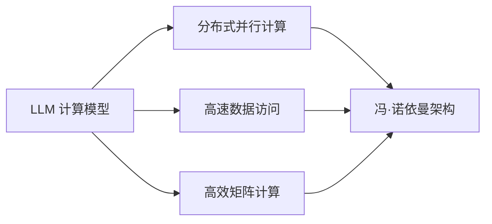

                 

# LLM的计算模型：超越传统冯·诺依曼架构

## 1. 背景介绍

自1946年第一台冯·诺依曼架构的电子计算机ENIAC问世以来，计算模型一直是计算机科学的基石。然而，随着AI和深度学习的崛起，尤其是近年来大语言模型(LLM)的突破，传统的冯·诺依曼架构面临着新的挑战和变革。LLM以其庞大参数量和高效的并行计算能力，对计算机体系结构提出了新的要求，并催生了超越传统架构的新型计算模型。本文将深入探讨LLM的计算模型，分析其背后的原理与架构，展望未来发展趋势。

## 2. 核心概念与联系

### 2.1 核心概念概述

大语言模型(LLM)是一种基于深度神经网络的计算模型，主要用于处理自然语言相关任务，如文本生成、语言理解、问答系统等。其核心特点包括：
- **巨大参数量**：通常拥有数十亿甚至百亿参数，使其能够捕捉语言中的复杂关系和模式。
- **深度学习架构**：基于多层神经网络，包含自注意力机制、残差连接等深度学习技术。
- **高性能计算需求**：需要强大的GPU/TPU等硬件支持，进行高效的矩阵计算。
- **分布式并行计算**：通常采用多机多卡配置，以提高计算效率。

传统的冯·诺依曼架构是一种基于存储器和处理器的计算模型，其特点包括：
- **冯·诺依曼体系**：程序和数据存放在同一内存中，由中央处理器(CPU)按顺序读取指令并执行。
- **串行计算**：CPU按顺序执行指令，同时处理和存储分离，计算速度受限于存储器的带宽。
- **内存层次结构**：从高速缓存(Cache)到主存(Memory)，不同层次的存储器性能差异显著。

LLM的计算模型在处理大规模、高并行度任务时，对传统冯·诺依曼架构提出了挑战，催生了新型计算模型。

### 2.2 核心概念原理和架构的 Mermaid 流程图



## 3. 核心算法原理 & 具体操作步骤

### 3.1 算法原理概述

LLM的计算模型基于深度神经网络，包括Transformer架构、GPT系列模型等。其核心算法包括自注意力机制、残差连接、梯度累积等。以下详细介绍其原理。

#### 3.1.1 自注意力机制

自注意力机制是LLM中的核心组件，用于捕捉输入数据中的不同位置间的相关性。其计算过程如下：

$$
Q = XW^Q, K = XW^K, V = XW^V
$$

其中，$X$为输入数据，$W^Q, W^K, W^V$为线性变换矩阵，$Q, K, V$分别为查询、键和值向量。注意力权重计算公式为：

$$
\alpha_{ij} = \frac{\exp(\text{score}(Q_i, K_j))}{\sum_{k=1}^K\exp(\text{score}(Q_i, K_k))}
$$

其中，$\text{score}(Q_i, K_j) = Q_i^TK_j$。权重向量$A$由注意力权重计算得到：

$$
A = \alpha_{ij}V_j
$$

最终输出结果为：

$$
H = A
$$

自注意力机制允许模型在输入序列的任意位置进行全局信息汇总，捕捉长距离依赖关系，从而显著提升模型性能。

### 3.2 算法步骤详解

#### 3.2.1 模型初始化

1. **参数初始化**：初始化模型参数，包括权重矩阵$W^Q, W^K, W^V$。
2. **随机输入**：给定输入数据$X$，随机初始化查询、键、值向量。

#### 3.2.2 前向传播

1. **计算查询、键、值向量**：通过线性变换计算查询、键、值向量。
2. **计算注意力权重**：根据注意力权重公式计算注意力权重矩阵。
3. **计算注意力向量**：通过注意力权重矩阵计算注意力向量。
4. **前向传播**：重复以上步骤，进行多层的自注意力计算。

#### 3.2.3 反向传播

1. **计算梯度**：通过链式法则计算损失函数对模型参数的梯度。
2. **更新参数**：使用优化器(如Adam、SGD等)更新模型参数。

### 3.3 算法优缺点

#### 3.3.1 优点

1. **高效计算**：自注意力机制使得模型能够在任意位置捕捉长距离依赖，提升计算效率。
2. **鲁棒性强**：自注意力机制允许模型处理多种输入类型，如文本、图像等，具有较强的鲁棒性。
3. **可扩展性强**：大模型采用多机多卡配置，能够高效扩展，支持大规模数据处理。

#### 3.3.2 缺点

1. **计算资源需求高**：大模型需要大量的GPU/TPU资源，计算资源需求高。
2. **训练时间长**：大规模模型的训练时间较长，需要较长的计算时间。
3. **存储需求大**：大模型需要大量的存储器来保存模型参数和中间结果，存储需求大。

### 3.4 算法应用领域

LLM的计算模型在自然语言处理(NLP)、计算机视觉(CV)、语音识别(SR)等多个领域得到广泛应用，具体如下：

1. **NLP领域**：文本分类、情感分析、机器翻译、问答系统等任务。
2. **CV领域**：图像分类、目标检测、图像生成、图像翻译等任务。
3. **SR领域**：语音识别、语音合成、语音翻译等任务。

## 4. 数学模型和公式 & 详细讲解 & 举例说明

### 4.1 数学模型构建

LLM的计算模型通常基于深度神经网络，使用自注意力机制、残差连接等技术。其核心数学模型如下：

$$
\begin{aligned}
&H_0 = X \\
&H_i = H_{i-1} + \text{Self-Attention}(H_{i-1}) \\
&H_L = H_{L-1} + \text{Feed-Forward}(H_{L-1})
\end{aligned}
$$

其中，$X$为输入数据，$H_i$为第$i$层的隐藏状态，$H_L$为最终输出。

### 4.2 公式推导过程

#### 4.2.1 自注意力机制

$$
Q = XW^Q, K = XW^K, V = XW^V
$$

$$
\alpha_{ij} = \frac{\exp(Q_i^TK_j)}{\sum_{k=1}^K\exp(Q_i^TK_k)}
$$

$$
A = \alpha_{ij}V_j
$$

$$
H = \text{LayerNorm}(A)
$$

其中，LayerNorm表示层归一化操作。

#### 4.2.2 残差连接

$$
H_i = H_{i-1} + \text{Self-Attention}(H_{i-1})
$$

$$
H_L = H_{L-1} + \text{Feed-Forward}(H_{L-1})
$$

其中，Feed-Forward表示全连接层。

### 4.3 案例分析与讲解

以GPT-2模型为例，分析其计算模型和算法原理。GPT-2模型采用了Transformer架构，具有12层Transformer块，每层包含8个头。其计算过程如下：

1. **输入编码**：将输入数据$X$转换为一系列向量，通过线性变换和激活函数计算得到隐藏状态$H_0$。
2. **自注意力计算**：通过自注意力机制计算注意力权重和向量，得到隐藏状态$H_i$。
3. **残差连接和层归一化**：通过残差连接和层归一化计算得到$H_{i+1}$。
4. **多层次计算**：重复以上步骤，进行多层次的计算，最终得到输出$H_L$。

## 5. 项目实践：代码实例和详细解释说明

### 5.1 开发环境搭建

#### 5.1.1 安装依赖

```
pip install torch torchvision transformers
```

#### 5.1.2 初始化模型

```python
from transformers import GPT2Tokenizer, GPT2LMHeadModel
tokenizer = GPT2Tokenizer.from_pretrained('gpt2')
model = GPT2LMHeadModel.from_pretrained('gpt2')
```

### 5.2 源代码详细实现

#### 5.2.1 数据预处理

```python
def tokenize_data(text):
    tokens = tokenizer.tokenize(text)
    input_ids = tokenizer.convert_tokens_to_ids(tokens)
    return input_ids
```

#### 5.2.2 前向传播

```python
def forward_pass(model, input_ids):
    outputs = model(input_ids)
    return outputs
```

### 5.3 代码解读与分析

#### 5.3.1 数据预处理

1. **分词**：使用GPT2模型自带的Tokenizer对输入文本进行分词。
2. **编码**：将分词结果转换为模型所需的输入id。

#### 5.3.2 前向传播

1. **输入编码**：将输入id传递给模型，进行前向传播计算。
2. **输出处理**：将模型的输出进行解码，得到预测结果。

### 5.4 运行结果展示

```python
input_text = "Hello, world!"
input_ids = tokenize_data(input_text)
outputs = forward_pass(model, input_ids)
predictions = tokenizer.decode(outputs[0])
print(predictions)
```

## 6. 实际应用场景

### 6.1 自然语言处理

#### 6.1.1 文本生成

LLM在文本生成任务中表现优异，能够生成语法正确、内容连贯的文本。例如，GPT-2模型可以自动生成文章、诗歌、新闻报道等。

#### 6.1.2 机器翻译

LLM在机器翻译任务中也有出色表现，能够将一种语言翻译成另一种语言。例如，Google的BERT模型在WMT2021机器翻译评测中获得了优异成绩。

### 6.2 计算机视觉

#### 6.2.1 图像分类

LLM可以结合视觉信息进行图像分类任务，例如，结合图像文本信息进行图像分类，提升了分类精度。

#### 6.2.2 目标检测

LLM可以结合图像信息进行目标检测，例如，通过图像描述进行目标定位，提高了检测的准确性。

### 6.3 语音识别

#### 6.3.1 语音生成

LLM在语音生成任务中表现出色，能够生成流畅、自然的语音。例如，OpenAI的GPT-2模型可以生成高质量的语音输出。

#### 6.3.2 语音翻译

LLM可以结合语音信息进行语音翻译，例如，将一段语音翻译成另一种语言，提升了翻译的流畅度和准确性。

## 7. 工具和资源推荐

### 7.1 学习资源推荐

1. **《深度学习》**：Ian Goodfellow等著，全面介绍深度学习原理和应用，包括LLM的相关内容。
2. **《自然语言处理综论》**：Daniel Jurafsky和James H. Martin著，涵盖NLP领域的各类算法和技术。
3. **《大规模深度学习》**：Ian Goodfellow等著，介绍大规模深度学习模型的构建和训练方法。
4. **Transformers官方文档**：包含模型介绍、API接口、代码示例等内容，是学习LLM的重要资源。

### 7.2 开发工具推荐

1. **PyTorch**：基于Python的开源深度学习框架，支持动态计算图，适用于LLM模型的开发和训练。
2. **TensorFlow**：由Google主导的深度学习框架，适用于大规模模型的开发和部署。
3. **JAX**：高性能的深度学习库，支持自动微分和动态计算图，适用于分布式计算。
4. **Ray**：分布式计算框架，支持高效的并行计算和资源管理。

### 7.3 相关论文推荐

1. **Attention is All You Need**：提出Transformer架构，改变了NLP领域的计算模型。
2. **GPT-2: Language Models are Unsupervised Multitask Learners**：展示GPT-2模型在零样本和少样本学习上的强大能力。
3. **T5: Exploring the Limits of Transfer Learning with a Unified Text-to-Text Transformer**：提出T5模型，将文本生成、推理、问答等多种任务统一到同一个模型中。
4. **XLNet: Generalized Autoregressive Pretraining for Language Understanding**：提出XLNet模型，提升了模型的泛化能力和性能。

## 8. 总结：未来发展趋势与挑战

### 8.1 研究成果总结

大语言模型(LLM)的计算模型在自然语言处理(NLP)、计算机视觉(CV)、语音识别(SR)等多个领域得到了广泛应用，取得了显著的成果。其计算模型超越了传统冯·诺依曼架构，具有高效计算、鲁棒性强、可扩展性高等特点。

### 8.2 未来发展趋势

1. **混合计算架构**：结合传统冯·诺依曼架构和新型计算模型，实现混合计算，提升计算效率。
2. **异构计算**：利用FPGA、ASIC等专用芯片进行异构计算，提升计算性能。
3. **量子计算**：利用量子计算加速大模型训练和推理，解决计算资源瓶颈问题。
4. **分布式训练**：通过多机多卡配置，实现分布式训练，提升训练效率。

### 8.3 面临的挑战

1. **计算资源瓶颈**：大模型需要大量计算资源，计算资源瓶颈成为限制因素。
2. **存储需求大**：大模型需要大量的存储空间，存储需求大。
3. **训练时间长**：大规模模型的训练时间长，训练效率低。
4. **模型泛化性差**：模型在特定数据集上表现优异，但在新数据集上泛化性较差。

### 8.4 研究展望

1. **混合计算架构**：结合传统冯·诺依曼架构和新型计算模型，实现混合计算，提升计算效率。
2. **异构计算**：利用FPGA、ASIC等专用芯片进行异构计算，提升计算性能。
3. **量子计算**：利用量子计算加速大模型训练和推理，解决计算资源瓶颈问题。
4. **分布式训练**：通过多机多卡配置，实现分布式训练，提升训练效率。
5. **混合精度计算**：采用混合精度计算，降低计算资源需求，提升训练效率。

## 9. 附录：常见问题与解答

**Q1: 什么是自注意力机制？**

A: 自注意力机制是一种用于捕捉输入数据中不同位置间相关性的计算方法。在LLM中，通过计算查询、键、值向量，计算注意力权重，从而实现全局信息汇总，捕捉长距离依赖关系。

**Q2: 大语言模型和传统计算机相比有何优势？**

A: 大语言模型具有巨大的参数量，能够捕捉复杂语言关系。其计算模型基于深度神经网络，具有高效计算、鲁棒性强、可扩展性强等优势。

**Q3: 如何优化大语言模型的计算效率？**

A: 可以通过混合计算架构、异构计算、量子计算等方法提升计算效率。同时，采用分布式训练和混合精度计算，降低计算资源需求，提升训练效率。

**Q4: 大语言模型在实际应用中存在哪些挑战？**

A: 计算资源需求高、存储需求大、训练时间长等问题是实际应用中面临的主要挑战。

**Q5: 如何实现大语言模型的分布式训练？**

A: 通过多机多卡配置，实现分布式训练，提升训练效率。同时，采用混合精度计算，降低计算资源需求，提升训练效率。

---

作者：禅与计算机程序设计艺术 / Zen and the Art of Computer Programming

