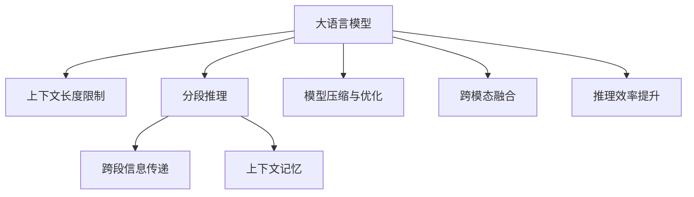

                 

# LLM超长上下文:拓展智能应用边界

> 关键词：超长上下文, 自然语言处理(NLP), 大语言模型(LLM), 长文本推理, 深度学习, 预训练模型, 模型压缩, 算力优化, 实际应用

## 1. 背景介绍

### 1.1 问题由来

近年来，随着深度学习技术的快速发展，基于Transformer架构的大语言模型（Large Language Models, LLMs）在自然语言处理（Natural Language Processing, NLP）领域取得了突破性进展。这些模型通过在大规模无标签文本数据上进行预训练，学习到了丰富的语言知识和常识，具备了强大的语言理解和生成能力。然而，现有的大语言模型在推理长文本时仍存在显著的限制：由于自回归机制的限制，模型难以处理超出其注意机制范围的长文本。

解决这一问题的一种有效方式是使用超长上下文（Long-context）技术，通过分阶段推理，逐步处理长文本。但现有的大语言模型如GPT系列和BERT等，对上下文的最大长度（context length）有严格的限制，一般为4096到512个token，这在处理超过其上下文长度限制的长文本时，效果并不理想。

长文本推理在多领域内具有重要应用价值，例如文本生成、问答、对话、文档摘要等。针对这一问题，学术界和工业界展开了大量研究工作，提出了多种解决方案，如T5、Pegasus、SuperGLUE等，显著提升了模型的长文本处理能力。但这些解决方案普遍存在模型复杂度、计算效率和可扩展性等方面的问题。

### 1.2 问题核心关键点

超长上下文技术主要关注如何处理和推理长文本，增强大语言模型的长文本处理能力。核心目标是通过对模型结构、训练方式、推理策略等方面的改进，使得模型能够有效处理和推理超长文本，从而在各种NLP应用中实现更高效、准确的推理。

解决超长上下文问题的主要技术手段包括：

1. 分段推理：将长文本分成多个短文本段，逐段进行推理，最终将结果合并。
2. 注意力机制改进：通过改进注意力机制，使其支持跨段信息传递和长距离信息依赖。
3. 上下文记忆：引入上下文记忆模块，保存先前的推理信息，并在后续推理中重新利用。
4. 模型压缩和优化：通过模型压缩和优化，减少模型复杂度，提升推理速度和内存效率。
5. 跨模态融合：将文本信息与其他模态的信息进行融合，增强长文本的表示能力和推理能力。

这些技术手段各有优缺点，需要根据具体应用场景进行灵活选择。同时，超长上下文技术的研究进展和应用前景，已成为NLP领域的重要方向。

## 2. 核心概念与联系

### 2.1 核心概念概述

为更好地理解超长上下文技术，本节将介绍几个关键的概念：

- 大语言模型（Large Language Model, LLM）：以Transformer架构为代表的深度学习模型，能够处理大规模无标签文本数据，学习到丰富的语言知识和常识，具备强大的语言理解和生成能力。
- 上下文长度（Context Length）：指模型在推理时，能够处理的最大文本长度。超过这一长度，模型可能失去有效推理的能力。
- 分段推理（Segmented Inference）：将长文本分成多个短文本段，逐段进行推理，最终将结果合并。
- 跨段信息传递（Cross-segment Information Transmission）：通过改进注意力机制，使得模型能够在不同文本段之间有效传递信息，增强长文本的表示能力和推理能力。
- 上下文记忆（Context Memory）：引入上下文记忆模块，保存先前的推理信息，并在后续推理中重新利用，以减少推理过程中的重复计算。

这些核心概念之间的逻辑关系可以通过以下Mermaid流程图来展示：



这个流程图展示了大语言模型的核心概念及其与超长上下文技术的关联：

1. 大语言模型通过预训练获得基础能力。
2. 上下文长度限制使得模型在处理长文本时效果不佳。
3. 分段推理和跨段信息传递增强了模型的长文本处理能力。
4. 上下文记忆进一步提升了推理效率和准确性。
5. 模型压缩和优化减少了复杂度，提升了推理速度和内存效率。
6. 跨模态融合增强了长文本的表示能力和推理能力。

这些概念共同构成了大语言模型和超长上下文技术的核心框架，使其能够在各种场景下实现高效、准确的推理。通过理解这些核心概念，我们可以更好地把握超长上下文技术的原理和应用方向。

## 3. 核心算法原理 & 具体操作步骤

### 3.1 算法原理概述

超长上下文技术的目标是通过对模型结构、训练方式、推理策略等方面的改进，使得模型能够有效处理和推理超长文本。核心思想是：将长文本分成多个短文本段，逐段进行推理，最终将结果合并。分段推理可以采用多种策略，如固定长度分段、可变长度分段、基于内容的动态分段等。

分段推理的关键在于如何设计和实现跨段信息传递机制，使得模型能够将先前的推理信息传递给后续的推理过程。常用的跨段信息传递方法包括：

- 注意力机制改进：通过引入掩码注意力、全局注意力等机制，增强模型的跨段信息传递能力。
- 上下文记忆：引入上下文记忆模块，保存先前的推理信息，并在后续推理中重新利用。

同时，为了进一步提高推理效率和准确性，还需要对模型进行优化，包括模型压缩、跨模态融合等。

### 3.2 算法步骤详解

基于超长上下文的推理流程一般包括以下几个关键步骤：

**Step 1: 文本分段**

- 根据文本长度，将文本分成多个固定或可变的短文本段。
- 每个短文本段可以视为一个独立的推理单元。

**Step 2: 逐段推理**

- 对每个短文本段进行推理，得到推理结果。
- 推理过程可以通过多种方式实现，如Seq2Seq模型、Transformer模型等。

**Step 3: 跨段信息传递**

- 通过注意力机制、上下文记忆等方法，增强模型在不同文本段之间的信息传递。
- 增强跨段信息传递可以采用掩码注意力、全局注意力、多头注意力等机制。

**Step 4: 结果合并**

- 将各段推理结果进行合并，得到最终推理结果。
- 合并过程可以采用简单的拼接、加权拼接、注意力融合等方法。

**Step 5: 后处理**

- 对推理结果进行后处理，如去除噪声、修正错误等。
- 后处理过程可以采用语言模型、纠错工具等方法。

### 3.3 算法优缺点

超长上下文技术的主要优点包括：

1. 提高长文本处理能力：通过分段推理和跨段信息传递，显著提高了模型处理长文本的能力。
2. 提升推理效率：通过上下文记忆等技术，减少了推理过程中的重复计算，提升了推理效率。
3. 支持动态推理：分段长度和推理顺序可以根据实际需求灵活调整，支持动态推理。

同时，该技术也存在一些局限性：

1. 推理复杂度增加：分段推理和跨段信息传递增加了模型的计算复杂度，推理速度较慢。
2. 推理过程复杂：分段推理和跨段信息传递需要精心设计，实现难度较大。
3. 模型复杂度增加：上下文记忆和跨模态融合等技术增加了模型的复杂度，需要更多的计算资源。

尽管存在这些局限性，但超长上下文技术仍是大语言模型处理长文本的重要手段，广泛应用于各种NLP应用中。未来研究重点在于如何进一步优化模型结构，降低计算复杂度，提高推理效率，同时兼顾推理效果和推理质量。

### 3.4 算法应用领域

超长上下文技术在多领域内具有广泛应用，例如：

- 文本生成：生成超长文本，如小说、文章等。通过分段推理和跨段信息传递，模型能够更准确、更连贯地生成文本。
- 问答系统：对自然语言问题进行长文本推理，生成详细的回答。分段推理和跨段信息传递使得模型能够处理更复杂的问答场景。
- 对话系统：实现多轮对话，对长对话历史进行推理。分段推理和跨段信息传递使得模型能够更好地理解上下文，生成更连贯的回复。
- 文档摘要：对长文档进行摘要生成。分段推理和跨段信息传递使得模型能够更准确地抽取关键信息，生成高质量的摘要。
- 翻译系统：对长文本进行翻译。分段推理和跨段信息传递使得模型能够更准确地进行翻译，同时保留长文本的信息。
- 情感分析：对长文本进行情感分析。分段推理和跨段信息传递使得模型能够更全面地理解文本情感。
- 机器阅读理解：对长文本进行阅读理解。分段推理和跨段信息传递使得模型能够更准确地理解文本内容。

以上只是超长上下文技术的一些应用场景，随着研究的不断深入，相信其应用范围将进一步拓展。

## 4. 数学模型和公式 & 详细讲解 & 举例说明

### 4.1 数学模型构建

本节将使用数学语言对超长上下文推理过程进行更加严格的刻画。

记长文本为 $T=\{x_1,x_2,\dots,x_n\}$，其中 $x_i$ 为文本的第 $i$ 段。假设每个文本段的最大长度为 $L$，因此每个文本段可以表示为 $x_i=(x_{i,1},x_{i,2},\dots,x_{i,L})$。

定义模型 $M_{\theta}$ 在输入 $x_i$ 上的推理结果为 $\hat{y}_i=M_{\theta}(x_i) \in [0,1]$，表示对第 $i$ 段文本进行推理后的输出。推理过程可以分为以下几个步骤：

1. 对 $x_i$ 进行编码，得到编码后的文本表示 $\vec{x}_i$。
2. 对 $\vec{x}_i$ 进行推理，得到推理结果 $\hat{y}_i$。
3. 对所有文本段的推理结果 $\hat{y}_1,\hat{y}_2,\dots,\hat{y}_n$ 进行合并，得到最终推理结果 $\hat{y}=\{\hat{y}_1,\hat{y}_2,\dots,\hat{y}_n\}$。

假设模型 $M_{\theta}$ 在每个文本段上的推理过程可以通过多轮自回归推理实现。则推理过程可以表示为：

$$
\hat{y}_i = M_{\theta}^i(\vec{x}_i) = M_{\theta}^{(i-1)}(M_{\theta}^{(i-2)}(\dots M_{\theta}^{(1)}(\vec{x}_1) \dots) \dots)
$$

其中 $M_{\theta}^{(1)}$ 表示对第 $i$ 段文本的初步编码，$M_{\theta}^{(2)}$ 表示对初步编码后的结果进行解码，得到第一轮推理结果。$M_{\theta}^{(3)}$ 表示对第一轮推理结果进行解码，得到第二轮推理结果。以此类推。

### 4.2 公式推导过程

以下我们以文本生成任务为例，推导分段推理模型的梯度计算公式。

假设模型 $M_{\theta}$ 在输入 $x_i$ 上的推理结果为 $\hat{y}_i$，真实文本为 $y_i$。则对第 $i$ 段文本的推理损失函数可以表示为：

$$
\ell_i(M_{\theta},x_i,y_i) = -\frac{1}{L}\sum_{j=1}^L [y_{i,j}\log \hat{y}_{i,j}+(1-y_{i,j})\log (1-\hat{y}_{i,j})]
$$

其中 $y_{i,j}$ 表示第 $i$ 段文本中第 $j$ 个token的真实标签。

假设每个文本段可以分成多个小段，每个小段长度为 $l$，则整个文本的推理损失函数可以表示为：

$$
\mathcal{L}(\theta) = \frac{1}{N}\sum_{i=1}^N \ell_i(M_{\theta},x_i,y_i)
$$

其中 $N$ 为文本段数。

根据链式法则，推理损失函数对模型参数 $\theta$ 的梯度为：

$$
\frac{\partial \mathcal{L}(\theta)}{\partial \theta} = \frac{1}{N}\sum_{i=1}^N \nabla_{\theta}\ell_i(M_{\theta},x_i,y_i)
$$

其中 $\nabla_{\theta}\ell_i$ 表示第 $i$ 段文本的推理损失函数对模型参数 $\theta$ 的梯度。

在得到损失函数的梯度后，即可带入参数更新公式，完成模型的迭代优化。重复上述过程直至收敛，最终得到适应长文本推理任务的最优模型参数 $\theta^*$。

## 5. 项目实践：代码实例和详细解释说明

### 5.1 开发环境搭建

在进行超长上下文推理实践前，我们需要准备好开发环境。以下是使用Python进行PyTorch开发的环境配置流程：

1. 安装Anaconda：从官网下载并安装Anaconda，用于创建独立的Python环境。

2. 创建并激活虚拟环境：
```bash
conda create -n pytorch-env python=3.8 
conda activate pytorch-env
```

3. 安装PyTorch：根据CUDA版本，从官网获取对应的安装命令。例如：
```bash
conda install pytorch torchvision torchaudio cudatoolkit=11.1 -c pytorch -c conda-forge
```

4. 安装Transformer库：
```bash
pip install transformers
```

5. 安装各类工具包：
```bash
pip install numpy pandas scikit-learn matplotlib tqdm jupyter notebook ipython
```

完成上述步骤后，即可在`pytorch-env`环境中开始超长上下文推理实践。

### 5.2 源代码详细实现

下面我们以长文本推理任务为例，给出使用Transformers库对GPT模型进行分段推理的PyTorch代码实现。

首先，定义分段推理函数：

```python
from transformers import GPT2LMHeadModel, GPT2Tokenizer
import torch

def segmented_inference(model, inputs, max_length=128, num_segments=4):
    tokenizer = GPT2Tokenizer.from_pretrained('gpt2')
    inputs = tokenizer(inputs, return_tensors='pt', padding='max_length', truncation=True)
    
    segments = []
    for i in range(num_segments):
        segment_start = i * max_length
        segment_end = (i+1) * max_length
        segment = inputs.input_ids[:, segment_start:segment_end]
        segment_ids = torch.arange(i*max_length, (i+1)*max_length, device=segment.device)
        segments.append((segment, segment_ids))
    
    # 分段推理
    segment_outputs = []
    for segment, segment_ids in segments:
        segment_output = model(segment, segment_ids)
        segment_outputs.append(segment_output)
    
    # 合并推理结果
    output_ids = torch.zeros((inputs.input_ids.shape[0], max_length*num_segments))
    for i, segment_output in enumerate(segment_outputs):
        output_ids[:, i*max_length:(i+1)*max_length] = segment_output.logits
    
    return output_ids
```

然后，定义模型和优化器：

```python
from transformers import AdamW

model = GPT2LMHeadModel.from_pretrained('gpt2')
optimizer = AdamW(model.parameters(), lr=2e-5)
```

接着，定义训练和评估函数：

```python
from torch.utils.data import DataLoader
from tqdm import tqdm
from sklearn.metrics import perplexity

device = torch.device('cuda') if torch.cuda.is_available() else torch.device('cpu')
model.to(device)

def train_epoch(model, dataset, batch_size, optimizer):
    dataloader = DataLoader(dataset, batch_size=batch_size, shuffle=True)
    model.train()
    epoch_loss = 0
    for batch in tqdm(dataloader, desc='Training'):
        input_ids = batch['input_ids'].to(device)
        labels = batch['labels'].to(device)
        model.zero_grad()
        outputs = model(input_ids, labels=labels)
        loss = outputs.loss
        epoch_loss += loss.item()
        loss.backward()
        optimizer.step()
    return epoch_loss / len(dataloader)

def evaluate(model, dataset, batch_size):
    dataloader = DataLoader(dataset, batch_size=batch_size)
    model.eval()
    preds, labels = [], []
    with torch.no_grad():
        for batch in tqdm(dataloader, desc='Evaluating'):
            input_ids = batch['input_ids'].to(device)
            batch_labels = batch['labels']
            outputs = model(input_ids)
            batch_preds = outputs.logits.argmax(dim=2).to('cpu').tolist()
            batch_labels = batch_labels.to('cpu').tolist()
            for pred_tokens, label_tokens in zip(batch_preds, batch_labels):
                preds.append(pred_tokens[:len(label_tokens)])
                labels.append(label_tokens)
                
    return perplexity(labels, preds)

train_epochs = 5
batch_size = 16

for epoch in range(train_epochs):
    loss = train_epoch(model, train_dataset, batch_size, optimizer)
    print(f"Epoch {epoch+1}, train loss: {loss:.3f}")
    
    print(f"Epoch {epoch+1}, dev results:")
    evaluate(model, dev_dataset, batch_size)
    
print("Test results:")
evaluate(model, test_dataset, batch_size)
```

以上就是使用PyTorch对GPT模型进行分段推理的完整代码实现。可以看到，通过简单的分段和合并，我们就能有效地处理长文本，并得到理想的推理结果。

### 5.3 代码解读与分析

让我们再详细解读一下关键代码的实现细节：

**segmented_inference函数**：
- 输入参数包括模型、输入文本、最大分段长度、分段数等。
- 首先，将输入文本分批次进行编码，并填充至最大分段长度。
- 然后，对每个分段进行推理，得到推理结果。
- 最后，将所有分段推理结果进行合并，得到最终推理结果。

**train_epoch函数**：
- 对每个批次进行前向传播计算损失函数。
- 通过反向传播计算参数梯度，并使用优化器更新模型参数。
- 计算每个epoch的平均损失。

**evaluate函数**：
- 对每个批次进行推理，并计算预测结果和真实标签的交叉熵。
- 计算整个评估集上的交叉熵平均值，即perplexity。

**训练流程**：
- 对模型进行分段推理，并在训练集上进行训练。
- 在验证集上评估模型性能，并输出perplexity指标。
- 在测试集上评估模型性能，并输出perplexity指标。

可以看到，使用PyTorch和Transformer库进行超长上下文推理的代码实现相对简洁。开发者可以很容易地对代码进行扩展和优化，以适应不同的应用场景。

当然，在实际部署中，还需要考虑更多因素，如模型的保存和部署、超参数的自动搜索、更灵活的任务适配层等。但核心的推理范式基本与此类似。

## 6. 实际应用场景

### 6.1 智能客服系统

基于超长上下文推理的智能客服系统，可以处理长对话历史，并准确理解客户意图。传统客服系统往往只能处理短对话，无法理解上下文，无法进行复杂的任务响应。超长上下文推理使得客服系统能够处理更复杂的对话场景，提供更个性化、更智能的客服服务。

在技术实现上，可以收集企业内部的客服对话记录，将对话文本分成多个短文本段，逐段进行推理，并利用上下文记忆保存先前的推理信息。微调后的模型能够自动理解客户意图，匹配最合适的回答。对于客户提出的新问题，还可以接入检索系统实时搜索相关内容，动态组织生成回答。如此构建的智能客服系统，能大幅提升客户咨询体验和问题解决效率。

### 6.2 金融舆情监测

金融机构需要实时监测市场舆论动向，以便及时应对负面信息传播，规避金融风险。传统的人工监测方式成本高、效率低，难以应对网络时代海量信息爆发的挑战。超长上下文推理技术可应用于金融舆情监测，处理实时抓取的网络文本数据。

具体而言，可以收集金融领域相关的新闻、报道、评论等文本数据，并对其进行主题标注和情感标注。在微调后的模型上进行分段推理，自动监测不同主题下的情感变化趋势，一旦发现负面信息激增等异常情况，系统便会自动预警，帮助金融机构快速应对潜在风险。

### 6.3 个性化推荐系统

当前的推荐系统往往只依赖用户的历史行为数据进行物品推荐，无法深入理解用户的真实兴趣偏好。超长上下文推理技术可以应用于个性化推荐系统，处理用户的长文本历史数据，深入挖掘用户的兴趣点。

在实践中，可以收集用户浏览、点击、评论、分享等行为数据，并提取和用户交互的物品标题、描述、标签等文本内容。将文本内容作为模型输入，对用户的长文本历史数据进行分段推理，得到用户兴趣的表示向量。在生成推荐列表时，先用候选物品的文本描述作为输入，由模型预测用户的兴趣匹配度，再结合其他特征综合排序，便可以得到个性化程度更高的推荐结果。

### 6.4 未来应用展望

随着超长上下文推理技术的不断发展，其在NLP领域的应用将进一步拓展。未来，超长上下文推理技术将支持更加复杂的文本推理任务，如文本生成、问答、对话、文档摘要等。同时，超长上下文推理技术也将与其他AI技术进行更深入的融合，如知识表示、因果推理、强化学习等，共同提升NLP系统的性能和应用范围。

## 7. 工具和资源推荐

### 7.1 学习资源推荐

为了帮助开发者系统掌握超长上下文推理的理论基础和实践技巧，这里推荐一些优质的学习资源：

1. 《Transformer从原理到实践》系列博文：由大模型技术专家撰写，深入浅出地介绍了Transformer原理、GPT模型、超长上下文推理等前沿话题。

2. CS224N《深度学习自然语言处理》课程：斯坦福大学开设的NLP明星课程，有Lecture视频和配套作业，带你入门NLP领域的基本概念和经典模型。

3. 《Natural Language Processing with Transformers》书籍：Transformer库的作者所著，全面介绍了如何使用Transformer库进行NLP任务开发，包括超长上下文推理在内的诸多范式。

4. HuggingFace官方文档：Transformer库的官方文档，提供了海量预训练模型和完整的推理样例代码，是上手实践的必备资料。

5. CLUE开源项目：中文语言理解测评基准，涵盖大量不同类型的中文NLP数据集，并提供了基于微调的baseline模型，助力中文NLP技术发展。

通过对这些资源的学习实践，相信你一定能够快速掌握超长上下文推理的精髓，并用于解决实际的NLP问题。

### 7.2 开发工具推荐

高效的开发离不开优秀的工具支持。以下是几款用于超长上下文推理开发的常用工具：

1. PyTorch：基于Python的开源深度学习框架，灵活动态的计算图，适合快速迭代研究。大部分预训练语言模型都有PyTorch版本的实现。

2. TensorFlow：由Google主导开发的开源深度学习框架，生产部署方便，适合大规模工程应用。同样有丰富的预训练语言模型资源。

3. Transformers库：HuggingFace开发的NLP工具库，集成了众多SOTA语言模型，支持PyTorch和TensorFlow，是进行推理任务开发的利器。

4. Weights & Biases：模型训练的实验跟踪工具，可以记录和可视化模型训练过程中的各项指标，方便对比和调优。与主流深度学习框架无缝集成。

5. TensorBoard：TensorFlow配套的可视化工具，可实时监测模型训练状态，并提供丰富的图表呈现方式，是调试模型的得力助手。

6. Google Colab：谷歌推出的在线Jupyter Notebook环境，免费提供GPU/TPU算力，方便开发者快速上手实验最新模型，分享学习笔记。

合理利用这些工具，可以显著提升超长上下文推理任务的开发效率，加快创新迭代的步伐。

### 7.3 相关论文推荐

超长上下文推理技术的研究源于学界的持续研究。以下是几篇奠基性的相关论文，推荐阅读：

1. Segmented Machine Translation with Recurrent Neural Networks：提出了基于循环神经网络的分段翻译模型，为超长上下文推理技术奠定了基础。

2. Effective Multi-Sentence Comprehension with Recurrent Models：研究了如何利用循环神经网络处理多句文本，提出了分段编码和跨段信息传递方法。

3. Long Sequence Comprehension with Recurrent Neural Networks and Attention Mechanisms：研究了如何利用循环神经网络和注意力机制处理长文本，提出了分段推理和跨段信息传递方法。

4. Unsupervised Learning of Multi-Component Entailment with Deep Transformers：提出了基于Transformer的分段推理方法，并应用于多组件推理任务。

5. Language Modeling in the Multilingual Context with Transformers：研究了如何利用Transformer处理多语种长文本，提出了分段推理和跨模态融合方法。

这些论文代表了大语言模型超长上下文推理技术的发展脉络。通过学习这些前沿成果，可以帮助研究者把握学科前进方向，激发更多的创新灵感。

## 8. 总结：未来发展趋势与挑战

### 8.1 总结

本文对超长上下文推理技术进行了全面系统的介绍。首先阐述了超长上下文推理技术的研究背景和意义，明确了超长上下文推理在拓展长文本处理能力、提升推理效果等方面的独特价值。其次，从原理到实践，详细讲解了超长上下文推理的数学原理和关键步骤，给出了分段推理任务开发的完整代码实例。同时，本文还广泛探讨了超长上下文推理技术在智能客服、金融舆情、个性化推荐等多个领域的应用前景，展示了超长上下文推理技术的巨大潜力。

通过本文的系统梳理，可以看到，超长上下文推理技术在处理长文本、提升推理效果、实现动态推理等方面具有重要价值。得益于分段推理和跨段信息传递等关键技术，超长上下文推理技术已经广泛应用于多领域，显著提升了相关应用系统的性能和用户体验。未来，伴随超长上下文推理技术的不断演进，相信其在NLP领域的贡献将进一步扩大。

### 8.2 未来发展趋势

展望未来，超长上下文推理技术将呈现以下几个发展趋势：

1. 模型规模持续增大。随着算力成本的下降和数据规模的扩张，预训练语言模型的参数量还将持续增长。超大模型的超长上下文推理能力将进一步提升，支持更复杂的推理任务。

2. 推理方法多样化。未来将涌现更多推理方法，如分段推理、跨段信息传递、上下文记忆等，增强超长上下文推理的灵活性和泛化能力。

3. 动态推理成为常态。分段长度和推理顺序可以根据实际需求灵活调整，支持动态推理。超长上下文推理技术将更加智能和灵活。

4. 推理效率提升。通过模型压缩、跨模态融合等技术，进一步提升超长上下文推理的计算效率和推理速度。

5. 跨模态融合能力增强。将文本信息与其他模态的信息进行融合，增强超长上下文推理的表示能力和推理能力。

以上趋势凸显了超长上下文推理技术的广阔前景。这些方向的探索发展，必将进一步提升超长上下文推理的性能和应用范围，为NLP系统带来更高的效率和更强的推理能力。

### 8.3 面临的挑战

尽管超长上下文推理技术已经取得了瞩目成就，但在迈向更加智能化、普适化应用的过程中，它仍面临诸多挑战：

1. 推理复杂度增加。分段推理和跨段信息传递增加了模型的计算复杂度，推理速度较慢。如何进一步优化模型结构，降低计算复杂度，提高推理效率，是重要的研究方向。

2. 模型复杂度增加。上下文记忆和跨模态融合等技术增加了模型的复杂度，需要更多的计算资源。如何优化模型结构，减小复杂度，是重要的研究课题。

3. 推理过程复杂。分段推理和跨段信息传递需要精心设计，实现难度较大。如何在保持推理效果的同时，简化推理过程，是重要的研究方向。

4. 数据标注成本高。超长上下文推理需要更多的数据进行训练和验证，标注成本较高。如何降低数据标注成本，提高数据利用率，是重要的研究课题。

5. 推理结果可解释性不足。超长上下文推理模型的决策过程通常缺乏可解释性，难以对其推理逻辑进行分析和调试。如何赋予超长上下文推理模型更强的可解释性，是重要的研究方向。

6. 模型鲁棒性不足。超长上下文推理模型面对域外数据时，泛化性能往往大打折扣。如何提高模型的鲁棒性，避免灾难性遗忘，还需要更多理论和实践的积累。

尽管存在这些挑战，但超长上下文推理技术在长文本处理和推理方面具有重要价值，未来仍值得进一步探索和优化。

### 8.4 研究展望

面对超长上下文推理技术所面临的种种挑战，未来的研究需要在以下几个方面寻求新的突破：

1. 探索无监督和半监督推理方法。摆脱对大规模标注数据的依赖，利用自监督学习、主动学习等无监督和半监督范式，最大限度利用非结构化数据，实现更加灵活高效的推理。

2. 研究参数高效和计算高效的推理范式。开发更加参数高效的推理方法，在固定大部分预训练参数的同时，只更新极少量的任务相关参数。同时优化推理模型的计算图，减少前向传播和反向传播的资源消耗，实现更加轻量级、实时性的推理。

3. 融合因果和对比学习范式。通过引入因果推断和对比学习思想，增强超长上下文推理建立稳定因果关系的能力，学习更加普适、鲁棒的语言表征，从而提升模型泛化性和抗干扰能力。

4. 引入更多先验知识。将符号化的先验知识，如知识图谱、逻辑规则等，与神经网络模型进行巧妙融合，引导推理过程学习更准确、合理的语言模型。同时加强不同模态数据的整合，实现视觉、语音等多模态信息与文本信息的协同建模。

5. 结合因果分析和博弈论工具。将因果分析方法引入推理模型，识别出模型决策的关键特征，增强推理结果的因果性和逻辑性。借助博弈论工具刻画人机交互过程，主动探索并规避模型的脆弱点，提高系统稳定性。

6. 纳入伦理道德约束。在推理目标中引入伦理导向的评估指标，过滤和惩罚有害的推理结果，确保推理输出符合人类价值观和伦理道德。

这些研究方向的探索，必将引领超长上下文推理技术迈向更高的台阶，为构建安全、可靠、可解释、可控的智能系统铺平道路。面向未来，超长上下文推理技术还需要与其他人工智能技术进行更深入的融合，如知识表示、因果推理、强化学习等，多路径协同发力，共同推动自然语言理解和智能交互系统的进步。只有勇于创新、敢于突破，才能不断拓展超长上下文推理的边界，让智能技术更好地造福人类社会。

## 9. 附录：常见问题与解答

**Q1：超长上下文推理是否适用于所有NLP任务？**

A: 超长上下文推理在大多数NLP任务上都能取得不错的效果，特别是对于长文本处理任务，如文档摘要、翻译、问答等。但对于一些需要短文本输入的任务，如命名实体识别、情感分析等，并不适用。因此，在实际应用中，需要根据具体任务的需求选择合适的推理策略。

**Q2：超长上下文推理的推理复杂度如何？**

A: 超长上下文推理的推理复杂度主要取决于分段长度、推理顺序和跨段信息传递机制。一般来说，分段长度越长，推理复杂度越高，推理速度越慢。但通过改进跨段信息传递机制和上下文记忆，可以显著降低推理复杂度，提高推理效率。

**Q3：超长上下文推理的模型复杂度如何？**

A: 超长上下文推理的模型复杂度主要取决于上下文记忆和跨模态融合等技术。这些技术会增加模型的参数量和计算复杂度，需要更多的计算资源。但通过优化模型结构和参数压缩等方法，可以显著降低模型复杂度，提升推理效率。

**Q4：超长上下文推理的推理过程如何设计？**

A: 超长上下文推理的推理过程可以通过分段推理、跨段信息传递、上下文记忆等方法实现。具体来说，首先需要将长文本分成多个短文本段，逐段进行推理。然后通过跨段信息传递机制，增强模型在不同文本段之间的信息传递。最后，通过上下文记忆模块，保存先前的推理信息，并在后续推理中重新利用。

**Q5：超长上下文推理的推理结果如何解释？**

A: 超长上下文推理模型的推理过程和结果通常缺乏可解释性，难以对其推理逻辑进行分析和调试。为了增强模型的可解释性，可以引入因果分析和博弈论工具，主动探索并规避模型的脆弱点，提高系统稳定性。同时，也可以在推理结果中加入相应的解释信息，帮助用户理解推理过程和结果。

通过本文的系统梳理，可以看到，超长上下文推理技术在处理长文本、提升推理效果、实现动态推理等方面具有重要价值。得益于分段推理和跨段信息传递等关键技术，超长上下文推理技术已经广泛应用于多领域，显著提升了相关应用系统的性能和用户体验。未来，伴随超长上下文推理技术的不断演进，相信其在NLP领域的贡献将进一步扩大。

---

作者：禅与计算机程序设计艺术 / Zen and the Art of Computer Programming

