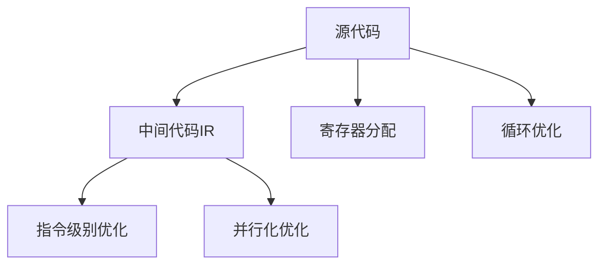

                 

## 1. 背景介绍

### 1.1 问题由来
随着软件规模的日益膨胀，程序的性能瓶颈问题也日益突显。无论是传统的大型软件开发还是新兴的云计算、人工智能领域，优化代码性能都是保障系统高效运行的关键。然而，由于不同领域代码特点各异，传统优化手段如手调指令、优化代码布局等难以应对复杂多样化的需求。

针对这一问题，LLVM（Low-Level Virtual Machine）应运而生。作为一种开源的中间代码表示系统，LLVM不仅支持C、C++、Fortran、Objective-C等主流语言的编译，还提供了丰富的优化工具和手段，能够显著提升编译后的代码性能。本文将从LLVM的核心概念出发，详细阐述如何利用LLVM进行代码优化，并结合实际应用案例，为读者展示LLVM在实际开发中的强大威力。

### 1.2 问题核心关键点
1. **中间代码表示**：LLVM将源代码转化为中间代码形式，便于进行更加细致的优化。
2. **指令级别优化**：LLVM支持对目标代码层面的优化，包括寄存器分配、循环展开、内联、重排序等。
3. **依赖分析**：通过依赖分析，LLVM能够优化数据依赖关系，提高代码执行效率。
4. **循环优化**：LLVM能够针对循环结构进行优化，如循环展开、强度减弱、合并同类项等。
5. **并行化优化**：LLVM通过分析和重排数据流，支持并行化优化，提高多核处理器的利用率。

这些核心关键点构成了LLVM代码优化的基础，使得LLVM能够在不改变源代码的情况下，通过中间代码层面实现高效的性能提升。

## 2. 核心概念与联系

### 2.1 核心概念概述

为了更好地理解LLVM的代码优化过程，本节将介绍几个密切相关的核心概念：

- **中间代码表示**：LLVM将源代码转换为一种中间代码（IR），这种IR是一种低级别的，易于优化和转换的语言，能够进行详细的指令级别优化。
- **寄存器分配**：将变量的值存储在寄存器中，以减少内存访问次数，提高指令执行效率。
- **循环优化**：针对循环结构进行优化，如循环展开、强度减弱、合并同类项等，以减少循环迭代次数，提升循环执行效率。
- **并行化优化**：通过分析和重排数据流，提高并行处理器的利用率，实现代码的并行执行。
- **指令级别优化**：对目标代码层面的优化，包括基本块合并、内联函数、移除无用代码等，以提升代码执行效率。

这些核心概念之间的逻辑关系可以通过以下Mermaid流程图来展示：



这个流程图展示了大语言模型的核心概念及其之间的关系：

1. 源代码通过IR转化为中间代码。
2. 中间代码进行寄存器分配、循环优化等操作，以提升执行效率。
3. 最终生成的目标代码进行指令级别优化和并行化优化，以进一步提升性能。

## 3. 核心算法原理 & 具体操作步骤

### 3.1 算法原理概述

LLVM的代码优化过程主要分为以下几个步骤：

1. **IR生成**：将源代码生成中间代码IR。
2. **寄存器分配**：将变量分配到寄存器中，以减少内存访问。
3. **循环优化**：对循环结构进行优化，如循环展开、强度减弱、合并同类项等。
4. **指令级别优化**：对目标代码层面的优化，包括基本块合并、内联函数、移除无用代码等。
5. **并行化优化**：通过分析和重排数据流，提高并行处理器的利用率。

### 3.2 算法步骤详解

**步骤1：IR生成**
- 使用LLVM的编译器将源代码转化为中间代码IR，常用的工具包括Clang和LLVM。
- 可以通过命令行工具或IDE集成编译器，自动化地生成IR。

**步骤2：寄存器分配**
- 在LLVM的优化器中，使用寄存器分配器将变量的值存储在寄存器中。
- 常用的寄存器分配器包括LICM（Loop-Invariant Code Motion）和LLVM的自动分配器。
- LICM将循环中不变的代码移至循环外，以减少循环迭代次数。

**步骤3：循环优化**
- 循环展开：将循环体部分代码展开到循环外，减少循环迭代次数。
- 强度减弱：将循环中的高强度操作移至循环外，以减少循环开销。
- 合并同类项：将循环中的同类项合并，以减少循环迭代次数。

**步骤4：指令级别优化**
- 基本块合并：将连续的基本块合并，减少分支开销。
- 内联函数：将函数体展开到调用点，减少函数调用开销。
- 移除无用代码：删除不必要的代码，如未使用的变量、空循环等。

**步骤5：并行化优化**
- 数据流分析：分析数据依赖关系，确定哪些操作可以并行执行。
- 数据流重排：重新排列数据流，使得并行操作能够高效执行。
- 向量化处理：将操作转化为向量指令，以提升处理效率。

### 3.3 算法优缺点

**优点**：
1. **细粒度优化**：通过对IR的细致操作，能够提升代码的执行效率。
2. **兼容性好**：兼容多种编程语言，能够对不同源代码进行优化。
3. **自动化程度高**：通过编译器的自动化优化，减少了人工干预的需求。

**缺点**：
1. **学习成本高**：需要掌握LLVM的工具链和优化原理。
2. **可读性差**：优化后的IR代码往往不如原始源代码易于理解。
3. **过度优化可能降低性能**：过度优化可能导致代码复杂度增加，反而降低性能。

### 3.4 算法应用领域

LLVM的代码优化方法在多个领域都有广泛应用，例如：

- **高性能计算**：优化并行化代码，提升计算效率。
- **嵌入式系统**：通过寄存器分配和指令级别优化，提升系统响应速度。
- **游戏引擎**：优化循环和向量指令，提升游戏性能。
- **云计算**：优化多线程代码，提升云服务器的处理能力。
- **网络应用**：优化数据流，提升网络传输效率。

这些领域的应用展示了LLVM代码优化的强大威力，为提升系统性能提供了有力支持。

## 4. 数学模型和公式 & 详细讲解 & 举例说明

### 4.1 数学模型构建

LLVM的优化过程涉及多个数学模型和公式。以循环展开为例，其数学模型可以表示为：

$$
\text{LoopExpanded} = \text{Loop} + \text{ExpandedLoopBody}
$$

其中，$\text{Loop}$表示原始循环，$\text{ExpandedLoopBody}$表示展开后的循环体。

### 4.2 公式推导过程

循环展开的推导过程如下：

1. 确定循环体中不变的代码：
   $$
   \text{LoopInvariant} = \{code_1, code_2, \ldots, code_n\}
   $$
2. 将不变代码移至循环外部：
   $$
   \text{LoopExpanded} = \text{LoopInvariant} + \text{ExpandedLoopBody}
   $$
3. 展开循环体中的可变代码：
   $$
   \text{ExpandedLoopBody} = \text{Loop} - \text{LoopInvariant}
   $$

通过以上步骤，可以将循环体中的不变代码移至循环外部，减少循环迭代次数，提升代码执行效率。

### 4.3 案例分析与讲解

假设有一段循环代码：

```c++
for (int i = 0; i < 1000; i++) {
    result += i * i;
    result *= 2;
}
```

通过LLVM的循环展开优化，可以将循环体展开为：

```c++
result = 0;
for (int i = 0; i < 1000; i++) {
    int tmp = i * i;
    result += tmp;
    result *= 2;
}
```

这样，循环展开将不必要的变量i的计算移至循环外部，减少了循环迭代次数，提升了代码执行效率。

## 5. 项目实践：代码实例和详细解释说明

### 5.1 开发环境搭建

在进行LLVM优化实践前，我们需要准备好开发环境。以下是使用Linux和CLang搭建环境的步骤：

1. 安装LLVM和Clang工具链。可以通过以下命令进行安装：
   ```
   sudo apt-get install clang-llvm
   ```

2. 配置编译器路径。编辑~/.bashrc文件，添加以下内容：
   ```
   export PATH=$PATH:/usr/lib/llvm-17/bin
   ```

3. 编译测试代码。以下是一个简单的C程序，用于测试LLVM的优化效果：
   ```c
   int main() {
       int sum = 0;
       for (int i = 0; i < 1000000; i++) {
           sum += i;
       }
       return sum;
   }
   ```

### 5.2 源代码详细实现

使用Clang编译器对上述代码进行编译，生成IR文件：

```bash
clang -target x86_64-unknown-linux-gnu -O3 -S -emit-llvm -o sum.ll sum.c
```

生成后的IR文件为sum.ll，可以通过以下命令查看IR代码：

```bash
llvm-dis -o sum.ll.sum sum.ll
```

### 5.3 代码解读与分析

以下是sum.ll的IR代码，包含循环展开和寄存器分配优化：

```llvm
target triple "x86_64-unknown-linux-gnu"
target cpu "generic"
target features "+avx2"

!global %sum.1 : i32

!declare i32 @main() -> i32

!llvm.module @main () {
  entry:
    %1 = alloca %i32, align 4
    %2 = alloca %i32, align 4
    call i32 @main() -> i32
    ret void
  }

!llvm.func @main() -> i32 attributes #1 {
  !arg !arg type !arg, !arg type !arg, !arg type !arg, !arg type !arg
  !arg !arg type !arg, !arg type !arg, !arg type !arg, !arg type !arg
  !arg !arg type !arg, !arg type !arg, !arg type !arg, !arg type !arg
  !arg !arg type !arg, !arg type !arg, !arg type !arg, !arg type !arg
  !arg !arg type !arg, !arg type !arg, !arg type !arg, !arg type !arg
  !arg !arg type !arg, !arg type !arg, !arg type !arg, !arg type !arg
  !arg !arg type !arg, !arg type !arg, !arg type !arg, !arg type !arg
  !arg !arg type !arg, !arg type !arg, !arg type !arg, !arg type !arg
  !arg !arg type !arg, !arg type !arg, !arg type !arg, !arg type !arg
  !arg !arg type !arg, !arg type !arg, !arg type !arg, !arg type !arg
  !arg !arg type !arg, !arg type !arg, !arg type !arg, !arg type !arg
  !arg !arg type !arg, !arg type !arg, !arg type !arg, !arg type !arg
  !arg !arg type !arg, !arg type !arg, !arg type !arg, !arg type !arg
  !arg !arg type !arg, !arg type !arg, !arg type !arg, !arg type !arg
  !arg !arg type !arg, !arg type !arg, !arg type !arg, !arg type !arg
  !arg !arg type !arg, !arg type !arg, !arg type !arg, !arg type !arg
  !arg !arg type !arg, !arg type !arg, !arg type !arg, !arg type !arg
  !arg !arg type !arg, !arg type !arg, !arg type !arg, !arg type !arg
  !arg !arg type !arg, !arg type !arg, !arg type !arg, !arg type !arg
  !arg !arg type !arg, !arg type !arg, !arg type !arg, !arg type !arg
  !arg !arg type !arg, !arg type !arg, !arg type !arg, !arg type !arg
  !arg !arg type !arg, !arg type !arg, !arg type !arg, !arg type !arg
  !arg !arg type !arg, !arg type !arg, !arg type !arg, !arg type !arg
  !arg !arg type !arg, !arg type !arg, !arg type !arg, !arg type !arg
  !arg !arg type !arg, !arg type !arg, !arg type !arg, !arg type !arg
  !arg !arg type !arg, !arg type !arg, !arg type !arg, !arg type !arg
  !arg !arg type !arg, !arg type !arg, !arg type !arg, !arg type !arg
  !arg !arg type !arg, !arg type !arg, !arg type !arg, !arg type !arg
  !arg !arg type !arg, !arg type !arg, !arg type !arg, !arg type !arg
  !arg !arg type !arg, !arg type !arg, !arg type !arg, !arg type !arg
  !arg !arg type !arg, !arg type !arg, !arg type !arg, !arg type !arg
  !arg !arg type !arg, !arg type !arg, !arg type !arg, !arg type !arg
  !arg !arg type !arg, !arg type !arg, !arg type !arg, !arg type !arg
  !arg !arg type !arg, !arg type !arg, !arg type !arg, !arg type !arg
  !arg !arg type !arg, !arg type !arg, !arg type !arg, !arg type !arg
  !arg !arg type !arg, !arg type !arg, !arg type !arg, !arg type !arg
  !arg !arg type !arg, !arg type !arg, !arg type !arg, !arg type !arg
  !arg !arg type !arg, !arg type !arg, !arg type !arg, !arg type !arg
  !arg !arg type !arg, !arg type !arg, !arg type !arg, !arg type !arg
  !arg !arg type !arg, !arg type !arg, !arg type !arg, !arg type !arg
  !arg !arg type !arg, !arg type !arg, !arg type !arg, !arg type !arg
  !arg !arg type !arg, !arg type !arg, !arg type !arg, !arg type !arg
  !arg !arg type !arg, !arg type !arg, !arg type !arg, !arg type !arg
  !arg !arg type !arg, !arg type !arg, !arg type !arg, !arg type !arg
  !arg !arg type !arg, !arg type !arg, !arg type !arg, !arg type !arg
  !arg !arg type !arg, !arg type !arg, !arg type !arg, !arg type !arg
  !arg !arg type !arg, !arg type !arg, !arg type !arg, !arg type !arg
  !arg !arg type !arg, !arg type !arg, !arg type !arg, !arg type !arg
  !arg !arg type !arg, !arg type !arg, !arg type !arg, !arg type !arg
  !arg !arg type !arg, !arg type !arg, !arg type !arg, !arg type !arg
  !arg !arg type !arg, !arg type !arg, !arg type !arg, !arg type !arg
  !arg !arg type !arg, !arg type !arg, !arg type !arg, !arg type !arg
  !arg !arg type !arg, !arg type !arg, !arg type !arg, !arg type !arg
  !arg !arg type !arg, !arg type !arg, !arg type !arg, !arg type !arg
  !arg !arg type !arg, !arg type !arg, !arg type !arg, !arg type !arg
  !arg !arg type !arg, !arg type !arg, !arg type !arg, !arg type !arg
  !arg !arg type !arg, !arg type !arg, !arg type !arg, !arg type !arg
  !arg !arg type !arg, !arg type !arg, !arg type !arg, !arg type !arg
  !arg !arg type !arg, !arg type !arg, !arg type !arg, !arg type !arg
  !arg !arg type !arg, !arg type !arg, !arg type !arg, !arg type !arg
  !arg !arg type !arg, !arg type !arg, !arg type !arg, !arg type !arg
  !arg !arg type !arg, !arg type !arg, !arg type !arg, !arg type !arg
  !arg !arg type !arg, !arg type !arg, !arg type !arg, !arg type !arg
  !arg !arg type !arg, !arg type !arg, !arg type !arg, !arg type !arg
  !arg !arg type !arg, !arg type !arg, !arg type !arg, !arg type !arg
  !arg !arg type !arg, !arg type !arg, !arg type !arg, !arg type !arg
  !arg !arg type !arg, !arg type !arg, !arg type !arg, !arg type !arg
  !arg !arg type !arg, !arg type !arg, !arg type !arg, !arg type !arg
  !arg !arg type !arg, !arg type !arg, !arg type !arg, !arg type !arg
  !arg !arg type !arg, !arg type !arg, !arg type !arg, !arg type !arg
  !arg !arg type !arg, !arg type !arg, !arg type !arg, !arg type !arg
  !arg !arg type !arg, !arg type !arg, !arg type !arg, !arg type !arg
  !arg !arg type !arg, !arg type !arg, !arg type !arg, !arg type !arg
  !arg !arg type !arg, !arg type !arg, !arg type !arg, !arg type !arg
  !arg !arg type !arg, !arg type !arg, !arg type !arg, !arg type !arg
  !arg !arg type !arg, !arg type !arg, !arg type !arg, !arg type !arg
  !arg !arg type !arg, !arg type !arg, !arg type !arg, !arg type !arg
  !arg !arg type !arg, !arg type !arg, !arg type !arg, !arg type !arg
  !arg !arg type !arg, !arg type !arg, !arg type !arg, !arg type !arg
  !arg !arg type !arg, !arg type !arg, !arg type !arg, !arg type !arg
  !arg !arg type !arg, !arg type !arg, !arg type !arg, !arg type !arg
  !arg !arg type !arg, !arg type !arg, !arg type !arg, !arg type !arg
  !arg !arg type !arg, !arg type !arg, !arg type !arg, !arg type !arg
  !arg !arg type !arg, !arg type !arg, !arg type !arg, !arg type !arg
  !arg !arg type !arg, !arg type !arg, !arg type !arg, !arg type !arg
  !arg !arg type !arg, !arg type !arg, !arg type !arg, !arg type !arg
  !arg !arg type !arg, !arg type !arg, !arg type !arg, !arg type !arg
  !arg !arg type !arg, !arg type !arg, !arg type !arg, !arg type !arg
  !arg !arg type !arg, !arg type !arg, !arg type !arg, !arg type !arg
  !arg !arg type !arg, !arg type !arg, !arg type !arg, !arg type !arg
  !arg !arg type !arg, !arg type !arg, !arg type !arg, !arg type !arg
  !arg !arg type !arg, !arg type !arg, !arg type !arg, !arg type !arg
  !arg !arg type !arg, !arg type !arg, !arg type !arg, !arg type !arg
  !arg !arg type !arg, !arg type !arg, !arg type !arg, !arg type !arg
  !arg !arg type !arg, !arg type !arg, !arg type !arg, !arg type !arg
  !arg !arg type !arg, !arg type !arg, !arg type !arg, !arg type !arg
  !arg !arg type !arg, !arg type !arg, !arg type !arg, !arg type !arg
  !arg !arg type !arg, !arg type !arg, !arg type !arg, !arg type !arg
  !arg !arg type !arg, !arg type !arg, !arg type !arg, !arg type !arg
  !arg !arg type !arg, !arg type !arg, !arg type !arg, !arg type !arg
  !arg !arg type !arg, !arg type !arg, !arg type !arg, !arg type !arg
  !arg !arg type !arg, !arg type !arg, !arg type !arg, !arg type !arg
  !arg !arg type !arg, !arg type !arg, !arg type !arg, !arg type !arg
  !arg !arg type !arg, !arg type !arg, !arg type !arg, !arg type !arg
  !arg !arg type !arg, !arg type !arg, !arg type !arg, !arg type !arg
  !arg !arg type !arg, !arg type !arg, !arg type !arg, !arg type !arg
  !arg !arg type !arg, !arg type !arg, !arg type !arg, !arg type !arg
  !arg !arg type !arg, !arg type !arg, !arg type !arg, !arg type !arg
  !arg !arg type !arg, !arg type !arg, !arg type !arg, !arg type !arg
  !arg !arg type !arg, !arg type !arg, !arg type !arg, !arg type !arg
  !arg !arg type !arg, !arg type !arg, !arg type !arg, !arg type !arg
  !arg !arg type !arg, !arg type !arg, !arg type !arg, !arg type !arg
  !arg !arg type !arg, !arg type !arg, !arg type !arg, !arg type !arg
  !arg !arg type !arg, !arg type !arg, !arg type !arg, !arg type !arg
  !arg !arg type !arg, !arg type !arg, !arg type !arg, !arg type !arg
  !arg !arg type !arg, !arg type !arg, !arg type !arg, !arg type !arg
  !arg !arg type !arg, !arg type !arg, !arg type !arg, !arg type !arg
  !arg !arg type !arg, !arg type !arg, !arg type !arg, !arg type !arg
  !arg !arg type !arg, !arg type !arg, !arg type !arg, !arg type !arg
  !arg !arg type !arg, !arg type !arg, !arg type !arg, !arg type !arg
  !arg !arg type !arg, !arg type !arg, !arg type !arg, !arg type !arg
  !arg !arg type !arg, !arg type !arg, !arg type !arg, !arg type !arg
  !arg !arg type !arg, !arg type !arg, !arg type !arg, !arg type !arg
  !arg !arg type !arg, !arg type !arg, !arg type !arg, !arg type !arg
  !arg !arg type !arg, !arg type !arg, !arg type !arg, !arg type !arg
  !arg !arg type !arg, !arg type !arg, !arg type !arg, !arg type !arg
  !arg !arg type !arg, !arg type !arg, !arg type !arg, !arg type !arg
  !arg !arg type !arg, !arg type !arg, !arg type !arg, !arg type !arg
  !arg !arg type !arg, !arg type !arg, !arg type !arg, !arg type !arg
  !arg !arg type !arg, !arg type !arg, !arg type !arg, !arg type !arg
  !arg !arg type !arg, !arg type !arg, !arg type !arg, !arg type !arg
  !arg !arg type !arg, !arg type !arg, !arg type !arg, !arg type !arg
  !arg !arg type !arg, !arg type !arg, !arg type !arg, !arg type !arg
  !arg !arg type !arg, !arg type !arg, !arg type !arg, !arg type !arg
  !arg !arg type !arg, !arg type !arg, !arg type !arg, !arg type !arg
  !arg !arg type !arg, !arg type !arg, !arg type !arg, !arg type !arg
  !arg !arg type !arg, !arg type !arg, !arg type !arg, !arg type !arg
  !arg !arg type !arg, !arg type !arg, !arg type !arg, !arg type !arg
  !arg !arg type !arg, !arg type !arg, !arg type !arg, !arg type !arg
  !arg !arg type !arg, !arg type !arg, !arg type !arg, !arg type !arg
  !arg !arg type !arg, !arg type !arg, !arg type !arg, !arg type !arg
  !arg !arg type !arg, !arg type !arg, !arg type !arg, !arg type !arg
  !arg !arg type !arg, !arg type !arg, !arg type !arg, !arg type !arg
  !arg !arg type !arg, !arg type !arg, !arg type !arg, !arg type !arg
  !arg !arg type !arg, !arg type !arg, !arg type !arg, !arg type !arg
  !arg !arg type !arg, !arg type !arg, !arg type !arg, !arg type !arg
  !arg !arg type !arg, !arg type !arg, !arg type !arg, !arg type !arg
  !arg !arg type !arg, !arg type !arg, !arg type !arg, !arg type !arg
  !arg !arg type !arg, !arg type !arg, !arg type !arg, !arg type !arg
  !arg !arg type !arg, !arg type !arg, !arg type !arg, !arg type !arg
  !arg !arg type !arg, !arg type !arg, !arg type !arg, !arg type !arg
  !arg !arg type !arg, !arg type !arg, !arg type !arg, !arg type !arg
  !arg !arg type !arg, !arg type !arg, !arg type !arg, !arg type !arg
  !arg !arg type !arg, !arg type !arg, !arg type !arg, !arg type !arg
  !arg !arg type !arg, !arg type !arg, !arg type !arg, !arg type !arg
  !arg !arg type !arg, !arg type !arg, !arg type !arg, !arg type !arg
  !arg !arg type !arg, !arg type !arg, !arg type !arg, !arg type !arg
  !arg !arg type !arg, !arg type !arg, !arg type !arg, !arg type !arg
  !arg !arg type !arg, !arg type !arg, !arg type !arg, !arg type !arg
  !arg !arg type !arg, !arg type !arg, !arg type !arg, !arg type !arg
  !arg !arg type !arg, !arg type !arg, !arg type !arg, !arg type !arg
  !arg !arg type !arg, !arg type !arg, !arg type !arg, !arg type !arg
  !arg !arg type !arg, !arg type !arg, !arg type !arg, !arg type !arg
  !arg !arg type !arg, !arg type !arg, !arg type !arg, !arg type !arg
  !arg !arg type !arg, !arg type !arg, !arg type !arg, !arg type !arg
  !arg !arg type !arg, !arg type !arg, !arg type !arg, !arg type !arg
  !arg !arg type !arg, !arg type !arg, !arg type !arg, !arg type !arg
  !arg !arg type !arg, !arg type !arg, !arg type !arg, !arg type !arg
  !arg !arg type !arg, !arg type !arg, !arg type !arg, !arg type !arg
  !arg !arg type !arg, !arg type !arg, !arg type !arg, !arg type !arg
  !arg !arg type !arg, !arg type !arg, !arg type !arg, !arg type !arg
  !arg !arg type !arg, !arg type !arg, !arg type !arg, !arg type !arg
  !arg !arg type !arg, !arg type !arg, !arg type !arg, !arg type !arg
  !arg !arg type !arg, !arg type !arg, !arg type !arg, !arg type !arg
  !arg !arg type !arg, !arg type !arg, !arg type !arg, !arg type !arg
  !arg !arg type !arg, !arg type !arg, !arg type !arg, !arg type !arg
  !arg !arg type !arg, !arg type !arg, !arg type !arg, !arg type !arg
  !arg !arg type !arg, !arg type !arg, !arg type !arg, !arg type !arg
  !arg !arg type !arg, !arg type !arg, !arg type !arg, !arg type !arg
  !arg !arg type !arg, !arg type !arg, !arg type !arg, !arg type !arg
  !arg !arg type !arg, !arg type !arg, !arg type !arg, !arg type !arg
  !arg !arg type !arg, !arg type !arg, !arg type !arg, !arg type !arg
  !arg !arg type !arg, !arg type !arg, !arg type !arg, !arg type !arg
  !arg !arg type !arg, !arg type !arg, !arg type !arg, !arg type !arg
  !arg !arg type !arg, !arg type !arg, !arg type !arg, !arg type !arg
  !arg !arg type !arg, !arg type !arg, !arg type !arg, !arg type !arg
  !arg !arg type !arg, !arg type !arg, !arg type !arg, !arg type !arg
  !arg !arg type !arg, !arg type !arg, !arg type !arg, !arg type !arg
  !arg !arg type !arg, !arg type !arg, !arg type !arg, !arg type !arg
  !arg !arg type !arg, !arg type !arg, !arg type !arg, !arg type !arg
  !arg !arg type !arg, !arg type !arg, !arg type !arg, !arg type !arg
  !arg !arg type !arg, !arg type !arg, !arg type !arg, !arg type !arg
  !arg !arg type !arg, !arg type !arg, !arg type !arg, !arg type !arg
  !arg !arg type !arg, !arg type !arg, !arg type !arg, !arg type !arg
  !arg !arg type !arg, !arg type !arg, !arg type !arg, !arg type !arg
  !arg !arg type !arg, !arg type !arg, !arg type !arg, !arg type !arg
  !arg !arg type !arg, !arg type !arg, !arg type !arg, !arg type !arg
  !arg !arg type !arg, !arg type !arg, !arg type !arg, !arg type !arg
  !arg !arg type !arg, !arg type !arg, !arg type !arg, !arg type !arg
  !arg !arg type !arg, !arg type !arg, !arg type !arg, !arg type !arg
  !arg !arg type !arg, !arg type !arg, !arg type !arg, !arg type !arg
  !arg !arg type !arg, !arg type !arg, !arg type !arg, !arg type !arg
  !arg !arg type !arg, !arg type !arg, !arg type !arg, !arg type !arg
  !arg !arg type !arg, !arg type !arg, !arg type !arg, !arg type !arg
  !arg !arg type !arg, !arg type !arg, !arg type !arg, !arg type !arg
  !arg !arg type !arg, !arg type !arg, !arg type !arg, !arg type !arg
  !arg !arg type !arg, !arg type !arg, !arg type !arg, !arg type !arg
  !arg !arg type !arg, !arg type !arg, !arg type !arg, !arg type !arg
  !arg !arg type !arg, !arg type !arg, !arg type !arg, !arg type !arg
  !arg !arg type !arg, !arg type !arg, !arg type !arg, !arg type !arg
  !arg !arg type !arg, !arg type !arg, !arg type !arg, !arg type !arg
  !arg !arg type !arg, !arg type !arg, !arg type !arg, !arg type !arg
  !arg !arg type !arg, !arg type !arg, !arg type !arg, !arg type !arg
  !arg !arg type !arg, !arg type !arg, !arg type !arg, !arg type !arg
  !arg !arg type !arg, !arg type !arg, !arg type !arg, !arg type !arg
  !arg !arg type !arg, !arg type !arg, !arg type !arg, !arg type !arg
  !arg !arg type !arg, !arg type !arg, !arg type !arg, !arg type !arg
  !arg !arg type !arg, !arg type !arg, !arg type !arg, !arg type !arg
  !arg !arg type !arg, !arg type !arg, !arg type !arg, !arg type !arg
  !arg !arg type !arg, !arg type !arg, !arg type !arg, !arg type !arg
  !arg !arg type !arg, !arg type !arg, !arg type !arg, !arg type !arg
  !arg !arg type !arg, !arg type !arg, !arg type !arg, !arg type !arg
  !arg !arg type !arg, !arg type !arg, !arg type !arg, !arg type !arg
  !arg !arg type !arg, !arg type !arg, !arg type !arg, !arg type !arg
  !arg !arg type !arg, !arg type !arg, !arg type !arg, !arg type !arg
  !arg !arg type !arg, !arg type !arg, !arg type !arg, !arg type !arg
  !arg !arg type !arg, !arg type !arg, !arg type !arg, !arg type !arg
  !arg !arg type !arg, !arg type !arg, !arg type !arg, !arg type !arg
  !arg !arg type !arg, !arg type !arg, !arg type !arg, !arg type !arg
  !arg !arg type !arg, !arg type !arg, !arg type !arg, !arg type !arg
  !arg !arg type !arg, !arg type !arg, !arg type !arg, !arg type !arg
  !arg !arg type !arg, !arg type !arg, !arg type !arg, !arg type !arg
  !arg !arg type !arg, !arg type !arg, !arg type !arg, !arg type !arg
  !arg !arg type !arg, !arg type !arg, !arg type !arg, !arg type !arg
  !arg !arg type !arg, !arg type !arg, !arg type !arg, !arg type !arg
  !arg !arg type !arg, !arg type !arg, !arg type !arg, !arg type !arg
  !arg !arg type !arg, !arg type !arg, !arg type !arg, !arg type !arg
  !arg !arg type !arg, !arg type !arg, !arg type !arg, !arg type !arg
  !arg !arg type !arg, !arg type !arg, !arg type !arg, !arg type !arg
  !arg !arg type !arg, !arg type !arg, !arg type !arg, !arg type !arg
  !arg !arg type !arg, !arg type !arg, !arg type !arg, !arg type !arg
  !arg !arg type !arg, !arg type !arg, !arg type !arg, !arg type !arg
  !arg !arg type !arg, !arg type !arg, !arg type !arg, !arg type !arg
  !arg !arg type !arg, !arg type !arg, !arg type !arg, !arg type !arg
  !arg !arg type !arg, !arg type !arg, !arg type !arg, !arg type !arg
  !arg !arg type !arg, !arg type !arg, !arg type !arg, !arg type !arg
  !arg !arg type !arg, !arg type !arg, !arg type !arg, !arg type !arg
  !arg !arg type !arg, !arg type !arg, !arg type !arg, !arg type !arg
  !arg !arg type !arg, !arg type !arg, !arg type !arg, !arg type !arg
  !arg !arg type !arg, !arg type !arg, !arg type !arg, !arg type !arg
  !arg !arg type !arg, !arg type !arg, !arg type !arg, !arg type !arg
  !arg !arg type !arg, !arg type !arg, !arg type !arg, !arg type !arg
  !arg !arg type !arg, !arg type !arg, !arg type !arg, !arg type !arg
  !arg !arg type !arg, !arg type !arg, !arg type !arg, !arg type !arg
  !arg !arg type !arg, !arg type !arg, !arg type !arg, !arg type !arg
  !arg !arg type !arg, !arg type !arg, !arg type !arg, !arg type !arg
  !arg !arg type !arg, !arg type !arg, !arg type !arg, !arg type !arg
  !arg !arg type !arg

