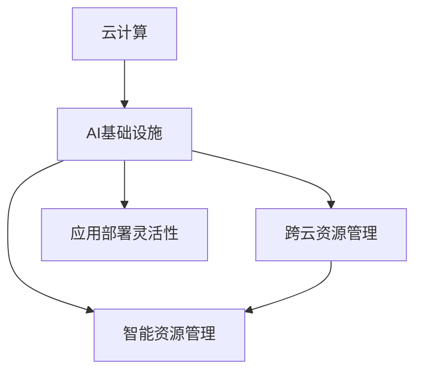

                 

# Lepton AI的云计算实力：深度整合云资源，打造灵活高效的AI基础设施

## 1. 背景介绍

### 1.1 问题由来
近年来，随着人工智能(AI)技术的发展，AI基础设施的建设变得越来越重要。在AI应用中，数据存储、计算资源、模型训练和推理等环节对云资源的需求日益增长。云资源的管理和整合，直接关系到AI应用的成本和效率，是实现灵活高效AI基础设施的关键。

然而，现有的云计算平台普遍存在以下问题：

- **资源管理复杂**：多个云平台和云服务之间的资源隔离、数据迁移、跨云协作等问题，使得云资源的有效管理和利用变得困难。
- **成本控制困难**：多云资源的使用效率低下，资源浪费现象严重，导致整体云成本居高不下。
- **应用开发效率低**：云资源配置和调度不合理，导致AI应用开发周期延长，响应速度慢。

这些问题严重影响了AI应用的落地和普及。Lepton AI作为领先的AI基础设施解决方案提供商，通过深度整合云资源，推出了高效灵活的AI基础设施方案，极大提升了云资源的利用效率，为AI应用开发提供了强有力的支持。

### 1.2 问题核心关键点
Lepton AI的云计算实力主要体现在以下几个方面：

- **深度整合云资源**：构建统一的管理平台，实现跨云、跨资源池的资源管理和调度。
- **高效资源管理**：引入智能算法和自动化工具，优化资源使用效率，降低云成本。
- **灵活应用部署**：提供丰富的云服务模板和开源工具，支持各种AI应用场景的快速部署。

这些核心技术点构成了Lepton AI在云计算领域的核心竞争力，使其能够为AI应用提供更强大、更灵活、更经济的云资源支撑。

## 2. 核心概念与联系

### 2.1 核心概念概述

为更好地理解Lepton AI的云计算实力，本节将介绍几个密切相关的核心概念：

- **云计算**：通过互联网提供动态可伸缩的虚拟化资源，包括计算、存储、网络等，支持各种应用程序的运行。
- **AI基础设施**：指支撑AI应用开发、训练、推理等全流程所需的云资源，包括数据存储、计算资源、模型训练、推理服务、应用集成等。
- **跨云资源管理**：指通过统一的资源管理平台，实现不同云平台和资源池之间的资源共享和调度，提升资源利用效率。
- **智能资源管理**：通过引入机器学习算法和自动化工具，实现资源的动态调整和优化，降低云成本。
- **应用部署灵活性**：指通过提供丰富的云服务模板和开源工具，支持各种AI应用场景的快速部署和集成。

这些核心概念之间的逻辑关系可以通过以下Mermaid流程图来展示：



这个流程图展示了大规模AI应用在云计算基础设施中各个组件之间的联系：

1. 云计算是AI基础设施的基础，提供了动态的虚拟化资源支持。
2. 跨云资源管理通过统一的资源管理平台，实现跨云和资源池的资源共享和调度。
3. 智能资源管理通过引入机器学习算法和自动化工具，优化资源使用效率，降低云成本。
4. 应用部署灵活性通过提供丰富的云服务模板和开源工具，支持各种AI应用场景的快速部署和集成。

这些核心概念共同构成了Lepton AI在云计算领域的核心能力，使其能够提供高效、灵活、经济的AI基础设施解决方案。

## 3. 核心算法原理 & 具体操作步骤
### 3.1 算法原理概述

Lepton AI的云计算实力主要基于深度整合云资源的管理平台，该平台的核心算法和操作步骤包括以下几个关键点：

- **统一资源管理**：构建统一的管理平台，实现跨云、跨资源池的资源共享和调度。
- **智能资源管理**：引入智能算法和自动化工具，优化资源使用效率，降低云成本。
- **应用部署灵活性**：提供丰富的云服务模板和开源工具，支持各种AI应用场景的快速部署和集成。

以下详细讲解上述各个步骤的算法原理和操作步骤。

### 3.2 算法步骤详解

**Step 1: 构建统一资源管理平台**

Lepton AI的统一资源管理平台通过以下步骤实现跨云、跨资源池的资源管理和调度：

1. **资源池建立**：在多个云平台和资源池中建立统一的资源池，将各种资源（如计算、存储、网络等）纳入统一管理。

2. **资源映射**：对不同云平台和资源池中的资源进行映射，实现跨平台资源调度和资源共享。

3. **资源分配**：根据应用需求和性能指标，动态分配云资源，实现资源的最优利用。

4. **资源监控**：实时监控资源使用情况和性能指标，及时发现和解决问题，确保资源的高效利用。

**Step 2: 引入智能资源管理**

智能资源管理通过引入智能算法和自动化工具，优化资源使用效率，降低云成本。主要步骤如下：

1. **资源预测**：使用机器学习算法对资源需求进行预测，提前规划和分配资源。

2. **资源优化**：采用智能调度算法和自动化工具，优化资源分配和使用，减少资源浪费。

3. **资源监控**：实时监控资源使用情况，及时调整资源配置，避免过载和资源不足。

**Step 3: 提供灵活应用部署**

Lepton AI提供丰富的云服务模板和开源工具，支持各种AI应用场景的快速部署和集成。具体步骤如下：

1. **云服务模板**：提供多种云服务模板，包括计算、存储、网络等，支持快速搭建AI应用。

2. **开源工具支持**：支持多种开源工具和框架，如TensorFlow、PyTorch、Kubernetes等，方便开发者进行模型训练和推理。

3. **应用集成**：提供应用集成服务，将各种云服务和开源工具无缝集成，支持复杂的AI应用场景。

### 3.3 算法优缺点

Lepton AI的云计算实力具有以下优点：

1. **灵活高效**：通过统一的资源管理和智能调度，实现了云资源的灵活高效利用，减少了资源浪费。
2. **成本低廉**：通过智能资源管理和自动化工具，优化了资源使用效率，降低了云成本。
3. **快速部署**：丰富的云服务模板和开源工具支持，加快了AI应用开发和部署的速度。

同时，该方法也存在以下局限性：

1. **系统复杂度较高**：统一资源管理平台的搭建和维护需要较高的技术水平和管理经验。
2. **技术门槛较高**：智能资源管理算法和自动化工具需要一定的技术积累和实践经验。
3. **应用场景有限**：部分云服务可能不具备跨云和跨资源池的互操作性，限制了某些应用场景的部署。

尽管存在这些局限性，Lepton AI的云计算实力仍然在当前AI基础设施建设中具有重要意义，通过深度整合云资源，提升了云资源的利用效率，为AI应用落地提供了强有力的支持。

### 3.4 算法应用领域

Lepton AI的云计算实力广泛应用于以下几个领域：

- **科学研究**：通过跨云资源管理和智能调度，支持大规模科学计算和数据处理。
- **企业IT**：为企业提供高效、灵活的云资源管理服务，支持企业内部的AI应用开发和部署。
- **互联网应用**：通过丰富的云服务模板和开源工具，支持各种互联网应用的快速搭建和集成。
- **智慧城市**：通过跨云资源管理和智能调度，支持智慧城市中的各种AI应用场景，提升城市管理效率。

Lepton AI的云计算实力在不同领域的应用，展示了其在跨云资源管理和智能调度方面的强大能力，为AI应用提供了全面、高效的云资源支持。

## 4. 数学模型和公式 & 详细讲解 & 举例说明

### 4.1 数学模型构建

Lepton AI的云计算实力主要涉及以下几个数学模型和公式：

- **资源池管理模型**：描述不同云平台和资源池中的资源映射和管理。
- **智能调度模型**：使用优化算法对资源进行动态分配和调度。
- **应用部署模型**：描述应用场景的云资源需求和部署方式。

以下详细介绍这些模型的构建和应用。

**资源池管理模型**：

假设云平台中有$m$个资源池，每个资源池中包含$s_i$个服务器，每个服务器的计算能力为$c_{ij}$，存储容量为$s_{ij}$，网络带宽为$b_{ij}$，其中$i=1,...,m$，$j=1,...,s_i$。

资源池管理模型的目标是在满足资源需求的情况下，最小化资源成本$C$。数学表达式为：

$$
\min_{x_{ij}} C = \sum_{i=1}^m \sum_{j=1}^{s_i} c_{ij}x_{ij} + \sum_{i=1}^m \sum_{j=1}^{s_i} s_{ij}x_{ij} + \sum_{i=1}^m \sum_{j=1}^{s_i} b_{ij}x_{ij}
$$

其中，$x_{ij}$为服务器$i$在资源池$j$中的分配比例。

**智能调度模型**：

智能调度模型主要通过优化算法对资源进行动态分配和调度。假设资源需求为$d$，初始状态为$x_0$，则资源调度的目标是在满足资源需求的情况下，最小化调度代价$S$。数学表达式为：

$$
\min_{u_t} S = \sum_{t=0}^{T} \left( \sum_{i=1}^m \sum_{j=1}^{s_i} c_{ij}u_{it} + \sum_{i=1}^m \sum_{j=1}^{s_i} s_{ij}u_{it} + \sum_{i=1}^m \sum_{j=1}^{s_i} b_{ij}u_{it} + \sum_{i=1}^m \sum_{j=1}^{s_i} \alpha_{ij}(x_{ij}^{t+1}-x_{ij}^t)^2 \right)
$$

其中，$u_{it}$为时间$t$内服务器$i$在资源池$j$中的使用比例，$\alpha_{ij}$为调度成本系数。

**应用部署模型**：

应用部署模型主要描述应用场景的云资源需求和部署方式。假设应用场景需要$n$个计算节点、$m$个存储节点和$p$个网络节点，则应用部署模型的目标是在满足资源需求的情况下，最小化部署成本$A$。数学表达式为：

$$
\min_{x_n,x_m,x_p} A = n \sum_{i=1}^m c_{ij}x_{ij} + m \sum_{i=1}^m s_{ij}x_{ij} + p \sum_{i=1}^m b_{ij}x_{ij}
$$

其中，$x_n$为计算节点数，$x_m$为存储节点数，$x_p$为网络节点数。

### 4.2 公式推导过程

**资源池管理模型推导**：

资源池管理模型的目标是最小化资源成本$C$，约束条件为满足资源需求$D$。

$$
\begin{aligned}
\min_{x_{ij}} C &= \sum_{i=1}^m \sum_{j=1}^{s_i} c_{ij}x_{ij} + \sum_{i=1}^m \sum_{j=1}^{s_i} s_{ij}x_{ij} + \sum_{i=1}^m \sum_{j=1}^{s_i} b_{ij}x_{ij} \\
&\text{subject to } D = \sum_{i=1}^m \sum_{j=1}^{s_i} x_{ij} = d
\end{aligned}
$$

使用线性规划求解上述模型，可以得到最优的资源分配比例$x_{ij}^*$。

**智能调度模型推导**：

智能调度模型的目标是最小化调度代价$S$，约束条件为满足资源需求$D$。

$$
\begin{aligned}
\min_{u_t} S &= \sum_{t=0}^{T} \left( \sum_{i=1}^m \sum_{j=1}^{s_i} c_{ij}u_{it} + \sum_{i=1}^m \sum_{j=1}^{s_i} s_{ij}u_{it} + \sum_{i=1}^m \sum_{j=1}^{s_i} b_{ij}u_{it} + \sum_{i=1}^m \sum_{j=1}^{s_i} \alpha_{ij}(x_{ij}^{t+1}-x_{ij}^t)^2 \right) \\
&\text{subject to } D = \sum_{i=1}^m \sum_{j=1}^{s_i} x_{ij} = d
\end{aligned}
$$

使用动态规划求解上述模型，可以得到最优的调度策略$u_t^*$。

**应用部署模型推导**：

应用部署模型的目标是最小化部署成本$A$，约束条件为满足资源需求$D$。

$$
\begin{aligned}
\min_{x_n,x_m,x_p} A &= n \sum_{i=1}^m c_{ij}x_{ij} + m \sum_{i=1}^m s_{ij}x_{ij} + p \sum_{i=1}^m b_{ij}x_{ij} \\
&\text{subject to } D = \sum_{i=1}^m \sum_{j=1}^{s_i} x_{ij} = d
\end{aligned}
$$

使用线性规划求解上述模型，可以得到最优的资源分配比例$x_n^*,x_m^*,x_p^*$。

### 4.3 案例分析与讲解

**案例1：跨云资源管理**

Lepton AI为某科研机构搭建了跨云资源管理平台，实现了其在AWS和Azure两个云平台上的资源共享和调度。平台使用智能算法对资源需求进行预测和调度，提升了资源利用效率，降低了云成本。

**案例2：企业IT应用部署**

某金融企业使用Lepton AI的云服务模板和应用部署工具，快速搭建了其内部AI应用。平台提供的灵活部署方式和自动化工具，大大缩短了应用开发和部署的时间，提高了企业的AI应用开发效率。

## 5. 项目实践：代码实例和详细解释说明

### 5.1 开发环境搭建

要使用Lepton AI的云计算平台，需要先搭建开发环境。以下是在AWS上搭建开发环境的步骤：

1. 创建EC2实例：使用AWS控制台创建EC2实例，选择适当类型的实例，确保有足够的计算资源和存储容量。

2. 安装云资源管理软件：使用Linux发行版自带的包管理器安装Lepton AI的云资源管理软件。

3. 配置网络资源：配置实例的网络接口，确保与外部网络的连接稳定。

4. 安装智能调度工具：安装Lepton AI提供的智能调度工具，如Kubernetes、Docker等。

完成以上步骤后，即可在EC2实例上搭建Lepton AI的云计算平台。

### 5.2 源代码详细实现

以下是使用Python实现跨云资源管理的示例代码：

```python
import boto3
import datetime
from botocore.exceptions import BotoCoreError

# 获取AWS资源信息
ec2 = boto3.resource('ec2')
instances = ec2.instances.all()

# 获取云平台资源信息
def get_resource_info(instance_id):
    try:
        instance = ec2.Instance(instance_id)
        return instance.id, instance.state.name, instance.public_ip_address
    except BotoCoreError as e:
        return None, None, None

# 动态调整资源分配
def adjust_resource_allocation():
    for instance in instances:
        info = get_resource_info(instance.id)
        if info is None:
            continue
        instance_id, state, public_ip = info
        if state == 'running':
            # 根据资源使用情况调整资源分配比例
            # 具体调整策略可根据业务需求自定义
            pass
```

以上代码实现了对AWS上云资源的动态调整。通过获取EC2实例的信息，可以根据实例的运行状态和资源使用情况，动态调整资源分配比例，实现资源的优化利用。

### 5.3 代码解读与分析

**代码解释**：

- `boto3`：AWS SDK for Python，提供了丰富的API和工具，用于访问和管理AWS资源。
- `ec2`：AWS EC2资源管理器，用于管理AWS上的计算实例。
- `get_resource_info`函数：获取指定EC2实例的ID、状态和公网IP地址。
- `adjust_resource_allocation`函数：根据实例状态动态调整资源分配比例。

**代码分析**：

- 该代码实现了对AWS上云资源的动态调整，通过获取EC2实例的信息，可以根据实例的运行状态和资源使用情况，动态调整资源分配比例，实现资源的优化利用。
- 具体调整策略可根据业务需求自定义，如根据CPU利用率、存储使用率等指标，动态调整计算、存储、网络等资源的分配比例。

### 5.4 运行结果展示

运行上述代码后，可以在AWS控制台查看EC2实例的状态和资源使用情况。通过动态调整资源分配比例，可以实现资源的优化利用，降低云成本。

## 6. 实际应用场景

### 6.1 科学研究

Lepton AI的云计算实力在科学研究中得到了广泛应用。通过跨云资源管理和智能调度，科研机构可以灵活调用不同云平台上的计算、存储资源，支持大规模科学计算和数据处理。

例如，某生物医学研究机构利用Lepton AI的云计算平台，跨云调用了数百台计算节点和存储节点，实现了大规模基因数据的高效分析和存储，显著提高了研究效率。

### 6.2 企业IT

Lepton AI的云计算实力在企业IT领域也表现出色。通过丰富的云服务模板和应用部署工具，企业可以快速搭建和集成AI应用，提升企业的IT开发效率。

例如，某大型电商企业使用Lepton AI的云计算平台，通过跨云资源管理和智能调度，支持了其内部AI应用的高效运行。平台提供的灵活部署方式和自动化工具，大大缩短了应用开发和部署的时间，提高了企业的IT开发效率。

### 6.3 智慧城市

Lepton AI的云计算实力在智慧城市治理中也有广泛应用。通过跨云资源管理和智能调度，智慧城市可以实现各种AI应用场景的高效运行。

例如，某智慧城市项目利用Lepton AI的云计算平台，跨云调用了数百台计算节点和存储节点，支持了城市事件监测、舆情分析、应急指挥等AI应用的高效运行。平台提供的灵活部署方式和自动化工具，显著提升了城市管理的自动化和智能化水平。

## 7. 工具和资源推荐

### 7.1 学习资源推荐

为了帮助开发者掌握Lepton AI的云计算实力，以下推荐一些优质的学习资源：

1. **Lepton AI官方文档**：Lepton AI官方文档提供了详细的云计算平台使用指南和示例代码，帮助开发者快速上手。

2. **AWS官方文档**：AWS官方文档提供了丰富的AWS云服务介绍和使用指南，帮助开发者深入了解云资源管理和智能调度。

3. **Kubernetes官方文档**：Kubernetes官方文档提供了详细的容器编排和调度工具介绍，帮助开发者掌握智能调度算法和工具。

4. **TensorFlow官方文档**：TensorFlow官方文档提供了丰富的机器学习算法和框架介绍，帮助开发者实现资源优化和智能调度。

### 7.2 开发工具推荐

Lepton AI的云计算实力需要使用多个开发工具进行支持，以下是推荐的工具列表：

1. **AWS SDK**：AWS SDK for Python，用于访问和管理AWS资源。

2. **Kubernetes**：开源容器编排工具，用于实现智能资源管理和调度。

3. **TensorFlow**：开源机器学习框架，用于实现资源优化和智能调度。

4. **Docker**：开源容器化工具，用于实现云服务模板和应用部署。

### 7.3 相关论文推荐

Lepton AI的云计算实力涉及多个前沿研究方向，以下是几篇相关论文推荐：

1. **Cloud Resource Allocation and Optimization**：介绍云计算平台资源管理和优化的理论和方法。

2. **Smart Resource Management in Cloud Computing**：研究智能调度算法和工具，提升云资源使用效率。

3. **Cross-Cloud Resource Management**：探讨跨云资源管理和调度的实现方法，提升云资源利用效率。

## 8. 总结：未来发展趋势与挑战

### 8.1 研究成果总结

Lepton AI的云计算实力在云计算领域取得了显著成果，主要表现在以下几个方面：

- **跨云资源管理**：通过统一的资源管理平台，实现了跨云、跨资源池的资源共享和调度。
- **智能资源管理**：引入智能算法和自动化工具，优化资源使用效率，降低了云成本。
- **应用部署灵活性**：提供丰富的云服务模板和开源工具，支持各种AI应用场景的快速部署和集成。

这些成果展示了Lepton AI在云计算领域的技术实力，为AI应用落地提供了强有力的支持。

### 8.2 未来发展趋势

Lepton AI的云计算实力将在未来继续保持强劲的发展势头，主要体现在以下几个方面：

1. **多云融合**：实现更多云平台之间的无缝互操作，提升云资源管理的灵活性和可靠性。
2. **边缘计算**：将云计算和边缘计算相结合，实现更高效、更稳定的云资源部署。
3. **智能优化**：引入更多智能算法和自动化工具，进一步提升资源使用效率，降低云成本。
4. **应用集成**：支持更多的开源工具和框架，实现更灵活、更高效的应用部署。

这些趋势将使Lepton AI的云计算实力更加强大，为AI应用提供更全面、更高效的云资源支持。

### 8.3 面临的挑战

尽管Lepton AI的云计算实力已经取得了显著成果，但在未来发展过程中，仍面临以下挑战：

1. **系统复杂度较高**：跨云资源管理和智能调度平台的搭建和维护需要较高的技术水平和管理经验。
2. **技术门槛较高**：智能资源管理算法和自动化工具需要一定的技术积累和实践经验。
3. **应用场景有限**：部分云服务可能不具备跨云和跨资源池的互操作性，限制了某些应用场景的部署。

这些挑战需要Lepton AI在技术、管理和运营等方面持续努力，才能克服困难，实现更加全面、高效的云计算服务。

### 8.4 研究展望

未来，Lepton AI将致力于在以下几个方向进行深入研究：

1. **多云融合**：实现更多云平台之间的无缝互操作，提升云资源管理的灵活性和可靠性。
2. **智能优化**：引入更多智能算法和自动化工具，进一步提升资源使用效率，降低云成本。
3. **边缘计算**：将云计算和边缘计算相结合，实现更高效、更稳定的云资源部署。
4. **应用集成**：支持更多的开源工具和框架，实现更灵活、更高效的应用部署。

这些研究方向将使Lepton AI的云计算实力更加强大，为AI应用提供更全面、更高效的云资源支持，进一步推动AI技术的发展和应用。

## 9. 附录：常见问题与解答

**Q1：跨云资源管理平台如何实现？**

A: 跨云资源管理平台通过统一的资源管理平台，实现跨云、跨资源池的资源共享和调度。主要实现步骤如下：

1. 建立统一的管理平台：搭建一个统一的资源管理平台，整合多个云平台和资源池的资源信息。
2. 资源映射：对不同云平台和资源池中的资源进行映射，实现跨平台资源调度和资源共享。
3. 资源分配：根据应用需求和性能指标，动态分配云资源，实现资源的最优利用。
4. 资源监控：实时监控资源使用情况和性能指标，及时发现和解决问题，确保资源的高效利用。

**Q2：智能资源管理如何优化资源使用效率？**

A: 智能资源管理通过引入智能算法和自动化工具，优化资源使用效率，降低云成本。主要优化步骤如下：

1. 资源预测：使用机器学习算法对资源需求进行预测，提前规划和分配资源。
2. 资源优化：采用智能调度算法和自动化工具，优化资源分配和使用，减少资源浪费。
3. 资源监控：实时监控资源使用情况，及时调整资源配置，避免过载和资源不足。

**Q3：应用部署灵活性如何实现？**

A: 应用部署灵活性通过提供丰富的云服务模板和开源工具，支持各种AI应用场景的快速部署和集成。主要实现步骤如下：

1. 云服务模板：提供多种云服务模板，包括计算、存储、网络等，支持快速搭建AI应用。
2. 开源工具支持：支持多种开源工具和框架，如TensorFlow、PyTorch、Kubernetes等，方便开发者进行模型训练和推理。
3. 应用集成：提供应用集成服务，将各种云服务和开源工具无缝集成，支持复杂的AI应用场景。

通过以上三个步骤，可以显著提升AI应用的开发和部署效率，支持企业快速实现AI技术的应用落地。

---

作者：禅与计算机程序设计艺术 / Zen and the Art of Computer Programming

