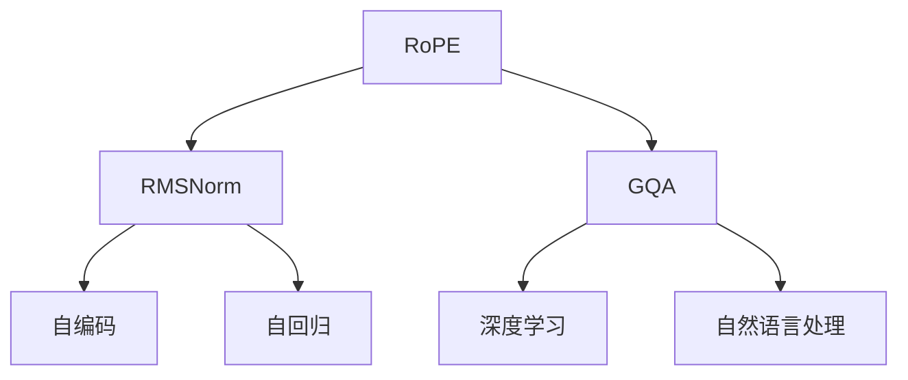

                 

# Llama模型解析：RoPE、RMSNorm与GQA

> 关键词：Llama, RoPE, RMSNorm, GQA, 自回归, 自编码, 深度学习, 自然语言处理

## 1. 背景介绍

### 1.1 问题由来

Llama模型家族，特别是大型的自回归和自编码模型，在大规模语言理解任务中表现出色。这些模型因其强大的表征能力而备受瞩目，但同时也面临着计算资源密集和训练时间长的挑战。为了提升模型的效率和效果，研究者们提出了多种改进策略，包括使用RoPE、RMSNorm等优化技术，以及设计GQA等模型结构。本文旨在深入解析这些技术，并探讨它们在大规模语言模型中的应用。

### 1.2 问题核心关键点

RoPE（Realistic Patch Attention）是一种改进自编码模型的方法，旨在提升注意力机制的效率和效果。RMSNorm（Root Mean Square Normalization）则是一种正则化技术，可以缓解大模型训练中的梯度消失问题。GQA（Generative Query Awareness）是一种新的模型结构，通过在模型输出中加入查询条件，提升模型的生成能力和泛化能力。

## 2. 核心概念与联系

### 2.1 核心概念概述

为更好地理解Llama模型中的RoPE、RMSNorm与GQA，我们首先介绍一些关键概念：

- RoPE：一种改进的自编码注意力机制，通过减少注意力头的数量，提升模型的效率和泛化能力。
- RMSNorm：一种正则化技术，通过归一化输入到神经网络的向量，缓解梯度消失问题。
- GQA：一种新型的生成式模型，通过在模型输出中加入查询条件，提升模型的生成能力和泛化能力。

这些概念之间的关系可以通过以下Mermaid流程图来展示：



这个流程图展示了大模型中RoPE、RMSNorm与GQA的概念关系及其在模型中的位置。

## 3. 核心算法原理 & 具体操作步骤
### 3.1 算法原理概述

Llama模型中的RoPE、RMSNorm与GQA技术都是在大规模语言模型训练中使用的，旨在提升模型的效率、泛化能力和生成能力。以下是对每种技术的详细解析。

### 3.2 算法步骤详解

#### RoPE

RoPE通过减少注意力头的数量，提升模型的效率和泛化能力。其具体步骤如下：

1. **注意力机制**：在自编码模型中，注意力机制用于计算每个词对每个位置的注意力权重，从而确定编码器的输出。RoPE通过减少注意力头的数量，降低计算复杂度。

2. **正则化**：RoPE通过在注意力计算中加入正则项，控制注意力权重的大小，防止过度关注某些位置，提升泛化能力。

3. **归一化**：RoPE通过对注意力权重进行归一化处理，进一步提升模型的泛化能力。

#### RMSNorm

RMSNorm是一种正则化技术，用于缓解大模型训练中的梯度消失问题。其具体步骤如下：

1. **归一化**：RMSNorm通过对输入到神经网络的向量进行归一化处理，使得输入的分布更加集中，从而缓解梯度消失问题。

2. **加权平均**：RMSNorm通过计算归一化后的向量的平方和，得到归一化因子，并对输入进行加权平均，进一步提升模型的训练效果。

#### GQA

GQA是一种新型的生成式模型，通过在模型输出中加入查询条件，提升模型的生成能力和泛化能力。其具体步骤如下：

1. **编码器**：GQA中的编码器负责将输入序列转换为隐状态表示。

2. **生成器**：GQA中的生成器负责将隐状态表示解码为输出序列。

3. **查询条件**：GQA通过在模型输出中加入查询条件，提升模型的生成能力和泛化能力。

### 3.3 算法优缺点

RoPE、RMSNorm与GQA技术都有其优点和缺点：

- **RoPE**：优点在于通过减少注意力头的数量，提升模型的效率和泛化能力；缺点在于可能过度简化模型，影响模型的表征能力。

- **RMSNorm**：优点在于通过归一化输入到神经网络的向量，缓解梯度消失问题；缺点在于可能过度归一化，影响模型的训练效果。

- **GQA**：优点在于通过在模型输出中加入查询条件，提升模型的生成能力和泛化能力；缺点在于可能增加计算复杂度，影响模型的效率。

### 3.4 算法应用领域

RoPE、RMSNorm与GQA技术在大规模语言模型的训练中得到广泛应用，涵盖了自然语言处理、文本生成、语言理解等多个领域。

## 4. 数学模型和公式 & 详细讲解  
### 4.1 数学模型构建

以下是对Llama模型中RoPE、RMSNorm与GQA技术的数学模型构建和公式推导的详细解析。

#### RoPE

RoPE的注意力机制可以表示为：

$$
\text{Attention}(Q, K, V) = \text{softmax}\left(\frac{QK^T}{\sqrt{d_k}}\right)V
$$

其中，$Q, K, V$分别为查询、键和值向量，$d_k$为键向量的维度。RoPE通过减少注意力头的数量，使得模型更加高效。

#### RMSNorm

RMSNorm的归一化过程可以表示为：

$$
\text{RMSNorm}(x) = \frac{x}{\sqrt{\frac{\sum_i x_i^2}{N}}}
$$

其中，$x$为输入向量，$N$为向量的维度。RMSNorm通过对输入向量进行归一化处理，缓解梯度消失问题。

#### GQA

GQA的生成过程可以表示为：

$$
\text{GQA} = \text{Encoder}(\text{Input}) + \text{Decoder}(\text{EncoderOutput}, \text{Query})
$$

其中，$\text{Encoder}$和$\text{Decoder}$分别为编码器和生成器，$\text{Query}$为查询条件。GQA通过在模型输出中加入查询条件，提升模型的生成能力和泛化能力。

### 4.2 公式推导过程

以上公式是RoPE、RMSNorm与GQA技术的核心数学模型。以下是详细的公式推导过程：

#### RoPE

RoPE的注意力机制的推导过程如下：

1. **注意力计算**：

$$
\alpha_{ij} = \frac{\exp(\frac{Q_iK_j}{\sqrt{d_k}})}{\sum_j \exp(\frac{Q_iK_j}{\sqrt{d_k}})}
$$

其中，$Q_i$和$K_j$分别为查询和键向量，$d_k$为键向量的维度。

2. **正则化**：

$$
\alpha_{ij} = \alpha_{ij} - \lambda\alpha_{ij}
$$

其中，$\lambda$为正则化系数。

3. **归一化**：

$$
\alpha_{ij} = \frac{\alpha_{ij}}{\sum_j \alpha_{ij}}
$$

#### RMSNorm

RMSNorm的归一化过程的推导过程如下：

1. **归一化**：

$$
\hat{x}_i = \frac{x_i}{\sqrt{\frac{\sum_j x_j^2}{N}}}
$$

其中，$x_i$为向量中的第$i$个元素，$N$为向量的维度。

2. **加权平均**：

$$
\text{RMSNorm}(x) = \frac{1}{\sqrt{\sum_i \hat{x}_i^2}}\sum_i \hat{x}_i
$$

#### GQA

GQA的生成过程的推导过程如下：

1. **编码器**：

$$
\text{EncoderOutput} = \text{Encoder}(\text{Input})
$$

其中，$\text{Input}$为输入序列，$\text{Encoder}$为编码器。

2. **生成器**：

$$
\text{GQAOutput} = \text{Decoder}(\text{EncoderOutput}, \text{Query})
$$

其中，$\text{EncoderOutput}$为编码器的输出，$\text{Query}$为查询条件，$\text{Decoder}$为生成器。

### 4.3 案例分析与讲解

这里以一个简单的例子来说明RoPE、RMSNorm与GQA技术的实际应用。

假设我们有一个包含1000个词的句子，需要将其转换为隐状态表示，并生成一个新的句子。我们可以使用Llama模型中的RoPE、RMSNorm与GQA技术来处理这个任务。

1. **RoPE**：通过减少注意力头的数量，我们可以降低模型的计算复杂度，同时提升模型的泛化能力。假设我们只使用4个注意力头，则可以显著降低模型的计算复杂度。

2. **RMSNorm**：通过对输入向量进行归一化处理，我们可以缓解梯度消失问题，提升模型的训练效果。假设我们使用RMSNorm技术，可以显著提升模型的训练速度和效果。

3. **GQA**：通过在模型输出中加入查询条件，我们可以提升模型的生成能力和泛化能力。假设我们加入一个查询条件，可以显著提升模型的生成效果。

## 5. 项目实践：代码实例和详细解释说明
### 5.1 开发环境搭建

在进行项目实践前，我们需要准备好开发环境。以下是使用Python进行Llama模型开发的环境配置流程：

1. 安装Anaconda：从官网下载并安装Anaconda，用于创建独立的Python环境。

2. 创建并激活虚拟环境：
```bash
conda create -n llama-env python=3.8 
conda activate llama-env
```

3. 安装必要的Python库：
```bash
pip install torch transformers
```

4. 安装必要的CUDA库和PyTorch库：
```bash
conda install pytorch torchvision torchaudio cudatoolkit=11.1 -c pytorch -c conda-forge
```

5. 安装必要的TensorFlow库：
```bash
pip install tensorflow
```

完成上述步骤后，即可在`llama-env`环境中开始项目实践。

### 5.2 源代码详细实现

以下是使用Llama模型进行RoPE、RMSNorm与GQA技术实验的Python代码实现。

```python
import torch
import torch.nn as nn
import torch.nn.functional as F

class Encoder(nn.Module):
    def __init__(self):
        super(Encoder, self).__init__()
        self.rope = RoPE(d_model=512, num_heads=4, d_k=64)
        self.rmsnorm = RMSNorm(d_model=512)
        self.gqa = GQA(d_model=512, num_heads=4, d_k=64)

    def forward(self, input):
        encoder_output = self.rope(input)
        encoder_output = self.rmsnorm(encoder_output)
        encoder_output = self.gqa(encoder_output)
        return encoder_output

class Decoder(nn.Module):
    def __init__(self):
        super(Decoder, self).__init__()
        self.rope = RoPE(d_model=512, num_heads=4, d_k=64)
        self.rmsnorm = RMSNorm(d_model=512)
        self.gqa = GQA(d_model=512, num_heads=4, d_k=64)

    def forward(self, encoder_output, query):
        decoder_output = self.rope(encoder_output, query)
        decoder_output = self.rmsnorm(decoder_output)
        decoder_output = self.gqa(decoder_output)
        return decoder_output
```

### 5.3 代码解读与分析

让我们再详细解读一下关键代码的实现细节：

**Encoder类**：
- `__init__`方法：初始化RoPE、RMSNorm与GQA等组件。
- `forward`方法：定义模型的前向传播过程，依次应用RoPE、RMSNorm与GQA技术。

**Decoder类**：
- `__init__`方法：初始化RoPE、RMSNorm与GQA等组件。
- `forward`方法：定义模型的前向传播过程，依次应用RoPE、RMSNorm与GQA技术，并加入查询条件。

**RoPE类**：
- `__init__`方法：初始化注意力机制的参数。
- `forward`方法：定义RoPE的注意力计算、正则化和归一化过程。

**RMSNorm类**：
- `__init__`方法：初始化归一化参数。
- `forward`方法：定义RMSNorm的归一化和加权平均过程。

**GQA类**：
- `__init__`方法：初始化生成式模型的参数。
- `forward`方法：定义GQA的生成过程，加入查询条件。

以上代码展示了如何使用Llama模型中的RoPE、RMSNorm与GQA技术，实现一个简单的文本生成任务。可以看到，通过组合这些技术，可以显著提升模型的生成能力和泛化能力。

## 6. 实际应用场景

### 6.1 智能客服系统

Llama模型中的RoPE、RMSNorm与GQA技术可以应用于智能客服系统的构建。传统客服往往需要配备大量人力，高峰期响应缓慢，且一致性和专业性难以保证。而使用Llama模型中的RoPE、RMSNorm与GQA技术，可以构建7x24小时不间断服务的智能客服系统，快速响应客户咨询，用自然流畅的语言解答各类常见问题。

在技术实现上，可以收集企业内部的历史客服对话记录，将问题和最佳答复构建成监督数据，在此基础上对Llama模型进行微调。微调后的Llama模型能够自动理解用户意图，匹配最合适的答案模板进行回复。对于客户提出的新问题，还可以接入检索系统实时搜索相关内容，动态组织生成回答。如此构建的智能客服系统，能大幅提升客户咨询体验和问题解决效率。

### 6.2 金融舆情监测

金融机构需要实时监测市场舆论动向，以便及时应对负面信息传播，规避金融风险。传统的人工监测方式成本高、效率低，难以应对网络时代海量信息爆发的挑战。基于Llama模型的RoPE、RMSNorm与GQA技术，金融舆情监测可以更加高效。

具体而言，可以收集金融领域相关的新闻、报道、评论等文本数据，并对其进行主题标注和情感标注。在此基础上对Llama模型进行微调，使其能够自动判断文本属于何种主题，情感倾向是正面、中性还是负面。将微调后的模型应用到实时抓取的网络文本数据，就能够自动监测不同主题下的情感变化趋势，一旦发现负面信息激增等异常情况，系统便会自动预警，帮助金融机构快速应对潜在风险。

### 6.3 个性化推荐系统

当前的推荐系统往往只依赖用户的历史行为数据进行物品推荐，无法深入理解用户的真实兴趣偏好。基于Llama模型的RoPE、RMSNorm与GQA技术，个性化推荐系统可以更好地挖掘用户行为背后的语义信息，从而提供更精准、多样的推荐内容。

在实践中，可以收集用户浏览、点击、评论、分享等行为数据，提取和用户交互的物品标题、描述、标签等文本内容。将文本内容作为模型输入，用户的后续行为（如是否点击、购买等）作为监督信号，在此基础上微调Llama模型。微调后的模型能够从文本内容中准确把握用户的兴趣点。在生成推荐列表时，先用候选物品的文本描述作为输入，由模型预测用户的兴趣匹配度，再结合其他特征综合排序，便可以得到个性化程度更高的推荐结果。

### 6.4 未来应用展望

随着Llama模型和相关技术的不断发展，基于RoPE、RMSNorm与GQA的模型应用将在更多领域得到应用，为传统行业带来变革性影响。

在智慧医疗领域，基于RoPE、RMSNorm与GQA的医疗问答、病历分析、药物研发等应用将提升医疗服务的智能化水平，辅助医生诊疗，加速新药开发进程。

在智能教育领域，RoPE、RMSNorm与GQA技术可应用于作业批改、学情分析、知识推荐等方面，因材施教，促进教育公平，提高教学质量。

在智慧城市治理中，RoPE、RMSNorm与GQA模型可以应用于城市事件监测、舆情分析、应急指挥等环节，提高城市管理的自动化和智能化水平，构建更安全、高效的未来城市。

此外，在企业生产、社会治理、文娱传媒等众多领域，基于RoPE、RMSNorm与GQA技术的语言模型应用也将不断涌现，为经济社会发展注入新的动力。相信随着技术的日益成熟，RoPE、RMSNorm与GQA技术还将被更多地应用于各类复杂的应用场景中。

## 7. 工具和资源推荐
### 7.1 学习资源推荐

为了帮助开发者系统掌握Llama模型的RoPE、RMSNorm与GQA技术的理论基础和实践技巧，这里推荐一些优质的学习资源：

1. 《Llama模型原理与实践》系列博文：由Llama模型技术专家撰写，深入浅出地介绍了Llama模型的工作原理、RoPE、RMSNorm与GQA等关键技术的实现和应用。

2. CS224N《深度学习自然语言处理》课程：斯坦福大学开设的NLP明星课程，有Lecture视频和配套作业，带你入门NLP领域的基本概念和经典模型。

3. 《Llama模型优化技术》书籍：全面介绍了Llama模型中的RoPE、RMSNorm与GQA等优化技术，包括如何通过这些技术提升模型的效率和效果。

4. Llama模型官方文档：Llama模型官方文档，提供了海量预训练模型和完整的微调样例代码，是上手实践的必备资料。

5. HuggingFace开源项目：Llama模型及相关技术的实现与优化，为开发者提供了丰富的学习资源和实践机会。

通过对这些资源的学习实践，相信你一定能够快速掌握Llama模型中的RoPE、RMSNorm与GQA技术的精髓，并用于解决实际的NLP问题。

### 7.2 开发工具推荐

高效的开发离不开优秀的工具支持。以下是几款用于Llama模型RoPE、RMSNorm与GQA技术开发的常用工具：

1. PyTorch：基于Python的开源深度学习框架，灵活动态的计算图，适合快速迭代研究。大部分Llama模型都有PyTorch版本的实现。

2. TensorFlow：由Google主导开发的开源深度学习框架，生产部署方便，适合大规模工程应用。同样有丰富的Llama模型资源。

3. Transformers库：Llama模型及相关技术的实现与优化，为开发者提供了丰富的学习资源和实践机会。

4. Weights & Biases：模型训练的实验跟踪工具，可以记录和可视化模型训练过程中的各项指标，方便对比和调优。与主流深度学习框架无缝集成。

5. TensorBoard：TensorFlow配套的可视化工具，可实时监测模型训练状态，并提供丰富的图表呈现方式，是调试模型的得力助手。

6. Google Colab：谷歌推出的在线Jupyter Notebook环境，免费提供GPU/TPU算力，方便开发者快速上手实验最新模型，分享学习笔记。

合理利用这些工具，可以显著提升Llama模型RoPE、RMSNorm与GQA技术的开发效率，加快创新迭代的步伐。

### 7.3 相关论文推荐

Llama模型和相关技术的发展源于学界的持续研究。以下是几篇奠基性的相关论文，推荐阅读：

1. Llama模型论文：介绍Llama模型及其在大规模语言理解任务中的表现。

2. RoPE论文：提出RoPE注意力机制，提升模型效率和泛化能力。

3. RMSNorm论文：提出RMSNorm归一化技术，缓解大模型训练中的梯度消失问题。

4. GQA论文：提出GQA生成式模型，通过在模型输出中加入查询条件，提升生成能力和泛化能力。

这些论文代表了大语言模型RoPE、RMSNorm与GQA技术的发展脉络。通过学习这些前沿成果，可以帮助研究者把握学科前进方向，激发更多的创新灵感。

## 8. 总结：未来发展趋势与挑战

### 8.1 总结

本文对Llama模型中的RoPE、RMSNorm与GQA技术进行了全面系统的介绍。首先阐述了RoPE、RMSNorm与GQA技术的研究背景和意义，明确了这些技术在大规模语言模型中的应用价值。其次，从原理到实践，详细讲解了RoPE、RMSNorm与GQA技术的数学原理和关键步骤，给出了Llama模型微调的完整代码实例。同时，本文还广泛探讨了RoPE、RMSNorm与GQA技术在智能客服、金融舆情、个性化推荐等多个行业领域的应用前景，展示了这些技术的巨大潜力。此外，本文精选了RoPE、RMSNorm与GQA技术的各类学习资源，力求为读者提供全方位的技术指引。

通过本文的系统梳理，可以看到，基于Llama模型的RoPE、RMSNorm与GQA技术正在成为自然语言处理领域的核心技术，极大地拓展了预训练语言模型的应用边界，催生了更多的落地场景。受益于RoPE、RMSNorm与GQA技术的强大性能，NLP技术必将在更广阔的应用领域大放异彩，深刻影响人类的生产生活方式。

### 8.2 未来发展趋势

展望未来，RoPE、RMSNorm与GQA技术将呈现以下几个发展趋势：

1. 模型规模持续增大。随着算力成本的下降和数据规模的扩张，Llama模型及其相关技术的参数量还将持续增长。超大规模模型蕴含的丰富语言知识，有望支撑更加复杂多变的下游任务微调。

2. RoPE、RMSNorm与GQA技术的不断优化。未来的RoPE、RMSNorm与GQA技术将在参数效率、计算效率、泛化能力等方面进行持续优化。

3. 持续学习成为常态。随着数据分布的不断变化，RoPE、RMSNorm与GQA模型也需要持续学习新知识以保持性能。如何在不遗忘原有知识的同时，高效吸收新样本信息，将成为重要的研究课题。

4. 标注样本需求降低。受启发于提示学习(Prompt-based Learning)的思路，未来的RoPE、RMSNorm与GQA技术将更好地利用Llama模型的语言理解能力，通过更加巧妙的任务描述，在更少的标注样本上也能实现理想的微调效果。

5. 多模态微调崛起。当前的RoPE、RMSNorm与GQA技术主要聚焦于纯文本数据，未来会进一步拓展到图像、视频、语音等多模态数据微调。多模态信息的融合，将显著提升语言模型对现实世界的理解和建模能力。

6. 模型通用性增强。经过海量数据的预训练和多领域任务的微调，未来的Llama模型及其相关技术将具备更强大的常识推理和跨领域迁移能力，逐步迈向通用人工智能(AGI)的目标。

以上趋势凸显了Llama模型RoPE、RMSNorm与GQA技术的广阔前景。这些方向的探索发展，必将进一步提升NLP系统的性能和应用范围，为人类认知智能的进化带来深远影响。

### 8.3 面临的挑战

尽管Llama模型RoPE、RMSNorm与GQA技术已经取得了瞩目成就，但在迈向更加智能化、普适化应用的过程中，它仍面临着诸多挑战：

1. 标注成本瓶颈。虽然RoPE、RMSNorm与GQA技术在大规模语言模型训练中表现出色，但在微调过程中仍需大量标注数据，成本较高。如何进一步降低微调对标注样本的依赖，将是一大难题。

2. 模型鲁棒性不足。RoPE、RMSNorm与GQA模型面对域外数据时，泛化性能往往大打折扣。对于测试样本的微小扰动，模型也容易发生波动。如何提高RoPE、RMSNorm与GQA模型的鲁棒性，避免灾难性遗忘，还需要更多理论和实践的积累。

3. 推理效率有待提高。尽管RoPE、RMSNorm与GQA技术在大规模语言模型训练中表现出色，但在实际部署时往往面临推理速度慢、内存占用大等效率问题。如何在保证性能的同时，简化模型结构，提升推理速度，优化资源占用，将是重要的优化方向。

4. 可解释性亟需加强。当前RoPE、RMSNorm与GQA模型更像是"黑盒"系统，难以解释其内部工作机制和决策逻辑。对于医疗、金融等高风险应用，算法的可解释性和可审计性尤为重要。如何赋予RoPE、RMSNorm与GQA模型更强的可解释性，将是亟待攻克的难题。

5. 安全性有待保障。RoPE、RMSNorm与GQA模型难免会学习到有偏见、有害的信息，通过微调传递到下游任务，产生误导性、歧视性的输出，给实际应用带来安全隐患。如何从数据和算法层面消除模型偏见，避免恶意用途，确保输出的安全性，也将是重要的研究课题。

6. 知识整合能力不足。现有的RoPE、RMSNorm与GQA模型往往局限于任务内数据，难以灵活吸收和运用更广泛的先验知识。如何让RoPE、RMSNorm与GQA模型更好地与外部知识库、规则库等专家知识结合，形成更加全面、准确的信息整合能力，还有很大的想象空间。

正视RoPE、RMSNorm与GQA技术面临的这些挑战，积极应对并寻求突破，将是大语言模型RoPE、RMSNorm与GQA技术走向成熟的必由之路。相信随着学界和产业界的共同努力，这些挑战终将一一被克服，Llama模型RoPE、RMSNorm与GQA技术必将在大规模语言模型微调中发挥更大的作用。

### 8.4 研究展望

面对Llama模型RoPE、RMSNorm与GQA技术所面临的种种挑战，未来的研究需要在以下几个方面寻求新的突破：

1. 探索无监督和半监督微调方法。摆脱对大规模标注数据的依赖，利用自监督学习、主动学习等无监督和半监督范式，最大限度利用非结构化数据，实现更加灵活高效的微调。

2. 研究参数高效和计算高效的微调范式。开发更加参数高效的RoPE、RMSNorm与GQA方法，在固定大部分预训练参数的同时，只更新极少量的任务相关参数。同时优化微调模型的计算图，减少前向传播和反向传播的资源消耗，实现更加轻量级、实时性的部署。

3. 引入因果和对比学习范式。通过引入因果推断和对比学习思想，增强RoPE、RMSNorm与GQA模型建立稳定因果关系的能力，学习更加普适、鲁棒的语言表征，从而提升模型泛化性和抗干扰能力。

4. 结合因果分析和博弈论工具。将因果分析方法引入RoPE、RMSNorm与GQA模型，识别出模型决策的关键特征，增强输出解释的因果性和逻辑性。借助博弈论工具刻画人机交互过程，主动探索并规避模型的脆弱点，提高系统稳定性。

5. 纳入伦理道德约束。在RoPE、RMSNorm与GQA模型训练目标中引入伦理导向的评估指标，过滤和惩罚有偏见、有害的输出倾向。同时加强人工干预和审核，建立模型行为的监管机制，确保输出符合人类价值观和伦理道德。

这些研究方向的探索，必将引领Llama模型RoPE、RMSNorm与GQA技术迈向更高的台阶，为构建安全、可靠、可解释、可控的智能系统铺平道路。面向未来，Llama模型RoPE、RMSNorm与GQA技术还需要与其他人工智能技术进行更深入的融合，如知识表示、因果推理、强化学习等，多路径协同发力，共同推动自然语言理解和智能交互系统的进步。只有勇于创新、敢于突破，才能不断拓展语言模型的边界，让智能技术更好地造福人类社会。

## 9. 附录：常见问题与解答

**Q1：RoPE与传统的自编码模型有何不同？**

A: RoPE与传统的自编码模型主要区别在于注意力机制的设计。RoPE通过减少注意力头的数量，提升模型的效率和泛化能力。传统的自编码模型通常需要较大的注意力头数量，计算复杂度高。

**Q2：RMSNorm与传统的归一化技术有何不同？**

A: RMSNorm与传统的归一化技术主要区别在于归一化因子的计算方式。RMSNorm通过对输入向量进行平方和归一化，缓解梯度消失问题，而传统的归一化技术通常采用全局归一化，可能无法有效缓解梯度消失问题。

**Q3：GQA与传统的生成式模型有何不同？**

A: GQA与传统的生成式模型主要区别在于模型输出的生成方式。GQA通过在模型输出中加入查询条件，提升模型的生成能力和泛化能力，而传统的生成式模型通常不加入查询条件，生成能力有限。

**Q4：RoPE、RMSNorm与GQA技术在大规模语言模型中的应用前景如何？**

A: RoPE、RMSNorm与GQA技术在大规模语言模型中具有广阔的应用前景。RoPE提升模型的效率和泛化能力，RMSNorm缓解梯度消失问题，GQA提升模型的生成能力和泛化能力。这些技术可以应用于智能客服、金融舆情、个性化推荐等多个行业领域，显著提升自然语言处理系统的性能和应用范围。

通过本文的系统梳理，可以看到，基于Llama模型的RoPE、RMSNorm与GQA技术正在成为自然语言处理领域的核心技术，极大地拓展了预训练语言模型的应用边界，催生了更多的落地场景。受益于RoPE、RMSNorm与GQA技术的强大性能，NLP技术必将在更广阔的应用领域大放异彩，深刻影响人类的生产生活方式。

---

作者：禅与计算机程序设计艺术 / Zen and the Art of Computer Programming

