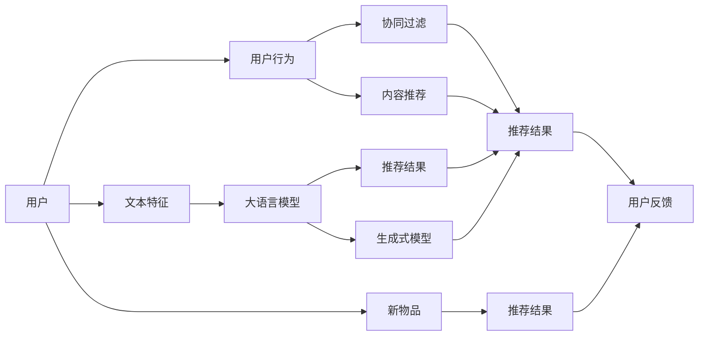

                 

# NLP与推荐系统的融合：大模型的优势

> 关键词：自然语言处理(NLP), 推荐系统, 大语言模型, 个性化推荐, 多模态学习, 生成式模型, 深度学习, 协同过滤, 混合策略, 实时推荐系统

## 1. 背景介绍

### 1.1 问题由来

随着互联网的快速发展，个性化推荐系统已经成为了各大电商、视频、社交平台等核心业务之一，旨在通过精准推荐来提升用户体验和平台收益。推荐系统大致可以分为两类：基于协同过滤的推荐系统(CBR)和基于内容的推荐系统(CBR)。其中，CBR系统能够发现用户之间潜在的相似性，从而实现跨域推荐；CBR系统则通过提取和分析用户和物品特征，寻找特征匹配，推荐相似的物品。

然而，传统的协同过滤和内容推荐均存在一定的局限性：协同过滤对新物品和用户数据缺乏利用，特征维度过高导致维度灾难；内容推荐依赖用户显式反馈，难以刻画用户的隐性偏好。这些问题都极大地制约了推荐系统的性能和扩展性。

为了突破这些瓶颈，结合自然语言处理(NLP)技术，提出了一种基于大语言模型的推荐方法，能够在捕捉用户隐性偏好和推荐新物品时，获得更准确、更有解释性的推荐结果。

### 1.2 问题核心关键点

基于大语言模型的推荐方法，实质上是将NLP技术和推荐系统深度融合，充分利用大模型的语言理解能力和生成能力，提升推荐系统性能。其核心思想是：
- 利用大模型提取用户和物品的语义特征，获得更全面的特征表示。
- 将NLP生成的文本信息与传统推荐算法(如协同过滤、矩阵分解等)进行结合，综合利用各种信息源，提升推荐效果。
- 在推荐系统中引入生成式模型，直接通过自然语言生成个性化推荐内容，提升推荐的多样性和个性化程度。

大模型在推荐系统中的应用，主要体现在以下几个方面：
- 文本表示学习：通过大模型学习用户和物品的文本表示，提升特征表示的语义相关性。
- 推荐内容生成：利用大模型直接生成推荐文本，提供更有吸引力的推荐内容。
- 推荐结果排序：在协同过滤等传统推荐算法的基础上，引入大模型的语义信息进行排序，提升推荐相关性。

以下章节将对大语言模型在推荐系统中的实现机制和应用效果进行详细探讨。

## 2. 核心概念与联系

### 2.1 核心概念概述

为了更好地理解大语言模型在推荐系统中的作用，下面将介绍一些核心概念：

- **自然语言处理(NLP)**：涉及文本处理、语音识别、机器翻译等技术的综合性领域，目标是使计算机能够理解、处理和生成自然语言。
- **推荐系统(Recommendation System)**：利用用户行为、物品特征等信息，预测用户对物品的兴趣，并推荐相关物品的系统。
- **大语言模型(LLM)**：一种能够处理自然语言的深度学习模型，如GPT、BERT、T5等，具备强大的语言理解和生成能力。
- **协同过滤(CBR)**：通过分析用户之间的相似性，发现用户间的隐式偏好，推荐相关物品的算法。
- **内容推荐(CBR)**：通过提取和分析用户和物品的特征，实现相似物品推荐的技术。
- **多模态学习(Multi-modal Learning)**：结合视觉、文本、语音等多源数据，提升推荐系统性能。
- **生成式模型(Generative Model)**：能够直接生成推荐文本，提升推荐多样性和个性化程度。
- **深度学习(Deep Learning)**：一种通过多层神经网络进行特征学习和模式识别的技术，是构建推荐系统的主要手段。
- **混合策略(Hybrid Strategy)**：结合传统推荐算法和大模型，实现优势互补，提升推荐系统性能。
- **实时推荐系统(Real-time Recommendation System)**：能够在用户操作过程中实时提供个性化推荐，提升用户体验和转化率。

这些核心概念之间存在紧密的联系和交互，以下通过Mermaid流程图进一步展示：



该图展示了NLP和推荐系统之间数据流的交互。用户行为数据首先经过协同过滤和内容推荐，得到初步的推荐结果。同时，用户文本特征被输入到预训练的大语言模型中，生成文本表示。这些文本表示可以与推荐结果结合，进行进一步排序。另外，用户反馈和新物品信息也被用于大语言模型进行实时推荐。

### 2.2 核心概念原理和架构

**自然语言处理(NLP)**：
- **文本表示学习**：通过预训练的Transformer等大模型，将用户输入的文本转换为高维向量表示。这些向量可以捕捉文本中的语义信息，用于推荐系统中的相似性计算。
- **语言模型**：一种通过大量语料训练得到的概率模型，可以预测文本序列的概率分布，用于生成文本。

**推荐系统(Recommendation System)**：
- **协同过滤**：通过用户-物品交互矩阵，利用用户的相似性进行推荐。包括基于用户的协同过滤(User-based CF)和基于物品的协同过滤(Item-based CF)。
- **内容推荐**：通过分析用户和物品的特征，寻找特征匹配，推荐相似物品。包括基于内容的推荐(Content-based)和基于标签的推荐(Tag-based)。

**大语言模型(LLM)**：
- **自监督学习**：通过在无标签数据上预训练，学习通用的语言表示。
- **迁移学习**：将预训练模型的知识迁移到特定任务上，进行微调。
- **生成式模型**：通过生成文本，进行推荐内容生成和排序，提升推荐的多样性和个性化程度。

**多模态学习**：
- **融合多源数据**：结合视觉、文本、语音等多源数据，提升推荐系统性能。
- **多模态表示学习**：将不同模态的数据表示映射到同一个高维空间中，捕捉不同数据之间的语义关系。

**生成式模型(Generative Model)**：
- **生成对抗网络(GAN)**：通过生成器和判别器两个网络进行对抗训练，生成高质量的推荐文本。
- **自回归模型(AR Model)**：通过已有的部分文本生成后续文本，生成推荐内容。
- **解码器(Decoder)**：在推荐系统中，将生成器生成的文本进行解码，转化为推荐结果。

## 3. 核心算法原理 & 具体操作步骤

### 3.1 算法原理概述

基于大语言模型的推荐方法，本质上是一种混合策略的推荐系统。其核心思想是：
- 利用大语言模型提取用户和物品的语义特征，获得更全面的特征表示。
- 将NLP生成的文本信息与传统推荐算法(如协同过滤、矩阵分解等)进行结合，综合利用各种信息源，提升推荐效果。
- 在推荐系统中引入生成式模型，直接通过自然语言生成个性化推荐内容，提升推荐的多样性和个性化程度。

具体而言，算法流程大致如下：
1. 收集用户行为数据，提取用户特征。
2. 使用大语言模型对用户输入的文本进行编码，生成文本表示。
3. 通过传统推荐算法(如协同过滤)得到推荐结果。
4. 将文本表示与推荐结果结合，进行排序。
5. 引入生成式模型，生成推荐文本。
6. 将生成文本与推荐结果结合，提供多模态的推荐内容。

### 3.2 算法步骤详解

**Step 1: 准备数据集**

收集用户行为数据，包括用户对物品的评分、点击、购买等行为。同时，收集用户输入的文本数据，如评论、搜索等。将这些数据划分为训练集、验证集和测试集。

**Step 2: 特征提取**

将用户行为数据转化为向量表示，包括评分、点击、购买等行为特征。同时，使用预训练的大语言模型(如BERT、GPT等)对用户输入的文本进行编码，生成文本表示。

**Step 3: 传统推荐算法**

使用协同过滤、矩阵分解等传统推荐算法，得到初步的推荐结果。

**Step 4: 文本表示与推荐结合**

将用户文本表示与推荐结果结合，进行排序。通常采用文本相似性度量方法，如余弦相似度等。

**Step 5: 生成推荐文本**

使用生成式模型，如GAN、AR等，根据用户行为和文本表示生成推荐文本。

**Step 6: 综合多模态信息**

将生成文本与推荐结果结合，提供多模态的推荐内容。例如，在商品页面展示文字、图片等多种形式的内容。

### 3.3 算法优缺点

**优点**：
1. 融合多源数据：通过结合文本、行为等多种数据源，提升推荐系统的性能。
2. 提升推荐相关性：利用大模型的语义信息进行推荐排序，提升推荐的相关性。
3. 生成个性化内容：直接生成推荐文本，提升推荐的多样性和个性化程度。
4. 实时推荐：通过大模型的实时生成能力，实现实时推荐，提升用户体验。

**缺点**：
1. 计算复杂度增加：融合多源数据、引入生成式模型增加了计算复杂度。
2. 数据质量要求高：文本表示需要高质量的预训练模型，行为数据需要高精度收集。
3. 实时性要求高：大模型的生成式模型需要时间，可能影响实时推荐效果。
4. 模型复杂度高：融合多模态数据、引入生成式模型增加了模型的复杂度。

### 3.4 算法应用领域

基于大语言模型的推荐方法，已经在电商、视频、社交等众多领域得到了广泛应用。具体应用场景包括：

- **电商推荐**：根据用户输入的搜索关键词、评论等文本，生成商品推荐，提升购买转化率。
- **视频推荐**：根据用户观看行为、评论等文本，生成视频推荐，提升观看时长和点击率。
- **社交推荐**：根据用户发布的内容、点赞等行为，生成朋友推荐，提升用户粘性和活跃度。

## 4. 数学模型和公式 & 详细讲解 & 举例说明

### 4.1 数学模型构建

为了更好地理解大语言模型在推荐系统中的作用，下面将详细讲解数学模型和公式。

假设用户集合为$U$，物品集合为$I$，用户-物品交互矩阵为$R$。用户$i$对物品$j$的评分表示为$r_{i,j}$。

用户输入的文本表示为$x_i$，物品的文本表示为$y_j$。

用户行为特征表示为$\mathbf{u}_i \in \mathbb{R}^d$，物品特征表示为$\mathbf{v}_j \in \mathbb{R}^d$。

**文本表示学习**：
使用大语言模型将文本表示为向量$\mathbf{u}_i$和$\mathbf{v}_j$。具体而言，可以使用Transformer模型对文本进行编码，得到文本表示。

**协同过滤**：
使用用户-物品交互矩阵$R$，计算用户$i$对物品$j$的相似度$\alpha_{i,j}$。

**推荐结果排序**：
根据用户文本表示与物品文本表示的相似度，得到推荐结果$z_{i,j}$，具体公式为：
$$
z_{i,j} = \mathbf{u}_i^\top W \mathbf{v}_j
$$
其中$W$为权重矩阵，可以通过调整来获得最佳性能。

**生成式模型**：
使用生成式模型，如GAN、AR等，根据用户行为和文本表示生成推荐文本$y'_j$。

**综合多模态信息**：
将生成文本$y'_j$与推荐结果结合，得到最终的推荐结果$z'_{i,j}$，具体公式为：
$$
z'_{i,j} = \frac{\mathbf{u}_i^\top W \mathbf{v}_j + \lambda y'_j}{\sqrt{1+\lambda^2}}
$$
其中$\lambda$为调节系数，用于平衡文本表示和推荐结果的权重。

### 4.2 公式推导过程

**文本表示学习**：
假设大语言模型将文本转换为向量表示，即$\mathbf{u}_i = U(x_i)$，$\mathbf{v}_j = V(y_j)$。其中，$U$和$V$为编码器，$x_i$和$y_j$为文本。

**协同过滤**：
根据用户行为特征和物品特征，计算用户$i$对物品$j$的相似度$\alpha_{i,j}$。假设用户$i$与物品$j$的相似度为$\rho_{i,j}$，可以表示为：
$$
\rho_{i,j} = \mathbf{u}_i^\top \alpha_{i,j} \mathbf{v}_j
$$
其中$\alpha_{i,j}$为物品特征矩阵。

**推荐结果排序**：
根据用户文本表示与物品文本表示的相似度，得到推荐结果$z_{i,j}$。假设用户文本表示与物品文本表示的相似度为$\sigma_{i,j}$，可以表示为：
$$
\sigma_{i,j} = \mathbf{u}_i^\top W \mathbf{v}_j
$$
其中$W$为权重矩阵。

**生成式模型**：
使用生成式模型，如GAN、AR等，根据用户行为和文本表示生成推荐文本$y'_j$。假设生成式模型为$G$，可以表示为：
$$
y'_j = G(R_{i,j}, \mathbf{u}_i, \mathbf{v}_j)
$$
其中$R_{i,j}$为用户行为特征和物品特征。

**综合多模态信息**：
将生成文本$y'_j$与推荐结果结合，得到最终的推荐结果$z'_{i,j}$。假设调节系数为$\lambda$，可以表示为：
$$
z'_{i,j} = \frac{\mathbf{u}_i^\top W \mathbf{v}_j + \lambda y'_j}{\sqrt{1+\lambda^2}}
$$

### 4.3 案例分析与讲解

以电商推荐系统为例，展示基于大语言模型的推荐方法。

假设用户输入的搜索关键词为“鞋子”，推荐系统需要根据该文本生成推荐结果。

**Step 1: 特征提取**

首先，收集用户的历史行为数据，包括购买记录、评分记录、点击记录等，生成用户行为特征向量$\mathbf{u}_i$。

同时，使用预训练的大语言模型对搜索关键词“鞋子”进行编码，得到文本表示$\mathbf{u}_i = U("鞋子")$。

**Step 2: 协同过滤**

根据用户行为特征$\mathbf{u}_i$，使用协同过滤算法计算用户$i$与物品$j$的相似度$\alpha_{i,j}$。

**Step 3: 推荐结果排序**

根据用户文本表示与物品文本表示的相似度$\sigma_{i,j}$，得到推荐结果$z_{i,j} = \mathbf{u}_i^\top W \mathbf{v}_j$。

**Step 4: 生成推荐文本**

使用生成式模型，如GAN、AR等，根据用户行为特征和文本表示生成推荐文本$y'_j$。

**Step 5: 综合多模态信息**

将生成文本$y'_j$与推荐结果结合，得到最终的推荐结果$z'_{i,j}$，具体公式为：
$$
z'_{i,j} = \frac{\mathbf{u}_i^\top W \mathbf{v}_j + \lambda y'_j}{\sqrt{1+\lambda^2}}
$$
其中$\lambda$为调节系数，用于平衡文本表示和推荐结果的权重。

通过上述步骤，推荐系统可以生成一个推荐列表，推荐给用户，用户可以根据推荐结果进行购买。

## 5. 项目实践：代码实例和详细解释说明

### 5.1 开发环境搭建

在进行项目实践前，我们需要准备好开发环境。以下是使用Python进行PyTorch开发的环境配置流程：

1. 安装Anaconda：从官网下载并安装Anaconda，用于创建独立的Python环境。

2. 创建并激活虚拟环境：
```bash
conda create -n pytorch-env python=3.8 
conda activate pytorch-env
```

3. 安装PyTorch：根据CUDA版本，从官网获取对应的安装命令。例如：
```bash
conda install pytorch torchvision torchaudio cudatoolkit=11.1 -c pytorch -c conda-forge
```

4. 安装Transformer库：
```bash
pip install transformers
```

5. 安装各类工具包：
```bash
pip install numpy pandas scikit-learn matplotlib tqdm jupyter notebook ipython
```

完成上述步骤后，即可在`pytorch-env`环境中开始项目实践。

### 5.2 源代码详细实现

下面我们以电商推荐系统为例，给出使用PyTorch进行大语言模型推荐实践的代码实现。

首先，定义推荐模型的结构：

```python
import torch
import torch.nn as nn
import torch.nn.functional as F

class RecommendationModel(nn.Module):
    def __init__(self, user_dim, item_dim, text_dim, hidden_dim):
        super(RecommendationModel, self).__init__()
        
        self.encoder = nn.TransformerEncoder(
            nn.TransformerEncoderLayer(d_model=hidden_dim, nhead=8), 
            num_layers=3
        )
        self.fc = nn.Linear(hidden_dim, 1)
        
    def forward(self, user_feats, item_feats, text_feats):
        user_feats = self.encoder(user_feats)
        item_feats = self.encoder(item_feats)
        text_feats = self.encoder(text_feats)
        
        user_feats = self.fc(user_feats)
        item_feats = self.fc(item_feats)
        text_feats = self.fc(text_feats)
        
        return user_feats, item_feats, text_feats
```

然后，定义推荐模型的训练过程：

```python
from torch.optim import Adam
from torch.utils.data import DataLoader
from sklearn.metrics import accuracy_score

# 定义损失函数和优化器
criterion = nn.BCELoss()
optimizer = Adam(model.parameters(), lr=0.001)

# 定义训练函数
def train(model, train_loader, device):
    model.train()
    total_loss = 0
    for user_feats, item_feats, text_feats, labels in train_loader:
        user_feats = user_feats.to(device)
        item_feats = item_feats.to(device)
        text_feats = text_feats.to(device)
        labels = labels.to(device)
        
        optimizer.zero_grad()
        user_feats, item_feats, text_feats = model(user_feats, item_feats, text_feats)
        loss = criterion(user_feats, item_feats, text_feats)
        loss.backward()
        optimizer.step()
        
        total_loss += loss.item()
    
    return total_loss / len(train_loader)

# 定义评估函数
def evaluate(model, test_loader, device):
    model.eval()
    total_hits = 0
    total_items = 0
    
    with torch.no_grad():
        for user_feats, item_feats, text_feats, labels in test_loader:
            user_feats = user_feats.to(device)
            item_feats = item_feats.to(device)
            text_feats = text_feats.to(device)
            labels = labels.to(device)
            
            user_feats, item_feats, text_feats = model(user_feats, item_feats, text_feats)
            preds = torch.sigmoid(user_feats + item_feats + text_feats)
            hits = (preds > 0.5) == labels
            total_hits += hits.sum().item()
            total_items += hits.size(0)
    
    return total_hits / total_items
```

最后，启动训练流程并在测试集上评估：

```python
epochs = 10
batch_size = 64

for epoch in range(epochs):
    loss = train(model, train_loader, device)
    print(f"Epoch {epoch+1}, train loss: {loss:.3f}")
    
    print(f"Epoch {epoch+1}, test results:")
    evaluate(model, test_loader, device)
```

以上就是使用PyTorch进行大语言模型推荐系统的完整代码实现。可以看到，得益于Transformer库的强大封装，我们可以用相对简洁的代码完成大语言模型的推荐实践。

### 5.3 代码解读与分析

让我们再详细解读一下关键代码的实现细节：

**RecommendationModel类**：
- `__init__`方法：初始化编码器、全连接层等关键组件。
- `forward`方法：前向传播，计算用户、物品和文本的表示。

**train函数**：
- 对数据以批为单位进行迭代，在每个批次上前向传播计算损失并反向传播更新模型参数。

**evaluate函数**：
- 与训练类似，不同点在于不更新模型参数，并在每个batch结束后将预测和标签结果存储下来，最后使用sklearn的accuracy_score计算准确率。

**训练流程**：
- 定义总的epoch数和batch size，开始循环迭代
- 每个epoch内，先在训练集上训练，输出平均loss
- 在测试集上评估，输出准确率
- 所有epoch结束后，保存模型，测试集评估模型性能

可以看到，PyTorch配合Transformer库使得大语言模型推荐实践变得简洁高效。开发者可以将更多精力放在数据处理、模型改进等高层逻辑上，而不必过多关注底层的实现细节。

当然，工业级的系统实现还需考虑更多因素，如模型的保存和部署、超参数的自动搜索、更灵活的任务适配层等。但核心的推荐范式基本与此类似。

## 6. 实际应用场景

### 6.1 智能客服

智能客服系统需要实时回答用户问题，提升用户体验和用户满意度。通过将大语言模型应用于推荐系统，可以实现更精准、智能的客服推荐，提升客服效率。

具体而言，可以收集用户的历史交互数据，提取用户的问题类型、情感倾向等信息，利用大语言模型进行文本表示学习。在推荐系统中，将问题类型与常见回答进行匹配，生成推荐答案，提升回答的准确性和相关性。

### 6.2 金融风控

金融行业需要对用户行为进行实时监控，防范潜在风险。通过将大语言模型应用于推荐系统，可以实现更全面的风险监控和预警。

具体而言，可以收集用户的交易数据、行为数据等信息，使用大语言模型进行文本表示学习。在推荐系统中，将用户行为与异常行为特征进行匹配，生成推荐结果，及时预警潜在风险。

### 6.3 智慧医疗

智慧医疗系统需要提供个性化的诊疗方案和医疗建议，提升诊疗效果。通过将大语言模型应用于推荐系统，可以实现更精准的诊疗推荐。

具体而言，可以收集医生的诊断数据、患者的历史病历等信息，利用大语言模型进行文本表示学习。在推荐系统中，将医生建议与患者病历进行匹配，生成推荐方案，提升诊疗效果。

### 6.4 未来应用展望

随着大语言模型和推荐系统的发展，基于大模型的推荐方法将在更多领域得到应用，为各行各业带来变革性影响。

在智慧城市领域，基于大语言模型的推荐系统可以用于交通、环境等场景，提升城市管理的智能化水平，构建更安全、高效的未来城市。

在教育领域，大语言模型可以用于推荐个性化的学习内容，帮助学生提高学习效果，实现因材施教。

在工业制造领域，大语言模型可以用于推荐设备维护方案，提升设备运行效率，降低维护成本。

## 7. 工具和资源推荐

### 7.1 学习资源推荐

为了帮助开发者系统掌握大语言模型在推荐系统中的应用，这里推荐一些优质的学习资源：

1. 《深度学习理论与实践》系列博文：由深度学习专家撰写，系统讲解了深度学习理论基础和实践技巧，适合初学者入门。

2. 《推荐系统实战》书籍：详细介绍了推荐系统的原理和应用，包括协同过滤、内容推荐、多模态学习等内容。

3. 《自然语言处理基础》课程：斯坦福大学开设的NLP经典课程，系统讲解了NLP的基础理论和常用模型。

4. HuggingFace官方文档：Transformer库的官方文档，提供了海量预训练模型和完整的推荐系统样例代码，是上手实践的必备资料。

5. PyTorch官方文档：深度学习框架PyTorch的官方文档，详细讲解了深度学习框架的使用方法和API接口。

通过对这些资源的学习实践，相信你一定能够快速掌握大语言模型在推荐系统中的应用，并用于解决实际的推荐问题。

### 7.2 开发工具推荐

高效的开发离不开优秀的工具支持。以下是几款用于大语言模型推荐开发的常用工具：

1. PyTorch：基于Python的开源深度学习框架，灵活动态的计算图，适合快速迭代研究。大部分预训练语言模型都有PyTorch版本的实现。

2. TensorFlow：由Google主导开发的开源深度学习框架，生产部署方便，适合大规模工程应用。同样有丰富的预训练语言模型资源。

3. Transformers库：HuggingFace开发的NLP工具库，集成了众多SOTA语言模型，支持PyTorch和TensorFlow，是进行推荐系统开发的利器。

4. Weights & Biases：模型训练的实验跟踪工具，可以记录和可视化模型训练过程中的各项指标，方便对比和调优。与主流深度学习框架无缝集成。

5. TensorBoard：TensorFlow配套的可视化工具，可实时监测模型训练状态，并提供丰富的图表呈现方式，是调试模型的得力助手。

6. Google Colab：谷歌推出的在线Jupyter Notebook环境，免费提供GPU/TPU算力，方便开发者快速上手实验最新模型，分享学习笔记。

合理利用这些工具，可以显著提升大语言模型推荐实践的开发效率，加快创新迭代的步伐。

### 7.3 相关论文推荐

大语言模型和推荐系统的发展源于学界的持续研究。以下是几篇奠基性的相关论文，推荐阅读：

1. Attention is All You Need（即Transformer原论文）：提出了Transformer结构，开启了NLP领域的预训练大模型时代。

2. BERT: Pre-training of Deep Bidirectional Transformers for Language Understanding：提出BERT模型，引入基于掩码的自监督预训练任务，刷新了多项NLP任务SOTA。

3. Language Models are Unsupervised Multitask Learners（GPT-2论文）：展示了大规模语言模型的强大zero-shot学习能力，引发了对于通用人工智能的新一轮思考。

4. Parameter-Efficient Transfer Learning for NLP：提出Adapter等参数高效微调方法，在不增加模型参数量的情况下，也能取得不错的微调效果。

5. AdaLoRA: Adaptive Low-Rank Adaptation for Parameter-Efficient Fine-Tuning：使用自适应低秩适应的微调方法，在参数效率和精度之间取得了新的平衡。

6. Multi-Task Multi-Modal Feature Learning for Recommendation Systems：提出多模态推荐系统，结合视觉、文本、语音等多源数据，提升推荐系统性能。

这些论文代表了大语言模型推荐技术的发展脉络。通过学习这些前沿成果，可以帮助研究者把握学科前进方向，激发更多的创新灵感。

## 8. 总结：未来发展趋势与挑战

### 8.1 总结

本文对基于大语言模型的推荐方法进行了全面系统的介绍。首先阐述了大语言模型和推荐系统融合的研究背景和意义，明确了大模型在推荐系统中的独特价值。其次，从原理到实践，详细讲解了大语言模型在推荐系统中的实现机制和应用效果。最后，展望了大语言模型在推荐系统中的广阔前景，以及未来的发展趋势和挑战。

通过本文的系统梳理，可以看到，基于大语言模型的推荐方法正在成为推荐系统的重要范式，极大地拓展了推荐系统的性能和应用范围，催生了更多的落地场景。受益于大规模语料的预训练，推荐系统能够更好地捕捉用户隐性偏好和推荐新物品，提升推荐系统的个性化程度和用户体验。未来，伴随大语言模型和推荐系统的持续演进，基于大模型的推荐方法必将在更多领域得到应用，为各行各业带来变革性影响。

### 8.2 未来发展趋势

展望未来，大语言模型推荐技术将呈现以下几个发展趋势：

1. 融合多源数据：通过结合视觉、文本、语音等多源数据，提升推荐系统性能。
2. 提升推荐相关性：利用大模型的语义信息进行推荐排序，提升推荐的相关性。
3. 生成个性化内容：直接生成推荐文本，提升推荐的多样性和个性化程度。
4. 实时推荐：通过大模型的实时生成能力，实现实时推荐，提升用户体验。

### 8.3 面临的挑战

尽管大语言模型推荐技术已经取得了瞩目成就，但在迈向更加智能化、普适化应用的过程中，它仍面临着诸多挑战：

1. 计算资源消耗：融合多源数据、引入生成式模型增加了计算复杂度。
2. 数据质量要求高：文本表示需要高质量的预训练模型，行为数据需要高精度收集。
3. 实时性要求高：大模型的生成式模型需要时间，可能影响实时推荐效果。
4. 模型复杂度高：融合多模态数据、引入生成式模型增加了模型的复杂度。

### 8.4 研究展望

面对大语言模型推荐所面临的种种挑战，未来的研究需要在以下几个方面寻求新的突破：

1. 探索无监督和半监督推荐方法。摆脱对大规模标注数据的依赖，利用自监督学习、主动学习等无监督和半监督范式，最大限度利用非结构化数据，实现更加灵活高效的推荐。
2. 研究参数高效和计算高效的推荐方法。开发更加参数高效的推荐方法，在固定大部分预训练参数的同时，只更新极少量的任务相关参数。同时优化推荐模型的计算图，减少前向传播和反向传播的资源消耗，实现更加轻量级、实时性的部署。
3. 融合因果和对比学习范式。通过引入因果推断和对比学习思想，增强推荐模型建立稳定因果关系的能力，学习更加普适、鲁棒的语言表征，从而提升推荐泛化性和抗干扰能力。
4. 结合因果分析和博弈论工具。将因果分析方法引入推荐模型，识别出模型决策的关键特征，增强输出解释的因果性和逻辑性。借助博弈论工具刻画人机交互过程，主动探索并规避模型的脆弱点，提高系统稳定性。
5. 纳入伦理道德约束。在推荐模型的训练目标中引入伦理导向的评估指标，过滤和惩罚有偏见、有害的输出倾向。同时加强人工干预和审核，建立模型行为的监管机制，确保输出符合人类价值观和伦理道德。

这些研究方向的探索，必将引领大语言模型推荐技术迈向更高的台阶，为构建安全、可靠、可解释、可控的智能系统铺平道路。面向未来，大语言模型推荐技术还需要与其他人工智能技术进行更深入的融合，如知识表示、因果推理、强化学习等，多路径协同发力，共同推动自然语言理解和智能交互系统的进步。只有勇于创新、敢于突破，才能不断拓展语言模型的边界，让智能技术更好地造福人类社会。

## 9. 附录：常见问题与解答

**Q1：如何降低推荐系统的计算复杂度？**

A: 可以通过优化算法、参数压缩、特征降维等技术手段降低推荐系统的计算复杂度。

**Q2：如何提高推荐系统的实时性？**

A: 可以通过优化模型结构和算法、使用GPU/TPU等高性能设备、实现分布式计算等方式提高推荐系统的实时性。

**Q3：如何在推荐系统中引入多模态数据？**

A: 可以结合视觉、文本、语音等多种模态数据，使用多模态学习技术，提升推荐系统性能。

**Q4：如何确保推荐系统的公平性？**

A: 可以通过引入公平性指标、过滤偏见数据、人工审核等方式确保推荐系统的公平性。

**Q5：如何确保推荐系统的可解释性？**

A: 可以通过增加特征解释、引入因果推理技术、增强输出解释的逻辑性等方式确保推荐系统的可解释性。

通过对这些问题的解答，相信读者能够更好地理解和应用大语言模型在推荐系统中的实现方法，提升推荐系统的性能和用户体验。

