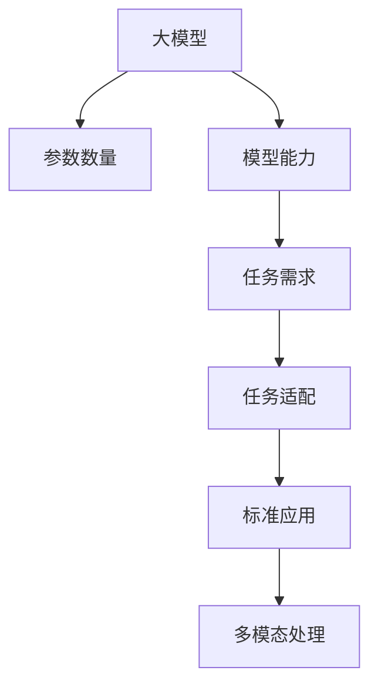

                 

# NLP领域的大模型标准与应用：参数、能力、任务

> 关键词：NLP,大模型,参数,能力,任务标准,应用范式

## 1. 背景介绍

### 1.1 问题由来

自然语言处理(Natural Language Processing, NLP)领域近年来取得了飞速发展，得益于深度学习技术的突破，尤其是大规模预训练语言模型的大规模应用。这些大模型通过在无标签文本数据上进行预训练，学习到丰富的语言知识和常识，然后通过有监督学习在小规模数据上进行微调，在各种NLP任务上取得优异的表现。

然而，这些通用大模型虽然具备较强的通用性，但在特定领域和任务上往往表现不足。因此，如何基于通用大模型构建特定任务的标准应用模型，成为当前NLP领域的重要研究方向。本文将详细探讨基于参数、能力和任务的大模型标准应用范式，以期对NLP领域的开发和研究提供系统性的指导。

### 1.2 问题核心关键点

NLP领域的大模型标准应用，主要涉及三个关键点：参数数量、模型能力和任务需求。本文将从这三个方面入手，详细介绍如何构建适应特定任务的大模型，并结合实际案例进行展示。

1. **参数数量**：大模型的参数数量直接影响其计算资源消耗和模型的推理速度。本文将介绍如何根据任务需求合理设计模型的参数规模。
2. **模型能力**：不同任务对模型能力的需求不同，本文将详细说明如何针对特定任务设计模型结构，充分利用其语言理解和生成能力。
3. **任务需求**：不同任务具有不同的处理目标和需求，本文将探讨如何设计适合特定任务的标准应用模型。

## 2. 核心概念与联系

### 2.1 核心概念概述

为更好地理解基于参数、能力和任务的大模型标准应用方法，本节将介绍几个密切相关的核心概念：

- **大模型(Large Model)**：指具有大量参数的预训练语言模型，如BERT、GPT、RoBERTa等，能够学习到丰富的语言知识。
- **参数数量(Parameter Size)**：模型的参数规模，直接影响其计算效率和推理速度。
- **模型能力(Model Capability)**：指模型在特定任务上的表现能力，如语言理解、生成、推理等。
- **任务需求(Task Demand)**：指特定任务对模型性能的需求，如实时性、准确性、鲁棒性等。
- **任务适配(Adaptation)**：指将预训练模型应用于特定任务的过程，包括微调、细粒度调整等。
- **标准应用(Standardized Application)**：指设计统一标准的模型架构和接口，提高模型的可复用性和可扩展性。
- **多模态处理(Multimodal Processing)**：指融合文本、图像、语音等多种模态信息，提高模型的综合处理能力。

这些核心概念之间的逻辑关系可以通过以下Mermaid流程图来展示：



这个流程图展示了大模型标准应用的核心概念及其之间的关系：

1. 大模型通过预训练学习丰富的语言知识。
2. 模型的参数数量直接影响其计算资源消耗。
3. 特定任务对模型能力有不同需求。
4. 通过任务适配，将预训练模型应用于特定任务。
5. 设计标准应用模型，提高模型可复用性和可扩展性。
6. 多模态处理可提升模型对复杂场景的适应能力。

这些概念共同构成了大模型标准应用的基础框架，为NLP领域的应用提供了方向性的指导。

## 3. 核心算法原理 & 具体操作步骤
### 3.1 算法原理概述

基于参数、能力和任务的大模型标准应用，本质上是一种结构化的模型设计方法。其核心思想是：在预训练大模型的基础上，根据特定任务的需求，设计合理的参数规模、模型结构和任务适配方式，从而构建出适应特定任务的模型。

具体来说，就是：
- 选择合适的预训练语言模型。
- 根据任务需求调整模型的参数规模，避免过拟合。
- 针对任务特性设计合适的模型结构，如引入特定层、调整层间连接等。
- 进行微调或细粒度调整，优化模型在特定任务上的表现。
- 设计标准化的模型接口和参数设置，提高模型的可复用性和可扩展性。

### 3.2 算法步骤详解

基于参数、能力和任务的大模型标准应用，一般包括以下几个关键步骤：

**Step 1: 选择合适的预训练模型**
- 根据任务类型和数据规模，选择合适的预训练语言模型，如BERT、GPT、RoBERTa等。
- 考虑模型的大小和训练时间，评估其对计算资源的消耗。

**Step 2: 调整模型的参数规模**
- 根据任务需求，确定模型的参数数量。对于计算资源有限的情况，可以通过减少参数数量来降低模型复杂度。
- 采用参数高效微调技术，如Adapter、LoRA等，在保持大部分预训练权重不变的前提下，只微调顶层或特定层。

**Step 3: 设计合适的模型结构**
- 根据任务特性，设计适合的模型结构。例如，对于问答任务，可以引入SQuAD风格的多层注意力机制；对于文本生成任务，可以引入Transformer的注意力机制。
- 合理分配模型各层的参数，使得模型在不同任务上表现均衡。

**Step 4: 进行微调或细粒度调整**
- 根据任务需求，进行微调或细粒度调整。微调可以采用小批量数据、梯度积累等技术，避免过拟合。
- 设计合适的损失函数和优化器，如交叉熵损失、AdamW优化器等。

**Step 5: 设计标准化的模型接口**
- 设计统一的模型输入输出接口，方便模型的复用和扩展。
- 提供标准化的参数配置选项，如批大小、学习率、激活函数等，方便用户快速搭建模型。

**Step 6: 评估模型性能**
- 在验证集上评估模型性能，进行超参数调优。
- 在测试集上进一步验证模型性能，确保其满足任务需求。

**Step 7: 部署和维护**
- 将模型部署到生产环境，进行监控和维护。
- 定期更新模型，以应对数据分布变化和任务需求变更。

以上是基于参数、能力和任务的大模型标准应用的一般流程。在实际应用中，还需要根据具体任务的需求进行优化设计，如改进训练目标函数，引入更多的正则化技术，搜索最优的超参数组合等，以进一步提升模型性能。

### 3.3 算法优缺点

基于参数、能力和任务的大模型标准应用，具有以下优点：
1. 参数规模可控，能够平衡计算资源和模型性能。
2. 模型结构灵活，可根据任务需求进行调整，提升模型表现。
3. 标准化的接口设计，方便模型复用和扩展。
4. 能够在计算资源有限的情况下，构建高效、易用的模型。
5. 能够提升模型的可解释性和可复现性。

同时，该方法也存在一定的局限性：
1. 设计模型结构和任务适配时，需要丰富的经验和专业知识。
2. 微调过程可能面临过拟合问题，需要进行有效的正则化。
3. 标准化的模型接口可能限制了模型的创新空间。
4. 对于特定领域的任务，可能需要进一步预训练和微调。
5. 多模态融合的技术复杂度高，实现难度大。

尽管存在这些局限性，但就目前而言，基于参数、能力和任务的大模型标准应用方法仍是NLP领域的主要范式。未来相关研究的重点在于如何进一步优化模型的参数规模和结构，提高其适应性和泛化能力，同时兼顾可解释性和伦理安全性等因素。

### 3.4 算法应用领域

基于大模型标准应用的方法，在NLP领域已经得到了广泛的应用，覆盖了几乎所有常见任务，例如：

- 文本分类：如情感分析、主题分类、意图识别等。通过设计多层次的特征提取和分类器，可以实现高效的文本分类。
- 命名实体识别：识别文本中的人名、地名、机构名等特定实体。通过引入多注意力机制，提升实体边界和类型的识别精度。
- 关系抽取：从文本中抽取实体之间的语义关系。通过引入知识图谱和逻辑规则，实现更准确的关系抽取。
- 问答系统：对自然语言问题给出答案。通过设计多轮对话管理模块和知识库，实现自然流畅的问答交互。
- 机器翻译：将源语言文本翻译成目标语言。通过设计编码-解码结构，实现高效的机器翻译。
- 文本摘要：将长文本压缩成简短摘要。通过设计压缩算法和抽取策略，实现高效的文本摘要。
- 对话系统：使机器能够与人自然对话。通过设计多轮对话生成模型和对话管理模块，实现高效的对话交互。

除了上述这些经典任务外，大模型标准应用技术也被创新性地应用到更多场景中，如可控文本生成、常识推理、代码生成、数据增强等，为NLP技术带来了全新的突破。随着预训练模型和标准应用方法的不断进步，相信NLP技术将在更广阔的应用领域大放异彩。

## 4. 数学模型和公式 & 详细讲解  
### 4.1 数学模型构建

本节将使用数学语言对基于参数、能力和任务的大模型标准应用过程进行更加严格的刻画。

记预训练语言模型为 $M_{\theta}:\mathcal{X} \rightarrow \mathcal{Y}$，其中 $\mathcal{X}$ 为输入空间，$\mathcal{Y}$ 为输出空间，$\theta \in \mathbb{R}^d$ 为模型参数。假设微调任务的训练集为 $D=\{(x_i,y_i)\}_{i=1}^N, x_i \in \mathcal{X}, y_i \in \mathcal{Y}$。

定义模型 $M_{\theta}$ 在输入 $x$ 上的损失函数为 $\ell(M_{\theta}(x),y)$，则在数据集 $D$ 上的经验风险为：

$$
\mathcal{L}(\theta) = \frac{1}{N} \sum_{i=1}^N \ell(M_{\theta}(x_i),y_i)
$$

微调的优化目标是最小化经验风险，即找到最优参数：

$$
\theta^* = \mathop{\arg\min}_{\theta} \mathcal{L}(\theta)
$$

在实践中，我们通常使用基于梯度的优化算法（如SGD、Adam等）来近似求解上述最优化问题。设 $\eta$ 为学习率，$\lambda$ 为正则化系数，则参数的更新公式为：

$$
\theta \leftarrow \theta - \eta \nabla_{\theta}\mathcal{L}(\theta) - \eta\lambda\theta
$$

其中 $\nabla_{\theta}\mathcal{L}(\theta)$ 为损失函数对参数 $\theta$ 的梯度，可通过反向传播算法高效计算。

### 4.2 公式推导过程

以下我们以文本分类任务为例，推导交叉熵损失函数及其梯度的计算公式。

假设模型 $M_{\theta}$ 在输入 $x$ 上的输出为 $\hat{y}=M_{\theta}(x) \in [0,1]$，表示样本属于正类的概率。真实标签 $y \in \{0,1\}$。则二分类交叉熵损失函数定义为：

$$
\ell(M_{\theta}(x),y) = -[y\log \hat{y} + (1-y)\log (1-\hat{y})]
$$

将其代入经验风险公式，得：

$$
\mathcal{L}(\theta) = -\frac{1}{N}\sum_{i=1}^N [y_i\log M_{\theta}(x_i)+(1-y_i)\log(1-M_{\theta}(x_i))]
$$

根据链式法则，损失函数对参数 $\theta_k$ 的梯度为：

$$
\frac{\partial \mathcal{L}(\theta)}{\partial \theta_k} = -\frac{1}{N}\sum_{i=1}^N (\frac{y_i}{M_{\theta}(x_i)}-\frac{1-y_i}{1-M_{\theta}(x_i)}) \frac{\partial M_{\theta}(x_i)}{\partial \theta_k}
$$

其中 $\frac{\partial M_{\theta}(x_i)}{\partial \theta_k}$ 可进一步递归展开，利用自动微分技术完成计算。

在得到损失函数的梯度后，即可带入参数更新公式，完成模型的迭代优化。重复上述过程直至收敛，最终得到适应下游任务的最优模型参数 $\theta^*$。

## 5. 项目实践：代码实例和详细解释说明
### 5.1 开发环境搭建

在进行标准应用实践前，我们需要准备好开发环境。以下是使用Python进行PyTorch开发的环境配置流程：

1. 安装Anaconda：从官网下载并安装Anaconda，用于创建独立的Python环境。

2. 创建并激活虚拟环境：
```bash
conda create -n pytorch-env python=3.8 
conda activate pytorch-env
```

3. 安装PyTorch：根据CUDA版本，从官网获取对应的安装命令。例如：
```bash
conda install pytorch torchvision torchaudio cudatoolkit=11.1 -c pytorch -c conda-forge
```

4. 安装Transformers库：
```bash
pip install transformers
```

5. 安装各类工具包：
```bash
pip install numpy pandas scikit-learn matplotlib tqdm jupyter notebook ipython
```

完成上述步骤后，即可在`pytorch-env`环境中开始标准应用实践。

### 5.2 源代码详细实现

下面我们以命名实体识别(NER)任务为例，给出使用Transformers库对BERT模型进行标准应用开发的PyTorch代码实现。

首先，定义NER任务的数据处理函数：

```python
from transformers import BertTokenizer
from torch.utils.data import Dataset
import torch

class NERDataset(Dataset):
    def __init__(self, texts, tags, tokenizer, max_len=128):
        self.texts = texts
        self.tags = tags
        self.tokenizer = tokenizer
        self.max_len = max_len
        
    def __len__(self):
        return len(self.texts)
    
    def __getitem__(self, item):
        text = self.texts[item]
        tags = self.tags[item]
        
        encoding = self.tokenizer(text, return_tensors='pt', max_length=self.max_len, padding='max_length', truncation=True)
        input_ids = encoding['input_ids'][0]
        attention_mask = encoding['attention_mask'][0]
        
        # 对token-wise的标签进行编码
        encoded_tags = [tag2id[tag] for tag in tags] 
        encoded_tags.extend([tag2id['O']] * (self.max_len - len(encoded_tags)))
        labels = torch.tensor(encoded_tags, dtype=torch.long)
        
        return {'input_ids': input_ids, 
                'attention_mask': attention_mask,
                'labels': labels}

# 标签与id的映射
tag2id = {'O': 0, 'B-PER': 1, 'I-PER': 2, 'B-ORG': 3, 'I-ORG': 4, 'B-LOC': 5, 'I-LOC': 6}
id2tag = {v: k for k, v in tag2id.items()}

# 创建dataset
tokenizer = BertTokenizer.from_pretrained('bert-base-cased')

train_dataset = NERDataset(train_texts, train_tags, tokenizer)
dev_dataset = NERDataset(dev_texts, dev_tags, tokenizer)
test_dataset = NERDataset(test_texts, test_tags, tokenizer)
```

然后，定义模型和优化器：

```python
from transformers import BertForTokenClassification, AdamW

model = BertForTokenClassification.from_pretrained('bert-base-cased', num_labels=len(tag2id))

optimizer = AdamW(model.parameters(), lr=2e-5)
```

接着，定义训练和评估函数：

```python
from torch.utils.data import DataLoader
from tqdm import tqdm
from sklearn.metrics import classification_report

device = torch.device('cuda') if torch.cuda.is_available() else torch.device('cpu')
model.to(device)

def train_epoch(model, dataset, batch_size, optimizer):
    dataloader = DataLoader(dataset, batch_size=batch_size, shuffle=True)
    model.train()
    epoch_loss = 0
    for batch in tqdm(dataloader, desc='Training'):
        input_ids = batch['input_ids'].to(device)
        attention_mask = batch['attention_mask'].to(device)
        labels = batch['labels'].to(device)
        model.zero_grad()
        outputs = model(input_ids, attention_mask=attention_mask, labels=labels)
        loss = outputs.loss
        epoch_loss += loss.item()
        loss.backward()
        optimizer.step()
    return epoch_loss / len(dataloader)

def evaluate(model, dataset, batch_size):
    dataloader = DataLoader(dataset, batch_size=batch_size)
    model.eval()
    preds, labels = [], []
    with torch.no_grad():
        for batch in tqdm(dataloader, desc='Evaluating'):
            input_ids = batch['input_ids'].to(device)
            attention_mask = batch['attention_mask'].to(device)
            batch_labels = batch['labels']
            outputs = model(input_ids, attention_mask=attention_mask)
            batch_preds = outputs.logits.argmax(dim=2).to('cpu').tolist()
            batch_labels = batch_labels.to('cpu').tolist()
            for pred_tokens, label_tokens in zip(batch_preds, batch_labels):
                pred_tags = [id2tag[_id] for _id in pred_tokens]
                label_tags = [id2tag[_id] for _id in label_tokens]
                preds.append(pred_tags[:len(label_tags)])
                labels.append(label_tags)
                
    print(classification_report(labels, preds))
```

最后，启动训练流程并在测试集上评估：

```python
epochs = 5
batch_size = 16

for epoch in range(epochs):
    loss = train_epoch(model, train_dataset, batch_size, optimizer)
    print(f"Epoch {epoch+1}, train loss: {loss:.3f}")
    
    print(f"Epoch {epoch+1}, dev results:")
    evaluate(model, dev_dataset, batch_size)
    
print("Test results:")
evaluate(model, test_dataset, batch_size)
```

以上就是使用PyTorch对BERT进行命名实体识别任务标准应用开发的完整代码实现。可以看到，得益于Transformers库的强大封装，我们可以用相对简洁的代码完成BERT模型的加载和标准应用。

### 5.3 代码解读与分析

让我们再详细解读一下关键代码的实现细节：

**NERDataset类**：
- `__init__`方法：初始化文本、标签、分词器等关键组件。
- `__len__`方法：返回数据集的样本数量。
- `__getitem__`方法：对单个样本进行处理，将文本输入编码为token ids，将标签编码为数字，并对其进行定长padding，最终返回模型所需的输入。

**tag2id和id2tag字典**：
- 定义了标签与数字id之间的映射关系，用于将token-wise的预测结果解码回真实的标签。

**训练和评估函数**：
- 使用PyTorch的DataLoader对数据集进行批次化加载，供模型训练和推理使用。
- 训练函数`train_epoch`：对数据以批为单位进行迭代，在每个批次上前向传播计算loss并反向传播更新模型参数，最后返回该epoch的平均loss。
- 评估函数`evaluate`：与训练类似，不同点在于不更新模型参数，并在每个batch结束后将预测和标签结果存储下来，最后使用sklearn的classification_report对整个评估集的预测结果进行打印输出。

**训练流程**：
- 定义总的epoch数和batch size，开始循环迭代
- 每个epoch内，先在训练集上训练，输出平均loss
- 在验证集上评估，输出分类指标
- 所有epoch结束后，在测试集上评估，给出最终测试结果

可以看到，PyTorch配合Transformers库使得BERT标准应用的代码实现变得简洁高效。开发者可以将更多精力放在数据处理、模型改进等高层逻辑上，而不必过多关注底层的实现细节。

当然，工业级的系统实现还需考虑更多因素，如模型的保存和部署、超参数的自动搜索、更灵活的任务适配层等。但核心的标准应用范式基本与此类似。

## 6. 实际应用场景
### 6.1 智能客服系统

基于大模型标准应用技术，智能客服系统可以通过对预训练语言模型进行微调和优化，构建高效的自然语言处理模型。智能客服系统能够理解客户咨询内容，匹配最合适的答案模板，并给出回答。

在技术实现上，可以收集企业内部的历史客服对话记录，将问题和最佳答复构建成监督数据，在此基础上对预训练语言模型进行微调。微调后的语言模型能够自动理解用户意图，匹配最合适的答案模板进行回复。对于客户提出的新问题，还可以接入检索系统实时搜索相关内容，动态组织生成回答。如此构建的智能客服系统，能大幅提升客户咨询体验和问题解决效率。

### 6.2 金融舆情监测

金融机构需要实时监测市场舆论动向，以便及时应对负面信息传播，规避金融风险。传统的人工监测方式成本高、效率低，难以应对网络时代海量信息爆发的挑战。基于大模型标准应用技术的文本分类和情感分析技术，为金融舆情监测提供了新的解决方案。

具体而言，可以收集金融领域相关的新闻、报道、评论等文本数据，并对其进行主题标注和情感标注。在此基础上对预训练语言模型进行微调，使其能够自动判断文本属于何种主题，情感倾向是正面、中性还是负面。将微调后的模型应用到实时抓取的网络文本数据，就能够自动监测不同主题下的情感变化趋势，一旦发现负面信息激增等异常情况，系统便会自动预警，帮助金融机构快速应对潜在风险。

### 6.3 个性化推荐系统

当前的推荐系统往往只依赖用户的历史行为数据进行物品推荐，无法深入理解用户的真实兴趣偏好。基于大模型标准应用技术的个性化推荐系统，可以通过对预训练语言模型的微调和优化，构建高效的个性化推荐模型。

在实践中，可以收集用户浏览、点击、评论、分享等行为数据，提取和用户交互的物品标题、描述、标签等文本内容。将文本内容作为模型输入，用户的后续行为（如是否点击、购买等）作为监督信号，在此基础上微调预训练语言模型。微调后的模型能够从文本内容中准确把握用户的兴趣点。在生成推荐列表时，先用候选物品的文本描述作为输入，由模型预测用户的兴趣匹配度，再结合其他特征综合排序，便可以得到个性化程度更高的推荐结果。

### 6.4 未来应用展望

随着大模型标准应用技术的不断发展，基于微调的方法将在更多领域得到应用，为传统行业带来变革性影响。

在智慧医疗领域，基于标准应用技术的医疗问答、病历分析、药物研发等应用将提升医疗服务的智能化水平，辅助医生诊疗，加速新药开发进程。

在智能教育领域，标准应用技术可应用于作业批改、学情分析、知识推荐等方面，因材施教，促进教育公平，提高教学质量。

在智慧城市治理中，标准应用技术可应用于城市事件监测、舆情分析、应急指挥等环节，提高城市管理的自动化和智能化水平，构建更安全、高效的未来城市。

此外，在企业生产、社会治理、文娱传媒等众多领域，基于大模型标准应用的人工智能应用也将不断涌现，为经济社会发展注入新的动力。相信随着技术的日益成熟，标准应用技术将成为人工智能落地应用的重要范式，推动人工智能技术在垂直行业的规模化落地。总之，标准应用技术需要在数据、算法、工程、业务等多个维度协同发力，才能真正实现人工智能技术在垂直行业的规模化落地。总之，标准应用技术需要在数据、算法、工程、业务等多个维度协同发力，才能真正实现人工智能技术在垂直行业的规模化落地。

## 7. 工具和资源推荐
### 7.1 学习资源推荐

为了帮助开发者系统掌握大模型标准应用的理论基础和实践技巧，这里推荐一些优质的学习资源：

1. 《Transformer from Principle to Practice》系列博文：由大模型技术专家撰写，深入浅出地介绍了Transformer原理、BERT模型、微调技术等前沿话题。

2. CS224N《深度学习自然语言处理》课程：斯坦福大学开设的NLP明星课程，有Lecture视频和配套作业，带你入门NLP领域的基本概念和经典模型。

3. 《Natural Language Processing with Transformers》书籍：Transformers库的作者所著，全面介绍了如何使用Transformers库进行NLP任务开发，包括标准应用在内的诸多范式。

4. HuggingFace官方文档：Transformers库的官方文档，提供了海量预训练模型和完整的标准应用样例代码，是上手实践的必备资料。

5. CLUE开源项目：中文语言理解测评基准，涵盖大量不同类型的中文NLP数据集，并提供了基于标准应用的baseline模型，助力中文NLP技术发展。

通过对这些资源的学习实践，相信你一定能够快速掌握大模型标准应用的精髓，并用于解决实际的NLP问题。
###  7.2 开发工具推荐

高效的开发离不开优秀的工具支持。以下是几款用于大模型标准应用开发的常用工具：

1. PyTorch：基于Python的开源深度学习框架，灵活动态的计算图，适合快速迭代研究。大部分预训练语言模型都有PyTorch版本的实现。

2. TensorFlow：由Google主导开发的开源深度学习框架，生产部署方便，适合大规模工程应用。同样有丰富的预训练语言模型资源。

3. Transformers库：HuggingFace开发的NLP工具库，集成了众多SOTA语言模型，支持PyTorch和TensorFlow，是进行标准应用开发的利器。

4. Weights & Biases：模型训练的实验跟踪工具，可以记录和可视化模型训练过程中的各项指标，方便对比和调优。与主流深度学习框架无缝集成。

5. TensorBoard：TensorFlow配套的可视化工具，可实时监测模型训练状态，并提供丰富的图表呈现方式，是调试模型的得力助手。

6. Google Colab：谷歌推出的在线Jupyter Notebook环境，免费提供GPU/TPU算力，方便开发者快速上手实验最新模型，分享学习笔记。

合理利用这些工具，可以显著提升大模型标准应用任务的开发效率，加快创新迭代的步伐。

### 7.3 相关论文推荐

大模型标准应用技术的不断发展源于学界的持续研究。以下是几篇奠基性的相关论文，推荐阅读：

1. Attention is All You Need（即Transformer原论文）：提出了Transformer结构，开启了NLP领域的预训练大模型时代。

2. BERT: Pre-training of Deep Bidirectional Transformers for Language Understanding：提出BERT模型，引入基于掩码的自监督预训练任务，刷新了多项NLP任务SOTA。

3. Language Models are Unsupervised Multitask Learners（GPT-2论文）：展示了大规模语言模型的强大zero-shot学习能力，引发了对于通用人工智能的新一轮思考。

4. Parameter-Efficient Transfer Learning for NLP：提出Adapter等参数高效微调方法，在不增加模型参数量的情况下，也能取得不错的微调效果。

5. AdaLoRA: Adaptive Low-Rank Adaptation for Parameter-Efficient Fine-Tuning：使用自适应低秩适应的微调方法，在保持大部分预训练参数的同时，只更新极少量的任务相关参数。

6. Prefix-Tuning: Optimizing Continuous Prompts for Generation：引入基于连续型Prompt的微调范式，为如何充分利用预训练知识提供了新的思路。

这些论文代表了大模型标准应用技术的发展脉络。通过学习这些前沿成果，可以帮助研究者把握学科前进方向，激发更多的创新灵感。

## 8. 总结：未来发展趋势与挑战

### 8.1 总结

本文对基于参数、能力和任务的大模型标准应用方法进行了全面系统的介绍。首先阐述了标准应用的理论基础和实践技巧，明确了标准应用在拓展预训练模型应用、提升下游任务性能方面的独特价值。其次，从原理到实践，详细讲解了标准应用的数学原理和关键步骤，给出了标准应用任务开发的完整代码实例。同时，本文还广泛探讨了标准应用方法在智能客服、金融舆情、个性化推荐等多个行业领域的应用前景，展示了标准应用范式的巨大潜力。此外，本文精选了标准应用技术的各类学习资源，力求为读者提供全方位的技术指引。

通过本文的系统梳理，可以看到，基于参数、能力和任务的标准应用方法正在成为NLP领域的重要范式，极大地拓展了预训练语言模型的应用边界，催生了更多的落地场景。受益于大规模语料的预训练，标准应用模型以更低的时间和标注成本，在小样本条件下也能取得理想的性能，有力推动了NLP技术的产业化进程。未来，伴随预训练语言模型和标准应用方法的不断进步，相信NLP技术将在更广阔的应用领域大放异彩，深刻影响人类的生产生活方式。

### 8.2 未来发展趋势

展望未来，大模型标准应用技术将呈现以下几个发展趋势：

1. 模型规模持续增大。随着算力成本的下降和数据规模的扩张，预训练语言模型的参数量还将持续增长。超大规模语言模型蕴含的丰富语言知识，有望支撑更加复杂多变的下游任务标准应用。

2. 标准应用方法日趋多样。除了传统的全参数微调外，未来会涌现更多标准应用方法，如Adapter、LoRA等，在保持大部分预训练参数的情况下，只微调顶层或特定层。

3. 持续学习成为常态。随着数据分布的不断变化，标准应用模型也需要持续学习新知识以保持性能。如何在不遗忘原有知识的同时，高效吸收新样本信息，将成为重要的研究课题。

4. 标注样本需求降低。受启发于提示学习(Prompt-based Learning)的思路，未来的标准应用方法将更好地利用大模型的语言理解能力，通过更加巧妙的任务描述，在更少的标注样本上也能实现理想的标准应用效果。

5. 标准化的模型接口设计，进一步提升模型的可复用性和可扩展性。

6. 多模态融合的技术复杂度高，实现难度大，但融合文本、图像、语音等多种模态信息，提高模型的综合处理能力，将是重要的研究方向。

以上趋势凸显了大模型标准应用技术的广阔前景。这些方向的探索发展，必将进一步提升NLP系统的性能和应用范围，为人类认知智能的进化带来深远影响。

### 8.3 面临的挑战

尽管大模型标准应用技术已经取得了瞩目成就，但在迈向更加智能化、普适化应用的过程中，它仍面临着诸多挑战：

1. 标注成本瓶颈。尽管标准应用降低了对标注样本的依赖，但对于长尾应用场景，难以获得充足的高质量标注数据，成为制约标准应用性能的瓶颈。如何进一步降低标准应用对标注样本的依赖，将是一大难题。

2. 模型鲁棒性不足。当前标准应用模型面对域外数据时，泛化性能往往大打折扣。对于测试样本的微小扰动，标准应用模型的预测也容易发生波动。如何提高标准应用模型的鲁棒性，避免灾难性遗忘，还需要更多理论和实践的积累。

3. 推理效率有待提高。大规模语言模型虽然精度高，但在实际部署时往往面临推理速度慢、内存占用大等效率问题。如何在保证性能的同时，简化模型结构，提升推理速度，优化资源占用，将是重要的优化方向。

4. 可解释性亟需加强。当前标准应用模型更像是"黑盒"系统，难以解释其内部工作机制和决策逻辑。对于医疗、金融等高风险应用，算法的可解释性和可审计性尤为重要。如何赋予标准应用模型更强的可解释性，将是亟待攻克的难题。

5. 安全性有待保障。预训练语言模型难免会学习到有偏见、有害的信息，通过标准应用传递到下游任务，产生误导性、歧视性的输出，给实际应用带来安全隐患。如何从数据和算法层面消除模型偏见，避免恶意用途，确保输出的安全性，也将是重要的研究课题。

6. 知识整合能力不足。现有的标准应用模型往往局限于任务内数据，难以灵活吸收和运用更广泛的先验知识。如何让标准应用过程更好地与外部知识库、规则库等专家知识结合，形成更加全面、准确的信息整合能力，还有很大的想象空间。

正视标准应用面临的这些挑战，积极应对并寻求突破，将是大模型标准应用走向成熟的必由之路。相信随着学界和产业界的共同努力，这些挑战终将一一被克服，大模型标准应用必将在构建人机协同的智能时代中扮演越来越重要的角色。

### 8.4 未来突破

面对大模型标准应用所面临的种种挑战，未来的研究需要在以下几个方面寻求新的突破：

1. 探索无监督和半监督标准应用方法。摆脱对大规模标注数据的依赖，利用自监督学习、主动学习等无监督和半监督范式，最大限度利用非结构化数据，实现更加灵活高效的标准应用。

2. 研究参数高效和计算高效的模型接口设计。开发更加参数高效的标准应用方法，在固定大部分预训练参数的同时，只微调顶层或特定层。同时优化标准应用模型的计算图，减少前向传播和反向传播的资源消耗，实现更加轻量级、实时性的部署。

3. 融合因果和对比学习范式。通过引入因果推断和对比学习思想，增强标准应用模型建立稳定因果关系的能力，学习更加普适、鲁棒的语言表征，从而提升模型泛化性和抗干扰能力。

4. 引入更多先验知识。将符号化的先验知识，如知识图谱、逻辑规则等，与神经网络模型进行巧妙融合，引导标准应用过程学习更准确、合理的语言模型。同时加强不同模态数据的整合，实现视觉、语音等多模态信息与文本信息的协同建模。

5. 结合因果分析和博弈论工具。将因果分析方法引入标准应用模型，识别出模型决策的关键特征，增强输出解释的因果性和逻辑性。借助博弈论工具刻画人机交互过程，主动探索并规避模型的脆弱点，提高系统稳定性。

6. 纳入伦理道德约束。在模型训练目标中引入伦理导向的评估指标，过滤和惩罚有偏见、有害的输出倾向。同时加强人工干预和审核，建立模型行为的监管机制，确保输出符合人类价值观和伦理道德。

这些研究方向的探索，必将引领大模型标准应用技术迈向更高的台阶，为构建安全、可靠、可解释、可控的智能系统铺平道路。面向未来，大模型标准应用技术还需要与其他人工智能技术进行更深入的融合，如知识表示、因果推理、强化学习等，多路径协同发力，共同推动自然语言理解和智能交互系统的进步。只有勇于创新、敢于突破，才能不断拓展语言模型的边界，让智能技术更好地造福人类社会。

## 9. 附录：常见问题与解答

**Q1：标准应用是否适用于所有NLP任务？**

A: 标准应用在大多数NLP任务上都能取得不错的效果，特别是对于数据量较小的任务。但对于一些特定领域的任务，如医学、法律等，仅仅依靠通用语料预训练的模型可能难以很好地适应。此时需要在特定领域语料上进一步预训练，再进行标准应用，才能获得理想效果。此外，对于一些需要时效性、个性化很强的任务，如对话、推荐等，标准应用方法也需要针对性的改进优化。

**Q2：如何进行模型参数优化？**

A: 模型参数优化是标准应用过程中的重要环节。一般来说，可以通过以下步骤进行优化：

1. 选择合适的预训练模型，根据任务需求调整模型参数规模，避免过拟合。

2. 设计合理的模型结构，合理分配各层的参数数量，提高模型在不同任务上的表现。

3. 选择合适的优化器，如AdamW、SGD等，并设定合适的学习率和正则化参数。

4. 进行微调或细粒度调整，优化模型在特定任务上的表现。

5. 在验证集上评估模型性能，进行超参数调优，直到达到最优性能。

**Q3：标准应用过程中如何处理多模态数据？**

A: 多模态数据处理是标准应用中的一个难点。一般来说，可以通过以下步骤进行多模态数据融合：

1. 对不同模态的数据进行预处理，使其具有相同的表示形式。

2. 设计多模态融合的模型结构，如将文本、图像、语音等信息融合到一个神经网络中。

3. 选择合适的融合方式，如加法、乘法、注意力机制等。

4. 在训练过程中，将多模态数据同时输入模型，进行联合训练。

5. 在推理过程中，将多模态数据同时输入模型，进行联合推理。

通过多模态融合，可以构建更全面、准确的语言理解模型，提升系统的综合处理能力。

**Q4：标准应用模型在实际部署中需要注意哪些问题？**

A: 将标准应用模型部署到生产环境，还需要考虑以下因素：

1. 模型裁剪：去除不必要的层和参数，减小模型尺寸，加快推理速度。

2. 量化加速：将浮点模型转为定点模型，压缩存储空间，提高计算效率。

3. 服务化封装：将模型封装为标准化服务接口，便于模型的复用和扩展。

4. 弹性伸缩：根据请求流量动态调整资源配置，平衡服务质量和成本。

5. 监控告警：实时采集系统指标，设置异常告警阈值，确保服务稳定性。

6. 安全防护：采用访问鉴权、数据脱敏等措施，保障数据和模型安全。

标准应用模型需要开发者在数据、算法、工程、业务等多个维度协同发力，才能真正实现人工智能技术在垂直行业的规模化落地。总之，标准应用模型需要在数据、算法、工程、业务等多个维度协同发力，才能真正实现人工智能技术在垂直行业的规模化落地。

---

作者：禅与计算机程序设计艺术 / Zen and the Art of Computer Programming

