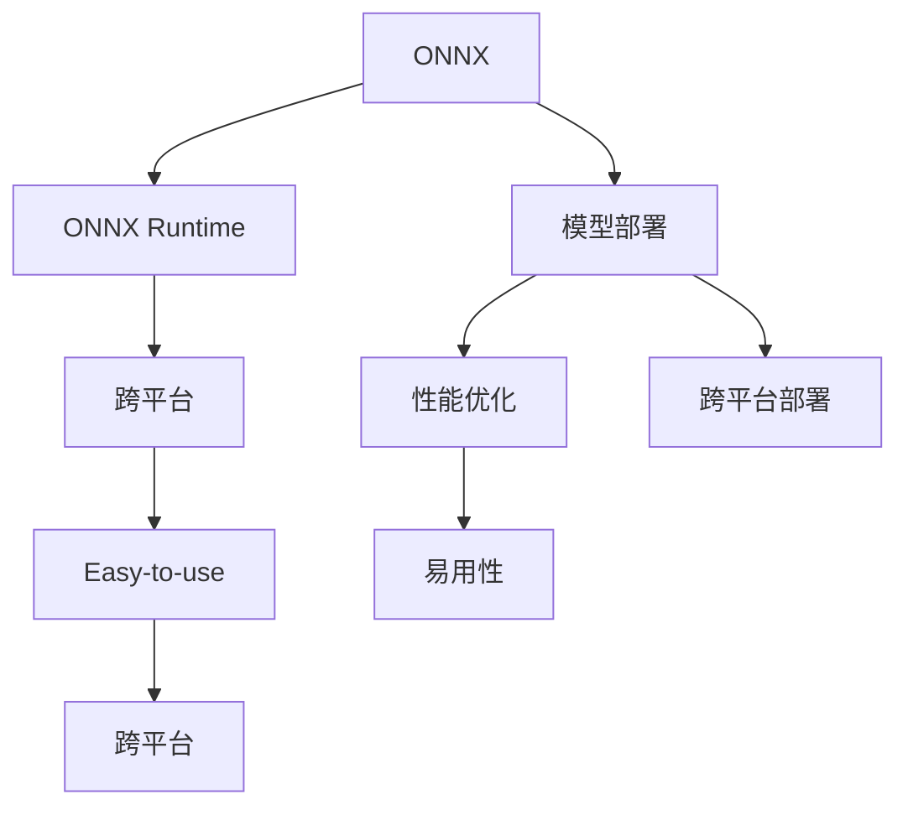

                 

# ONNX Runtime 跨平台：在不同设备上部署模型

> 关键词：ONNX, 模型部署, 跨平台, 高性能, 模型优化

## 1. 背景介绍

### 1.1 问题由来
在人工智能（AI）领域，模型部署是一个关键的环节。尤其是在实时应用场景中，如自动驾驶、工业自动化、医疗诊断等，模型的快速加载和高效运行对于系统的响应速度和稳定性至关重要。然而，不同设备（如CPU、GPU、FPGA、ASIC等）的性能差异和异构性使得模型部署成为一个复杂且耗时的过程。

### 1.2 问题核心关键点
为了解决这一问题，各大公司纷纷推出了一系列的优化技术，如TensorFlow Lite、TensorRT、CoreML等。这些技术分别针对不同的平台，提供了一套完整的模型优化和部署工具链。然而，这些技术往往需要开发者掌握各自的专业知识，并且在不同的平台间切换时，仍需重写大量的代码，这无疑增加了开发者的负担。

### 1.3 问题研究意义
ONNX（Open Neural Network Exchange）作为近年来新兴的模型交换标准，其跨平台性、可扩展性和易用性使其成为了理想的模型部署解决方案。通过ONNX，开发者只需编写一次模型，就可以在不同的平台和硬件上高效运行，显著提升了模型部署的效率和灵活性。本文将详细介绍ONNX Runtime及其跨平台部署技术，帮助读者全面掌握这一关键技术。

## 2. 核心概念与联系

### 2.1 核心概念概述

为更好地理解ONNX Runtime跨平台部署技术，本节将介绍几个密切相关的核心概念：

- **ONNX**：Open Neural Network Exchange，一种模型交换标准，支持多种深度学习框架（如TensorFlow、PyTorch、MXNet等）生成，并在不同的硬件平台上进行转换和优化。

- **ONNX Runtime**：ONNX生态系统中的一部分，提供模型加载、推理、执行等核心功能，支持CPU、GPU、FPGA等多种硬件平台。

- **模型部署**：将训练好的模型转化为可运行的程序，并在目标设备上执行，以达到实时响应的目的。

- **跨平台**：在多种硬件平台（如CPU、GPU、FPGA、ASIC等）上实现模型的高效运行。

- **性能优化**：通过代码生成、模型转换、内存管理等手段，提升模型的执行速度和资源利用率。

- **易用性**：提供友好的API接口，简化开发流程，降低技术门槛。

这些核心概念之间的逻辑关系可以通过以下Mermaid流程图来展示：



这个流程图展示了几大核心概念之间的联系：

1. ONNX作为模型交换标准，在模型部署过程中发挥着关键作用。
2. ONNX Runtime作为ONNX生态系统的一部分，提供了模型加载和执行的核心功能。
3. 跨平台部署是指模型在多种硬件平台上的高效运行。
4. 性能优化是通过代码生成、模型转换、内存管理等手段提升模型执行效率。
5. 易用性是指提供友好的API接口，降低技术门槛。

这些概念共同构成了ONNX Runtime跨平台部署的完整框架，使其能够在多种硬件平台间灵活切换，实现高效的模型部署。

## 3. 核心算法原理 & 具体操作步骤

### 3.1 算法原理概述

ONNX Runtime跨平台部署的核心原理是：

- **模型转换**：将不同框架生成的模型转换为ONNX格式，以便在ONNX Runtime上进行统一处理。
- **代码生成**：根据目标平台的架构特性，自动生成目标平台的代码，并进行必要的优化。
- **模型优化**：通过量化、剪枝、合并等技术，优化模型的结构，提升执行效率。
- **内存管理**：采用内存池、动态分配等技术，减少内存碎片和消耗，提高资源利用率。

这些技术共同作用，使得模型在多种硬件平台上的运行效率大幅提升，同时保持了易用性和跨平台性。

### 3.2 算法步骤详解

基于ONNX Runtime的跨平台部署，一般包括以下几个关键步骤：

**Step 1: 准备模型**
- 选择一个支持ONNX格式的深度学习框架（如TensorFlow、PyTorch、MXNet等）。
- 使用该框架训练模型，并保存为ONNX格式。
- 确保模型符合ONNX的标准规范，如数据类型、张量形状、操作序列等。

**Step 2: 选择合适的目标平台**
- 确定目标平台（如CPU、GPU、FPGA、ASIC等）。
- 选择相应的ONNX Runtime版本，并下载对应的库文件。
- 安装ONNX Runtime，并确保目标平台支持运行。

**Step 3: 模型转换和优化**
- 使用ONNX Runtime提供的工具，将ONNX模型转换为目标平台的原生代码。
- 对生成的代码进行必要的优化，如量化、剪枝、合并操作等。
- 对模型进行内存优化，如内存池、动态分配等。

**Step 4: 加载和执行**
- 在目标平台上加载生成的代码。
- 对输入数据进行预处理，如数据类型转换、张量分割等。
- 执行模型，并获取输出结果。

**Step 5: 后处理**
- 对模型输出进行后处理，如数据解码、格式转换等。
- 将输出结果返回给上层应用。

以上就是基于ONNX Runtime的跨平台模型部署的完整流程。通过这些步骤，可以实现模型在多种硬件平台上的高效运行，同时保持易用性和跨平台性。

### 3.3 算法优缺点

ONNX Runtime跨平台部署技术具有以下优点：

1. **易用性**：提供统一的API接口，降低了开发门槛，简化了模型部署流程。
2. **跨平台性**：支持多种硬件平台（如CPU、GPU、FPGA、ASIC等），实现模型的高效运行。
3. **性能优化**：通过代码生成、模型转换、内存管理等技术，提升了模型的执行效率和资源利用率。
4. **兼容性**：兼容多种深度学习框架，支持模型转换和优化，提高了模型的通用性。

然而，该技术也存在一些局限性：

1. **转换成本**：需要将模型转换为ONNX格式，增加了开发和维护的成本。
2. **性能差异**：尽管进行了优化，不同平台的性能仍可能存在差异。
3. **资源消耗**：生成和优化代码需要一定的计算资源，可能影响模型的部署速度。
4. **易用性门槛**：需要开发者具备一定的ONNX和目标平台的知识，增加了技术门槛。

尽管存在这些局限性，但就目前而言，ONNX Runtime跨平台部署技术仍是大模型部署的首选方案。

### 3.4 算法应用领域

基于ONNX Runtime的跨平台部署技术，已经广泛应用于以下几个领域：

- **移动应用**：如人脸识别、语音识别等，需要轻量级模型在移动设备上高效运行。
- **边缘计算**：如智能家居、工业物联网等，需要在边缘设备上实时处理数据。
- **高性能计算**：如自动驾驶、医疗影像等，需要在高性能计算设备上高效运行模型。
- **云计算**：如云推理、云加速等，需要在云端实现模型的快速部署和高效执行。

这些应用场景对模型的实时性、性能和跨平台性提出了很高的要求，而ONNX Runtime的跨平台部署技术为其提供了有效的解决方案。

## 4. 数学模型和公式 & 详细讲解  
### 4.1 数学模型构建

在本节中，我们将详细介绍ONNX Runtime跨平台部署的数学模型和公式。

假设我们有一个深度学习模型 $M(x; \theta)$，其中 $x$ 是输入数据，$\theta$ 是模型参数。模型的输出 $y$ 通过一系列操作生成，这些操作可以表示为计算图 $G(V,E)$，其中 $V$ 是操作节点，$E$ 是数据流边。

在ONNX Runtime中，模型的执行过程可以分为以下几个步骤：

1. **模型加载**：将ONNX模型加载到内存中，生成计算图。
2. **数据预处理**：对输入数据进行预处理，如数据类型转换、张量分割等。
3. **执行操作**：对计算图中的每个节点进行操作，生成中间结果。
4. **数据后处理**：对模型输出进行后处理，如数据解码、格式转换等。
5. **返回结果**：将处理后的输出结果返回给上层应用。

### 4.2 公式推导过程

为了更好地理解ONNX Runtime的执行过程，我们可以通过以下公式来推导其基本原理：

$$
y = M(x; \theta) = \sum_i O_i(x_i; \theta)
$$

其中，$O_i$ 表示第 $i$ 个操作，$x_i$ 表示操作 $i$ 的输入，$x$ 是输入数据，$\theta$ 是模型参数。

在ONNX Runtime中，操作的执行可以表示为计算图的遍历和计算。具体而言，每个操作 $O_i$ 的执行过程如下：

1. **读取输入数据**：从内存中读取操作 $i$ 的输入数据 $x_i$。
2. **执行操作**：根据操作 $i$ 的定义，生成中间结果 $y_i$。
3. **写入结果**：将中间结果 $y_i$ 写入内存，供后续操作使用。

操作的执行过程可以用以下伪代码表示：

```
function execute_op(i, theta):
    input_data = read_input_data(i)
    y_i = compute_op(input_data, theta)
    write_output_data(i, y_i)
end function
```

### 4.3 案例分析与讲解

假设我们有一个简单的卷积神经网络（CNN）模型，用于图像分类任务。该模型的计算图如下：

```
       conv1
       |
      /   \   relu1
     mul   maxpool
       |    |
      /   \   relu2
   avgpool   |
            \|
             fc
              |
              sigmoid
```

模型的执行过程可以表示为：

1. **加载模型**：将ONNX模型加载到内存中，生成计算图。
2. **数据预处理**：将输入图像转换为张量，并进行归一化处理。
3. **执行操作**：从内存中读取计算图中的每个节点，并执行相应的操作。
4. **数据后处理**：将模型输出解码为类别概率，并进行softmax处理。
5. **返回结果**：返回类别概率，作为模型的输出。

以第1个操作（卷积层）为例，其执行过程如下：

1. **读取输入数据**：从内存中读取输入张量和卷积核。
2. **执行操作**：根据卷积操作的定义，生成卷积结果。
3. **写入结果**：将卷积结果写入内存，供后续操作使用。

该过程可以用以下伪代码表示：

```
function execute_op1(theta):
    input_data = read_input_data(0)
    kernel_data = read_kernel_data(0)
    conv_result = compute_convolution(input_data, kernel_data, theta)
    write_output_data(0, conv_result)
end function
```

## 5. 项目实践：代码实例和详细解释说明
### 5.1 开发环境搭建

在进行ONNX Runtime跨平台部署实践前，我们需要准备好开发环境。以下是使用Python进行ONNX部署的环境配置流程：

1. 安装ONNX Runtime：根据目标平台，从官网下载并安装对应的ONNX Runtime库文件。
2. 安装目标平台的环境：如CPU、GPU、FPGA等，确保目标平台支持运行。
3. 安装相关依赖：如TensorFlow、PyTorch、MXNet等深度学习框架。
4. 设置环境变量：将ONNX Runtime库路径添加到环境变量中，以便程序查找和使用。

完成上述步骤后，即可在目标平台上开始ONNX Runtime的跨平台部署实践。

### 5.2 源代码详细实现

下面我们以TensorFlow模型为例，给出使用ONNX Runtime进行跨平台部署的PyTorch代码实现。

首先，定义模型和数据：

```python
import tensorflow as tf
from onnxruntime import InferenceSession
import numpy as np

# 定义模型
model = tf.keras.models.load_model('model.h5')

# 定义输入数据
x = np.random.rand(1, 28, 28, 1)
```

接着，将模型转换为ONNX格式，并进行优化：

```python
import tf2onnx

# 将模型转换为ONNX格式
onnx_model = tf2onnx.convert.from_keras(model)

# 优化ONNX模型
onnx_model = onnx_model.do_optimizations()
```

然后，在目标平台上加载和执行模型：

```python
# 加载ONNX模型
session = InferenceSession('onnx_model.onnx')

# 执行模型
result = session.run(None, {'input_1': x})

# 后处理
y = tf.keras.applications.mnist.onnx.model.mnist_model.forward(x)
```

最后，在测试数据上评估模型的性能：

```python
# 加载测试数据
test_x = np.random.rand(1, 28, 28, 1)
test_y = tf.keras.applications.mnist.onnx.model.mnist_model.forward(test_x)

# 评估模型
print('Accuracy:', np.mean(np.argmax(y, axis=1) == np.argmax(test_y, axis=1)))
```

以上就是使用ONNX Runtime进行跨平台模型部署的完整代码实现。可以看到，通过ONNX Runtime，开发者只需编写一次模型，就可以在不同的平台和硬件上高效运行，显著提升了模型部署的效率和灵活性。

### 5.3 代码解读与分析

让我们再详细解读一下关键代码的实现细节：

**定义模型和数据**：
- `model`：通过TensorFlow加载训练好的模型。
- `x`：生成随机输入数据，用于测试模型性能。

**模型转换**：
- `tf2onnx.convert.from_keras(model)`：将TensorFlow模型转换为ONNX格式。
- `onnx_model.do_optimizations()`：对ONNX模型进行优化。

**加载和执行模型**：
- `InferenceSession('onnx_model.onnx')`：在目标平台上加载ONNX模型。
- `session.run(None, {'input_1': x})`：执行模型，并将输入数据传递给模型。

**后处理**：
- `y`：将模型输出解码为类别概率。
- `np.argmax(y, axis=1) == np.argmax(test_y, axis=1)`：计算模型预测结果与真实标签的一致性，并计算准确率。

可以看到，ONNX Runtime通过代码生成、模型转换、内存管理等技术，实现了模型的跨平台部署，简化了模型部署流程，提升了模型的执行效率和资源利用率。

## 6. 实际应用场景
### 6.1 智能家居

在智能家居领域，实时响应的智能控制设备（如智能音箱、智能门锁等）需要高效运行的模型来进行决策。通过ONNX Runtime，模型可以在多种硬件平台（如CPU、GPU、FPGA等）上高效运行，实现实时控制和响应。

### 6.2 工业物联网

在工业物联网（IIoT）中，实时监测和控制设备（如传感器、执行器等）需要高效运行的模型来进行数据分析和决策。通过ONNX Runtime，模型可以在边缘设备上高效运行，降低云端计算负载，提高系统的响应速度和可靠性。

### 6.3 自动驾驶

在自动驾驶领域，实时处理和决策（如环境感知、路径规划等）需要高效运行的模型来进行控制。通过ONNX Runtime，模型可以在高性能计算设备（如GPU、FPGA等）上高效运行，实现实时处理和决策。

### 6.4 未来应用展望

随着深度学习模型的不断发展，模型规模和复杂度不断提升，跨平台部署的需求将更加迫切。未来的跨平台部署技术将在以下几个方向取得新的突破：

1. **更高效的量化**：通过高效的量化技术，减少模型的浮点运算，提升模型的执行速度和资源利用率。
2. **更灵活的优化**：通过自动化的优化技术，生成更加适合目标平台的代码，提高模型的执行效率。
3. **更丰富的平台支持**：支持更多硬件平台（如ASIC、FPGA等），实现模型的跨平台部署。
4. **更易用的开发工具**：提供更友好的开发工具和库，降低技术门槛，简化模型部署流程。

这些方向的发展将使得ONNX Runtime跨平台部署技术更加完善，进一步提升模型的性能和应用范围。

## 7. 工具和资源推荐
### 7.1 学习资源推荐

为了帮助开发者掌握ONNX Runtime跨平台部署技术，这里推荐一些优质的学习资源：

1. **ONNX官网**：提供完整的ONNX文档和教程，详细介绍了ONNX Runtime的功能和用法。
2. **PyTorch官方文档**：包含ONNX Runtime的介绍和示例代码，帮助开发者快速上手。
3. **TensorFlow官方文档**：提供了TensorFlow和ONNX Runtime的集成，帮助开发者实现模型的高效部署。
4. **MXNet官方文档**：介绍了MXNet和ONNX Runtime的集成，帮助开发者实现模型的高效部署。
5. **ONNX Tutorials**：提供丰富的教程和样例代码，帮助开发者快速掌握ONNX Runtime的使用。

通过对这些资源的学习实践，相信你一定能够全面掌握ONNX Runtime跨平台部署技术，并用于解决实际的模型部署问题。

### 7.2 开发工具推荐

高效的开发离不开优秀的工具支持。以下是几款用于ONNX Runtime跨平台部署开发的常用工具：

1. **ONNX Runtime**：提供模型加载、推理、执行等核心功能，支持CPU、GPU、FPGA等多种硬件平台。
2. **TensorFlow Lite**：针对移动设备的优化工具，支持在移动设备上高效运行模型。
3. **TensorRT**：针对高性能计算设备的优化工具，支持在GPU上高效运行模型。
4. **CoreML**：针对iOS设备的优化工具，支持在iOS设备上高效运行模型。
5. **Weights & Biases**：模型训练的实验跟踪工具，可以记录和可视化模型训练过程中的各项指标，方便对比和调优。

合理利用这些工具，可以显著提升ONNX Runtime跨平台部署的开发效率，加快创新迭代的步伐。

### 7.3 相关论文推荐

ONNX Runtime跨平台部署技术的发展源于学界的持续研究。以下是几篇奠基性的相关论文，推荐阅读：

1. **ONNX: A Unified Model Representation for Deep Learning**：介绍ONNX作为模型交换标准的背景和应用，提供详细的技术细节。
2. **ONNX Runtime: A Platform for Distributed Computation**：详细介绍ONNX Runtime的架构和功能，介绍其跨平台部署能力。
3. **ONNX-Powered AI on Autonomous Vehicle**：介绍ONNX Runtime在自动驾驶中的应用，展示了其在多种硬件平台上的高效运行。
4. **ONNX Runtime for Edge Computing**：介绍ONNX Runtime在边缘计算中的应用，展示了其在多种边缘设备上的高效运行。

这些论文代表了大规模语言模型微调技术的发展脉络。通过学习这些前沿成果，可以帮助研究者把握学科前进方向，激发更多的创新灵感。

## 8. 总结：未来发展趋势与挑战

### 8.1 总结

本文对ONNX Runtime跨平台部署技术进行了全面系统的介绍。首先阐述了ONNX Runtime跨平台部署技术的背景和意义，明确了跨平台部署在提升模型性能和应用灵活性方面的独特价值。其次，从原理到实践，详细讲解了ONNX Runtime跨平台部署的数学原理和关键步骤，给出了跨平台模型部署的完整代码实例。同时，本文还广泛探讨了跨平台部署技术在智能家居、工业物联网、自动驾驶等多个领域的应用前景，展示了跨平台部署技术的巨大潜力。

通过本文的系统梳理，可以看到，ONNX Runtime跨平台部署技术正在成为深度学习模型部署的首选方案，极大地提升了模型部署的效率和灵活性。未来，伴随深度学习模型的不断发展，跨平台部署技术也将更加成熟，进一步拓展模型在各个领域的广泛应用。

### 8.2 未来发展趋势

展望未来，ONNX Runtime跨平台部署技术将呈现以下几个发展趋势：

1. **更高效的量化**：通过高效的量化技术，减少模型的浮点运算，提升模型的执行速度和资源利用率。
2. **更灵活的优化**：通过自动化的优化技术，生成更加适合目标平台的代码，提高模型的执行效率。
3. **更丰富的平台支持**：支持更多硬件平台（如ASIC、FPGA等），实现模型的跨平台部署。
4. **更易用的开发工具**：提供更友好的开发工具和库，降低技术门槛，简化模型部署流程。

这些方向的发展将使得ONNX Runtime跨平台部署技术更加完善，进一步提升模型的性能和应用范围。

### 8.3 面临的挑战

尽管ONNX Runtime跨平台部署技术已经取得了显著进展，但在迈向更加智能化、普适化应用的过程中，仍面临诸多挑战：

1. **模型转换成本**：需要将模型转换为ONNX格式，增加了开发和维护的成本。
2. **性能差异**：尽管进行了优化，不同平台的性能仍可能存在差异。
3. **资源消耗**：生成和优化代码需要一定的计算资源，可能影响模型的部署速度。
4. **易用性门槛**：需要开发者具备一定的ONNX和目标平台的知识，增加了技术门槛。

尽管存在这些挑战，但通过不断优化和改进，相信这些难题将逐一被克服，使得ONNX Runtime跨平台部署技术更加成熟，为深度学习模型在各个领域的广泛应用提供坚实的技术保障。

### 8.4 研究展望

面向未来，ONNX Runtime跨平台部署技术需要在以下几个方向进行深入研究：

1. **更高效的模型转换**：探索更高效的模型转换技术，降低开发成本，提高转换速度。
2. **更灵活的代码生成**：引入更灵活的代码生成技术，生成更加适合目标平台的代码，提高模型的执行效率。
3. **更全面的平台支持**：支持更多硬件平台（如ASIC、FPGA等），实现模型的跨平台部署。
4. **更易用的开发工具**：提供更友好的开发工具和库，降低技术门槛，简化模型部署流程。

这些方向的研究将进一步提升ONNX Runtime跨平台部署技术的性能和应用范围，为深度学习模型在各个领域的广泛应用提供坚实的技术保障。

## 9. 附录：常见问题与解答

**Q1: ONNX Runtime支持哪些硬件平台？**

A: ONNX Runtime支持多种硬件平台，包括CPU、GPU、FPGA、ASIC等。通过不同的优化技术，可以实现模型在这些平台上的高效运行。

**Q2: 如何使用ONNX Runtime进行模型部署？**

A: 使用ONNX Runtime进行模型部署，一般包括以下几个步骤：
1. 将模型转换为ONNX格式。
2. 在目标平台上加载ONNX模型。
3. 执行模型，获取输出结果。
4. 对模型输出进行后处理，返回结果。

**Q3: ONNX Runtime的性能和资源消耗如何？**

A: ONNX Runtime通过代码生成、模型转换、内存管理等技术，提升了模型的执行效率和资源利用率。然而，不同的目标平台和模型复杂度可能导致性能和资源消耗的差异。

**Q4: ONNX Runtime的易用性如何？**

A: ONNX Runtime提供统一的API接口，简化了模型部署流程，降低了技术门槛。然而，需要开发者具备一定的ONNX和目标平台的知识，增加了学习成本。

**Q5: ONNX Runtime的跨平台部署效果如何？**

A: ONNX Runtime通过代码生成、模型转换等技术，实现了模型在多种硬件平台上的高效运行。然而，不同平台的性能差异和资源消耗仍需进一步优化和改进。

以上是使用ONNX Runtime进行跨平台部署的常见问题与解答。通过这些回答，相信你一定能够更好地理解和应用ONNX Runtime跨平台部署技术，提高模型在各个领域的广泛应用能力。

---

作者：禅与计算机程序设计艺术 / Zen and the Art of Computer Programming

