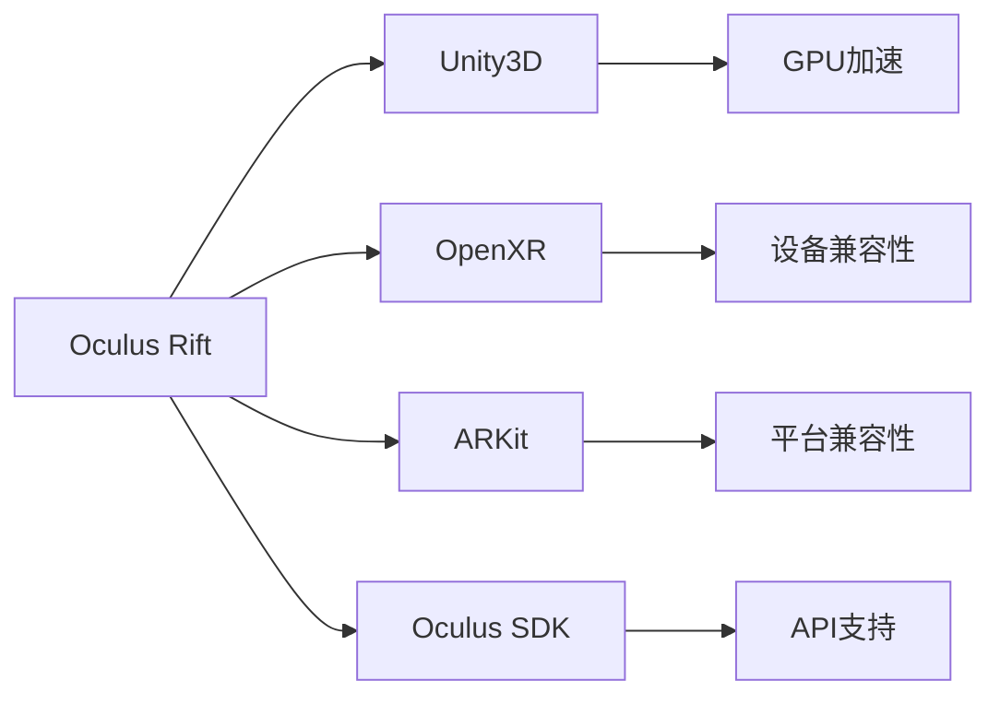

                 

## 1. 背景介绍

虚拟现实(Virtual Reality, VR)技术近年来迅速崛起，通过创造高度沉浸的视觉和听觉环境，改变着人们的感知方式和交互方式。作为VR领域的重要平台，Oculus Rift已经成为许多开发者研究和应用VR技术的首选工具。本文将深入探讨Oculus Rift开发的核心概念、关键算法及操作步骤，并通过实例代码和详细解读，帮助读者掌握Oculus Rift的开发技能。

## 2. 核心概念与联系

### 2.1 核心概念概述

- **Oculus Rift**：由Facebook收购的虚拟现实头戴设备，提供高质量的视觉和音频体验，是开发虚拟现实应用的首选平台。
- **Unity3D**：一款流行的游戏引擎，支持VR开发，提供丰富的图形和物理引擎，易于学习和上手。
- **OpenXR**：VR开发者标准，支持多种平台和设备，提供一致的用户体验和操作接口。
- **ARKit**：苹果提供的AR开发框架，支持增强现实应用开发，与Oculus Rift兼容性良好。
- **Oculus SDK**：Oculus官方提供的开发工具包，包括API、驱动程序、示例代码等，方便开发者进行VR应用开发。
- **GPU加速**：Oculus Rift通过NVIDIA显卡提供强大的GPU加速，实现流畅的图形渲染和实时计算。

这些核心概念构成了Oculus Rift开发的基石，彼此之间相互关联、相互促进，共同支持着VR应用的开发和运行。

### 2.2 核心概念原理和架构的 Mermaid 流程图



这张流程图展示了Oculus Rift开发所需的关键组件和它们之间的关系。从Oculus Rift设备出发，通过Unity3D引擎进行开发，利用OpenXR和ARKit标准提高跨平台兼容性，并依托Oculus SDK提供的API和驱动程序支持，最终实现GPU加速的流畅渲染。

## 3. 核心算法原理 & 具体操作步骤

### 3.1 算法原理概述

Oculus Rift开发的核心算法主要包括三维场景渲染、用户输入处理、头部和手部追踪、虚拟界面渲染等。这些算法共同构成了VR应用的基础框架，使得开发者能够创造出沉浸式的虚拟环境。

- **三维场景渲染**：使用图形渲染API（如OpenGL或DirectX），将三维场景模型渲染到屏幕上。
- **用户输入处理**：处理用户头戴设备和控制器（如键盘、鼠标、手柄等）的输入，将其转化为虚拟环境中的动作。
- **头部和手部追踪**：利用传感器（如IMU、RGB相机）追踪用户的头部和手部动作，实时更新虚拟环境中的角色和物品位置。
- **虚拟界面渲染**：将用户的输入转化为界面元素的移动和缩放，使用户能够与虚拟环境进行交互。

### 3.2 算法步骤详解

#### 3.2.1 三维场景渲染

三维场景渲染的核心步骤包括：

1. **模型导入**：将三维模型导入Unity3D，通过拖拽或脚本代码设置模型的位置、旋转和缩放。
2. **材质设置**：为模型设置材质，包括颜色、光照和纹理等，提高渲染效果。
3. **光照处理**：通过光照模型（如Phong、Blinn等），模拟自然光和人造光源的照明效果。
4. **渲染优化**：使用LOD技术（Level of Detail），根据视点的远近调整模型的复杂度，减少渲染负担。

#### 3.2.2 用户输入处理

用户输入处理的核心步骤包括：

1. **键盘和鼠标输入**：通过Unity3D的事件系统，捕捉用户的键盘和鼠标事件，转化为虚拟环境中的移动和操作。
2. **手柄输入**：使用Oculus SDK提供的手柄API，捕捉手柄的位置和按下按钮的事件，实现交互操作。
3. **头部追踪**：利用Oculus SDK提供的头部追踪API，捕捉用户的头部动作，实时更新虚拟环境中的视角和焦点。

#### 3.2.3 头部和手部追踪

头部和手部追踪的核心步骤包括：

1. **传感器初始化**：在Unity3D中初始化IMU和RGB相机传感器，配置传感器参数和阈值。
2. **数据获取**：通过Unity3D的传感器脚本，持续获取IMU和RGB相机的数据。
3. **数据处理**：使用OpenXR或ARKit标准解析传感器数据，计算头部和手部的位置和方向。
4. **更新虚拟环境**：根据头部和手部位置，更新虚拟环境中的角色和物品的位置和方向。

#### 3.2.4 虚拟界面渲染

虚拟界面渲染的核心步骤包括：

1. **UI元素创建**：在Unity3D中创建虚拟界面的UI元素，包括按钮、文本框等。
2. **事件绑定**：将UI元素的事件（如点击、输入）与虚拟环境中的动作绑定，实现交互功能。
3. **动画控制**：使用Unity3D的动画系统，控制UI元素的移动、缩放和旋转，实现动态效果。

### 3.3 算法优缺点

#### 3.3.1 优点

- **丰富的工具和资源**：Unity3D和Oculus SDK提供了大量的工具和资源，降低了开发难度和成本。
- **跨平台兼容性**：使用OpenXR和ARKit标准，Oculus Rift的应用可以在不同平台和设备上运行。
- **强大的GPU支持**：NVIDIA显卡提供强大的GPU加速，实现流畅的图形渲染和实时计算。

#### 3.3.2 缺点

- **学习曲线较陡**：开发Oculus Rift应用需要掌握Unity3D和Oculus SDK的使用，对开发者技术水平要求较高。
- **硬件设备成本高**：Oculus Rift设备的硬件成本较高，开发和测试成本较大。
- **依赖性强**：开发过程中高度依赖Unity3D和Oculus SDK，需要定期更新和维护。

### 3.4 算法应用领域

Oculus Rift开发的应用领域非常广泛，包括但不限于：

- **游戏开发**：开发各种类型的虚拟现实游戏，如射击、冒险、解谜等。
- **医学培训**：模拟手术、急救、解剖等医学培训场景，提升医学生的实践能力。
- **军事训练**：模拟各种军事任务和战场环境，提高士兵的实战技能。
- **教育培训**：开发虚拟教室、虚拟实验室等教育应用，提供沉浸式的学习体验。
- **旅游观光**：创建虚拟旅游景点和历史文化场景，供用户进行虚拟旅游。
- **广告营销**：开发虚拟广告和互动体验，提升品牌形象和用户互动性。

## 4. 数学模型和公式 & 详细讲解 & 举例说明

### 4.1 数学模型构建

在进行Oculus Rift开发时，常常需要构建数学模型来描述虚拟环境中的物理和几何特性。以下是一个基本的场景渲染数学模型：

- **摄像机投影模型**：将三维场景投影到二维屏幕上，公式如下：
$$
\begin{bmatrix}
x' \\
y' \\
z' \\
1
\end{bmatrix}
=
\begin{bmatrix}
M & 0 & 0 & -C_x \\
0 & M & 0 & -C_y \\
0 & 0 & M & -C_z \\
0 & 0 & 0 & 1
\end{bmatrix}
\begin{bmatrix}
x \\
y \\
z \\
1
\end{bmatrix}
+
\begin{bmatrix}
0 \\
0 \\
d
\end{bmatrix}
$$

其中，$M$为摄像机矩阵，$C_x, C_y, C_z$为摄像机位置，$d$为摄像机深度，$x', y', z'$为投影后的坐标。

- **光照模型**：使用Phong光照模型，公式如下：
$$
I = \frac{I_a}{\pi} + \frac{I_{d} R}{\pi (\vec{l} \cdot \vec{n})} + \frac{I_{s}}{\pi} (\vec{r} \cdot \vec{v})^2
$$

其中，$I_a$为环境光，$I_{d}$为漫反射光，$I_{s}$为镜面反射光，$R$为漫反射系数，$\vec{l}$为光源方向向量，$\vec{n}$为表面法向量，$\vec{r}$为镜面反射向量，$\vec{v}$为视角向量。

### 4.2 公式推导过程

- **摄像机投影模型推导**：将三维坐标$x, y, z$通过摄像机矩阵$M$投影到二维平面上，同时考虑摄像机位置$C_x, C_y, C_z$和深度$d$，最终得到投影后的坐标$x', y', z'$。
- **光照模型推导**：结合环境光、漫反射光和镜面反射光，计算最终的光照强度$I$，考虑光源方向向量$\vec{l}$、表面法向量$\vec{n}$、漫反射向量$\vec{r}$和视角向量$\vec{v}$。

### 4.3 案例分析与讲解

以一个简单的VR游戏为例，展示三维场景渲染和用户输入处理的数学模型应用。

1. **三维场景渲染**
   - **摄像机位置**：$C_x = 0, C_y = 0, C_z = 5$
   - **摄像机深度**：$d = 10$
   - **场景模型**：立方体，大小为$1 \times 1 \times 1$
   - **材质**：红色，光照强度为$I_a = 0.1, I_{d} = 0.5, I_{s} = 0.9, R = 0.8$
   - **光源方向**：$\vec{l} = (1, 1, 0)$

   根据摄像机投影模型，计算出场景模型的投影坐标：
   $$
   \begin{bmatrix}
   x' \\
   y' \\
   z' \\
   1
   \end{bmatrix}
   =
   \begin{bmatrix}
   0 & 0 & 0 & -5 \\
   0 & 0 & 0 & 0 \\
   0 & 0 & 0 & 0 \\
   0 & 0 & 0 & 1
   \end{bmatrix}
   \begin{bmatrix}
   0.5 \\
   0.5 \\
   0.5 \\
   1
   \end{bmatrix}
   +
   \begin{bmatrix}
   0 \\
   0 \\
   10
   \end{bmatrix}
   =
   \begin{bmatrix}
   5 \\
   5 \\
   10
   \end{bmatrix}
   $$

   根据光照模型，计算场景模型的光照强度：
   $$
   I = \frac{0.1}{\pi} + \frac{0.5 \times 0.8}{\pi \times 1} \times \frac{\vec{l} \cdot \vec{n}}{\|\vec{l}\| \|\vec{n}\|} + \frac{0.9}{\pi} (\vec{r} \cdot \vec{v})^2
   $$

2. **用户输入处理**
   - **键盘和鼠标输入**：当用户按下W键，摄像机向前移动$1$单位，同时旋转视角$10$度。
   - **手柄输入**：当用户按下手柄上的A键，场景中的立方体向左移动$1$单位。

   根据用户输入，更新摄像机和场景模型的状态，最终实现虚拟环境中的移动和操作。

## 5. 项目实践：代码实例和详细解释说明

### 5.1 开发环境搭建

要进行Oculus Rift开发，首先需要搭建开发环境。以下是详细的搭建步骤：

1. **安装Unity3D**：从Unity官网下载Unity3D软件包，并按照提示进行安装。
2. **安装Oculus SDK**：在Unity中下载并安装Oculus SDK，设置SDK路径和设备信息。
3. **安装OpenXR或ARKit**：根据项目需求，选择合适的AR开发框架，进行配置和集成。
4. **安装NVIDIA显卡驱动**：确保计算机上安装有NVIDIA显卡驱动，以支持Oculus Rift的图形渲染。

完成上述步骤后，即可在Unity3D中开始Oculus Rift应用开发。

### 5.2 源代码详细实现

以下是一个简单的VR游戏开发示例，展示如何在Unity3D中创建三维场景和用户输入处理。

1. **创建摄像机和场景**
   ```csharp
   using UnityEngine;
   using UnityEngine.XR.Oculus;

   public class CameraController : MonoBehaviour
   {
       public GameObject player;
       public float moveSpeed = 5f;

       void Update()
       {
           float moveX = Input.GetAxis("Horizontal");
           float moveY = Input.GetAxis("Vertical");
           Vector3 movement = new Vector3(moveX, moveY, 0);
           player.transform.Translate(movement * Time.deltaTime * moveSpeed);
       }
   }
   ```

2. **创建三维场景**
   ```csharp
   using UnityEngine;
   using UnityEngine.XR.Oculus;

   public class SceneGenerator : MonoBehaviour
   {
       public GameObject[] sceneElements;
       public float sceneSize = 10f;

       void Update()
       {
           float sceneX = Random.Range(-sceneSize, sceneSize);
           float sceneY = Random.Range(-sceneSize, sceneSize);
           float sceneZ = Random.Range(-sceneSize, sceneSize);

           for (int i = 0; i < sceneElements.Length; i++)
           {
               Vector3 position = new Vector3(sceneX, sceneY, sceneZ);
               sceneElements[i].transform.position = position;
               sceneElements[i].SetActive(true);
           }
       }
   }
   ```

3. **处理用户输入**
   ```csharp
   using UnityEngine;
   using UnityEngine.XR.Oculus;

   public class InputHandler : MonoBehaviour
   {
       public GameObject player;
       public float moveSpeed = 5f;

       void Update()
       {
           if (OVRInput.GetButtonUp("RightHandTrigger"))
           {
               player.transform.Rotate(Vector3.up * 5 * Time.deltaTime);
           }
           if (OVRInput.GetButtonUp("LeftHandTrigger"))
           {
               player.transform.Rotate(Vector3.up * -5 * Time.deltaTime);
           }
           if (OVRInput.GetButtonUp("RightHandThumbstickUp"))
           {
               player.transform.Translate(Vector3.forward * moveSpeed * Time.deltaTime);
           }
           if (OVRInput.GetButtonUp("RightHandThumbstickDown"))
           {
               player.transform.Translate(Vector3.backward * moveSpeed * Time.deltaTime);
           }
       }
   }
   ```

### 5.3 代码解读与分析

1. **摄像机控制**
   - **CameraController脚本**：实现摄像机的位置和视角控制。通过更新摄像机的位置，实现用户的移动操作。
   - **moveX和moveY变量**：根据用户的水平和垂直移动，计算场景的移动向量。
   - **Time.deltaTime**：确保移动的帧率为60fps，实现平滑移动。

2. **三维场景生成**
   - **SceneGenerator脚本**：随机生成场景中的元素位置，确保场景的多样性和动态性。
   - **sceneSize变量**：设置场景的生成范围。
   - **Random.Range方法**：生成随机数，控制场景元素的位置。

3. **用户输入处理**
   - **Input.GetAxis方法**：获取用户的输入轴，判断用户的操作。
   - **OVRInput.GetButtonUp方法**：检测Oculus手柄上的按钮状态，实现场景元素的移动和旋转。
   - **Time.deltaTime**：确保移动的帧率为60fps，实现平滑移动。

### 5.4 运行结果展示

运行上述代码后，可以看到摄像机和场景元素在虚拟环境中移动，用户可以通过手柄控制场景元素的位置和旋转，实现互动操作。

## 6. 实际应用场景

### 6.1 游戏开发

Oculus Rift在游戏开发中有着广泛的应用，支持各种类型的虚拟现实游戏，如射击、冒险、解谜等。通过Unity3D和Oculus SDK，开发者可以轻松创建高逼真的三维场景和用户交互逻辑，为玩家提供沉浸式的游戏体验。

### 6.2 医学培训

Oculus Rift在医学培训中也有着重要的应用。通过创建虚拟手术室、急救训练环境等场景，医学生可以在虚拟环境中进行模拟操作，提升实战能力。例如，通过模拟心脏手术、骨科手术等复杂操作，医学生可以在无风险的环境中学习手术技巧。

### 6.3 军事训练

Oculus Rift被广泛应用于军事训练中，模拟各种军事任务和战场环境，提高士兵的实战技能。例如，通过创建虚拟战场、训练营、指挥中心等场景，士兵可以在虚拟环境中进行战术演练和应急反应训练，提升应对实际战斗的能力。

### 6.4 教育培训

Oculus Rift在教育培训中也有着重要的应用。通过创建虚拟教室、虚拟实验室等场景，学生可以在虚拟环境中进行互动学习，提升学习效果。例如，通过模拟化学实验、物理实验等操作，学生可以在虚拟环境中进行实验操作，掌握实验技能。

### 6.5 旅游观光

Oculus Rift在旅游观光中也有着重要的应用。通过创建虚拟旅游景点和历史文化场景，用户可以在虚拟环境中进行虚拟旅游，了解各地的风土人情和文化历史。例如，通过创建虚拟故宫、长城等景点，用户可以在虚拟环境中游览，体验历史文化的魅力。

### 6.6 广告营销

Oculus Rift在广告营销中也有着重要的应用。通过创建虚拟广告和互动体验，品牌可以在虚拟环境中进行互动营销，提升用户互动性。例如，通过创建虚拟试衣间、虚拟商店等场景，用户可以在虚拟环境中进行试穿和购物，提升购买体验。

## 7. 工具和资源推荐

### 7.1 学习资源推荐

1. **Unity3D官方文档**：Unity官方提供的详细文档，包括Unity3D的使用、组件、脚本等，是学习和开发Oculus Rift应用的重要资源。
2. **Oculus Developer Portal**：Oculus官方提供的开发者门户网站，提供SDK下载、开发教程、社区支持等，是Oculus Rift开发的重要资源。
3. **ARKit官方文档**：苹果提供的AR开发框架文档，详细介绍了ARKit的使用和开发方法，是AR开发的重要资源。

### 7.2 开发工具推荐

1. **Unity3D**：流行的游戏引擎，支持VR开发，提供丰富的图形和物理引擎，易于学习和上手。
2. **Oculus SDK**：Oculus官方提供的开发工具包，包括API、驱动程序、示例代码等，方便开发者进行VR应用开发。
3. **ARKit**：苹果提供的AR开发框架，支持增强现实应用开发，与Oculus Rift兼容性良好。
4. **NVIDIA显卡驱动**：确保计算机上安装有NVIDIA显卡驱动，以支持Oculus Rift的图形渲染。

### 7.3 相关论文推荐

1. **"Oculus Rift: A VR Game Platform for Unity3D Developers"**：介绍如何使用Unity3D和Oculus SDK开发VR游戏，详细介绍了VR游戏开发的基本流程和方法。
2. **"ARKit: Augmented Reality for iOS"**：介绍如何使用ARKit开发增强现实应用，详细介绍了AR开发的基本流程和方法。
3. **"Oculus Rift SDK: A Developer Guide"**：介绍如何使用Oculus SDK开发VR应用，详细介绍了Oculus Rift开发的API和工具。

## 8. 总结：未来发展趋势与挑战

### 8.1 研究成果总结

Oculus Rift开发技术在近年来取得了长足的进步，其应用领域也逐渐扩展到游戏开发、医学培训、军事训练、教育培训、旅游观光和广告营销等多个领域。通过Unity3D和Oculus SDK，开发者可以轻松创建高逼真的三维场景和用户交互逻辑，为各种应用提供沉浸式的体验。

### 8.2 未来发展趋势

1. **硬件设备的进步**：随着Oculus Rift硬件设备的不断进步，设备的性能和舒适度将进一步提升，为开发者提供更好的开发环境和用户体验。
2. **软件生态的完善**：Unity3D和Oculus SDK的不断优化和升级，将提供更丰富的开发工具和资源，支持开发者开发出更加多样和复杂的VR应用。
3. **跨平台兼容性**：OpenXR和ARKit等标准的不断完善，将提高VR应用在不同平台和设备上的兼容性，实现跨平台的用户体验。
4. **AI和AR的融合**：将AI和AR技术结合，提升VR应用智能化水平，实现更加自然和智能的交互体验。
5. **多感官融合**：结合视觉、听觉、触觉等多种感官信息，提升VR应用的沉浸感和真实感。

### 8.3 面临的挑战

1. **硬件设备的成本**：Oculus Rift设备的硬件成本较高，开发和测试成本较大，需要寻求降低成本的解决方案。
2. **开发者技术水平**：Oculus Rift开发需要掌握Unity3D和Oculus SDK的使用，对开发者技术水平要求较高，需要更多的教育和培训资源。
3. **用户适应性**：Oculus Rift设备的使用体验和传统设备有很大差异，需要用户进行适应和习惯。
4. **安全和隐私**：VR应用可能涉及用户的隐私和数据安全，需要采取有效措施保护用户数据。
5. **内容生态**：VR应用的内容生态尚需进一步发展，需要更多的优质内容和用户支持。

### 8.4 研究展望

未来的研究将在以下几个方面进行探索：

1. **全息技术的引入**：结合全息技术，提升VR应用的真实感和沉浸感。
2. **云VR技术的发展**：结合云VR技术，实现更广阔的VR应用场景，提升用户体验。
3. **AI辅助设计**：结合AI技术，辅助VR应用的开发和设计，提升开发效率和应用质量。
4. **跨学科合作**：结合心理学、生理学等学科知识，提升VR应用的心理学和生理学设计，提升用户体验。

总之，Oculus Rift开发技术将在硬件设备的进步、软件生态的完善、跨平台兼容性、AI和AR的融合、多感官融合等多个方面进行探索，推动VR应用的广泛应用和深入发展。

## 9. 附录：常见问题与解答

**Q1: Oculus Rift开发是否需要强大的硬件设备？**

A: 是的，Oculus Rift开发需要强大的硬件设备，包括高性能的显卡、强大的处理器和充足的内存。这些硬件设备可以提供流畅的图形渲染和实时计算，确保虚拟环境的真实感和沉浸感。

**Q2: Oculus Rift开发是否需要丰富的软件资源？**

A: 是的，Oculus Rift开发需要丰富的软件资源，包括Unity3D、Oculus SDK、OpenXR、ARKit等开发工具和框架。这些资源可以帮助开发者快速开发出高品质的VR应用，提供丰富的功能和体验。

**Q3: Oculus Rift开发是否需要专业的技术知识？**

A: 是的，Oculus Rift开发需要掌握Unity3D和Oculus SDK的使用，对开发者技术水平要求较高。开发者需要掌握三维场景渲染、用户输入处理、头部和手部追踪等核心算法，才能开发出高质量的VR应用。

**Q4: Oculus Rift开发是否需要较高的开发成本？**

A: 是的，Oculus Rift开发需要较高的开发成本，包括硬件设备的成本和软件资源的成本。开发者需要购买Oculus Rift设备，安装Unity3D和Oculus SDK，并获取相关的开发资源和教程，这些都会增加开发成本。

**Q5: Oculus Rift开发是否需要不断的技术更新？**

A: 是的，Oculus Rift开发需要不断的技术更新，以适应硬件设备的进步和软件生态的变化。开发者需要关注Unity3D和Oculus SDK的更新，学习新的开发方法和技巧，保持技术的领先性。

总之，Oculus Rift开发需要强大的硬件设备、丰富的软件资源和专业的技术知识，同时也需要不断的技术更新和成本投入。开发者需要在这些方面做好准备，才能开发出高质量的VR应用，提供优质的用户体验。

---

作者：禅与计算机程序设计艺术 / Zen and the Art of Computer Programming

