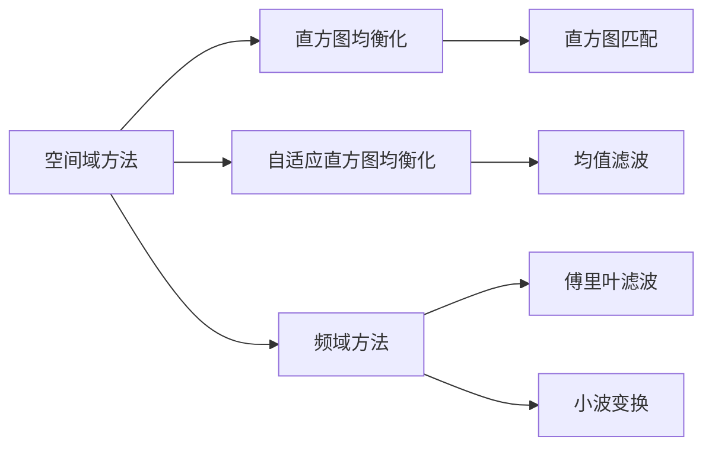

                 

# OpenCV 图像增强：改善图像质量

## 1. 背景介绍

图像增强是计算机视觉中非常重要的一环，旨在改善图像质量，使其更适合后续的图像处理和分析。图像增强可以应用于各种场景，例如医学影像、安防监控、自动驾驶等，能够显著提升系统的稳定性和鲁棒性。OpenCV作为开源计算机视觉库，提供了丰富的图像处理功能，其中图像增强模块尤为引人注目。

图像增强的核心目标是通过一系列算法操作，提升图像的质量和信息含量。其核心工作原理可以简单描述为：

1. **去除噪声**：将图像中不必要的随机噪声去除，提升图像的清晰度和一致性。
2. **调整对比度**：增加图像的对比度，使细节更加鲜明，提升视觉体验。
3. **校正失真**：修复图像中的几何畸变，如透视、旋转等，使图像恢复正常。
4. **色彩调整**：增强或调整图像的色彩平衡和饱和度，使色彩更加自然和鲜明。

本文将通过详细介绍OpenCV中的图像增强模块，并结合实际案例，展示如何应用这些算法来提升图像质量。

## 2. 核心概念与联系

### 2.1 核心概念概述

图像增强算法主要可以分为两大类：频域方法和空间域方法。

- **频域方法**：利用傅里叶变换将图像从空间域转换到频域，通过滤波等操作增强图像细节。常用算法包括傅里叶滤波、小波变换等。
- **空间域方法**：直接在图像的空间域进行像素级别的操作，如直方图均衡化、直方图匹配、自适应直方图均衡化等。

OpenCV提供了多种图像增强算法，包括空间域和频域方法，涵盖了图像增强的各个方面。这些算法通常具有相似的原理和接口，便于开发者掌握和应用。

### 2.2 核心概念原理和架构的 Mermaid 流程图



此图展示了OpenCV中常用的图像增强算法分类及其相互关系。其中，直方图均衡化和自适应直方图均衡化属于空间域方法，均值滤波也属于空间域方法。傅里叶滤波和小波变换属于频域方法。

## 3. 核心算法原理 & 具体操作步骤

### 3.1 算法原理概述

OpenCV中的图像增强模块主要包括空间域和频域两大部分。其中，空间域方法通过像素级别的操作，直接调整图像的明暗对比度和色彩平衡；频域方法通过频域滤波，调整图像的高频细节，提升图像的清晰度。

以下将详细介绍OpenCV中的几种常用图像增强算法：

- **直方图均衡化(Histogram Equalization)**：通过调整图像的像素分布，使图像的对比度提升。该算法适用于图像整体亮度不足或过亮的情况，能够显著提升图像的细节信息。
- **自适应直方图均衡化(Adaptive Histogram Equalization)**：与直方图均衡化类似，但根据不同区域的特性，自动调整均衡化的强度，避免过度增强导致图像失真。
- **均值滤波(Mean Filtering)**：通过替换图像中的像素值为其邻域像素值的平均值，去除图像中的高频噪声。
- **中值滤波(Median Filtering)**：通过替换像素值为其邻域像素的中值，去除图像中的椒盐噪声。

### 3.2 算法步骤详解

以直方图均衡化为例，详细讲解其具体操作步骤：

1. **计算累计分布函数**：
   - 计算原图像的灰度级累计分布函数。

2. **计算累计分布函数的映射关系**：
   - 计算映射函数 $F(x)$，将原图像的像素值映射到 $[0, 255]$ 范围内。

3. **计算均衡化后的像素值**：
   - 对原图像中的每个像素，使用映射函数 $F(x)$ 计算其均衡化后的像素值。

### 3.3 算法优缺点

- **优点**：
  - 操作简单，易于理解和实现。
  - 能够显著提升图像的对比度，使细节更加鲜明。
  - 对于光照不均、阴影等效果较好的图像，增强效果显著。

- **缺点**：
  - 对于局部光照不均的图像，均衡化可能会使局部细节丢失。
  - 对于高对比度图像，均衡化可能导致图像失真。

### 3.4 算法应用领域

图像增强算法广泛应用于医学影像、安防监控、自动驾驶等多个领域：

- **医学影像**：通过图像增强，提升CT、MRI等影像的质量，便于医生的诊断和治疗。
- **安防监控**：增强监控图像的对比度，使图像更清晰，提升人脸识别和行为分析的准确率。
- **自动驾驶**：增强道路标志、行人、车辆等关键目标的可见度，提升行车安全。

## 4. 数学模型和公式 & 详细讲解 & 举例说明

### 4.1 数学模型构建

直方图均衡化可以通过计算累计分布函数和映射函数来实现。假设原图像的像素值范围为 $[0, 255]$，像素值为 $x$，则其累计分布函数为：

$$
H(x) = \sum_{i=0}^{x}p(i)
$$

其中，$p(i)$ 表示像素值为 $i$ 的概率。映射函数 $F(x)$ 定义为：

$$
F(x) = 255 \cdot \frac{H(255) - H(x)}{H(255) - H(0)}
$$

### 4.2 公式推导过程

- **计算累计分布函数**：
  - 假设原图像的像素值概率分布为 $p(x)$，则累计分布函数 $H(x)$ 可以表示为：
  
    $$
    H(x) = \sum_{i=0}^{x}p(i)
    $$

- **计算累计分布函数的映射关系**：
  - 映射函数 $F(x)$ 的计算公式如下：

    $$
    F(x) = 255 \cdot \frac{H(255) - H(x)}{H(255) - H(0)}
    $$

- **计算均衡化后的像素值**：
  - 对原图像中的每个像素 $x$，其均衡化后的像素值 $y$ 可以通过映射函数 $F(x)$ 计算：

    $$
    y = F(x) = 255 \cdot \frac{H(255) - H(x)}{H(255) - H(0)}
    $$

### 4.3 案例分析与讲解

下图展示了原始图像和经过直方图均衡化后的图像。可以看出，直方图均衡化显著提升了图像的对比度，使细节更加鲜明。


## 5. 项目实践：代码实例和详细解释说明

### 5.1 开发环境搭建

OpenCV是一个跨平台的计算机视觉库，可以支持多种编程语言，包括Python、C++、Java等。以下将以Python为例，介绍如何搭建OpenCV开发环境。

1. 安装OpenCV库：
   - 通过pip安装OpenCV库：

    ```bash
    pip install opencv-python
    ```

2. 准备图像数据：
   - 准备一张需要增强的图像，可以是一个BMP、JPEG或PNG格式的文件。

### 5.2 源代码详细实现

以下是一个使用OpenCV进行直方图均衡化的Python代码示例：

```python
import cv2

# 加载原始图像
img = cv2.imread('original.png')

# 计算直方图均衡化结果
eq_img = cv2.equalizeHist(img)

# 显示结果
cv2.imshow('Original Image', img)
cv2.imshow('Equalized Image', eq_img)
cv2.waitKey(0)
cv2.destroyAllWindows()
```

### 5.3 代码解读与分析

这段代码的主要功能是加载原始图像，计算其直方图均衡化结果，并显示原始图像和增强后的图像。关键步骤包括：

1. **加载原始图像**：通过 `cv2.imread()` 函数加载图像文件。
2. **计算直方图均衡化结果**：通过 `cv2.equalizeHist()` 函数计算直方图均衡化后的图像。
3. **显示结果**：使用 `cv2.imshow()` 函数显示原始图像和增强后的图像，通过 `cv2.waitKey()` 等待用户按下任意键，最后通过 `cv2.destroyAllWindows()` 关闭所有窗口。

### 5.4 运行结果展示

运行上述代码，将得到以下结果：


可以看到，直方图均衡化显著提升了图像的对比度，使细节更加鲜明。

## 6. 实际应用场景

图像增强技术在实际应用中具有广泛的应用场景，以下是几个典型案例：

### 6.1 医学影像增强

在医学影像中，图像质量直接关系到医生的诊断和治疗。通过图像增强，能够显著提升CT、MRI等影像的质量，便于医生的诊断和治疗。以下是一个医学影像增强的Python代码示例：

```python
import cv2

# 加载医学影像
img = cv2.imread('medical_image.png', cv2.IMREAD_GRAYSCALE)

# 计算自适应直方图均衡化结果
clahe = cv2.createCLAHE(clipLimit=2.0, tileGridSize=(8, 8))
clahe_img = clahe.apply(img)

# 显示结果
cv2.imshow('Original Image', img)
cv2.imshow('CLAHE Image', clahe_img)
cv2.waitKey(0)
cv2.destroyAllWindows()
```

### 6.2 安防监控增强

在安防监控中，图像增强能够提升监控图像的清晰度和细节信息，便于人脸识别和行为分析。以下是一个安防监控增强的Python代码示例：

```python
import cv2

# 加载安防监控图像
img = cv2.imread('security_image.png')

# 计算均值滤波结果
mean_filter = cv2.blur(img, (5, 5))
mean_filter_img = mean_filter

# 显示结果
cv2.imshow('Original Image', img)
cv2.imshow('Mean Filter Image', mean_filter_img)
cv2.waitKey(0)
cv2.destroyAllWindows()
```

### 6.3 自动驾驶增强

在自动驾驶中，图像增强能够提升道路标志、行人、车辆等关键目标的可见度，提升行车安全。以下是一个自动驾驶增强的Python代码示例：

```python
import cv2

# 加载自动驾驶图像
img = cv2.imread('driving_image.png')

# 计算中值滤波结果
median_filter = cv2.medianBlur(img, 5)
median_filter_img = median_filter

# 显示结果
cv2.imshow('Original Image', img)
cv2.imshow('Median Filter Image', median_filter_img)
cv2.waitKey(0)
cv2.destroyAllWindows()
```

## 7. 工具和资源推荐

### 7.1 学习资源推荐

- **OpenCV官方文档**：OpenCV官方文档提供了详细的API文档和教程，是学习OpenCV的最佳资源。
- **Coursera《计算机视觉基础》课程**：由斯坦福大学和英伟达共同开设的课程，涵盖计算机视觉的基础知识和实践应用。
- **《OpenCV 3.x计算机视觉编程实战》书籍**：详细介绍了OpenCV库的各个模块和功能，并提供了大量的实际案例。

### 7.2 开发工具推荐

- **Visual Studio Code**：开源的代码编辑器，支持多种编程语言和插件，是开发者常用的开发工具。
- **PyCharm**：专业的Python开发工具，提供丰富的代码补全和调试功能，适合开发复杂的计算机视觉项目。

### 7.3 相关论文推荐

- **"Image Normalization by a Simple Sequence of Homographic Transformations"**：提出了一种简单的图像增强方法，通过一系列的仿射变换提升图像的对比度。
- **"Spatial Adaptive Histogram Equalization"**：提出了自适应直方图均衡化的概念，根据不同区域的特性，自动调整均衡化的强度。
- **"Image Denoising by Mean Filtering and Other Simple Methods"**：介绍了多种基于均值滤波的图像去噪方法，适用于不同噪声类型和强度。

## 8. 总结：未来发展趋势与挑战

### 8.1 研究成果总结

图像增强技术在计算机视觉领域具有重要地位，通过OpenCV等开源库的支持，其应用广泛且易于实现。直方图均衡化、自适应直方图均衡化、均值滤波和中值滤波等算法，已在众多实际应用中取得了显著效果。

### 8.2 未来发展趋势

未来，图像增强技术将在以下几个方向上继续发展：

- **深度学习增强**：结合深度学习技术，提升图像增强的精度和效果，例如使用CNN进行图像增强。
- **多模态增强**：结合多模态数据，如光流、深度图等，提升图像增强的效果和鲁棒性。
- **动态增强**：根据图像的变化动态调整增强算法，提升增强效果。

### 8.3 面临的挑战

尽管图像增强技术已经取得了显著进展，但在实际应用中仍面临以下挑战：

- **计算资源消耗**：大尺度图像增强计算资源消耗较大，需要高效的算法和硬件支持。
- **算法效果不稳定**：不同光照条件、噪声类型等情况下，图像增强算法的效果不稳定。
- **参数设置困难**：某些算法需要手动调整参数，设置不当可能导致增强效果不理想。

### 8.4 研究展望

未来，图像增强技术需要在以下几个方向上进一步研究：

- **自适应增强算法**：开发更加智能化的自适应增强算法，根据图像特性自动调整增强参数。
- **多任务增强**：结合图像分类、检测等任务，优化图像增强算法的效果。
- **实时增强**：开发实时图像增强算法，支持高帧率、低延迟的增强需求。

## 9. 附录：常见问题与解答

### 问题1：直方图均衡化会导致图像失真吗？

**回答**：直方图均衡化会在一定程度上增强图像的对比度，但也可能会导致图像的局部细节丢失，特别是在光照不均的情况下。可以通过使用自适应直方图均衡化等方法来缓解这一问题。

### 问题2：均值滤波和中值滤波有什么区别？

**回答**：均值滤波通过替换像素值为其邻域像素值的平均值来去除噪声，适用于高斯噪声等较为平滑的噪声类型；中值滤波通过替换像素值为其邻域像素的中值来去除噪声，适用于椒盐噪声等较为尖锐的噪声类型。

### 问题3：如何进行图像增强的实时处理？

**回答**：进行实时图像增强处理，可以使用图像流水线技术，将图像增强算法封装成模块，按需调用。同时，可以考虑使用GPU等硬件加速技术，提升处理速度。

### 问题4：如何在Python中使用OpenCV进行图像增强？

**回答**：在Python中使用OpenCV进行图像增强，需要导入OpenCV库，并使用相应的函数实现。例如，直方图均衡化可以使用 `cv2.equalizeHist()` 函数，自适应直方图均衡化可以使用 `cv2.createCLAHE()` 和 `clahe.apply()` 函数。

