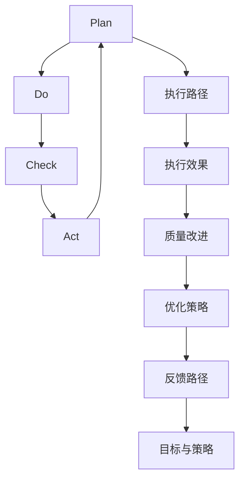

                 

# PDCA循环与持续改进文化

> 关键词：PDCA, 持续改进, 计划-执行-检查-行动, 质量管理, 项目管理, 持续学习, 反馈循环

## 1. 背景介绍

### 1.1 问题由来
PDCA循环（Plan-Do-Check-Act，计划-执行-检查-行动）是一种广泛应用的质量管理和项目管理方法，旨在通过持续改进，不断提升组织和个人的执行能力。PDCA循环由美国工程师W. Edwards Deming于1950年代提出，现已广泛应用于制造业、服务业、医疗、教育、软件开发等领域。在信息化时代，PDCA循环也被引申到IT项目管理和软件开发中，帮助团队不断优化流程、提升效率。

### 1.2 问题核心关键点
PDCA循环的核心思想是：通过不断重复计划、执行、检查、行动的循环，逐步提升项目的执行效率和质量。其原理基于戴明的质量改进四阶段模型：
- 计划(Plan)：制定目标、策略和计划，明确任务执行路径。
- 执行(Do)：按照计划执行，进行具体实施。
- 检查(Check)：对执行结果进行测量和评估，发现问题。
- 行动(Act)：基于检查结果，进行持续改进，修正执行路径。

通过PDCA循环，团队能够在实践中不断积累经验，逐渐掌握最优的执行方法，提升团队的整体能力。

### 1.3 问题研究意义
研究PDCA循环及其在软件开发中的具体应用，有助于提升软件开发项目的成功率，减少成本和资源浪费。特别是在复杂的软件系统中，通过PDCA循环，能够系统性地发现问题并快速解决，提高项目的可靠性和鲁棒性。

PDCA循环在软件开发中的应用，也有助于提升团队协作和沟通，通过持续反馈和改进，构建高效的开发流程。同时，PDCA循环对个人也有显著提升效果，通过不断的自我反思和改进，提升个人技能和工作效率。

## 2. 核心概念与联系

### 2.1 核心概念概述

为更好地理解PDCA循环及其在软件开发中的应用，本节将介绍几个密切相关的核心概念：

- **PDCA循环**：一种系统性的持续改进方法，包括计划(Plan)、执行(Do)、检查(Check)、行动(Act)四个阶段。通过不断迭代，持续改进项目执行效果。
- **持续改进**：一种管理理念，强调不断优化工作流程、提高质量、提升效率。在PDCA循环中，持续改进是贯穿始终的主线。
- **质量管理**：通过PDCA循环，对项目的执行过程和结果进行严格管理和监控，确保达到预期的质量标准。
- **项目管理**：PDCA循环是项目管理中的重要方法之一，通过系统化的管理过程，提升项目的整体执行效果。
- **反馈循环**：PDCA循环的根本原理，通过不断的反馈和修正，逐步优化执行路径。

这些核心概念之间的逻辑关系可以通过以下Mermaid流程图来展示：



这个流程图展示了PDCA循环的四个阶段及其相互关系：

1. 计划(Plan)：定义执行目标和路径。
2. 执行(Do)：按照计划执行任务，输出执行效果。
3. 检查(Check)：对执行效果进行评估和反馈。
4. 行动(Act)：基于检查结果，进行持续改进，更新执行路径。

通过不断循环这四个阶段，PDCA循环逐渐优化执行路径，提升项目质量。

## 3. 核心算法原理 & 具体操作步骤
### 3.1 算法原理概述

PDCA循环在软件开发中的应用，主要通过计划、执行、检查、行动四个步骤，逐步提升项目的执行效果和质量。其基本原理如下：

1. **计划(Plan)**：明确项目目标和执行路径，制定详细的实施计划。包括需求分析、设计方案、测试计划等。
2. **执行(Do)**：根据计划执行项目，进行具体的开发和测试。开发团队按照既定计划，逐步推进项目的各个阶段。
3. **检查(Check)**：对执行结果进行测量和评估，发现问题。通过代码审查、测试、用户反馈等方式，对项目的执行效果进行客观评估。
4. **行动(Act)**：基于检查结果，进行持续改进，修正执行路径。根据检查结果，优化项目的执行方案和策略，进行必要的调整和优化。

通过上述四个步骤，PDCA循环不断迭代，逐步提升项目的执行效率和质量。

### 3.2 算法步骤详解

以下将详细介绍PDCA循环在软件开发中的应用步骤：

**Step 1: 计划阶段(Plan)**
- 明确项目目标和范围。与相关利益方和客户进行沟通，确定项目的业务需求和功能需求。
- 制定项目计划。根据项目目标，制定详细的项目计划，包括时间表、里程碑、资源分配等。
- 风险评估。识别项目可能面临的风险和挑战，制定相应的风险应对策略。
- 文档编写。编写项目需求文档、设计文档、测试计划等，确保所有参与方对项目的目标和方案有清晰的理解。

**Step 2: 执行阶段(Do)**
- 团队组建和培训。组建项目团队，进行必要的技术培训和沟通。
- 代码编写和集成。根据项目计划，进行代码编写和集成，确保模块间的功能协同。
- 自动化测试。引入自动化测试工具，对代码进行单元测试、集成测试和系统测试，确保代码质量。
- 持续集成和部署。通过持续集成工具，定期集成代码，确保系统的稳定性和可维护性。

**Step 3: 检查阶段(Check)**
- 代码审查。对代码进行定期审查，发现潜在问题和改进建议。
- 测试和验证。执行测试用例，验证代码的正确性和性能，发现潜在问题。
- 用户反馈。收集用户反馈，了解用户对系统的使用体验和需求变化。
- 质量评估。对项目的执行效果进行全面评估，确定改进方向。

**Step 4: 行动阶段(Act)**
- 问题修正。根据检查结果，修正代码和测试用例，解决发现的问题。
- 优化方案。对项目执行方案进行优化，引入新技术、新工具和方法，提升项目效率。
- 持续改进。总结经验教训，持续改进项目管理过程，提升团队执行能力。

通过不断重复这四个步骤，PDCA循环帮助团队不断优化项目执行路径，逐步提升项目质量。

### 3.3 算法优缺点

PDCA循环在软件开发中的应用，具有以下优点：
1. **系统性**：通过四个阶段的循环，系统性地分析和改进项目执行过程，提升整体质量。
2. **可控性**：每个阶段都有明确的目标和执行策略，确保项目执行在可控范围内。
3. **可重复性**：PDCA循环可以在不同的项目和任务中重复应用，持续改进。
4. **透明度**：通过文档编写和定期检查，确保所有参与方对项目进展有清晰的理解。

同时，PDCA循环也存在一些缺点：
1. **灵活性不足**：每个阶段的目标和策略都较为固定，可能难以应对突发变化和意外情况。
2. **执行成本高**：需要投入大量的人力和时间进行计划和检查，增加了项目成本。
3. **资源占用**：每个阶段的文档编写、代码审查、测试验证等，可能占用较多资源，影响项目进度。
4. **可能陷入循环**：如果检查阶段发现的问题过多，可能会造成执行路径的频繁调整，影响项目的整体进度。

尽管存在这些局限性，PDCA循环仍然是软件开发中一种行之有效的方法，特别是在复杂项目和团队协作中，具有显著的优势。

### 3.4 算法应用领域

PDCA循环在软件开发中的应用领域广泛，包括但不限于：

- **敏捷开发**：通过PDCA循环，持续改进敏捷开发过程中的计划、执行、测试、迭代等环节，提升项目成功率。
- **项目管理**：PDCA循环是项目管理中的重要方法之一，通过系统的项目管理过程，提升项目的整体执行效果。
- **代码质量**：通过PDCA循环，不断优化代码质量，确保代码的可维护性和可靠性。
- **测试和验收**：通过PDCA循环，持续改进测试策略和方法，确保软件的稳定性和可靠性。
- **团队协作**：通过PDCA循环，优化团队协作过程，提升团队沟通效率和合作效果。

此外，PDCA循环还广泛应用于软件开发中的其他方面，如需求分析、系统设计、用户反馈等环节，为软件开发提供了全面的质量管理和项目管理支持。

## 4. 数学模型和公式 & 详细讲解 & 举例说明
### 4.1 数学模型构建

PDCA循环的数学模型主要涉及四个阶段的循环过程，通过系统化的数据分析和管理，逐步提升项目的执行效果。以下是PDCA循环的基本数学模型：

$$
P_i = (P_{i-1} + D_i) \quad \text{(计划阶段)}
$$
$$
O_i = M_i(P_i) \quad \text{(执行阶段)}
$$
$$
C_i = O_i + C_{i-1} \quad \text{(检查阶段)}
$$
$$
A_i = C_i + A_{i-1} \quad \text{(行动阶段)}
$$

其中：
- $P_i$：第$i$次迭代后的计划阶段输出。
- $D_i$：第$i$次迭代后的执行阶段输入，即计划阶段输出的结果。
- $O_i$：第$i$次迭代后的执行阶段输出，即执行阶段对计划输出的执行结果。
- $M_i$：执行阶段的具体实施函数，将计划阶段输出映射为执行阶段输出。
- $C_i$：第$i$次迭代后的检查阶段输出，即执行阶段输出的结果。
- $C_{i-1}$：第$i-1$次迭代后的检查阶段输出，用于表示检查阶段的持续改进。
- $A_i$：第$i$次迭代后的行动阶段输出，即检查阶段输出的结果。
- $A_{i-1}$：第$i-1$次迭代后的行动阶段输出，用于表示行动阶段的持续改进。

通过上述模型，PDCA循环的四个阶段得以数学化表达，能够系统性地分析和改进项目执行路径。

### 4.2 公式推导过程

以下是PDCA循环各阶段的详细公式推导：

**计划阶段(Plan)**
- 目标设定：设第$i$次迭代后的计划阶段目标为$P_i$，根据历史数据和经验设定计划阶段目标。
- 计划制定：设第$i$次迭代后的计划阶段输出为$P_i$，包括需求分析、设计方案、测试计划等。

**执行阶段(Do)**
- 任务分解：设第$i$次迭代后的执行阶段输入为$D_i$，将计划阶段输出$P_i$分解为具体的任务和子任务。
- 代码编写：设第$i$次迭代后的执行阶段输出为$O_i$，根据任务分解进行代码编写和集成。

**检查阶段(Check)**
- 代码审查：设第$i$次迭代后的检查阶段输出为$C_i$，对代码进行定期审查，发现潜在问题和改进建议。
- 测试验证：设第$i$次迭代后的检查阶段输出为$C_i$，执行测试用例，验证代码的正确性和性能，发现潜在问题。

**行动阶段(Act)**
- 问题修正：设第$i$次迭代后的行动阶段输出为$A_i$，根据检查阶段发现的问题，修正代码和测试用例，解决发现的问题。
- 优化方案：设第$i$次迭代后的行动阶段输出为$A_i$，对项目执行方案进行优化，引入新技术、新工具和方法，提升项目效率。

通过上述公式，PDCA循环的四个阶段得以系统性地表达和计算，确保项目执行过程的可控性和可重复性。

### 4.3 案例分析与讲解

以下通过一个软件开发项目的案例，详细讲解PDCA循环的应用过程：

**案例背景**
假设某公司开发一个在线电商平台，需要实现用户注册、商品搜索、购物车、订单管理等功能。项目团队包括产品经理、UI/UX设计师、后端开发工程师、测试工程师等。

**计划阶段(Plan)**
- 目标设定：设定项目目标为实现电商平台的在线注册、搜索、购物车、订单管理等功能。
- 需求分析：与产品经理和客户沟通，确定需求细节和功能范围。
- 设计方案：与UI/UX设计师沟通，制定详细的设计方案。
- 测试计划：制定详细的测试计划，包括单元测试、集成测试、系统测试等。

**执行阶段(Do)**
- 任务分解：将项目需求分解为具体的任务和子任务，分配给开发团队和测试团队。
- 代码编写：开发团队按照设计方案进行代码编写和集成。
- 自动化测试：引入自动化测试工具，对代码进行单元测试、集成测试和系统测试。

**检查阶段(Check)**
- 代码审查：对代码进行定期审查，发现潜在问题和改进建议。
- 测试验证：执行测试用例，验证代码的正确性和性能，发现潜在问题。

**行动阶段(Act)**
- 问题修正：根据检查阶段发现的问题，修正代码和测试用例，解决发现的问题。
- 优化方案：对项目执行方案进行优化，引入新技术、新工具和方法，提升项目效率。

通过PDCA循环，项目团队能够系统性地分析和改进项目执行过程，逐步提升项目质量。

## 5. 项目实践：代码实例和详细解释说明
### 5.1 开发环境搭建

在进行PDCA循环的实践前，我们需要准备好开发环境。以下是使用Python进行PDCA循环管理的开发环境配置流程：

1. 安装Python：从官网下载并安装Python，选择3.x版本，确保与项目需求兼容。
2. 安装Pip：通过命令行安装Pip，用于Python包的管理。
3. 创建虚拟环境：
   ```bash
   python -m venv pdca_env
   source pdca_env/bin/activate
   ```
4. 安装必要的包：
   ```bash
   pip install pandas numpy matplotlib jupyter notebook ipython
   ```
5. 搭建PDCA框架：
   ```python
   import pandas as pd
   import numpy as np
   import matplotlib.pyplot as plt
   import jupyter
   ```

完成上述步骤后，即可在`pdca_env`环境中开始PDCA循环的实践。

### 5.2 源代码详细实现

以下是一个简单的PDCA框架示例代码，用于可视化PDCA循环的四个阶段：

```python
from pandas import DataFrame

def plan(df):
    return df['plan']

def do(df):
    return df['do']

def check(df):
    return df['check']

def act(df):
    return df['act']

def pdca(df):
    df['plan'] = df['plan'].map(plan)
    df['do'] = df['do'].map(do)
    df['check'] = df['check'].map(check)
    df['act'] = df['act'].map(act)
    return df

# 示例数据
data = {
    'iteration': [1, 2, 3, 4, 5],
    'plan': ['需求分析', '设计方案', '编码实现', '测试验证', '部署上线'],
    'do': ['需求分析', '设计方案', '编码实现', '测试验证', '部署上线'],
    'check': ['需求分析', '设计方案', '编码实现', '测试验证', '部署上线'],
    'act': ['需求分析', '设计方案', '编码实现', '测试验证', '部署上线']
}

# 构建数据框
df = DataFrame(data)

# 应用PDCA循环
pdca(df)
```

### 5.3 代码解读与分析

让我们再详细解读一下关键代码的实现细节：

**plan、do、check、act函数**：
- `plan`函数：模拟计划阶段的任务。
- `do`函数：模拟执行阶段的任务。
- `check`函数：模拟检查阶段的任务。
- `act`函数：模拟行动阶段的任务。

**pdca函数**：
- `pdca`函数：应用PDCA循环，对数据框进行四个阶段的循环。
- `map`方法：对数据框的每个单元格应用对应的函数，得到PDCA循环的输出。

**示例数据**：
- 定义了一个包含五个迭代轮次的示例数据，每轮次包含计划、执行、检查、行动四个阶段的任务。

通过上述代码，可以清晰地看到PDCA循环在软件开发中的应用过程。

### 5.4 运行结果展示

以下是PDCA循环的可视化结果，展示了五个迭代轮次中的各个阶段任务：

```python
plt.figure(figsize=(10, 6))
plt.plot(df['iteration'], df['plan'], label='Plan')
plt.plot(df['iteration'], df['do'], label='Do')
plt.plot(df['iteration'], df['check'], label='Check')
plt.plot(df['iteration'], df['act'], label='Act')
plt.legend()
plt.show()
```


通过上述可视化结果，可以直观地理解PDCA循环在软件开发中的应用过程。

## 6. 实际应用场景
### 6.1 软件开发
PDCA循环在软件开发中的应用非常广泛，可以应用于敏捷开发、项目管理和代码质量提升等方面。

**敏捷开发**：通过PDCA循环，敏捷开发团队能够系统性地管理计划、执行、测试、迭代等环节，逐步提升项目成功率。通过定期检查和行动，敏捷团队可以及时发现问题并快速解决，确保项目进度和质量。

**项目管理**：PDCA循环是项目管理中的重要方法之一，通过系统的项目管理过程，项目管理团队可以逐步优化项目执行路径，提升项目的整体执行效果。通过持续改进，项目管理团队可以不断优化资源分配、任务分解等策略，确保项目的顺利完成。

**代码质量**：通过PDCA循环，开发团队可以系统性地管理代码质量，确保代码的可维护性和可靠性。通过持续改进，开发团队可以不断优化代码审查和测试策略，提升代码质量。

### 6.2 业务流程优化
PDCA循环不仅适用于软件开发，还可以应用于业务流程优化和改进。

**业务流程优化**：通过PDCA循环，企业可以系统性地优化业务流程，提升运营效率和效果。通过持续改进，企业可以不断优化业务流程，消除冗余和瓶颈，提高整体业务效率。

**服务质量提升**：通过PDCA循环，服务团队可以系统性地管理服务过程，提升服务质量。通过持续改进，服务团队可以不断优化服务流程，提升客户满意度和忠诚度。

### 6.3 持续学习和成长
PDCA循环对于个人成长同样具有重要意义。

**持续学习**：通过PDCA循环，个人可以系统性地管理学习过程，提升学习效果。通过持续改进，个人可以不断优化学习策略和方法，提高学习效率和成果。

**职业发展**：通过PDCA循环，个人可以系统性地管理职业发展过程，提升职业竞争力。通过持续改进，个人可以不断优化职业规划和策略，实现职业目标。

### 6.4 未来应用展望
随着PDCA循环的不断应用和优化，未来将呈现以下几个发展趋势：

1. **自动化和智能化**：通过引入AI和自动化工具，PDCA循环可以进一步提升执行效率和质量。自动化的PDCA框架可以帮助团队更高效地进行项目管理、代码质量提升和业务流程优化。

2. **数据驱动**：通过引入大数据和分析工具，PDCA循环可以更好地基于数据进行决策和改进。通过数据驱动的PDCA框架，企业可以更科学地管理项目、优化流程、提升质量。

3. **多维集成**：通过引入跨领域和跨团队的方法，PDCA循环可以更好地实现多维集成和协作。通过跨领域的PDCA框架，企业可以更高效地进行跨团队协作和资源整合。

4. **敏捷和灵活**：通过引入敏捷开发和DevOps方法，PDCA循环可以更好地适应快速变化的环境。通过敏捷的PDCA框架，企业可以更灵活地进行项目管理、流程优化和持续改进。

5. **全球化**：通过引入国际化的标准和流程，PDCA循环可以更好地应用于全球化的业务场景。通过国际化的PDCA框架，企业可以更有效地进行全球化管理和优化。

## 7. 工具和资源推荐
### 7.1 学习资源推荐

为了帮助开发者系统掌握PDCA循环的理论基础和实践技巧，这里推荐一些优质的学习资源：

1. **《PDCA循环精讲》系列博文**：由项目管理专家撰写，深入浅出地介绍了PDCA循环的基本概念、应用方法和实践技巧。
2. **CS200《项目管理与PDCA循环》课程**：美国项目管理协会(PMI)开设的高级项目管理课程，详细讲解PDCA循环在项目管理中的应用。
3. **《PDCA循环实战指南》书籍**：项目管理领域权威书籍，结合具体案例，详细讲解PDCA循环在项目管理中的应用。
4. **PDCA循环在线学习平台**：如Coursera、Udemy等，提供PDCA循环的在线课程和培训，方便快速上手。
5. **PDCA循环项目案例库**：如Project Management Institute(PMI)等，提供大量PDCA循环在项目管理中的实际案例，供学习参考。

通过对这些资源的学习实践，相信你一定能够快速掌握PDCA循环的精髓，并用于解决实际的业务问题。

### 7.2 开发工具推荐

高效的开发离不开优秀的工具支持。以下是几款用于PDCA循环管理的常用工具：

1. **JIRA**：项目管理工具，支持PDCA循环的计划、执行、检查、行动四个阶段，提供丰富的任务管理功能。
2. **Trello**：项目管理工具，通过看板形式展示PDCA循环的各个阶段，支持任务分配、进度跟踪等功能。
3. **Kanbanize**：项目管理工具，支持PDCA循环的看板管理，提供任务分配、进度跟踪、报告生成等功能。
4. **Confluence**：文档管理工具，支持PDCA循环的文档编写和协作，方便团队成员进行沟通和共享。
5. **Asana**：项目管理工具，支持PDCA循环的任务管理和进度跟踪，提供丰富的协作和报告功能。

合理利用这些工具，可以显著提升PDCA循环的执行效率，优化项目管理流程。

### 7.3 相关论文推荐

PDCA循环在项目管理中的应用已有多篇经典论文，以下推荐几篇有影响力的研究成果：

1. **《PDCA循环在项目管理中的应用研究》**：详细探讨PDCA循环在项目管理中的实践应用，提出了一套系统的PDCA循环框架。
2. **《敏捷项目管理与PDCA循环的融合》**：研究敏捷开发和PDCA循环的结合，提出了一套敏捷PDCA框架，提升项目管理效率。
3. **《数据驱动的PDCA循环优化》**：研究如何通过数据驱动的方式，优化PDCA循环的执行效果，提升项目质量。
4. **《跨团队的PDCA循环协作》**：研究如何实现跨团队的PDCA循环协作，提升团队协作和资源整合能力。
5. **《PDCA循环在IT项目中的应用》**：研究PDCA循环在IT项目中的实际应用，提出了一套PDCA循环框架，提升IT项目执行效果。

这些论文代表了大循环应用的研究前沿，通过学习这些研究成果，可以帮助研究者把握学科前进方向，激发更多的创新灵感。

## 8. 总结：未来发展趋势与挑战
### 8.1 总结

本文对PDCA循环及其在软件开发中的应用进行了全面系统的介绍。首先阐述了PDCA循环的基本原理和核心概念，明确了PDCA循环在软件开发中的重要性。其次，从原理到实践，详细讲解了PDCA循环的四个阶段及其操作方法，给出了PDCA循环任务开发的完整代码实例。同时，本文还广泛探讨了PDCA循环在软件开发中的实际应用场景，展示了PDCA循环的巨大潜力。

通过本文的系统梳理，可以看到，PDCA循环在软件开发中的应用，通过不断重复计划、执行、检查、行动的循环，逐步提升项目的执行效率和质量。PDCA循环不仅适用于软件开发，还可以应用于业务流程优化和持续学习等多个领域，为项目管理、业务流程优化和人员成长提供了系统化的方法。

### 8.2 未来发展趋势

展望未来，PDCA循环在软件开发中的应用将呈现以下几个发展趋势：

1. **自动化和智能化**：通过引入AI和自动化工具，PDCA循环可以进一步提升执行效率和质量。自动化的PDCA框架可以帮助团队更高效地进行项目管理、代码质量提升和业务流程优化。
2. **数据驱动**：通过引入大数据和分析工具，PDCA循环可以更好地基于数据进行决策和改进。通过数据驱动的PDCA框架，企业可以更科学地管理项目、优化流程、提升质量。
3. **多维集成**：通过引入跨领域和跨团队的方法，PDCA循环可以更好地实现多维集成和协作。通过跨领域的PDCA框架，企业可以更高效地进行跨团队协作和资源整合。
4. **敏捷和灵活**：通过引入敏捷开发和DevOps方法，PDCA循环可以更好地适应快速变化的环境。通过敏捷的PDCA框架，企业可以更灵活地进行项目管理、流程优化和持续改进。
5. **全球化**：通过引入国际化的标准和流程，PDCA循环可以更好地应用于全球化的业务场景。通过国际化的PDCA框架，企业可以更有效地进行全球化管理和优化。

以上趋势凸显了PDCA循环在软件开发中的应用前景。这些方向的探索发展，必将进一步提升PDCA循环的执行效率和质量，为软件开发项目管理提供更加系统化的方法。

### 8.3 面临的挑战

尽管PDCA循环在软件开发中的应用取得了显著成效，但在实际应用过程中，仍面临一些挑战：

1. **流程复杂**：PDCA循环的四个阶段较为复杂，需要在每个阶段都进行详细的规划和管理，增加了项目管理的复杂性。
2. **执行成本高**：PDCA循环的每个阶段都需要投入大量的人力和时间，增加了项目成本。
3. **资源占用**：PDCA循环的文档编写、代码审查、测试验证等，可能占用较多资源，影响项目进度。
4. **可能陷入循环**：如果检查阶段发现的问题过多，可能会造成执行路径的频繁调整，影响项目的整体进度。

尽管存在这些挑战，PDCA循环仍然是一种行之有效的方法，特别是在复杂项目和团队协作中，具有显著的优势。

### 8.4 研究展望

面对PDCA循环面临的这些挑战，未来的研究需要在以下几个方面寻求新的突破：

1. **引入自动化工具**：开发自动化的PDCA管理工具，减少人工干预，提升PDCA循环的执行效率。
2. **优化执行路径**：通过大数据和AI技术，优化PDCA循环的执行路径，减少不必要的检查和调整。
3. **简化文档管理**：引入电子文档管理系统，减少纸质文档的使用，提高文档管理的效率和效果。
4. **优化协作方式**：引入跨团队协作工具，提升团队沟通和协作效率，减少PDCA循环的执行成本。
5. **引入国际化标准**：引入国际化的PDCA循环标准和流程，提升全球化项目的执行效果。

这些研究方向将为PDCA循环的实际应用提供新的思路和方法，进一步提升PDCA循环的执行效果和质量。

## 9. 附录：常见问题与解答

**Q1：PDCA循环适用于所有类型的项目吗？**

A: PDCA循环适用于大部分类型的项目，特别是对于需要系统化管理和持续改进的项目。但在某些特殊领域，如医疗、法律等，PDCA循环可能需要进行相应的调整和优化。

**Q2：PDCA循环的四个阶段是否可以并行执行？**

A: PDCA循环的四个阶段一般按顺序执行，但在某些情况下，可以并行进行。例如，在敏捷开发中，计划阶段和执行阶段可以并行进行，通过敏捷迭代逐步优化项目。

**Q3：PDCA循环在敏捷开发中如何应用？**

A: PDCA循环在敏捷开发中可以通过迭代式的方式进行应用。每个迭代周期包括计划、执行、检查、行动四个阶段，每个阶段的执行目标和任务可以在迭代中逐步明确和优化。

**Q4：PDCA循环是否适用于持续学习过程？**

A: PDCA循环不仅适用于项目管理，还可以应用于持续学习过程。通过PDCA循环，个人可以系统性地管理学习过程，不断优化学习策略和方法，提升学习效果。

**Q5：PDCA循环的文档编写和管理如何优化？**

A: PDCA循环的文档编写和管理可以通过引入电子文档管理系统和协作工具进行优化。使用电子文档管理系统，可以减少纸质文档的使用，提高文档管理的效率和效果。通过协作工具，可以实现跨团队协作，提升文档管理的协作效果。

---

作者：禅与计算机程序设计艺术 / Zen and the Art of Computer Programming

