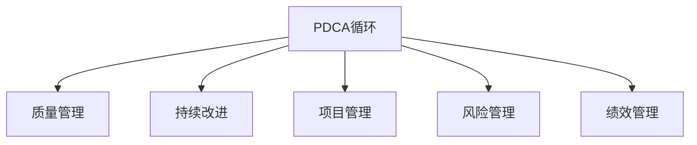

                 

# PDCA循环在流程优化中的作用

> 关键词：PDCA循环,流程优化,质量管理,持续改进,项目管理

## 1. 背景介绍

### 1.1 问题由来
在现代企业管理和项目管理中，流程优化始终是一个重要的课题。无论是制造业的生产线优化，还是软件开发的项目管理，一个良好的流程设计对于提升效率、减少错误和提升质量都具有关键作用。然而，在流程设计的实践中，如何确保流程的持续优化，确保流程能够适应不断变化的环境和需求，仍是一个挑战。

### 1.2 问题核心关键点
PDCA循环（Plan-Do-Check-Act Cycle）是一种广泛应用于质量管理、流程优化和项目管理中的持续改进方法。其核心理念是：通过循环往复、持续优化的方式，确保流程能够逐步完善，适应变化，不断提升效果。在PDCA循环的指导下，我们可以系统地分析和优化流程，确保流程不断改进，提高组织效率。

### 1.3 问题研究意义
研究PDCA循环在流程优化中的应用，对于提升企业管理水平、提高项目管理效率、确保产品质量具有重要意义：

1. **提高效率**：通过PDCA循环的实施，流程设计可以更加精细化，减少资源浪费，提升整体工作效率。
2. **减少错误**：持续优化流程，识别和纠正问题，减少操作错误，提升工作质量。
3. **增强适应性**：流程优化需要不断适应环境变化，PDCA循环提供了一个系统性的方法框架，确保流程能够及时调整和优化。
4. **提升质量**：通过PDCA循环的不断迭代，可以确保流程质量逐步提升，达到更高的标准。
5. **促进创新**：持续改进的过程本身也是不断创新的过程，PDCA循环可以激发组织内部的创新潜能。

## 2. 核心概念与联系

### 2.1 核心概念概述

为更好地理解PDCA循环在流程优化中的应用，本节将介绍几个密切相关的核心概念：

- PDCA循环：一种持续改进的管理工具，通过循环往复的四个阶段（计划、执行、检查、调整），不断优化流程。
- 质量管理：通过PDCA循环等方法，确保产品质量符合预期标准。
- 持续改进：通过PDCA循环，持续优化流程，提升工作效能。
- 项目管理：项目管理中，PDCA循环有助于系统化管理项目，确保项目顺利完成。
- 风险管理：PDCA循环可以帮助识别和控制流程中的潜在风险，提升风险应对能力。
- 绩效管理：通过PDCA循环的持续优化，可以有效提升绩效水平，满足业务目标。

这些核心概念之间的逻辑关系可以通过以下Mermaid流程图来展示：



这个流程图展示了几大核心概念之间的联系：

1. PDCA循环是质量管理、持续改进、项目管理等应用的基础方法论。
2. 质量管理通过PDCA循环确保流程输出达到预期的质量标准。
3. 持续改进是PDCA循环的核心，通过不断优化流程提升效能。
4. 项目管理通过PDCA循环进行系统化管理，确保项目顺利进行。
5. 风险管理通过PDCA循环识别和控制流程中的风险。
6. 绩效管理通过PDCA循环提升业务绩效，满足业务目标。

这些概念共同构成了PDCA循环的工作框架，使其能够系统性地指导流程优化和持续改进。

## 3. 核心算法原理 & 具体操作步骤
### 3.1 算法原理概述

PDCA循环是一种系统性的流程优化方法，其核心思想是通过四个阶段不断迭代，实现流程的持续优化和改进。每个阶段都有具体的步骤和目标，通过系统的执行和反馈，确保流程能够不断完善。

PDCA循环的四个阶段分别为：

- **计划(Plan)**：定义目标、制定计划和策略。
- **执行(Do)**：实施计划，执行具体任务。
- **检查(Check)**：评估执行结果，识别问题。
- **调整(Act)**：基于检查结果，调整计划和策略，进入下一轮循环。

PDCA循环的逻辑流程如下：

```
Plan -> Do -> Check -> Act -> Plan -> Do -> Check -> Act -> ...
```

每个阶段的目标和方法不同，但核心思想是通过不断迭代和反馈，实现流程的持续优化。

### 3.2 算法步骤详解

#### 3.2.1 计划阶段

**步骤1: 确定目标和范围**
- 定义流程优化的目标和范围。例如，提高生产效率、减少错误率等。

**步骤2: 收集数据和信息**
- 收集与目标相关的数据和信息，如流程图、绩效指标、历史数据等。

**步骤3: 分析现状和差距**
- 对现有流程进行评估，识别出存在的问题和不足，与目标进行对比，分析差距。

**步骤4: 制定改进方案**
- 基于分析结果，制定具体的改进方案，包括具体措施、时间表和资源分配。

#### 3.2.2 执行阶段

**步骤1: 实施改进措施**
- 按照制定的改进方案，开始执行具体的改进措施。

**步骤2: 记录执行过程**
- 记录实施过程中的各项数据和信息，以便后续检查和调整。

**步骤3: 监控执行效果**
- 实时监控改进措施的执行效果，确保按计划进行。

**步骤4: 处理突发事件**
- 处理在执行过程中出现的突发事件，确保流程顺利推进。

#### 3.2.3 检查阶段

**步骤1: 评估执行结果**
- 基于执行过程中记录的数据和信息，评估改进措施的执行效果。

**步骤2: 识别问题和不足**
- 识别执行过程中存在的问题和不足，分析其原因。

**步骤3: 分析影响因素**
- 分析影响流程执行效果的各项因素，找出主要影响因素。

#### 3.2.4 调整阶段

**步骤1: 制定调整计划**
- 基于检查阶段的结果，制定具体的调整计划，包括改进措施、资源重新分配等。

**步骤2: 实施调整措施**
- 按照调整计划，重新执行改进措施。

**步骤3: 监控调整效果**
- 监控调整后的流程执行效果，确保改进措施达到预期目标。

**步骤4: 进入下一轮循环**
- 将检查和调整阶段的结果反馈到计划阶段，进入下一轮PDCA循环。

### 3.3 算法优缺点

PDCA循环在流程优化中的应用具有以下优点：

1. **系统性**：PDCA循环提供了一个结构化的流程优化框架，确保流程优化有章可循，有法可依。
2. **持续改进**：通过不断循环往复，PDCA循环确保流程不断优化，逐步提升效果。
3. **灵活性**：PDCA循环可以根据实际情况进行调整，适应不同的业务需求和环境变化。
4. **可操作性强**：PDCA循环的每个阶段都有具体的执行步骤和目标，易于操作和执行。

同时，PDCA循环也存在以下缺点：

1. **周期较长**：PDCA循环的每个循环周期较长，对于紧急情况可能不够灵活。
2. **资源消耗较大**：执行PDCA循环需要投入大量人力和资源，初期成本较高。
3. **复杂性较高**：PDCA循环的执行需要系统性的规划和执行，对于复杂流程可能较难实施。

尽管存在这些缺点，PDCA循环仍然是流程优化中一种非常有效的管理工具，能够系统性地提升流程效果。

### 3.4 算法应用领域

PDCA循环在多个领域中都得到了广泛的应用，具体包括：

1. **制造和生产**：通过PDCA循环优化生产线流程，提高生产效率和质量。
2. **软件开发**：通过PDCA循环优化软件开发流程，提高开发效率和软件质量。
3. **项目管理**：通过PDCA循环系统化管理项目，确保项目顺利进行。
4. **质量管理**：通过PDCA循环确保产品和服务质量符合预期标准。
5. **风险管理**：通过PDCA循环识别和控制流程中的潜在风险。
6. **绩效管理**：通过PDCA循环提升业务绩效，满足业务目标。
7. **人力资源管理**：通过PDCA循环优化人力资源管理流程，提升员工绩效和满意度。

## 4. 数学模型和公式 & 详细讲解 & 举例说明

### 4.1 数学模型构建

PDCA循环的数学模型主要涉及流程评估、数据统计和结果分析。以下是对PDCA循环各阶段数学模型的简要介绍：

#### 4.1.1 计划阶段

在计划阶段，我们通常需要收集和分析现有的流程数据，制定具体的改进方案。数学模型主要涉及数据收集和分析，如：

$$
D = \sum_{i=1}^{n} x_i
$$

其中 $D$ 为数据的总和，$n$ 为数据的个数，$x_i$ 为每个数据点。

#### 4.1.2 执行阶段

在执行阶段，我们需要记录和监控执行过程中的各项数据，如：

$$
X = \{ x_1, x_2, ..., x_m \}
$$

其中 $X$ 为执行过程中的数据集合，$m$ 为数据点的数量。

#### 4.1.3 检查阶段

在检查阶段，我们需要评估执行结果，识别问题和不足。数学模型主要涉及数据的统计分析，如：

$$
\mu = \frac{1}{m} \sum_{i=1}^{m} x_i
$$

其中 $\mu$ 为数据的平均值。

#### 4.1.4 调整阶段

在调整阶段，我们需要基于检查阶段的结果，制定具体的调整措施。数学模型主要涉及数据拟合和优化，如：

$$
\theta = \arg\min_{\theta} \sum_{i=1}^{n} (y_i - f(x_i; \theta))^2
$$

其中 $\theta$ 为优化参数，$y_i$ 为期望输出，$f(x_i; \theta)$ 为模型的预测函数，$n$ 为数据点的数量。

### 4.2 公式推导过程

以下是PDCA循环中几个关键数学公式的推导过程：

#### 4.2.1 数据总和

假设我们有 $n$ 个数据点 $x_1, x_2, ..., x_n$，则数据的总和为：

$$
D = \sum_{i=1}^{n} x_i
$$

#### 4.2.2 数据平均值

数据的平均值 $\mu$ 为：

$$
\mu = \frac{1}{n} \sum_{i=1}^{n} x_i
$$

#### 4.2.3 数据标准差

数据的标准差 $\sigma$ 为：

$$
\sigma = \sqrt{\frac{1}{n-1} \sum_{i=1}^{n} (x_i - \mu)^2}
$$

#### 4.2.4 数据拟合

假设我们有一个线性回归模型 $y = \theta_0 + \theta_1 x_i$，其中 $\theta_0, \theta_1$ 为模型参数，$x_i$ 为数据点。通过最小二乘法拟合数据，得到：

$$
\theta = \arg\min_{\theta} \sum_{i=1}^{n} (y_i - f(x_i; \theta))^2
$$

通过求解上述最小二乘问题，可以拟合出最佳模型参数 $\theta$。

### 4.3 案例分析与讲解

以制造业生产线的流程优化为例，说明PDCA循环的应用过程：

#### 4.3.1 计划阶段

目标：提高生产效率，减少废品率。

1. **收集数据**：收集过去一段时间的生产数据，包括生产速度、废品率、设备故障率等。
2. **分析现状**：分析现有生产线的流程，识别出瓶颈和不足。
3. **制定方案**：制定具体的改进措施，如优化生产流程、增加设备维护频率等。

#### 4.3.2 执行阶段

1. **实施措施**：按照制定的改进措施，开始优化生产线流程。
2. **记录数据**：记录优化过程中的各项数据，如生产速度、废品率、设备故障率等。

#### 4.3.3 检查阶段

1. **评估结果**：基于记录的数据，评估改进措施的执行效果。
2. **识别问题**：识别出执行过程中存在的问题和不足，如设备故障率未下降等。
3. **分析因素**：分析影响生产效率的各项因素，如设备老旧、操作不当等。

#### 4.3.4 调整阶段

1. **制定调整计划**：基于检查阶段的结果，制定具体的调整计划，如更新设备、重新培训操作人员等。
2. **实施调整措施**：按照调整计划，重新执行改进措施。
3. **监控效果**：监控调整后的生产线流程，确保生产效率提升和废品率下降。
4. **进入下一轮循环**：将检查和调整阶段的结果反馈到计划阶段，进入下一轮PDCA循环。

通过PDCA循环的不断迭代，制造业生产线能够逐步优化，提升生产效率和质量，达到预期的目标。

## 5. 项目实践：代码实例和详细解释说明

### 5.1 开发环境搭建

在进行PDCA循环的实践时，我们需要准备好开发环境。以下是使用Python进行代码实现的环境配置流程：

1. 安装Anaconda：从官网下载并安装Anaconda，用于创建独立的Python环境。

2. 创建并激活虚拟环境：
```bash
conda create -n pdca-env python=3.8 
conda activate pdca-env
```

3. 安装Python相关工具包：
```bash
pip install pandas numpy matplotlib scipy sympy jupyter notebook
```

4. 安装流程优化相关库：
```bash
pip install pycaflow
```

完成上述步骤后，即可在`pdca-env`环境中开始PDCA循环的实践。

### 5.2 源代码详细实现

我们以制造业生产线流程优化为例，给出使用PyCAFlow库进行PDCA循环代码实现。

首先，定义生产线的原始数据：

```python
import pandas as pd

data = pd.read_csv('production_data.csv')
```

然后，定义PDCA循环的各个阶段函数：

```python
from pycaflow import PDCA

pdca = PDCA(data)

# 计划阶段
plan = pdca.plan()
print(f"Plan: {plan}")

# 执行阶段
do = pdca.do()
print(f"Do: {do}")

# 检查阶段
check = pdca.check()
print(f"Check: {check}")

# 调整阶段
act = pdca.act()
print(f"Act: {act}")

# 进入下一轮循环
plan = pdca.plan()
print(f"Plan: {plan}")
```

最后，在实际生产过程中，实时监控数据并调整流程：

```python
while True:
    # 实时收集数据
    new_data = pd.read_csv('real_time_data.csv')
    
    # 执行PDCA循环
    plan = pdca.plan(new_data)
    do = pdca.do(new_data)
    check = pdca.check(new_data)
    act = pdca.act(new_data)
    
    # 输出优化结果
    print(f"Plan: {plan}")
    print(f"Do: {do}")
    print(f"Check: {check}")
    print(f"Act: {act}")
```

以上就是使用PyCAFlow库进行PDCA循环的完整代码实现。可以看到，通过PyCAFlow库，PDCA循环的各个阶段可以轻松实现，使得流程优化变得简洁高效。

### 5.3 代码解读与分析

让我们再详细解读一下关键代码的实现细节：

**PyCAFlow库**：
- `PDCA`类：用于执行PDCA循环。
- `plan`方法：执行计划阶段，制定改进方案。
- `do`方法：执行执行阶段，实施改进措施。
- `check`方法：执行检查阶段，评估执行结果。
- `act`方法：执行调整阶段，制定调整计划。

**数据处理**：
- `pd.read_csv`方法：用于读取CSV格式的数据文件。
- `pd.DataFrame`类：用于处理和分析数据。

**循环控制**：
- `while`循环：用于实时收集数据，执行PDCA循环。

通过上述代码，我们能够实现PDCA循环在实际生产中的应用，确保生产线流程不断优化，提升生产效率和质量。

## 6. 实际应用场景

### 6.1 智能制造

在智能制造领域，PDCA循环可以用于优化生产流程，提升生产效率和质量。例如，通过PDCA循环不断优化生产线布局、设备维护和操作流程，可以显著提升生产效率，减少废品率。

### 6.2 软件开发

在软件开发中，PDCA循环可以用于优化项目管理和开发流程，提升开发效率和软件质量。例如，通过PDCA循环优化需求分析、测试和发布流程，可以减少开发错误，提高软件可靠性。

### 6.3 医院管理

在医院管理中，PDCA循环可以用于优化诊疗流程，提升服务质量和患者满意度。例如，通过PDCA循环优化挂号、诊疗、出院流程，可以显著提升医院运营效率和患者体验。

### 6.4 银行服务

在银行服务中，PDCA循环可以用于优化客户服务流程，提升服务效率和客户满意度。例如，通过PDCA循环优化客户咨询、贷款审批和投诉处理流程，可以显著提升银行服务质量。

### 6.5 餐饮管理

在餐饮管理中，PDCA循环可以用于优化菜单设计、订单处理和食品安全流程，提升餐厅运营效率和顾客满意度。例如，通过PDCA循环优化菜单设计、员工培训和食品安全检查流程，可以显著提升餐厅运营质量和顾客体验。

## 7. 工具和资源推荐
### 7.1 学习资源推荐

为了帮助开发者系统掌握PDCA循环的理论基础和实践技巧，这里推荐一些优质的学习资源：

1. 《PDCA循环原理与应用》系列博文：由大模型技术专家撰写，深入浅出地介绍了PDCA循环原理、应用场景和实践技巧。

2. CS224N《质量管理与PDCA循环》课程：斯坦福大学开设的质量管理课程，有Lecture视频和配套作业，带你入门PDCA循环的基本概念和经典模型。

3. 《PDCA循环实战指南》书籍：全面介绍了PDCA循环在各类场景中的应用，包括制造业、软件开发、医院管理等。

4. PDCA官方文档：详细介绍了PDCA循环的各个阶段和具体操作方法，是上手实践的必备资料。

5. 《PDCA循环案例分析》报告：介绍了PDCA循环在不同领域的典型案例，提供丰富的实战经验和建议。

通过对这些资源的学习实践，相信你一定能够快速掌握PDCA循环的精髓，并用于解决实际的流程优化问题。

### 7.2 开发工具推荐

高效的开发离不开优秀的工具支持。以下是几款用于PDCA循环开发的常用工具：

1. PyCAFlow：用于执行PDCA循环的Python库，提供了便捷的流程优化接口和丰富的功能。
2. Microsoft Visio：用于绘制流程图和PDCA循环图，帮助清晰展示流程优化逻辑。
3. JIRA：用于项目管理和流程优化，提供任务跟踪和流程控制功能。
4. Microsoft Excel：用于数据分析和PDCA循环报表，提供强大的数据处理和可视化功能。
5. Trello：用于项目管理，提供看板和卡片功能，帮助跟踪PDCA循环进度。

合理利用这些工具，可以显著提升PDCA循环的开发效率，加快流程优化的迭代速度。

### 7.3 相关论文推荐

PDCA循环在流程优化中的应用源于学界的持续研究。以下是几篇奠基性的相关论文，推荐阅读：

1. "A Survey on the Applications of the PDCA Cycle in Industry"：介绍了PDCA循环在各个行业中的应用和效果。
2. "PDCA Cycle: A Critical Review of Its Role in Quality Management"：从质量管理的角度，探讨了PDCA循环的理论基础和实际应用。
3. "The Role of the PDCA Cycle in Continuous Improvement"：讨论了PDCA循环在持续改进中的作用和意义。
4. "The Effectiveness of the PDCA Cycle in Project Management"：分析了PDCA循环在项目管理中的应用效果。
5. "A Case Study of PDCA Cycle in Manufacturing"：提供了PDCA循环在制造业应用的实际案例和结果分析。

这些论文代表了大循环的理论发展和应用实践，通过学习这些前沿成果，可以帮助研究者把握学科前进方向，激发更多的创新灵感。

## 8. 总结：未来发展趋势与挑战

### 8.1 总结

本文对PDCA循环在流程优化中的应用进行了全面系统的介绍。首先阐述了PDCA循环的核心理念和具体步骤，明确了PDCA循环在质量管理、流程优化和项目管理中的重要作用。其次，从原理到实践，详细讲解了PDCA循环的各个阶段和方法，给出了PDCA循环任务开发的完整代码实例。同时，本文还广泛探讨了PDCA循环在智能制造、软件开发、医院管理等多个领域的应用前景，展示了PDCA循环的强大应用潜力。此外，本文精选了PDCA循环的各类学习资源，力求为读者提供全方位的技术指引。

通过本文的系统梳理，可以看到，PDCA循环在流程优化中具有广泛的应用前景，特别是在提升效率、减少错误和增强适应性方面具有显著优势。未来，随着技术的发展和应用场景的扩展，PDCA循环将在更多领域中得到应用，为各个行业的流程优化提供系统化的解决方案。

### 8.2 未来发展趋势

展望未来，PDCA循环在流程优化中的应用将呈现以下几个发展趋势：

1. **自动化和智能化**：随着人工智能技术的发展，PDCA循环的执行和监控将逐步自动化和智能化，提高流程优化的效率和精度。
2. **跨领域应用**：PDCA循环的应用范围将进一步拓展，从制造、软件到医疗、金融等各个领域都可以应用PDCA循环进行流程优化。
3. **大数据支持**：通过引入大数据分析技术，PDCA循环可以更全面地分析流程数据，提供更加精准的优化建议。
4. **实时优化**：PDCA循环将逐步实现实时优化，通过实时数据收集和分析，持续改进流程。
5. **模型驱动**：引入数据科学和机器学习模型，优化PDCA循环的执行策略，提升流程优化效果。

以上趋势凸显了PDCA循环在流程优化中的广阔前景。这些方向的探索发展，必将进一步提升流程优化的方法和效果，为组织的运营管理带来更大的价值。

### 8.3 面临的挑战

尽管PDCA循环在流程优化中已经取得了显著效果，但在实施过程中仍面临一些挑战：

1. **数据质量**：流程优化的效果很大程度上依赖于数据质量，不完整、不准确的数据可能导致误导性的结果。
2. **执行难度**：PDCA循环的执行需要系统性的规划和实施，对于复杂的流程可能较难推进。
3. **资源消耗**：PDCA循环的实施需要投入大量人力和资源，初期成本较高。
4. **沟通协调**：流程优化涉及多个部门和角色，需要良好的沟通和协调，确保各环节协同推进。
5. **技术复杂性**：PDCA循环的实施需要引入多种技术和工具，可能存在一定的技术复杂性。

尽管存在这些挑战，但通过合理的规划和实施，PDCA循环的优化效果将不断提升，为组织运营管理提供有力支持。

### 8.4 研究展望

面对PDCA循环面临的挑战，未来的研究需要在以下几个方面寻求新的突破：

1. **数据质量保障**：通过引入数据清洗和预处理技术，提升数据质量，确保流程优化结果的准确性。
2. **自动化和智能化**：开发自动化工具和算法，减少人工干预，提升PDCA循环的执行效率和精度。
3. **跨领域融合**：探索PDCA循环与其他流程管理工具和方法的融合，提升流程优化的系统性。
4. **模型驱动**：引入数据科学和机器学习模型，优化PDCA循环的执行策略，提升流程优化效果。
5. **实时优化**：引入实时数据分析技术，实现PDCA循环的实时优化，确保流程优化效果。

这些研究方向将引领PDCA循环技术的发展，推动其在更多领域中得到应用，为组织的运营管理提供更为系统化和智能化的解决方案。总之，通过合理的规划和实施，PDCA循环将在流程优化中发挥更大的作用，为组织的运营管理带来更大的价值。

## 9. 附录：常见问题与解答

**Q1：PDCA循环是否适用于所有流程优化场景？**

A: PDCA循环在绝大多数流程优化场景中都能有效应用，特别是对于系统化、结构化的流程。但对于一些特定场景，如突发事件处理、应急响应等，可能需要结合其他方法，如应急预案等。

**Q2：如何选择合适的PDCA循环执行策略？**

A: 选择合适的PDCA循环执行策略需要考虑流程的复杂性、数据量、资源状况等因素。对于简单流程，可以采用传统的PDCA循环，而对于复杂流程，可能需要引入自动化工具和技术，如流程管理系统、自动化测试工具等。

**Q3：PDCA循环在实施过程中需要注意哪些问题？**

A: 在实施PDCA循环时，需要注意以下几点：
1. **明确目标**：确保PDCA循环的目标清晰明确，能够直接反映业务需求。
2. **数据质量**：确保数据的准确性和完整性，避免因数据问题导致误导性的结果。
3. **资源投入**：合理评估PDCA循环的资源需求，确保人力、物力和财力支持。
4. **跨部门协作**：确保各相关部门和角色协同推进，避免孤岛式操作。
5. **持续监控**：持续监控PDCA循环的执行情况，及时调整策略，确保流程优化效果。

**Q4：PDCA循环如何与其他管理工具结合？**

A: PDCA循环可以与其他管理工具结合，形成更为系统化的流程优化方案。例如，PDCA循环可以结合敏捷项目管理工具、持续集成工具等，形成全面的流程优化和持续改进体系。

**Q5：PDCA循环是否适用于跨组织协作流程优化？**

A: PDCA循环在跨组织协作流程优化中也具有重要应用价值。通过统一流程标准和执行规范，确保各个组织的流程优化协同推进，提升整体效率和质量。

总之，PDCA循环在流程优化中具有广泛的应用前景和显著的优势。通过合理规划和实施，PDCA循环将为组织的运营管理提供有力的支持，推动流程优化不断提升，提升运营效率和业务绩效。

