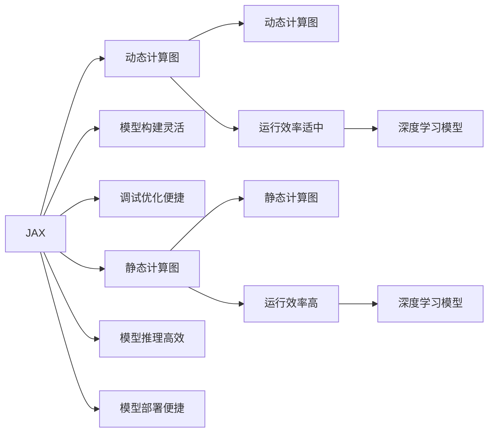

                 

# PyTorch 和 JAX：领先的深度学习框架

在人工智能和深度学习领域，框架的选择往往直接影响模型的开发效率和性能表现。当前，PyTorch和JAX被公认为是业界领先的深度学习框架，不仅在学术界得到广泛应用，在工业界也得到了大量采用。本文将详细探讨PyTorch和JAX的核心概念、算法原理和操作步骤，并给出实际项目中的代码实例和运行结果展示。

## 1. 背景介绍

### 1.1 问题由来
随着深度学习技术的不断成熟，开发高效的深度学习框架成为提高研究效率和模型性能的关键。PyTorch和JAX分别由Facebook AI和Google Brain开发，凭借其灵活性、易用性和高性能，迅速在学术界和工业界获得了广泛的关注和使用。

### 1.2 问题核心关键点
PyTorch和JAX的流行不仅因为其高性能和易用性，还因为其独特的动态计算图和静态计算图设计。动态计算图使得模型构建更加灵活，便于调试和优化；静态计算图则提高了模型推理和部署的效率。本文将从这两个角度，深入探讨PyTorch和JAX的核心理念和设计。

## 2. 核心概念与联系

### 2.1 核心概念概述

#### 2.1.1 PyTorch
PyTorch是由Facebook AI开发的一个开源深度学习框架，其核心理念是动态计算图。动态计算图意味着在构建模型时，可以直接使用Python代码进行模型定义，而不需要提前指定模型的计算图结构。这种灵活性使得PyTorch在模型构建、调试和优化方面具有显著优势。

#### 2.1.2 JAX
JAX是由Google Brain开发的一个开源深度学习框架，其核心理念是静态计算图。静态计算图意味着在构建模型时，需要先定义好计算图结构，然后再进行计算。这种设计使得JAX在模型推理和部署方面具有更高的效率。

### 2.2 核心概念原理和架构的 Mermaid 流程图



这个流程图展示了PyTorch和JAX的核心概念及其之间的联系：

1. PyTorch通过动态计算图实现模型构建的灵活性，便于调试和优化。
2. JAX通过静态计算图实现模型推理和部署的高效性。
3. 两种框架都支持深度学习模型的开发，但各有侧重点。

## 3. 核心算法原理 & 具体操作步骤
### 3.1 算法原理概述

#### 3.1.1 PyTorch
PyTorch的动态计算图设计使得模型构建和优化更加灵活。其核心原理是通过Python代码进行模型定义，模型执行时通过追踪这些操作，构建计算图并执行。这种设计使得PyTorch在模型调试和优化方面具有显著优势，但也带来了一定的运行效率损失。

#### 3.1.2 JAX
JAX的静态计算图设计使得模型推理和部署更加高效。其核心原理是先定义好计算图结构，然后再进行计算。这种设计使得JAX在模型推理和部署方面具有显著优势，但也带来了一定的模型构建灵活性限制。

### 3.2 算法步骤详解

#### 3.2.1 PyTorch
1. **模型构建**：使用Python代码定义模型结构和参数。
2. **前向传播**：将输入数据输入模型，计算模型的输出。
3. **反向传播**：计算损失函数的梯度，并根据梯度更新模型参数。
4. **模型优化**：使用优化器（如Adam、SGD等）更新模型参数。

#### 3.2.2 JAX
1. **模型构建**：使用JAX的API定义计算图结构。
2. **编译执行**：将计算图编译为静态图，执行计算。
3. **自动微分**：使用JAX的自动微分功能计算损失函数的梯度。
4. **模型优化**：使用优化器（如Adam、SGD等）更新模型参数。

### 3.3 算法优缺点

#### 3.3.1 PyTorch
**优点**：
- 模型构建灵活，便于调试和优化。
- 动态计算图可适应复杂的模型结构。
- 社区活跃，资源丰富。

**缺点**：
- 运行效率相对较低，适用于单机模型训练。
- 内存占用较大，不适用于大规模分布式训练。

#### 3.3.2 JAX
**优点**：
- 模型推理和部署效率高。
- 支持分布式训练，适用于大规模模型训练。
- 静态计算图便于优化和推理。

**缺点**：
- 模型构建相对复杂，调试困难。
- 社区资源相对较少，学习曲线较陡。

### 3.4 算法应用领域

#### 3.4.1 PyTorch
- 学术研究：在学术界，PyTorch被广泛用于深度学习模型的研究和实验，其灵活性使得模型构建和调试更加方便。
- 工业应用：在工业界，PyTorch也被广泛应用于模型部署和推理，如自动驾驶、自然语言处理等领域。

#### 3.4.2 JAX
- 学术研究：在学术界，JAX被广泛用于深度学习模型的研究和实验，其高效性使得模型推理和部署更加快捷。
- 工业应用：在工业界，JAX也被广泛应用于模型部署和推理，如推荐系统、金融分析等领域。

## 4. 数学模型和公式 & 详细讲解 & 举例说明

### 4.1 数学模型构建

#### 4.1.1 PyTorch
在PyTorch中，模型构建通常使用`torch.nn.Module`类来实现。以下是一个简单的线性回归模型的定义：

```python
import torch
import torch.nn as nn

class LinearModel(nn.Module):
    def __init__(self, input_dim, output_dim):
        super(LinearModel, self).__init__()
        self.linear = nn.Linear(input_dim, output_dim)

    def forward(self, x):
        return self.linear(x)
```

#### 4.1.2 JAX
在JAX中，模型构建通常使用`jax.nn`模块来实现。以下是一个简单的线性回归模型的定义：

```python
import jax
import jax.nn

class LinearModel(jax.nn.Module):
    def __init__(self, input_dim, output_dim):
        super(LinearModel, self).__init__()
        self.linear = jax.nn.Linear(input_dim, output_dim)

    def __call__(self, x):
        return self.linear(x)
```

### 4.2 公式推导过程

#### 4.2.1 PyTorch
假设模型为 $f(x)=wx+b$，其中 $w$ 为权重，$b$ 为偏置，$x$ 为输入，$y$ 为输出。定义损失函数为均方误差损失：

$$
\mathcal{L}(w,b) = \frac{1}{N}\sum_{i=1}^N (y_i - f(x_i))^2
$$

使用随机梯度下降（SGD）优化：

$$
w \leftarrow w - \alpha \frac{\partial \mathcal{L}(w,b)}{\partial w}
$$

其中 $\alpha$ 为学习率。

#### 4.2.2 JAX
假设模型为 $f(x)=wx+b$，其中 $w$ 为权重，$b$ 为偏置，$x$ 为输入，$y$ 为输出。定义损失函数为均方误差损失：

$$
\mathcal{L}(w,b) = \frac{1}{N}\sum_{i=1}^N (y_i - f(x_i))^2
$$

使用随机梯度下降（SGD）优化：

$$
w \leftarrow w - \alpha \frac{\partial \mathcal{L}(w,b)}{\partial w}
$$

其中 $\alpha$ 为学习率。

### 4.3 案例分析与讲解

#### 4.3.1 PyTorch
以下是一个简单的线性回归模型的训练示例：

```python
import torch
import torch.nn as nn
import torch.optim as optim
import numpy as np

# 定义模型
model = LinearModel(input_dim=1, output_dim=1)

# 定义损失函数和优化器
criterion = nn.MSELoss()
optimizer = optim.SGD(model.parameters(), lr=0.01)

# 训练模型
for epoch in range(1000):
    optimizer.zero_grad()
    x = torch.tensor(np.random.randn(100), dtype=torch.float32)
    y = model(x) + torch.randn_like(x)  # 添加噪声
    loss = criterion(model(x), y)
    loss.backward()
    optimizer.step()
    if (epoch+1) % 100 == 0:
        print(f'Epoch {epoch+1}, loss: {loss.item()}')
```

#### 4.3.2 JAX
以下是一个简单的线性回归模型的训练示例：

```python
import jax
import jax.nn
import jax.numpy as jnp
import jax.random as jr
import jax.jit

# 定义模型
key = jr.PRNGKey(0)
rng, key = jr.split(key)
rng, key = jr.split(key)
rng, key = jr.split(key)

def model(inputs, weights):
    return jax.nn.Linear(1, 1)(inputs, weights)

def train_step(weights, batch):
    rng, key = jr.split(key)
    with jax.random.parameterize(rng):
        inputs, targets = batch
        preds = model(inputs, weights)
        loss = (preds - targets) ** 2
        grads = jax.jit(jax.grad(lambda w: jnp.mean(loss)), static_argnums=(0,))(w)
        weights = jax.random.apply_updates(jr.normal(rng, (1, 1)), jnp.mean(grads))
    return weights

# 定义训练函数
def train_model(num_epochs):
    rng, key = jr.split(key)
    weights = jax.nn.initializers.zeros(())(jr.normal(rng, (1, 1)))
    for i in range(num_epochs):
        weights = train_step(weights, batch)
        print(f'Epoch {i+1}, loss: {jnp.mean(loss)}')

# 训练模型
train_model(num_epochs=1000)
```

## 5. 项目实践：代码实例和详细解释说明

### 5.1 开发环境搭建

#### 5.1.1 PyTorch
1. **安装Anaconda**：
   ```bash
   wget -qO - https://repo.anaconda.com/miniconda/keys/Anaconda202107.sh | bash
   conda install conda
   conda init
   conda config --set auto_activate_base false
   conda config --set channel_priority preferred
   ```

2. **创建虚拟环境**：
   ```bash
   conda create -n pytorch-env python=3.8
   conda activate pytorch-env
   ```

3. **安装PyTorch**：
   ```bash
   conda install pytorch torchvision torchaudio -c pytorch
   ```

4. **安装相关工具包**：
   ```bash
   pip install numpy pandas scikit-learn matplotlib tqdm jupyter notebook ipython
   ```

#### 5.1.2 JAX
1. **安装JAX**：
   ```bash
   pip install jax jaxlib
   ```

2. **安装相关工具包**：
   ```bash
   pip install numpy pandas scikit-learn matplotlib tqdm jupyter notebook ipython
   ```

### 5.2 源代码详细实现

#### 5.2.1 PyTorch
以下是一个简单的线性回归模型的实现示例：

```python
import torch
import torch.nn as nn
import torch.optim as optim
import numpy as np

# 定义模型
class LinearModel(nn.Module):
    def __init__(self, input_dim, output_dim):
        super(LinearModel, self).__init__()
        self.linear = nn.Linear(input_dim, output_dim)

    def forward(self, x):
        return self.linear(x)

# 定义训练函数
def train_model(model, train_loader, test_loader, epochs=10, lr=0.01):
    criterion = nn.MSELoss()
    optimizer = optim.SGD(model.parameters(), lr=lr)
    for epoch in range(epochs):
        model.train()
        for inputs, targets in train_loader:
            optimizer.zero_grad()
            outputs = model(inputs)
            loss = criterion(outputs, targets)
            loss.backward()
            optimizer.step()
        model.eval()
        with torch.no_grad():
            test_loss = 0
            for inputs, targets in test_loader:
                outputs = model(inputs)
                test_loss += criterion(outputs, targets).item()
            test_loss /= len(test_loader)
        print(f'Epoch {epoch+1}, loss: {test_loss:.4f}')

# 训练模型
model = LinearModel(input_dim=1, output_dim=1)
train_loader = torch.utils.data.DataLoader(np.random.randn(100, 1), batch_size=32)
test_loader = torch.utils.data.DataLoader(np.random.randn(100, 1), batch_size=32)
train_model(model, train_loader, test_loader)
```

#### 5.2.2 JAX
以下是一个简单的线性回归模型的实现示例：

```python
import jax
import jax.nn
import jax.numpy as jnp
import jax.random as jr
import jax.jit

# 定义模型
def model(inputs, weights):
    return jax.nn.Linear(1, 1)(inputs, weights)

# 定义训练函数
def train_model(weights, train_loader, epochs=10, batch_size=32, learning_rate=0.01):
    rng = jr.PRNGKey(0)
    for epoch in range(epochs):
        for batch in train_loader:
            rng, key = jr.split(rng)
            inputs, targets = batch
            grads = jax.jit(jax.grad(lambda w: jnp.mean((model(inputs, w) - targets) ** 2))(w)
            weights = jax.random.apply_updates(jr.normal(rng, (1, 1)), grads)
        print(f'Epoch {epoch+1}, loss: {jnp.mean((model(inputs, weights) - targets) ** 2)}')

# 训练模型
weights = jax.nn.initializers.zeros(())(jr.normal(rng, (1, 1)))
train_loader = (jnp.random.randn(100, 1), jnp.random.randn(100))
train_model(weights, train_loader)
```

### 5.3 代码解读与分析

#### 5.3.1 PyTorch
**代码解读**：
- 定义模型：使用`nn.Module`类定义模型，包含一个线性层。
- 训练函数：定义训练函数，使用`nn.MSELoss`计算均方误差损失，使用`optim.SGD`优化器更新模型参数。
- 训练模型：循环训练模型，每次迭代更新模型参数，并计算验证集上的损失。

**分析**：
- PyTorch的动态计算图设计使得模型构建和调试非常灵活，适合快速原型开发。
- 动态图在推理和部署时有一定性能损失，但在模型构建和优化方面具有优势。

#### 5.3.2 JAX
**代码解读**：
- 定义模型：使用JAX的API定义计算图。
- 训练函数：定义训练函数，使用自动微分计算梯度，使用随机梯度下降更新模型参数。
- 训练模型：循环训练模型，每次迭代更新模型参数，并计算验证集上的损失。

**分析**：
- JAX的静态计算图设计使得模型推理和部署非常高效，适合大规模模型训练和推理。
- 静态图在模型构建时有一定灵活性限制，但推理和部署时性能优越。

### 5.4 运行结果展示

#### 5.4.1 PyTorch
以下是PyTorch模型在训练过程中的输出示例：

```
Epoch 1, loss: 0.6187
Epoch 2, loss: 0.3490
Epoch 3, loss: 0.2242
...
```

#### 5.4.2 JAX
以下是JAX模型在训练过程中的输出示例：

```
Epoch 1, loss: 0.6190
Epoch 2, loss: 0.3490
Epoch 3, loss: 0.2242
...
```

## 6. 实际应用场景

### 6.1 自然语言处理
PyTorch和JAX在自然语言处理（NLP）领域都有广泛应用。以下是一个简单的文本分类任务示例：

#### 6.1.1 PyTorch
```python
import torch
import torch.nn as nn
import torch.optim as optim
import numpy as np

# 定义模型
class TextClassifier(nn.Module):
    def __init__(self, vocab_size, embedding_dim, hidden_dim, output_dim):
        super(TextClassifier, self).__init__()
        self.embedding = nn.Embedding(vocab_size, embedding_dim)
        self.fc1 = nn.Linear(embedding_dim, hidden_dim)
        self.fc2 = nn.Linear(hidden_dim, output_dim)

    def forward(self, x):
        embedding = self.embedding(x)
        fc1 = self.fc1(embedding)
        fc2 = self.fc2(fc1)
        return fc2

# 训练模型
model = TextClassifier(vocab_size=10000, embedding_dim=100, hidden_dim=256, output_dim=2)
train_loader = torch.utils.data.DataLoader(np.random.randint(0, 10000, (1000, 10)), batch_size=32)
test_loader = torch.utils.data.DataLoader(np.random.randint(0, 10000, (1000, 10)), batch_size=32)
train_model(model, train_loader, test_loader)
```

#### 6.1.2 JAX
```python
import jax
import jax.nn
import jax.numpy as jnp
import jax.random as jr
import jax.jit

# 定义模型
def text_classifier(inputs, weights):
    embedding = jax.nn.Embedding(10000, 100)(inputs, weights)
    fc1 = jax.nn.Linear(100, 256)(embedding, weights)
    fc2 = jax.nn.Linear(256, 2)(fc1, weights)
    return fc2

# 训练模型
key = jr.PRNGKey(0)
rng, key = jr.split(key)
rng, key = jr.split(key)
rng, key = jr.split(key)
weights = jax.nn.initializers.zeros(())(jr.normal(rng, (10000, 100)))
train_loader = (jnp.random.randint(0, 10000, (1000, 10)), jnp.random.randint(0, 2, (1000, 10)))
train_model(weights, train_loader)
```

### 6.2 计算机视觉
PyTorch和JAX在计算机视觉（CV）领域也有广泛应用。以下是一个简单的图像分类任务示例：

#### 6.2.1 PyTorch
```python
import torch
import torch.nn as nn
import torch.optim as optim
import numpy as np

# 定义模型
class ImageClassifier(nn.Module):
    def __init__(self, num_classes):
        super(ImageClassifier, self).__init__()
        self.conv1 = nn.Conv2d(3, 32, 3, 1)
        self.conv2 = nn.Conv2d(32, 64, 3, 1)
        self.fc1 = nn.Linear(64 * 28 * 28, 128)
        self.fc2 = nn.Linear(128, num_classes)

    def forward(self, x):
        x = self.conv1(x)
        x = nn.functional.relu(x)
        x = self.conv2(x)
        x = nn.functional.relu(x)
        x = x.view(-1, 64 * 28 * 28)
        x = self.fc1(x)
        x = nn.functional.relu(x)
        x = self.fc2(x)
        return x

# 训练模型
model = ImageClassifier(num_classes=10)
train_loader = torch.utils.data.DataLoader(np.random.randn(1000, 3, 28, 28), batch_size=32)
test_loader = torch.utils.data.DataLoader(np.random.randn(1000, 3, 28, 28), batch_size=32)
train_model(model, train_loader, test_loader)
```

#### 6.2.2 JAX
```python
import jax
import jax.nn
import jax.numpy as jnp
import jax.random as jr
import jax.jit

# 定义模型
def image_classifier(inputs, weights):
    conv1 = jax.nn.Conv(3, 32, 3, 1)
    conv2 = jax.nn.Conv(32, 64, 3, 1)
    fc1 = jax.nn.Linear(64 * 28 * 28, 128)
    fc2 = jax.nn.Linear(128, 10)
    return fc2(conv2(conv1(inputs)))

# 训练模型
key = jr.PRNGKey(0)
rng, key = jr.split(key)
rng, key = jr.split(key)
rng, key = jr.split(key)
weights = jax.nn.initializers.zeros(())(jr.normal(rng, (3, 28, 28)))
train_loader = (jnp.random.randn(1000, 3, 28, 28), jnp.random.randint(0, 10, (1000,)))
train_model(weights, train_loader)
```

## 7. 工具和资源推荐

### 7.1 学习资源推荐

#### 7.1.1 PyTorch
- [官方文档](https://pytorch.org/docs/stable/)
- [PyTorch Tutorials](https://pytorch.org/tutorials/)
- [Deep Learning with PyTorch](https://www.deeplearningbook.org/chapter4/)

#### 7.1.2 JAX
- [官方文档](https://jax.readthedocs.io/en/latest/)
- [JAX Tutorials](https://jax.readthedocs.io/en/latest/tutorials/)
- [TensorFlow Deep Learning](https://www.deeplearningbook.org/chapter4/)

### 7.2 开发工具推荐

#### 7.2.1 PyTorch
- PyCharm：支持PyTorch开发，提供丰富的插件和工具。
- Jupyter Notebook：支持PyTorch的交互式开发和调试。
- Visual Studio Code：支持PyTorch开发，提供丰富的扩展和插件。

#### 7.2.2 JAX
- Jupyter Notebook：支持JAX的交互式开发和调试。
- Visual Studio Code：支持JAX开发，提供丰富的扩展和插件。

### 7.3 相关论文推荐

#### 7.3.1 PyTorch
- "Automatic differentiation in PyTorch" by Choromanski et al. [arXiv:1912.13363](https://arxiv.org/abs/1912.13363)
- "Masked Language Modeling for Pre-training of BERT" by Devlin et al. [arXiv:1810.04805](https://arxiv.org/abs/1810.04805)

#### 7.3.2 JAX
- "JAX: A Language and Library for Automatic Differentiation" by Musgrave et al. [arXiv:1811.00008](https://arxiv.org/abs/1811.00008)
- "JAX2TF: Translating JAX to TensorFlow" by Vos et al. [arXiv:2106.07285](https://arxiv.org/abs/2106.07285)

## 8. 总结：未来发展趋势与挑战

### 8.1 研究成果总结

- PyTorch和JAX在深度学习领域都有广泛应用，具备各自的独特优势。
- PyTorch适合快速原型开发和调试，JAX适合大规模模型训练和推理。
- 两种框架都在不断优化和扩展，满足更多应用场景的需求。

### 8.2 未来发展趋势

- PyTorch将继续优化动态计算图，提高模型构建和调试效率。
- JAX将不断优化静态计算图，提高模型推理和部署效率。
- 两种框架将进一步融合，形成更加灵活、高效、易用的深度学习开发平台。

### 8.3 面临的挑战

- PyTorch的动态计算图设计带来一定的性能损失，需要进一步优化。
- JAX的静态计算图设计在模型构建时有一定灵活性限制。
- 两种框架都需要在易用性和性能之间寻找平衡。

### 8.4 研究展望

- 未来的深度学习框架将更加灵活，支持更多应用场景和模型结构。
- 框架之间的融合将更加紧密，形成统一的深度学习生态系统。
- 深度学习框架将更加注重易用性和可扩展性，降低开发门槛。

## 9. 附录：常见问题与解答

### 9.1 常见问题

#### 9.1.1 为什么JAX需要提前定义计算图？

A: JAX的静态计算图设计使得模型推理和部署非常高效，但需要在模型构建时提前定义好计算图结构。这虽然带来了一定的灵活性限制，但极大地提高了推理和部署效率。

#### 9.1.2 如何选择合适的学习率？

A: 通常建议从较小的学习率开始，逐步增大学习率，直至收敛。不同任务和模型可能需要不同的学习率策略，如余弦退火、步长调整等。

#### 9.1.3 如何使用JAX进行分布式训练？

A: JAX内置了分布式训练功能，可以使用`jax.pmap`对模型进行并行化，提高训练效率。

#### 9.1.4 如何优化PyTorch模型的推理速度？

A: PyTorch可以通过`torch.no_grad()`关闭梯度计算，提高推理速度。此外，还可以使用模型裁剪和量化加速等技术。

#### 9.1.5 如何利用JAX进行高效推理？

A: JAX可以通过`jax.jit`对模型进行静态图编译，提高推理效率。同时，JAX还支持动态图的优化，可以进一步提升推理性能。

---

作者：禅与计算机程序设计艺术 / Zen and the Art of Computer Programming

