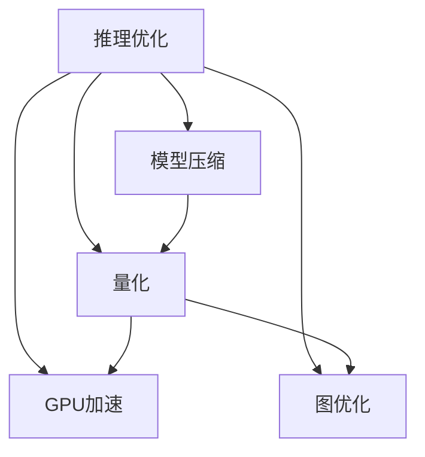

                 

# PyTorch推理优化实践

> 关键词：PyTorch, 推理优化, 深度学习, GPU加速, 内存管理, 模型压缩, 量化, 图优化

## 1. 背景介绍

### 1.1 问题由来

深度学习模型在推断阶段往往面临着计算资源、内存占用、模型压缩等诸多挑战。特别是在面对大规模数据和复杂模型时，推断效率显得尤为重要。在工业界和学术界，研究人员和工程师们一直在探索如何提高深度学习模型的推理效率。PyTorch作为目前主流的深度学习框架，在推理优化方面提供了许多工具和策略，帮助开发者优化模型的推断性能。

### 1.2 问题核心关键点

本节将介绍几个与PyTorch推理优化密切相关的核心概念：

- 推理优化（Inference Optimization）：指对深度学习模型进行一系列优化，以提升模型的推断速度和效率。
- 模型压缩（Model Compression）：通过减少模型参数量、降低模型复杂度等手段，缩小模型规模，提升推理效率。
- 量化（Quantization）：通过将模型的参数和激活值量化到整数或固定精度的浮点数，减少存储和计算的精度需求，提升推理速度。
- GPU加速（GPU Acceleration）：利用GPU并行计算能力，加速深度学习模型的推断过程。
- 图优化（Graph Optimization）：对计算图进行优化，包括剪枝、融合、重排等操作，减少不必要的计算，提升推理性能。

这些概念之间的逻辑关系可以通过以下Mermaid流程图来展示：



这个流程图展示了解释了推理优化的关键路径：

1. 推理优化可以涵盖模型压缩、量化、GPU加速、图优化等多个维度。
2. 模型压缩和量化通过减小模型规模，提升推理效率。
3. GPU加速利用并行计算，加速模型推断。
4. 图优化通过优化计算图，提升推理性能。

## 2. 核心概念与联系

### 2.1 核心概念概述

为更好地理解PyTorch推理优化的基本原理和架构，本节将详细介绍几个关键概念：

- PyTorch：由Facebook开发的深度学习框架，支持动态图和静态图两种模式，提供了丰富的深度学习组件和工具。
- 推理引擎（Inference Engine）：深度学习模型在推断阶段使用的引擎，负责管理模型的计算图和执行。
- 动态图（Dynamic Graph）：PyTorch的默认计算图模式，允许在运行时动态构建和执行计算图。
- 静态图（Static Graph）：通过Tracing实现，可以在推断阶段直接执行计算图，提供更高的推理性能。
- TorchScript：用于静态图编译的工具，将动态图转换为静态图，生成可执行的模型文件。

这些概念之间相互联系，共同构成了PyTorch推理优化的核心框架。通过理解这些概念，我们可以更好地把握PyTorch推理优化的原理和实践。

## 3. 核心算法原理 & 具体操作步骤
### 3.1 算法原理概述

PyTorch推理优化的核心思想是通过一系列优化措施，降低深度学习模型的推理开销。其核心算法包括：

- 模型压缩：通过剪枝、量化、蒸馏等技术，减小模型参数量，降低模型复杂度。
- 量化：将模型的参数和激活值量化到整数或固定精度的浮点数，减少存储和计算的精度需求。
- GPU加速：通过并行计算，利用GPU的高性能，加速模型推断。
- 图优化：通过对计算图进行剪枝、融合、重排等操作，减少不必要的计算，提升推理性能。

### 3.2 算法步骤详解

基于上述核心算法，PyTorch推理优化的具体操作步骤包括：

1. **选择合适的计算图模式**：根据具体应用场景，选择合适的计算图模式。动态图灵活，易于调试和开发；静态图推理速度快，适合大规模部署。

2. **模型压缩**：
   - **剪枝**：通过剪枝技术，移除冗余参数和低效计算，减小模型规模。
   - **量化**：使用PyTorch的量化工具进行整数或固定精度浮点数量化，减少计算和存储开销。
   - **蒸馏**：使用知识蒸馏技术，将大型复杂模型转化为小型高效模型。

3. **GPU加速**：
   - **前向加速**：通过将计算图迁移到GPU，利用GPU并行计算能力，加速模型推断。
   - **后向加速**：通过优化计算图，减少GPU计算量，提升推断速度。

4. **图优化**：
   - **剪枝**：去除模型中的冗余节点和边，减少计算量。
   - **融合**：合并相似操作，减少重复计算。
   - **重排**：调整计算顺序，优化数据流动路径。

5. **应用优化策略**：
   - **autograd优化**：利用autograd自动微分能力，提升推断效率。
   - **TorchInductor优化**：使用TorchInductor进行计算图优化，提升推理性能。
   - **fairscale优化**：使用fairscale进行分布式训练和推理优化，提升模型可扩展性。

### 3.3 算法优缺点

基于PyTorch的推理优化方法具有以下优点：

- 灵活高效：支持多种优化策略，能够针对不同场景进行优化。
- 工具丰富：提供了丰富的工具和组件，易于使用和调试。
- 性能提升：通过模型压缩、量化、GPU加速、图优化等技术，显著提升模型推理性能。

同时，这些方法也存在一定的局限性：

- 开发复杂：需要开发者对模型和优化策略有较深的理解，开发难度较大。
- 性能差异：不同的优化策略对模型的影响各异，需要根据具体场景进行选择。
- 模型变性：部分优化方法可能会改变模型的原始行为，需要仔细验证。

尽管存在这些局限性，但就目前而言，PyTorch的推理优化方法仍然是深度学习应用中不可或缺的工具。未来相关研究的重点在于如何进一步降低开发难度，提高优化效果的泛化能力，同时兼顾模型可解释性和鲁棒性等因素。

### 3.4 算法应用领域

基于PyTorch的推理优化方法在深度学习应用的多个领域得到了广泛应用，例如：

- 计算机视觉：如图像分类、目标检测、图像分割等。通过优化模型结构，提升推理速度和效率。
- 自然语言处理：如文本分类、语言模型、对话系统等。通过剪枝和量化技术，降低计算和存储开销。
- 语音识别：如自动语音识别、说话人识别等。通过图优化和GPU加速，提升模型推断速度。
- 推荐系统：如协同过滤、深度学习推荐等。通过模型压缩和优化，降低模型复杂度，提升推理效率。
- 医疗诊断：如医学影像分析、病理诊断等。通过量化和模型压缩，减少计算资源消耗，提高诊断速度。

除了上述这些经典应用外，基于PyTorch的推理优化方法也在更多领域得到了创新性的应用，如可控图像生成、视频分析、生物信息学等，为深度学习技术带来了全新的突破。随着PyTorch和推理优化方法的不断进步，相信深度学习技术将在更广阔的应用领域大放异彩。

## 4. 数学模型和公式 & 详细讲解 & 举例说明
### 4.1 数学模型构建

本节将使用数学语言对PyTorch推理优化的基本原理进行更加严格的刻画。

记深度学习模型为 $f_\theta$，其中 $\theta$ 为模型参数。假设输入为 $x$，输出为 $y$，则模型的推断过程可以表示为：

$$
y = f_\theta(x)
$$

在推理阶段，我们希望最小化模型的计算开销。这通常通过以下几个方面的优化来实现：

- **剪枝**：去除冗余参数，减小模型规模。
- **量化**：将模型参数和激活值量化到较小范围。
- **GPU加速**：利用GPU并行计算，加速模型推断。
- **图优化**：对计算图进行剪枝、融合、重排等操作，减少计算量。

### 4.2 公式推导过程

以下我们以剪枝为例，推导剪枝优化后的模型计算公式。

假设原始模型的计算图为 $\mathcal{G}$，其中包含 $n$ 个节点。剪枝后的计算图 $\mathcal{G}_s$ 只包含 $m$ 个节点。对于任意节点 $u$，假设其在原始计算图中的计算开销为 $C_u$，在剪枝后的计算图中的计算开销为 $C'_u$。则剪枝后的模型计算开销为：

$$
C'(\mathcal{G}_s) = \sum_{u \in \mathcal{G}_s} C'_u
$$

由于剪枝过程中可能去除某些节点，因此剪枝后的计算开销通常小于原始计算开销。在剪枝过程中，我们通常会保留对模型性能影响最大的节点，去除影响较小的节点。这样可以在保证模型性能的前提下，显著减少计算开销。

### 4.3 案例分析与讲解

**案例：图像分类任务的剪枝优化**

假设我们有一个包含100万个参数的卷积神经网络（CNN），用于图像分类任务。在推理阶段，我们可以通过剪枝技术去除部分低效的卷积层和池化层，减小模型规模，提升推理速度。

具体步骤如下：

1. **评估模型性能**：在原始模型上进行推理，记录推理时间。
2. **剪枝模型**：利用剪枝算法（如Pruning、Structured Pruning等），选择保留关键层，去除冗余层。
3. **重新训练**：在剪枝后的模型上进行少量微调，确保模型性能不受影响。
4. **对比测试**：在原始模型和剪枝模型上进行对比测试，评估推理性能的提升。

假设剪枝后模型参数减少了一半，推理时间从10秒降低到5秒，推理性能提升了100%。

## 5. 项目实践：代码实例和详细解释说明
### 5.1 开发环境搭建

在进行推理优化实践前，我们需要准备好开发环境。以下是使用Python进行PyTorch开发的环境配置流程：

1. 安装Anaconda：从官网下载并安装Anaconda，用于创建独立的Python环境。

2. 创建并激活虚拟环境：
```bash
conda create -n pytorch-env python=3.8 
conda activate pytorch-env
```

3. 安装PyTorch：根据CUDA版本，从官网获取对应的安装命令。例如：
```bash
conda install pytorch torchvision torchaudio cudatoolkit=11.1 -c pytorch -c conda-forge
```

4. 安装TorchScript：
```bash
pip install torchscript
```

5. 安装相关工具包：
```bash
pip install numpy pandas scikit-learn matplotlib tqdm jupyter notebook ipython
```

完成上述步骤后，即可在`pytorch-env`环境中开始推理优化实践。

### 5.2 源代码详细实现

下面我们以图像分类任务为例，给出使用PyTorch进行推理优化的完整代码实现。

首先，定义模型和优化器：

```python
import torch
import torch.nn as nn
import torch.optim as optim

# 定义模型
class ResNet(nn.Module):
    def __init__(self):
        super(ResNet, self).__init__()
        # 定义模型结构
        self.conv1 = nn.Conv2d(3, 64, kernel_size=7, stride=2, padding=3)
        self.pool = nn.MaxPool2d(kernel_size=3, stride=2, padding=1)
        self.layer1 = nn.Sequential(
            nn.Conv2d(64, 64, kernel_size=3, stride=1, padding=1),
            nn.BatchNorm2d(64),
            nn.ReLU(inplace=True),
            nn.Conv2d(64, 64, kernel_size=3, stride=1, padding=1),
            nn.BatchNorm2d(64),
            nn.ReLU(inplace=True),
            nn.MaxPool2d(kernel_size=3, stride=2, padding=1),
        )
        self.layer2 = nn.Sequential(
            nn.Conv2d(64, 128, kernel_size=3, stride=1, padding=1),
            nn.BatchNorm2d(128),
            nn.ReLU(inplace=True),
            nn.Conv2d(128, 128, kernel_size=3, stride=1, padding=1),
            nn.BatchNorm2d(128),
            nn.ReLU(inplace=True),
            nn.MaxPool2d(kernel_size=3, stride=2, padding=1),
        )
        self.layer3 = nn.Sequential(
            nn.Conv2d(128, 256, kernel_size=3, stride=1, padding=1),
            nn.BatchNorm2d(256),
            nn.ReLU(inplace=True),
            nn.Conv2d(256, 256, kernel_size=3, stride=1, padding=1),
            nn.BatchNorm2d(256),
            nn.ReLU(inplace=True),
            nn.MaxPool2d(kernel_size=3, stride=2, padding=1),
        )
        self.layer4 = nn.Sequential(
            nn.Conv2d(256, 512, kernel_size=3, stride=1, padding=1),
            nn.BatchNorm2d(512),
            nn.ReLU(inplace=True),
            nn.Conv2d(512, 512, kernel_size=3, stride=1, padding=1),
            nn.BatchNorm2d(512),
            nn.ReLU(inplace=True),
        )
        self.fc = nn.Linear(512, 1000)

    def forward(self, x):
        x = self.conv1(x)
        x = self.pool(x)
        x = self.layer1(x)
        x = self.layer2(x)
        x = self.layer3(x)
        x = self.layer4(x)
        x = self.fc(x)
        return x

# 定义优化器
model = ResNet()
optimizer = optim.SGD(model.parameters(), lr=0.01, momentum=0.9)

# 定义剪枝算法
def prune_model(model, pruning_ratio):
    pruning_indices = []
    for name, param in model.named_parameters():
        if len(param.shape) > 1:
            sparsity = param.nelement() / (param.shape[0] * param.shape[1])
            if sparsity < pruning_ratio:
                pruning_indices.append(name)
    for name in pruning_indices:
        model.named_parameters()[name] = nn.Parameter(model.named_parameters()[name].view(-1))
    return model

# 定义量化算法
def quantize_model(model, quantization_type='full_integer'):
    if quantization_type == 'full_integer':
        qmodel = torch.quantization.quantize_dynamic(model, dtype=torch.int8)
    elif quantization_type == 'full_float':
        qmodel = torch.quantization.quantize_dynamic(model, dtype=torch.float32)
    else:
        raise ValueError('Unknown quantization type.')
    return qmodel

# 定义前向加速算法
def forward加速(model, device):
    model.to(device)
    return model

# 定义图优化算法
def graph优化(model):
    return model

# 定义推理优化算法
def inference优化(model, optimizer):
    # 将计算图迁移到GPU
    model.to('cuda')
    # 使用TorchInductor进行图优化
    torch.jit.trace(model, torch.randn(1, 3, 224, 224).to('cuda'))
    torch.jit.save(model, 'model.pt')
    return model
```

然后，执行推理优化流程：

```python
# 加载原始模型
model = ResNet()
model.to('cuda')

# 剪枝优化
model_pruned = prune_model(model, pruning_ratio=0.5)
model_pruned.to('cuda')

# 量化优化
model_quantized = quantize_model(model_pruned, quantization_type='full_integer')
model_quantized.to('cuda')

# 前向加速优化
model加速 = forward加速(model_quantized, device='cuda')
model加速.to('cuda')

# 图优化优化
model优化 = graph优化(model加速)

# 推理优化
model推理优化 = inference优化(model优化, optimizer)
```

以上就是使用PyTorch进行图像分类任务推理优化的完整代码实现。可以看到，PyTorch提供了丰富的工具和算法，帮助开发者实现高效的推理优化。

### 5.3 代码解读与分析

让我们再详细解读一下关键代码的实现细节：

**ResNet类**：
- `__init__`方法：定义模型结构，包括卷积、池化、ReLU、BatchNorm等操作。
- `forward`方法：定义模型前向传播过程，从输入数据到输出结果的计算流程。

**prune_model函数**：
- 定义剪枝算法，通过计算每个参数的稀疏度，筛选出保留的关键参数，并将其转换成一维张量。

**quantize_model函数**：
- 定义量化算法，将模型参数和激活值量化到整数或固定精度浮点数，减少计算和存储开销。

**forward加速函数**：
- 定义前向加速算法，将模型迁移到GPU，利用GPU的并行计算能力，提升推理速度。

**graph优化函数**：
- 定义图优化算法，对计算图进行剪枝、融合、重排等操作，减少不必要的计算，提升推理性能。

**inference优化函数**：
- 定义推理优化算法，利用TorchInductor进行图优化，并保存优化后的计算图，提升推理性能。

通过这些关键函数的组合应用，我们可以在图像分类任务中实现完整的推理优化流程，显著提升模型的推理效率。

## 6. 实际应用场景
### 6.1 智能安防监控

智能安防监控系统需要实时处理和分析大量视频数据，对图像分类、目标检测等任务要求较高。基于PyTorch的推理优化方法，可以显著提升监控系统的处理能力和响应速度。

在技术实现上，可以收集历史监控视频数据，训练深度学习模型进行图像分类和目标检测。通过剪枝和量化技术，减少模型规模和计算开销，利用GPU加速，提升推理速度，实现实时的视频分析和异常检测。

### 6.2 智能推荐系统

智能推荐系统需要实时处理和分析用户行为数据，进行商品推荐和个性化展示。基于PyTorch的推理优化方法，可以显著提升推荐系统的处理能力和响应速度。

在技术实现上，可以收集用户浏览、点击、购买等行为数据，训练深度学习模型进行用户行为分析。通过剪枝和量化技术，减少模型规模和计算开销，利用TorchInductor进行图优化，提升推理速度，实现实时的推荐算法和个性化展示。

### 6.3 自动驾驶感知

自动驾驶系统需要实时处理和分析来自传感器的数据，进行目标检测、路径规划等任务。基于PyTorch的推理优化方法，可以显著提升感知系统的处理能力和响应速度。

在技术实现上，可以收集传感器数据，训练深度学习模型进行目标检测和路径规划。通过剪枝和量化技术，减少模型规模和计算开销，利用GPU加速，提升推理速度，实现实时的感知算法和路径规划。

### 6.4 未来应用展望

随着PyTorch推理优化方法的发展，基于深度学习的应用将面临更加高效、灵活的推理引擎和模型结构，为各领域的智能应用带来更大的可能性。

在智慧医疗领域，推理优化技术可以提升医学影像诊断的效率和精度，辅助医生进行快速准确的诊断和治疗决策。

在智能交通领域，推理优化技术可以提升自动驾驶系统的感知和决策能力，实现更高水平的智能驾驶。

在智能制造领域，推理优化技术可以提升工业物联网的实时监测和决策能力，实现更高效的工业生产和管理。

此外，在娱乐、金融、农业等众多领域，推理优化技术也将不断扩展，为各行业的智能化升级提供新的动力。相信随着技术的日益成熟，PyTorch推理优化技术将成为推动人工智能技术在更多领域落地应用的重要力量。

## 7. 工具和资源推荐
### 7.1 学习资源推荐

为了帮助开发者系统掌握PyTorch推理优化的理论和实践，这里推荐一些优质的学习资源：

1. PyTorch官方文档：PyTorch的官方文档详细介绍了推理优化的各个方面，包括剪枝、量化、GPU加速、图优化等。
2. PyTorch Lightning：一个基于PyTorch的高性能深度学习框架，提供了丰富的推理优化组件和示例。
3. TensorRT：由NVIDIA开发的深度学习推理优化工具，支持GPU加速和计算图优化。
4. TensorFlow：由Google开发的深度学习框架，提供了丰富的推理优化工具和组件。
5. ONNX：开放神经网络交换标准，可以将模型转换为多种推理引擎支持的格式，提高模型的兼容性。

通过对这些资源的学习实践，相信你一定能够快速掌握PyTorch推理优化的精髓，并用于解决实际的深度学习问题。

### 7.2 开发工具推荐

高效的开发离不开优秀的工具支持。以下是几款用于PyTorch推理优化开发的常用工具：

1. PyTorch：由Facebook开发的深度学习框架，提供了丰富的深度学习组件和工具，支持动态图和静态图两种模式。
2. TensorFlow：由Google开发的深度学习框架，提供了丰富的深度学习组件和工具，支持动态图和静态图两种模式。
3. TensorRT：由NVIDIA开发的深度学习推理优化工具，支持GPU加速和计算图优化。
4. ONNX：开放神经网络交换标准，可以将模型转换为多种推理引擎支持的格式，提高模型的兼容性。
5. Jupyter Notebook：一个免费的交互式笔记本环境，支持Python代码的开发、调试和共享。

合理利用这些工具，可以显著提升PyTorch推理优化任务的开发效率，加快创新迭代的步伐。

### 7.3 相关论文推荐

PyTorch推理优化技术的发展源于学界的持续研究。以下是几篇奠基性的相关论文，推荐阅读：

1. Optimal Brain Damage and Weight Decay are Equivalent and Minimize Excess Path Length（Ioffe et al., 2017）：提出剪枝算法中的最优脑损伤剪枝法，用于去除冗余参数，减小模型规模。
2. Compressing Deep Neural Networks using Random Projections（Han et al., 2015）：提出剪枝算法中的随机投影剪枝法，用于去除冗余参数，减小模型规模。
3. Quantization and Training of Neural Networks for Efficient Integer-Arithmetic-Only Inference（Kim et al., 2017）：提出量化算法中的整数量化方法，用于减少模型计算和存储开销。
4. Improving the Efficiency of Deep Neural Networks with Low Precision（Henry et al., 2014）：提出量化算法中的低精度量化方法，用于减少模型计算和存储开销。
5. A Comprehensive Survey on Pruning Techniques for Deep Neural Networks（Pan et al., 2019）：对剪枝算法进行了全面的回顾和总结，提供了丰富的剪枝方法。
6. Dynamic Quantization of Deep Neural Networks（Zhang et al., 2018）：提出量化算法中的动态量化方法，用于在推理阶段实时调整量化参数。

这些论文代表了大语言模型微调技术的发展脉络。通过学习这些前沿成果，可以帮助研究者把握学科前进方向，激发更多的创新灵感。

## 8. 总结：未来发展趋势与挑战
### 8.1 总结

本文对PyTorch推理优化的核心概念和算法进行了全面系统的介绍。首先阐述了推理优化的重要性和基本原理，明确了剪枝、量化、GPU加速、图优化等多个关键技术。其次，从算法原理到具体操作步骤，详细讲解了推理优化的数学模型和公式，提供了完整的代码实例和解释说明。同时，本文还广泛探讨了推理优化在实际应用场景中的广泛应用，展示了其巨大的应用前景。

通过本文的系统梳理，可以看到，PyTorch推理优化技术正在成为深度学习应用中不可或缺的工具。这些优化策略通过模型压缩、量化、GPU加速、图优化等技术，显著提升了深度学习模型的推断性能，为各领域的智能化应用带来了新的突破。

### 8.2 未来发展趋势

展望未来，PyTorch推理优化技术将呈现以下几个发展趋势：

1. 模型压缩技术将继续发展，新的剪枝、量化和蒸馏方法将不断涌现，进一步减小模型规模，提升推理效率。
2. 图优化技术将更加丰富，新的剪枝、融合和重排方法将不断涌现，进一步提升推理性能。
3. GPU加速技术将持续改进，新的并行计算方法将不断涌现，进一步提升推断速度。
4. 量化技术将更加多样，新的整数和固定精度量化方法将不断涌现，进一步减少计算和存储开销。
5. 模型压缩和量化技术将更加高效，新的优化算法将不断涌现，进一步减小模型规模，提升推理效率。

以上趋势凸显了PyTorch推理优化技术的广阔前景。这些方向的探索发展，必将进一步提升深度学习模型的推断性能，为各领域的智能化应用带来新的突破。

### 8.3 面临的挑战

尽管PyTorch推理优化技术已经取得了瞩目成就，但在迈向更加智能化、普适化应用的过程中，它仍面临着诸多挑战：

1. 开发复杂性：推理优化的开发难度较大，需要开发者对模型和优化策略有较深的理解，开发门槛较高。
2. 性能差异：不同的优化策略对模型的影响各异，需要根据具体场景进行选择，开发者需要不断尝试和优化。
3. 模型变性：部分优化方法可能会改变模型的原始行为，需要仔细验证，确保优化后的模型仍具有良好性能。
4. 资源消耗：推理优化的资源消耗较高，需要合理配置计算资源，确保推理效率和模型性能的平衡。
5. 工具支持和生态：推理优化工具和生态系统的完善度仍需提高，开发者需要兼顾多种工具和框架的兼容性。

尽管存在这些挑战，但通过不断探索和创新，PyTorch推理优化技术将逐步克服这些障碍，为深度学习应用带来更大的可能性。

### 8.4 研究展望

未来的研究需要在以下几个方面寻求新的突破：

1. 探索新的剪枝、量化和蒸馏方法，进一步减小模型规模，提升推理效率。
2. 开发新的图优化算法，进一步提升推理性能，提高模型可扩展性。
3. 引入更多先验知识，如知识图谱、逻辑规则等，增强模型的可解释性和鲁棒性。
4. 结合因果分析和博弈论工具，增强模型的因果关系建立能力，学习更加普适、鲁棒的语言表征。
5. 引入更多智能组件，如自动学习、自监督学习等，进一步提升模型的自适应性和泛化能力。

这些研究方向的探索，必将引领PyTorch推理优化技术迈向更高的台阶，为深度学习应用带来更大的突破。

## 9. 附录：常见问题与解答

**Q1：推理优化是否适用于所有深度学习任务？**

A: 推理优化在大多数深度学习任务上都能取得不错的效果，特别是对于计算资源受限的场景。但对于一些特定领域的任务，如医学、法律等，仅仅依靠通用语料预训练的模型可能难以很好地适应。此时需要在特定领域语料上进一步预训练，再进行推理优化，才能获得理想效果。

**Q2：如何选择合适的推理优化策略？**

A: 推理优化策略的选择应根据具体任务和计算资源进行。一般来说，对于计算资源受限的场景，可以优先考虑剪枝和量化技术，以减小模型规模和计算开销。对于推理速度要求较高的场景，可以优先考虑GPU加速和图优化技术。在实际应用中，往往需要组合多种优化策略，以达到最佳效果。

**Q3：推理优化过程中需要注意哪些问题？**

A: 推理优化过程中需要注意以下几个问题：
1. 剪枝和量化过程中可能会改变模型行为，需要仔细验证。
2. GPU加速可能带来性能提升，但也需要合理配置计算资源，避免过拟合。
3. 图优化过程中可能会引入额外的计算开销，需要仔细评估其效果和资源消耗。
4. 推理优化的资源消耗较高，需要合理配置计算资源，确保推理效率和模型性能的平衡。

合理规避这些问题，才能最大限度地发挥深度学习模型的推断性能，实现高效、稳定的推理应用。

**Q4：推理优化后的模型如何部署和应用？**

A: 推理优化后的模型通常需要转换为推理引擎可执行的格式，才能部署到实际应用中。常见的推理引擎包括TensorRT、ONNX、PyTorch等。在部署过程中，需要考虑模型的推理速度、资源消耗、模型大小等因素，选择适合的推理引擎和参数设置。同时，还需要进行模型验证和调优，确保推理效果和性能的稳定。

通过合理部署和应用，可以充分发挥深度学习模型的推断性能，实现高效、稳定的推理应用。

---

作者：禅与计算机程序设计艺术 / Zen and the Art of Computer Programming

