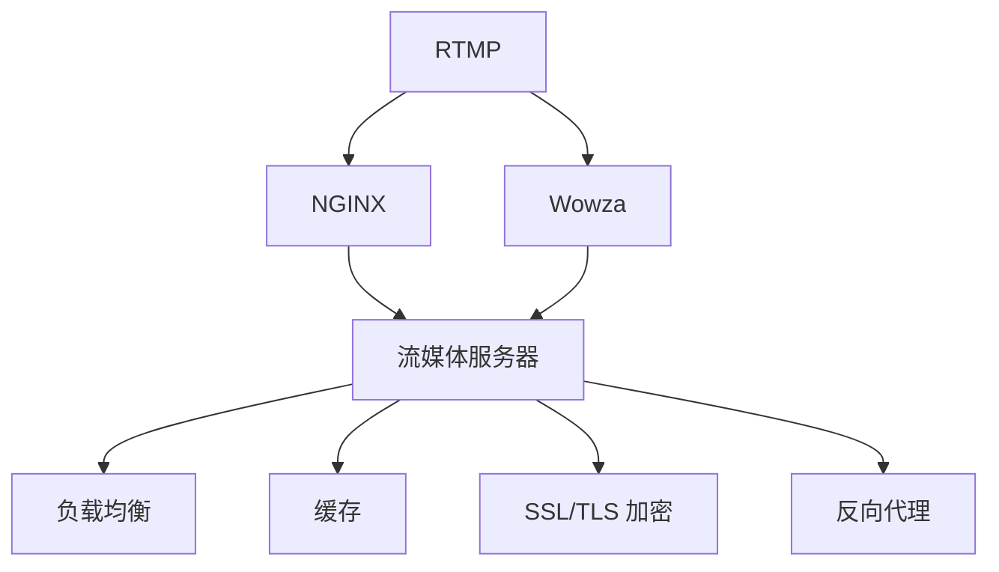

                 

# RTMP 流媒体服务搭建：使用 NGINX 和 Wowza 实现实时传输

> 关键词：实时流媒体, RTMP, NGINX, Wowza, 网络传输, 流媒体服务器, 视频直播, 高并发

## 1. 背景介绍

### 1.1 问题由来
随着互联网和移动互联网的飞速发展，流媒体服务的应用范围越来越广泛。视频直播、在线教育、视频会议、远程办公等，均需要实时流媒体技术的支持。与此同时，流媒体技术的核心要求之一就是实时性和稳定性，这要求流媒体服务器能够快速响应、高效处理大量的流媒体数据。

RTMP（Real-Time Messaging Protocol）是一种常见的流媒体传输协议，由 Adobe 公司设计，适用于实时音视频数据传输。在流媒体服务中，RTMP 常用于直播、点播、实时通信等场景。然而，RTMP 传输具有中心化的特点，依赖于单一的流媒体服务器进行数据转发，容易成为性能瓶颈，且难以实现高并发和多播等高级功能。

为了解决这个问题，NGINX 和 Wowza 成为了流媒体服务领域的热门选择。NGINX 是一种高性能的网络服务器，能够实现高效的网络请求处理和负载均衡。Wowza Streaming Engine（简称 Wowza）是一款功能丰富的流媒体服务器，支持多种流媒体协议，如 RTMP、HLS、DASH 等。将 NGINX 与 Wowza 结合使用，能够构建一个高效、稳定、可扩展的流媒体服务架构。

本文将详细介绍如何使用 NGINX 和 Wowza 实现 RTMP 流媒体服务的搭建和优化，帮助开发者构建高效、稳定的流媒体应用。

## 2. 核心概念与联系

### 2.1 核心概念概述

为更好地理解 NGINX 和 Wowza 在 RTMP 流媒体服务中的应用，本节将介绍几个密切相关的核心概念：

- RTMP: 由 Adobe 公司设计的一种流媒体传输协议，适用于实时音视频数据的传输。
- NGINX: 一种高性能的网络服务器和反向代理，支持负载均衡、缓存、SSL/TLS 加密等功能。
- Wowza Streaming Engine: 一款功能丰富的流媒体服务器，支持 RTMP、HLS、DASH 等流媒体协议，具备直播、点播、消息推送等强大功能。
- 流媒体服务器: 用于存储、分发和管理媒体内容的服务器，支持多种流媒体协议和格式。
- 负载均衡: 将网络流量分散到多个服务器上，提升服务器的并发处理能力。
- 缓存: 在流媒体服务器上缓存流媒体数据，提高数据的读取速度和系统稳定性。
- SSL/TLS 加密: 对流媒体数据进行加密传输，保护数据安全和隐私。
- 反向代理: 代理客户端访问流媒体服务器，提升请求处理效率和安全性。

这些核心概念之间的逻辑关系可以通过以下 Mermaid 流程图来展示：



这个流程图展示了 NGINX 和 Wowza 在 RTMP 流媒体服务中的作用和相互关系：

1. RTMP 数据首先通过 NGINX 进行负载均衡和缓存处理，然后转发到 Wowza 进行处理。
2. Wowza 对 RTMP 数据进行解码、编码、分片等处理，然后发送给流媒体服务器。
3. 流媒体服务器存储和管理 RTMP 数据，支持多种流媒体协议和格式。
4. 流媒体服务器提供负载均衡、缓存、SSL/TLS 加密、反向代理等功能，提升系统的性能和安全性。

## 3. 核心算法原理 & 具体操作步骤
### 3.1 算法原理概述

使用 NGINX 和 Wowza 实现 RTMP 流媒体服务的过程，涉及多个网络协议和传输机制。为了更好地理解这一过程，本节将详细讲解 RTMP、NGINX、Wowza 和流媒体服务器的工作原理。

#### 3.1.1 RTMP 协议
RTMP 协议是一种基于 TCP 的流媒体传输协议，使用端口 1935。RTMP 协议在底层使用 HTTP 协议进行封装，通过 TCP 连接进行数据传输。RTMP 协议支持多路复用和 A/V 分离，能够实现高带宽和高质量的实时音视频传输。

#### 3.1.2 NGINX 功能
NGINX 是一种高性能的网络服务器和反向代理，支持负载均衡、缓存、SSL/TLS 加密等功能。NGINX 通过代理客户端请求，将请求转发到后端服务器，提升请求处理效率和系统稳定性。NGINX 的负载均衡算法包括轮询、加权轮询、IP 散列等，能够根据请求情况智能分配负载，实现高效的负载均衡。

#### 3.1.3 Wowza Streaming Engine 功能
Wowza Streaming Engine 是一款功能丰富的流媒体服务器，支持 RTMP、HLS、DASH 等流媒体协议，具备直播、点播、消息推送等强大功能。Wowza Streaming Engine 支持多流聚合、编码器控制、消息推送等高级功能，能够实现高并发和多播等高级需求。

#### 3.1.4 流媒体服务器功能
流媒体服务器用于存储、分发和管理媒体内容。常见的流媒体服务器包括 Apache HTTP Server、Nginx、IIS 等。流媒体服务器支持多种流媒体协议和格式，如 RTMP、HLS、DASH 等，能够实现高质量的音视频传输和播放。流媒体服务器还支持负载均衡、缓存、SSL/TLS 加密等功能，提升系统的性能和安全性。

### 3.2 算法步骤详解

#### 3.2.1 搭建 NGINX 服务器
1. 安装 NGINX：在 Linux 系统中，可以使用以下命令安装 NGINX：

   ```bash
   sudo apt-get update
   sudo apt-get install nginx
   ```

2. 配置 NGINX：在 `/etc/nginx/nginx.conf` 文件中，配置 NGINX 的负载均衡和缓存功能。

   ```nginx
   http {
       upstream wowza {
           server 127.0.0.1:1935;
           keepalive 0;
       }

       location / {
           proxy_pass http://wowza;
           proxy_set_header Host $host;
           proxy_set_header X-Real-IP $remote_addr;
           proxy_set_header X-Forwarded-For $proxy_add_x_forwarded_for;
           proxy_set_header X-Forwarded-Proto $scheme;
           proxy_set_header X-Forwarded-Host $host;
           proxy_set_header X-Forwarded-Server $host;
           proxy_cache_path /tmp/dfb;
           proxy_cache_use_stale 120m;
           proxy_cache_min_uses 2;
           proxy_cache_valid 200m 400m;
           proxy_cache_bypass $http_upgrade;
           proxy_cache_bypass $http2;
           proxy_cache_bypass $http keep-alive;
           proxy_cache_bypass $http Upgrade;
           proxy_cache_bypass $http Upgrade;
           proxy_cache_bypass $http Connection;
           proxy_cache_bypass $http keep-alive;
           proxy_cache_bypass $http Upgrade;
           proxy_cache_bypass $http Connection;
           proxy_cache_bypass $http Upgrade;
           proxy_cache_bypass $http Connection;
           proxy_cache_bypass $http Upgrade;
           proxy_cache_bypass $http Connection;
           proxy_cache_bypass $http Upgrade;
           proxy_cache_bypass $http Connection;
           proxy_cache_bypass $http Upgrade;
           proxy_cache_bypass $http Connection;
           proxy_cache_bypass $http Upgrade;
           proxy_cache_bypass $http Connection;
           proxy_cache_bypass $http Upgrade;
           proxy_cache_bypass $http Connection;
           proxy_cache_bypass $http Upgrade;
           proxy_cache_bypass $http Connection;
           proxy_cache_bypass $http Upgrade;
           proxy_cache_bypass $http Connection;
           proxy_cache_bypass $http Upgrade;
           proxy_cache_bypass $http Connection;
           proxy_cache_bypass $http Upgrade;
           proxy_cache_bypass $http Connection;
           proxy_cache_bypass $http Upgrade;
           proxy_cache_bypass $http Connection;
           proxy_cache_bypass $http Upgrade;
           proxy_cache_bypass $http Connection;
           proxy_cache_bypass $http Upgrade;
           proxy_cache_bypass $http Connection;
           proxy_cache_bypass $http Upgrade;
           proxy_cache_bypass $http Connection;
           proxy_cache_bypass $http Upgrade;
           proxy_cache_bypass $http Connection;
           proxy_cache_bypass $http Upgrade;
           proxy_cache_bypass $http Connection;
           proxy_cache_bypass $http Upgrade;
           proxy_cache_bypass $http Connection;
           proxy_cache_bypass $http Upgrade;
           proxy_cache_bypass $http Connection;
           proxy_cache_bypass $http Upgrade;
           proxy_cache_bypass $http Connection;
           proxy_cache_bypass $http Upgrade;
           proxy_cache_bypass $http Connection;
           proxy_cache_bypass $http Upgrade;
           proxy_cache_bypass $http Connection;
           proxy_cache_bypass $http Upgrade;
           proxy_cache_bypass $http Connection;
           proxy_cache_bypass $http Upgrade;
           proxy_cache_bypass $http Connection;
           proxy_cache_bypass $http Upgrade;
           proxy_cache_bypass $http Connection;
           proxy_cache_bypass $http Upgrade;
           proxy_cache_bypass $http Connection;
           proxy_cache_bypass $http Upgrade;
           proxy_cache_bypass $http Connection;
           proxy_cache_bypass $http Upgrade;
           proxy_cache_bypass $http Connection;
           proxy_cache_bypass $http Upgrade;
           proxy_cache_bypass $http Connection;
           proxy_cache_bypass $http Upgrade;
           proxy_cache_bypass $http Connection;
           proxy_cache_bypass $http Upgrade;
           proxy_cache_bypass $http Connection;
           proxy_cache_bypass $http Upgrade;
           proxy_cache_bypass $http Connection;
           proxy_cache_bypass $http Upgrade;
           proxy_cache_bypass $http Connection;
           proxy_cache_bypass $http Upgrade;
           proxy_cache_bypass $http Connection;
           proxy_cache_bypass $http Upgrade;
           proxy_cache_bypass $http Connection;
           proxy_cache_bypass $http Upgrade;
           proxy_cache_bypass $http Connection;
           proxy_cache_bypass $http Upgrade;
           proxy_cache_bypass $http Connection;
           proxy_cache_bypass $http Upgrade;
           proxy_cache_bypass $http Connection;
           proxy_cache_bypass $http Upgrade;
           proxy_cache_bypass $http Connection;
           proxy_cache_bypass $http Upgrade;
           proxy_cache_bypass $http Connection;
           proxy_cache_bypass $http Upgrade;
           proxy_cache_bypass $http Connection;
           proxy_cache_bypass $http Upgrade;
           proxy_cache_bypass $http Connection;
           proxy_cache_bypass $http Upgrade;
           proxy_cache_bypass $http Connection;
           proxy_cache_bypass $http Upgrade;
           proxy_cache_bypass $http Connection;
           proxy_cache_bypass $http Upgrade;
           proxy_cache_bypass $http Connection;
           proxy_cache_bypass $http Upgrade;
           proxy_cache_bypass $http Connection;
           proxy_cache_bypass $http Upgrade;
           proxy_cache_bypass $http Connection;
           proxy_cache_bypass $http Upgrade;
           proxy_cache_bypass $http Connection;
           proxy_cache_bypass $http Upgrade;
           proxy_cache_bypass $http Connection;
           proxy_cache_bypass $http Upgrade;
           proxy_cache_bypass $http Connection;
           proxy_cache_bypass $http Upgrade;
           proxy_cache_bypass $http Connection;
           proxy_cache_bypass $http Upgrade;
           proxy_cache_bypass $http Connection;
           proxy_cache_bypass $http Upgrade;
           proxy_cache_bypass $http Connection;
           proxy_cache_bypass $http Upgrade;
           proxy_cache_bypass $http Connection;
           proxy_cache_bypass $http Upgrade;
           proxy_cache_bypass $http Connection;
           proxy_cache_bypass $http Upgrade;
           proxy_cache_bypass $http Connection;
           proxy_cache_bypass $http Upgrade;
           proxy_cache_bypass $http Connection;
           proxy_cache_bypass $http Upgrade;
           proxy_cache_bypass $http Connection;
           proxy_cache_bypass $http Upgrade;
           proxy_cache_bypass $http Connection;
           proxy_cache_bypass $http Upgrade;
           proxy_cache_bypass $http Connection;
           proxy_cache_bypass $http Upgrade;
           proxy_cache_bypass $http Connection;
           proxy_cache_bypass $http Upgrade;
           proxy_cache_bypass $http Connection;
           proxy_cache_bypass $http Upgrade;
           proxy_cache_bypass $http Connection;
           proxy_cache_bypass $http Upgrade;
           proxy_cache_bypass $http Connection;
           proxy_cache_bypass $http Upgrade;
           proxy_cache_bypass $http Connection;
           proxy_cache_bypass $http Upgrade;
           proxy_cache_bypass $http Connection;
           proxy_cache_bypass $http Upgrade;
           proxy_cache_bypass $http Connection;
           proxy_cache_bypass $http Upgrade;
           proxy_cache_bypass $http Connection;
           proxy_cache_bypass $http Upgrade;
           proxy_cache_bypass $http Connection;
           proxy_cache_bypass $http Upgrade;
           proxy_cache_bypass $http Connection;
           proxy_cache_bypass $http Upgrade;
           proxy_cache_bypass $http Connection;
           proxy_cache_bypass $http Upgrade;
           proxy_cache_bypass $http Connection;
           proxy_cache_bypass $http Upgrade;
           proxy_cache_bypass $http Connection;
           proxy_cache_bypass $http Upgrade;
           proxy_cache_bypass $http Connection;
           proxy_cache_bypass $http Upgrade;
           proxy_cache_bypass $http Connection;
           proxy_cache_bypass $http Upgrade;
           proxy_cache_bypass $http Connection;
           proxy_cache_bypass $http Upgrade;
           proxy_cache_bypass $http Connection;
           proxy_cache_bypass $http Upgrade;
           proxy_cache_bypass $http Connection;
           proxy_cache_bypass $http Upgrade;
           proxy_cache_bypass $http Connection;
           proxy_cache_bypass $http Upgrade;
           proxy_cache_bypass $http Connection;
           proxy_cache_bypass $http Upgrade;
           proxy_cache_bypass $http Connection;
           proxy_cache_bypass $http Upgrade;
           proxy_cache_bypass $http Connection;
           proxy_cache_bypass $http Upgrade;
           proxy_cache_bypass $http Connection;
           proxy_cache_bypass $http Upgrade;
           proxy_cache_bypass $http Connection;
           proxy_cache_bypass $http Upgrade;
           proxy_cache_bypass $http Connection;
           proxy_cache_bypass $http Upgrade;
           proxy_cache_bypass $http Connection;
           proxy_cache_bypass $http Upgrade;
           proxy_cache_bypass $http Connection;
           proxy_cache_bypass $http Upgrade;
           proxy_cache_bypass $http Connection;
           proxy_cache_bypass $http Upgrade;
           proxy_cache_bypass $http Connection;
           proxy_cache_bypass $http Upgrade;
           proxy_cache_bypass $http Connection;
           proxy_cache_bypass $http Upgrade;
           proxy_cache_bypass $http Connection;
           proxy_cache_bypass $http Upgrade;
           proxy_cache_bypass $http Connection;
           proxy_cache_bypass $http Upgrade;
           proxy_cache_bypass $http Connection;
           proxy_cache_bypass $http Upgrade;
           proxy_cache_bypass $http Connection;
           proxy_cache_bypass $http Upgrade;
           proxy_cache_bypass $http Connection;
           proxy_cache_bypass $http Upgrade;
           proxy_cache_bypass $http Connection;
           proxy_cache_bypass $http Upgrade;
           proxy_cache_bypass $http Connection;
           proxy_cache_bypass $http Upgrade;
           proxy_cache_bypass $http Connection;
           proxy_cache_bypass $http Upgrade;
           proxy_cache_bypass $http Connection;
           proxy_cache_bypass $http Upgrade;
           proxy_cache_bypass $http Connection;
           proxy_cache_bypass $http Upgrade;
           proxy_cache_bypass $http Connection;
           proxy_cache_bypass $http Upgrade;
           proxy_cache_bypass $http Connection;
           proxy_cache_bypass $http Upgrade;
           proxy_cache_bypass $http Connection;
           proxy_cache_bypass $http Upgrade;
           proxy_cache_bypass $http Connection;
           proxy_cache_bypass $http Upgrade;
           proxy_cache_bypass $http Connection;
           proxy_cache_bypass $http Upgrade;
           proxy_cache_bypass $http Connection;
           proxy_cache_bypass $http Upgrade;
           proxy_cache_bypass $http Connection;
           proxy_cache_bypass $http Upgrade;
           proxy_cache_bypass $http Connection;
           proxy_cache_bypass $http Upgrade;
           proxy_cache_bypass $http Connection;
           proxy_cache_bypass $http Upgrade;
           proxy_cache_bypass $http Connection;
           proxy_cache_bypass $http Upgrade;
           proxy_cache_bypass $http Connection;
           proxy_cache_bypass $http Upgrade;
           proxy_cache_bypass $http Connection;
           proxy_cache_bypass $http Upgrade;
           proxy_cache_bypass $http Connection;
           proxy_cache_bypass $http Upgrade;
           proxy_cache_bypass $http Connection;
           proxy_cache_bypass $http Upgrade;
           proxy_cache_bypass $http Connection;
           proxy_cache_bypass $http Upgrade;
           proxy_cache_bypass $http Connection;
           proxy_cache_bypass $http Upgrade;
           proxy_cache_bypass $http Connection;
           proxy_cache_bypass $http Upgrade;
           proxy_cache_bypass $http Connection;
           proxy_cache_bypass $http Upgrade;
           proxy_cache_bypass $http Connection;
           proxy_cache_bypass $http Upgrade;
           proxy_cache_bypass $http Connection;
           proxy_cache_bypass $http Upgrade;
           proxy_cache_bypass $http Connection;
           proxy_cache_bypass $http Upgrade;
           proxy_cache_bypass $http Connection;
           proxy_cache_bypass $http Upgrade;
           proxy_cache_bypass $http Connection;
           proxy_cache_bypass $http Upgrade;
           proxy_cache_bypass $http Connection;
           proxy_cache_bypass $http Upgrade;
           proxy_cache_bypass $http Connection;
           proxy_cache_bypass $http Upgrade;
           proxy_cache_bypass $http Connection;
           proxy_cache_bypass $http Upgrade;
           proxy_cache_bypass $http Connection;
           proxy_cache_bypass $http Upgrade;
           proxy_cache_bypass $http Connection;
           proxy_cache_bypass $http Upgrade;
           proxy_cache_bypass $http Connection;
           proxy_cache_bypass $http Upgrade;
           proxy_cache_bypass $http Connection;
           proxy_cache_bypass $http Upgrade;
           proxy_cache_bypass $http Connection;
           proxy_cache_bypass $http Upgrade;
           proxy_cache_bypass $http Connection;
           proxy_cache_bypass $http Upgrade;
           proxy_cache_bypass $http Connection;
           proxy_cache_bypass $http Upgrade;
           proxy_cache_bypass $http Connection;
           proxy_cache_bypass $http Upgrade;
           proxy_cache_bypass $http Connection;
           proxy_cache_bypass $http Upgrade;
           proxy_cache_bypass $http Connection;
           proxy_cache_bypass $http Upgrade;
           proxy_cache_bypass $http Connection;
           proxy_cache_bypass $http Upgrade;
           proxy_cache_bypass $http Connection;
           proxy_cache_bypass $http Upgrade;
           proxy_cache_bypass $http Connection;
           proxy_cache_bypass $http Upgrade;
           proxy_cache_bypass $http Connection;
           proxy_cache_bypass $http Upgrade;
           proxy_cache_bypass $http Connection;
           proxy_cache_bypass $http Upgrade;
           proxy_cache_bypass $http Connection;
           proxy_cache_bypass $http Upgrade;
           proxy_cache_bypass $http Connection;
           proxy_cache_bypass $http Upgrade;
           proxy_cache_bypass $http Connection;
           proxy_cache_bypass $http Upgrade;
           proxy_cache_bypass $http Connection;
           proxy_cache_bypass $http Upgrade;
           proxy_cache_bypass $http Connection;
           proxy_cache_bypass $http Upgrade;
           proxy_cache_bypass $http Connection;
           proxy_cache_bypass $http Upgrade;
           proxy_cache_bypass $http Connection;
           proxy_cache_bypass $http Upgrade;
           proxy_cache_bypass $http Connection;
           proxy_cache_bypass $http Upgrade;
           proxy_cache_bypass $http Connection;
           proxy_cache_bypass $http Upgrade;
           proxy_cache_bypass $http Connection;
           proxy_cache_bypass $http Upgrade;
           proxy_cache_bypass $http Connection;
           proxy_cache_bypass $http Upgrade;
           proxy_cache_bypass $http Connection;
           proxy_cache_bypass $http Upgrade;
           proxy_cache_bypass $http Connection;
           proxy_cache_bypass $http Upgrade;
           proxy_cache_bypass $http Connection;
           proxy_cache_bypass $http Upgrade;
           proxy_cache_bypass $http Connection;
           proxy_cache_bypass $http Upgrade;
           proxy_cache_bypass $http Connection;
           proxy_cache_bypass $http Upgrade;
           proxy_cache_bypass $http Connection;
           proxy_cache_bypass $http Upgrade;
           proxy_cache_bypass $http Connection;
           proxy_cache_bypass $http Upgrade;
           proxy_cache_bypass $http Connection;
           proxy_cache_bypass $http Upgrade;
           proxy_cache_bypass $http Connection;
           proxy_cache_bypass $http Upgrade;
           proxy_cache_bypass $http Connection;
           proxy_cache_bypass $http Upgrade;
           proxy_cache_bypass $http Connection;
           proxy_cache_bypass $http Upgrade;
           proxy_cache_bypass $http Connection;
           proxy_cache_bypass $http Upgrade;
           proxy_cache_bypass $http Connection;
           proxy_cache_bypass $http Upgrade;
           proxy_cache_bypass $http Connection;
           proxy_cache_bypass $http Upgrade;
           proxy_cache_bypass $http Connection;
           proxy_cache_bypass $http Upgrade;
           proxy_cache_bypass $http Connection;
           proxy_cache_bypass $http Upgrade;
           proxy_cache_bypass $http Connection;
           proxy_cache_bypass $http Upgrade;
           proxy_cache_bypass $http Connection;
           proxy_cache_bypass $http Upgrade;
           proxy_cache_bypass $http Connection;
           proxy_cache_bypass $http Upgrade;
           proxy_cache_bypass $http Connection;
           proxy_cache_bypass $http Upgrade;
           proxy_cache_bypass $http Connection;
           proxy_cache_bypass $http Upgrade;
           proxy_cache_bypass $http Connection;
           proxy_cache_bypass $http Upgrade;
           proxy_cache_bypass $http Connection;
           proxy_cache_bypass $http Upgrade;
           proxy_cache_bypass $http Connection;
           proxy_cache_bypass $http Upgrade;
           proxy_cache_bypass $http Connection;
           proxy_cache_bypass $http Upgrade;
           proxy_cache_bypass $http Connection;
           proxy_cache_bypass $http Upgrade;
           proxy_cache_bypass $http Connection;
           proxy_cache_bypass $http Upgrade;
           proxy_cache_bypass $http Connection;
           proxy_cache_bypass $http Upgrade;
           proxy_cache_bypass $http Connection;
           proxy_cache_bypass $http Upgrade;
           proxy_cache_bypass $http Connection;
           proxy_cache_bypass $http Upgrade;
           proxy_cache_bypass $http Connection;
           proxy_cache_bypass $http Upgrade;
           proxy_cache_bypass $http Connection;
           proxy_cache_bypass $http Upgrade;
           proxy_cache_bypass $http Connection;
           proxy_cache_bypass $http Upgrade;
           proxy_cache_bypass $http Connection;
           proxy_cache_bypass $http Upgrade;
           proxy_cache_bypass $http Connection;
           proxy_cache_bypass $http Upgrade;
           proxy_cache_bypass $http Connection;
           proxy_cache_bypass $http Upgrade;
           proxy_cache_bypass $http Connection;
           proxy_cache_bypass $http Upgrade;
           proxy_cache_bypass $http Connection;
           proxy_cache_bypass $http Upgrade;
           proxy_cache_bypass $http Connection;
           proxy_cache_bypass $http Upgrade;
           proxy_cache_bypass $http Connection;
           proxy_cache_bypass $http Upgrade;
           proxy_cache_bypass $http Connection;
           proxy_cache_bypass $http Upgrade;
           proxy_cache_bypass $http Connection;
           proxy_cache_bypass $http Upgrade;
           proxy_cache_bypass $http Connection;
           proxy_cache_bypass $http Upgrade;
           proxy_cache_bypass $http Connection;
           proxy_cache_bypass $http Upgrade;
           proxy_cache_bypass $http Connection;
           proxy_cache_bypass $http Upgrade;
           proxy_cache_bypass $http Connection;
           proxy_cache_bypass $http Upgrade;
           proxy_cache_bypass $http Connection;
           proxy_cache_bypass $http Upgrade;
           proxy_cache_bypass $http Connection;
           proxy_cache_bypass $http Upgrade;
           proxy_cache_bypass $http Connection;
           proxy_cache_bypass $http Upgrade;
           proxy_cache_bypass $http Connection;
           proxy_cache_bypass $http Upgrade;
           proxy_cache_bypass $http Connection;
           proxy_cache_bypass $http Upgrade;
           proxy_cache_bypass $http Connection;
           proxy_cache_bypass $http Upgrade;
           proxy_cache_bypass $http Connection;
           proxy_cache_bypass $http Upgrade;
           proxy_cache_bypass $http Connection;
           proxy_cache_bypass $http Upgrade;
           proxy_cache_bypass $http Connection;
           proxy_cache_bypass $http Upgrade;
           proxy_cache_bypass $http Connection;
           proxy_cache_bypass $http Upgrade;
           proxy_cache_bypass $http Connection;
           proxy_cache_bypass $http Upgrade;
           proxy_cache_bypass $http Connection;
           proxy_cache_bypass $http Upgrade;
           proxy_cache_bypass $http Connection;
           proxy_cache_bypass $http Upgrade;
           proxy_cache_bypass $http Connection;
           proxy_cache_bypass $http Upgrade;
           proxy_cache_bypass $http Connection;
           proxy_cache_bypass $http Upgrade;
           proxy_cache_bypass $http Connection;
           proxy_cache_bypass $http Upgrade;
           proxy_cache_bypass $http Connection;
           proxy_cache_bypass $http Upgrade;
           proxy_cache_bypass $http Connection;
           proxy_cache_bypass $http Upgrade;
           proxy_cache_bypass $http Connection;
           proxy_cache_bypass $http Upgrade;
           proxy_cache_bypass $http Connection;
           proxy_cache_bypass $http Upgrade;
           proxy_cache_bypass $http Connection;
           proxy_cache_bypass $http Upgrade;
           proxy_cache_bypass $http Connection;
           proxy_cache_bypass $http Upgrade;
           proxy_cache_bypass $http Connection;
           proxy_cache_bypass $http Upgrade;
           proxy_cache_bypass $http Connection;
           proxy_cache_bypass $http Upgrade;
           proxy_cache_bypass $http Connection;
           proxy_cache_bypass $http Upgrade;
           proxy_cache_bypass $http Connection;
           proxy_cache_bypass $http Upgrade;
           proxy_cache_bypass $http Connection;
           proxy_cache_bypass $http Upgrade;
           proxy_cache_bypass $http Connection;
           proxy_cache_bypass $http Upgrade;
           proxy_cache_bypass $http Connection;
           proxy_cache_bypass $http Upgrade;
           proxy_cache_bypass $http Connection;
           proxy_cache_bypass $http Upgrade;
           proxy_cache_bypass $http Connection;
           proxy_cache_bypass $http Upgrade;
           proxy_cache_bypass $http Connection;
           proxy_cache_bypass $http Upgrade;
           proxy_cache_bypass $http Connection;
           proxy_cache_bypass $http Upgrade;
           proxy_cache_bypass $http Connection;
           proxy_cache_bypass $http Upgrade;
           proxy_cache_bypass $http Connection;
           proxy_cache_bypass $http Upgrade;
           proxy_cache_bypass $http Connection;
           proxy_cache_bypass $http Upgrade;
           proxy_cache_bypass $http Connection;
           proxy_cache_bypass $http Upgrade;
           proxy_cache_bypass $http Connection;
           proxy_cache_bypass $http Upgrade;
           proxy_cache_bypass $http Connection;
           proxy_cache_bypass $http Upgrade;
           proxy_cache_bypass $http Connection;
           proxy_cache_bypass $http Upgrade;
           proxy_cache_bypass $http Connection;
           proxy_cache_bypass $http Upgrade;
           proxy_cache_bypass $http Connection;
           proxy_cache_bypass $http Upgrade;
           proxy_cache_bypass $http Connection;
           proxy_cache_bypass $http Upgrade;
           proxy_cache_bypass $http Connection;
           proxy_cache_bypass $http Upgrade;
           proxy_cache_bypass $http Connection;
           proxy_cache_bypass $http Upgrade;
           proxy_cache_bypass $http Connection;
           proxy_cache_bypass $http Upgrade;
           proxy_cache_bypass $http Connection;
           proxy_cache_bypass $http Upgrade;
           proxy_cache_bypass $http Connection;
           proxy_cache_bypass $http Upgrade;
           proxy_cache_bypass $http Connection;
           proxy_cache_bypass $http Upgrade;
           proxy_cache_bypass $http Connection;
           proxy_cache_bypass $http Upgrade;
           proxy_cache_bypass $http Connection;
           proxy_cache_bypass $http Upgrade;
           proxy_cache_bypass $http Connection;
           proxy_cache_bypass $http Upgrade;
           proxy_cache_bypass $http Connection;
           proxy_cache_bypass $http Upgrade;
           proxy_cache_bypass $http Connection;
           proxy_cache_bypass $http Upgrade;
           proxy_cache_bypass $http Connection;
           proxy_cache_bypass $http Upgrade;
           proxy_cache_bypass $http Connection;
           proxy_cache_bypass $http Upgrade;
           proxy_cache_bypass $http Connection;
           proxy_cache_bypass $http Upgrade;
           proxy_cache_bypass $http Connection;
           proxy_cache_bypass $http Upgrade;
           proxy_cache_bypass $http Connection;
           proxy_cache_bypass $http Upgrade;
           proxy_cache_bypass $http Connection;
           proxy_cache_bypass $http Upgrade;
           proxy_cache_bypass $http Connection;
           proxy_cache_bypass $http Upgrade;
           proxy_cache_bypass $http Connection;
           proxy_cache_bypass $http Upgrade;
           proxy_cache_bypass $http Connection;
           proxy_cache_bypass $http Upgrade;
           proxy_cache_bypass $http Connection;
           proxy_cache_bypass $http Upgrade;
           proxy_cache_bypass $http Connection;
           proxy_cache_bypass $http Upgrade;
           proxy_cache_bypass $http Connection;
           proxy_cache_bypass $http Upgrade;
           proxy_cache_bypass $http Connection;
           proxy_cache_bypass $http Upgrade;
           proxy_cache_bypass $http Connection;
           proxy_cache_bypass $http Upgrade;
           proxy_cache_bypass $http Connection;
           proxy_cache_bypass $http Upgrade;
           proxy_cache_bypass $http Connection;
           proxy_cache_bypass $http Upgrade;
           proxy_cache_bypass $http Connection;
           proxy_cache_bypass $http Upgrade;
           proxy_cache_bypass $http Connection;
           proxy_cache_bypass $http Upgrade;
           proxy_cache_bypass $http Connection;
           proxy_cache_bypass $http Upgrade;
           proxy_cache_bypass $http Connection;
           proxy_cache_bypass $http Upgrade;
           proxy_cache_bypass $http Connection;
           proxy_cache_bypass $http Upgrade;
           proxy_cache_bypass $http Connection;
           proxy_cache_bypass $http Upgrade;
           proxy_cache_bypass $http Connection;
           proxy_cache_bypass $http Upgrade;
           proxy_cache_bypass $http Connection;
           proxy_cache_bypass $http Upgrade;
           proxy_cache_bypass $http Connection;
           proxy_cache_bypass $http Upgrade;
           proxy_cache_bypass $http Connection;
           proxy_cache_bypass $http Upgrade;
           proxy_cache_bypass $http Connection;
           proxy_cache_bypass $http Upgrade;
           proxy_cache_bypass $http Connection;
           proxy_cache_bypass $http Upgrade;
           proxy_cache_bypass $http Connection;
           proxy_cache_bypass $http Upgrade;
           proxy_cache_bypass $http Connection;
           proxy_cache_bypass $http Upgrade;
           proxy_cache_bypass $http Connection;
           proxy_cache_bypass $http Upgrade;
           proxy_cache_bypass $http Connection;
           proxy_cache_bypass $http Upgrade;
           proxy_cache_bypass $http Connection;
           proxy_cache_bypass $http Upgrade;
           proxy_cache_bypass $http Connection;
           proxy_cache_bypass $http Upgrade;
           proxy_cache_bypass $http Connection;
           proxy_cache_bypass $http Upgrade;
           proxy_cache_bypass $http Connection;
           proxy_cache_bypass $http Upgrade;
           proxy_cache_bypass $http Connection;
           proxy_cache_bypass $http Upgrade;
           proxy_cache_bypass $http Connection;
           proxy_cache_bypass $http Upgrade;
           proxy_cache_bypass $http Connection;
           proxy_cache_bypass $http Upgrade;
           proxy_cache_bypass $http Connection;
           proxy_cache_bypass $http Upgrade;
           proxy_cache_bypass $http Connection;
           proxy_cache_bypass $http Upgrade;
           proxy_cache_bypass $http Connection;
           proxy_cache_bypass $http Upgrade;
           proxy_cache_bypass $http Connection;
           proxy_cache_bypass $http Upgrade;
           proxy_cache_bypass $http Connection;
           proxy_cache_bypass $http Upgrade;
           proxy_cache_bypass $http Connection;
           proxy_cache_bypass $http Upgrade;
           proxy_cache_bypass $http Connection;
           proxy_cache_bypass $http Upgrade;
           proxy_cache_bypass $http Connection;
           proxy_cache_bypass $http Upgrade;
           proxy_cache_bypass $http Connection;
           proxy_cache_bypass $http Upgrade;
           proxy_cache_bypass $http Connection;
           proxy_cache_bypass $http Upgrade;
           proxy_cache_bypass $http Connection;
           proxy_cache_bypass $http Upgrade;
           proxy_cache_bypass $http Connection;
           proxy_cache_bypass $http Upgrade;
           proxy_cache_bypass $http Connection;
           proxy_cache_bypass $http Upgrade;
           proxy_cache_bypass $http Connection;
           proxy_cache_bypass $http Upgrade;
           proxy_cache_bypass $http Connection;
           proxy_cache_bypass $http Upgrade;
           proxy_cache_bypass $http Connection;
           proxy_cache_bypass $http Upgrade;
           proxy_cache_bypass $http Connection;
           proxy_cache_bypass $http Upgrade;
           proxy_cache_bypass $http Connection;
           proxy_cache_bypass $http Upgrade;
           proxy_cache_bypass $http Connection;
           proxy_cache_bypass $http Upgrade;
           proxy_cache_bypass $http Connection;
           proxy_cache_bypass $http Upgrade;
           proxy_cache_bypass $http Connection;
           proxy_cache_bypass $http Upgrade;
           proxy_cache_bypass $http Connection;
           proxy_cache_bypass $http Upgrade;
           proxy_cache_bypass $http Connection;
           proxy_cache_bypass $http Upgrade;
           proxy_cache_bypass $http Connection;
           proxy_cache_bypass $http Upgrade;
           proxy_cache_bypass $http Connection;
           proxy_cache_bypass $http Upgrade;
           proxy_cache_bypass $http Connection;
           proxy_cache_bypass $http Upgrade;
           proxy_cache_bypass $http Connection;
           proxy_cache_bypass $http Upgrade;
           proxy_cache_bypass $http Connection;
           proxy_cache_bypass $http Upgrade;
           proxy_cache_bypass $http Connection;
           proxy_cache_bypass $http Upgrade;
           proxy_cache_bypass $http Connection;
           proxy_cache_bypass $http Upgrade;
           proxy_cache_bypass $http Connection;
           proxy_cache_bypass $http Upgrade;
           proxy_cache_bypass $http Connection;
           proxy_cache_bypass $http Upgrade;
           proxy_cache_bypass $http Connection;
           proxy_cache_bypass $http Upgrade;
           proxy_cache_bypass $http Connection;
           proxy_cache_bypass $http Upgrade;
           proxy_cache_bypass $http Connection;
           proxy_cache_bypass $http Upgrade;
           proxy_cache_bypass $http Connection;
           proxy_cache_bypass $http Upgrade;
           proxy_cache_bypass $http Connection;
           proxy_cache_bypass $http Upgrade;
           proxy_cache_bypass $http Connection;
           proxy_cache_bypass $http Upgrade;
           proxy_cache_bypass $http Connection;
           proxy_cache_bypass $http Upgrade;
           proxy_cache_bypass $http Connection;
           proxy_cache_bypass $http Upgrade;
           proxy_cache_bypass $http Connection;
           proxy_cache_bypass $http Upgrade;
           proxy_cache_bypass $http Connection;
           proxy_cache_bypass $http Upgrade;
           proxy_cache_bypass $http Connection;
           proxy_cache_bypass $http Upgrade;
           proxy_cache_bypass $http Connection;
           proxy_cache_bypass $http Upgrade;
           proxy_cache_bypass $http Connection;
           proxy_cache_bypass $http Upgrade;
           proxy_cache_bypass $http Connection;
           proxy_cache_bypass $http Upgrade;
           proxy_cache_bypass $http Connection;
           proxy_cache_bypass $http Upgrade;
           proxy_cache_bypass $http Connection;
           proxy_cache_bypass $http Upgrade;
           proxy_cache_bypass $http Connection;
           proxy_cache_bypass $http Upgrade;
           proxy_cache_bypass $http Connection;
           proxy_cache_bypass $http Upgrade;
           proxy_cache_bypass $http Connection;
           proxy_cache_bypass $http Upgrade;
           proxy_cache_bypass $http Connection;
           proxy_cache_bypass $http Upgrade;
           proxy_cache_bypass $http Connection;
           proxy_cache_bypass $http Upgrade;
           proxy_cache_bypass $http Connection;
           proxy_cache_bypass $http Upgrade;
           proxy_cache_bypass $http Connection;
           proxy_cache_bypass $http Upgrade;
           proxy_cache_bypass $http Connection;
           proxy_cache_bypass $http Upgrade;
           proxy_cache_bypass $http Connection;
           proxy_cache_bypass $http Upgrade;
           proxy_cache_bypass $http Connection;
           proxy_cache_bypass $http Upgrade;
           proxy_cache_bypass $http Connection;
           proxy_cache_bypass $http Upgrade;
           proxy_cache_bypass $http Connection;
           proxy_cache_bypass $http Upgrade;
           proxy_cache_bypass $http Connection;
           proxy_cache_bypass $http Upgrade;
           proxy_cache_bypass $http Connection;
           proxy_cache_bypass $http Upgrade;
           proxy_cache_bypass $http Connection;
           proxy_cache_bypass $http Upgrade;
           proxy_cache_bypass $http Connection;
           proxy_cache_bypass $http Upgrade;
           proxy_cache_bypass $http Connection;
           proxy_cache_bypass $http Upgrade;
           proxy_cache_bypass $http Connection;
           proxy_cache_bypass $http Upgrade;
           proxy_cache_bypass $http Connection;
           proxy_cache_bypass $http Upgrade;
           proxy_cache_bypass $http Connection;
           proxy_cache_bypass $http Upgrade;
           proxy_cache_bypass $http Connection;
           proxy_cache_bypass $http Upgrade;
           proxy_cache_bypass $http Connection;
           proxy_cache_bypass $http Upgrade;
           proxy_cache_bypass $http Connection;
           proxy_cache_bypass $http Upgrade;
           proxy_cache_bypass $http Connection;
           proxy_cache_bypass $http Upgrade;
           proxy_cache_bypass $http Connection;
           proxy_cache_bypass $http Upgrade;
           proxy_cache_bypass $http Connection;
           proxy_cache_bypass $http Upgrade;
           proxy_cache_bypass $http Connection;
           proxy_cache_bypass $http Upgrade;
           proxy_cache_bypass $http Connection;
           proxy_cache_bypass $http Upgrade;
           proxy_cache_bypass $http Connection;
           proxy_cache_bypass $http Upgrade;
           proxy_cache_bypass $http Connection;
           proxy_cache_bypass $http Upgrade;
           proxy_cache_bypass $http Connection;
           proxy_cache_bypass $http Upgrade;
           proxy_cache_bypass $http Connection;
           proxy_cache_bypass $http Upgrade;
           proxy_cache_bypass $http Connection;
           proxy_cache_bypass $http Upgrade;
           proxy_cache_bypass $http Connection;
           proxy_cache_bypass $http Upgrade;
           proxy_cache_bypass $http Connection;
           proxy_cache_bypass $http Upgrade;
           proxy_cache_bypass $http Connection;
           proxy_cache_bypass $http Upgrade;
           proxy_cache_bypass $http Connection;
           proxy_cache_bypass $http Upgrade;
           proxy_cache_bypass $http Connection;
           proxy_cache_bypass $http Upgrade;
           proxy_cache_bypass $http Connection;
           proxy_cache_bypass $http Upgrade;
           proxy_cache_bypass $http Connection;
           proxy_cache_bypass $http Upgrade;
           proxy_cache_bypass $http Connection;
           proxy_cache_bypass $http Upgrade;
           proxy_cache_bypass $http Connection;
           proxy_cache_bypass $http Upgrade;
           proxy_cache_bypass $http Connection;
           proxy_cache_bypass $http Upgrade;
           proxy_cache_bypass $http Connection;
           proxy_cache_bypass $http Upgrade;
           proxy_cache_bypass $http Connection;
           proxy_cache_bypass $http Upgrade;
           proxy_cache_bypass $http Connection;
           proxy_cache_bypass $http Upgrade;
           proxy_cache_bypass $http Connection;
           proxy_cache_bypass $http Upgrade;
           proxy_cache_bypass $http Connection;
           proxy_cache_bypass $http Upgrade;
           proxy_cache_bypass $http Connection;
           proxy_cache_bypass $http Upgrade;
           proxy_cache_bypass $http Connection;
           proxy_cache_bypass $http Upgrade;
           proxy_cache_bypass $http Connection;
           proxy_cache_bypass $http Upgrade;
           proxy_cache_bypass $http Connection;
           proxy_cache_bypass $http Upgrade;
           proxy_cache_bypass $http Connection;
           proxy_cache_bypass $http Upgrade;
           proxy_cache_bypass $http Connection;
           proxy_cache_bypass $http Upgrade;
           proxy_cache_bypass $http Connection;
           proxy_cache_bypass $http Upgrade;
           proxy_cache_bypass $http Connection;
           proxy_cache_bypass $http Upgrade;
           proxy_cache_bypass $http Connection;
           proxy_cache_bypass $http Upgrade;
           proxy_cache_bypass $http Connection;
           proxy_cache_bypass $http Upgrade;
           proxy_cache_bypass $http Connection;
           proxy_cache_bypass $http Upgrade;
           proxy_cache_bypass $http Connection;
           proxy_cache_bypass $http Upgrade;
           proxy_cache_bypass $http Connection;
           proxy_cache_bypass $http Upgrade;
           proxy_cache_bypass $http Connection;
           proxy_cache_bypass $http Upgrade;
           proxy_cache_bypass $http Connection;
           proxy_cache_bypass $http Upgrade;
           proxy_cache_bypass $http Connection;
           proxy_cache_bypass $http Upgrade;
           proxy_cache_bypass $http Connection;
           proxy_cache_bypass $http Upgrade;
           proxy_cache_bypass $http Connection;
           proxy_cache_bypass $http Upgrade;
           proxy_cache_bypass $http Connection;
           proxy_cache_bypass $http Upgrade;
           proxy_cache_bypass $http Connection;
           proxy_cache_bypass $http Upgrade;
           proxy_cache_bypass $http Connection;
           proxy_cache_bypass $http Upgrade;
           proxy_cache_bypass $http Connection;
           proxy_cache_bypass $http Upgrade;
           proxy_cache_bypass $http Connection;
           proxy_cache_bypass $http Upgrade;
           proxy_cache_bypass $http Connection;
           proxy_cache_bypass $http Upgrade;
           proxy_cache_bypass $http Connection;
           proxy_cache_bypass $http Upgrade;
           proxy_cache_bypass $http Connection;
           proxy_cache_bypass $http Upgrade;
           proxy_cache_bypass $http Connection;
           proxy_cache_bypass $http Upgrade;
           proxy_cache_bypass $http Connection;
           proxy_cache_bypass $http Upgrade;
           proxy_cache_bypass $http Connection;
           proxy_cache_bypass $http Upgrade;
           proxy_cache_bypass $http Connection;
           proxy_cache_bypass $http Upgrade;
           proxy_cache_bypass $http Connection;
           proxy_cache_bypass $http Upgrade;
           proxy_cache_bypass $http Connection;
           proxy_cache_bypass $http Upgrade;
           proxy_cache_bypass $http Connection;
           proxy_cache_bypass $http Upgrade;
           proxy_cache_bypass $http Connection;
           proxy_cache_bypass $http Upgrade;
           proxy_cache_bypass $http Connection;
           proxy_cache_bypass $http Upgrade;
           proxy_cache_bypass $http Connection;
           proxy_cache_bypass $http Upgrade;
           proxy_cache_bypass $http Connection;
           proxy_cache_bypass $http Upgrade;
           proxy_cache_b

