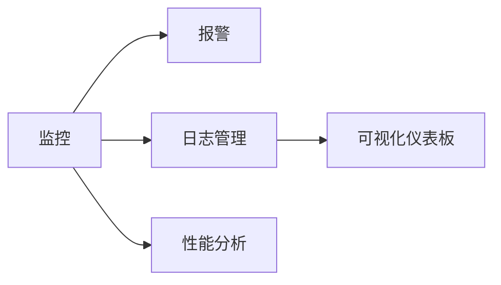

                 

# SRE可观测性最佳实践

> 关键词：可观测性, 监控, 报警, 日志管理, 基础设施, 用户体验

## 1. 背景介绍

### 1.1 问题由来
在当今快速发展的数字化时代，系统的复杂性和多样性不断增加，确保系统的稳定性和可靠性成为SRE（Site Reliability Engineering）团队面临的重大挑战。传统的手动监控和故障排查方法已无法满足需求，急需引入更高效、更自动化的手段。可观测性（Observability）作为现代SRE实践的核心，通过系统全面地监控、分析和诊断，使得问题更容易被及时发现和解决，从而提升系统整体可用性和用户体验。

### 1.2 问题核心关键点
SRE可观测性的关键点包括但不限于：

- **全面监控**：对系统各个层面（包括硬件、软件、网络、应用等）进行全面监控，确保能及时捕捉异常。
- **自动化报警**：通过预设告警规则，自动触发告警，减少人工干预。
- **日志管理**：系统日志是诊断问题的重要依据，需有效收集、存储和管理日志。
- **可视化仪表板**：通过可视化的仪表板，实时展示系统关键指标，提供直观的监控视角。
- **性能分析**：通过深入分析性能数据，定位系统瓶颈，提升系统性能。

### 1.3 问题研究意义
掌握SRE可观测性最佳实践，对于提升系统可用性、减少故障影响、提升用户体验具有重要意义：

- 实时监控与告警可帮助快速发现并解决问题，减少故障带来的损失。
- 详尽的日志管理有助于全面分析问题根源，提高故障排查效率。
- 可视化的仪表板能提供直观的监控视角，帮助SRE团队快速把握系统状况。
- 性能分析可帮助识别系统瓶颈，优化资源配置，提升系统性能。

## 2. 核心概念与联系

### 2.1 核心概念概述

SRE可观测性涉及多个关键概念，它们相互关联，共同构成了一个完整的监控系统。以下是这些概念的概述：

- **监控(Monitoring)**：持续收集系统运行状态数据，包括性能指标、日志、事件等。
- **报警(Alerting)**：基于监控数据触发告警，及时通知相关人员。
- **日志管理(Log Management)**：收集、存储和管理系统日志，以便于故障排查和性能分析。
- **可视化仪表板(Dashboard)**：将监控数据通过图表、仪表盘等形式展示，提供直观的监控视角。
- **性能分析(Performance Analysis)**：通过深入分析性能数据，定位系统瓶颈，提升系统性能。

这些概念通过一系列工具和技术手段，形成了一个闭环的监控系统，帮助SRE团队实时监控、及时告警、深入分析，从而提升系统的可靠性和性能。

### 2.2 核心概念原理和架构的 Mermaid 流程图



这个流程图展示了SRE可观测性各个概念之间的联系。监控数据作为源头，通过报警机制实时通知相关人员，日志管理存储并处理监控数据，可视化仪表板展示监控数据，性能分析深入挖掘性能瓶颈。

## 3. 核心算法原理 & 具体操作步骤
### 3.1 算法原理概述

SRE可观测性的核心原理是全面、实时地收集系统数据，并通过各种算法和技术手段，对这些数据进行处理和分析，最终形成对系统状态的可观测视图。具体来说，包括以下几个关键步骤：

1. **数据收集**：从系统的各个层面（如硬件、网络、应用等）收集性能指标、日志、事件等数据。
2. **数据处理**：对收集到的数据进行清洗、聚合、标准化等处理，以便于后续分析。
3. **告警触发**：基于处理后的数据，通过预设规则触发告警，及时通知相关人员。
4. **日志管理**：存储、管理和分析系统日志，以便于故障排查和性能分析。
5. **可视化展示**：将处理后的数据通过图表、仪表盘等形式展示，提供直观的监控视角。
6. **性能分析**：通过深入分析性能数据，定位系统瓶颈，提升系统性能。

### 3.2 算法步骤详解

#### 3.2.1 数据收集

数据收集是SRE可观测性的第一步，通常通过以下几种方式实现：

- **性能指标收集**：使用如Prometheus、Grafana等工具，从系统各个层面（如服务器、数据库、应用等）收集性能指标。
- **日志收集**：使用如ELK Stack、Splunk等工具，收集系统日志。
- **事件收集**：使用如Graylog、Logstash等工具，收集系统事件。

#### 3.2.2 数据处理

数据处理是对收集到的原始数据进行清洗、聚合、标准化等操作，以便于后续分析。具体步骤如下：

- **数据清洗**：去除噪音数据、重复数据等，确保数据质量。
- **数据聚合**：对数据进行聚合，如按时间聚合、按服务聚合等，以便于后续分析。
- **数据标准化**：对数据进行标准化，如统一时间戳格式、统一度量单位等。

#### 3.2.3 告警触发

告警触发是通过预设规则，基于处理后的数据触发告警，及时通知相关人员。告警触发步骤包括：

- **告警规则定义**：根据业务需求和系统状况，定义告警规则。
- **告警通知**：告警触发后，通过如Slack、微信等渠道，及时通知相关人员。

#### 3.2.4 日志管理

日志管理是对系统日志进行收集、存储、管理和分析的过程，通常包括以下几个步骤：

- **日志收集**：使用日志代理，如ELK Stack、Splunk等工具，收集系统日志。
- **日志存储**：将日志存储在如Elasticsearch、Kafka等日志存储系统中。
- **日志分析**：使用日志分析工具，如Kibana、Grafana等，对日志进行分析。

#### 3.2.5 可视化展示

可视化展示是将处理后的数据通过图表、仪表盘等形式展示，提供直观的监控视角。具体步骤如下：

- **数据展示**：使用如Grafana、Kibana等工具，将处理后的数据通过图表、仪表盘等形式展示。
- **仪表板设计**：设计直观、易于理解的仪表板，展示关键指标。

#### 3.2.6 性能分析

性能分析是通过深入分析性能数据，定位系统瓶颈，提升系统性能。具体步骤如下：

- **性能监控**：使用性能监控工具，如Grafana、New Relic等，监控系统性能。
- **瓶颈定位**：通过性能监控工具，定位系统瓶颈，如CPU、内存、网络等。
- **性能优化**：根据瓶颈定位结果，优化系统资源配置，提升系统性能。

### 3.3 算法优缺点

SRE可观测性算法具有以下优点：

- **全面监控**：覆盖系统各个层面，确保能及时捕捉异常。
- **自动化报警**：减少人工干预，提高故障响应速度。
- **深入分析**：通过日志管理、性能分析，全面分析问题根源。
- **直观展示**：通过可视化仪表板，提供直观的监控视角。

但同时，SRE可观测性算法也存在一些缺点：

- **数据量巨大**：收集、处理、存储大量数据，对系统资源消耗较大。
- **告警噪音**：告警规则设定不当，可能引发过多的告警噪音。
- **复杂度较高**：系统设计和管理复杂，需要高度的专业知识。
- **数据质量问题**：数据收集、处理过程中可能存在噪音、异常等，影响分析结果。

### 3.4 算法应用领域

SRE可观测性算法广泛应用于各种系统，尤其是高可用性、高可靠性要求的应用场景。具体应用领域包括但不限于：

- **云服务**：云平台如AWS、Google Cloud、Azure等，需要全面监控服务性能，及时发现和解决故障。
- **金融服务**：金融系统如股票交易、银行系统等，需要实时监控交易状态，保障业务连续性。
- **互联网服务**：如社交媒体、在线游戏等，需要全面监控用户体验，提升服务质量。
- **医疗健康**：医疗系统如电子病历、在线咨询等，需要实时监控系统运行状况，保障患者安全。
- **物联网**：物联网设备如智能家居、工业设备等，需要全面监控设备状态，提高设备可靠性。

## 4. 数学模型和公式 & 详细讲解 & 举例说明

### 4.1 数学模型构建

SRE可观测性涉及多个数学模型，包括性能指标模型、告警模型、日志模型等。以性能指标模型为例，其数学模型构建如下：

假设系统性能指标为 $Y(t)$，其中 $t$ 表示时间。设 $X(t)$ 为系统输入，如请求量、用户数等，则系统性能指标可以表示为：

$$
Y(t) = f(X(t),\theta)
$$

其中 $f(\cdot)$ 为系统模型函数，$\theta$ 为模型参数。

### 4.2 公式推导过程

以性能指标模型为例，公式推导如下：

假设系统模型函数 $f(\cdot)$ 为线性函数，则有：

$$
Y(t) = aX(t) + b
$$

其中 $a$ 和 $b$ 为模型参数。根据上述模型，可以得到系统性能指标与输入变量之间的关系。

### 4.3 案例分析与讲解

以监控服务器CPU使用率为例，假设CPU使用率为 $Y(t)$，服务器请求量为 $X(t)$，则系统性能指标可以表示为：

$$
Y(t) = aX(t) + b
$$

其中 $a$ 和 $b$ 为模型参数。通过收集历史数据，使用最小二乘法等方法，可以估计出模型参数 $a$ 和 $b$，从而预测未来CPU使用率，及时触发告警。

## 5. 项目实践：代码实例和详细解释说明

### 5.1 开发环境搭建

在进行SRE可观测性项目实践前，需要准备好开发环境。以下是使用Python进行Prometheus和Grafana开发的流程：

1. **安装Python环境**：使用Anaconda或Miniconda安装Python，确保兼容环境。
2. **安装Prometheus和Grafana**：使用pip或conda安装Prometheus和Grafana。
3. **配置系统环境**：配置Prometheus、Grafana等工具的运行环境，确保其能够正常启动。
4. **安装必要的库**：使用pip或conda安装必要的Python库，如requests、numpy等。

完成上述步骤后，即可在Python环境中进行SRE可观测性项目开发。

### 5.2 源代码详细实现

这里我们以监控服务器CPU使用率为例，给出使用Prometheus和Grafana的Python代码实现。

首先，定义CPU使用率收集函数：

```python
from prometheus_client import Gauge
from prometheus_client.exposition import start_http_server

# 定义CPU使用率指标
cpu_usage = Gauge('server_cpu_usage', 'Server CPU usage')

# 启动HTTP服务
start_http_server(9090)

def get_cpu_usage():
    # 获取服务器CPU使用率
    cpu_percent = psutil.cpu_percent(interval=1)
    cpu_usage.set(cpu_percent)
```

然后，定义告警规则：

```python
from prometheus_client import AlertManager

# 定义告警规则
alertmanager = AlertManager(rule_name='cpu_alert')

def send_alert():
    if cpu_percent > 80:
        alertmanager.send_alert(rule_name='cpu_alert', message='CPU usage is high')
```

最后，在Grafana中创建仪表板：

```python
from grafana import Grafana

# 定义Grafana仪表板
grafana = Grafana(url='http://localhost:3000', api_key='YOUR_API_KEY')

# 创建CPU使用率图表
chart = grafana.create_chart('cpu_usage', 'Server CPU usage', 'CPU usage')

# 创建告警图表
alert_chart = grafana.create_alert_chart('cpu_alert', 'CPU usage is high', 'CPU usage')

# 发布仪表板
grafana.publish_chart(chart)
grafana.publish_alert_chart(alert_chart)
```

以上代码实现了CPU使用率监控、告警和Grafana仪表板的创建。通过Prometheus收集CPU使用率数据，使用Python代码实现告警规则，并通过Grafana仪表板展示监控结果。

### 5.3 代码解读与分析

以下是关键代码的解读与分析：

**Prometheus收集函数**：
- `Gauge`类用于定义监控指标。
- `start_http_server`函数用于启动HTTP服务器，供Prometheus采集数据。
- `psutil.cpu_percent`函数用于获取CPU使用率。

**告警规则函数**：
- `AlertManager`类用于定义告警规则。
- `send_alert`函数用于根据CPU使用率触发告警。

**Grafana仪表板创建**：
- `grafana.create_chart`函数用于创建监控图表。
- `grafana.create_alert_chart`函数用于创建告警图表。
- `grafana.publish_chart`和`grafana.publish_alert_chart`函数用于发布仪表板。

## 6. 实际应用场景

### 6.1 云服务

云服务提供商需要全面监控其服务性能，及时发现和解决故障。通过SRE可观测性技术，云服务提供商可以实时监控服务性能指标，及时触发告警，减少故障影响。例如，AWS的云监控服务CloudWatch就是基于SRE可观测性技术实现的。

### 6.2 金融服务

金融服务需要实时监控交易状态，保障业务连续性。通过SRE可观测性技术，金融机构可以实时监控交易系统的性能指标，及时发现异常，保障交易系统的稳定运行。例如，高盛（Goldman Sachs）通过使用SRE可观测性技术，成功保障了其交易系统的稳定运行。

### 6.3 互联网服务

互联网服务如社交媒体、在线游戏等，需要全面监控用户体验，提升服务质量。通过SRE可观测性技术，互联网服务提供商可以实时监控用户反馈，及时发现和解决用户问题，提升用户体验。例如，Facebook使用SRE可观测性技术，成功优化了其社交平台的性能，提升了用户满意度。

### 6.4 医疗健康

医疗系统如电子病历、在线咨询等，需要实时监控系统运行状况，保障患者安全。通过SRE可观测性技术，医疗机构可以实时监控医疗系统的性能指标，及时发现异常，保障患者安全。例如，Beacon Health使用SRE可观测性技术，成功优化了其电子病历系统的性能，保障了患者数据的安全。

### 6.5 物联网

物联网设备如智能家居、工业设备等，需要全面监控设备状态，提高设备可靠性。通过SRE可观测性技术，物联网设备提供商可以实时监控设备性能指标，及时发现和解决设备问题，提高设备可靠性。例如，西门子（Siemens）使用SRE可观测性技术，成功优化了其智能家居设备的性能，提高了设备可靠性。

## 7. 工具和资源推荐

### 7.1 学习资源推荐

为了帮助开发者系统掌握SRE可观测性的理论基础和实践技巧，以下是一些优质的学习资源：

1. **《Site Reliability Engineering》书籍**：介绍SRE的全面理论知识，涵盖监控、告警、日志管理、性能分析等方面。
2. **《Prometheus User Guide》文档**：详细介绍Prometheus的使用和配置，帮助开发者高效使用Prometheus进行监控。
3. **《Grafana User Guide》文档**：详细介绍Grafana的使用和配置，帮助开发者高效使用Grafana进行监控和告警。
4. **《Kubernetes in Action》书籍**：介绍Kubernetes的使用和实践，帮助开发者高效使用Kubernetes进行系统管理。
5. **《DNS for the Absolute Beginner》书籍**：介绍DNS的基础知识和实践，帮助开发者高效使用DNS进行系统管理。

通过学习这些资源，相信你一定能够快速掌握SRE可观测性的精髓，并用于解决实际的系统问题。

### 7.2 开发工具推荐

高效的开发离不开优秀的工具支持。以下是几款用于SRE可观测性开发的常用工具：

1. **Prometheus**：开源的监控和报警系统，支持各种数据源和告警规则。
2. **Grafana**：开源的仪表板和监控系统，支持与多种数据源集成。
3. **ELK Stack**：包含Elasticsearch、Logstash、Kibana等组件，用于日志管理和分析。
4. **Kubernetes**：开源的容器编排系统，支持自动化的系统管理。
5. **DNS**：用于域名解析和系统管理，支持分布式系统的高可用性设计。

合理利用这些工具，可以显著提升SRE可观测性任务的开发效率，加快创新迭代的步伐。

### 7.3 相关论文推荐

SRE可观测性涉及多个前沿研究方向，以下是几篇奠基性的相关论文，推荐阅读：

1. **《Monitoring and alerting system architecture: toward self-healing IT systems》论文**：提出基于可观测性的系统架构，提升系统自愈能力。
2. **《Event-driven monitoring and alerting》论文**：提出基于事件驱动的监控和告警系统，提高系统监控效率。
3. **《Designing effective alerting systems》论文**：提出有效的告警系统设计方法，减少告警噪音。
4. **《Log monitoring and analysis》论文**：提出有效的日志管理和分析方法，帮助故障排查。
5. **《Real-time performance monitoring for large-scale distributed systems》论文**：提出大规模分布式系统的实时性能监控方法，提升系统性能。

这些论文代表了大语言模型微调技术的发展脉络。通过学习这些前沿成果，可以帮助研究者把握学科前进方向，激发更多的创新灵感。

## 8. 总结：未来发展趋势与挑战

### 8.1 研究成果总结

SRE可观测性技术作为现代SRE实践的核心，通过全面、实时地收集系统数据，并通过各种算法和技术手段，对这些数据进行处理和分析，最终形成对系统状态的可观测视图。该技术已广泛应用于各种系统，尤其是高可用性、高可靠性要求的应用场景。

### 8.2 未来发展趋势

展望未来，SRE可观测性技术将呈现以下几个发展趋势：

1. **自动化程度提升**：自动化告警、自动故障诊断等技术将进一步提升，减少人工干预。
2. **数据融合与分析**：多数据源的融合与分析将提升系统监控的全面性和准确性。
3. **实时性增强**：实时监控和告警技术将进一步优化，提升系统响应速度。
4. **可视化提升**：智能化的仪表板和可视化技术将进一步提升，提供更直观的监控视角。
5. **智能分析**：智能化的性能分析与优化技术将进一步提升，提高系统性能。

### 8.3 面临的挑战

尽管SRE可观测性技术已取得一定进展，但在迈向更加智能化、普适化应用的过程中，仍面临诸多挑战：

1. **数据质量问题**：数据收集、处理过程中可能存在噪音、异常等，影响分析结果。
2. **告警噪音问题**：告警规则设定不当，可能引发过多的告警噪音。
3. **复杂性问题**：系统设计和管理复杂，需要高度的专业知识。
4. **性能瓶颈问题**：大量数据的收集、处理和存储，对系统资源消耗较大。
5. **隐私与安全问题**：系统数据的安全与隐私保护，需高度关注。

### 8.4 研究展望

面对SRE可观测性面临的挑战，未来的研究需要在以下几个方面寻求新的突破：

1. **数据质量提升**：通过数据清洗、异常检测等技术，提升数据质量。
2. **告警规则优化**：通过机器学习等技术，优化告警规则，减少告警噪音。
3. **系统复杂度降低**：通过标准化、自动化等技术，降低系统设计和管理复杂度。
4. **性能瓶颈优化**：通过模型压缩、分布式存储等技术，优化性能瓶颈。
5. **隐私与安全保护**：通过加密、匿名化等技术，保护系统数据隐私和安全。

这些研究方向的探索，将引领SRE可观测性技术迈向更高的台阶，为构建安全、可靠、可解释、可控的智能系统铺平道路。面向未来，SRE可观测性技术还需要与其他人工智能技术进行更深入的融合，如机器学习、深度学习等，多路径协同发力，共同推动系统管理系统的进步。

## 9. 附录：常见问题与解答

**Q1：SRE可观测性是否适用于所有系统？**

A: SRE可观测性适用于大多数系统，尤其是高可用性、高可靠性要求的应用场景。但对于一些特定领域的系统，如医疗、金融等，仍需根据具体情况进行调整。

**Q2：如何优化告警规则？**

A: 优化告警规则的关键在于减少告警噪音和提高告警的准确性。可通过以下方法进行优化：
1. 根据业务需求和系统状况，设定合适的告警阈值。
2. 使用机器学习等技术，预测系统异常，减少误报。
3. 采用事件驱动告警，减少告警数量。
4. 及时更新告警规则，适应系统变化。

**Q3：日志管理有哪些注意事项？**

A: 日志管理需要注意以下几点：
1. 合理分类日志，便于后续分析。
2. 使用日志代理工具，集中管理日志。
3. 定期清洗日志，去除噪音和无用信息。
4. 使用日志分析工具，进行深度分析。

**Q4：如何提升监控系统的实时性？**

A: 提升监控系统的实时性，可通过以下方法实现：
1. 使用高性能数据采集工具，如Prometheus。
2. 优化数据存储和传输，如使用Elasticsearch、Kafka等。
3. 使用分布式系统架构，提升系统扩展性。
4. 优化告警规则，减少告警延迟。

**Q5：如何优化SRE可观测性系统的复杂性？**

A: 优化SRE可观测性系统的复杂性，可通过以下方法实现：
1. 使用标准化、自动化的工具，减少手动配置。
2. 引入DevOps实践，持续集成、持续交付。
3. 使用微服务架构，提升系统可扩展性。
4. 引入机器学习等技术，自动分析系统问题。

这些方法将有助于提升SRE可观测性系统的复杂性，从而提升系统的稳定性和可靠性。

---

作者：禅与计算机程序设计艺术 / Zen and the Art of Computer Programming

