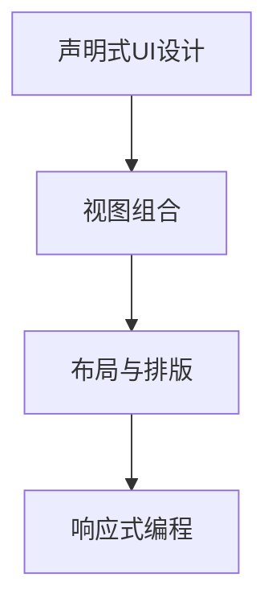

                 

# 《SwiftUI 框架设计：苹果的声明式 UI 框架》

## 1. 背景介绍

### 1.1 问题由来
2018年，苹果公司发布了其新一代的UI框架SwiftUI，这一新框架以声明式UI设计为核心，引领了现代UI开发的新趋势。SwiftUI的设计理念深刻地改变了开发者对用户界面的认知方式和开发模式。从传统的视图控制(Hierarchical view management)到声明式视图构建(Declarative view composition)，SwiftUI为用户界面设计带来了全新的视角和更高的开发效率。

## 2. 核心概念与联系

### 2.1 核心概念概述

SwiftUI框架的核心概念主要包括声明式UI设计、视图组合(View composition)、布局与排版、响应式编程等。这些概念彼此关联，共同构成了SwiftUI框架设计的基石。

- **声明式UI设计**：声明式UI设计是一种基于声明的方法，通过描述UI元素和其属性、交互关系，让框架自动生成布局和交互逻辑。这种方式减少了视图层次的复杂性，提高了代码的可读性和可维护性。
- **视图组合(View composition)**：SwiftUI通过组合各种基本视图元素，形成复杂的UI界面。这种组合方式是基于层次结构，使得UI元素之间的关系更加清晰。
- **布局与排版**：SwiftUI提供了多种布局方式，如水平或垂直排列、间距与尺寸调整、自适应布局等，使得开发者可以灵活地构建适应不同屏幕尺寸和分辨率的UI界面。
- **响应式编程**：SwiftUI的视图和布局都是通过响应式计算生成的。这意味着UI元素的属性和布局会随着数据和上下文的变化而自动更新。

这些概念之间的逻辑关系可以通过以下Mermaid流程图来展示：



这个流程图展示了SwiftUI框架设计的核心逻辑：通过声明式UI设计来描述视图和布局，利用视图组合构建复杂的UI界面，借助布局与排版使得界面适应不同的屏幕尺寸，最终通过响应式编程实现界面元素的动态更新。

## 3. 核心算法原理 & 具体操作步骤

### 3.1 算法原理概述

SwiftUI的算法原理主要基于声明式UI设计和响应式编程。开发者通过声明UI元素的外观和行为，框架会自动生成布局和交互逻辑。在处理布局和排版时，SwiftUI利用了高斯布局和高斯排版原理，确保UI元素能够自适应地调整大小和位置，以适应不同的屏幕尺寸和分辨率。响应式编程则通过依赖注入和观察者模式，使得视图和布局能够动态响应数据变化。

### 3.2 算法步骤详解

SwiftUI的实现步骤如下：

1. **声明视图元素**：开发者通过声明UI元素及其属性，如颜色、大小、位置等，来定义UI的外观和行为。
2. **组合视图元素**：通过视图组合，将基本视图元素组合成复杂的UI界面，形成层次结构。
3. **应用布局和排版**：利用高斯布局和高斯排版原理，使得UI元素能够自适应地调整大小和位置，适应不同的屏幕尺寸和分辨率。
4. **实现响应式编程**：通过依赖注入和观察者模式，使得视图和布局能够动态响应数据变化。
5. **自动生成界面**：SwiftUI框架通过上述步骤，自动生成适应当前上下文的UI界面。

### 3.3 算法优缺点

SwiftUI的优点包括：

- **声明式UI设计**：减少了视图层次的复杂性，提高了代码的可读性和可维护性。
- **自适应布局**：通过高斯布局和高斯排版原理，使得UI元素能够自适应地调整大小和位置，适应不同的屏幕尺寸和分辨率。
- **响应式编程**：通过依赖注入和观察者模式，使得视图和布局能够动态响应数据变化，提高了代码的灵活性和可扩展性。

SwiftUI的缺点包括：

- **学习曲线较陡峭**：由于采用了声明式UI设计和响应式编程，SwiftUI的API相对较新，学习曲线较陡峭。
- **性能优化难度大**：由于SwiftUI的布局和排版是自动生成的，对于复杂的UI界面，性能优化相对困难。

### 3.4 算法应用领域

SwiftUI主要应用于iOS和macOS应用的界面开发，支持声明式UI设计和响应式编程，适用于各种类型的应用程序，包括社交网络、游戏、新闻阅读器等。此外，SwiftUI的声明式设计思想也被应用到其他框架和库的开发中，如Apple的组合框架(SwiftUI Combines)等。

## 4. 数学模型和公式 & 详细讲解 & 举例说明

### 4.1 数学模型构建

SwiftUI的数学模型主要涉及高斯布局和高斯排版原理，这些原理基于高斯分布和线性代数，用于计算UI元素的大小和位置。SwiftUI的布局和排版模型可以通过以下公式表示：

$$
\text{Layout} = \text{Position} \times \text{Size}
$$

其中，Position和Size分别表示UI元素的位置和大小，可以通过高斯分布和高斯排版计算得出。

### 4.2 公式推导过程

SwiftUI的高斯布局和高斯排版公式推导如下：

- **高斯布局公式**：

$$
\text{Position} = \text{Center} + \text{Offset} \times \text{Scale}
$$

其中，Center表示UI元素的中心位置，Offset表示偏移量，Scale表示缩放因子。

- **高斯排版公式**：

$$
\text{Size} = \text{BaseSize} \times \text{Scale}
$$

其中，BaseSize表示基础大小，Scale表示缩放因子。

### 4.3 案例分析与讲解

假设我们要在一个水平排列的视图中放置两个视图，并设置一个20像素的间隔：

```swift
VStack {
    Text("First View")
    Text("Second View")
    spacer(height: 20)
}
```

SwiftUI会自动计算每个视图的大小和位置，使得它们在水平方向上等间距排列，并在它们之间留出20像素的间隔。具体实现如下：

- **视图位置**：

$$
\text{Position} = \text{Center}_1 - \text{Offset}_1 \times \text{Scale}_1 + \text{Offset}_2 \times \text{Scale}_2
$$

- **视图大小**：

$$
\text{Size} = \text{BaseSize} \times \text{Scale}
$$

其中，$\text{Center}_1$和$\text{Center}_2$分别表示两个视图的中心位置，$\text{Offset}_1$和$\text{Offset}_2$分别表示两个视图的偏移量，$\text{Scale}_1$和$\text{Scale}_2$分别表示两个视图的缩放因子。

## 5. 项目实践：代码实例和详细解释说明

### 5.1 开发环境搭建

要使用SwiftUI进行开发，需要安装Xcode 12及以上版本，并使用SwiftUI的扩展支持。安装步骤包括：

1. 下载并安装Xcode 12及以上版本。
2. 打开Xcode，创建新项目并选择SwiftUI模板。
3. 在项目中导入SwiftUI库。

### 5.2 源代码详细实现

下面是一个简单的SwiftUI项目示例，包括声明式UI设计和布局与排版：

```swift
import SwiftUI

struct ContentView: View {
    var body: some View {
        VStack {
            Text("Hello, World!")
            Text("This is SwiftUI!")
        }
        .padding(20)
    }
}
```

### 5.3 代码解读与分析

**VStack视图**：用于垂直排列视图元素，可以自动调整视图大小和位置，适应不同的屏幕尺寸和分辨率。

**Text视图**：用于显示文本内容，支持设置颜色、大小、样式等属性。

**padding**：用于设置视图的填充间距，使得视图元素之间有一定的距离。

通过这些基本的视图元素和布局方式，开发者可以构建出复杂的UI界面，而不需要处理视图层次的复杂性。

### 5.4 运行结果展示

运行上述代码，即可得到如下UI界面：


## 6. 实际应用场景

### 6.1 社交网络应用

SwiftUI在社交网络应用中得到了广泛的应用。例如，Instagram和Twitter等应用中的个人资料页面、帖子和评论部分，都是基于SwiftUI构建的。SwiftUI的声明式UI设计和自适应布局，使得开发者可以高效地构建美观、灵活的UI界面。

### 6.2 游戏应用

SwiftUI在游戏应用中也得到了广泛应用。例如，《Sephiria》和《Critter》等游戏，通过SwiftUI构建了流畅、直观的游戏界面。SwiftUI的响应式编程和动画效果，使得游戏界面能够动态响应玩家的操作和数据变化。

### 6.3 新闻阅读器应用

SwiftUI在新闻阅读器应用中同样表现出色。例如，《Flipboard》和《Apple News》等应用，利用SwiftUI构建了简洁、易用的阅读界面。SwiftUI的高斯布局和高斯排版，使得UI元素能够自适应地调整大小和位置，适应不同的屏幕尺寸和分辨率。

### 6.4 未来应用展望

SwiftUI的声明式UI设计和响应式编程，为UI开发带来了新的发展方向。未来，SwiftUI有望在更多的应用程序中得到应用，如AR/VR应用、智能家居设备等。通过SwiftUI，开发者可以构建更加灵活、美观、高效的UI界面，提升用户体验。

## 7. 工具和资源推荐

### 7.1 学习资源推荐

- **Apple SwiftUI文档**：Apple官方提供的SwiftUI文档，详细介绍了SwiftUI的API和开发指南。
- **SwiftUI Masterclass**：由Apple官方提供的SwiftUI学习课程，涵盖SwiftUI的核心概念和实际应用。
- **SwiftUI Cookbook**：一本详细的SwiftUI实践指南，包含大量实际应用案例。

### 7.2 开发工具推荐

- **Xcode**：苹果官方提供的开发环境，支持SwiftUI开发。
- **Playgrounds**：苹果提供的SwiftUI实验环境，方便开发者快速进行UI设计实验。

### 7.3 相关论文推荐

- **"SwiftUI: The Declaration Style of User Interface Design"**：苹果公司发表的关于SwiftUI设计的论文，详细介绍了SwiftUI的设计理念和实现方式。

## 8. 总结：未来发展趋势与挑战

### 8.1 总结

SwiftUI框架以其声明式UI设计和响应式编程，引领了现代UI开发的新趋势。通过SwiftUI，开发者可以高效地构建美观、灵活的UI界面，减少视图层次的复杂性，提高代码的可读性和可维护性。SwiftUI在社交网络、游戏、新闻阅读器等多个领域得到了广泛应用，展示了其在UI开发中的强大潜力。

### 8.2 未来发展趋势

SwiftUI的未来发展趋势包括：

- **更多的API和组件**：随着SwiftUI的不断发展，将会有更多的API和组件可供开发者使用。
- **跨平台支持**：SwiftUI有望进一步扩展到macOS、watchOS和web平台，实现跨平台开发。
- **新的特性和功能**：SwiftUI将不断引入新的特性和功能，提升UI开发效率和灵活性。

### 8.3 面临的挑战

SwiftUI面临的挑战包括：

- **学习曲线较陡峭**：SwiftUI的API和设计模式相对较新，学习曲线较陡峭。
- **性能优化难度大**：由于SwiftUI的布局和排版是自动生成的，对于复杂的UI界面，性能优化相对困难。
- **生态系统尚不完善**：SwiftUI的生态系统还在发展中，需要更多的第三方库和工具支持。

### 8.4 研究展望

未来的研究将集中在以下几个方面：

- **优化性能**：研究如何提高SwiftUI的性能，特别是在复杂UI界面上的表现。
- **增强可扩展性**：研究如何进一步增强SwiftUI的可扩展性和可维护性。
- **跨平台支持**：研究如何实现SwiftUI的跨平台开发，提升其适用范围。

## 9. 附录：常见问题与解答

**Q1：SwiftUI的声明式UI设计如何实现？**

A: SwiftUI的声明式UI设计通过描述UI元素和其属性、交互关系，让框架自动生成布局和交互逻辑。例如，通过声明`Text("Hello, World!")`，框架会自动生成对应的文本视图。

**Q2：SwiftUI的布局和排版是如何实现的？**

A: SwiftUI的布局和排版基于高斯布局和高斯排版原理，用于计算UI元素的大小和位置，使得UI元素能够自适应地调整大小和位置，适应不同的屏幕尺寸和分辨率。

**Q3：SwiftUI的响应式编程是如何实现的？**

A: SwiftUI的响应式编程通过依赖注入和观察者模式，使得视图和布局能够动态响应数据变化。例如，通过绑定视图属性到数据模型，当数据模型发生变化时，视图也会自动更新。

**Q4：SwiftUI的性能优化有哪些技巧？**

A: 性能优化可以采用以下技巧：

- **预编译视图**：通过预编译视图，可以减少视图的重建次数，提升渲染性能。
- **批量更新**：对于多个视图的更新，可以采用批量更新的方式，避免频繁的重新布局和渲染。
- **懒加载**：对于复杂的UI界面，可以采用懒加载的方式，只加载当前可见的视图，避免不必要的渲染。

**Q5：SwiftUI的生态系统有哪些第三方库和工具？**

A: SwiftUI的生态系统包括：

- **SwiftUI Combines**：苹果官方提供的SwiftUI扩展库，支持响应式编程和异步计算。
- **CombineFramework**：苹果官方提供的异步编程框架，与SwiftUI结合使用，提供强大的数据流处理能力。
- **Kitavito**：第三方库，提供更丰富的视图和布局组件，提升UI开发效率。

通过这些学习资源、开发工具和相关论文，相信读者能够深入理解SwiftUI的设计理念和实现方式，提升UI开发的效率和灵活性。在未来的开发中，SwiftUI必将成为UI开发的重要工具。

---

作者：禅与计算机程序设计艺术 / Zen and the Art of Computer Programming

