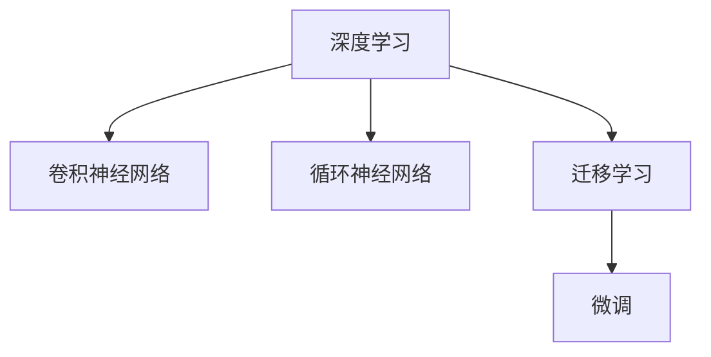

                 

# TensorFlow 应用：图像和自然语言处理

> 关键词：TensorFlow, 图像处理, 自然语言处理, 深度学习, 卷积神经网络, 循环神经网络, 迁移学习, 微调

## 1. 背景介绍

### 1.1 问题由来

在当前的技术发展中，图像处理和自然语言处理（Natural Language Processing, NLP）是两个极其重要的领域。无论是自动驾驶、智能家居还是智能客服，图像处理和NLP都是实现系统智能化的核心技术之一。然而，这两大领域的技术实现常常需要大量的数据和计算资源，这对实际应用中的数据获取和模型训练带来了不小的挑战。

幸运的是，随着深度学习技术的发展，特别是TensorFlow的诞生，这些问题逐渐得到了解决。TensorFlow作为谷歌开发的一款开源机器学习框架，提供了丰富的工具和库，大大简化了深度学习的开发过程，使更多研究人员和开发者能够使用深度学习技术，处理和分析图像和文本数据。本文将详细介绍TensorFlow在图像处理和NLP中的应用，帮助读者理解其核心概念和实现方法。

## 2. 核心概念与联系

### 2.1 核心概念概述

在讨论TensorFlow的应用前，首先介绍几个核心概念及其相互之间的联系：

- **深度学习（Deep Learning）**：深度学习是一种基于多层神经网络的机器学习方法，可以自动地从大量数据中提取特征，并用于分类、回归、聚类等任务。

- **卷积神经网络（Convolutional Neural Network, CNN）**：CNN是一种特殊类型的神经网络，常用于图像处理任务，通过卷积层、池化层等结构，可以有效地提取图像特征。

- **循环神经网络（Recurrent Neural Network, RNN）**：RNN主要用于处理序列数据，如文本、语音等，通过隐藏状态的传递，可以处理变长序列数据，提取序列特征。

- **迁移学习（Transfer Learning）**：迁移学习指将一个领域学习到的知识，迁移应用到另一个相关领域的学习范式。在大规模数据集上预训练的模型，可以用于小规模数据集的微调，提升模型的性能。

- **微调（Fine-Tuning）**：微调是指在预训练模型的基础上，使用特定任务的数据集进行有监督学习，调整模型的权重，以适应新的任务。

这些核心概念之间的关系可以通过以下Mermaid流程图来展示：



这个流程图展示了深度学习是如何通过卷积神经网络和循环神经网络应用于图像处理和自然语言处理任务的，同时也说明了迁移学习和微调是如何在大规模数据上预训练的模型中进一步提升模型性能的。

## 3. 核心算法原理 & 具体操作步骤

### 3.1 算法原理概述

TensorFlow的核心算法是神经网络，包括卷积神经网络和循环神经网络。本文将从这两个角度分别介绍其原理。

- **卷积神经网络（CNN）**：CNN通过卷积层和池化层，提取图像特征，然后通过全连接层进行分类或回归。其基本原理是通过卷积操作，将图像中的局部特征提取出来，并通过池化操作进行特征压缩，从而减少计算量。

- **循环神经网络（RNN）**：RNN通过隐藏状态的记忆功能，可以处理序列数据。其基本原理是，在处理序列数据时，每个时间步的输入和上一个时间步的隐藏状态一起输入到网络中，以此来捕捉序列中的时间依赖关系。

### 3.2 算法步骤详解

#### 卷积神经网络（CNN）

**Step 1: 准备数据集**  
首先，需要准备一个图像数据集，通常这些数据集会被划分为训练集、验证集和测试集。

**Step 2: 设计模型架构**  
在TensorFlow中，可以使用`tf.keras`模块来设计CNN模型。定义输入层、卷积层、池化层、批量归一化层和全连接层等组件。

**Step 3: 训练模型**  
使用训练集对模型进行训练，并调整超参数（如学习率、批次大小等）。在训练过程中，需要计算损失函数，并使用反向传播算法更新模型权重。

**Step 4: 评估模型**  
在验证集上评估模型性能，使用各种评估指标（如准确率、精确率、召回率等）。

**Step 5: 测试模型**  
在测试集上测试模型性能，并记录最终结果。

#### 循环神经网络（RNN）

**Step 1: 准备数据集**  
准备文本数据集，通常这些数据集会被划分为训练集、验证集和测试集。

**Step 2: 设计模型架构**  
在TensorFlow中，可以使用`tf.keras`模块来设计RNN模型。定义输入层、嵌入层、LSTM层、全连接层等组件。

**Step 3: 训练模型**  
使用训练集对模型进行训练，并调整超参数（如学习率、批次大小等）。在训练过程中，需要计算损失函数，并使用反向传播算法更新模型权重。

**Step 4: 评估模型**  
在验证集上评估模型性能，使用各种评估指标（如BLEU、ROUGE等）。

**Step 5: 测试模型**  
在测试集上测试模型性能，并记录最终结果。

### 3.3 算法优缺点

**卷积神经网络（CNN）**

- **优点**：
  - 参数共享：由于卷积层中的参数共享，大大减少了模型的参数量，从而降低了过拟合的风险。
  - 平移不变性：由于卷积层的卷积核可以平移，CNN可以很好地处理图像中的平移不变性。
  - 高效性：CNN的计算复杂度较低，适用于大规模图像数据集。

- **缺点**：
  - 对于非结构化数据（如文本）不太适用。
  - 需要大量的训练数据来获取良好的特征表示。

**循环神经网络（RNN）**

- **优点**：
  - 适合处理变长序列数据，如文本。
  - 可以捕捉序列数据中的时间依赖关系。
  - 适用于处理自然语言处理任务。

- **缺点**：
  - 存在梯度消失或梯度爆炸问题。
  - 对于长序列数据，性能较差。

### 3.4 算法应用领域

**卷积神经网络（CNN）**

- 图像分类：如手写数字识别、物体识别等。
- 物体检测：如目标检测、行人检测等。
- 图像分割：如语义分割、实例分割等。

**循环神经网络（RNN）**

- 语言模型：如文本生成、机器翻译等。
- 情感分析：如情感分类、文本情感分析等。
- 文本摘要：如自动摘要、问答系统等。

## 4. 数学模型和公式 & 详细讲解 & 举例说明

### 4.1 数学模型构建

**卷积神经网络（CNN）**

对于CNN，其数学模型可以表示为：

$$
y = h(Wx + b)
$$

其中，$x$为输入特征向量，$W$为权重矩阵，$b$为偏置向量，$h$为激活函数，$y$为输出向量。

**循环神经网络（RNN）**

对于RNN，其数学模型可以表示为：

$$
h_t = f(h_{t-1}, x_t)
$$

其中，$h_t$为时间步$t$的隐藏状态，$f$为激活函数，$x_t$为时间步$t$的输入向量。

### 4.2 公式推导过程

**卷积神经网络（CNN）**

卷积神经网络的核心公式是卷积公式：

$$
y_{ij} = \sum_{m,n} w_{mn} x_{i+m,j+n}
$$

其中，$x$为输入特征图，$w$为卷积核，$y$为输出特征图。

**循环神经网络（RNN）**

RNN的核心公式是循环公式：

$$
h_t = f(h_{t-1}, x_t)
$$

其中，$h_t$为时间步$t$的隐藏状态，$f$为激活函数，$x_t$为时间步$t$的输入向量。

### 4.3 案例分析与讲解

**卷积神经网络（CNN）**

以图像分类为例，假设我们有一个手写数字的图像数据集，其中每个图像大小为$28\times 28$，共10个类别。我们可以使用卷积神经网络进行分类。首先，将图像数据转换为张量形式，然后通过卷积层、池化层和全连接层进行分类。在训练过程中，使用交叉熵损失函数进行优化，使用反向传播算法更新权重。

**循环神经网络（RNN）**

以机器翻译为例，假设我们有英文和法文的对照数据集。我们可以使用循环神经网络进行翻译。首先，将英文句子转换为序列，然后通过嵌入层、LSTM层和全连接层进行翻译。在训练过程中，使用BLEU等评估指标进行优化，使用反向传播算法更新权重。

## 5. 项目实践：代码实例和详细解释说明

### 5.1 开发环境搭建

首先，需要安装TensorFlow和其他必要的Python库，可以使用以下命令：

```bash
pip install tensorflow
pip install numpy
pip install matplotlib
```

在安装TensorFlow时，需要指定GPU版本以加速计算。例如，如果希望使用GPU版本，可以使用以下命令：

```bash
pip install tensorflow-gpu
```

### 5.2 源代码详细实现

#### 卷积神经网络（CNN）

**代码实现**：

```python
import tensorflow as tf
from tensorflow.keras import layers

# 定义模型
model = tf.keras.Sequential([
    layers.Conv2D(32, (3, 3), activation='relu', input_shape=(28, 28, 1)),
    layers.MaxPooling2D((2, 2)),
    layers.Flatten(),
    layers.Dense(10, activation='softmax')
])

# 编译模型
model.compile(optimizer='adam', loss='sparse_categorical_crossentropy', metrics=['accuracy'])

# 训练模型
model.fit(train_images, train_labels, epochs=10, validation_data=(test_images, test_labels))
```

**解释说明**：
- `layers.Conv2D`层定义卷积层，使用32个3x3的卷积核，激活函数为ReLU。
- `layers.MaxPooling2D`层定义池化层，使用2x2的池化窗口。
- `layers.Flatten`层将特征图展开成向量。
- `layers.Dense`层定义全连接层，输出10个类别的概率分布。
- `model.compile`方法编译模型，定义优化器和损失函数。
- `model.fit`方法训练模型，使用训练集进行10次迭代。

#### 循环神经网络（RNN）

**代码实现**：

```python
import tensorflow as tf
from tensorflow.keras import layers

# 定义模型
model = tf.keras.Sequential([
    layers.Embedding(input_dim=vocab_size, output_dim=embedding_dim),
    layers.LSTM(units=hidden_units, return_sequences=True),
    layers.Dense(units=1, activation='sigmoid')
])

# 编译模型
model.compile(optimizer='adam', loss='binary_crossentropy', metrics=['accuracy'])

# 训练模型
model.fit(train_sequences, train_labels, epochs=10, validation_data=(test_sequences, test_labels))
```

**解释说明**：
- `layers.Embedding`层定义嵌入层，将文本转换为向量表示。
- `layers.LSTM`层定义LSTM层，设置隐藏单元数为128。
- `layers.Dense`层定义全连接层，输出二分类概率。
- `model.compile`方法编译模型，定义优化器和损失函数。
- `model.fit`方法训练模型，使用训练集进行10次迭代。

### 5.3 代码解读与分析

**卷积神经网络（CNN）**

- `layers.Conv2D`层：定义卷积层，设置卷积核大小、数量和激活函数。
- `layers.MaxPooling2D`层：定义池化层，设置池化窗口大小。
- `layers.Flatten`层：将特征图展开成向量。
- `layers.Dense`层：定义全连接层，设置输出类别数和激活函数。
- `model.compile`方法：定义优化器和损失函数。
- `model.fit`方法：训练模型，设置迭代次数和验证集。

**循环神经网络（RNN）**

- `layers.Embedding`层：定义嵌入层，将文本转换为向量表示。
- `layers.LSTM`层：定义LSTM层，设置隐藏单元数和返回序列的参数。
- `layers.Dense`层：定义全连接层，输出二分类概率。
- `model.compile`方法：定义优化器和损失函数。
- `model.fit`方法：训练模型，设置迭代次数和验证集。

### 5.4 运行结果展示

**卷积神经网络（CNN）**

在训练过程中，可以使用TensorBoard进行可视化，记录损失函数和准确率的曲线。例如：

```bash
tensorboard --logdir=logs --port=6006
```

打开浏览器，访问`http://127.0.0.1:6006/`，即可看到训练过程的可视化图。

**循环神经网络（RNN）**

同样可以使用TensorBoard进行可视化，记录损失函数和准确率的曲线。

## 6. 实际应用场景

### 6.1 智能家居

在智能家居系统中，可以使用图像处理和自然语言处理技术，实现智能识别和控制。例如，通过摄像头拍摄房间中的图像，使用卷积神经网络进行物体识别和场景分析，然后通过语音助手或手机APP进行控制，实现智能家居的自动化管理。

### 6.2 金融风险控制

在金融风险控制中，可以使用自然语言处理技术，对金融报告和新闻进行情感分析，识别风险点。同时，可以使用卷积神经网络对交易数据进行图像化处理，识别异常交易行为，及时预警。

### 6.3 智能客服

在智能客服系统中，可以使用自然语言处理技术，对客户提问进行理解和分类，然后通过卷积神经网络或循环神经网络进行回复生成。通过不断学习和优化，系统可以逐渐提升其回答的准确性和人性化程度。

### 6.4 未来应用展望

未来的发展方向可能包括：

- **多模态融合**：将图像、文本和语音等多种模态数据进行融合，实现更全面的智能识别和分析。
- **迁移学习**：在大规模数据集上预训练的模型，可以用于小规模数据集的微调，提升模型的性能。
- **联邦学习**：在保护数据隐私的前提下，将多个设备或用户的数据进行联合训练，提升模型的泛化能力。
- **边缘计算**：将深度学习模型部署在边缘设备上，实现本地化处理，减少数据传输和计算延迟。

## 7. 工具和资源推荐

### 7.1 学习资源推荐

- **TensorFlow官方文档**：官方提供的详细教程和示例，涵盖TensorFlow的基本概念和高级用法。
- **Deep Learning Specialization**：由Andrew Ng主讲的深度学习课程，适合初学者和进阶者。
- **NLP with TensorFlow**：由TensorFlow团队编写的实战指南，涵盖自然语言处理的各个方面。
- **TensorFlow Tutorials**：官方提供的多种语言的示例代码和教程，适合快速上手。

### 7.2 开发工具推荐

- **TensorBoard**：可视化工具，可以帮助开发者监控训练过程和模型性能。
- **Jupyter Notebook**：交互式笔记本，方便进行代码调试和实验。
- **Google Colab**：免费的GPU计算环境，支持TensorFlow和PyTorch等深度学习框架。

### 7.3 相关论文推荐

- **CNN for Generic Object Detection**：提出CNN在目标检测中的经典方法。
- **RNN-based LSTM Recurrent Neural Network for Image Annotation**：提出RNN在图像标注中的应用。
- **Attention is All You Need**：提出Transformer模型，开启了大语言模型时代。

## 8. 总结：未来发展趋势与挑战

### 8.1 研究成果总结

本文系统介绍了TensorFlow在图像处理和自然语言处理中的应用，展示了卷积神经网络和循环神经网络的基本原理和具体操作步骤。同时，通过实例分析，介绍了模型训练和优化的方法。

### 8.2 未来发展趋势

未来，深度学习技术将在各个领域得到更广泛的应用。图像处理和自然语言处理作为核心技术，将与人工智能、物联网、边缘计算等技术进行深度融合，实现更智能、更高效的系统。

### 8.3 面临的挑战

尽管深度学习技术已经取得显著进展，但仍面临以下挑战：

- **计算资源限制**：深度学习模型通常需要大量的计算资源，如何降低计算成本，提高计算效率，仍然是一个重要问题。
- **数据隐私保护**：在处理敏感数据时，如何保护用户隐私，是一个亟待解决的问题。
- **模型可解释性**：深度学习模型的黑盒性质，使得其决策过程难以解释，如何提高模型的可解释性，是一个重要的研究方向。

### 8.4 研究展望

未来，深度学习技术将在以下几个方面取得新的突破：

- **自适应学习**：深度学习模型将能够更好地适应不同的数据分布和应用场景，实现自适应学习。
- **迁移学习**：在迁移学习的基础上，进一步提升模型的泛化能力和适应性。
- **联邦学习**：在保护数据隐私的前提下，实现多设备或多用户联合训练，提升模型的性能。
- **边缘计算**：将深度学习模型部署在边缘设备上，实现本地化处理，降低延迟和计算成本。

总之，深度学习技术在图像处理和自然语言处理领域有着广泛的应用前景，随着技术的不断进步，将会有更多的创新和突破。同时，也需要解决一些挑战和问题，才能更好地应用于实际场景中。

## 9. 附录：常见问题与解答

**Q1: 为什么TensorFlow可以处理图像和文本数据？**

A: TensorFlow是一个高度通用的深度学习框架，支持多种神经网络模型，包括卷积神经网络和循环神经网络。卷积神经网络用于图像处理，循环神经网络用于文本处理。

**Q2: 如何使用TensorBoard可视化模型训练过程？**

A: 在训练模型时，可以使用TensorBoard记录训练过程中的各种指标，例如损失函数、准确率等。在训练完成后，使用TensorBoard打开可视化的页面，可以查看详细的训练曲线和模型性能。

**Q3: 深度学习模型中，为什么使用梯度下降算法？**

A: 梯度下降算法是深度学习模型中最常用的优化算法，它通过计算损失函数对模型参数的梯度，来更新模型参数，从而最小化损失函数。梯度下降算法具有收敛快、收敛稳定的特点，适用于大多数深度学习模型。

**Q4: 深度学习模型的泛化能力如何提升？**

A: 深度学习模型的泛化能力可以通过以下方法提升：

- 数据增强：通过随机裁剪、翻转、旋转等方式扩充训练集。
- 正则化：使用L2正则、Dropout等技术防止过拟合。
- 模型集成：通过集成多个模型的预测结果，提升模型的泛化能力。
- 迁移学习：在大规模数据集上预训练的模型，可以用于小规模数据集的微调，提升模型的泛化能力。

总之，深度学习模型的泛化能力可以通过多种方式进行提升，但最重要的是使用足够多的数据进行训练，并适当调整模型结构。

**Q5: 如何使用TensorFlow实现迁移学习？**

A: 使用TensorFlow实现迁移学习，主要包括以下步骤：

1. 在大规模数据集上预训练一个深度学习模型，如CNN或RNN。
2. 将预训练模型的权重导入到新的模型中，去除不必要的层和参数，保留关键层。
3. 在新的数据集上微调模型，调整顶层参数，更新预训练模型的权重。
4. 使用微调后的模型进行预测，获得更好的性能。

以上是使用TensorFlow实现迁移学习的基本步骤，需要注意的是，在微调时，需要控制学习率，避免破坏预训练模型的权重。

