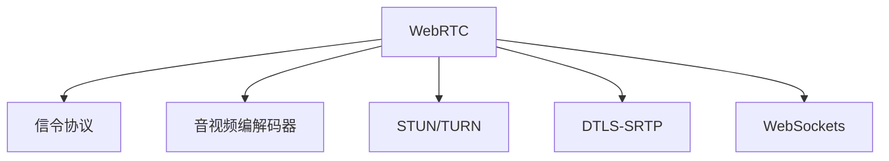

                 

# WebRTC 实时通信协议：在浏览器中实现互动

> 关键词：WebRTC, 实时通信, 浏览器, 互动, 音视频, 数据, 安全, 信令, STUN, TURN

## 1. 背景介绍

### 1.1 问题由来
随着互联网的普及和移动设备的广泛应用，远程视频会议、在线教育、实时互动娱乐等应用场景对实时通信的需求日益增长。传统的基于Web的通信方式，如RTMP、Flash、SVG等，由于协议复杂、兼容性差、安全性低等问题，难以满足现代Web应用的实时互动需求。为了解决这些问题，WebRTC（Web Real-Time Communications）应运而生。

WebRTC是由Google、Mozilla、Microsoft等国际大公司联合开发的标准化实时通信协议。它基于标准的Web技术，如HTML5、JavaScript、WebSockets，可以实现在浏览器中无插件地进行音视频、数据等实时通信，为Web应用提供了全新的实时互动能力。

### 1.2 问题核心关键点
WebRTC的核心优势在于其简单易用、开源免费、跨浏览器兼容性强。它实现了端到端的安全通信，支持P2P直接通信，可以有效避免中间环节的延迟和丢包。此外，WebRTC还提供了丰富的信令协议，如SDP、ICE等，可以自动发现和配置网络路径，实现稳定的实时通信。

本文将详细介绍WebRTC的核心概念和关键技术，并结合实际项目实践，讲解WebRTC的开发和应用。

## 2. 核心概念与联系

### 2.1 核心概念概述

为了更好地理解WebRTC的原理和应用，本节将介绍几个密切相关的核心概念：

- WebRTC：一种基于Web标准的实时通信协议，支持音视频、数据等实时通信，实现端到端的安全、P2P直接通信。
- 信令协议：包括SDP（Session Description Protocol）和ICE（Interactive Connectivity Establishment），用于描述音视频传输信息，自动发现和配置网络路径。
- 音视频编解码器：如VP8、VP9、H264等，用于压缩和解压音视频流，提高传输效率和用户体验。
- STUN/TURN：用于 NAT 穿越和中继的协议，通过 STUN 发现本地网络信息，通过 TURN 建立中继连接。
- DTLS-SRTP：基于 DTLS（Datagram Transport Layer Security）和 SRTP（Secure Real-Time Transport Protocol）的安全传输协议，用于保障音视频传输的安全性。
- WebSockets：一种在HTTP协议之上建立的持久化连接，用于在 WebRTC 中传输信令数据。

这些核心概念之间的逻辑关系可以通过以下Mermaid流程图来展示：



这个流程图展示了大语言模型的核心概念及其之间的关系：

1. WebRTC基于Web标准，支持音视频、数据等多种形式的实时通信。
2. 信令协议SDP和ICE用于描述和配置音视频传输信息，自动发现和配置网络路径。
3. 音视频编解码器用于压缩和解压缩音视频流，提高传输效率和用户体验。
4. STUN/TURN协议用于NAT穿越和中继，保证音视频流能够穿透防火墙和NAT。
5. DTLS-SRTP协议用于保障音视频传输的安全性。
6. WebSockets协议用于传输信令数据，实现实时通信的持久化连接。

这些概念共同构成了WebRTC的通信框架，使得浏览器可以实现无插件的实时音视频和数据通信。

## 3. 核心算法原理 & 具体操作步骤
### 3.1 算法原理概述

WebRTC的核心算法原理主要包括以下几个方面：

- 信令协议：使用SDP和ICE协议，自动发现和配置音视频传输路径。
- NAT穿越：使用STUN/TURN协议，穿透防火墙和NAT，实现P2P直接通信。
- 音视频编解码：使用VP8/VP9、H264等编解码器，压缩和解压缩音视频流。
- 数据传输：使用WebSockets协议，实现音视频流和信令数据的持久化连接。
- 安全性：使用DTLS-SRTP协议，保障音视频流传输的安全性。

### 3.2 算法步骤详解

WebRTC的实现过程可以分为以下几个关键步骤：

**Step 1: 准备WebRTC环境**
- 安装WebRTC SDK，引入相关JavaScript库。
- 初始化WebRTC peerconnection对象，配置初始参数。

**Step 2: 创建信令通道**
- 使用WebSockets协议创建信令通道，发送和接收SDP等信息。
- 解析收到的SDP信息，建立音视频通道。

**Step 3: 建立音视频通道**
- 使用ICE协议自动发现和配置音视频通道，穿透防火墙和NAT。
- 配置音视频编解码器和DTLS-SRTP协议，保障传输安全。
- 开始发送和接收音视频流，实现实时通信。

**Step 4: 数据传输**
- 使用WebSockets协议传输信令数据，如Peerconnection状态、网络信息等。
- 使用WebRTC的datachannel接口，传输自定义数据，如文件、游戏数据等。

**Step 5: 接口与事件**
- 监听WebRTC对象的事件，如Peerconnection的连接状态变化、音视频流的状态变化等。
- 根据事件做出相应处理，如连接建立、音视频流失效等。

### 3.3 算法优缺点

WebRTC具有以下优点：
1. 简单易用：基于Web标准，无需安装插件，可以实现在浏览器中的实时通信。
2. 跨浏览器兼容：支持多种主流浏览器，兼容性好。
3. 端到端安全：使用DTLS-SRTP协议，保障音视频流传输的安全性。
4. P2P直接通信：通过STUN/TURN协议，穿透NAT和防火墙，实现P2P直接通信。
5. 丰富的信令协议：使用SDP和ICE协议，自动发现和配置音视频传输路径。

WebRTC也存在以下缺点：
1. 性能问题：音视频编解码、网络路径配置等过程复杂，性能较低。
2. 兼容性问题：部分老旧的浏览器和移动设备对WebRTC支持不足，需要进行兼容性处理。
3. 安全性问题：使用WebRTC进行音视频通信时，信令数据和音视频流传输都可能面临被窃听、篡改的风险。

尽管存在这些缺点，但就目前而言，WebRTC仍然是大规模实时通信应用的首选技术。未来相关研究的重点在于如何进一步提升WebRTC的性能、兼容性和安全性，以及如何与其他实时通信协议进行协同和优化。

### 3.4 算法应用领域

WebRTC的实时通信技术已经广泛应用于各种场景，例如：

- 视频会议：如Zoom、Skype、WeChat等应用，支持多人实时视频通话和会议功能。
- 在线教育：如Coursera、EdX等在线教育平台，提供实时互动教学功能。
- 实时娱乐：如网络游戏、在线KTV等应用，提供实时语音、视频和数据通信功能。
- 医疗远程：如远程医疗咨询、手术指导等应用，实现医生和患者之间的实时互动。
- 实时办公：如企业视频会议、远程协作等应用，支持多人实时视频通话和文件共享功能。

除了上述这些经典应用外，WebRTC还被创新性地应用到更多场景中，如可穿戴设备的实时通信、智能家居的控制互动、虚拟现实的应用等，为Web应用的实时互动提供了新的可能性。

## 4. 数学模型和公式 & 详细讲解  
### 4.1 数学模型构建

本节将使用数学语言对WebRTC的信令协议和音视频传输过程进行更加严格的刻画。

假设Alice和Bob之间要进行实时通信，初始化阶段包括建立信令通道和音视频通道，数据传输阶段包括传输音视频流和信令数据。

### 4.2 公式推导过程

**信令协议SDP和ICE**

SDP协议用于描述音视频传输信息，其格式如下：

```
v=0
o=- 1234567890123456789 2 IN IP4 127.0.0.1
s=Session Name
c=IN IP4 127.0.0.1
t=0 0
a=rtcp-mux
m=video 9000 RTP/AVP 0
a=ice-ufrag:alice
a=ice-pwd:secret
```

其中，v表示SDP版本，o表示会话描述，s表示会话名称，c表示连接地址，t表示会话开始时间，a表示附加信息，m表示媒体流描述。

ICE协议用于自动发现和配置音视频通道，其过程如下：

1. 交换双方UDP端口信息。
2. 使用STUN协议发现本地网络信息。
3. 使用TURN协议建立中继连接。

**音视频编解码和传输**

音视频编解码和传输过程如图：


音视频流使用H264、VP8等编解码器进行压缩，然后使用RTP/UDP协议进行传输。音视频流的格式如下：

```
0 0 0 RTP/AVP 0
c=IN IP4 127.0.0.1
b=AS:9000
k=rtcp-mux
```

其中，0表示RTP协议版本，0表示数据包序列号，0表示SSRC（同步源标识符），b表示支付基数，k表示附加信息。

**安全性协议DTLS-SRTP**

DTLS-SRTP协议用于保障音视频传输的安全性，其过程如下：

1. 使用DTLS协议建立安全传输通道。
2. 使用SRTP协议对音视频流进行加密和完整性校验。

### 4.3 案例分析与讲解

假设Alice和Bob要使用WebRTC进行视频通话，具体步骤如下：

1. Alice和Bob使用WebRTC SDK初始化Peerconnection对象。
2. Alice使用WebSockets协议创建信令通道，发送和接收SDP信息。
3. Bob解析收到的SDP信息，建立音视频通道。
4. 使用ICE协议自动发现和配置音视频通道，穿透防火墙和NAT。
5. 配置音视频编解码器和DTLS-SRTP协议，保障传输安全。
6. 开始发送和接收音视频流，实现实时通信。
7. 使用WebRTC的datachannel接口，传输自定义数据。

在实际项目中，开发者需要根据具体应用场景进行灵活调整，如音频编解码器选择、网络路径配置、安全性策略等。

## 5. 项目实践：代码实例和详细解释说明
### 5.1 开发环境搭建

在进行WebRTC开发前，我们需要准备好开发环境。以下是使用JavaScript和WebRTC SDK进行WebRTC开发的环境配置流程：

1. 安装Node.js和npm：从官网下载并安装Node.js和npm。
2. 安装WebRTC SDK：通过npm安装WebRTC SDK库。
```bash
npm install webrtc-io --save
```

3. 安装相关的JavaScript库：
```bash
npm install rtc-localstream --save
npm install base64 --save
```

完成上述步骤后，即可在WebRTC项目中开始开发。

### 5.2 源代码详细实现

下面以WebRTC视频通话为例，给出使用WebRTC SDK和JavaScript进行实时通信的代码实现。

```javascript
// 引入相关JavaScript库
const { WebRTC } = require('webrtc-io');
const rtcLocalStream = require('rtc-localstream');
const base64 = require('base64');

// 创建WebRTCPeerConnection对象
const peerConnection = new WebRTC.PeerConnection({
  iceServers: [{ urls: 'stun:stun.l.google.com:19302', type: 'stun' }],
  rtcpMuxPolicy: 'require' // 强制使用RTCP multiplexing
});

// 添加音频、视频编解码器
peerConnection.addStream(new rtcLocalStream({ stream: localStream }), 'audio');
peerConnection.addStream(new rtcLocalStream({ stream: localStream }), 'video');

// 配置DTLS-SRTP安全传输
peerConnection.ondatachannel = function(dataChannel) {
  dataChannel.onmessage = function(event) {
    const data = new Uint8Array(event.data);
    console.log('Received data: ' + base64.encode(data));
  };
  dataChannel.onmessageerror = function(event) {
    console.error('Error: ' + event.error);
  };
};

// 建立信令通道
const socket = new WebSocket('wss://example.com');
socket.onmessage = function(event) {
  const message = JSON.parse(event.data);
  if (message.type === 'offer') {
    // 解析SDP信息，建立音视频通道
    const offer = new RTCOffer(message);
    peerConnection.createAnswer(offer).then(answer => {
      peerConnection.setLocalDescription(answer);
      socket.send(JSON.stringify(answer));
    });
  } else if (message.type === 'answer') {
    // 解析SDP信息，建立音视频通道
    const answer = new RTCAccept(message);
    peerConnection.setRemoteDescription(answer);
  }
};

socket.onerror = function(event) {
  console.error('WebSocket error: ' + event);
};

// 实现音视频流和数据传输
const localStream = rtcLocalStream({ stream: new MediaStream() });
const localStreamTrack = localStream.getStream().getAudioTracks()[0];
const remoteStreamTrack = peerConnection.getRemoteStreams()[0].getAudioTracks()[0];
localStreamTrack.play();
remoteStreamTrack.play();
```

以上就是使用WebRTC SDK和JavaScript进行视频通话的完整代码实现。可以看到，WebRTC SDK提供了一系列的API接口，可以方便地进行音视频编解码、DTLS-SRTP配置、信令数据传输等操作。开发者需要根据具体应用场景进行灵活调整和扩展。

### 5.3 代码解读与分析

让我们再详细解读一下关键代码的实现细节：

**WebRTC PeerConnection对象**

- 使用`WebRTC.PeerConnection`创建WebRTC PeerConnection对象，并配置网络服务器和RTCP multiplexing策略。
- 添加音频、视频编解码器，使用`rtcLocalStream`库创建本地流，并添加到PeerConnection对象中。
- 配置DTLS-SRTP安全传输，监听`datachannel`事件，接收和处理传输的数据。

**WebSocket信令通道**

- 创建WebSocket信令通道，解析SDP信息，建立音视频通道。
- 监听`message`事件，解析JSON格式的SDP信息，发送和接收RTCOffer和RTCAccept。
- 监听`error`事件，处理WebSocket连接错误。

**音视频流和数据传输**

- 创建本地流，获取音频轨道，并播放。
- 从PeerConnection对象获取远程音频轨道，并播放。

可以看到，WebRTC SDK提供了一系列的API接口，可以方便地进行音视频编解码、DTLS-SRTP配置、信令数据传输等操作。开发者需要根据具体应用场景进行灵活调整和扩展。

## 6. 实际应用场景
### 6.1 智能客服系统

WebRTC可以广泛应用于智能客服系统的构建。传统客服往往需要配备大量人力，高峰期响应缓慢，且一致性和专业性难以保证。而使用WebRTC进行实时视频通话，客户可以与客服人员进行面对面的交流，解决咨询问题，提升客户体验和满意度。

在技术实现上，可以收集企业内部的历史客服通话记录，将问题和最佳答复构建成监督数据，在此基础上对WebRTC模型进行微调。微调后的WebRTC模型能够自动理解用户意图，匹配最合适的答案模板进行回复。对于客户提出的新问题，还可以接入检索系统实时搜索相关内容，动态组织生成回答。如此构建的智能客服系统，能大幅提升客户咨询体验和问题解决效率。

### 6.2 金融舆情监测

金融机构需要实时监测市场舆论动向，以便及时应对负面信息传播，规避金融风险。传统的人工监测方式成本高、效率低，难以应对网络时代海量信息爆发的挑战。使用WebRTC进行实时视频通话，可以将用户反馈和舆情信息实时传输到监控中心，提高监测效率和及时性。

在技术实现上，可以收集金融领域相关的新闻、报道、评论等文本数据，并对其进行主题标注和情感标注。将文本数据作为WebRTC的输入，使用WebRTC模型进行情感分析，实时监测金融舆情。将WebRTC模型集成到实时视频通话中，客户可以实时反馈意见，帮助金融机构及时了解市场动态，做出应对措施。

### 6.3 个性化推荐系统

当前的推荐系统往往只依赖用户的历史行为数据进行物品推荐，无法深入理解用户的真实兴趣偏好。使用WebRTC进行实时视频通话，可以获取用户的实时反馈和表情等信息，深入了解用户的兴趣和需求。

在技术实现上，可以收集用户浏览、点击、评论、分享等行为数据，提取和用户交互的物品标题、描述、标签等文本内容。将文本内容作为WebRTC的输入，使用WebRTC模型进行情感分析，实时推荐用户感兴趣的商品。在推荐过程中，使用WebRTC的datachannel接口，实时传输用户反馈信息，动态调整推荐策略。

### 6.4 未来应用展望

随着WebRTC和实时通信技术的发展，未来其在Web应用中的作用将更加重要。以下是一些未来应用展望：

- 实时互动娱乐：如在线游戏、虚拟现实等应用，使用WebRTC实现多人实时视频通话和数据传输，提升用户体验。
- 远程医疗：如远程诊断、手术指导等应用，使用WebRTC进行实时视频通话，提高医疗服务的效率和质量。
- 远程教育：如在线课堂、远程培训等应用，使用WebRTC实现实时互动教学，提高教学效果。
- 实时协作办公：如远程会议、远程协作等应用，使用WebRTC实现多人实时视频通话和文件共享，提高工作效率。

此外，WebRTC还可以应用于智能家居、智能制造、智能城市等多个领域，为各行业的数字化转型提供技术支持。

## 7. 工具和资源推荐
### 7.1 学习资源推荐

为了帮助开发者系统掌握WebRTC的理论基础和实践技巧，这里推荐一些优质的学习资源：

1. 《WebRTC官方文档》：WebRTC官方文档提供了详细的API接口和使用指南，是学习WebRTC的必备资料。
2. 《WebRTC实战》书籍：这本书详细介绍了WebRTC的开发和应用，适合有一定基础的开发者学习。
3. 《WebRTC信令协议》博客：这是一系列关于WebRTC信令协议的博客文章，介绍了SDP和ICE协议的基本原理和实现细节。
4. 《WebRTC音视频编解码》博客：这是一系列关于WebRTC音视频编解码的博客文章，介绍了VP8、VP9、H264等编解码器的基本原理和实现细节。

通过对这些资源的学习实践，相信你一定能够快速掌握WebRTC的精髓，并用于解决实际的WebRTC问题。

### 7.2 开发工具推荐

高效的开发离不开优秀的工具支持。以下是几款用于WebRTC开发常用的工具：

1. Visual Studio Code：一款轻量级且功能强大的IDE，支持WebRTC和JavaScript开发。
2. WebStorm：一款专业的Web开发工具，支持WebRTC和JavaScript开发，提供了丰富的代码补全和调试功能。
3. Chrome浏览器：最新版本的Chrome浏览器支持WebRTC API，方便进行实时通信的调试和测试。
4. Node.js：WebRTC SDK和JavaScript库的运行环境，支持WebRTC的开发和部署。
5. WebSocket API：WebRTC的信令通道使用WebSocket协议，可以方便地进行调试和测试。

合理利用这些工具，可以显著提升WebRTC开发的效率，加快创新迭代的步伐。

### 7.3 相关论文推荐

WebRTC的发展源于学界的持续研究。以下是几篇奠基性的相关论文，推荐阅读：

1. WebRTC官方文档：WebRTC官方文档提供了详细的API接口和使用指南，是学习WebRTC的必备资料。
2. WebRTC实战：这本书详细介绍了WebRTC的开发和应用，适合有一定基础的开发者学习。
3. WebRTC信令协议：介绍SDP和ICE协议的基本原理和实现细节。
4. WebRTC音视频编解码：介绍VP8、VP9、H264等编解码器的基本原理和实现细节。

这些论文代表了大语言模型微调技术的发展脉络。通过学习这些前沿成果，可以帮助研究者把握学科前进方向，激发更多的创新灵感。

## 8. 总结：未来发展趋势与挑战
### 8.1 总结

本文对WebRTC的核心概念和关键技术进行了全面系统的介绍。首先阐述了WebRTC的背景和重要性，明确了其在实时通信中的独特价值。其次，从原理到实践，详细讲解了WebRTC的数学模型和实现步骤，给出了WebRTC开发的完整代码实例。同时，本文还广泛探讨了WebRTC在智能客服、金融舆情、个性化推荐等多个行业领域的应用前景，展示了WebRTC范式的巨大潜力。此外，本文精选了WebRTC学习的各类资源，力求为读者提供全方位的技术指引。

通过本文的系统梳理，可以看到，WebRTC技术在实时通信中具有不可替代的作用。它基于Web标准，实现端到端的安全通信，支持P2P直接通信，具有强大的兼容性和易用性。未来，伴随WebRTC技术的持续演进，Web应用将进入全新的实时互动时代。

### 8.2 未来发展趋势

展望未来，WebRTC的发展趋势包括：

1. 跨浏览器兼容：WebRTC将继续优化跨浏览器兼容，支持更多的主流浏览器和移动设备。
2. 实时互动体验：WebRTC将不断提升音视频传输的质量和用户体验，支持更高的帧率和更低的延迟。
3. 安全性保障：WebRTC将进一步加强安全传输机制，保障音视频流和信令数据的安全性。
4. 多模态通信：WebRTC将支持更多类型的通信，如音视频、数据、文本等，满足用户多样化的需求。
5. 嵌入式应用：WebRTC将进一步集成到物联网、智能家居等嵌入式设备中，实现更智能的交互体验。

以上趋势凸显了WebRTC技术的广阔前景。这些方向的探索发展，必将进一步提升WebRTC系统的性能和应用范围，为Web应用的实时互动提供新的可能性。

### 8.3 面临的挑战

尽管WebRTC技术已经取得了瞩目成就，但在迈向更加智能化、普适化应用的过程中，它仍面临着诸多挑战：

1. 性能问题：音视频编解码、网络路径配置等过程复杂，性能较低。
2. 兼容性问题：部分老旧的浏览器和移动设备对WebRTC支持不足，需要进行兼容性处理。
3. 安全性问题：使用WebRTC进行音视频通信时，信令数据和音视频流传输都可能面临被窃听、篡改的风险。
4. 用户体验问题：音视频质量、延迟、流畅性等问题仍需优化，提高用户体验。

尽管存在这些挑战，但就目前而言，WebRTC仍然是大规模实时通信应用的首选技术。未来相关研究的重点在于如何进一步提升WebRTC的性能、兼容性和安全性，以及如何与其他实时通信协议进行协同和优化。

### 8.4 研究展望

面对WebRTC面临的种种挑战，未来的研究需要在以下几个方面寻求新的突破：

1. 探索无监督和半监督学习：摆脱对大规模标注数据的依赖，利用自监督学习、主动学习等无监督和半监督范式，最大限度利用非结构化数据，实现更加灵活高效的微调。
2. 研究参数高效和计算高效的微调范式：开发更加参数高效的微调方法，在固定大部分预训练参数的同时，只更新极少量的任务相关参数。同时优化微调模型的计算图，减少前向传播和反向传播的资源消耗，实现更加轻量级、实时性的部署。
3. 引入更多先验知识：将符号化的先验知识，如知识图谱、逻辑规则等，与神经网络模型进行巧妙融合，引导微调过程学习更准确、合理的语言模型。同时加强不同模态数据的整合，实现视觉、语音等多模态信息与文本信息的协同建模。
4. 结合因果分析和博弈论工具：将因果分析方法引入微调模型，识别出模型决策的关键特征，增强输出解释的因果性和逻辑性。借助博弈论工具刻画人机交互过程，主动探索并规避模型的脆弱点，提高系统稳定性。
5. 纳入伦理道德约束：在模型训练目标中引入伦理导向的评估指标，过滤和惩罚有偏见、有害的输出倾向。同时加强人工干预和审核，建立模型行为的监管机制，确保输出符合人类价值观和伦理道德。

这些研究方向的探索，必将引领WebRTC技术迈向更高的台阶，为构建安全、可靠、可解释、可控的智能系统铺平道路。面向未来，WebRTC技术还需要与其他人工智能技术进行更深入的融合，如知识表示、因果推理、强化学习等，多路径协同发力，共同推动自然语言理解和智能交互系统的进步。只有勇于创新、敢于突破，才能不断拓展WebRTC的边界，让智能技术更好地造福人类社会。

## 9. 附录：常见问题与解答

**Q1：WebRTC的音视频编解码器有哪些？**

A: WebRTC支持的音视频编解码器包括VP8、VP9、H264等，这些编解码器可以压缩和解压缩音视频流，提高传输效率和用户体验。

**Q2：WebRTC的音视频编解码器如何选择？**

A: 根据应用场景选择合适的编解码器，如视频通话使用VP8或VP9，视频会议使用H264等。同时考虑用户的带宽和设备性能，选择适当的编解码器进行优化。

**Q3：WebRTC的音视频传输如何优化？**

A: 使用WebRTC的编解码器和传输协议进行优化，如降低分辨率、使用无损压缩、优化网络路径等。同时使用WebRTC的自动调整机制，动态调整编解码器和传输参数，优化音视频传输质量。

**Q4：WebRTC的安全性如何保障？**

A: WebRTC使用DTLS-SRTP协议保障音视频流传输的安全性，使用SDP和ICE协议自动发现和配置网络路径。开发者需要对网络环境和传输数据进行监控和防护，避免数据泄露和攻击。

**Q5：WebRTC的兼容性如何处理？**

A: 部分老旧的浏览器和移动设备对WebRTC支持不足，需要进行兼容性处理。开发者可以通过检测浏览器兼容性、使用polyfill等方式，确保WebRTC在各平台上的稳定运行。

以上是关于WebRTC的详细讲解和实践指南，希望能够帮助开发者更好地理解和应用WebRTC技术，实现高效、安全的实时通信应用。

---

作者：禅与计算机程序设计艺术 / Zen and the Art of Computer Programming

