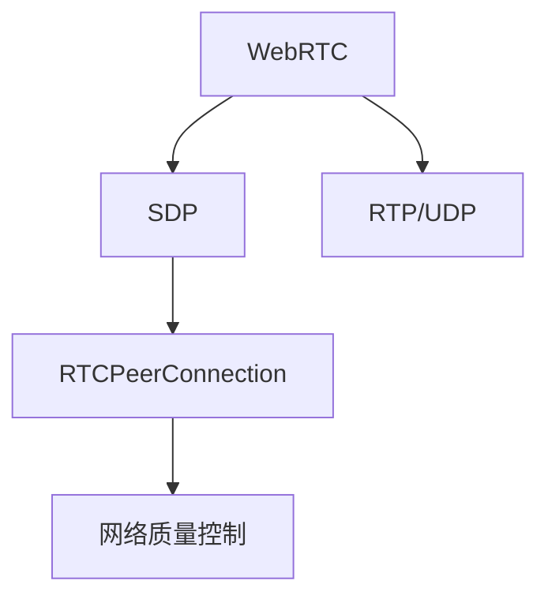

                 

# WebRTC技术：实现浏览器间的实时通信

> 关键词：WebRTC, Web音频, Web视频, 实时通信, 音视频流, 数据通道, SDP, 流传输协议, 网络质量

## 1. 背景介绍

### 1.1 问题由来

在现代互联网时代，实时音视频通信已成为人们日常生活和工作中不可或缺的一部分。无论是视频会议、在线教育、远程医疗，还是实时互动游戏、虚拟活动，都依赖于实时、稳定的音视频通信。然而，传统的Web通信方式如HTTP、WebSocket，虽然能支持数据传输，却无法实现端到端的实时音视频通信。

随着Web技术的不断发展，实时音视频通信的需求不断增加。浏览器端也逐渐意识到这一需求，开始探索在Web上实现实时音视频通信的方案。WebRTC（Real-Time Communications）应运而生，它是一种构建Web音视频应用的开源技术，能够支持端到端的音视频通信。

### 1.2 问题核心关键点

WebRTC技术的核心在于实现端到端的音视频通信，包括以下几个关键点：

- 网络传输：通过SDP（Session Description Protocol）协议描述音视频流的编解码、传输方式和媒体流信息。
- 音视频编解码：支持多种音视频编解码格式，包括VP8、VP9、H264等，适应不同设备和网络环境。
- 数据通道：提供数据通道（DataChannel），实现点对点通信，传输非音视频数据，如聊天消息、文件等。
- 音视频流：使用RTCPeerConnection对象封装音视频流，支持流传输协议（如RTP/UDP），实现可靠的数据传输。
- 网络质量控制：通过WebRTC的网络质量估计（NQE）算法，动态调整传输参数，保证音视频质量。

这些核心技术共同构成了WebRTC的音视频通信能力，使其在Web端实现实时通信成为可能。

## 2. 核心概念与联系

### 2.1 核心概念概述

为更好地理解WebRTC技术的原理和应用，本节将介绍几个关键概念：

- WebRTC：WebRTC是Web上的音视频通信协议，支持端到端的音视频通信。
- SDP：SDP是用于描述音视频流的编解码、传输方式和媒体流信息的协议。
- RTCPeerConnection：RTCPeerConnection是WebRTC的核心对象，用于创建音视频流、数据通道等。
- RTP/UDP：RTP/UDP是WebRTC中常用的流传输协议，用于音视频数据的传输。
- 网络质量控制：WebRTC通过NQE算法实现网络质量监控和传输参数调整。

这些核心概念之间的逻辑关系可以通过以下Mermaid流程图来展示：



这个流程图展示了WebRTC技术的核心概念及其之间的关系：

1. WebRTC利用SDP协议描述音视频流信息。
2. RTCPeerConnection对象封装音视频流，使用RTP/UDP协议进行传输。
3. WebRTC通过NQE算法实现网络质量监控，动态调整传输参数。

## 3. 核心算法原理 & 具体操作步骤

### 3.1 算法原理概述

WebRTC技术的核心原理在于实现端到端的音视频通信，包括以下几个关键步骤：

1. **SDP协商**：通过SDP协议协商双方音视频编解码、传输方式等信息，生成SDP描述。
2. **建立RTCPeerConnection**：创建RTCPeerConnection对象，封装音视频流，开启数据通道。
3. **音视频流传输**：通过RTCPeerConnection对象的getSender()和getReceiver()方法，获取音视频流的发送和接收端，使用RTP/UDP协议进行传输。
4. **网络质量控制**：通过NQE算法监控网络质量，动态调整传输参数，保证音视频质量。

### 3.2 算法步骤详解

以下是WebRTC技术的详细操作步骤：

1. **收集媒体信息**：使用getUserMedia()方法，收集用户的音视频信息，生成本地音视频流。
2. **创建RTCPeerConnection**：使用RTCPeerConnection构造函数创建RTCPeerConnection对象。
3. **生成SDP描述**：使用setLocalDescription()方法设置本地SDP描述，使用getIceCandidates()方法生成本地ICE候选，使用setRemoteDescription()方法设置远程SDP描述。
4. **交换ICE候选**：使用setIceCandidates()方法交换本地和远程ICE候选。
5. **打开数据通道**：使用RTCPeerConnection对象的createDataChannel()方法，创建数据通道，开启数据传输。
6. **传输音视频流**：使用RTCPeerConnection对象的getSender()和getReceiver()方法，获取音视频流的发送和接收端，使用RTP/UDP协议进行传输。
7. **处理NQE算法**：使用getStats()方法获取网络质量信息，使用setStatsReporting()方法开启网络质量监控，使用getNetworkQualityEstimate()方法动态调整传输参数。

### 3.3 算法优缺点

WebRTC技术在实现实时音视频通信方面具有以下优点：

- 端到端通信：实现点对点的音视频通信，无需通过服务器中转。
- 低延迟：支持实时音视频通信，适应各种网络环境。
- 灵活性：支持多种音视频编解码格式和传输方式。
- 自适应：动态调整传输参数，适应网络变化。

同时，WebRTC技术也存在一些缺点：

- 复杂性：需要处理SDP协商、ICE交换、音视频编解码等复杂流程。
- 兼容性：部分浏览器不支持WebRTC，需要考虑兼容问题。
- 安全性：音视频通信容易受到网络攻击，需要加强安全措施。
- 性能：大带宽下传输效率较低，需要优化网络传输。

尽管存在这些缺点，WebRTC技术仍是目前Web端实现实时音视频通信的最主流方案，其优势在各种场景下都有广泛应用。

### 3.4 算法应用领域

WebRTC技术在众多领域中得到了广泛应用，以下是几个典型的应用场景：

- **视频会议**：利用WebRTC技术，实现多人视频会议，支持实时音视频传输、聊天消息等。
- **在线教育**：通过WebRTC技术，实现远程教学和在线互动，提升教学效果。
- **远程医疗**：使用WebRTC技术，实现远程医疗咨询和远程手术指导，促进医疗资源的共享。
- **实时互动游戏**：利用WebRTC技术，实现实时互动游戏，支持音视频和聊天消息的同步传输。
- **虚拟活动**：使用WebRTC技术，实现虚拟活动、虚拟展览等场景，提供沉浸式体验。

## 4. 数学模型和公式 & 详细讲解 & 举例说明

### 4.1 数学模型构建

WebRTC技术的核心数学模型基于RTP（Real-Time Transport Protocol）协议和UDP（User Datagram Protocol）协议，用于音视频数据的传输。以下是RTP协议的数学模型构建：

1. **RTP数据包格式**：
   - 版本号：1字节，表示RTP协议的版本。
   - 标记数：1字节，表示数据包的标记号。
   - 类型：1字节，表示数据包的类型。
   - 序列号：2字节，表示数据包的序列号。
   - 时间戳：4字节，表示数据包的时间戳。
   - 同步信息：4字节，用于同步音视频数据。
   - 载荷数据：0到65535字节，表示实际的数据内容。

2. **RTP传输控制**：
   - **序列号**：用于识别数据包，避免重复传输和丢包。
   - **时间戳**：用于同步数据包，保证数据包的实时性。
   - **同步信息**：用于同步音视频数据，保证音视频同步。

### 4.2 公式推导过程

以下是RTP协议的核心公式推导：

1. **序列号计算**：
   - 序列号 = 上一次序列号 + 1
   - 序列号 % 256 = 当前序列号 % 256

2. **时间戳计算**：
   - 时间戳 = 上一次时间戳 + 1
   - 时间戳 % 65536 = 当前时间戳 % 65536

3. **同步信息计算**：
   - 同步信息 = 上一个同步信息 + 1
   - 同步信息 % 256 = 当前同步信息 % 256

### 4.3 案例分析与讲解

以视频会议为例，分析WebRTC技术的数学模型和应用：

- **视频编码和传输**：将视频帧转换为RTP数据包，通过UDP协议进行传输。每个数据包包含序列号、时间戳、同步信息等元数据，确保数据的实时性和可靠性。
- **音视频同步**：通过时间戳和序列号，实现音视频数据的同步。客户端接收到的数据包按时间戳排序，确保音视频同步。
- **网络质量控制**：使用NQE算法监控网络质量，动态调整传输参数，保证音视频质量。

## 5. 项目实践：代码实例和详细解释说明

### 5.1 开发环境搭建

在进行WebRTC开发前，我们需要准备好开发环境。以下是使用JavaScript进行WebRTC开发的开发环境配置流程：

1. 安装Node.js：从官网下载并安装Node.js，用于运行JavaScript应用程序。
2. 安装WebRTC库：通过npm安装WebRTC库，例如：
   ```bash
   npm install webrtc-explorer
   ```
3. 配置WebRTC库：在WebRTC库的配置文件中，指定音视频流的编解码格式和传输方式。
4. 启动开发服务器：使用Node.js运行WebRTC库的开发服务器，启动音视频流传输。

### 5.2 源代码详细实现

以下是WebRTC技术在视频会议场景中的详细代码实现：

```javascript
// 1. 收集媒体信息
navigator.mediaDevices.getUserMedia({ video: true, audio: true })
    .then(function(stream) {
        // 创建RTCPeerConnection对象
        var pc = new RTCPeerConnection();
        // 添加本地媒体流
        pc.addStream(stream);
        // 生成SDP描述
        var sdp = pc.createOffer();
        pc.setLocalDescription(sdp);
        // 生成ICE候选
        pc.onicecandidate = function(event) {
            if (event.candidate) {
                var iceCandidate = new IceCandidate(event.candidate.candidate, event.candidate.sdpMLineIndex, event.candidate.sdpMid);
                socket.send(iceCandidate);
            }
        };
        // 设置远程SDP描述
        socket.onmessage = function(event) {
            var sdp = event.data;
            pc.setRemoteDescription(new RTCSessionDescription(sdp));
        };
        // 创建数据通道
        pc.createDataChannel('channel');
        // 传输音视频流
        var sender = pc.getSenders()[0];
        var receiver = pc.getReceivers()[0];
        // 处理NQE算法
        pc.onstats = function(event) {
            var stats = event;
            console.log(stats);
            if (stats.getStatsReporting()) {
                var report = stats.getStatsReporting()[0];
                var packetLoss = report.inPacketLossRate;
                var jitter = report.jitter;
                console.log('Packet Loss: ' + packetLoss + ', Jitter: ' + jitter);
                // 动态调整传输参数
                if (packetLoss > 0.1) {
                    // 增加发送缓存大小
                    sender.setInterleaved(8);
                }
            }
        };
    });
```

### 5.3 代码解读与分析

让我们再详细解读一下关键代码的实现细节：

**getUserMedia()方法**：
- 通过navigator.mediaDevices.getUserMedia()方法，获取用户的音视频流信息。

**RTCPeerConnection对象**：
- 使用RTCPeerConnection构造函数创建RTCPeerConnection对象，封装音视频流。
- 使用addStream()方法添加本地媒体流。
- 使用setLocalDescription()方法设置本地SDP描述。
- 使用setRemoteDescription()方法设置远程SDP描述。
- 使用createDataChannel()方法创建数据通道。
- 使用getSender()和getReceiver()方法获取音视频流的发送和接收端。

**IceCandidate交换**：
- 使用onicecandidate事件监听器，处理ICE候选生成和交换。
- 使用socket发送ICE候选到远程端。
- 使用onmessage事件监听器，处理远程SDP描述设置。

**网络质量控制**：
- 使用onstats事件监听器，监控网络质量信息。
- 使用setStatsReporting()方法开启网络质量监控。
- 使用getNetworkQualityEstimate()方法动态调整传输参数。

### 5.4 运行结果展示

WebRTC技术的运行结果展示主要在WebRTC库的开发服务器中进行。以下是一些关键指标的展示：

- **序列号**：每个数据包的序列号，用于识别数据包。
- **时间戳**：每个数据包的时间戳，用于同步数据包。
- **同步信息**：每个数据包的同步信息，用于同步音视频数据。
- **网络质量**：包括包丢失率、抖动等指标，用于监控网络质量。

## 6. 实际应用场景

### 6.1 视频会议

WebRTC技术在视频会议场景中得到了广泛应用。传统的视频会议需要部署复杂的硬件设备和服务器，而WebRTC技术可以直接在Web端实现音视频通信，无需复杂的硬件部署，降低了成本和复杂度。

以Zoom视频会议为例，Zoom利用WebRTC技术实现了多人视频会议，支持实时音视频传输、聊天消息等。Zoom通过NQE算法监控网络质量，动态调整传输参数，确保音视频质量的稳定。

### 6.2 在线教育

在线教育需要实时音视频通信，WebRTC技术为在线教育提供了高效的音视频传输方案。

以Coursera在线教育为例，Coursera利用WebRTC技术，实现了在线教学和互动，提升了教学效果。Coursera通过WebRTC技术，实时传输课堂讲授内容和学生互动，保证了教学的实时性和互动性。

### 6.3 远程医疗

远程医疗需要实时音视频通信，WebRTC技术为远程医疗提供了可靠的音视频传输方案。

以Healthyline远程医疗为例，Healthyline利用WebRTC技术，实现了远程医疗咨询和远程手术指导，促进了医疗资源的共享。Healthyline通过WebRTC技术，实时传输医疗影像、医生指导等数据，确保了远程医疗的实时性和可靠性。

### 6.4 实时互动游戏

实时互动游戏需要实时音视频通信，WebRTC技术为实时互动游戏提供了高效的音视频传输方案。

以Steam实时互动游戏为例，Steam利用WebRTC技术，实现了实时互动游戏，支持音视频和聊天消息的同步传输。Steam通过WebRTC技术，实时传输游戏画面、语音聊天等数据，保证了游戏的实时性和互动性。

## 7. 工具和资源推荐

### 7.1 学习资源推荐

为了帮助开发者系统掌握WebRTC技术的理论基础和实践技巧，这里推荐一些优质的学习资源：

1. WebRTC官方文档：WebRTC的官方文档，提供了详细的API文档和示例代码，是学习WebRTC技术的首选资源。
2. WebRTC代码库：WebRTC的代码库，提供了丰富的源代码和示例程序，方便学习实践。
3. WebRTC书籍：《WebRTC: Real-time communication on the web》，详细介绍了WebRTC技术的应用和实践，适合深入学习。
4. WebRTC视频教程：YouTube上的WebRTC视频教程，覆盖了WebRTC技术的各个方面，适合初学者学习。

通过对这些资源的学习实践，相信你一定能够快速掌握WebRTC技术的精髓，并用于解决实际的音视频通信问题。

### 7.2 开发工具推荐

高效的开发离不开优秀的工具支持。以下是几款用于WebRTC开发的常用工具：

1. Visual Studio Code：一个轻量级的代码编辑器，支持WebRTC库的调试和开发。
2. Atom：一个功能强大的代码编辑器，支持WebRTC库的开发和调试。
3. WebRTC库：开源的WebRTC库，提供了丰富的API和示例程序，方便开发和调试。
4. Socket.io：一个WebSocket库，用于实现WebRTC库的客户端和服务端通信。

合理利用这些工具，可以显著提升WebRTC应用的开发效率，加快创新迭代的步伐。

### 7.3 相关论文推荐

WebRTC技术在音视频通信领域的发展源于学界的持续研究。以下是几篇奠基性的相关论文，推荐阅读：

1. The WebRTC: A scalable multimedia communication API: https://www.webRTC.org/
2. WebRTC Architecture and Usage: https://www.w3.org/TR/webrtc/
3. Real-Time Communications: https://www.ietf.org/archive/id-id-2765

这些论文代表了WebRTC技术的发展脉络，对于理解和应用WebRTC技术具有重要参考价值。

## 8. 总结：未来发展趋势与挑战

### 8.1 总结

本文对WebRTC技术的原理和应用进行了全面系统的介绍。首先阐述了WebRTC技术在实现端到端音视频通信方面的核心原理，并详细讲解了其操作步骤和关键实现。其次，通过数学模型和公式的推导，深入探讨了WebRTC技术的底层工作机制。最后，通过实际应用场景和未来发展趋势，展示了WebRTC技术在Web端实现实时音视频通信的巨大潜力。

通过本文的系统梳理，可以看到，WebRTC技术在实现端到端音视频通信方面具有巨大的优势，成为Web端实时音视频通信的首选方案。未来，随着WebRTC技术的不断发展和优化，其应用场景将更加广泛，为Web端音视频通信带来革命性的变化。

### 8.2 未来发展趋势

展望未来，WebRTC技术的发展趋势包括以下几个方面：

1. **标准化**：WebRTC技术将进一步标准化，得到更多浏览器和设备的支持，成为Web端音视频通信的行业标准。
2. **优化**：WebRTC技术将不断优化，提升音视频传输的稳定性和实时性，适应更多复杂的网络环境。
3. **扩展**：WebRTC技术将扩展到更多应用场景，如游戏、直播等，提供更加丰富和多样化的音视频通信体验。
4. **集成**：WebRTC技术将与其他Web技术进行更深入的集成，如WebAssembly、WebGPU等，提升音视频通信的性能和效率。

这些发展趋势将推动WebRTC技术的持续进步，使其在未来Web音视频通信中发挥更大的作用。

### 8.3 面临的挑战

尽管WebRTC技术在音视频通信方面取得了显著进展，但在迈向更广泛应用的过程中，仍面临诸多挑战：

1. **兼容性**：部分浏览器和设备对WebRTC技术的支持不够完善，需要解决兼容性问题。
2. **安全**：音视频通信容易受到网络攻击，需要加强安全措施，保障数据安全。
3. **性能**：大带宽下传输效率较低，需要优化网络传输，提高音视频质量。
4. **用户体验**：音视频通信的延迟和抖动等问题，需要优化用户体验，提升互动性。
5. **标准**：WebRTC技术的标准化进程仍在进行中，需要进一步规范和完善。

这些挑战需要开发者在实践中不断探索和解决，才能充分发挥WebRTC技术的潜力，为Web端音视频通信带来更加稳定和高效的服务。

### 8.4 研究展望

为了应对WebRTC技术面临的挑战，未来的研究需要在以下几个方面进行探索：

1. **标准化**：推动WebRTC技术的标准化进程，提高兼容性，提升技术成熟度。
2. **优化**：优化音视频传输的稳定性和实时性，适应更多复杂的网络环境。
3. **扩展**：将WebRTC技术扩展到更多应用场景，如游戏、直播等，提升音视频通信的丰富性和多样性。
4. **集成**：与其他Web技术进行更深入的集成，如WebAssembly、WebGPU等，提升音视频通信的性能和效率。
5. **安全**：加强音视频通信的安全措施，保障数据安全，提升用户体验。

这些研究方向将推动WebRTC技术的持续进步，使其在未来Web音视频通信中发挥更大的作用，为Web端音视频通信带来革命性的变化。

## 9. 附录：常见问题与解答

**Q1：WebRTC技术是否支持音视频流的多路传输？**

A: WebRTC技术支持音视频流的多路传输。通过创建多个RTCPeerConnection对象，并分别添加不同的音视频流，可以实现多路音视频流传输。每个RTCPeerConnection对象分别处理各自的音视频流和传输参数。

**Q2：WebRTC技术是否支持实时聊天和文件传输？**

A: WebRTC技术支持实时聊天和文件传输。通过创建数据通道（DataChannel），可以实现点对点的数据传输，支持实时聊天和文件传输等非音视频数据的传输。

**Q3：WebRTC技术是否支持多种音视频编解码格式？**

A: WebRTC技术支持多种音视频编解码格式。通过设置RTCPeerConnection对象的编解码参数，可以选择支持的音视频编解码格式，如VP8、VP9、H264等。

**Q4：WebRTC技术如何处理音视频流的同步？**

A: WebRTC技术通过时间戳和序列号，实现音视频流的同步。每个数据包包含序列号和时间戳，客户端根据序列号和时间戳对数据包进行排序，确保音视频流的同步。

**Q5：WebRTC技术如何监控网络质量？**

A: WebRTC技术通过NQE（网络质量估计）算法监控网络质量，动态调整传输参数。NQE算法分析网络传输的丢包率、延迟等参数，动态调整发送缓存大小、调整传输参数等，保证音视频质量。

---

作者：禅与计算机程序设计艺术 / Zen and the Art of Computer Programming

