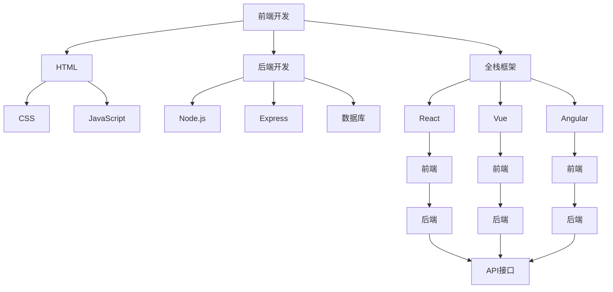

                 

# Web全栈开发：前后端技术全面掌握

> 关键词：Web开发,前后端技术,全栈开发,前端开发,后端开发,前端框架,后端框架,React,Vue,Node.js,Express,全栈框架,全栈学习路径

## 1. 背景介绍

在互联网和移动互联网的快速发展下，Web开发正经历着前所未有的变革。从传统的静态页面，到动态Web应用，再到现代的全栈开发，Web技术栈在不断演进。全栈开发，是指开发人员需要掌握前端和后端技术，能够独立完成Web应用的构建、部署和维护。本博客将全面介绍全栈开发的相关技术，并给出一套系统的学习路径，帮助读者全面掌握Web开发。

## 2. 核心概念与联系

### 2.1 核心概念概述

全栈开发要求开发者同时掌握前端和后端技术，具体包括但不限于以下概念：

- **前端开发**：主要关注用户界面的展示和交互，包括HTML、CSS、JavaScript等技术栈。
- **后端开发**：主要关注数据的处理和业务逻辑的实现，包括服务器端编程语言、数据库、API等技术栈。
- **全栈框架**：包括React、Vue、Angular等前端框架，以及Node.js、Express、Django等后端框架。

这些核心概念相互关联，共同构成了一个完整的Web应用系统。前端框架负责构建用户界面，而后端框架负责数据处理和业务逻辑，两者通过API接口进行交互。

### 2.2 核心概念原理和架构的 Mermaid 流程图



## 3. 核心算法原理 & 具体操作步骤

### 3.1 算法原理概述

全栈开发的核心在于将前端和后端技术有机结合，构建一个完整且流畅的Web应用系统。以下是从前端到后端的技术原理：

- **前端开发**：利用HTML、CSS、JavaScript等技术，构建用户界面，并提供与用户交互的响应。
- **后端开发**：使用Node.js、Express、Django等技术，实现数据处理、业务逻辑和API接口。
- **全栈框架**：通过React、Vue、Angular等前端框架和Node.js、Express、Django等后端框架，构建高效、可维护的全栈应用。

### 3.2 算法步骤详解

#### 3.2.1 前端开发流程

1. **需求分析**：明确用户需求和应用功能，确定前端展示界面和交互方式。
2. **UI设计**：设计页面布局和视觉元素，确保用户体验。
3. **HTML编写**：使用HTML语言编写页面结构和内容。
4. **CSS样式编写**：使用CSS语言进行页面样式设计，包括布局、颜色、字体等。
5. **JavaScript编写**：使用JavaScript语言实现页面交互和动态效果。
6. **测试和优化**：进行页面测试，确保功能正确，并进行性能优化。

#### 3.2.2 后端开发流程

1. **需求分析**：明确应用功能和技术要求，包括数据存储、API接口等。
2. **技术选型**：选择合适的前端和后端技术栈，如React和Node.js。
3. **API设计**：设计API接口，包括接口路径、请求方法和数据格式。
4. **数据存储**：选择合适的数据库，如MySQL、MongoDB等，并进行数据模型设计。
5. **业务逻辑编写**：使用Node.js和Express等技术编写业务逻辑，实现数据处理和业务逻辑。
6. **测试和优化**：进行API接口测试，确保功能正确，并进行性能优化。

#### 3.2.3 全栈开发流程

1. **需求分析**：明确用户需求和应用功能，确定前端展示界面和交互方式。
2. **UI设计**：设计页面布局和视觉元素，确保用户体验。
3. **前端框架选择**：选择合适的前端框架，如React或Vue。
4. **后端框架选择**：选择合适后端框架，如Node.js或Express。
5. **API设计**：设计API接口，包括接口路径、请求方法和数据格式。
6. **数据存储**：选择合适的数据库，如MySQL或MongoDB，并进行数据模型设计。
7. **全栈开发**：在前端框架和后端框架的配合下，完成全栈应用的构建。
8. **测试和优化**：进行全栈应用测试，确保功能正确，并进行性能优化。

### 3.3 算法优缺点

全栈开发的优点包括：

- **高效协作**：前端和后端开发者能够紧密合作，快速迭代开发。
- **代码复用**：前端和后端代码共享，减少冗余。
- **性能优化**：全栈开发能够更好地进行性能优化，提升用户体验。

缺点包括：

- **学习成本高**：需要掌握多个技术栈，学习成本较高。
- **开发难度大**：前端和后端技术的整合需要更多的时间和精力。
- **维护复杂**：全栈应用较为复杂，维护和调试难度较大。

### 3.4 算法应用领域

全栈开发适用于各种类型的Web应用，包括：

- **电商应用**：包括商品展示、购物车、支付等功能。
- **社交应用**：包括用户登录、消息推送、好友关系等功能。
- **企业管理系统**：包括项目管理、考勤管理、文档管理等功能。
- **在线教育平台**：包括课程展示、学习进度、作业提交等功能。
- **智能客服系统**：包括自然语言处理、对话生成等功能。

## 4. 数学模型和公式 & 详细讲解 & 举例说明

### 4.1 数学模型构建

本节将通过数学语言对全栈开发的核心算法进行描述。

假设开发一个电商应用，前端负责展示商品页面，后端负责处理订单和支付。

1. **前端页面展示**：
   - 使用HTML和CSS设计商品页面布局和样式。
   - 使用JavaScript实现动态效果，如商品轮播、价格显示等。

2. **后端订单处理**：
   - 使用Node.js和Express处理订单API请求。
   - 使用MySQL存储订单数据，并进行数据模型设计。
   - 使用业务逻辑实现订单生成、查询、更新等功能。

### 4.2 公式推导过程

#### 4.2.1 页面布局计算

假设商品页面需要显示n个商品，每行显示m个，页面总宽度为W。
- 计算每行商品数量：m = floor(W / w)，其中w为单个商品宽度。
- 计算页面总行数：n = floor(N / m)，其中N为商品总数。

#### 4.2.2 订单生成逻辑

假设订单生成逻辑如下：
- 用户点击下单按钮，发送API请求。
- 后端接收到请求，生成订单信息。
- 返回订单信息到前端，进行页面更新。

假设订单信息包含订单号、商品ID、商品数量、价格等信息，用数学公式表示为：
$$
\text{Order} = (\text{UserID}, \text{Items}, \text{Quantity}, \text{Price})
$$

其中，\text{UserID}为用户ID，\text{Items}为商品ID列表，\text{Quantity}为商品数量列表，\text{Price}为商品价格列表。

### 4.3 案例分析与讲解

#### 4.3.1 电商应用案例

假设开发一个电商应用，页面布局计算公式如下：

$$
\text{Layout} = (\text{商品ID}, \text{商品名称}, \text{商品图片}, \text{商品价格})
$$

其中，\text{商品ID}为商品唯一标识，\text{商品名称}为商品名称，\text{商品图片}为商品图片URL，\text{商品价格}为商品价格。

#### 4.3.2 订单生成案例

假设订单生成逻辑如下：

$$
\text{Order} = (\text{UserID}, \text{Items}, \text{Quantity}, \text{Price})
$$

其中，\text{UserID}为用户ID，\text{Items}为商品ID列表，\text{Quantity}为商品数量列表，\text{Price}为商品价格列表。

## 5. 项目实践：代码实例和详细解释说明

### 5.1 开发环境搭建

在进行全栈开发实践前，需要准备开发环境。以下是使用Node.js和React进行前端开发的开发环境配置流程：

1. **安装Node.js**：
   - 从官网下载并安装Node.js。
   - 配置环境变量，设置Node.js的路径。

2. **安装npm**：
   - 打开终端，运行 `npm install -g npm` 命令，安装npm全局版。

3. **创建项目文件夹**：
   - 使用命令行创建项目文件夹，进入项目目录。
   ```bash
   mkdir my-e-commerce-app
   cd my-e-commerce-app
   ```

4. **初始化项目**：
   - 使用 `npm init` 命令初始化项目，根据提示输入项目信息。
   ```bash
   npm init
   ```

5. **安装React**：
   - 使用 `npm install react react-dom` 命令安装React和React DOM库。
   ```bash
   npm install react react-dom
   ```

6. **创建React组件**：
   - 使用 `npm install create-react-app` 命令安装create-react-app工具，用于快速创建React项目。
   ```bash
   npm install create-react-app
   npx create-react-app my-e-commerce
   ```

### 5.2 源代码详细实现

以下是使用Node.js和Express进行后端开发的源代码实现：

#### 5.2.1 后端代码

1. **安装Express**：
   - 使用 `npm install express` 命令安装Express。
   ```bash
   npm install express
   ```

2. **创建Express应用**：
   - 创建一个名为 `app.js` 的文件，编写Express应用代码。
   ```javascript
   const express = require('express');
   const app = express();
   
   // 设置路由
   app.get('/api/products', (req, res) => {
     const products = [
       { id: 1, name: 'Product A', price: 100 },
       { id: 2, name: 'Product B', price: 200 },
       { id: 3, name: 'Product C', price: 300 },
     ];
     res.json(products);
   });
   
   // 启动服务器
   app.listen(3000, () => {
     console.log('Server started on port 3000');
   });
   ```

3. **运行Express应用**：
   - 在终端中运行 `node app.js` 命令启动Express应用。
   ```bash
   node app.js
   ```

#### 5.2.2 前端代码

1. **创建React组件**：
   - 在 `my-e-commerce` 目录中创建一个名为 `components/ProductList.js` 的文件，编写React组件代码。
   ```javascript
   import React from 'react';
   
   const ProductList = () => {
     const products = [
       { id: 1, name: 'Product A', price: 100 },
       { id: 2, name: 'Product B', price: 200 },
       { id: 3, name: 'Product C', price: 300 },
     ];
   
     return (
       <div>
         {products.map(product => (
           <div key={product.id}>
             <h2>{product.name}</h2>
             <p>{product.price}</p>
           </div>
         ))}
       </div>
     );
   };
   
   export default ProductList;
   ```

2. **使用React组件**：
   - 在 `App.js` 文件中，使用 `ProductList` 组件。
   ```javascript
   import React from 'react';
   import ProductList from './components/ProductList';
   
   const App = () => {
     return (
       <div>
         <h1>My E-Commerce App</h1>
         <ProductList />
       </div>
     );
   };
   
   export default App;
   ```

3. **运行React应用**：
   - 在终端中运行 `npm start` 命令启动React应用。
   ```bash
   npm start
   ```

### 5.3 代码解读与分析

#### 5.3.1 后端代码解读

- **安装Express**：使用 `npm install express` 命令安装Express。
- **创建Express应用**：使用 `const express = require('express');` 导入Express模块，创建 `app` 实例。
- **设置路由**：使用 `app.get('/api/products', ...)` 方法设置路由，返回商品数据。
- **启动服务器**：使用 `app.listen(3000, ...)` 方法启动服务器，监听端口3000。

#### 5.3.2 前端代码解读

- **创建React组件**：使用 `const ProductList = () => {...};` 声明一个名为 `ProductList` 的函数组件，渲染商品列表。
- **使用React组件**：在 `App.js` 文件中，使用 `import ProductList from './components/ProductList';` 导入 `ProductList` 组件，并使用 `<ProductList />` 渲染商品列表。

### 5.4 运行结果展示

- **后端**：运行 `node app.js` 命令启动Express应用，访问 `http://localhost:3000/api/products` 可获取商品数据。
- **前端**：运行 `npm start` 命令启动React应用，访问 `http://localhost:3000` 即可看到商品列表。

## 6. 实际应用场景

### 6.1 智能客服系统

全栈开发可以用于构建智能客服系统，满足企业对高效、精准的客户服务需求。

1. **需求分析**：确定客服系统的主要功能，如智能问答、聊天机器人、工单管理等。
2. **UI设计**：设计用户界面，包括聊天窗口、响应区域等。
3. **前端开发**：使用React等技术开发用户界面，实现聊天窗口、响应区域等功能的展示和交互。
4. **后端开发**：使用Node.js和Express等技术开发API接口，实现智能问答、聊天机器人等功能。
5. **全栈开发**：在前端和后端框架的配合下，完成智能客服系统的构建。
6. **测试和优化**：进行系统测试，确保功能正确，并进行性能优化。

### 6.2 在线教育平台

全栈开发可以用于构建在线教育平台，提供优质的课程内容和交互体验。

1. **需求分析**：确定在线教育平台的主要功能，如课程展示、学习进度、作业提交等。
2. **UI设计**：设计用户界面，包括课程列表、课程详情、作业提交页面等。
3. **前端开发**：使用React等技术开发用户界面，实现课程展示、学习进度、作业提交等功能的展示和交互。
4. **后端开发**：使用Node.js和Express等技术开发API接口，实现课程管理、作业批改、用户认证等功能。
5. **全栈开发**：在前端和后端框架的配合下，完成在线教育平台的构建。
6. **测试和优化**：进行系统测试，确保功能正确，并进行性能优化。

### 6.3 企业管理系统

全栈开发可以用于构建企业管理系统，提升企业的管理效率和决策支持能力。

1. **需求分析**：确定企业管理系统的主要功能，如项目管理、考勤管理、文档管理等。
2. **UI设计**：设计用户界面，包括项目列表、考勤记录、文档管理等。
3. **前端开发**：使用React等技术开发用户界面，实现项目列表、考勤记录、文档管理等功能的展示和交互。
4. **后端开发**：使用Node.js和Express等技术开发API接口，实现项目管理、考勤管理、文档管理等功能。
5. **全栈开发**：在前端和后端框架的配合下，完成企业管理系统的构建。
6. **测试和优化**：进行系统测试，确保功能正确，并进行性能优化。

## 7. 工具和资源推荐

### 7.1 学习资源推荐

为了帮助开发者全面掌握全栈开发，以下是一些优质的学习资源：

1. **《JavaScript高级程序设计》**：由Nicholas C. Zakas所著，深入讲解JavaScript语言和Web开发技术。
2. **《Node.js设计模式》**：由Jamie O'Hara所著，介绍Node.js中的设计模式和最佳实践。
3. **《React官方文档》**：React官方提供的详细文档，包含React的使用指南和API参考。
4. **《Express官方文档》**：Express官方提供的详细文档，包含Express的使用指南和API参考。
5. **《Node.js实战》**：由Jakob Kopecek所著，通过实战项目介绍Node.js的开发技巧和应用案例。

### 7.2 开发工具推荐

以下是一些常用的全栈开发工具：

1. **Visual Studio Code**：功能强大的代码编辑器，支持多种编程语言和框架。
2. **Sublime Text**：功能丰富的文本编辑器，支持多种插件和扩展。
3. **Git**：版本控制系统，方便代码协作和版本管理。
4. **Docker**：容器化平台，方便应用部署和管理。
5. **Jest**：JavaScript测试框架，支持单元测试和集成测试。

### 7.3 相关论文推荐

以下是一些全栈开发相关的论文，推荐阅读：

1. **《Web全栈开发：实践与挑战》**：介绍全栈开发的基本概念和实践方法，提出全栈开发的挑战和解决方案。
2. **《Web应用的全栈开发与测试》**：探讨全栈开发和测试的最佳实践，提出全栈开发中的测试策略和方法。
3. **《全栈开发与微服务架构》**：介绍全栈开发和微服务架构的结合，提出全栈微服务架构的设计思路和实现方法。

## 8. 总结：未来发展趋势与挑战

### 8.1 研究成果总结

全栈开发作为一种高效、灵活的Web开发模式，已经在电商、在线教育、智能客服等领域得到了广泛应用。以下是对全栈开发技术的研究总结：

1. **前端框架**：React、Vue、Angular等前端框架不断演进，提升开发效率和用户体验。
2. **后端框架**：Node.js、Express、Django等后端框架不断优化，提升系统性能和稳定性。
3. **全栈框架**：全栈框架如Next.js、Nest.js、Litium等不断涌现，提供一站式的开发解决方案。
4. **微服务架构**：微服务架构与全栈开发结合，提升系统的可维护性和可扩展性。

### 8.2 未来发展趋势

未来，全栈开发将呈现以下发展趋势：

1. **前端框架**：前端框架将继续演进，提升开发效率和性能。
2. **后端框架**：后端框架将继续优化，提升系统的稳定性和扩展性。
3. **全栈框架**：全栈框架将不断涌现，提供一站式的开发解决方案。
4. **微服务架构**：微服务架构与全栈开发结合，提升系统的可维护性和可扩展性。
5. **多端融合**：全栈开发将进一步扩展到移动端、桌面端等不同终端，提供一致的用户体验。

### 8.3 面临的挑战

虽然全栈开发具备诸多优势，但在实践中仍面临以下挑战：

1. **学习成本高**：需要掌握多个技术栈，学习成本较高。
2. **开发难度大**：前端和后端技术的整合需要更多的时间和精力。
3. **维护复杂**：全栈应用较为复杂，维护和调试难度较大。

### 8.4 研究展望

未来，全栈开发技术需要从以下方向进行深入研究：

1. **前端框架**：开发更高效、更易用的前端框架，提升开发效率和用户体验。
2. **后端框架**：优化后端框架性能和稳定性，提升系统可维护性和扩展性。
3. **全栈框架**：构建更易用、更灵活的全栈框架，提供一站式的开发解决方案。
4. **微服务架构**：探索微服务架构与全栈开发的结合，提升系统的可维护性和可扩展性。

总之，全栈开发技术需要不断探索和优化，才能更好地满足用户需求，提升开发效率和系统性能。

## 9. 附录：常见问题与解答

### 9.1 常见问题

**Q1：全栈开发和前后端分离有什么不同？**

A: 全栈开发是指前端和后端技术由同一个开发团队负责，前后端分离则由不同的团队分别负责前端和后端开发。全栈开发的优势在于前后端团队协作更加紧密，开发效率更高，但学习成本也更高。前后端分离的优势在于团队分工明确，每个团队专注于自己擅长的领域，但协作难度较大。

**Q2：全栈开发需要掌握哪些技术？**

A: 全栈开发需要掌握以下技术：
1. HTML、CSS、JavaScript等前端技术。
2. Node.js、Express、Django等后端技术。
3. React、Vue、Angular等前端框架。
4. Docker、Git等开发工具。

**Q3：如何选择合适的全栈框架？**

A: 选择合适的全栈框架需要考虑以下几个因素：
1. 技术成熟度：选择成熟稳定的框架，确保开发效率和系统性能。
2. 社区活跃度：选择活跃的框架，获取丰富的社区支持和资源。
3. 生态系统：选择生态系统完善的框架，获取更多的插件和扩展。
4. 开发成本：考虑框架的学习成本和开发难度。

**Q4：全栈开发中如何实现前后端数据同步？**

A: 实现前后端数据同步需要以下几个步骤：
1. 确定数据格式：确定前后端数据格式的一致性。
2. 使用API接口：通过API接口实现前后端数据传输。
3. 版本控制：使用版本号控制数据同步，避免冲突和重复。
4. 实时同步：使用WebSocket或长轮询等技术实现实时数据同步。

**Q5：全栈开发中如何提高系统性能？**

A: 提高系统性能需要以下几个方法：
1. 优化前端代码：减少页面加载时间和渲染时间。
2. 优化后端代码：减少数据库查询时间和业务处理时间。
3. 使用缓存技术：使用缓存技术减少重复计算和数据库查询。
4. 使用CDN技术：使用CDN技术加速静态资源加载。

总之，全栈开发需要不断优化和迭代，才能提升系统性能和用户体验。

### 9.2 解答

通过以上全面介绍，相信读者已经对全栈开发有了深入的了解，掌握了前端和后端开发的基本方法和实践技巧。掌握全栈开发技术，不仅能够提升开发效率和系统性能，还能拓展开发者的技术视野和职业发展空间。希望读者能够在未来的开发实践中，不断探索和创新，创造更加优质的Web应用。

---

作者：禅与计算机程序设计艺术 / Zen and the Art of Computer Programming

