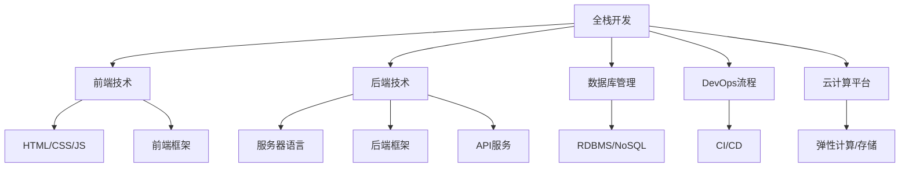

                 

# Web全栈开发：前端到后端的完整技术栈

> 关键词：全栈开发,前端,后端,数据库,DevOps,云计算,微服务,RESTful API,框架,版本控制

## 1. 背景介绍

### 1.1 问题由来
随着互联网应用的迅速发展，Web应用程序的复杂度和功能需求日益增加，单一的前端或后端开发已无法满足需求。全栈开发成为解决这一问题的重要途径，它要求开发者具备前端和后端开发的知识，能够从用户界面到服务器端的各个层面进行高效开发。然而，Web全栈开发并非简单地将前端和后端技术拼凑在一起，而是需要一个系统的技术栈和协同开发方法。

### 1.2 问题核心关键点
全栈开发的核心关键点在于如何将前端和后端技术紧密结合起来，构建一个稳定、高效、易扩展的Web应用系统。这包括选择合适的技术栈、设计良好的数据存储和处理方案、实施有效的DevOps流程、采用云计算平台等。

## 2. 核心概念与联系

### 2.1 核心概念概述

为更好地理解Web全栈开发，本节将介绍几个密切相关的核心概念：

- 全栈开发(Full-Stack Development)：指开发者能够从前端界面到后端服务器端进行全方位开发的能力。全栈开发者需要掌握前端技术、后端技术、数据库管理、DevOps流程、云计算等综合技能。

- 前端技术(Frontend Technologies)：包括HTML/CSS/JavaScript等Web前端语言和框架，负责用户界面的展示和交互逻辑的实现。

- 后端技术(Backend Technologies)：包括各种服务器端语言和框架，如Node.js、Django、Ruby on Rails等，负责数据处理、业务逻辑实现和接口服务。

- 数据库管理(Database Management)：涉及关系型数据库(RDBMS)如MySQL、PostgreSQL和NoSQL数据库如MongoDB、Redis，用于存储和管理应用程序的数据。

- DevOps流程(DevOps Processes)：涵盖持续集成(CI)、持续部署(CD)、容器化、自动化测试等，提升开发效率和系统稳定性。

- 云计算平台(Cloud Platforms)：如AWS、Azure、Google Cloud，提供弹性的计算资源和自动化管理工具，降低运维成本，加速应用部署。

这些核心概念之间的逻辑关系可以通过以下Mermaid流程图来展示：



这个流程图展示了全栈开发各个方面的技术栈组成和它们之间的关系：

1. 全栈开发需要涵盖前端和后端技术。
2. 前端技术包括HTML/CSS/JS，以及流行的前端框架如React、Vue等。
3. 后端技术包括服务器语言和框架如Node.js、Django等，以及API服务实现。
4. 数据库管理使用关系型或NoSQL数据库，用于存储和管理数据。
5. DevOps流程涵盖自动化测试、持续集成/部署、容器化等，提升开发和部署效率。
6. 云计算平台提供弹性计算和存储资源，支持应用的快速部署和扩展。

## 3. 核心算法原理 & 具体操作步骤
### 3.1 算法原理概述

全栈开发的本质是将前端和后端技术无缝结合，构建一个完整的应用系统。其核心算法原理主要包括：

- 前端渲染引擎：如浏览器的JavaScript引擎，负责解析和渲染前端页面。
- HTTP/RESTful API：用于前端和后端之间的数据交互，实现前后端分离。
- 数据存储和查询：通过关系型或NoSQL数据库存储和检索数据。
- 后端业务逻辑：通过服务器端语言和框架实现业务逻辑，处理用户请求和数据操作。

### 3.2 算法步骤详解

全栈开发的实现步骤通常包括以下几个关键环节：

1. **需求分析与设计**：明确业务需求，设计前端和后端架构，选择合适的技术栈和数据库。

2. **前端开发**：使用HTML/CSS/JS等语言和框架，构建前端页面和交互逻辑。

3. **后端开发**：选择服务器端语言和框架，设计API接口，实现后端业务逻辑。

4. **数据库设计**：根据业务需求设计数据库结构，选择合适的存储引擎和数据模型。

5. **API集成**：在前端和后端之间建立HTTP/RESTful API接口，实现数据交换。

6. **DevOps流程实施**：使用CI/CD工具，实现代码自动化构建、测试和部署。

7. **部署和运维**：将应用部署到云计算平台，实施监控和运维管理。

### 3.3 算法优缺点

全栈开发具有以下优点：

- **高效开发**：前端和后端开发协同进行，缩短开发周期，提升开发效率。
- **提升用户体验**：前端技术可以实现更丰富的用户界面和交互体验。
- **系统可扩展性**：前后端分离，使系统更易于扩展和维护。
- **数据一致性**：统一的数据存储和访问方式，保证数据一致性和安全性。

同时，全栈开发也存在一些局限性：

- **技术栈复杂**：需要掌握多个技术领域，学习成本高。
- **人才短缺**：全栈开发人才较为稀缺，招聘困难。
- **开发难度高**：前后端协同开发，容易出现协同问题。
- **维护成本高**：系统复杂，维护难度大，故障定位困难。

尽管如此，全栈开发依然是大规模Web应用开发的主流方式，特别是在高互动性、高复杂度的应用场景中。

### 3.4 算法应用领域

全栈开发技术广泛应用在以下领域：

- **电商系统**：包含前端展示、后端业务处理、数据库管理、DevOps流程、云计算支持，实现完整的电商功能。
- **社交媒体平台**：涉及用户界面设计、消息推送、用户关系管理等，前后端协同实现实时互动。
- **企业管理系统**：包括员工信息管理、财务处理、项目管理等功能，前后端技术协同提供完整的业务解决方案。
- **物联网应用**：集成前端设备接口和后端数据分析，实现设备数据管理和实时监控。
- **健康医疗应用**：提供患者健康数据展示、医生协作平台、医疗记录管理等功能，前后端协同提供精准医疗服务。

## 4. 数学模型和公式 & 详细讲解 & 举例说明

### 4.1 数学模型构建

本节将使用数学语言对Web全栈开发的关键部分进行更加严格的刻画。

- **前端渲染模型**：假设用户请求URL为 $u$，浏览器渲染页面的过程可以表示为函数 $R(u)$，输出为用户界面 $I(u)$。
- **HTTP请求与响应**：假设后端API接口为 $A(u)$，接收用户请求 $u$，输出响应结果 $R(u)$。
- **数据存储与检索**：假设数据库查询函数为 $D(Q)$，接收查询条件 $Q$，输出查询结果 $R(Q)$。
- **后端业务逻辑**：假设业务处理函数为 $B(S)$，接收服务请求 $S$，输出业务处理结果 $R(S)$。

### 4.2 公式推导过程

以一个简单的电商系统为例，用户登录过程的数学模型推导如下：

1. **前端渲染模型**：
   $$
   R(u) = UI(u)
   $$
2. **HTTP请求与响应**：
   $$
   A(u) = \{login请求, username, password\}
   $$
   $$
   R(u) = \{登录结果, token\}
   $$
3. **数据存储与检索**：
   $$
   D(Q) = \{查询条件, 用户名, 密码\}
   $$
   $$
   R(Q) = \{用户信息\}
   $$
4. **后端业务逻辑**：
   $$
   B(S) = \{用户请求, 登录信息\}
   $$
   $$
   R(S) = \{登录成功, token\}
   $$

结合上述模型，可以推导出用户登录过程的完整流程：

- 用户在前端页面输入用户名和密码，请求渲染登录界面。
- 浏览器渲染页面，发送登录请求到后端API。
- 后端API接收请求，调用业务逻辑处理函数，向数据库查询用户信息。
- 数据库查询函数返回用户信息，后端API处理登录请求，生成登录结果和token。
- 后端API将结果返回给浏览器，前端渲染登录结果。

### 4.3 案例分析与讲解

以电商系统的商品搜索功能为例，分析全栈开发的各个环节。

1. **前端开发**：使用React框架开发商品搜索界面，包括搜索框、搜索按钮、搜索结果展示等。
2. **后端开发**：使用Django框架开发商品搜索API，接收用户搜索请求，调用后端业务逻辑。
3. **数据库设计**：设计商品信息表，包括商品ID、名称、价格、类别等字段。
4. **API集成**：在前端和后端之间建立RESTful API接口，实现商品数据交换。
5. **DevOps流程**：使用Jenkins实现CI/CD流程，自动化构建、测试和部署应用。
6. **部署和运维**：将应用部署到AWS云平台，使用ECS容器服务，实施弹性扩展和监控管理。

通过全栈开发，实现商品搜索功能从输入、处理到展示的完整流程。用户输入搜索关键字，前端页面实时渲染搜索结果，后端API查询商品信息，业务逻辑处理返回结果，数据库存储管理商品数据，DevOps流程确保系统稳定，云计算平台提供弹性资源。

## 5. 项目实践：代码实例和详细解释说明
### 5.1 开发环境搭建

在进行全栈开发实践前，我们需要准备好开发环境。以下是使用Node.js和Django进行Web全栈开发的环境配置流程：

1. 安装Node.js：从官网下载并安装Node.js，使用npm进行包管理。
2. 安装Django：使用pip安装Django框架，创建Django项目。
3. 安装数据库：安装MySQL数据库，配置Django的数据库连接。
4. 安装前端框架：安装React或Vue框架，创建前端项目。
5. 安装CI/CD工具：安装Jenkins或GitLab，配置CI/CD流程。
6. 安装云计算平台：安装AWS或Azure，创建云计算实例。

完成上述步骤后，即可在开发环境中开始全栈开发实践。

### 5.2 源代码详细实现

以下是一个简单的电商系统商品搜索功能的PyTorch代码实现，用于展示全栈开发的各个环节。

**前端代码**：
```javascript
import React from 'react';
import axios from 'axios';

class SearchBar extends React.Component {
    constructor(props) {
        super(props);
        this.state = {
            searchQuery: '',
            searchResults: []
        }
    }

    handleChange = (event) => {
        this.setState({ searchQuery: event.target.value });
    }

    handleSearch = () => {
        axios.get('/api/search', {
            params: { query: this.state.searchQuery }
        }).then(response => {
            this.setState({ searchResults: response.data.results });
        });
    }

    render() {
        return (
            <div>
                <input type="text" placeholder="Search" onChange={this.handleChange} />
                <button onClick={this.handleSearch}>Search</button>
                <ul>
                    {this.state.searchResults.map(result => 
                        <li key={result.id}>{result.name}</li>
                    )}
                </ul>
            </div>
        );
    }
}

export default SearchBar;
```

**后端代码**：
```python
from django.http import JsonResponse
from django.views.decorators.csrf import csrf_exempt
import models

@csrf_exempt
def search(request):
    if request.method == 'GET':
        query = request.GET.get('query')
        results = models.Product.objects.filter(name__icontains=query).values_list('name', flat=True)
        return JsonResponse({ 'results': list(results) })
```

**数据库代码**：
```python
from django.db import models

class Product(models.Model):
    name = models.CharField(max_length=255)
    price = models.DecimalField(max_digits=10, decimal_places=2)
    category = models.CharField(max_length=255)

    def __str__(self):
        return self.name
```

**DevOps配置**：
- 使用Jenkins配置CI/CD流程，自动构建和测试应用。
- 使用Docker容器化应用，实现快速部署和回滚。
- 使用ECS弹性扩展实例，支持高并发负载。
- 使用监控工具（如Prometheus、Grafana）监控应用性能和资源使用情况。

**部署和运维**：
- 将应用部署到AWS ECS，使用Elastic Beanstalk管理。
- 使用AWS S3存储静态资源，CDN加速页面加载。
- 使用AWS RDS管理数据库，确保数据安全。
- 使用AWS CloudWatch监控日志和系统状态，设置告警规则。

通过以上代码和配置，实现了商品搜索功能的全栈开发。前端通过React框架实现用户界面，后端使用Django框架开发API接口，数据库使用MySQL存储商品信息，DevOps流程通过Jenkins自动化构建和部署，云计算平台使用AWS提供弹性资源和监控管理。

### 5.3 代码解读与分析

让我们再详细解读一下关键代码的实现细节：

**前端代码**：
- 使用React组件实现搜索界面，包含搜索框、搜索按钮和搜索结果列表。
- 在前端代码中，使用了Axios库发送HTTP请求，接收后端API返回的搜索结果。

**后端代码**：
- 使用Django框架开发API接口，接收GET请求参数。
- 在后端代码中，使用了Django的ORM工具操作数据库，查询商品信息。

**数据库代码**：
- 使用Django的Model定义商品表结构，包含商品名称、价格和类别等字段。
- 在数据库代码中，使用了Django的内置字段类型，方便数据库迁移和管理。

**DevOps配置**：
- 使用Jenkins配置CI/CD流程，使用Jenkinsfile定义自动化构建和测试任务。
- 在CI/CD配置中，使用了Docker镜像构建应用，确保构建环境的一致性。

**部署和运维**：
- 使用AWS ECS部署应用，使用Elastic Beanstalk管理实例。
- 在ECS配置中，使用了Docker容器实现应用的快速部署和扩展。
- 在ECS配置中，使用了云服务提供弹性扩展和负载均衡功能。

通过以上分析和实践，可以更深入理解全栈开发的各个环节，掌握前端的用户界面设计，后端的API接口开发，数据库的设计和管理，DevOps流程的自动化，以及云计算平台的弹性资源管理。

## 6. 实际应用场景
### 6.1 智能客服系统

基于全栈开发的智能客服系统，可以为用户提供7x24小时不间断的服务。在前端使用React框架实现用户界面，后端使用Node.js和Django框架实现API接口，数据库使用MySQL存储聊天记录，DevOps流程通过Jenkins自动化构建和部署，云计算平台使用AWS提供弹性资源和监控管理。

智能客服系统的主要功能包括：
- 用户界面：包含文字聊天窗口、语音输入、表情符号等。
- API接口：接收用户请求，调用后端业务逻辑，返回聊天结果。
- 数据库：存储聊天记录、用户信息、机器学习模型等。
- DevOps流程：使用CI/CD自动化构建和部署，保证系统稳定。
- 云计算平台：提供弹性计算资源，支持高并发负载。

通过全栈开发，实现智能客服系统的从用户界面到后端服务器的完整流程。用户输入问题，前端页面实时渲染聊天记录，后端API调用业务逻辑处理，数据库存储聊天记录，DevOps流程确保系统稳定，云计算平台提供弹性资源。

### 6.2 电商系统

基于全栈开发的电商系统，涵盖前端展示、后端业务处理、数据库管理、DevOps流程、云计算支持，实现完整的电商功能。在前端使用React框架实现商品展示、购物车、结算页面等，后端使用Django框架开发API接口，处理订单、库存、用户信息等，数据库使用MySQL存储商品信息、订单信息、用户信息等，DevOps流程通过Jenkins自动化构建和部署，云计算平台使用AWS提供弹性资源和监控管理。

电商系统的核心功能包括：
- 商品展示：在前端展示商品图片、名称、价格等信息。
- 购物车管理：在前端实现购物车添加、删除、结算等功能。
- 订单处理：在后端处理订单信息，生成订单发票，管理库存等。
- 数据库管理：使用MySQL存储商品信息、订单信息、用户信息等。
- DevOps流程：使用CI/CD自动化构建和部署，确保系统稳定。
- 云计算平台：提供弹性计算资源，支持高并发负载。

通过全栈开发，实现电商系统的从商品展示到订单处理的完整流程。用户在前端浏览商品，选择商品添加到购物车，结算生成订单，后端API处理订单信息，数据库存储订单信息，DevOps流程确保系统稳定，云计算平台提供弹性资源。

### 6.3 企业管理系统

基于全栈开发的企业管理系统，涵盖前端界面设计、后端业务逻辑、数据库管理、DevOps流程、云计算支持，提供完整的业务解决方案。在前端使用Vue框架实现员工信息管理、项目进度跟踪等界面，后端使用Node.js和Django框架开发API接口，处理员工信息、财务数据、项目进度等，数据库使用PostgreSQL存储数据，DevOps流程通过GitLab自动化构建和部署，云计算平台使用AWS提供弹性资源和监控管理。

企业管理系统的主要功能包括：
- 员工信息管理：在前端展示员工信息，包括姓名、职位、联系信息等。
- 财务处理：在后端处理财务报表、预算、报销等业务。
- 项目管理：在前端展示项目进度，包括任务分配、进度跟踪等。
- 数据库管理：使用PostgreSQL存储员工信息、财务数据、项目信息等。
- DevOps流程：使用CI/CD自动化构建和部署，确保系统稳定。
- 云计算平台：提供弹性计算资源，支持高并发负载。

通过全栈开发，实现企业管理系统的从员工信息管理到财务处理的完整流程。用户在前端查看员工信息，提交财务报表，跟踪项目进度，后端API处理财务数据，数据库存储财务信息，DevOps流程确保系统稳定，云计算平台提供弹性资源。

### 6.4 未来应用展望

随着Web全栈开发的普及和技术的不断进步，未来将有更多的应用场景得到拓展和优化：

- **物联网应用**：集成前端设备接口和后端数据分析，实现设备数据管理和实时监控。
- **健康医疗应用**：提供患者健康数据展示、医生协作平台、医疗记录管理等功能，前后端协同提供精准医疗服务。
- **社交媒体平台**：涉及用户界面设计、消息推送、用户关系管理等，前后端协同实现实时互动。
- **智能家居系统**：涵盖前端智能设备控制、后端系统集成、云计算支持，实现全屋自动化。
- **在线教育平台**：包含前端课程展示、后端课程管理、数据库存储、DevOps流程、云计算支持，提供完整的在线教育解决方案。

未来，随着技术的不断进步和应用的不断扩展，Web全栈开发将继续发挥重要作用，推动Web应用的智能化、个性化、协同化发展。

## 7. 工具和资源推荐
### 7.1 学习资源推荐

为了帮助开发者系统掌握Web全栈开发的技术栈和实践技巧，这里推荐一些优质的学习资源：

1. **《JavaScript高级程序设计》**：由《JavaScript权威指南》作者编写的经典教材，涵盖JavaScript的各个方面，从基础语法到高级特性都有详细介绍。
2. **《Django Web Development》**：由Django官方文档的作者编写的权威教程，深入浅出地介绍了Django框架的各个模块和特性。
3. **《Vue.js权威指南》**：由Vue.js核心团队成员编写的官方教程，涵盖了Vue框架的各个方面，从基础语法到高级特性都有详细介绍。
4. **《Node.js设计模式》**：由Node.js核心团队成员编写的技术书籍，介绍了Node.js平台下的常见设计模式和最佳实践。
5. **《Web全栈开发：从零开始构建Web应用》**：一本系统介绍全栈开发技术的书籍，涵盖前端、后端、数据库、DevOps等各个环节。
6. **《全栈开发实战》**：由知名全栈开发者编写的实战手册，涵盖Node.js、React、MongoDB、Django等技术栈的实践技巧。

通过对这些资源的学习实践，相信你一定能够快速掌握Web全栈开发的核心技术，并应用于实际开发中。

### 7.2 开发工具推荐

高效的开发离不开优秀的工具支持。以下是几款用于Web全栈开发开发的常用工具：

1. **Visual Studio Code**：轻量级的代码编辑器，支持多种语言和框架，具有丰富的插件生态系统。
2. **npm/yarn**：Node.js的包管理工具，方便安装和管理依赖包。
3. **Postman**：HTTP请求测试工具，方便测试后端API接口。
4. **Django Debugger**：Django框架的调试工具，方便调试前后端代码。
5. **Git**：版本控制系统，方便代码版本控制和协作开发。
6. **Docker**：容器化技术，方便应用程序的打包和部署。
7. **Jenkins**：自动化工具，方便CI/CD流程的构建和部署。
8. **AWS ECS/Elastic Beanstalk**：云计算平台，提供弹性计算资源和自动化管理工具。

合理利用这些工具，可以显著提升Web全栈开发任务的开发效率，加快创新迭代的步伐。

### 7.3 相关论文推荐

Web全栈开发技术的发展源于学界的持续研究。以下是几篇奠基性的相关论文，推荐阅读：

1. **《JavaScript: The Good Parts》**：由Douglas Crockford编写的经典书籍，涵盖JavaScript的各个方面，提出了“优秀部分”的概念。
2. **《Django Tutorial》**：由Django官方文档的作者编写的权威教程，深入浅出地介绍了Django框架的各个模块和特性。
3. **《Vue.js Router》**：由Vue.js官方文档的作者编写的技术论文，介绍了Vue.js路由模块的实现原理和用法。
4. **《Node.js Performance Tuning》**：由Node.js核心团队成员编写的技术论文，介绍了Node.js平台的性能调优技巧。
5. **《Web全栈开发：从零开始构建Web应用》**：一本系统介绍全栈开发技术的书籍，涵盖前端、后端、数据库、DevOps等各个环节。
6. **《全栈开发实战》**：由知名全栈开发者编写的实战手册，涵盖Node.js、React、MongoDB、Django等技术栈的实践技巧。

这些论文代表了大全栈开发技术的发展脉络。通过学习这些前沿成果，可以帮助研究者把握学科前进方向，激发更多的创新灵感。

## 8. 总结：未来发展趋势与挑战
### 8.1 总结

本文对Web全栈开发进行了全面系统的介绍。首先阐述了全栈开发的背景和意义，明确了全栈开发者需要掌握的技术栈和协同开发方法。其次，从原理到实践，详细讲解了全栈开发的数学模型和关键步骤，给出了全栈开发任务开发的完整代码实例。同时，本文还广泛探讨了全栈开发在电商、社交媒体、企业管理等诸多领域的应用前景，展示了全栈开发的巨大潜力。此外，本文精选了全栈开发的各类学习资源，力求为读者提供全方位的技术指引。

通过本文的系统梳理，可以看到，全栈开发技术已经成为Web应用开发的主流方式，极大地提升了开发效率和系统稳定性。全栈开发使前端和后端技术无缝结合，构建了完整的应用系统，为用户提供了更丰富的用户体验。未来，随着技术的不断进步和应用的不断扩展，全栈开发将继续发挥重要作用，推动Web应用的智能化、个性化、协同化发展。

### 8.2 未来发展趋势

展望未来，全栈开发技术将呈现以下几个发展趋势：

1. **技术栈多样化**：随着Web应用的不断扩展，全栈开发将涵盖更多技术栈，如React、Vue、Django、Node.js、MongoDB等，满足不同应用场景的需求。
2. **前端与后端分离**：逐渐采用微服务架构，将前后端分离，提升开发效率和系统可扩展性。
3. **DevOps普及化**：推广DevOps理念，实施自动化构建、测试和部署，提升开发效率和系统稳定性。
4. **云计算平台普及化**：使用云计算平台提供弹性计算资源，支持高并发负载和自动化管理。
5. **容器化趋势**：采用容器化技术，实现应用程序的打包和部署，提升开发效率和系统可移植性。
6. **数据驱动化**：采用数据驱动的开发方式，将数据模型和算法模型融入到应用中，提升系统智能化水平。

以上趋势凸显了全栈开发技术的广泛应用前景。这些方向的探索发展，必将进一步提升Web应用系统的开发效率和性能，为Web应用提供更加全面、高效、灵活的解决方案。

### 8.3 面临的挑战

尽管全栈开发技术已经取得了瞩目成就，但在迈向更加智能化、普适化应用的过程中，它仍面临着诸多挑战：

1. **技术栈复杂**：需要掌握多个技术领域，学习成本高。
2. **人才短缺**：全栈开发人才较为稀缺，招聘困难。
3. **开发难度高**：前后端协同开发，容易出现协同问题。
4. **维护成本高**：系统复杂，维护难度大，故障定位困难。
5. **性能优化难**：需要兼顾前端和后端性能，优化难度大。
6. **安全问题多**：前端和后端协同开发，安全漏洞易被利用。

尽管如此，全栈开发依然是大规模Web应用开发的主流方式，特别是在高互动性、高复杂度的应用场景中。

### 8.4 研究展望

面对全栈开发所面临的种种挑战，未来的研究需要在以下几个方面寻求新的突破：

1. **前后端协同优化**：采用微服务架构，提升前后端协同开发效率，降低协同问题。
2. **自动化测试与部署**：推广DevOps理念，实施自动化构建、测试和部署，提升开发效率和系统稳定性。
3. **容器化与云计算**：采用容器化技术，实现应用程序的打包和部署，提升开发效率和系统可移植性。
4. **数据驱动与智能应用**：采用数据驱动的开发方式，将数据模型和算法模型融入到应用中，提升系统智能化水平。
5. **全栈安全性**：加强安全检测和防御，避免前端和后端安全漏洞。
6. **用户体验优化**：采用前端优化技术，提升用户体验，降低用户流失率。

这些研究方向的发展，将引领全栈开发技术迈向更高的台阶，为Web应用提供更加全面、高效、安全、智能的解决方案。面向未来，全栈开发技术还需要与其他人工智能技术进行更深入的融合，如知识表示、因果推理、强化学习等，多路径协同发力，共同推动Web应用的进步。只有勇于创新、敢于突破，才能不断拓展Web应用系统的边界，让全栈开发技术在更广阔的领域中发挥更大的作用。

## 9. 附录：常见问题与解答

**Q1：全栈开发是否需要掌握所有技术栈？**

A: 全栈开发并不需要掌握所有技术栈，而是需要掌握核心技术栈和协同开发方法。对于特定领域的应用，可以选择合适的技术栈进行开发。例如，电商应用可以使用Node.js和Django，社交媒体应用可以使用React和Node.js，企业管理系统可以使用Vue和Django。

**Q2：全栈开发是否需要掌握DevOps流程？**

A: 全栈开发需要掌握DevOps流程，实现自动化构建、测试和部署，提升开发效率和系统稳定性。DevOps流程涵盖CI/CD、容器化、自动化测试等，是全栈开发的重要组成部分。

**Q3：全栈开发是否需要掌握云计算平台？**

A: 全栈开发需要掌握云计算平台，使用弹性计算资源和自动化管理工具，降低运维成本，加速应用部署。云计算平台涵盖弹性计算、存储、容器化、监控管理等，是全栈开发的重要组成部分。

**Q4：全栈开发是否需要掌握前端与后端的分离技术？**

A: 全栈开发需要掌握前端与后端的分离技术，采用微服务架构，提升前后端协同开发效率，降低协同问题。微服务架构将前后端分离，实现服务的模块化和解耦。

**Q5：全栈开发是否需要掌握数据驱动的开发方式？**

A: 全栈开发需要掌握数据驱动的开发方式，将数据模型和算法模型融入到应用中，提升系统智能化水平。数据驱动的开发方式需要引入机器学习、数据可视化等技术，实现数据驱动的决策和反馈。

通过以上分析和实践，可以更深入理解全栈开发的各个环节，掌握前端的用户界面设计，后端的API接口开发，数据库的设计和管理，DevOps流程的自动化，以及云计算平台的弹性资源管理。

---

作者：禅与计算机程序设计艺术 / Zen and the Art of Computer Programming

