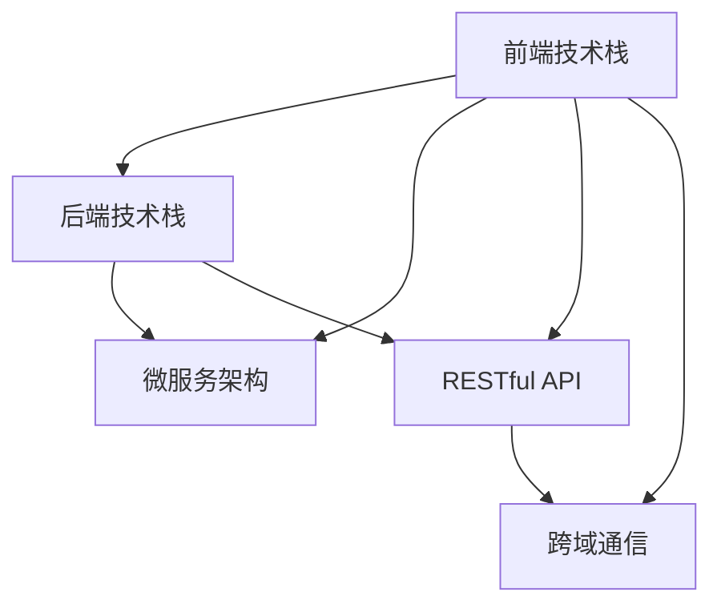

                 

# Web前后端分离架构设计与实现

> 关键词：Web前后端分离,前端技术栈,后端技术栈,微服务架构,DevOps,持续集成,持续部署,API接口,RESTful API,跨域通信

## 1. 背景介绍

### 1.1 问题由来
随着Web应用的迅速发展，传统的Web开发模式已经不能满足日益增长的需求。以MVC（Model-View-Controller）为代表的开发模式，虽然能够快速响应业务变化，但存在以下问题：
- **代码耦合度高**：前端与后端的代码紧密耦合，难以独立开发和维护。
- **系统复杂度高**：前端与后端共同管理业务逻辑，导致系统复杂度提高，维护难度增加。
- **技术栈单一**：前端和后端使用相同的技术栈，难以发挥各自的优势。

为了解决这些问题，Web前后端分离架构应运而生。通过将前端与后端分离，前端专注于用户体验，后端专注于业务逻辑，可以实现更高的开发效率和更低的维护成本。

## 2. 核心概念与联系

### 2.1 核心概念概述

为更好地理解Web前后端分离架构，本节将介绍几个密切相关的核心概念：

- **前端技术栈(Frontend Tech Stack)**：指前端开发所需的全部工具和技术的集合，包括HTML/CSS/JavaScript等前端框架和库。
- **后端技术栈(Backend Tech Stack)**：指后端开发所需的全部工具和技术的集合，包括数据库、中间件、框架等。
- **微服务架构(Microservice Architecture)**：将大型应用拆分为多个小服务，每个服务独立部署、独立扩展、独立维护。
- **DevOps(Development Operations)**：结合开发与运维，实现持续集成、持续部署(CI/CD)、自动化测试等，提高开发效率和产品质量。
- **RESTful API(Restful API)**：一种基于HTTP协议的Web服务架构，强调资源的操作性和语义性，具有易用性、扩展性、可维护性等优点。
- **跨域通信(Cross-Domain Communication)**：指不同域的网页之间通过JavaScript或CORS等方式进行通信，实现数据共享和交互。

这些核心概念之间的逻辑关系可以通过以下Mermaid流程图来展示：



这个流程图展示了几者之间的相互依赖关系：

1. 前端技术栈和后端技术栈是微服务架构的基础，将应用拆分为多个小服务。
2. 前端技术栈和后端技术栈通过RESTful API进行通信，实现数据交互。
3. 跨域通信技术用于解决不同域的通信问题，保证数据传输的可靠性和安全性。

## 3. 核心算法原理 & 具体操作步骤

### 3.1 算法原理概述

Web前后端分离架构的核心原理是将应用拆分为前端和后端两部分，前端负责界面展示和用户体验，后端负责业务逻辑和数据处理。前端通过API接口与后端进行通信，实现数据的交换和业务功能的实现。

具体而言，Web前后端分离架构的实现分为以下几个步骤：

1. 设计前端架构：选择适合项目的前端技术栈和框架，设计前端页面和用户体验。
2. 设计后端架构：选择适合项目的后端技术栈和框架，设计后端业务逻辑和数据处理。
3. 实现API接口：在前端和后端之间实现RESTful API接口，保证数据传输的可靠性和安全性。
4. 集成前端和后端：将前端和后端集成到一个项目中，通过API接口实现数据交互。

### 3.2 算法步骤详解

**Step 1: 设计前端架构**

选择适合项目的前端技术栈和框架，设计前端页面和用户体验。一般选择以下技术栈：

- **前端框架**：React、Vue、Angular等。
- **前端工具**：Webpack、Babel、ESLint等。
- **前端库**：Bootstrap、Ant Design、MUI等。

前端架构的设计需要考虑以下几个因素：

1. **用户体验**：设计直观、简洁、易用的用户界面，提升用户体验。
2. **性能优化**：使用代码分割、懒加载等技术，提升页面加载速度和响应速度。
3. **可维护性**：采用组件化开发，模块化结构，方便维护和升级。
4. **安全性**：使用HTTPS、跨站脚本防范(XSS)等技术，保障数据传输的安全性。

**Step 2: 设计后端架构**

选择适合项目后端技术栈和框架，设计后端业务逻辑和数据处理。一般选择以下技术栈：

- **后端框架**：Spring Boot、Express、FastAPI等。
- **中间件**：Redis、RabbitMQ、Elasticsearch等。
- **数据库**：MySQL、PostgreSQL、MongoDB等。

后端架构的设计需要考虑以下几个因素：

1. **扩展性**：采用微服务架构，每个服务独立部署、独立扩展、独立维护。
2. **性能优化**：使用缓存、异步处理等技术，提升系统处理能力和响应速度。
3. **安全性**：使用Token、OAuth2、SSL等技术，保障数据传输的安全性。
4. **可靠性**：采用负载均衡、故障转移等技术，保证系统的可靠性。

**Step 3: 实现API接口**

在前端和后端之间实现RESTful API接口，保证数据传输的可靠性和安全性。一般采用以下方法：

1. **RESTful API设计**：设计符合REST原则的API接口，使用名词和动词表示资源和操作。
2. **版本控制**：对API接口进行版本控制，避免版本升级带来的兼容性问题。
3. **权限控制**：对API接口进行权限控制，保障数据的安全性。
4. **异常处理**：对API接口进行异常处理，保证系统的稳定性和可用性。

**Step 4: 集成前端和后端**

将前端和后端集成到一个项目中，通过API接口实现数据交互。一般采用以下方法：

1. **代码合并**：将前端和后端代码合并到一个项目中，使用Git等版本控制系统进行管理。
2. **依赖管理**：使用npm、yarn等包管理工具，管理前端和后端依赖关系。
3. **部署集成**：将前端和后端部署到一个服务器或云平台，使用Docker等容器技术进行部署。
4. **监控集成**：使用日志、监控工具，对系统运行状态进行监控，及时发现和解决问题。

### 3.3 算法优缺点

Web前后端分离架构有以下优点：

1. **高可维护性**：前端和后端独立开发、独立部署、独立维护，便于维护和升级。
2. **高扩展性**：采用微服务架构，每个服务独立部署、独立扩展、独立维护，便于扩展和升级。
3. **高性能**：前后端分离，前端使用前端框架优化性能，后端使用异步处理等技术优化性能，提升系统整体性能。
4. **高复用性**：前后端分离，前后端代码可以独立开发和复用，提升开发效率和代码质量。

同时，该架构也存在以下缺点：

1. **沟通成本高**：前后端分离，前后端需要频繁沟通，沟通成本较高。
2. **技术栈选择复杂**：选择适合的前端和后端技术栈和框架，需要考虑多方面因素，选择复杂。
3. **接口管理复杂**：实现API接口，需要对API接口进行设计和管理，管理复杂。
4. **安全性要求高**：前后端分离，需要更高的安全性要求，保障数据传输的安全性。

尽管存在这些缺点，但就目前而言，Web前后端分离架构仍是Web开发的主流范式。未来相关研究的重点在于如何进一步优化沟通机制，提升接口管理效率，降低技术栈选择复杂度，同时兼顾安全性和性能。

### 3.4 算法应用领域

Web前后端分离架构在Web应用中已经得到了广泛的应用，覆盖了几乎所有常见领域，例如：

- **电商系统**：电商网站、电商平台、购物车系统等。
- **社交平台**：社交网站、社交媒体、即时通讯系统等。
- **企业管理系统**：企业门户、企业信息管理系统、客户关系管理系统等。
- **内容管理系统**：博客系统、论坛系统、百科系统等。
- **物联网系统**：智能家居、智慧城市、工业物联网等。

除了上述这些经典领域外，Web前后端分离架构也被创新性地应用到更多场景中，如可控表单生成、离线应用、富客户端应用等，为Web技术带来了全新的突破。

## 4. 数学模型和公式 & 详细讲解

### 4.1 数学模型构建

Web前后端分离架构的设计需要构建数学模型，用于描述前端与后端之间的数据交互和业务逻辑。一般采用以下数学模型：

1. **数据模型**：用于描述应用的数据结构和关系，如用户、订单、商品等数据模型。
2. **业务模型**：用于描述应用中的业务逻辑，如订单管理、商品管理、用户管理等业务模型。
3. **接口模型**：用于描述前后端之间的API接口，如用户登录、商品展示、订单提交等接口模型。

### 4.2 公式推导过程

以用户登录接口为例，推导API接口的设计和实现过程：

1. **用户数据模型**：

```json
{
    "id": "1",
    "username": "test",
    "password": "123456",
    "email": "test@example.com"
}
```

2. **用户业务模型**：

```js
// 用户业务逻辑
class UserService {
    async login(username, password) {
        // 验证用户名和密码
        const user = await this.getUserByUsername(username);
        if (user && user.password === password) {
            // 生成Token
            const token = await this.generateToken(user);
            return token;
        } else {
            throw new Error("用户名或密码错误");
        }
    }
    
    async getUserByUsername(username) {
        // 查询用户信息
        const user = await this.db.getUserByUsername(username);
        return user;
    }
    
    async generateToken(user) {
        // 生成Token
        const token = await this.jwtService.generateToken(user);
        return token;
    }
}
```

3. **用户接口模型**：

```js
// 用户API接口
class UserController {
    async login(username, password) {
        // 调用业务逻辑层
        const token = await this.service.login(username, password);
        // 返回Token
        return token;
    }
}
```

### 4.3 案例分析与讲解

以用户登录为例，分析Web前后端分离架构的设计过程：

1. **前端设计**：设计用户登录页面，使用React框架进行开发，实现登录表单和登录按钮等用户界面。
2. **后端设计**：设计用户登录接口，使用Spring Boot框架进行开发，实现用户登录业务逻辑。
3. **接口设计**：设计用户登录接口，使用RESTful API设计规范，使用Postman等工具进行测试。
4. **集成测试**：将前端和后端集成到一个项目中，使用Postman等工具进行集成测试。

## 5. 项目实践：代码实例和详细解释说明

### 5.1 开发环境搭建

在进行Web前后端分离架构开发前，我们需要准备好开发环境。以下是使用Node.js进行前端开发的环境配置流程：

1. 安装Node.js：从官网下载并安装Node.js，安装后自动安装npm包管理器。

2. 创建并激活虚拟环境：
```bash
nvm install 12
nvm use 12
```

3. 安装相关工具：
```bash
npm install webpack --save-dev
npm install babel --save-dev
npm install eslint --save-dev
npm install axios --save
```

完成上述步骤后，即可在虚拟环境中开始Web前后端分离架构的开发。

### 5.2 源代码详细实现

下面我们以用户登录功能为例，给出使用React框架进行Web前后端分离架构开发的前端代码实现。

首先，定义用户登录表单组件：

```jsx
import React, { useState } from 'react';
import axios from 'axios';

function LoginForm() {
    const [username, setUsername] = useState('');
    const [password, setPassword] = useState('');
    const [error, setError] = useState('');
    
    async function handleLogin(e) {
        e.preventDefault();
        try {
            const response = await axios.post('/api/login', {
                username,
                password
            });
            console.log(response.data.token);
        } catch (error) {
            setError(error.message);
        }
    }
    
    return (
        <div>
            <h2>Login</h2>
            <form onSubmit={handleLogin}>
                <input type="text" placeholder="Username" onChange={(e) => setUsername(e.target.value)} />
                <input type="password" placeholder="Password" onChange={(e) => setPassword(e.target.value)} />
                <button type="submit">Login</button>
                {error && <div>{error}</div>}
            </form>
        </div>
    );
}

export default LoginForm;
```

然后，定义用户登录接口：

```js
// 用户业务逻辑
class UserService {
    async login(username, password) {
        // 调用后端API接口
        const response = await axios.post('/api/login', {
            username,
            password
        });
        return response.data.token;
    }
}

// 用户API接口
class UserController {
    async login(username, password) {
        // 调用业务逻辑层
        const token = await this.service.login(username, password);
        return token;
    }
}
```

最后，在前端组件中使用UserController进行用户登录：

```jsx
import React, { useState } from 'react';
import UserController from './UserController';
import axios from 'axios';

function LoginForm() {
    const [username, setUsername] = useState('');
    const [password, setPassword] = useState('');
    const [error, setError] = useState('');
    
    async function handleLogin(e) {
        e.preventDefault();
        try {
            const response = await UserController.login(username, password);
            console.log(response.token);
        } catch (error) {
            setError(error.message);
        }
    }
    
    return (
        <div>
            <h2>Login</h2>
            <form onSubmit={handleLogin}>
                <input type="text" placeholder="Username" onChange={(e) => setUsername(e.target.value)} />
                <input type="password" placeholder="Password" onChange={(e) => setPassword(e.target.value)} />
                <button type="submit">Login</button>
                {error && <div>{error}</div>}
            </form>
        </div>
    );
}

export default LoginForm;
```

以上就是使用React框架进行Web前后端分离架构开发的前端代码实现。可以看到，得益于React框架的强大封装，我们可以用相对简洁的代码实现用户登录功能。

### 5.3 代码解读与分析

让我们再详细解读一下关键代码的实现细节：

**LoginForm组件**：
- **useState**：定义组件的state，用于保存用户名、密码和错误信息等状态。
- **handleLogin**：处理表单提交事件，调用后端API接口进行用户登录，显示登录结果或错误信息。

**UserController类**：
- **login方法**：调用后端API接口进行用户登录，返回登录结果或错误信息。

**UserService类**：
- **login方法**：调用后端API接口进行用户登录，返回登录结果或错误信息。

**axios使用**：
- **axios.post**：发送HTTP POST请求，将用户名和密码作为请求参数。
- **axios.then**：处理请求成功的情况，返回登录结果或错误信息。
- **axios.catch**：处理请求失败的情况，显示错误信息。

通过以上代码，我们可以看到，Web前后端分离架构的实现过程可以分为前端设计和后端设计两个阶段，前端通过调用后端API接口实现用户登录功能。

## 6. 实际应用场景

### 6.1 电商系统

基于Web前后端分离架构的电商系统，可以充分发挥前后端的优势，提升用户体验和系统性能。

在实际应用中，可以采用以下方式：

1. **前端优化**：使用React、Vue等前端框架优化页面加载速度和响应速度，提升用户体验。
2. **后端优化**：使用微服务架构优化系统扩展性，使用缓存技术优化系统性能，提升系统响应速度。
3. **API接口优化**：设计符合REST原则的API接口，使用Postman等工具进行测试，提升系统稳定性和可用性。

通过Web前后端分离架构，电商系统可以实现前端与后端分离，前后端独立开发和维护，提升开发效率和系统性能，降低维护成本，提升用户体验。

### 6.2 社交平台

基于Web前后端分离架构的社交平台，可以实现用户界面和业务逻辑分离，提升系统可维护性和扩展性。

在实际应用中，可以采用以下方式：

1. **前端优化**：使用React、Vue等前端框架优化页面加载速度和响应速度，提升用户体验。
2. **后端优化**：使用微服务架构优化系统扩展性，使用缓存技术优化系统性能，提升系统响应速度。
3. **API接口优化**：设计符合REST原则的API接口，使用Postman等工具进行测试，提升系统稳定性和可用性。

通过Web前后端分离架构，社交平台可以实现前端与后端分离，前后端独立开发和维护，提升开发效率和系统性能，降低维护成本，提升用户体验。

### 6.3 企业管理系统

基于Web前后端分离架构的企业管理系统，可以实现前端与后端分离，提升系统可维护性和扩展性。

在实际应用中，可以采用以下方式：

1. **前端优化**：使用React、Vue等前端框架优化页面加载速度和响应速度，提升用户体验。
2. **后端优化**：使用微服务架构优化系统扩展性，使用缓存技术优化系统性能，提升系统响应速度。
3. **API接口优化**：设计符合REST原则的API接口，使用Postman等工具进行测试，提升系统稳定性和可用性。

通过Web前后端分离架构，企业管理系统可以实现前端与后端分离，前后端独立开发和维护，提升开发效率和系统性能，降低维护成本，提升用户体验。

### 6.4 内容管理系统

基于Web前后端分离架构的内容管理系统，可以实现前端与后端分离，提升系统可维护性和扩展性。

在实际应用中，可以采用以下方式：

1. **前端优化**：使用React、Vue等前端框架优化页面加载速度和响应速度，提升用户体验。
2. **后端优化**：使用微服务架构优化系统扩展性，使用缓存技术优化系统性能，提升系统响应速度。
3. **API接口优化**：设计符合REST原则的API接口，使用Postman等工具进行测试，提升系统稳定性和可用性。

通过Web前后端分离架构，内容管理系统可以实现前端与后端分离，前后端独立开发和维护，提升开发效率和系统性能，降低维护成本，提升用户体验。

## 7. 工具和资源推荐

### 7.1 学习资源推荐

为了帮助开发者系统掌握Web前后端分离架构的理论基础和实践技巧，这里推荐一些优质的学习资源：

1. **《Web前端开发进阶》系列博文**：由前端专家撰写，深入浅出地介绍了前端技术栈和开发技巧。

2. **《Web后端开发实战》系列博文**：由后端专家撰写，深入浅出地介绍了后端技术栈和开发技巧。

3. **《Web前后端分离架构设计》书籍**：详细介绍了Web前后端分离架构的设计和实现，涵盖前端和后端的技术栈和开发技巧。

4. **HackerRank、LeetCode**：提供大量前端和后端开发编程练习，提升编程能力和开发技巧。

5. **Coursera、Udacity**：提供Web开发相关课程，涵盖前端和后端的技术栈和开发技巧。

通过对这些资源的学习实践，相信你一定能够快速掌握Web前后端分离架构的理论基础和实践技巧，并用于解决实际的Web开发问题。

### 7.2 开发工具推荐

高效的开发离不开优秀的工具支持。以下是几款用于Web前后端分离架构开发的常用工具：

1. **Webpack**：一款前端构建工具，支持代码分割、懒加载等技术，提升页面加载速度和响应速度。

2. **Babel**：一款前端编译器，支持ES6+语法，将代码编译为浏览器兼容的代码。

3. **ESLint**：一款前端代码检查工具，自动检查代码质量，提升代码可读性和可维护性。

4. **Postman**：一款API接口测试工具，支持HTTP请求的调试和测试，保障API接口的稳定性和可用性。

5. **Visual Studio Code**：一款前端和后端开发工具，支持代码高亮、调试、自动补全等功能，提升开发效率。

6. **Git**：一款版本控制系统，支持代码管理和版本控制，方便团队协作开发。

合理利用这些工具，可以显著提升Web前后端分离架构的开发效率，加快创新迭代的步伐。

### 7.3 相关论文推荐

Web前后端分离架构的发展源于学界的持续研究。以下是几篇奠基性的相关论文，推荐阅读：

1. **《Web应用架构演变与设计》**：介绍了Web应用的演变过程和设计原则，包括前后端分离架构。

2. **《微服务架构》**：介绍了微服务架构的设计和实现，涵盖了前后端分离架构的核心思想。

3. **《RESTful API设计原则》**：介绍了RESTful API的设计原则和最佳实践，涵盖前后端分离架构的核心接口设计。

4. **《DevOps实践指南》**：介绍了DevOps的实践方法和工具，涵盖前后端分离架构的持续集成和持续部署。

5. **《Web前后端分离架构设计》**：详细介绍了Web前后端分离架构的设计和实现，涵盖前端和后端的技术栈和开发技巧。

这些论文代表了大语言模型微调技术的发展脉络。通过学习这些前沿成果，可以帮助研究者把握学科前进方向，激发更多的创新灵感。

## 8. 总结：未来发展趋势与挑战

### 8.1 总结

本文对Web前后端分离架构进行了全面系统的介绍。首先阐述了Web前后端分离架构的研究背景和意义，明确了前后端分离在提升开发效率和系统性能方面的独特价值。其次，从原理到实践，详细讲解了Web前后端分离架构的数学模型和核心算法，给出了Web前后端分离架构开发的前端代码实例。同时，本文还广泛探讨了Web前后端分离架构在电商系统、社交平台、企业管理系统等领域的实际应用，展示了前后端分离范式的巨大潜力。此外，本文精选了前后端分离架构的学习资源，力求为读者提供全方位的技术指引。

通过本文的系统梳理，可以看到，Web前后端分离架构正在成为Web开发的主流范式，极大地提升了Web应用的开发效率和系统性能。未来，伴随前后端分离架构的不断演进，相信Web技术将在更广阔的应用领域大放异彩，深刻影响人类的生产生活方式。

### 8.2 未来发展趋势

展望未来，Web前后端分离架构将呈现以下几个发展趋势：

1. **全栈开发**：前端与后端开发逐步融合，形成全栈开发模式，提升开发效率和系统性能。

2. **低代码开发**：基于前端框架和后端框架的低代码开发工具逐步成熟，提升开发效率和代码质量。

3. **自动化测试**：基于DevOps的自动化测试工具逐步成熟，提升代码质量和系统稳定性。

4. **无代码开发**：基于无代码开发平台的前后端分离架构逐步成熟，提升开发效率和系统性能。

5. **多端应用**：基于前后端分离架构的Web应用逐步扩展到移动端和IoT设备，实现跨平台应用。

以上趋势凸显了Web前后端分离架构的广阔前景。这些方向的探索发展，必将进一步提升Web应用的开发效率和系统性能，为Web技术的进一步演进提供新的动力。

### 8.3 面临的挑战

尽管Web前后端分离架构已经取得了瞩目成就，但在迈向更加智能化、普适化应用的过程中，它仍面临着诸多挑战：

1. **前后端沟通成本高**：前后端分离，前后端需要频繁沟通，沟通成本较高。

2. **接口管理复杂**：实现API接口，需要对API接口进行设计和管理，管理复杂。

3. **技术栈选择复杂**：选择适合的前端和后端技术栈和框架，需要考虑多方面因素，选择复杂。

4. **安全性要求高**：前后端分离，需要更高的安全性要求，保障数据传输的安全性。

尽管存在这些挑战，但就目前而言，Web前后端分离架构仍是Web开发的主流范式。未来相关研究的重点在于如何进一步优化沟通机制，提升接口管理效率，降低技术栈选择复杂度，同时兼顾安全性和性能。

### 8.4 研究展望

面对Web前后端分离架构所面临的挑战，未来的研究需要在以下几个方面寻求新的突破：

1. **前端与后端融合**：探索前端与后端的融合模式，提升开发效率和系统性能。

2. **低代码与无代码开发**：开发基于低代码和无代码开发平台的前后端分离架构，提升开发效率和系统性能。

3. **全栈开发工具**：开发基于前端框架和后端框架的全栈开发工具，提升开发效率和系统性能。

4. **微服务架构优化**：优化微服务架构，提升系统扩展性和稳定性。

5. **自动化测试优化**：优化自动化测试工具，提升代码质量和系统稳定性。

6. **跨平台应用优化**：优化跨平台应用，提升跨端应用的用户体验和系统性能。

这些研究方向的研究，必将引领Web前后端分离架构技术迈向更高的台阶，为Web应用的进一步演进提供新的动力。面向未来，Web前后端分离架构还需要与其他人工智能技术进行更深入的融合，如自然语言处理、人工智能等，多路径协同发力，共同推动Web应用的进步。

## 9. 附录：常见问题与解答

**Q1：什么是Web前后端分离架构？**

A: Web前后端分离架构是一种将前端与后端分离，前后端独立开发、独立部署、独立维护的Web开发范式。前端专注于用户体验，后端专注于业务逻辑和数据处理。前端通过API接口与后端进行通信，实现数据的交换和业务功能的实现。

**Q2：Web前后端分离架构有哪些优点？**

A: Web前后端分离架构有以下优点：

1. **高可维护性**：前后端独立开发、独立部署、独立维护，便于维护和升级。
2. **高扩展性**：采用微服务架构，每个服务独立部署、独立扩展、独立维护，便于扩展和升级。
3. **高性能**：前后端分离，前端使用前端框架优化性能，后端使用异步处理等技术优化性能，提升系统整体性能。
4. **高复用性**：前后端分离，前后端代码可以独立开发和复用，提升开发效率和代码质量。

**Q3：Web前后端分离架构有哪些缺点？**

A: Web前后端分离架构有以下缺点：

1. **沟通成本高**：前后端分离，前后端需要频繁沟通，沟通成本较高。
2. **接口管理复杂**：实现API接口，需要对API接口进行设计和管理，管理复杂。
3. **技术栈选择复杂**：选择适合的前端和后端技术栈和框架，需要考虑多方面因素，选择复杂。
4. **安全性要求高**：前后端分离，需要更高的安全性要求，保障数据传输的安全性。

尽管存在这些缺点，但就目前而言，Web前后端分离架构仍是Web开发的主流范式。未来相关研究的重点在于如何进一步优化沟通机制，提升接口管理效率，降低技术栈选择复杂度，同时兼顾安全性和性能。

**Q4：Web前后端分离架构有哪些应用场景？**

A: Web前后端分离架构在Web应用中已经得到了广泛的应用，涵盖电商系统、社交平台、企业管理系统、内容管理系统等诸多领域。此外，Web前后端分离架构还被创新性地应用到更多场景中，如可控表单生成、离线应用、富客户端应用等，为Web技术带来了全新的突破。

**Q5：Web前后端分离架构的设计流程是什么？**

A: Web前后端分离架构的设计流程包括以下几个步骤：

1. **前端设计**：选择适合项目的前端技术栈和框架，设计前端页面和用户体验。
2. **后端设计**：选择适合项目后端技术栈和框架，设计后端业务逻辑和数据处理。
3. **API接口设计**：设计符合REST原则的API接口，使用Postman等工具进行测试。
4. **集成测试**：将前端和后端集成到一个项目中，使用Postman等工具进行集成测试。

通过以上步骤，可以实现Web前后端分离架构的设计和实现。

**Q6：Web前后端分离架构的优缺点分别是什么？**

A: Web前后端分离架构有以下优点：

1. **高可维护性**：前后端独立开发、独立部署、独立维护，便于维护和升级。
2. **高扩展性**：采用微服务架构，每个服务独立部署、独立扩展、独立维护，便于扩展和升级。
3. **高性能**：前后端分离，前端使用前端框架优化性能，后端使用异步处理等技术优化性能，提升系统整体性能。
4. **高复用性**：前后端分离，前后端代码可以独立开发和复用，提升开发效率和代码质量。

同时，该架构也存在以下缺点：

1. **沟通成本高**：前后端分离，前后端需要频繁沟通，沟通成本较高。
2. **接口管理复杂**：实现API接口，需要对API接口进行设计和管理，管理复杂。
3. **技术栈选择复杂**：选择适合的前端和后端技术栈和框架，需要考虑多方面因素，选择复杂。
4. **安全性要求高**：前后端分离，需要更高的安全性要求，保障数据传输的安全性。

尽管存在这些缺点，但就目前而言，Web前后端分离架构仍是Web开发的主流范式。未来相关研究的重点在于如何进一步优化沟通机制，提升接口管理效率，降低技术栈选择复杂度，同时兼顾安全性和性能。

**Q7：如何实现Web前后端分离架构的接口设计？**

A: 实现Web前后端分离架构的接口设计需要遵循以下原则：

1. **REST原则**：使用符合REST原则的API接口，使用名词和动词表示资源和操作。
2. **版本控制**：对API接口进行版本控制，避免版本升级带来的兼容性问题。
3. **权限控制**：对API接口进行权限控制，保障数据的安全性。
4. **异常处理**：对API接口进行异常处理，保证系统的稳定性和可用性。

通过以上原则，可以实现符合REST原则的API接口，保障系统的稳定性和可用性。

**Q8：Web前后端分离架构的设计过程中，需要注意哪些问题？**

A: 在Web前后端分离架构的设计过程中，需要注意以下几个问题：

1. **前端性能优化**：使用前端框架优化页面加载速度和响应速度，提升用户体验。
2. **后端性能优化**：使用缓存技术优化系统性能，提升系统响应速度。
3. **接口设计**：设计符合REST原则的API接口，使用Postman等工具进行测试，提升系统稳定性和可用性。
4. **前后端协作**：前后端需要密切协作，共同设计、实现和测试API接口，提升开发效率和系统性能。

通过以上注意事项，可以避免在Web前后端分离架构的设计过程中出现的问题，保证系统的高性能、高可用性和高稳定性。

**Q9：Web前后端分离架构的实现过程中，需要注意哪些问题？**

A: 在Web前后端分离架构的实现过程中，需要注意以下几个问题：

1. **前后端协同**：前后端需要密切协作，共同设计、实现和测试API接口，提升开发效率和系统性能。
2. **接口版本管理**：对API接口进行版本管理，避免版本升级带来的兼容性问题。
3. **接口权限控制**：对API接口进行权限控制，保障数据的安全性。
4. **接口异常处理**：对API接口进行异常处理，保证系统的稳定性和可用性。

通过以上注意事项，可以避免在Web前后端分离架构的实现过程中出现的问题，保证系统的高性能、高可用性和高稳定性。

**Q10：Web前后端分离架构的部署过程需要注意哪些问题？**

A: 在Web前后端分离架构的部署过程中，需要注意以下几个问题：

1. **前后端部署协同**：前后端需要同时部署，保证系统的稳定性和可用性。
2. **接口版本管理**：对API接口进行版本管理，避免版本升级带来的兼容性问题。
3. **接口权限控制**：对API接口进行权限控制，保障数据的安全性。
4. **接口异常处理**：对API接口进行异常处理，保证系统的稳定性和可用性。

通过以上注意事项，可以避免在Web前后端分离架构的部署过程中出现的问题，保证系统的高性能、高可用性和高稳定性。

**Q11：Web前后端分离架构的优势是什么？**

A: Web前后端分离架构有以下优势：

1. **高可维护性**：前后端独立开发、独立部署、独立维护，便于维护和升级。
2. **高扩展性**：采用微服务架构，每个服务独立部署、独立扩展、独立维护，便于扩展和升级。
3. **高性能**：前后端分离，前端使用前端框架优化性能，后端使用异步处理等技术优化性能，提升系统整体性能。
4. **高复用性**：前后端分离，前后端代码可以独立开发和复用，提升开发效率和代码质量。

这些优势使得Web前后端分离架构成为Web开发的主流范式，极大地提升了Web应用的开发效率和系统性能。

**Q12：Web前后端分离架构的实现过程可以分为哪些步骤？**

A: Web前后端分离架构的实现过程可以分为以下几个步骤：

1. **前端设计**：选择适合项目的前端技术栈和框架，设计前端页面和用户体验。
2. **后端设计**：选择适合项目后端技术栈和框架，设计后端业务逻辑和数据处理。
3. **API接口设计**：设计符合REST原则的API接口，使用Postman等工具进行测试。
4. **集成测试**：将前端和后端集成到一个项目中，使用Postman等工具进行集成测试。

通过以上步骤，可以实现Web前后端分离架构的设计和实现。

**Q13：Web前后端分离架构的设计和实现过程中，需要注意哪些问题？**

A: 在Web前后端分离架构的设计和实现过程中，需要注意以下几个问题：

1. **前后端协作**：前后端需要密切协作，共同设计、实现和测试API接口，提升开发效率和系统性能。
2. **接口版本管理**：对API接口进行版本管理，避免版本升级带来的兼容性问题。
3. **接口权限控制**：对API接口进行权限控制，保障数据的安全性。
4. **接口异常处理**：对API接口进行异常处理，保证系统的稳定性和可用性。

通过以上注意事项，可以避免在Web前后端分离架构的设计和实现过程中出现的问题，保证系统的高性能、高可用性和高稳定性。

**Q14：Web前后端分离架构在电商系统、社交平台、企业管理系统等领域的实际应用是什么？**

A: Web前后端分离架构在电商系统、社交平台、企业管理系统等领域的实际应用包括：

1. **电商系统**：电商网站、电商平台、购物车系统等。
2. **社交平台**：社交网站、社交媒体、即时通讯系统等。
3. **企业管理系统**：企业门户、企业信息管理系统、客户关系管理系统等。
4. **内容管理系统**：博客系统、论坛系统、百科系统等。

通过Web前后端分离架构，可以实现前端与后端分离，前后端独立开发和维护，提升开发效率和系统性能，降低维护成本，提升用户体验。

**Q15：Web前后端分离架构的部署过程需要注意哪些问题？**

A: 在Web前后端分离架构的部署过程中，需要注意以下几个问题：

1. **前后端部署协同**：前后端需要同时部署，保证系统的稳定性和可用性。
2. **接口版本管理**：对API接口进行版本管理，避免版本升级带来的兼容性问题。
3. **接口权限控制**：对API接口进行权限控制，保障数据的安全性。
4. **接口异常处理**：对API接口进行异常处理，保证系统的稳定性和可用性。

通过以上注意事项，可以避免在Web前后端分离架构的部署过程中出现的问题，保证系统的高性能、高可用性和高稳定性。

**Q16：Web前后端分离架构的实现过程中，需要注意哪些问题？**

A: 在Web前后端分离架构的实现过程中，需要注意以下几个问题：

1. **前后端协作**：前后端需要密切协作，共同设计、实现和测试API接口，提升开发效率和系统性能。
2. **接口版本管理**：对API接口进行版本管理，避免版本升级带来的兼容性问题。
3. **接口权限控制**：对API接口进行权限控制，保障数据的安全性。
4. **接口异常处理**：对API接口进行异常处理，保证系统的稳定性和可用性。

通过以上注意事项，可以避免在Web前后端分离架构的实现过程中出现的问题，保证系统的高性能、高可用性和高稳定性。

**Q17：Web前后端分离架构的优势是什么？**

A: Web前后端分离架构有以下优势：

1. **高可维护性**：前后端独立开发、独立部署、独立维护，便于维护和升级。
2. **高扩展性**：采用微服务架构，每个服务独立部署、独立扩展、独立维护，便于扩展和升级。
3. **高性能**：前后端分离，前端使用前端框架优化性能，后端使用异步处理等技术优化性能，提升系统整体性能。
4. **高复用性**：前后端分离，前后端代码可以独立开发和复用，提升开发效率和代码质量。

这些优势使得Web前后端分离架构成为Web开发的主流范式，极大地提升了Web应用的开发效率和系统性能。

**Q18：Web前后端分离架构的部署过程需要注意哪些问题？**

A: 在Web前后端分离架构的部署过程中，需要注意以下几个问题：

1. **前后端部署协同**：前后端需要同时部署，保证系统的稳定性和可用性。
2. **接口版本管理**：对API接口进行版本管理，避免版本升级带来的兼容性问题。
3. **接口权限控制**：对API接口进行权限控制，保障数据的安全性。
4. **接口异常处理**：对API接口进行异常处理，保证系统的稳定性和可用性。

通过以上注意事项，可以避免在Web前后端分离架构的部署过程中出现的问题，保证系统的高性能、高可用性和高稳定性。

**Q19：Web前后端分离架构的优势是什么？**

A: Web前后端分离架构有以下优势：

1. **高可维护性**：前后端独立开发、独立部署、独立维护，便于维护和升级。
2. **高扩展性**：采用微服务架构，每个服务独立部署、独立扩展、独立维护，便于扩展和升级。
3. **高性能**：前后端分离，前端使用前端框架优化性能，后端使用异步处理等技术优化性能，提升系统整体性能。
4. **高复用性**：前后端分离，前后端代码可以独立开发和复用，提升开发效率和代码质量。

这些优势使得Web前后端分离架构成为Web开发的主流范式，极大地提升了Web应用的开发效率和系统性能。

**Q20：Web前后端分离架构的实现过程可以分为哪些步骤？**

A: Web前后端分离架构的实现过程可以分为以下几个步骤：

1. **前端设计**：选择适合项目的前端技术栈和框架，设计前端页面和用户体验。
2. **后端设计**：选择适合项目后端技术栈和框架，设计后端业务逻辑和数据处理。
3. **API接口设计**：设计符合REST原则的API接口，使用Postman等工具进行测试。
4. **集成测试**：将前端和后端集成到一个项目中，使用Postman等工具进行集成测试。

通过以上步骤，可以实现Web前后端分离架构的设计和实现。

**Q21：Web前后端分离架构的设计和实现过程中，需要注意哪些问题？**

A: 在Web前后端分离架构的设计和实现过程中，需要注意以下几个问题：

1. **前后端协作**：前后端需要密切协作，共同设计、实现和测试API接口，提升开发效率和系统性能。
2. **接口版本管理**：对API接口进行版本管理，避免版本升级带来的兼容性问题。
3. **接口权限控制**：对API接口进行权限控制，保障数据的安全性。
4. **接口异常处理**：对API接口进行异常处理，保证系统的稳定性和可用性。

通过以上注意事项，可以避免在Web前后端分离架构的设计和实现过程中出现的问题，保证系统的高性能、高可用性和高稳定性。

**Q22：Web前后端分离架构的部署过程需要注意哪些问题？**

A: 在Web前后端分离架构的部署过程中，需要注意以下几个问题：

1. **前后端部署协同**：前后端需要同时部署，保证系统的稳定性和可用性。
2. **接口版本管理**：对API接口进行版本管理，避免版本升级带来的兼容性问题。
3. **接口权限控制**

