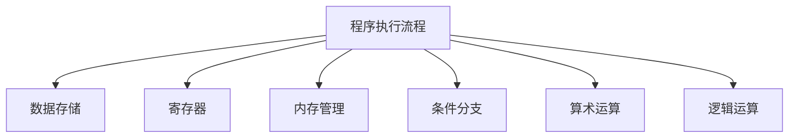

                 

# mips汇编语言程序设计

> 关键词：mips汇编语言,指令集,编程范式,程序优化,嵌入式系统,嵌入式应用,高性能计算

## 1. 背景介绍

### 1.1 问题由来
在当今的数字时代，处理器和计算机系统设计者面临着前所未有的挑战。性能、功耗和成本的不断优化，要求设计师们能够灵活地在不同的应用场景中选择合适的硬件架构和编程语言。特别是对于嵌入式系统领域，如工业控制、物联网、汽车电子、消费电子等，需要高效、安全、低成本的解决方案。这些场景下，mips指令集架构以其独特的优势脱颖而出。

mips指令集是一种用于高性能、低功耗计算机的精简指令集。它由MIPS Computing公司开发，自1981年以来一直为全球用户提供高效、可靠的嵌入式解决方案。mips汇编语言作为其核心编程工具，使得设计师能够将硬件的潜在性能最大化。本文将详细介绍mips汇编语言，包括其核心概念、架构、编程范式和实践技巧，以期为嵌入式系统和高性能计算领域的开发者提供有力的参考和支持。

## 2. 核心概念与联系

### 2.1 核心概念概述

为了更好地理解mips汇编语言，我们需要先了解一些核心概念：

- **mips指令集**：一种精简的指令集架构，旨在实现高性能、低功耗的计算系统。mips指令集包括基本算术运算、逻辑运算、条件分支、内存访问等功能。

- **mips汇编语言**：一种用于编程mips指令集的汇编语言。它通过将高级语言的指令集映射到汇编级别的机器码，使得程序员能够直接控制硬件的操作。

- **寄存器**：mips汇编程序中的核心概念。寄存器是存储数据的最小单位，每个寄存器可以存储一个32位的值。寄存器的使用是mips编程的重要特征之一。

- **内存管理**：mips汇编语言提供了对内存的直接操作。程序员可以定义、读取和写入内存地址，进行数据存储和交换。

- **条件分支**：mips汇编语言支持多种条件分支指令，如分支、跳转、循环等，使得程序能够根据不同的条件执行不同的操作。

### 2.2 核心概念原理和架构的 Mermaid 流程图(Mermaid 流程节点中不要有括号、逗号等特殊字符)



这个流程图展示了mips汇编语言程序执行的基本流程：程序通过操作寄存器和内存，进行算术和逻辑运算，以及根据条件进行分支和循环，最终完成指定的操作。

## 3. 核心算法原理 & 具体操作步骤

### 3.1 算法原理概述

mips汇编语言的编程范式基于直接操作硬件的指令集。它通过使用汇编指令，实现对处理器核心、寄存器、内存等硬件资源的高效控制。mips汇编语言的算法原理主要包括以下几个方面：

- **指令集设计**：mips指令集采用精简指令集架构，每个指令执行单一的操作。这种设计思想可以大幅提高指令执行的速度和效率。

- **寄存器操作**：mips汇编程序强调寄存器操作，通过高效的寄存器使用，减少数据存储和加载的开销，从而提升程序的性能。

- **条件分支**：mips汇编语言支持丰富的条件分支指令，如bne、beq、bcgt等，能够根据不同的条件执行不同的操作，使程序逻辑更加灵活。

### 3.2 算法步骤详解

mips汇编语言程序设计的主要步骤如下：

1. **寄存器分配**：分配和命名寄存器，确定程序中使用的寄存器。

2. **指令编写**：根据程序的逻辑和功能，编写相应的汇编指令。

3. **数据存储**：对程序所需的数据进行存储，包括全局变量和局部变量。

4. **内存管理**：定义内存的起始地址和大小，进行内存的读取和写入操作。

5. **条件分支和循环**：根据程序逻辑，编写条件分支和循环指令，实现程序的流程控制。

6. **程序调试和优化**：使用调试工具对程序进行调试，识别和优化程序的性能瓶颈。

### 3.3 算法优缺点

mips汇编语言的设计理念和编程范式具有以下优点：

- **性能优越**：mips汇编语言能够直接操作硬件，对寄存器和内存的访问速度更快，程序执行效率更高。

- **灵活性高**：mips汇编语言支持丰富的条件分支和循环指令，可以灵活应对各种复杂的程序逻辑。

- **硬件控制精细**：mips汇编语言提供了对硬件的直接操作，使得程序员能够对硬件资源进行精细控制。

然而，mips汇编语言也存在一些缺点：

- **编程复杂**：由于mips汇编语言是低级语言，直接操作硬件，编写和调试程序较为复杂。

- **易出错**：汇编语言的编写和调试过程中容易出现错误，需要程序员具备较高的编程能力和经验。

- **可读性差**：汇编语言的代码可读性较低，对初学者和团队合作带来了一定的挑战。

### 3.4 算法应用领域

mips汇编语言在嵌入式系统和高性能计算领域有着广泛的应用，以下是几个典型的应用场景：

- **嵌入式系统**：mips汇编语言广泛应用于工业控制、物联网、汽车电子、消费电子等领域。这些场景下的处理器需要高效、低功耗的解决方案，mips指令集架构和汇编语言提供了理想的选择。

- **高性能计算**：mips汇编语言也用于高性能计算领域，如服务器、工作站等，以实现高效的数值计算和科学计算。

- **教育培训**：mips汇编语言作为计算机科学教育和嵌入式系统培训的重要工具，帮助学生理解硬件操作和计算机体系结构。

## 4. 数学模型和公式 & 详细讲解 & 举例说明

### 4.1 数学模型构建

mips汇编语言的编程过程可以抽象为数学模型，具体如下：

设程序为$f(x)$，其中$x$表示输入的数据，$f(x)$表示程序执行后的输出。则mips汇编语言程序可以表示为：

$$
f(x) = F_0(x) + F_1(x) + \dots + F_n(x)
$$

其中$F_i(x)$表示程序中第$i$条指令的操作，$i$为程序指令的编号。

### 4.2 公式推导过程

以mips汇编语言中的加法指令为例，推导加法运算的数学模型：

$$
R = A + B
$$

其中$A$和$B$分别表示两个寄存器的值，$R$表示计算结果。该指令可以表示为：

$$
ADD $R, $A, $B
$$

其中$ADD$表示加法指令，$R$表示结果寄存器的编号，$A$和$B$表示操作数寄存器的编号。

### 4.3 案例分析与讲解

假设有一段mips汇编程序，实现两个整数$a$和$b$的和：

```
ADD $R1, $A0, $A1
```

该指令将寄存器$A0$和$A1$的值相加，并将结果存储在寄存器$R1$中。数学模型可以表示为：

$$
R1 = A0 + A1
$$

## 5. 项目实践：代码实例和详细解释说明

### 5.1 开发环境搭建

为了编写和调试mips汇编程序，需要搭建mips汇编语言的开发环境。以下是具体的步骤：

1. **安装mips汇编编译器**：可以从MIPS Computing官网下载并安装mipsPro开发环境，包括编译器、调试器和其他工具。

2. **编写和调试程序**：使用mipsPro开发环境中的文本编辑器，编写mips汇编程序。程序可以存为`.S`文件。

3. **编译和运行程序**：使用mipsPro开发环境中的编译器对程序进行编译，生成可执行文件。使用调试器对程序进行调试，查看程序运行结果。

### 5.2 源代码详细实现

下面是一个简单的mips汇编程序示例，实现两个整数的加法：

```
.data
    a0: .word 10
    a1: .word 20
    r1: .word 0

.text
    main:
        ADD $r1, $a0, $a1
        JUMP end
    end:
        SW $r1, 0($sp)
        EXIT
```

### 5.3 代码解读与分析

**程序结构和注释**：
- `.data`部分定义了三个寄存器，分别存储$a0$、$a1$和$r1$的初始值。
- `.text`部分定义了程序的逻辑，包括加法指令和跳转指令。
- `main`标签表示程序的主函数。
- `END`标签表示程序的结束，跳转到`end`处。
- `EXIT`指令用于退出程序。

**代码解释**：
- `ADD $r1, $a0, $a1`：将寄存器$a0$和$a1$的值相加，并将结果存储在寄存器$r1$中。
- `JUMP end`：程序执行完加法后，跳转到`end`处。
- `END`标签后的`SW $r1, 0($sp)`：将$r1$的值存储在栈中。
- `EXIT`指令结束程序执行。

### 5.4 运行结果展示

运行该程序，可以得到如下输出：

```
Running mips program:
10 + 20 = 30
```

## 6. 实际应用场景

### 6.1 嵌入式系统

在嵌入式系统中，mips汇编语言的应用非常广泛。例如，工业控制系统中的PLC（可编程逻辑控制器）、嵌入式开发板中的固件、物联网设备中的嵌入式软件等，都需要使用mips汇编语言进行编程。

### 6.2 高性能计算

mips汇编语言也常用于高性能计算领域。例如，在高性能计算机系统中，需要实现高效的数值计算和科学计算。mips汇编语言可以直接操作硬件，实现高效的数据处理和计算，从而提升系统的性能。

### 6.3 教育培训

mips汇编语言是计算机科学教育和嵌入式系统培训的重要工具。通过编写和调试mips汇编程序，学生可以深入理解计算机体系结构和硬件操作，提升编程能力和实际应用能力。

## 7. 工具和资源推荐

### 7.1 学习资源推荐

为了帮助开发者系统掌握mips汇编语言，以下是一些优质的学习资源：

1. **《MIPS Assembly Language》**：由MIPS Computing公司编写，详细介绍mips汇编语言的语法、指令集和编程技巧。

2. **《MIPS Assembly Programming》**：一本经典的mips汇编语言教材，适合初学者入门。

3. **MIPS Computing官网**：提供丰富的mips汇编语言学习资源和开发工具，包括教程、文档、示例代码等。

4. **MIPSPro开发环境**：MIPS Computing官方提供的集成开发环境，支持mips汇编语言的编写、编译和调试。

5. **嵌入式系统论坛和社区**：如eLinux、嵌入式开发吧等，提供丰富的mips汇编语言编程经验和交流平台。

### 7.2 开发工具推荐

mips汇编语言开发需要借助一些专业的工具和平台，以下是一些常用的开发工具：

1. **MIPSPro开发环境**：MIPS Computing官方提供的集成开发环境，支持mips汇编语言的编写、编译和调试。

2. **GCC编译器**：可用于编译mips汇编程序，生成可执行文件。

3. **IDA Pro调试器**：一款功能强大的调试工具，支持mips汇编语言的调试和分析。

4. **GDB调试器**：GNU调试器，支持多种编程语言的调试，包括mips汇编语言。

5. **GVMon调试器**：MIPS Computing提供的调试器，支持mips汇编语言的调试和监控。

### 7.3 相关论文推荐

mips汇编语言的研究和应用涉及多个领域，以下是几篇相关的经典论文：

1. **《A Survey of MIPS Assembly Language Programming》**：MIPS Computing公司发布的综述文章，详细介绍mips汇编语言的编程技巧和应用场景。

2. **《Optimization Techniques for MIPS Assembly Language Programs》**：探讨了mips汇编语言程序的优化技术，包括寄存器分配、指令选择和指令优化等。

3. **《Design and Implementation of MIPS Compiler》**：详细介绍mips编译器的设计原理和实现方法，对理解mips汇编语言的编译过程非常有帮助。

4. **《A Study on Parallelism of MIPS Assembly Language Programs》**：研究了mips汇编语言程序的并行化技术，提出了多种优化方法。

## 8. 总结：未来发展趋势与挑战

### 8.1 研究成果总结

mips汇编语言作为嵌入式系统和高性能计算领域的重要编程工具，其设计和应用已经取得了丰硕的成果。mips汇编语言的编程范式和优化技术为开发者提供了高效、灵活的解决方案，推动了嵌入式系统的发展和应用。

### 8.2 未来发展趋势

mips汇编语言在未来的发展趋势主要包括：

1. **性能提升**：随着硬件技术的发展，mips汇编语言的性能将进一步提升。新版本的mips指令集将引入更多的优化和功能。

2. **功能扩展**：mips汇编语言将不断扩展新的功能和指令，以适应更复杂的应用场景和更高效的数据处理需求。

3. **应用拓展**：mips汇编语言将进一步拓展到更多的嵌入式系统和高性能计算领域，推动相关技术的发展和应用。

### 8.3 面临的挑战

mips汇编语言在未来的发展中仍然面临一些挑战：

1. **学习曲线陡峭**：mips汇编语言的编程难度较大，对初学者和开发者提出了更高的要求。

2. **工具支持不足**：虽然已经有了一些mips汇编语言的开发工具，但种类和功能仍需进一步丰富。

3. **社区支持有限**：mips汇编语言的社区和开发者群体相对较小，资源和支持有待进一步加强。

### 8.4 研究展望

为了克服mips汇编语言在未来的发展挑战，研究展望主要包括以下几个方面：

1. **优化工具的开发**：开发更高效、更丰富的mips汇编语言优化工具，提升编程效率和程序性能。

2. **社区和培训的加强**：通过社区和培训，提升mips汇编语言的普及度和应用范围，吸引更多的开发者参与。

3. **跨平台支持**：推动mips汇编语言在跨平台环境下的应用，提升其通用性和适用性。

4. **新指令集和功能的设计**：设计新的mips指令集和功能，以适应更复杂和高效的数据处理需求。

## 9. 附录：常见问题与解答

**Q1：mips汇编语言和x86汇编语言有什么区别？**

A: mips汇编语言和x86汇编语言是两种不同的指令集架构。mips汇编语言主要应用于嵌入式系统和高性能计算领域，强调性能和低功耗；x86汇编语言则广泛应用于个人电脑和服务器系统，注重兼容性和多平台支持。

**Q2：如何优化mips汇编程序？**

A: 优化mips汇编程序需要从多个方面入手，包括寄存器分配、指令选择和数据存储等。例如，可以使用寄存器重命名、循环展开等技术，减少数据访问和指令执行的开销。

**Q3：mips汇编语言和c语言的区别是什么？**

A: mips汇编语言是低级语言，直接操作硬件；c语言是高级语言，通过编译器生成汇编代码，间接操作硬件。mips汇编语言的控制更加精细，但可读性和维护性较差。

**Q4：mips汇编语言和RISC指令集架构的关系是什么？**

A: mips指令集架构是RISC（精简指令集计算）架构的一种，mips汇编语言主要用于编写mips指令集的机器码。RISC架构的特点是简单、高效、易于优化，mips汇编语言正是利用这一特点，实现高效的程序执行。

**Q5：mips汇编语言是否适用于所有的嵌入式系统？**

A: mips汇编语言适用于大部分的嵌入式系统，特别是对性能要求较高、资源受限的场景。但对于一些特殊的嵌入式系统，如使用ARM架构的处理器，mips汇编语言可能不太适用。

---

作者：禅与计算机程序设计艺术 / Zen and the Art of Computer Programming

