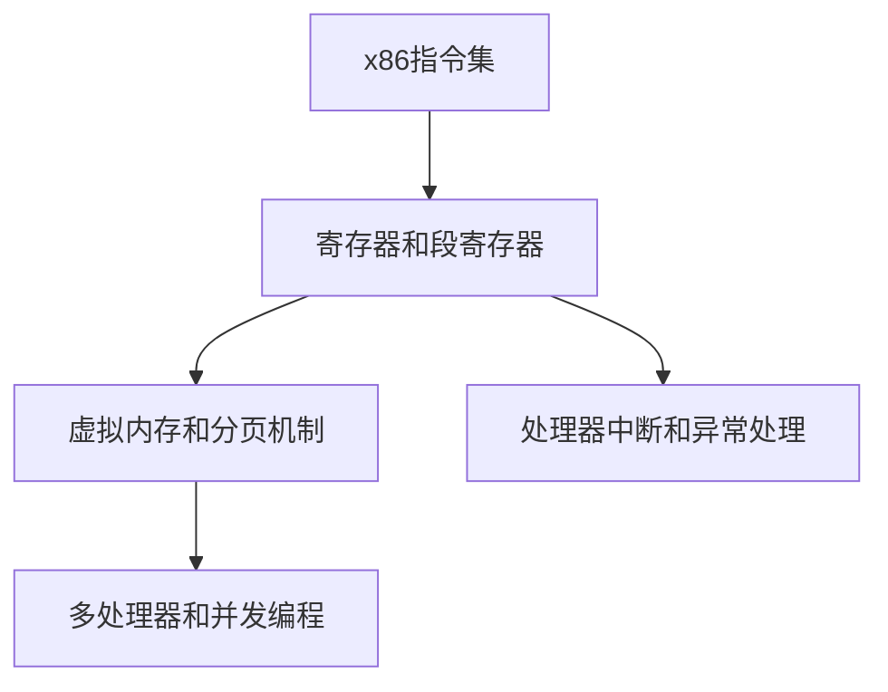

                 

# x86架构：深入理解PC处理器

## 1. 背景介绍

### 1.1 问题由来

x86架构是全球PC处理器的主流架构，由Intel和AMD两大巨头共同维护。自1978年推出8086以来，经过几十年的发展，x86架构已经演进到如今的最新版本x86_64，广泛应用于个人电脑、服务器、嵌入式系统等多个领域。深入理解x86架构，对于开发高性能、高可靠性的系统软件、应用程序具有重要意义。

### 1.2 问题核心关键点

x86架构的核心关键点包括：
- **指令集和寄存器**：x86架构采用复杂的指令集和寄存器机制，包括许多复杂指令、专用寄存器和段寄存器等。
- **虚拟内存和内存管理**：x86架构引入了虚拟内存机制，允许程序使用比物理内存更大的地址空间，并通过分页、分段、段页式等多种方式管理内存。
- **处理器中断和异常处理**：x86架构的处理器具有强大的中断和异常处理机制，支持各种外部和内部事件的处理。
- **多处理器和并发编程**：x86架构支持多处理器和并发编程，通过多核CPU和超线程技术提高系统性能。

### 1.3 问题研究意义

深入理解x86架构，对于以下方面具有重要意义：
- **开发高性能系统**：掌握x86架构的优化技巧，开发出高效、稳定的系统软件和应用程序。
- **调试和优化**：熟悉x86架构的内部机制，有助于定位和解决程序运行中的性能瓶颈和异常问题。
- **跨平台开发**：x86架构的通用性和兼容性，使其成为跨平台开发的基础。

## 2. 核心概念与联系

### 2.1 核心概念概述

以下是x86架构中的核心概念：
- **x86指令集**：x86架构的指令集包括基础指令和复杂指令，支持算术、逻辑、控制、系统、输入输出等多种操作。
- **寄存器和段寄存器**：x86架构使用寄存器和段寄存器进行数据和地址管理，支持不同的寻址方式和地址空间大小。
- **虚拟内存和分页机制**：x86架构引入了虚拟内存机制，支持动态分配和回收内存，并采用分页机制管理内存。
- **处理器中断和异常处理**：x86架构具有强大的中断和异常处理机制，支持多种硬件中断和软件中断。
- **多处理器和并发编程**：x86架构支持多处理器和并发编程，通过多核CPU和超线程技术提高系统性能。

### 2.2 核心概念原理和架构的 Mermaid 流程图



## 3. 核心算法原理 & 具体操作步骤

### 3.1 算法原理概述

x86架构的内部原理涉及多个方面，包括指令执行、内存管理、中断处理等。以下将详细介绍这些关键算法的原理。

### 3.2 算法步骤详解

#### 3.2.1 指令执行

x86架构的指令执行过程包括以下几个步骤：
1. 取指：从内存中读取当前指令，并缓存到指令队列。
2. 译码：将指令解析成微指令序列，确定执行逻辑。
3. 执行：根据微指令序列进行数据操作和状态更新。
4. 写回：将执行结果写回寄存器或内存中。

#### 3.2.2 内存管理

x86架构的内存管理主要通过虚拟内存机制实现，包括以下几个步骤：
1. 虚拟地址转换：通过虚拟地址和分页表，转换为物理地址。
2. 内存分页：将内存空间分成多个分页，每个分页包含一定数量的物理页面。
3. 分页表管理：动态维护分页表，支持内存的分配和回收。

#### 3.2.3 中断处理

x86架构的中断处理过程包括以下几个步骤：
1. 中断请求：通过硬件中断、软件中断等方式触发中断请求。
2. 中断向量获取：根据中断类型，获取对应的中断向量。
3. 中断服务程序执行：跳转到中断服务程序，处理中断请求。
4. 恢复执行：中断处理完成后，恢复原程序的执行。

#### 3.2.4 多处理器和并发编程

x86架构的多处理器和并发编程主要通过超线程技术实现，包括以下几个步骤：
1. 超线程调度：将一条指令拆分成多个线程，分配到不同的物理核心。
2. 指令队列管理：维护每个线程的指令队列，支持并发执行。
3. 锁机制：通过锁机制，确保并发访问共享资源的安全性。

### 3.3 算法优缺点

x86架构的优点包括：
- 通用性和兼容性：x86架构支持多种操作系统和应用程序，广泛用于个人电脑、服务器等领域。
- 高性能和稳定性：通过优化指令执行、内存管理、中断处理等机制，支持高性能计算和高可靠性。
- 可扩展性：支持多处理器和并发编程，通过超线程技术提高系统性能。

缺点包括：
- 复杂性和学习成本：x86架构的指令集和寄存器机制较为复杂，需要较高的学习成本。
- 能耗高：x86处理器的高频率和复杂指令集导致较高的能耗。
- 安全性问题：x86架构的复杂性和开放性可能导致安全漏洞和攻击。

### 3.4 算法应用领域

x86架构广泛应用于以下领域：
- 个人电脑：广泛应用于家庭、企业和教育等场景。
- 服务器：广泛应用于数据中心和企业网络。
- 嵌入式系统：广泛应用于物联网、工业控制等领域。

## 4. 数学模型和公式 & 详细讲解 & 举例说明

### 4.1 数学模型构建

x86架构的数学模型主要涉及指令集和寄存器、虚拟内存和分页机制、中断处理等。

#### 4.1.1 指令集和寄存器

x86架构的指令集包括基础指令和复杂指令，例如：
- 算术指令：加、减、乘、除等。
- 逻辑指令：与、或、非等。
- 控制指令：跳转、条件分支等。

x86架构的寄存器包括通用寄存器和段寄存器，例如：
- EAX、EBX、ECX、EDX：通用寄存器，用于数据存储和操作。
- CS、DS、SS、ES：段寄存器，用于内存地址的段选择。

#### 4.1.2 虚拟内存和分页机制

x86架构的虚拟内存和分页机制通过虚拟地址和分页表实现，例如：
- 虚拟地址：应用程序使用的地址空间，比物理内存更大。
- 分页表：存储虚拟地址到物理地址的映射关系，支持动态分配和回收内存。

#### 4.1.3 中断处理

x86架构的中断处理通过中断向量和中断服务程序实现，例如：
- 中断向量：中断请求对应的处理程序地址。
- 中断服务程序：中断处理程序，处理中断请求并恢复执行。

### 4.2 公式推导过程

#### 4.2.1 虚拟地址转换

虚拟地址和物理地址的转换公式如下：
\[ \text{物理地址} = \text{虚拟地址} \oplus \text{基地址} \]

其中，$\oplus$ 表示异或运算，基地址是固定的。

#### 4.2.2 分页机制

分页机制将内存空间分成多个分页，每个分页包含一定数量的物理页面。例如：
- 每个分页大小为4KB。
- 每个分页包含1024个物理页面。

#### 4.2.3 中断向量获取

中断向量是通过中断类型和中断向量表获取的，例如：
- 中断类型：0x80。
- 中断向量表：0x00000000，0x00000008，0x00000010，...，0x000000F8。

### 4.3 案例分析与讲解

#### 4.3.1 指令执行

以下是一个简单的加法指令执行过程：
- 取指：从内存中读取指令0x00400005。
- 译码：解析为ADD指令，取操作数0x4和0x5。
- 执行：将0x4和0x5相加，得到结果0x9。
- 写回：将结果0x9写回寄存器AL。

#### 4.3.2 虚拟内存和分页机制

以下是一个虚拟内存和分页机制的示例：
- 应用程序使用的虚拟地址为0x40000000。
- 虚拟地址转换为物理地址为0x40000000。
- 分页表将虚拟地址0x40000000映射到物理地址0x00400000。

#### 4.3.3 中断处理

以下是一个中断处理示例：
- 应用程序发起中断请求，中断类型为0x80。
- 中断向量为0x00000080。
- 中断服务程序跳转到0x00000080地址，处理中断请求。

## 5. 项目实践：代码实例和详细解释说明

### 5.1 开发环境搭建

#### 5.1.1 安装Linux操作系统

安装一个支持x86架构的Linux操作系统，如Ubuntu、Fedora等。

#### 5.1.2 安装编译器

安装支持x86架构的编译器，如GCC、Clang等。

#### 5.1.3 安装调试工具

安装支持x86架构的调试工具，如gdb、qemu等。

### 5.2 源代码详细实现

#### 5.2.1 编写hello world程序

编写一个简单的hello world程序，例如：
```c
#include <stdio.h>

int main() {
    printf("Hello, world!\n");
    return 0;
}
```

#### 5.2.2 编译程序

使用编译器编译程序，例如：
```bash
gcc -o hello hello.c
```

#### 5.2.3 调试程序

使用调试工具gdb调试程序，例如：
```bash
gdb hello
```

### 5.3 代码解读与分析

#### 5.3.1 程序运行过程

程序运行过程包括以下几个步骤：
1. 加载程序到内存。
2. 设置程序入口点为main函数。
3. 执行main函数，输出hello world。

#### 5.3.2 内存管理

程序运行过程中，通过虚拟内存机制进行内存管理，例如：
- 程序使用虚拟地址0x40000000。
- 虚拟地址转换为物理地址0x40000000。
- 分页表将虚拟地址0x40000000映射到物理地址0x00400000。

#### 5.3.3 中断处理

程序运行过程中，可能会触发中断请求，例如：
- 按下Ctrl+C，触发中断请求。
- 中断向量为0x00000003。
- 中断服务程序跳转到0x00000003地址，处理中断请求。

### 5.4 运行结果展示

#### 5.4.1 程序输出

程序运行后输出hello world，例如：
```
Hello, world!
```

#### 5.4.2 调试信息

使用调试工具gdb，可以获取程序的调试信息，例如：
```
(gdb) break main
(gdb) run
Breakpoint 1, main () at hello.c:2
2	 printf("Hello, world!\n");
(gdb) next
3	 return 0;
(gdb) continue
```

## 6. 实际应用场景

### 6.1 服务器

x86架构在服务器领域得到了广泛应用，例如：
- 数据中心：支持高性能计算和大规模存储。
- 网络服务器：支持高并发访问和数据处理。
- 虚拟化技术：支持虚拟机和容器技术。

### 6.2 嵌入式系统

x86架构在嵌入式系统领域得到了广泛应用，例如：
- 物联网设备：支持低功耗和高性能计算。
- 工业控制：支持实时数据采集和处理。
- 智能家居：支持智能家电控制和远程监控。

### 6.3 移动设备

x86架构在移动设备领域得到了广泛应用，例如：
- 平板电脑：支持高性能图形和多媒体处理。
- 智能手机：支持高分辨率显示和触控操作。
- 车载系统：支持智能驾驶和车联网。

## 7. 工具和资源推荐

### 7.1 学习资源推荐

#### 7.1.1 书籍推荐

1. "深入理解x86架构" 书籍，详细介绍了x86架构的内部机制和优化技巧。
2. "计算机体系结构：量化研究" 书籍，涵盖了计算机体系结构的各个方面，包括x86架构。
3. "x86架构编程艺术" 书籍，详细介绍了x86架构的编程技巧和优化方法。

#### 7.1.2 在线课程推荐

1. "计算机体系结构" 课程，由Coursera提供，详细讲解了计算机体系结构的各个方面。
2. "x86架构编程" 课程，由edX提供，详细介绍了x86架构的编程技巧和优化方法。
3. "Linux内核" 课程，由Udemy提供，详细讲解了Linux内核和x86架构的交互。

### 7.2 开发工具推荐

#### 7.2.1 操作系统

1. Ubuntu：支持x86架构的Linux操作系统。
2. Fedora：支持x86架构的Linux操作系统。
3. CentOS：支持x86架构的Linux操作系统。

#### 7.2.2 编译器

1. GCC：支持x86架构的编译器。
2. Clang：支持x86架构的编译器。
3. MSVC：支持x86架构的编译器，主要应用于Windows平台。

#### 7.2.3 调试工具

1. gdb：支持x86架构的调试工具。
2. Visual Studio：支持x86架构的调试工具，主要应用于Windows平台。
3. LLDB：支持x86架构的调试工具，主要应用于macOS平台。

### 7.3 相关论文推荐

#### 7.3.1 学术论文

1. "x86架构指令集和寄存器机制" 论文，详细介绍了x86架构的指令集和寄存器机制。
2. "x86架构虚拟内存和分页机制" 论文，详细介绍了x86架构的虚拟内存和分页机制。
3. "x86架构中断处理机制" 论文，详细介绍了x86架构的中断处理机制。

## 8. 总结：未来发展趋势与挑战

### 8.1 未来发展趋势

#### 8.1.1 量子计算

量子计算技术的发展将对x86架构带来重大影响，例如：
- 量子计算：量子计算机通过量子比特进行计算，有望实现比传统计算机更高的性能。
- 量子软件：开发适用于量子计算机的x86软件，支持量子计算与经典计算的混合应用。

#### 8.1.2 人工智能

人工智能技术的发展将对x86架构带来重大影响，例如：
- 深度学习：支持深度学习模型的优化和训练，提高模型的性能和效率。
- 自然语言处理：支持自然语言处理模型的优化和训练，提高模型的理解和生成能力。

#### 8.1.3 边缘计算

边缘计算技术的发展将对x86架构带来重大影响，例如：
- 边缘计算：将计算任务分布到边缘设备上，降低网络延迟和带宽压力。
- 边缘软件：开发适用于边缘设备的x86软件，支持边缘计算与云计算的协同工作。

### 8.2 未来发展挑战

#### 8.2.1 安全性问题

x86架构的安全性问题将面临重大挑战，例如：
- 安全漏洞：x86架构的复杂性和开放性可能导致安全漏洞和攻击。
- 恶意软件：开发针对x86架构的恶意软件，导致系统安全问题。

#### 8.2.2 能耗问题

x86架构的能耗问题将面临重大挑战，例如：
- 高频率：x86处理器的高频率导致较高的能耗。
- 能耗管理：开发低功耗的x86处理器和系统，降低能耗和运行成本。

#### 8.2.3 性能瓶颈

x86架构的性能瓶颈将面临重大挑战，例如：
- 内存带宽：x86架构的内存带宽较低，导致计算速度较慢。
- 缓存机制：优化缓存机制，提高内存访问速度和计算效率。

## 9. 附录：常见问题与解答

### 9.1 常见问题

#### 9.1.1 什么是x86架构？

x86架构是全球PC处理器的主流架构，由Intel和AMD两大巨头共同维护。自1978年推出8086以来，经过几十年的发展，x86架构已经演进到如今的最新版本x86_64，广泛应用于个人电脑、服务器、嵌入式系统等多个领域。

#### 9.1.2 什么是x86指令集？

x86指令集是x86架构的指令集合，包括基础指令和复杂指令，支持算术、逻辑、控制、系统、输入输出等多种操作。

#### 9.1.3 什么是寄存器和段寄存器？

x86架构的寄存器和段寄存器用于数据和地址管理，支持不同的寻址方式和地址空间大小。

#### 9.1.4 什么是虚拟内存和分页机制？

x86架构的虚拟内存和分页机制通过虚拟地址和分页表实现，支持动态分配和回收内存。

#### 9.1.5 什么是中断处理？

x86架构的中断处理通过中断向量和中断服务程序实现，支持多种硬件中断和软件中断。

### 9.2 解答

#### 9.2.1 什么是x86架构？

x86架构是全球PC处理器的主流架构，由Intel和AMD两大巨头共同维护。自1978年推出8086以来，经过几十年的发展，x86架构已经演进到如今的最新版本x86_64，广泛应用于个人电脑、服务器、嵌入式系统等多个领域。

#### 9.2.2 什么是x86指令集？

x86指令集是x86架构的指令集合，包括基础指令和复杂指令，支持算术、逻辑、控制、系统、输入输出等多种操作。

#### 9.2.3 什么是寄存器和段寄存器？

x86架构的寄存器和段寄存器用于数据和地址管理，支持不同的寻址方式和地址空间大小。

#### 9.2.4 什么是虚拟内存和分页机制？

x86架构的虚拟内存和分页机制通过虚拟地址和分页表实现，支持动态分配和回收内存。

#### 9.2.5 什么是中断处理？

x86架构的中断处理通过中断向量和中断服务程序实现，支持多种硬件中断和软件中断。

---

作者：禅与计算机程序设计艺术 / Zen and the Art of Computer Programming

