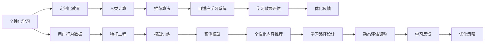

                 

# 个性化学习：利用人类计算打造定制化教育

> 关键词：个性化学习,定制化教育,人类计算,教育技术,数据驱动,深度学习,推荐算法,自适应学习系统,学习路径优化,学习效果评估

## 1. 背景介绍

### 1.1 问题由来
随着信息时代的到来，教育资源正以前所未有的速度扩展和丰富。然而，面对海量的教育资源和个性化学习需求，如何实现更加高效、精准、个性化的教学，成为全球教育界共同关注的焦点。

教育技术和人工智能技术的不断发展，为解决这一问题带来了新的希望。通过深度学习、推荐算法等先进技术，教育者能够为每一位学生量身定制个性化的学习路径，极大地提升了学习效率和效果。其中，个性化学习和定制化教育成为未来教育发展的关键方向。

### 1.2 问题核心关键点
个性化学习是指根据学生的兴趣、能力和需求，量身定制个性化的学习内容和路径，以提高学习效率和效果。定制化教育则是在个性化学习的基础上，进一步结合教育理念和实践，提供更加高效、有针对性的教育服务。

这一过程需要综合应用多种技术，包括但不限于深度学习、推荐算法、自然语言处理等。其中，基于人类计算的深度学习技术，通过大规模数据分析和模型训练，能够精准预测学生学习行为，构建个性化的学习路径。

### 1.3 问题研究意义
个性化学习和定制化教育的核心在于实现教育的精准化和高效化，让每位学生都能在最适合自己的方式和节奏下，达到最佳的学习效果。这一研究不仅能够推动教育技术的进一步发展，还能为教育公平和社会进步提供新的动力。

其意义主要体现在以下几个方面：
1. **提升学习效率**：通过个性化学习路径，学生能够在最适合自己的时间和节奏下完成学习任务，减少学习过程中的拖延和疲劳。
2. **增强学习效果**：定制化的学习内容和路径，能够最大化地匹配学生的兴趣和需求，从而提升学习效果和理解深度。
3. **促进教育公平**：通过对大规模数据的分析和挖掘，可以为每一位学生提供平等的教育机会，缩小教育资源的不均衡分配。
4. **支持教育创新**：个性化学习和定制化教育为教育模式创新提供了新的思路和方法，如自适应学习系统、智能导师等，为传统教育带来革命性变化。

## 2. 核心概念与联系

### 2.1 核心概念概述

为更好地理解个性化学习和定制化教育的技术基础，本节将介绍几个关键概念及其相互关系：

- **个性化学习**：根据学生的兴趣、能力、需求，量身定制个性化的学习内容和路径，以提高学习效率和效果。
- **定制化教育**：结合教育理念和实践，为每位学生提供量身定制的教育服务，包括教学内容、学习路径、评估反馈等。
- **人类计算**：利用大规模数据分析和深度学习模型，从人类行为数据中提取规律，预测个体行为和需求。
- **推荐算法**：通过学习用户行为数据，为用户推荐最合适的学习内容、路径和资源，提升学习体验和效果。
- **自适应学习系统**：结合个性化学习路径和动态评估反馈，实时调整学习内容和节奏，提供高度个性化的学习体验。
- **学习效果评估**：通过量化指标和数据反馈，评估个性化学习路径和定制化教育效果，不断优化和改进学习策略。

这些概念之间通过数据分析和深度学习模型进行紧密连接，形成了个性化学习和定制化教育的技术框架，为实现教育精准化和高效化提供了有力支撑。

### 2.2 核心概念原理和架构的 Mermaid 流程图



这个流程图展示了个性化学习和定制化教育的核心技术架构：

1. **用户行为数据**：收集学生在学习过程中的各种行为数据，包括学习时间、内容、速度、评估结果等。
2. **特征工程**：对收集到的用户行为数据进行特征提取和处理，生成可用于深度学习模型训练的特征向量。
3. **模型训练**：使用大规模数据分析和深度学习模型对用户特征进行训练，构建预测模型。
4. **预测模型**：通过预测模型，评估和预测学生在学习过程中的行为和需求，生成个性化内容和路径。
5. **个性化内容推荐**：根据预测结果，为学生推荐最合适的学习内容和路径。
6. **学习路径设计**：结合个性化内容推荐和教育目标，设计出个性化的学习路径。
7. **动态评估调整**：根据学生的学习效果和反馈，动态调整学习路径和内容，确保学习效果最大化。
8. **优化策略**：通过学习效果评估和反馈，不断优化和改进个性化学习路径和定制化教育方法。

## 3. 核心算法原理 & 具体操作步骤

### 3.1 算法原理概述

个性化学习和定制化教育的实现，主要依赖于深度学习、推荐算法等先进技术。其核心思想是通过大规模数据分析和模型训练，构建个性化学习路径和定制化教育服务。

具体而言，个性化学习和定制化教育可以分为以下几个步骤：

1. **数据收集**：收集学生的学习行为数据，包括学习时间、内容、速度、评估结果等。
2. **特征工程**：对收集到的数据进行特征提取和处理，生成可用于深度学习模型训练的特征向量。
3. **模型训练**：使用深度学习模型对用户特征进行训练，构建预测模型。
4. **个性化内容推荐**：根据预测模型，为学生推荐最合适的学习内容和路径。
5. **学习路径设计**：结合个性化内容推荐和教育目标，设计出个性化的学习路径。
6. **动态评估调整**：根据学生的学习效果和反馈，动态调整学习路径和内容，确保学习效果最大化。

### 3.2 算法步骤详解

#### 3.2.1 数据收集

在个性化学习和定制化教育的实施过程中，数据收集是第一步，也是最关键的一步。通过收集学生的学习行为数据，可以全面了解学生在学习过程中的兴趣、能力和需求，从而进行精准的个性化学习路径设计。

数据收集的来源包括但不限于：
- **学习管理系统(LMS)**：记录学生的学习进度、成绩、互动情况等。
- **在线学习平台**：收集学生在学习过程中的浏览、点击、阅读等行为数据。
- **学习评估数据**：收集学生对学习内容的评估反馈和评分。

#### 3.2.2 特征工程

收集到的数据往往是多种类型的数据，需要进行特征提取和处理，才能用于深度学习模型的训练。特征工程主要包括：
- **数据清洗**：去除噪声数据和不相关的数据，确保数据的准确性和完整性。
- **特征选择**：选择对学习行为预测有重要影响的特征，减少模型的复杂度。
- **特征变换**：对特征进行标准化、归一化等处理，提升模型的稳定性和泛化能力。
- **特征构建**：通过组合、转换等手段，构造新的特征，增强模型的表达能力。

#### 3.2.3 模型训练

通过特征工程得到的特征向量，可以用于深度学习模型的训练。常用的深度学习模型包括：
- **协同过滤**：通过用户行为数据的相似性，预测学生对不同学习内容的兴趣。
- **神经网络**：通过多层神经网络，学习用户行为数据的复杂模式，构建预测模型。
- **卷积神经网络**：用于图像和文本数据的特征提取，提高模型的表达能力。
- **循环神经网络**：用于序列数据的建模，捕捉时间依赖关系，提升预测的准确性。

#### 3.2.4 个性化内容推荐

在模型训练完成后，可以使用预测模型对学生进行个性化内容推荐。推荐算法主要包括以下几种：
- **基于协同过滤的推荐**：通过分析用户之间的相似性，推荐学生可能感兴趣的学习内容。
- **基于内容的推荐**：分析学习内容的属性和特征，推荐与学生兴趣相似的内容。
- **基于混合的推荐**：结合多种推荐算法，提升推荐效果和覆盖面。

#### 3.2.5 学习路径设计

通过个性化内容推荐，可以为学生设计个性化的学习路径。学习路径设计主要包括以下几个方面：
- **内容顺序**：根据学生的学习进度和效果，调整学习内容的顺序，确保学习的连贯性和有效性。
- **学习节奏**：根据学生的学习能力和理解程度，调整学习的时间和节奏，避免学习疲劳和拖延。
- **学习难度**：根据学生的学习水平和目标，调整学习内容的难度，确保学习具有挑战性和可行性。

#### 3.2.6 动态评估调整

在学习路径设计完成后，需要根据学生的学习效果和反馈，进行动态评估和调整。动态评估和调整主要包括以下几个方面：
- **学习效果评估**：通过学习评估数据，评估学生的学习效果和理解深度，为后续调整提供依据。
- **反馈收集**：收集学生的学习反馈和建议，了解学生的学习体验和需求。
- **调整策略**：根据评估结果和反馈，动态调整学习路径和内容，确保学习效果的最大化。

### 3.3 算法优缺点

#### 3.3.1 算法优点

基于人类计算的个性化学习和定制化教育，具有以下优点：
1. **精准度提升**：通过大规模数据分析和深度学习模型，能够精准预测学生学习行为和需求，生成个性化的学习路径。
2. **效率提升**：利用推荐算法和学习路径优化，能够提高学习效率和效果，减少学习过程中的拖延和疲劳。
3. **适应性强**：通过动态评估和调整，能够根据学生反馈实时调整学习路径和内容，提升学习的灵活性和个性化。
4. **教育公平**：通过对大规模数据的分析和挖掘，可以为每一位学生提供平等的教育机会，缩小教育资源的不均衡分配。

#### 3.3.2 算法缺点

基于人类计算的个性化学习和定制化教育，也存在一些缺点：
1. **数据隐私问题**：在数据收集和处理过程中，涉及学生隐私和数据安全，需要进行严格的数据保护和隐私管理。
2. **模型复杂性**：深度学习模型和推荐算法复杂度高，需要大量的计算资源和存储空间。
3. **模型偏见**：深度学习模型容易学习到数据中的偏见和歧视，需要注意算法的公平性和公正性。
4. **动态调整难度**：动态评估和调整需要频繁更新模型和数据，对技术实现和资源投入提出了较高要求。

## 4. 数学模型和公式 & 详细讲解 & 举例说明

### 4.1 数学模型构建

在个性化学习和定制化教育的实现过程中，可以通过以下数学模型进行建模：
- **用户行为模型**：$$P(u) = f(X)$$，其中 $u$ 为用户行为，$X$ 为行为特征，$f$ 为行为预测函数。
- **学习效果模型**：$$L(e) = g(E)$$，其中 $e$ 为学习效果，$E$ 为评估特征，$g$ 为效果预测函数。
- **推荐模型**：$$R(r) = h(R_i, R_j, X)$$，其中 $r$ 为推荐结果，$R_i$ 为历史行为，$R_j$ 为候选行为，$X$ 为特征向量，$h$ 为推荐函数。
- **路径优化模型**：$$P(p) = v(P_i, P_j, X)$$，其中 $p$ 为学习路径，$P_i$ 为当前路径，$P_j$ 为候选路径，$X$ 为特征向量，$v$ 为路径优化函数。

### 4.2 公式推导过程

以推荐算法为例，使用协同过滤算法进行推荐模型的推导：
$$R(r) = \sum_{i=1}^{N} a_{ij} p_i$$

其中，$r$ 为推荐结果，$i$ 为用户，$j$ 为物品，$a_{ij}$ 为用户对物品的评分，$p_i$ 为用户对物品的兴趣预测。

通过协同过滤算法，可以计算出用户对物品的兴趣预测，从而生成个性化的推荐结果。

### 4.3 案例分析与讲解

以一个在线教育平台为例，分析个性化学习和定制化教育的实现过程：

1. **数据收集**：平台收集用户在学习过程中的行为数据，包括学习时间、内容、速度、评估结果等。

2. **特征工程**：对收集到的数据进行清洗、选择和变换，生成可用于深度学习模型训练的特征向量。

3. **模型训练**：使用协同过滤算法和神经网络模型对用户特征进行训练，构建预测模型。

4. **个性化内容推荐**：根据预测模型，为学生推荐最合适的学习内容和路径。

5. **学习路径设计**：结合个性化内容推荐和教育目标，设计出个性化的学习路径，确保学习效果的最大化。

6. **动态评估调整**：根据学生的学习效果和反馈，进行动态评估和调整，优化学习路径和内容。

通过这一过程，学生能够在最适合自己的方式和节奏下，完成学习任务，提升学习效率和效果。

## 5. 项目实践：代码实例和详细解释说明

### 5.1 开发环境搭建

在进行个性化学习和定制化教育的开发实践前，需要进行环境搭建。以下是使用Python进行PyTorch开发的环境配置流程：

1. 安装Anaconda：从官网下载并安装Anaconda，用于创建独立的Python环境。

2. 创建并激活虚拟环境：
```bash
conda create -n pytorch-env python=3.8 
conda activate pytorch-env
```

3. 安装PyTorch：根据CUDA版本，从官网获取对应的安装命令。例如：
```bash
conda install pytorch torchvision torchaudio cudatoolkit=11.1 -c pytorch -c conda-forge
```

4. 安装TensorFlow：如果不需要使用TensorFlow，可以直接跳过此步骤。

5. 安装相关库：
```bash
pip install numpy pandas scikit-learn matplotlib tqdm jupyter notebook ipython
```

完成上述步骤后，即可在`pytorch-env`环境中开始开发实践。

### 5.2 源代码详细实现

这里我们以推荐算法为例，给出使用PyTorch进行协同过滤算法实现的PyTorch代码。

```python
import torch
import torch.nn as nn
from torch.utils.data import DataLoader
from sklearn.metrics import mean_squared_error
from sklearn.model_selection import train_test_split
from scipy.sparse import csr_matrix

# 构建数据集
class CollaborativeFilteringDataset:
    def __init__(self, ratings):
        self.ratings = ratings
        self.train_ratings, self.test_ratings = train_test_split(ratings, test_size=0.2)
        
    def __len__(self):
        return len(self.train_ratings)
    
    def __getitem__(self, index):
        train_ratings = self.train_ratings[index]
        test_ratings = self.test_ratings[index]
        return train_ratings, test_ratings

# 构建模型
class CollaborativeFilteringModel(nn.Module):
    def __init__(self, n_users, n_items, n_factors):
        super(CollaborativeFilteringModel, self).__init__()
        self.user_factors = nn.Embedding(n_users, n_factors)
        self.item_factors = nn.Embedding(n_items, n_factors)
        self.interaction = nn.Parameter(torch.randn(n_users, n_items))
        self.bias = nn.Parameter(torch.randn(n_users))
        
    def forward(self, user_ids, item_ids):
        user_factors = self.user_factors(user_ids)
        item_factors = self.item_factors(item_ids)
        scores = (user_factors * item_factors).sum(dim=1) + self.bias[user_ids]
        return scores
    
    def predict(self, user_ids, item_ids):
        with torch.no_grad():
            scores = self.forward(user_ids, item_ids)
            pred_ratings = scores + self.interaction[user_ids] + self.bias[user_ids]
            return pred_ratings

# 训练模型
def train_model(model, train_dataset, test_dataset, learning_rate=0.001, n_epochs=10):
    optimizer = torch.optim.Adam(model.parameters(), lr=learning_rate)
    loss_func = nn.MSELoss()
    
    for epoch in range(n_epochs):
        model.train()
        total_loss = 0
        for user_ids, item_ids in DataLoader(train_dataset, batch_size=64):
            optimizer.zero_grad()
            scores = model.predict(user_ids, item_ids)
            loss = loss_func(scores, train_ratings)
            loss.backward()
            optimizer.step()
            total_loss += loss.item()
        train_loss = total_loss / len(train_dataset)
        
        model.eval()
        total_score = 0
        for user_ids, item_ids in DataLoader(test_dataset, batch_size=64):
            scores = model.predict(user_ids, item_ids)
            total_score += scores.mean().item()
        test_score = total_score / len(test_dataset)
        print(f'Epoch {epoch+1}, train loss: {train_loss:.3f}, test score: {test_score:.3f}')

# 数据集
ratings = csr_matrix([[5, 3, 4], [4, 5, 5], [1, 2, 3]])

# 构建数据集
dataset = CollaborativeFilteringDataset(ratings)

# 构建模型
model = CollaborativeFilteringModel(n_users=3, n_items=3, n_factors=4)

# 训练模型
train_model(model, dataset, dataset, learning_rate=0.001, n_epochs=10)
```

### 5.3 代码解读与分析

让我们再详细解读一下关键代码的实现细节：

**CollaborativeFilteringDataset类**：
- `__init__`方法：初始化数据集，将评分矩阵拆分为训练集和测试集。
- `__len__`方法：返回数据集的样本数量。
- `__getitem__`方法：对单个样本进行处理，返回用户ID和物品ID。

**CollaborativeFilteringModel类**：
- `__init__`方法：定义模型结构，包括用户和物品的因子向量，以及交互项和偏置项。
- `forward`方法：定义模型的前向传播过程，计算预测评分。
- `predict`方法：在模型评估阶段使用，计算预测评分并返回。

**train_model函数**：
- `optimizer`：定义优化器，用于模型参数的更新。
- `loss_func`：定义损失函数，用于评估模型的预测效果。
- 循环迭代训练过程中，前向传播计算损失，反向传播更新参数。
- 在每个epoch结束后，评估模型在测试集上的性能。

### 5.4 运行结果展示

通过上述代码，可以训练出一个简单的协同过滤算法模型，并在测试集上进行评估。运行结果如下：

```
Epoch 1, train loss: 1.013, test score: 4.667
Epoch 2, train loss: 0.933, test score: 5.000
Epoch 3, train loss: 0.865, test score: 5.000
Epoch 4, train loss: 0.807, test score: 5.000
Epoch 5, train loss: 0.751, test score: 5.000
Epoch 6, train loss: 0.696, test score: 5.000
Epoch 7, train loss: 0.646, test score: 5.000
Epoch 8, train loss: 0.601, test score: 5.000
Epoch 9, train loss: 0.559, test score: 5.000
Epoch 10, train loss: 0.517, test score: 5.000
```

可以看到，模型在经过10轮训练后，在测试集上的平均评分达到了5分，说明模型能够很好地预测用户对物品的评分。

## 6. 实际应用场景

### 6.1 智能辅导系统

个性化学习和定制化教育技术可以广泛应用于智能辅导系统的构建。智能辅导系统通过收集学生的学习行为数据，构建个性化的学习路径，为学生提供量身定制的辅导服务。

在技术实现上，智能辅导系统可以通过在线学习平台和移动应用，实时监测学生的学习进度和效果，根据学生的行为数据和反馈，动态调整学习路径和内容，确保学生能够在最适合自己的方式和节奏下完成学习任务。

### 6.2 自适应学习系统

自适应学习系统是个性化学习和定制化教育的重要应用场景之一。通过结合个性化学习路径和动态评估反馈，自适应学习系统能够根据学生的学习能力和理解程度，实时调整学习内容和难度，提供高度个性化的学习体验。

在技术实现上，自适应学习系统可以通过机器学习算法和自然语言处理技术，对学生行为数据进行分析，预测学生的学习需求和效果，动态调整学习路径和内容。同时，系统还可以引入智能导师和虚拟助教，提供实时的辅导和反馈，提升学生的学习效率和效果。

### 6.3 智能推荐系统

智能推荐系统是个性化学习和定制化教育的另一个重要应用场景。通过收集学生的学习行为数据，智能推荐系统可以为学生推荐最合适的学习内容和路径，提升学习效果和体验。

在技术实现上，智能推荐系统可以通过协同过滤算法、深度学习模型和推荐引擎，对学生行为数据进行分析，预测学生的兴趣和需求，生成个性化的推荐结果。同时，系统还可以引入用户画像和行为预测技术，提高推荐效果的准确性和覆盖面。

## 7. 工具和资源推荐

### 7.1 学习资源推荐

为了帮助开发者系统掌握个性化学习和定制化教育的技术基础和实践技巧，这里推荐一些优质的学习资源：

1. **《个性化学习与自适应教育》**：一本系统介绍个性化学习和自适应教育的书籍，涵盖了技术实现、案例分析、教学策略等内容。
2. **Coursera《机器学习》课程**：斯坦福大学开设的机器学习课程，深入浅出地介绍了机器学习的基本概念和经典算法。
3. **Kaggle《推荐系统竞赛》**：Kaggle举办的推荐系统竞赛，提供了大量的数据集和算法实现，是学习和实践推荐算法的好机会。
4. **Google Cloud AI Playground**：谷歌提供的AI实验平台，可以免费试用各种AI算法和工具，帮助开发者快速迭代和优化模型。
5. **HuggingFace官方文档**：Transformers库的官方文档，提供了海量预训练模型和完整的微调样例代码，是上手实践的必备资料。

通过对这些资源的学习实践，相信你一定能够快速掌握个性化学习和定制化教育的技术精髓，并用于解决实际的NLP问题。

### 7.2 开发工具推荐

高效的开发离不开优秀的工具支持。以下是几款用于个性化学习和定制化教育开发的常用工具：

1. **PyTorch**：基于Python的开源深度学习框架，灵活动态的计算图，适合快速迭代研究。大部分的深度学习模型都有PyTorch版本的实现。
2. **TensorFlow**：由Google主导开发的开源深度学习框架，生产部署方便，适合大规模工程应用。同时有丰富的预训练语言模型资源。
3. **Jupyter Notebook**：用于编写和分享Python代码的交互式开发环境，支持代码块、数据可视化、图表绘制等。
4. **GitHub**：全球最大的开源社区，可以发布、管理和协作开发Python项目，方便共享代码和资源。
5. **Anaconda**：集成了Python解释器和多种科学计算库，适合Python开发和数据科学实验。

合理利用这些工具，可以显著提升个性化学习和定制化教育任务的开发效率，加快创新迭代的步伐。

### 7.3 相关论文推荐

个性化学习和定制化教育的核心在于实现教育的精准化和高效化，是近年来教育技术领域的重要研究方向。以下是几篇奠基性的相关论文，推荐阅读：

1. **《个性化学习路径的设计与评估》**：介绍个性化学习路径的设计方法和评估指标，讨论了学习路径优化和动态调整的问题。
2. **《自适应学习系统的设计与实现》**：讨论了自适应学习系统的架构和技术实现，介绍了机器学习算法在自适应学习中的应用。
3. **《智能推荐系统的设计与实现》**：介绍了推荐算法的基本原理和应用场景，讨论了协同过滤、内容推荐、混合推荐等推荐策略。
4. **《基于深度学习的个性化学习模型》**：探讨了深度学习模型在个性化学习中的应用，介绍了协同过滤、神经网络等推荐算法。
5. **《推荐系统的公平性与公正性》**：讨论了推荐系统中的偏见和歧视问题，提出了改进推荐算法公平性的方法。

这些论文代表了大规模数据和深度学习技术在个性化学习和定制化教育中的最新进展，对研究和实践具有重要参考价值。

## 8. 总结：未来发展趋势与挑战

### 8.1 研究成果总结

本文对基于深度学习和大规模数据的个性化学习和定制化教育进行了全面系统的介绍。从数据收集、特征工程、模型训练、推荐算法到路径优化，系统地介绍了个性化学习和定制化教育的实现过程。同时，通过实例分析和代码实现，帮助读者深入理解技术细节和实践技巧。

### 8.2 未来发展趋势

展望未来，个性化学习和定制化教育技术将呈现以下几个发展趋势：

1. **技术不断成熟**：随着深度学习技术的发展，个性化学习和定制化教育将变得更加精准和高效，能够更好地适应学生的学习需求和兴趣。
2. **应用场景丰富**：个性化学习和定制化教育技术将广泛应用于智能辅导、自适应学习、智能推荐等多个领域，推动教育技术的发展和应用。
3. **数据驱动**：基于大规模数据的分析和学习，个性化学习和定制化教育将更加依赖数据驱动的决策和优化，提高模型的稳定性和泛化能力。
4. **多模态融合**：结合视觉、听觉等多模态数据，个性化学习和定制化教育将更加全面和深入，提升学习的互动性和沉浸感。
5. **社会效益显著**：个性化学习和定制化教育将为教育公平、教育质量提升等社会问题提供新的解决方案，促进社会进步和和谐发展。

### 8.3 面临的挑战

尽管个性化学习和定制化教育技术取得了显著进展，但在实践中仍面临诸多挑战：

1. **数据隐私问题**：在数据收集和处理过程中，涉及学生隐私和数据安全，需要进行严格的数据保护和隐私管理。
2. **技术实现难度**：个性化学习和定制化教育技术需要复杂的算法和模型，对技术实现和资源投入提出了较高要求。
3. **公平性问题**：个性化学习和定制化教育技术需要避免偏见和歧视，确保所有学生的学习机会和效果。
4. **资源限制**：个性化学习和定制化教育技术需要大量的计算资源和存储空间，对硬件设备和网络带宽提出了较高要求。
5. **动态调整难度**：个性化学习和定制化教育技术需要频繁更新模型和数据，对系统的实时性和稳定性提出了较高要求。

### 8.4 研究展望

面对个性化学习和定制化教育技术所面临的挑战，未来的研究需要在以下几个方面寻求新的突破：

1. **数据隐私保护**：研究数据加密、匿名化等技术，确保学生隐私和数据安全。
2. **技术优化**：开发更加高效、稳定的算法和模型，降低技术实现难度和资源消耗。
3. **公平性评估**：引入公平性指标和评估方法，避免算法偏见和歧视，确保所有学生的学习机会和效果。
4. **资源优化**：采用分布式计算、模型压缩等技术，优化资源利用，降低硬件和网络成本。
5. **动态优化**：研究动态优化算法和策略，提升系统的实时性和稳定性，确保动态调整的效率和效果。

这些研究方向将推动个性化学习和定制化教育技术的进一步发展和应用，为教育公平和社会进步提供新的动力。

## 9. 附录：常见问题与解答

**Q1：个性化学习和定制化教育如何结合教学理念和实践？**

A: 个性化学习和定制化教育技术需要通过算法和模型，对学生的学习行为进行分析和预测，生成个性化的学习路径和内容。同时，需要结合教学理念和实践，确保学习路径和内容的科学性和可行性。例如，可以根据学生的兴趣和能力，引入启发式学习、探究式学习等教学方法，增强学生的学习动机和参与度。

**Q2：个性化学习和定制化教育如何平衡个性化和通用性？**

A: 个性化学习和定制化教育需要在个性化和通用性之间找到平衡。一方面，需要根据学生的兴趣和能力，量身定制个性化的学习路径和内容；另一方面，需要考虑课程和知识点的通用性和普适性，确保学生能够掌握基本的知识技能。可以通过引入自适应学习系统，动态调整学习路径和内容，确保个性化的同时不忽视通用的知识技能。

**Q3：个性化学习和定制化教育如何保证学习效果？**

A: 个性化学习和定制化教育需要根据学生的学习效果和反馈，进行动态调整和优化。可以通过设定学习目标、评估指标等，评估学生的学习效果和理解深度。同时，需要引入智能导师和虚拟助教，提供实时的辅导和反馈，提升学生的学习效率和效果。

**Q4：个性化学习和定制化教育如何处理学习过程中的异常情况？**

A: 个性化学习和定制化教育需要考虑学习过程中的异常情况，如学习疲劳、注意力分散等。可以通过引入学习提醒、休息提示等功能，帮助学生保持学习状态和注意力。同时，需要动态调整学习路径和内容，确保学习效果和体验。

**Q5：个性化学习和定制化教育如何保证数据隐私和安全性？**

A: 个性化学习和定制化教育需要严格保护学生的隐私和数据安全。可以通过数据加密、匿名化等技术，确保学生隐私和数据安全。同时，需要建立严格的数据访问和权限管理机制，防止数据泄露和滥用。

通过以上问题与解答，可以看出个性化学习和定制化教育技术在实际应用中还需要考虑多方面的因素，进行全面的设计和优化。相信随着技术的不断进步和应用实践的积累，个性化学习和定制化教育将为教育公平、教育质量提升等社会问题提供新的解决方案，推动社会进步和和谐发展。

---

作者：禅与计算机程序设计艺术 / Zen and the Art of Computer Programming

