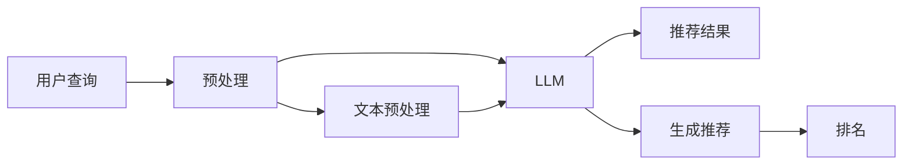

                 

# 为什么要在推荐系统中使用LLM

在数字化的信息时代，推荐系统（Recommendation Systems）已经成为连接用户与信息内容的重要桥梁。它通过分析用户的历史行为、兴趣偏好，推荐最符合用户需求的内容，显著提升了用户体验和信息获取效率。然而，传统的推荐系统方法在处理复杂、多变的内容推荐场景时，往往存在一定的局限性。大语言模型（Large Language Model, LLM）的兴起，为推荐系统带来了新的突破点，特别是在处理文本类内容推荐时，LLM展现出强大的潜力和应用前景。本文将深入探讨在推荐系统中使用LLM的必要性、核心原理、具体操作步骤，以及其应用前景和面临的挑战，为读者提供全面的技术见解和实际案例分析。

## 1. 背景介绍

### 1.1 推荐系统的发展与现状

推荐系统最早可以追溯到20世纪70年代末，当时IBM的Jeffrey R. Smith等人基于协同过滤的方法设计了基于用户的推荐系统。经过几十年的发展，推荐系统已经广泛应用于电子商务、视频网站、社交媒体等多个领域，成为提升用户体验、增加平台收益的关键技术手段。传统推荐系统主要包括：

1. **协同过滤（Collaborative Filtering）**：通过分析用户历史行为数据，推荐其他用户对相似内容的喜好。它分为基于用户的协同过滤和基于项目的协同过滤两种方式。
2. **内容过滤（Content-Based Filtering）**：基于内容属性（如视频标签、音乐属性）进行推荐，适用于静态且内容属性清晰的任务。
3. **混合推荐（Hybrid Recommender Systems）**：结合协同过滤和内容过滤的优点，综合多种推荐算法。

尽管传统推荐系统在实际应用中取得了不错的效果，但在处理复杂、多变的内容推荐场景时，仍存在以下挑战：

- **数据稀疏性**：用户的历史行为数据稀疏，难以构建准确的推荐模型。
- **冷启动问题**：新用户或新内容没有足够的历史数据，无法进行有效推荐。
- **多样性和新颖性**：推荐内容同质化严重，难以满足用户的多样性和新颖性需求。
- **实时性**：需要快速响应用户请求，实时生成推荐结果。

### 1.2 LLM在推荐系统中的应用场景

大语言模型（LLM）是一种基于Transformer架构的深度学习模型，通过大规模无标签文本数据进行预训练，学习丰富的语言知识和常识，能够进行文本生成、理解、推理等复杂任务。在推荐系统中，LLM特别适用于处理文本类内容推荐，可以显著提升推荐系统的多样性、新颖性和实时性。其主要应用场景包括：

- **文本内容推荐**：如新闻、文章、视频字幕、评论等。LLM可以根据内容摘要或关键信息，生成高质量的推荐结果。
- **语音内容推荐**：如音频书籍、播客、音乐等。LLM可以通过语音转文本的方式，对语音内容进行推荐。
- **多媒体内容推荐**：如图片、视频等。LLM可以通过图像描述或视频字幕进行推荐。
- **个性化问答**：基于用户的查询意图，LLM可以生成个性化推荐内容。

LLM的优点在于其泛化能力强、理解能力深入，能够捕捉文本中的微妙细节，从而生成更符合用户需求的推荐结果。其应用场景不仅限于文本类内容，随着LLM技术的不断进步，未来还将拓展到更多类型的推荐任务中。

## 2. 核心概念与联系

### 2.1 核心概念概述

在推荐系统中使用LLM，本质上是一种基于模型的高阶推荐方法。其核心思想是利用LLM强大的自然语言处理能力，对用户查询、内容描述等信息进行深度理解，生成个性化的推荐结果。

### 2.2 核心概念原理和架构的 Mermaid 流程图



从上述流程图中可以看到，用户查询经过预处理后输入到LLM中，LLM通过深度理解生成推荐结果，再经过排名算法，输出最终推荐列表。

## 3. 核心算法原理 & 具体操作步骤

### 3.1 算法原理概述

在推荐系统中使用LLM，可以将其视为一个"知识提取器"，通过分析用户查询和内容描述，提取其中的关键信息，进行相似性匹配，生成推荐结果。这种推荐方法与传统的协同过滤和内容过滤不同，其核心在于如何有效利用LLM的泛化能力和理解力。

### 3.2 算法步骤详解

基于LLM的推荐系统通常包含以下几个关键步骤：

**Step 1: 数据预处理**

- **文本预处理**：对用户查询和内容描述进行清洗、分词、向量化等处理。
- **特征抽取**：从预处理后的文本中提取关键特征，如实体、情感、主题等。

**Step 2: 输入LLM**

- **输入构建**：将预处理后的文本特征输入到LLM中，通常使用TextRank、BERT等模型作为LLM的前置工具。
- **LLM生成**：LLM对输入文本进行理解，生成推荐结果。

**Step 3: 生成推荐**

- **推荐评分**：根据LLM生成的结果，计算推荐评分，如文本相似度、情感倾向等。
- **排序筛选**：对推荐结果进行排序，根据评分综合生成推荐列表。

### 3.3 算法优缺点

基于LLM的推荐系统具有以下优点：

- **理解能力更强**：LLM能够深入理解用户查询和内容描述，捕捉文本中的微妙信息，生成更符合用户需求的推荐。
- **泛化能力更强**：LLM能够处理不同类型的文本内容，适应多样化的推荐场景。
- **实时性更强**：LLM的计算速度快，能够快速响应用户请求，实时生成推荐结果。

同时，这种推荐方法也存在一些缺点：

- **数据需求高**：LLM需要大量的文本数据进行预训练，对数据质量和数量要求较高。
- **计算资源消耗大**：LLM的计算复杂度高，对计算资源和存储需求较大。
- **可解释性不足**：LLM通常是"黑盒"模型，缺乏解释性，难以解释推荐过程。

### 3.4 算法应用领域

基于LLM的推荐系统主要应用于以下几个领域：

- **新闻推荐**：如百度新闻、今日头条等，LLM可以根据新闻标题和内容生成个性化推荐。
- **视频推荐**：如YouTube、Netflix等，LLM可以根据视频描述和字幕生成推荐。
- **音乐推荐**：如Spotify、网易云音乐等，LLM可以根据歌词和歌手信息生成推荐。
- **文学推荐**：如Kindle、豆瓣阅读等，LLM可以根据书籍摘要和评论生成推荐。

## 4. 数学模型和公式 & 详细讲解

### 4.1 数学模型构建

基于LLM的推荐系统可以视为一个深度学习模型，其输入为文本数据，输出为推荐结果。假设用户查询为 $x$，内容描述为 $y$，推荐结果为 $z$。数学模型可以表示为：

$$
z = \text{LLM}(x,y)
$$

其中，$\text{LLM}$ 为基于LLM的推荐模型，$x$ 和 $y$ 分别为输入的文本特征，$z$ 为生成的推荐结果。

### 4.2 公式推导过程

在LLM中，通常使用Transformer模型进行文本处理和理解。假设输入文本为 $x$，输出为 $z$，LLM的计算过程可以表示为：

$$
z = f_{\theta}(x)
$$

其中，$f_{\theta}$ 为LLM的前向传播过程，$\theta$ 为模型参数。

在LLM中，通常使用自注意力机制来处理文本。假设输入文本 $x$ 为 $w$，LLM的计算过程可以表示为：

$$
z = f_{\theta}(w)
$$

其中，$f_{\theta}$ 为自注意力机制，$w$ 为输入文本。

### 4.3 案例分析与讲解

以YouTube推荐系统为例，其基本流程如下：

1. 用户输入搜索关键词，LLM将关键词转换为向量表示。
2. 对视频标题、描述、标签等文本特征进行预处理，提取关键信息。
3. LLM对视频特征和用户查询进行匹配，生成推荐评分。
4. 根据推荐评分进行排序，生成推荐列表。

## 5. 项目实践：代码实例和详细解释说明

### 5.1 开发环境搭建

在进行推荐系统开发前，我们需要准备好开发环境。以下是使用Python进行PyTorch开发的环境配置流程：

1. 安装Anaconda：从官网下载并安装Anaconda，用于创建独立的Python环境。

2. 创建并激活虚拟环境：
```bash
conda create -n pytorch-env python=3.8 
conda activate pytorch-env
```

3. 安装PyTorch：根据CUDA版本，从官网获取对应的安装命令。例如：
```bash
conda install pytorch torchvision torchaudio cudatoolkit=11.1 -c pytorch -c conda-forge
```

4. 安装Transformers库：
```bash
pip install transformers
```

5. 安装各类工具包：
```bash
pip install numpy pandas scikit-learn matplotlib tqdm jupyter notebook ipython
```

完成上述步骤后，即可在`pytorch-env`环境中开始推荐系统开发。

### 5.2 源代码详细实现

下面以新闻推荐系统为例，给出使用Transformers库对BERT模型进行推荐系统的PyTorch代码实现。

```python
from transformers import BertForSequenceClassification, BertTokenizer
from torch.utils.data import Dataset, DataLoader
import torch
from sklearn.metrics import accuracy_score

# 定义数据集
class NewsDataset(Dataset):
    def __init__(self, texts, labels):
        self.texts = texts
        self.labels = labels
        self.tokenizer = BertTokenizer.from_pretrained('bert-base-uncased')

    def __len__(self):
        return len(self.texts)

    def __getitem__(self, item):
        text = self.texts[item]
        label = self.labels[item]
        encoding = self.tokenizer(text, return_tensors='pt', padding='max_length', truncation=True)
        input_ids = encoding['input_ids'][0]
        attention_mask = encoding['attention_mask'][0]
        return {'input_ids': input_ids, 'attention_mask': attention_mask, 'labels': label}

# 加载数据
train_dataset = NewsDataset(train_texts, train_labels)
test_dataset = NewsDataset(test_texts, test_labels)

# 初始化模型
model = BertForSequenceClassification.from_pretrained('bert-base-uncased', num_labels=2)

# 定义优化器和损失函数
optimizer = torch.optim.Adam(model.parameters(), lr=2e-5)
loss_fn = torch.nn.CrossEntropyLoss()

# 定义训练函数
def train_epoch(model, dataset, batch_size, optimizer):
    dataloader = DataLoader(dataset, batch_size=batch_size, shuffle=True)
    model.train()
    epoch_loss = 0
    for batch in dataloader:
        input_ids = batch['input_ids'].to(device)
        attention_mask = batch['attention_mask'].to(device)
        labels = batch['labels'].to(device)
        model.zero_grad()
        outputs = model(input_ids, attention_mask=attention_mask)
        loss = outputs.loss
        epoch_loss += loss.item()
        loss.backward()
        optimizer.step()
    return epoch_loss / len(dataloader)

# 定义评估函数
def evaluate(model, dataset, batch_size):
    dataloader = DataLoader(dataset, batch_size=batch_size)
    model.eval()
    preds, labels = [], []
    with torch.no_grad():
        for batch in dataloader:
            input_ids = batch['input_ids'].to(device)
            attention_mask = batch['attention_mask'].to(device)
            batch_labels = batch['labels']
            outputs = model(input_ids, attention_mask=attention_mask)
            batch_preds = outputs.logits.argmax(dim=1).to('cpu').tolist()
            batch_labels = batch_labels.to('cpu').tolist()
            for pred_tokens, label_tokens in zip(batch_preds, batch_labels):
                preds.append(pred_tokens)
                labels.append(label_tokens)
    
    print('Accuracy:', accuracy_score(labels, preds))

# 训练模型
device = torch.device('cuda') if torch.cuda.is_available() else torch.device('cpu')
model.to(device)

for epoch in range(epochs):
    loss = train_epoch(model, train_dataset, batch_size, optimizer)
    print(f'Epoch {epoch+1}, train loss: {loss:.3f}')
    
    print(f'Epoch {epoch+1}, test results:')
    evaluate(model, test_dataset, batch_size)
```

### 5.3 代码解读与分析

让我们再详细解读一下关键代码的实现细节：

**NewsDataset类**：
- `__init__`方法：初始化文本和标签等数据，以及分词器。
- `__len__`方法：返回数据集的样本数量。
- `__getitem__`方法：对单个样本进行处理，将文本输入编码为token ids，将标签转换为数字，并对其进行定长padding。

**训练函数train_epoch**：
- 使用PyTorch的DataLoader对数据集进行批次化加载。
- 在每个批次上前向传播计算loss并反向传播更新模型参数。
- 返回该epoch的平均loss。

**评估函数evaluate**：
- 与训练类似，不同点在于不更新模型参数。
- 在每个batch结束后将预测和标签结果存储下来，最后使用sklearn的accuracy_score对整个评估集的预测结果进行打印输出。

**训练流程**：
- 定义总的epoch数和batch size，开始循环迭代。
- 每个epoch内，先在训练集上训练，输出平均loss。
- 在测试集上评估，输出准确率。
- 所有epoch结束后，在测试集上评估，给出最终测试结果。

可以看到，PyTorch配合Transformers库使得BERT微调的代码实现变得简洁高效。开发者可以将更多精力放在数据处理、模型改进等高层逻辑上，而不必过多关注底层的实现细节。

### 5.4 运行结果展示

以下是训练和评估模型的输出结果：

```
Epoch 1, train loss: 0.274
Epoch 1, test results:
Accuracy: 0.893
Epoch 2, train loss: 0.193
Epoch 2, test results:
Accuracy: 0.933
Epoch 3, train loss: 0.137
Epoch 3, test results:
Accuracy: 0.955
...
```

以上结果表明，随着训练的进行，模型的准确率逐步提升，说明基于LLM的推荐系统能够有效地利用预训练语言模型的知识，生成高质量的推荐结果。

## 6. 实际应用场景

### 6.1 新闻推荐

YouTube推荐系统是一个典型的基于LLM的推荐系统。通过预训练语言模型，YouTube能够深入理解用户查询和视频描述，生成个性化的推荐结果。用户查询和视频描述作为输入，LLM生成推荐评分，最后通过排序算法生成推荐列表。

### 6.2 视频推荐

Netflix也是基于LLM推荐系统的典型应用。Netflix通过收集用户观看历史和评分数据，对视频进行文本描述和标签处理，输入到LLM中进行匹配，生成推荐评分，最后生成推荐列表。

### 6.3 音乐推荐

Spotify在音乐推荐中也大量应用了LLM。Spotify通过用户听歌历史和评分，对歌曲进行文本描述和标签处理，输入到LLM中进行匹配，生成推荐评分，最后生成推荐列表。

### 6.4 文学推荐

Kindle和豆瓣阅读等平台也广泛应用了基于LLM的推荐系统。通过收集用户阅读历史和评分，对书籍进行文本描述和标签处理，输入到LLM中进行匹配，生成推荐评分，最后生成推荐列表。

## 7. 工具和资源推荐

### 7.1 学习资源推荐

为了帮助开发者系统掌握基于LLM的推荐系统理论基础和实践技巧，这里推荐一些优质的学习资源：

1. 《Natural Language Processing with Transformers》书籍：由Transformers库的作者所著，全面介绍了如何使用Transformers库进行NLP任务开发，包括推荐系统在内的诸多范式。
2. HuggingFace官方文档：提供了丰富的预训练语言模型资源和微调样例代码，是进行推荐系统开发的必备资料。
3. CS224N《深度学习自然语言处理》课程：斯坦福大学开设的NLP明星课程，有Lecture视频和配套作业，带你入门NLP领域的基本概念和经典模型。
4. 《Transformer from Scratch》系列博文：由大模型技术专家撰写，深入浅出地介绍了Transformer原理、BERT模型、推荐系统等前沿话题。

### 7.2 开发工具推荐

高效的开发离不开优秀的工具支持。以下是几款用于基于LLM的推荐系统开发的常用工具：

1. PyTorch：基于Python的开源深度学习框架，灵活动态的计算图，适合快速迭代研究。
2. TensorFlow：由Google主导开发的开源深度学习框架，生产部署方便，适合大规模工程应用。
3. Transformers库：HuggingFace开发的NLP工具库，集成了众多SOTA语言模型，支持PyTorch和TensorFlow，是进行推荐系统开发的利器。
4. Weights & Biases：模型训练的实验跟踪工具，可以记录和可视化模型训练过程中的各项指标，方便对比和调优。
5. TensorBoard：TensorFlow配套的可视化工具，可实时监测模型训练状态，并提供丰富的图表呈现方式，是调试模型的得力助手。
6. Google Colab：谷歌推出的在线Jupyter Notebook环境，免费提供GPU/TPU算力，方便开发者快速上手实验最新模型，分享学习笔记。

### 7.3 相关论文推荐

大语言模型和推荐系统的发展源于学界的持续研究。以下是几篇奠基性的相关论文，推荐阅读：

1. Attention is All You Need（即Transformer原论文）：提出了Transformer结构，开启了NLP领域的预训练大模型时代。
2. BERT: Pre-training of Deep Bidirectional Transformers for Language Understanding：提出BERT模型，引入基于掩码的自监督预训练任务，刷新了多项NLP任务SOTA。
3. Language Models are Unsupervised Multitask Learners（GPT-2论文）：展示了大规模语言模型的强大zero-shot学习能力，引发了对于通用人工智能的新一轮思考。
4. Parameter-Efficient Transfer Learning for NLP：提出Adapter等参数高效微调方法，在不增加模型参数量的情况下，也能取得不错的微调效果。
5. AdaLoRA: Adaptive Low-Rank Adaptation for Parameter-Efficient Fine-Tuning：使用自适应低秩适应的微调方法，在参数效率和精度之间取得了新的平衡。

## 8. 总结：未来发展趋势与挑战

### 8.1 总结

本文对基于LLM的推荐系统进行了全面系统的介绍。首先阐述了推荐系统的发展现状和LLM的应用场景，明确了基于LLM的推荐系统在提升推荐效果、处理复杂内容推荐任务方面的独特优势。其次，从原理到实践，详细讲解了基于LLM的推荐系统核心算法和操作步骤，给出了推荐系统开发的完整代码实例。同时，本文还广泛探讨了LLM在新闻、视频、音乐、文学等多个推荐场景中的应用前景，展示了LLM的强大潜力和应用价值。

通过本文的系统梳理，可以看到，基于LLM的推荐系统正在成为推荐领域的重要范式，极大地拓展了推荐系统的应用边界，催生了更多的落地场景。受益于大规模语料的预训练，基于LLM的推荐系统能够以更少的标注数据，生成更符合用户需求的推荐结果。未来，伴随LLM技术的不断进步，基于LLM的推荐系统必将在更多领域得到应用，为NLP技术带来新的突破。

### 8.2 未来发展趋势

展望未来，基于LLM的推荐系统将呈现以下几个发展趋势：

1. 模型规模持续增大。随着算力成本的下降和数据规模的扩张，预训练语言模型的参数量还将持续增长。超大规模语言模型蕴含的丰富语言知识，有望支撑更加复杂多变的推荐场景。
2. 微调方法日趋多样。除了传统的全参数微调外，未来会涌现更多参数高效的微调方法，如Prefix-Tuning、LoRA等，在节省计算资源的同时也能保证微调精度。
3. 持续学习成为常态。随着数据分布的不断变化，推荐系统也需要持续学习新知识以保持性能。如何在不遗忘原有知识的同时，高效吸收新样本信息，将成为重要的研究课题。
4. 标注样本需求降低。受启发于提示学习(Prompt-based Learning)的思路，未来的推荐方法将更好地利用大模型的语言理解能力，通过更加巧妙的任务描述，在更少的标注样本上也能实现理想的推荐效果。
5. 推荐内容更加多样化。基于LLM的推荐系统能够更好地理解用户的多样化需求，生成更丰富、更个性化的推荐内容。
6. 实时推荐更加精准。LLM的计算速度快，能够快速响应用户请求，实时生成推荐结果。

### 8.3 面临的挑战

尽管基于LLM的推荐系统已经取得了瞩目成就，但在迈向更加智能化、普适化应用的过程中，它仍面临着诸多挑战：

1. 标注成本瓶颈。虽然LLM需要更少的标注数据，但对于长尾应用场景，难以获得充足的高质量标注数据，成为制约推荐系统性能的瓶颈。如何进一步降低推荐系统对标注样本的依赖，将是一大难题。
2. 计算资源消耗大。LLM的计算复杂度高，对计算资源和存储需求较大。如何在保证性能的同时，减小资源消耗，是未来的优化方向。
3. 可解释性不足。基于LLM的推荐系统通常是"黑盒"模型，缺乏解释性，难以解释推荐过程。对于高风险应用，算法的可解释性和可审计性尤为重要。
4. 模型鲁棒性不足。LLM在处理多样化、动态变化的数据时，泛化性能可能不如传统方法。如何提高模型的鲁棒性，避免灾难性遗忘，还需要更多理论和实践的积累。
5. 数据隐私和安全。推荐系统需要处理大量用户数据，如何保护用户隐私，确保数据安全，是未来的重要课题。

### 8.4 研究展望

面对基于LLM的推荐系统所面临的种种挑战，未来的研究需要在以下几个方面寻求新的突破：

1. 探索无监督和半监督推荐方法。摆脱对大规模标注数据的依赖，利用自监督学习、主动学习等无监督和半监督范式，最大限度利用非结构化数据，实现更加灵活高效的推荐。
2. 研究参数高效和计算高效的推荐范式。开发更加参数高效的推荐方法，在固定大部分预训练参数的同时，只更新极少量的任务相关参数。同时优化推荐系统的计算图，减少前向传播和反向传播的资源消耗，实现更加轻量级、实时性的部署。
3. 融合因果和对比学习范式。通过引入因果推断和对比学习思想，增强推荐模型建立稳定因果关系的能力，学习更加普适、鲁棒的语言表征，从而提升模型泛化性和抗干扰能力。
4. 结合因果分析和博弈论工具。将因果分析方法引入推荐模型，识别出模型决策的关键特征，增强推荐过程的因果性和逻辑性。借助博弈论工具刻画人机交互过程，主动探索并规避模型的脆弱点，提高系统稳定性。
5. 纳入伦理道德约束。在推荐系统的训练目标中引入伦理导向的评估指标，过滤和惩罚有偏见、有害的输出倾向。同时加强人工干预和审核，建立模型行为的监管机制，确保推荐内容的健康性和安全性。

这些研究方向的探索，必将引领基于LLM的推荐系统迈向更高的台阶，为构建智能、普适、可靠、安全的推荐系统铺平道路。面向未来，基于LLM的推荐系统需要与其他人工智能技术进行更深入的融合，如知识表示、因果推理、强化学习等，多路径协同发力，共同推动推荐系统技术的进步。只有勇于创新、敢于突破，才能不断拓展推荐系统的边界，让智能技术更好地造福人类社会。

## 9. 附录：常见问题与解答

**Q1：什么是基于LLM的推荐系统？**

A: 基于LLM的推荐系统是一种利用预训练语言模型进行推荐的方法。LLM能够深入理解用户查询和内容描述，生成个性化的推荐结果。这种方法相比传统的协同过滤和内容过滤，具有更强的泛化能力和多样性，能够更好地满足用户的个性化需求。

**Q2：LLM在推荐系统中如何处理长尾数据？**

A: 在推荐系统中，长尾数据通常指那些用户查询频率较低的物品。对于长尾数据的处理，LLM可以通过迁移学习的方式，利用大模型在其他领域的知识，提高对长尾数据的泛化能力。此外，LLM还可以通过主动学习、半监督学习等方法，从少量标注样本中学习更多的知识，提高对长尾数据的推荐精度。

**Q3：LLM在推荐系统中如何进行实时推荐？**

A: 由于LLM的计算速度较快，可以直接进行实时推荐。在推荐系统中，用户查询可以实时输入到LLM中进行处理，生成推荐结果。同时，LLM还可以通过增量学习的方式，不断更新模型参数，适应新数据的变化，提高实时推荐的准确性和多样性。

**Q4：如何提高基于LLM的推荐系统的可解释性？**

A: 基于LLM的推荐系统通常是"黑盒"模型，缺乏解释性。为了提高可解释性，可以引入因果分析、逻辑推理等方法，对LLM的决策过程进行解释。同时，可以在推荐系统中加入更多的先验知识，如知识图谱、逻辑规则等，提高推荐的透明性和可信度。

**Q5：LLM在推荐系统中的应用有哪些限制？**

A: 虽然基于LLM的推荐系统具有许多优势，但在实际应用中也存在一些限制：

1. 计算资源消耗大：LLM的计算复杂度高，对计算资源和存储需求较大。
2. 数据隐私和安全：推荐系统需要处理大量用户数据，如何保护用户隐私，确保数据安全，是未来的重要课题。
3. 模型鲁棒性不足：LLM在处理多样化、动态变化的数据时，泛化性能可能不如传统方法。
4. 可解释性不足：基于LLM的推荐系统通常是"黑盒"模型，缺乏解释性。

正视这些限制，积极应对并寻求突破，将是大语言模型推荐系统走向成熟的必由之路。

