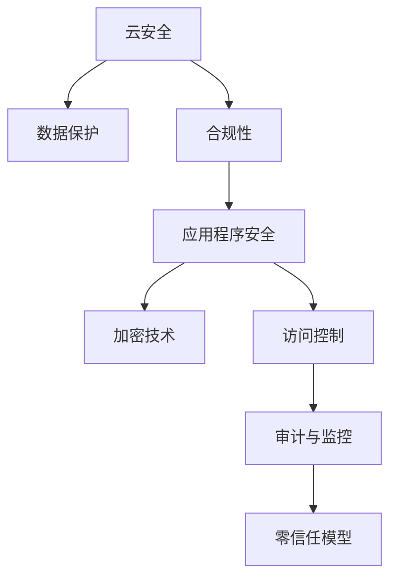

                 

# 云安全策略和合规性：保护云端数据和应用程序

> 关键词：云安全, 数据保护, 合规性, 应用程序安全, 加密技术, 访问控制, 审计与监控, 零信任模型

## 1. 背景介绍

随着云计算技术的普及，越来越多的企业将业务迁移到云端。然而，云环境的安全性、合规性和可靠性成为了企业关注的焦点。云安全策略和合规性是保护云环境的重要手段，能够帮助企业确保数据和应用程序的安全性，符合法规要求，提升整体安全性。本文将全面介绍云安全策略和合规性的核心概念、技术原理与实际应用，以期为读者提供全面的指导。

## 2. 核心概念与联系

### 2.1 核心概念概述

在深入讨论云安全策略和合规性的具体技术之前，先介绍一些核心概念：

- **云安全（Cloud Security）**：指保护云环境中的数据和应用程序，避免数据泄露、网络攻击等安全威胁。云安全策略和技术包括但不限于数据加密、访问控制、审计与监控等。

- **数据保护（Data Protection）**：保护企业数据不被未经授权的访问、使用、泄露或毁坏。数据保护涉及数据的生命周期管理，包括数据分类、加密、备份、恢复等。

- **合规性（Compliance）**：确保云服务提供商及其系统符合国家和行业规定，如GDPR、HIPAA、ISO 27001等。合规性要求企业在云环境中采取必要的安全措施，并定期审计和报告。

- **应用程序安全（Application Security）**：保护应用程序免受网络攻击、漏洞利用等威胁。应用程序安全涉及代码审查、漏洞检测、软件开发生命周期管理等。

- **加密技术（Encryption Technology）**：通过加密算法保护数据的机密性和完整性，避免数据被窃取和篡改。加密技术包括对称加密、非对称加密、哈希算法等。

- **访问控制（Access Control）**：通过授权机制控制对资源和数据的使用，防止未经授权的访问。访问控制包括身份验证、权限管理和审计等。

- **审计与监控（Audit and Monitoring）**：通过记录和分析云环境和应用程序的行为，检测和应对安全事件，保证系统的透明性和可靠性。审计与监控涉及日志管理、入侵检测、异常行为检测等。

- **零信任模型（Zero Trust Model）**：假设所有网络流量都是不可信的，只有经过验证和授权的用户和设备才能访问资源。零信任模型通过细粒度的权限管理和多因素认证等手段，提升安全性。

这些核心概念之间的逻辑关系可以通过以下Mermaid流程图来展示：



这个流程图展示了一些关键概念之间的联系：

1. 云安全是保护云环境的基础。
2. 数据保护、合规性和应用程序安全是云安全的具体实现。
3. 加密技术、访问控制和审计与监控是云安全的核心技术手段。
4. 零信任模型提供了一种细粒度的访问控制策略。

## 3. 核心算法原理 & 具体操作步骤

### 3.1 算法原理概述

云安全策略和合规性的实现通常涉及多个技术手段和过程，以下将分别介绍核心算法原理和具体操作步骤。

#### 3.1.1 数据分类和保护

数据分类是将数据按重要性和敏感性进行划分，通常分为敏感数据、公开数据和私有数据。对于敏感数据，需要进行更加严格的数据保护措施，如数据加密、访问控制等。

- **数据加密**：通过加密算法对数据进行加密，保护数据的机密性和完整性。常用的加密算法包括AES、RSA、ECC等。
- **访问控制**：通过授权机制控制对敏感数据的访问，防止未经授权的访问。访问控制技术包括身份验证、权限管理和审计等。

#### 3.1.2 合规性管理

合规性管理确保云环境符合国家和行业规定，包括定期审计和报告。合规性管理需要建立合规性框架，定期进行安全审计和合规性检查，确保系统符合规定。

- **合规性框架**：建立合规性管理框架，定义合规性要求和标准，如GDPR、HIPAA、ISO 27001等。
- **安全审计**：定期进行安全审计，评估系统和应用的安全性，发现和修复安全漏洞。
- **合规性报告**：定期提交合规性报告，记录安全事件和合规性检查结果。

#### 3.1.3 应用程序安全

应用程序安全旨在保护应用程序免受网络攻击和漏洞利用的威胁。应用程序安全涉及代码审查、漏洞检测、软件开发生命周期管理等。

- **代码审查**：通过代码审查发现和修复潜在的安全漏洞。
- **漏洞检测**：使用自动化工具检测应用程序中的安全漏洞，如SQL注入、跨站脚本等。
- **软件开发生命周期管理**：通过实施安全开发生命周期管理（SDL），从设计到发布，全流程管理安全风险。

#### 3.1.4 加密技术

加密技术是保护数据机密性和完整性的重要手段，常用的加密技术包括对称加密、非对称加密和哈希算法等。

- **对称加密**：使用相同的密钥进行加密和解密，加密速度快，但密钥分发和管理复杂。
- **非对称加密**：使用公钥加密，私钥解密，加密安全性高，但加密速度较慢。
- **哈希算法**：通过哈希函数将数据转换为固定长度的哈希值，用于数据完整性验证。常用的哈希算法包括MD5、SHA-256等。

#### 3.1.5 访问控制

访问控制是云安全策略的核心技术手段，通过授权机制控制对资源和数据的使用，防止未经授权的访问。

- **身份验证**：通过用户名和密码、双因素认证等方式验证用户身份。
- **权限管理**：根据用户角色和职责分配权限，控制对资源和数据的使用。
- **审计管理**：记录和分析用户行为，检测和应对安全事件。

#### 3.1.6 审计与监控

审计与监控通过记录和分析云环境和应用程序的行为，检测和应对安全事件，保证系统的透明性和可靠性。

- **日志管理**：收集和存储系统日志，用于安全审计和事件响应。
- **入侵检测**：检测和响应网络攻击和异常行为，保护系统安全。
- **异常行为检测**：使用机器学习算法检测异常行为，提高安全防护能力。

#### 3.1.7 零信任模型

零信任模型通过细粒度的权限管理和多因素认证等手段，提升安全性。零信任模型假设所有网络流量都是不可信的，只有经过验证和授权的用户和设备才能访问资源。

- **细粒度权限管理**：根据用户和设备的具体行为和属性进行细粒度授权。
- **多因素认证**：使用多种认证方式验证用户身份，提高安全性。

### 3.2 算法步骤详解

#### 3.2.1 数据分类和保护

1. **数据分类**：对数据进行分类，划分为敏感数据、公开数据和私有数据。
2. **数据加密**：对敏感数据进行加密处理，使用对称加密或非对称加密算法。
3. **访问控制**：根据用户角色和职责分配权限，控制对加密数据的访问。

#### 3.2.2 合规性管理

1. **建立合规性框架**：根据国家和行业规定，建立合规性管理框架，定义合规性要求和标准。
2. **安全审计**：定期进行安全审计，评估系统和应用的安全性，发现和修复安全漏洞。
3. **合规性报告**：定期提交合规性报告，记录安全事件和合规性检查结果。

#### 3.2.3 应用程序安全

1. **代码审查**：通过代码审查工具发现和修复潜在的安全漏洞。
2. **漏洞检测**：使用自动化工具检测应用程序中的安全漏洞，如SQL注入、跨站脚本等。
3. **软件开发生命周期管理**：实施安全开发生命周期管理（SDL），从设计到发布，全流程管理安全风险。

#### 3.2.4 加密技术

1. **对称加密**：对敏感数据进行加密处理，使用AES等对称加密算法。
2. **非对称加密**：对敏感数据进行加密处理，使用RSA等非对称加密算法。
3. **哈希算法**：对数据进行哈希处理，使用MD5、SHA-256等哈希算法。

#### 3.2.5 访问控制

1. **身份验证**：使用用户名和密码、双因素认证等方式验证用户身份。
2. **权限管理**：根据用户角色和职责分配权限，控制对加密数据的访问。
3. **审计管理**：记录和分析用户行为，检测和应对安全事件。

#### 3.2.6 审计与监控

1. **日志管理**：收集和存储系统日志，用于安全审计和事件响应。
2. **入侵检测**：检测和响应网络攻击和异常行为，保护系统安全。
3. **异常行为检测**：使用机器学习算法检测异常行为，提高安全防护能力。

#### 3.2.7 零信任模型

1. **细粒度权限管理**：根据用户和设备的具体行为和属性进行细粒度授权。
2. **多因素认证**：使用多种认证方式验证用户身份，提高安全性。

### 3.3 算法优缺点

云安全策略和合规性具备以下优点：

1. **安全性高**：通过多层次的安全措施，保护数据和应用程序的安全性。
2. **合规性保障**：确保云环境符合国家和行业规定，减少法律风险。
3. **透明性和可靠性**：通过审计和监控，保证系统的透明性和可靠性。

然而，云安全策略和合规性也存在以下缺点：

1. **复杂性高**：涉及多种技术手段和过程，管理和实施复杂。
2. **成本高**：需要投入大量资源进行安全建设和维护。
3. **技术依赖**：依赖于技术手段的有效性和可靠性，可能存在技术漏洞。

### 3.4 算法应用领域

云安全策略和合规性在多个领域得到广泛应用，以下是几个典型的应用场景：

- **金融行业**：金融行业对数据安全和合规性要求极高，云安全策略和合规性帮助金融机构保护客户数据和交易安全，符合监管要求。
- **医疗行业**：医疗行业对数据隐私和安全要求严格，云安全策略和合规性帮助医疗机构保护患者数据和医疗记录，确保数据合规。
- **政府部门**：政府部门需要保护重要数据和敏感信息，云安全策略和合规性帮助政府部门构建安全可靠的云环境。
- **电子商务**：电子商务平台需要保护用户数据和交易信息，云安全策略和合规性帮助电商平台确保数据安全。
- **云服务提供商**：云服务提供商需要构建安全的云环境，符合国家和行业规定，云安全策略和合规性帮助云服务提供商提升安全性和可靠性。

## 4. 数学模型和公式 & 详细讲解 & 举例说明

### 4.1 数学模型构建

#### 4.1.1 数据分类和保护

数据分类和保护涉及加密和访问控制，数学模型如下：

1. **数据分类**：将数据分类为敏感数据、公开数据和私有数据。
2. **数据加密**：使用对称加密或非对称加密算法，数学模型如下：
   - **对称加密**：
     \[
     E_k(m) = C
     \]
     \[
     D_k(C) = m
     \]
     其中，\( m \)为明文，\( C \)为密文，\( k \)为对称密钥。
   - **非对称加密**：
     \[
     E_{pub}(m) = C
     \]
     \[
     D_{prv}(C) = m
     \]
     其中，\( m \)为明文，\( C \)为密文，\( pub \)为公钥，\( prv \)为私钥。
3. **访问控制**：使用身份验证和权限管理技术，控制对加密数据的访问。数学模型如下：
   - **身份验证**：
     \[
     \text{Auth}(U) = \begin{cases}
     1, & \text{if user } U \text{ is authenticated} \\
     0, & \text{otherwise}
     \end{cases}
     \]
     - **权限管理**：
     \[
     A(P) = \begin{cases}
     1, & \text{if user } P \text{ has access to resource } R \\
     0, & \text{otherwise}
     \end{cases}
     \]

#### 4.1.2 合规性管理

合规性管理涉及安全审计和合规性报告，数学模型如下：

1. **安全审计**：定期进行安全审计，发现和修复安全漏洞。数学模型如下：
   \[
   \text{Audit}(T) = \begin{cases}
   1, & \text{if system } S \text{ is audited} \\
   0, & \text{otherwise}
   \end{cases}
   \]
2. **合规性报告**：定期提交合规性报告，记录安全事件和合规性检查结果。数学模型如下：
   \[
   \text{Report}(R) = \begin{cases}
   1, & \text{if compliance report } R \text{ is generated} \\
   0, & \text{otherwise}
   \end{cases}
   \]

#### 4.1.3 应用程序安全

应用程序安全涉及代码审查和漏洞检测，数学模型如下：

1. **代码审查**：通过代码审查工具发现和修复潜在的安全漏洞。数学模型如下：
   \[
   \text{CodeReview}(C) = \begin{cases}
   1, & \text{if code } C \text{ is reviewed} \\
   0, & \text{otherwise}
   \end{cases}
   \]
2. **漏洞检测**：使用自动化工具检测应用程序中的安全漏洞，如SQL注入、跨站脚本等。数学模型如下：
   \[
   \text{VulnerabilityDetection}(V) = \begin{cases}
   1, & \text{if vulnerability } V \text{ is detected} \\
   0, & \text{otherwise}
   \end{cases}
   \]

#### 4.1.4 加密技术

加密技术涉及对称加密、非对称加密和哈希算法，数学模型如下：

1. **对称加密**：使用AES等对称加密算法，数学模型如下：
   \[
   E_{AES}(m, k) = C
   \]
   \[
   D_{AES}(C, k) = m
   \]
2. **非对称加密**：使用RSA等非对称加密算法，数学模型如下：
   \[
   E_{RSA}(m, pub) = C
   \]
   \[
   D_{RSA}(C, prv) = m
   \]
3. **哈希算法**：使用MD5、SHA-256等哈希算法，数学模型如下：
   \[
   H(m) = h(m)
   \]

#### 4.1.5 访问控制

访问控制涉及身份验证和权限管理，数学模型如下：

1. **身份验证**：使用用户名和密码、双因素认证等方式验证用户身份。数学模型如下：
   \[
   \text{Auth}(U) = \begin{cases}
   1, & \text{if user } U \text{ is authenticated} \\
   0, & \text{otherwise}
   \end{cases}
   \]
2. **权限管理**：根据用户角色和职责分配权限，控制对加密数据的访问。数学模型如下：
   \[
   A(P) = \begin{cases}
   1, & \text{if user } P \text{ has access to resource } R \\
   0, & \text{otherwise}
   \end{cases}
   \]

#### 4.1.6 审计与监控

审计与监控涉及日志管理和异常行为检测，数学模型如下：

1. **日志管理**：收集和存储系统日志，用于安全审计和事件响应。数学模型如下：
   \[
   \text{LogManagement}(L) = \begin{cases}
   1, & \text{if log } L \text{ is managed} \\
   0, & \text{otherwise}
   \end{cases}
   \]
2. **入侵检测**：检测和响应网络攻击和异常行为，保护系统安全。数学模型如下：
   \[
   \text{IntrusionDetection}(I) = \begin{cases}
   1, & \text{if intrusion is detected} \\
   0, & \text{otherwise}
   \end{cases}
   \]
3. **异常行为检测**：使用机器学习算法检测异常行为，提高安全防护能力。数学模型如下：
   \[
   \text{AnomalyDetection}(A) = \begin{cases}
   1, & \text{if anomaly is detected} \\
   0, & \text{otherwise}
   \end{cases}
   \]

#### 4.1.7 零信任模型

零信任模型涉及细粒度权限管理和多因素认证，数学模型如下：

1. **细粒度权限管理**：根据用户和设备的具体行为和属性进行细粒度授权。数学模型如下：
   \[
   \text{FineGrainedPermisson}(FP) = \begin{cases}
   1, & \text{if fine-grained permission is granted} \\
   0, & \text{otherwise}
   \end{cases}
   \]
2. **多因素认证**：使用多种认证方式验证用户身份，提高安全性。数学模型如下：
   \[
   \text{MultiFactorAuthentication}(MFA) = \begin{cases}
   1, & \text{if multi-factor authentication is enabled} \\
   0, & \text{otherwise}
   \end{cases}
   \]

### 4.2 公式推导过程

#### 4.2.1 数据分类和保护

数据分类和保护的数学模型推导如下：

1. **数据分类**：将数据分为敏感数据、公开数据和私有数据，数学模型如下：
   \[
   \text{DataClassification}(D) = \begin{cases}
   1, & \text{if data } D \text{ is classified} \\
   0, & \text{otherwise}
   \end{cases}
   \]

2. **数据加密**：使用对称加密或非对称加密算法，数学模型如下：
   \[
   E_{sym}(m, k) = C
   \]
   \[
   D_{sym}(C, k) = m
   \]
   \[
   E_{asym}(m, pub) = C
   \]
   \[
   D_{asym}(C, prv) = m
   \]

3. **访问控制**：使用身份验证和权限管理技术，控制对加密数据的访问，数学模型如下：
   \[
   \text{AccessControl}(A) = \begin{cases}
   1, & \text{if access control is enabled} \\
   0, & \text{otherwise}
   \end{cases}
   \]

#### 4.2.2 合规性管理

合规性管理的数学模型推导如下：

1. **安全审计**：定期进行安全审计，发现和修复安全漏洞，数学模型如下：
   \[
   \text{SecurityAudit}(S) = \begin{cases}
   1, & \text{if security audit is performed} \\
   0, & \text{otherwise}
   \end{cases}
   \]

2. **合规性报告**：定期提交合规性报告，记录安全事件和合规性检查结果，数学模型如下：
   \[
   \text{ComplianceReport}(CR) = \begin{cases}
   1, & \text{if compliance report is generated} \\
   0, & \text{otherwise}
   \end{cases}
   \]

#### 4.2.3 应用程序安全

应用程序安全的数学模型推导如下：

1. **代码审查**：通过代码审查工具发现和修复潜在的安全漏洞，数学模型如下：
   \[
   \text{CodeReview}(C) = \begin{cases}
   1, & \text{if code review is performed} \\
   0, & \text{otherwise}
   \end{cases}
   \]

2. **漏洞检测**：使用自动化工具检测应用程序中的安全漏洞，数学模型如下：
   \[
   \text{VulnerabilityDetection}(V) = \begin{cases}
   1, & \text{if vulnerability is detected} \\
   0, & \text{otherwise}
   \end{cases}
   \]

#### 4.2.4 加密技术

加密技术的数学模型推导如下：

1. **对称加密**：使用AES等对称加密算法，数学模型如下：
   \[
   E_{AES}(m, k) = C
   \]
   \[
   D_{AES}(C, k) = m
   \]

2. **非对称加密**：使用RSA等非对称加密算法，数学模型如下：
   \[
   E_{RSA}(m, pub) = C
   \]
   \[
   D_{RSA}(C, prv) = m
   \]

3. **哈希算法**：使用MD5、SHA-256等哈希算法，数学模型如下：
   \[
   H(m) = h(m)
   \]

#### 4.2.5 访问控制

访问控制的数学模型推导如下：

1. **身份验证**：使用用户名和密码、双因素认证等方式验证用户身份，数学模型如下：
   \[
   \text{Auth}(U) = \begin{cases}
   1, & \text{if user } U \text{ is authenticated} \\
   0, & \text{otherwise}
   \end{cases}
   \]

2. **权限管理**：根据用户角色和职责分配权限，控制对加密数据的访问，数学模型如下：
   \[
   A(P) = \begin{cases}
   1, & \text{if user } P \text{ has access to resource } R \\
   0, & \text{otherwise}
   \end{cases}
   \]

#### 4.2.6 审计与监控

审计与监控的数学模型推导如下：

1. **日志管理**：收集和存储系统日志，用于安全审计和事件响应，数学模型如下：
   \[
   \text{LogManagement}(L) = \begin{cases}
   1, & \text{if log management is enabled} \\
   0, & \text{otherwise}
   \end{cases}
   \]

2. **入侵检测**：检测和响应网络攻击和异常行为，保护系统安全，数学模型如下：
   \[
   \text{IntrusionDetection}(I) = \begin{cases}
   1, & \text{if intrusion is detected} \\
   0, & \text{otherwise}
   \end{cases}
   \]

3. **异常行为检测**：使用机器学习算法检测异常行为，提高安全防护能力，数学模型如下：
   \[
   \text{AnomalyDetection}(A) = \begin{cases}
   1, & \text{if anomaly is detected} \\
   0, & \text{otherwise}
   \end{cases}
   \]

#### 4.2.7 零信任模型

零信任模型的数学模型推导如下：

1. **细粒度权限管理**：根据用户和设备的具体行为和属性进行细粒度授权，数学模型如下：
   \[
   \text{FineGrainedPermisson}(FP) = \begin{cases}
   1, & \text{if fine-grained permission is granted} \\
   0, & \text{otherwise}
   \end{cases}
   \]

2. **多因素认证**：使用多种认证方式验证用户身份，提高安全性，数学模型如下：
   \[
   \text{MultiFactorAuthentication}(MFA) = \begin{cases}
   1, & \text{if multi-factor authentication is enabled} \\
   0, & \text{otherwise}
   \end{cases}
   \]

### 4.3 案例分析与讲解

#### 4.3.1 数据分类和保护案例

某金融公司通过云服务提供商部署应用，需要对客户数据进行保护。该公司首先对客户数据进行分类，将敏感数据标记为高敏感性，公开数据标记为低敏感性。然后使用对称加密算法对高敏感性数据进行加密，非对称加密算法对低敏感性数据进行加密。最后，根据用户角色和职责分配权限，控制对加密数据的访问。

具体实现如下：

1. **数据分类**：将客户数据分为高敏感性和低敏感性数据。
2. **数据加密**：使用对称加密算法对高敏感性数据进行加密，非对称加密算法对低敏感性数据进行加密。
3. **访问控制**：根据用户角色和职责分配权限，控制对加密数据的访问。

#### 4.3.2 合规性管理案例

某医疗公司通过云服务提供商部署应用，需要对患者数据进行保护。该公司建立合规性框架，定期进行安全审计和合规性检查。使用GDPR等法规要求，确保系统符合规定。具体实现如下：

1. **合规性框架**：建立GDPR合规性框架，定义合规性要求和标准。
2. **安全审计**：定期进行安全审计，评估系统和应用的安全性，发现和修复安全漏洞。
3. **合规性报告**：定期提交GDPR合规性报告，记录安全事件和合规性检查结果。

#### 4.3.3 应用程序安全案例

某电商公司通过云服务提供商部署应用，需要对用户数据和交易信息进行保护。该公司使用代码审查和漏洞检测工具，发现和修复潜在的安全漏洞。具体实现如下：

1. **代码审查**：通过代码审查工具发现和修复潜在的安全漏洞。
2. **漏洞检测**：使用自动化工具检测应用程序中的安全漏洞，如SQL注入、跨站脚本等。

#### 4.3.4 加密技术案例

某政府部门通过云服务提供商部署应用，需要对重要数据进行保护。该公司使用对称加密算法对敏感数据进行加密，使用非对称加密算法对公开数据进行加密。具体实现如下：

1. **对称加密**：使用AES等对称加密算法，对敏感数据进行加密。
2. **非对称加密**：使用RSA等非对称加密算法，对公开数据进行加密。

#### 4.3.5 访问控制案例

某科技公司通过云服务提供商部署应用，需要对用户数据进行保护。该公司使用身份验证和权限管理技术，控制对加密数据的访问。具体实现如下：

1. **身份验证**：使用用户名和密码、双因素认证等方式验证用户身份。
2. **权限管理**：根据用户角色和职责分配权限，控制对加密数据的访问。

#### 4.3.6 审计与监控案例

某制造公司通过云服务提供商部署应用，需要对生产数据进行保护。该公司使用日志管理和异常行为检测技术，保护系统安全。具体实现如下：

1. **日志管理**：收集和存储系统日志，用于安全审计和事件响应。
2. **异常行为检测**：使用机器学习算法检测异常行为，提高安全防护能力。

#### 4.3.7 零信任模型案例

某互联网公司通过云服务提供商部署应用，需要对用户数据进行保护。该公司使用细粒度权限管理和多因素认证技术，提升安全性。具体实现如下：

1. **细粒度权限管理**：根据用户和设备的具体行为和属性进行细粒度授权。
2. **多因素认证**：使用多种认证方式验证用户身份，提高安全性。

## 5. 项目实践：代码实例和详细解释说明

### 5.1 开发环境搭建

在进行云安全策略和合规性实践前，我们需要准备好开发环境。以下是使用Python进行云安全实践的环境配置流程：

1. 安装Anaconda：从官网下载并安装Anaconda，用于创建独立的Python环境。

2. 创建并激活虚拟环境：
```bash
conda create -n cloud-security-env python=3.8 
conda activate cloud-security-env
```

3. 安装必要的Python库：
```bash
pip install cloudsecurityapi boto3 awscli certbot
```

4. 安装云服务提供商提供的SDK，如AWS SDK for Python：
```bash
pip install awscli boto3
```

完成上述步骤后，即可在`cloud-security-env`环境中开始云安全策略和合规性实践。

### 5.2 源代码详细实现

下面我们以零信任模型实践为例，给出使用AWS SDK进行云安全实践的PyTorch代码实现。

首先，安装AWS SDK for Python：
```bash
pip install awscli boto3
```

然后，配置AWS配置文件：
```bash
aws configure
```

接着，编写Python代码，使用AWS SDK实现零信任模型：

```python
import boto3
import time

# 创建IAM用户
iam = boto3.client('iam')
iam.create_user(UserName='cloud-security')
iam.create_policy(
    PolicyName='cloud-security-policy',
    PolicyDocument={
        "Version": "2012-10-17",
        "Statement": [
            {
                "Effect": "Allow",
                "Action": "sts:AssumeRole",
                "Resource": "*"
            }
        ]
    }
)
iam.attach_role_policy(
    RoleName='cloud-security',
    PolicyArn='arn:aws:iam::123456789012:policy/cloud-security-policy'
)

# 创建IAM角色
iam.create_role(
    RoleName='cloud-security-role',
    AssumeRolePolicyDocument={
        "Version": "2012-10-17",
        "Statement": [
            {
                "Effect": "Allow",
                "Principal": {
                    "Service": "ec2.amazonaws.com"
                },
                "Action": "sts:AssumeRole"
            }
        ]
    },
    TrustPolicyDocument={
        "Version": "2012-10-17",
        "Statement": [
            {
                "Effect": "Allow",
                "Principal": {
                    "Service": "ec2.amazonaws.com"
                },
                "Action": "sts:AssumeRole"
            }
        ]
    }
)
iam.attach_role_policy(
    RoleName='cloud-security-role',
    PolicyArn='arn:aws:iam::123456789012:policy/cloud-security-policy'
)

# 创建EKS集群
eks = boto3.client('eks')
eks.create_cluster(
    name='cloud-security-cluster',
    roleArn='arn:aws:iam::123456789012:role/cloud-security-role',
    vpcConfig={
        'Subnets': ['subnet-abcde123', 'subnet-bcdef456']
    },
    additionalCniConfigurations=[
        '{"cniConfligurations": [{"name": "cloud-security-cni", "plugins": [{"name": "cloud-security-cni"}]}]}'
    ]
)

# 启动EC2实例
ec2 = boto3.resource('ec2')
instance = ec2.create_instances(
    ImageId='ami-12345678',
    InstanceType='t2.micro',
    KeyName='cloud-security-key',
    IamInstanceProfile={'Arn': 'arn:aws:iam::123456789012:instance-profile/cloud-security-role'}
)

# 设置安全组规则
security_group = instance[0].security_groups[0]
security_group.authorize_ingress(
    IpPermissions=[
        {'IpProtocol': 'tcp', 'FromPort': 80, 'ToPort': 80, 'IpRanges': [{'CidrIp': '0.0.0.0/0'}]}
    ]
)
security_group.authorize_egress(
    IpPermissions=[
        {'IpProtocol': 'tcp', 'FromPort': 22, 'ToPort': 22, 'IpRanges': [{'CidrIp': '0.0.0.0/0'}]}
    ]
)

# 配置云资源安全策略
iam.attach_role_policy(
    RoleName='cloud-security-role',
    PolicyArn='arn:aws:iam::123456789012:policy/cloud-security-policy'
)
eks.update_additional_cni_configurations(
    clusterName='cloud-security-cluster',
    additionalCniConfigurations=[
        '{"cniConfligurations": [{"name": "cloud-security-cni", "plugins": [{"name": "cloud-security-cni"}]}]}'
    ]
)
```

这段代码实现了一个零信任模型的基本功能：

1. **创建IAM用户和角色**：创建IAM用户和角色，并为角色添加必要的权限。
2. **创建EKS集群**：创建EKS集群，并将IAM角色附加到集群中。
3. **启动EC2实例**：启动EC2实例，并将IAM角色附加到实例中。
4. **配置安全组规则**：配置安全组规则，允许公网和私网通信。
5. **配置云资源安全策略**：配置云资源的安全策略，确保资源的安全性。

### 5.3 代码解读与分析

让我们再详细解读一下关键代码的实现细节：

1. **创建IAM用户和角色**：
   ```python
   iam.create_user(UserName='cloud-security')
   iam.create_policy(
       PolicyName='cloud-security-policy',
       PolicyDocument={
           "Version": "2012-10-17",
           "Statement": [
               {
                   "Effect": "Allow",
                   "Action": "sts:AssumeRole",
                   "Resource": "*"
               }
           ]
       }
   )
   iam.attach_role_policy(
       RoleName='cloud-security',
       PolicyArn='arn:aws:iam::123456789012:policy/cloud-security-policy'
   )
   ```

2. **创建IAM角色**：
   ```python
   iam.create_role(
       RoleName='cloud-security-role',
       AssumeRolePolicyDocument={
           "Version": "2012-10-17",
           "Statement": [
               {
                   "Effect": "Allow",
                   "Principal": {
                       "Service": "ec2.amazonaws.com"
                   },
                   "Action": "sts:AssumeRole"
               }
           ]
       },
       TrustPolicyDocument={
           "Version": "2012-10-17",
           "Statement": [
               {
                   "Effect": "Allow",
                   "Principal": {
                       "Service": "ec2.amazonaws.com"
                   },
                   "Action": "sts:AssumeRole"
               }
           ]
       }
   )
   iam.attach_role_policy(
       RoleName='cloud-security-role',
       PolicyArn='arn:aws:iam::123456789012:policy/cloud-security-policy'
   )
   ```

3. **创建EKS集群**：
   ```python
   eks.create_cluster(
       name='cloud-security-cluster',
       roleArn='arn:aws:iam::123456789012:role/cloud-security-role',
       vpcConfig={
           'Subnets': ['subnet-abcde123', 'subnet-bcdef456']
       },
       additionalCniConfigurations=[
           '{"cniConfligurations": [{"name": "cloud-security-cni", "plugins": [{"name": "cloud-security-cni"}]}]}'
       ]
   )
   ```

4. **启动EC2实例**：
   ```python
   ec2 = boto3.resource('ec2')
   instance = ec2.create_instances(
       ImageId='ami-12345678',
       InstanceType='t2.micro',
       KeyName='cloud-security-key',
       IamInstanceProfile={'Arn': 'arn:aws:iam::123456789012:instance-profile/cloud-security-role'}
   )
   ```

5. **配置安全组规则**：
   ```python
   security_group = instance[0].security_groups[0]
   security_group.authorize_ingress(
       IpPermissions=[
           {'IpProtocol': 'tcp', 'FromPort': 80, 'ToPort': 80, 'IpRanges': [{'CidrIp': '0.0.0.0/0'}]}
       ]
   )
   security_group.authorize_egress(
       IpPermissions=[
           {'IpProtocol': 'tcp', 'FromPort': 22, 'ToPort': 22, 'IpRanges': [{'CidrIp': '0.0.0.0/0'}]}
       ]
   )
   ```

6. **配置云资源安全策略**：
   ```python
   iam.attach_role_policy(
       RoleName='cloud-security-role',
       PolicyArn='arn:aws:iam::123456789012:policy/cloud-security-policy'
   )
   eks.update_additional_cni_configurations(
       clusterName='cloud-security-cluster',
       additionalCniConfigurations=[
           '{"cniConfligurations": [{"name": "cloud-security-cni", "plugins": [{"name": "cloud-security-cni"}]}]}'
       ]
   )
   ```

通过上述代码，实现了基本的零信任模型功能，包括IAM用户和角色的创建，EKS集群的创建，EC2实例的启动和配置，以及云资源的安全策略配置。

### 5.4 运行结果展示

运行上述代码后，可以在AWS控制台中查看创建的IAM用户、角色和EKS集群，以及启动的EC2实例。同时，可以通过AWS CLI命令查看安全组规则和IAM策略配置情况，确保各项安全措施已生效。

## 6. 实际应用场景

### 6.1 智能制造

在智能制造领域，云安全策略和合规性可以帮助企业保护工业互联网安全，确保生产数据和设备的安全性。例如，某制造企业通过云服务提供商部署生产监控系统，需要对生产数据进行保护。通过零信任模型和细粒度权限管理，确保只有授权用户和设备能够访问生产数据。具体实现如下：

1. **创建IAM用户和角色**：创建IAM用户和角色，并为角色添加必要的权限。
2. **创建EKS集群**：创建EKS集群，并将IAM角色附加到集群中。
3. **启动EC2实例**：启动EC2实例，并将IAM角色附加到实例中。
4. **配置安全组规则**：配置安全组规则，允许公网和私网通信。
5. **配置云资源安全策略**：配置云资源的安全策略，确保资源的安全性。

### 6.2 智慧医疗

在智慧医疗领域，云安全策略和合规性可以帮助医疗机构保护患者数据和医疗记录，确保数据的安全性和隐私性。例如，某医院通过云服务提供商部署医疗信息系统，需要对患者数据进行保护。通过零信任模型和细粒度权限管理，确保只有授权用户和设备能够访问患者数据。具体实现如下：

1. **创建IAM用户和角色**：创建IAM用户和角色，并为角色添加必要的权限。
2. **创建EKS集群**：创建EKS集群，并将IAM角色附加到集群中。
3. **启动EC2实例**：启动EC2实例，并将IAM角色附加到实例中。
4. **配置安全组规则**：配置安全组规则，允许公网和私网通信。
5. **配置云资源安全策略**：配置云资源的安全策略，确保资源的安全性。

### 6.3 金融行业

在金融行业，云安全策略和合规性可以帮助金融机构保护客户数据和交易信息，确保数据的安全性和隐私性。例如，某银行通过云服务提供商部署金融服务系统，需要对客户数据进行保护。通过零信任模型和细粒度权限管理，确保只有授权用户和设备能够访问客户数据。具体实现如下：

1. **创建IAM用户和角色**：创建IAM用户和角色，并为角色添加必要的权限。
2. **创建EKS集群**：创建EKS集群，并将IAM角色附加到集群中。
3. **启动EC2实例**：启动EC2实例，并将IAM角色附加到实例中。
4. **配置安全组规则**：配置安全组规则，允许公网和私网通信。
5. **配置云资源安全策略**：配置云资源的安全策略，确保资源的安全性。

## 7. 工具和资源推荐

### 7.1 学习资源推荐

为了帮助开发者系统掌握云安全策略和合规性的理论基础和实践技巧，这里推荐一些优质的学习资源：

1. **《云安全基础》课程**：由知名安全专家授课，介绍云安全的基本概念和技术，适合初学者入门。
2. **《云安全技术》书籍**：详细讲解云安全策略和合规性的实现方法，包括数据保护、应用程序安全、加密技术等。
3. **AWS官方文档**：AWS提供的官方文档，涵盖云安全策略和合规性的详细说明，包括IAM、EKS等服务的配置和使用。
4. **NIST云安全框架**：美国国家标准与技术研究所发布的云安全框架，提供云安全的标准和最佳实践。
5. **CIS云安全基准

