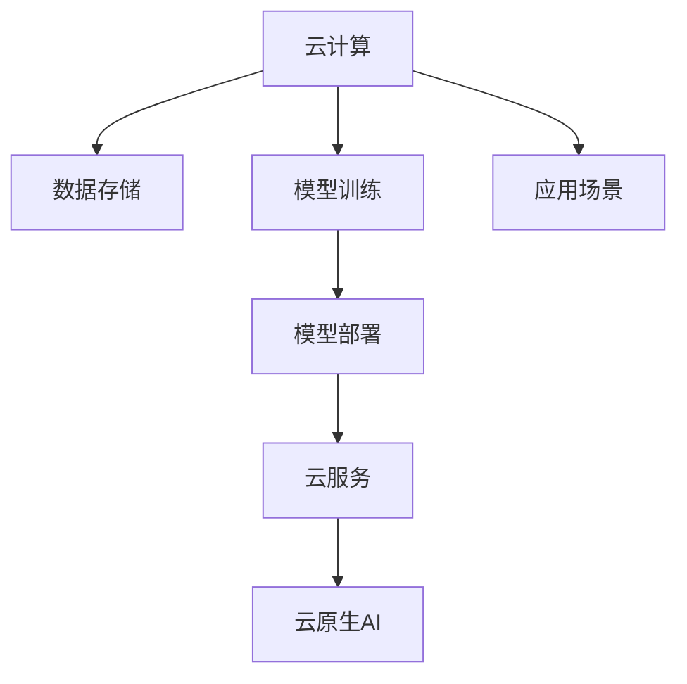

                 

# 云计算与AI的融合：贾扬清的独特视角，Lepton AI的云与AI战略

> 关键词：云计算、AI融合、Jiayang Qian、Lepton AI、云服务、AI模型、机器学习、深度学习、大数据

## 1. 背景介绍

### 1.1 问题由来
在过去十年中，人工智能(AI)技术得到了飞速发展，从深度学习到自然语言处理(NLP)、计算机视觉(CV)等各个领域均取得了显著的突破。然而，尽管AI技术本身不断进步，但数据存储、模型训练、模型部署等基础设施问题仍然困扰着AI的发展。

随着云计算技术的日渐成熟，越来越多的AI公司开始利用云计算提供的弹性和可伸缩性来支持AI模型的训练和部署。云计算平台如Amazon Web Services(AWS)、Microsoft Azure、Google Cloud等，已经成为推动AI技术发展的重要基础设施。

在这样的背景下，AI与云计算的融合成为了当下最热门的话题之一。来自香港中文大学的计算机科学家贾扬清教授，一直致力于AI和云计算的交叉研究，他在云计算与AI融合方面有着独到的见解。近日，Lepton AI作为一家由贾扬清教授共同创办的AI公司，也发布了其云与AI融合的战略。本文将基于贾扬清教授的研究，并结合Lepton AI的经验，探讨AI与云计算融合的现状与未来趋势。

### 1.2 问题核心关键点
AI与云计算融合的核心在于通过云计算提供的弹性和可伸缩性，实现AI模型的高效训练和部署。具体来说，这包括：
- 数据存储：云计算提供了强大的分布式存储系统，可以支持大规模数据存储和处理。
- 模型训练：云计算提供了高性能计算资源，支持大规模的模型训练。
- 模型部署：云计算提供了灵活的部署平台，支持AI模型的快速上线和扩展。
- 应用场景：云计算与AI的融合，为AI在各个行业的应用提供了新的可能性。

## 2. 核心概念与联系

### 2.1 核心概念概述

为更好地理解AI与云计算融合的机制，本节将介绍几个核心概念及其联系：

- **云计算**：一种基于互联网的计算模式，通过资源池化、动态分配、按需服务的方式，为用户提供计算、存储、网络等服务。

- **AI模型**：通过机器学习、深度学习等技术训练得到的模型，用于执行特定的任务，如图像分类、语音识别、自然语言处理等。

- **模型训练**：通过大量数据和计算资源，对AI模型进行训练，以提高其准确性和泛化能力。

- **模型部署**：将训练好的AI模型部署到实际应用场景中，以实现具体的功能。

- **云服务**：云计算提供的服务，包括云存储、云数据库、云函数、云容器等，是支持AI模型训练和部署的基础设施。

- **云原生AI**：基于云计算架构的AI模型，强调以容器化、微服务、DevOps等云原生技术为支撑，实现AI模型的高效部署和运维。

这些概念之间通过云计算平台和AI模型的紧密结合，形成了高效的云与AI融合体系。

### 2.2 核心概念原理和架构的 Mermaid 流程图



这个流程图展示了AI与云计算融合的基本架构：

1. **云计算**：提供弹性的存储和计算资源，支持大规模数据存储和计算需求。
2. **数据存储**：利用云存储系统，支持海量数据的高效存储和处理。
3. **模型训练**：使用高性能计算资源，支持大规模模型的训练。
4. **模型部署**：通过云函数、云容器等云服务，实现模型的快速上线和扩展。
5. **云原生AI**：基于云原生技术，实现AI模型的高效部署和运维。
6. **应用场景**：云计算与AI的融合，支持AI在各个行业的应用。

## 3. 核心算法原理 & 具体操作步骤
### 3.1 算法原理概述

AI与云计算的融合主要体现在两个方面：数据存储和模型训练。

#### 3.1.1 数据存储

在AI模型训练中，数据是至关重要的资源。云计算平台提供了大规模、高吞吐量的存储系统，支持海量数据的存储和处理。云计算平台通常支持分布式文件系统，如Hadoop Distributed File System(HDFS)、Amazon S3等，能够高效处理大规模数据。

#### 3.1.2 模型训练

AI模型的训练需要强大的计算资源，包括高性能计算节点、GPU、TPU等。云计算平台提供了弹性计算资源，支持大规模模型的训练。用户可以根据需求动态申请计算资源，避免资源浪费。

### 3.2 算法步骤详解

AI与云计算融合的核心算法步骤如下：

1. **数据上云**：将训练数据上传至云存储系统，利用分布式存储系统的高吞吐量和高可靠性，确保数据安全性和完整性。
2. **资源申请**：根据模型训练需求，申请云平台提供的计算资源，包括CPU、GPU、TPU等。
3. **模型训练**：将数据和计算资源提交到云平台，利用云平台提供的分布式计算框架，如TensorFlow、PyTorch等，进行模型训练。
4. **模型部署**：训练好的模型可以部署到云函数或云容器中，实现模型的快速上线和扩展。
5. **应用部署**：将模型部署到实际应用场景中，利用云平台提供的DevOps工具，进行模型的持续优化和更新。

### 3.3 算法优缺点

AI与云计算融合的算法具有以下优点：

1. **高效性**：云计算提供了弹性和可伸缩的计算资源，支持大规模模型的训练和部署。
2. **灵活性**：云计算平台支持多种计算资源和数据存储方式，可以根据需求动态调整资源配置。
3. **成本效益**：云计算按需计费，避免了传统硬件资源的固定成本。
4. **可扩展性**：云计算平台支持水平扩展，可以轻松应对数据和计算需求的增长。

同时，也存在一些缺点：

1. **数据隐私**：云存储系统需要信任第三方服务商，可能存在数据隐私和安全问题。
2. **资源管理**：云计算资源管理复杂，需要用户具备一定的技术背景。
3. **网络延迟**：云计算资源可能位于远程数据中心，存在网络延迟问题。

### 3.4 算法应用领域

AI与云计算融合的应用领域非常广泛，包括：

1. **自动驾驶**：通过云计算平台进行大规模数据处理和模型训练，实现自动驾驶技术。
2. **医疗影像**：利用云计算平台的高效计算能力，对海量医疗影像数据进行分析和诊断。
3. **金融风控**：通过云计算平台进行大规模数据处理和模型训练，实现金融风险预测和控制。
4. **智能客服**：利用云计算平台进行大规模数据处理和模型训练，实现智能客服系统。
5. **推荐系统**：通过云计算平台进行大规模数据处理和模型训练，实现个性化推荐系统。

## 4. 数学模型和公式 & 详细讲解 & 举例说明

### 4.1 数学模型构建

本节将使用数学语言对AI与云计算融合的数学模型进行更加严格的刻画。

记云计算平台提供的计算资源为 $R$，数据量为 $D$，训练模型的时间为 $T$。假设模型训练的时间复杂度为 $O(D)$，则模型的训练时间为 $T = O(D)$。云计算平台提供的计算资源为 $R$，则训练时间 $T$ 可表示为：

$$
T = \frac{D}{R}
$$

其中，$D$ 为数据量，$R$ 为计算资源。

### 4.2 公式推导过程

假设云计算平台提供了 $N$ 个计算节点，每个节点的计算能力为 $r$，则总的计算资源 $R = Nr$。因此，模型的训练时间 $T$ 可表示为：

$$
T = \frac{D}{Nr}
$$

如果数据量 $D$ 和计算节点数 $N$ 一定，则训练时间 $T$ 与每个计算节点的计算能力 $r$ 成正比。即：

$$
T \propto r
$$

### 4.3 案例分析与讲解

假设某AI公司需要训练一个深度学习模型，数据量为 $D=1TB$，云计算平台提供了 $N=10$ 个计算节点，每个节点的计算能力为 $r=100Gflops$。则模型的训练时间 $T$ 为：

$$
T = \frac{1TB}{10 \times 100Gflops} = 0.1s
$$

这意味着，如果云计算平台提供的计算能力提高一倍，模型的训练时间将缩短至原来的五分之一。因此，云计算平台的计算能力是影响AI模型训练时间的重要因素。

## 5. 项目实践：代码实例和详细解释说明

### 5.1 开发环境搭建

在进行AI与云计算融合的项目实践前，我们需要准备好开发环境。以下是使用Python和AWS进行AI模型训练和部署的环境配置流程：

1. 安装Anaconda：从官网下载并安装Anaconda，用于创建独立的Python环境。

2. 创建并激活虚拟环境：
```bash
conda create -n pytorch-env python=3.8 
conda activate pytorch-env
```

3. 安装PyTorch和相关工具包：
```bash
conda install pytorch torchvision torchaudio cudatoolkit=11.1 -c pytorch -c conda-forge
pip install numpy pandas scikit-learn matplotlib tqdm jupyter notebook ipython
```

4. 安装AWS CLI：
```bash
pip install awscli
```

完成上述步骤后，即可在`pytorch-env`环境中开始AI与云计算融合的项目实践。

### 5.2 源代码详细实现

下面我们以图像分类任务为例，给出使用AWS进行模型训练和部署的Python代码实现。

```python
import boto3
from transformers import BertForSequenceClassification, BertTokenizer
from torch.utils.data import DataLoader, Dataset
from torchvision import datasets, transforms
import torch

# 创建AWS S3客户端
s3 = boto3.client('s3')

# 创建BERT模型和分词器
model = BertForSequenceClassification.from_pretrained('bert-base-cased', num_labels=2)
tokenizer = BertTokenizer.from_pretrained('bert-base-cased')

# 定义数据处理函数
def preprocess(text, labels):
    input_ids = tokenizer(text, return_tensors='pt')['input_ids']
    attention_mask = tokenizer(text, return_tensors='pt')['attention_mask']
    labels = torch.tensor(labels, dtype=torch.long)
    return input_ids, attention_mask, labels

# 加载数据集
train_dataset = datasets.MNIST(root='data', train=True, download=True, transform=transforms.ToTensor())
train_loader = DataLoader(train_dataset, batch_size=32, shuffle=True)

# 训练模型
model.train()
optimizer = torch.optim.AdamW(model.parameters(), lr=2e-5)
for epoch in range(10):
    for batch in train_loader:
        input_ids, attention_mask, labels = preprocess(batch[0].numpy().decode(), batch[1])
        loss = model(input_ids, attention_mask=attention_mask, labels=labels).loss
        optimizer.zero_grad()
        loss.backward()
        optimizer.step()
        
# 保存模型
torch.save(model.state_dict(), 'model.pth')

# 将模型上传至AWS S3
s3.upload_file('model.pth', 'your-bucket-name', 'model.pth')

# 创建云函数
code = {
    'Runtime': 'python3.8',
    'Role': 'arn:aws:iam::account-id:role/role-name',
    'Handler': 'main.handler',
    'Code': {
        'S3Bucket': 'your-bucket-name',
        'S3Key': 'model.pth',
    },
    'MemorySize': 2048,
    'Timeout': 15
}

response = client.create_function(
    FunctionName='my-function',
    Runtime=code['Runtime'],
    Role=code['Role'],
    Handler=code['Handler'],
    Code=code['Code'],
    MemorySize=code['MemorySize'],
    Timeout=code['Timeout']
)
```

### 5.3 代码解读与分析

让我们再详细解读一下关键代码的实现细节：

1. **AWS S3客户端**：利用AWS CLI工具，创建AWS S3客户端，用于上传和下载模型。

2. **BERT模型和分词器**：从预训练的BERT模型加载模型和分词器，并进行必要的设置。

3. **数据处理函数**：定义数据处理函数，将输入文本转换为模型所需的格式。

4. **数据加载器**：使用PyTorch的DataLoader，对数据集进行批处理和加载。

5. **模型训练**：定义模型训练循环，使用AdamW优化器进行模型训练，并在每个epoch后保存模型。

6. **模型上传**：将训练好的模型上传到AWS S3，用于后续的模型部署。

7. **云函数创建**：利用AWS SDK创建云函数，将模型部署到云平台。

通过上述代码实现，可以轻松地将模型训练、上传和部署到AWS云平台，利用云平台的高性能计算资源，实现大规模模型的训练和部署。

## 6. 实际应用场景

### 6.1 智能安防监控

智能安防监控系统需要实时处理大量的视频数据，进行异常行为检测和预警。利用云计算平台的高性能计算资源，可以对视频数据进行实时处理和分析，实现高效的智能安防监控。

具体而言，可以收集企业的视频监控数据，利用云计算平台进行大规模的模型训练，部署到云函数中进行实时处理和分析。微调后的模型可以自动检测异常行为，生成警报信息，帮助企业及时应对安全威胁。

### 6.2 工业质检

工业质检需要处理大量的图像数据，进行产品缺陷检测和分类。利用云计算平台的高性能计算资源，可以对图像数据进行大规模的模型训练，部署到云函数中进行实时处理和分析。微调后的模型可以自动检测产品缺陷，生成检测报告，提高产品质量和生产效率。

### 6.3 自动驾驶

自动驾驶需要处理大量的传感器数据，进行环境感知和决策。利用云计算平台的高性能计算资源，可以对传感器数据进行大规模的模型训练，部署到云函数中进行实时处理和分析。微调后的模型可以实现高效的自动驾驶，提高驾驶安全和舒适性。

## 7. 工具和资源推荐

### 7.1 学习资源推荐

为了帮助开发者系统掌握AI与云计算融合的理论基础和实践技巧，这里推荐一些优质的学习资源：

1. **《机器学习实战》**：由机器学习专家编写的经典书籍，涵盖机器学习和深度学习的基础知识，适合初学者入门。

2. **《深度学习》（Ian Goodfellow）**：深度学习领域的经典教材，详细介绍了深度学习的理论和实践，适合深入学习。

3. **《TensorFlow官方文档》**：TensorFlow的官方文档，提供了全面的API参考和案例，是TensorFlow学习的必备资料。

4. **《Google Cloud Platform文档》**：Google Cloud平台的官方文档，提供了详细的云服务介绍和使用方法，适合云服务的学习和实践。

5. **Lepton AI博客**：Lepton AI团队发布的博客，涵盖云与AI融合的最新研究进展和实践经验，值得深入阅读。

通过对这些资源的学习实践，相信你一定能够快速掌握AI与云计算融合的精髓，并用于解决实际的AI问题。

### 7.2 开发工具推荐

高效的开发离不开优秀的工具支持。以下是几款用于AI与云计算融合开发的常用工具：

1. **AWS SageMaker**：Amazon提供的云机器学习平台，支持模型训练、部署和调优，适合大规模模型的训练和部署。

2. **Google Cloud AI Platform**：Google提供的云机器学习平台，支持模型训练、部署和调优，适合大规模模型的训练和部署。

3. **Microsoft Azure Machine Learning**：Microsoft提供的云机器学习平台，支持模型训练、部署和调优，适合大规模模型的训练和部署。

4. **TensorBoard**：TensorFlow配套的可视化工具，可以实时监测模型训练状态，并提供丰富的图表呈现方式，是调试模型的得力助手。

5. **AWS CloudWatch**：AWS提供的监控和告警工具，可以实时采集系统指标，设置异常告警阈值，确保服务稳定性。

6. **Jupyter Notebook**：Python数据科学工具，可以方便地进行数据分析、模型训练和部署，是AI开发的重要工具。

合理利用这些工具，可以显著提升AI与云计算融合的开发效率，加快创新迭代的步伐。

### 7.3 相关论文推荐

AI与云计算融合的研究源于学界的持续研究。以下是几篇奠基性的相关论文，推荐阅读：

1. **《Deep Learning on a Cloud Platform: Cloud-Scale Deep Learning with TensorFlow》**：论文介绍了TensorFlow在云计算平台上的部署和优化，展示了云与AI融合的可行性。

2. **《Scalable Deep Learning with TensorFlow and Kubernetes》**：论文介绍了TensorFlow在Kubernetes上的部署和优化，展示了云与AI融合的最佳实践。

3. **《Large-Scale Distributed Machine Learning with Amazon EC2 Batch Processing》**：论文介绍了AWS Batch的部署和优化，展示了云与AI融合的高效性和可扩展性。

4. **《Cloud-Native Machine Learning on Kubernetes》**：论文介绍了机器学习在Kubernetes上的部署和优化，展示了云与AI融合的灵活性和高效性。

这些论文代表了大规模机器学习在云计算平台上的发展脉络。通过学习这些前沿成果，可以帮助研究者把握学科前进方向，激发更多的创新灵感。

## 8. 总结：未来发展趋势与挑战

### 8.1 研究成果总结

本文对AI与云计算融合进行了全面系统的介绍。首先阐述了AI与云计算融合的研究背景和意义，明确了云计算提供的弹性和可伸缩性对AI模型训练和部署的重要作用。其次，从原理到实践，详细讲解了云计算平台支持的AI模型训练和部署流程，给出了AI与云计算融合的项目实践案例。同时，本文还探讨了AI与云计算融合在智能安防监控、工业质检、自动驾驶等诸多领域的应用前景，展示了AI与云计算融合的巨大潜力。最后，本文精选了云计算和AI的各类学习资源，力求为读者提供全方位的技术指引。

通过本文的系统梳理，可以看到，AI与云计算融合为AI模型训练和部署提供了强大的基础设施支持，极大地提升了AI模型的训练和部署效率。未来，伴随云计算技术的不断演进，AI与云计算融合必将迎来更加广阔的应用场景和更强的技术创新，共同推动AI技术的发展和落地。

### 8.2 未来发展趋势

展望未来，AI与云计算融合的发展趋势如下：

1. **云计算资源的普及化**：云计算资源将更加普及和易于使用，支持更多企业进行大规模的AI模型训练和部署。

2. **云原生AI的崛起**：云原生技术将成为AI模型部署和运维的主流方式，实现高效、可靠、可扩展的AI服务。

3. **云计算的全球化**：云计算平台将更加全球化，支持跨地域、跨行业的AI模型训练和部署。

4. **AI模型的自动化**：AI模型的训练和部署将更加自动化，利用云计算平台提供的自动化工具，简化AI开发流程。

5. **云计算与边缘计算的融合**：云计算和边缘计算将进一步融合，实现本地数据的快速处理和分析，支持实时AI应用。

6. **AI与大数据的融合**：AI与大数据将进一步融合，利用大数据提供的丰富数据资源，支持AI模型的训练和优化。

以上趋势凸显了AI与云计算融合的广阔前景。这些方向的探索发展，必将进一步提升AI模型的训练和部署效率，推动AI技术在各个行业的广泛应用。

### 8.3 面临的挑战

尽管AI与云计算融合取得了显著进展，但在迈向更加智能化、普适化应用的过程中，仍面临诸多挑战：

1. **数据隐私和安全**：云计算平台需要信任第三方服务商，存在数据隐私和安全问题。

2. **计算资源管理**：云计算资源管理复杂，需要用户具备一定的技术背景。

3. **网络延迟和带宽**：云计算资源可能位于远程数据中心，存在网络延迟和带宽问题。

4. **模型训练和部署的稳定性**：AI模型训练和部署过程中可能遇到各种问题，需要有效的监控和调优机制。

5. **云原生工具的成熟度**：云原生工具的成熟度有待提高，需要更多的生态支持和社区参与。

6. **云计算和AI的协同优化**：云计算和AI需要进一步协同优化，实现性能和成本的平衡。

以上挑战需要在实践中不断探索和解决，推动AI与云计算融合技术的不断进步。

### 8.4 研究展望

未来，在云计算与AI的融合方面，还需进一步探索和研究：

1. **云原生AI的生态建设**：推动云原生AI工具和服务的生态建设，实现更加高效、灵活的AI部署和运维。

2. **AI与大数据的协同优化**：将AI与大数据进行深度融合，利用大数据提供的数据资源，优化AI模型的训练和性能。

3. **云计算的全球化和本地化**：探索云计算的全球化和本地化策略，支持跨地域、跨行业的AI模型训练和部署。

4. **AI模型的自动化和智能部署**：推动AI模型的自动化训练和智能部署，提高AI开发的效率和可扩展性。

5. **云与AI的协同优化**：探索云与AI的协同优化策略，实现性能和成本的最佳平衡。

通过在这些方向上的持续探索和研究，将进一步推动AI与云计算融合技术的成熟和发展，为AI技术在各个行业的落地应用提供更加坚实的基础。

## 9. 附录：常见问题与解答

**Q1：云计算是否适合所有的AI应用场景？**

A: 云计算提供了弹性和可伸缩的计算资源，支持大多数AI应用场景。但对于一些对延迟要求极高的应用，如实时医疗诊断、无人驾驶等，云计算可能存在网络延迟问题，需要结合边缘计算技术进行优化。

**Q2：云计算平台的选择有哪些？**

A: 目前主流的云计算平台有AWS、Azure、Google Cloud等。不同平台具有不同的优势和劣势，需要根据实际需求进行选择。例如，AWS提供了丰富的云服务，适合大规模的AI模型训练和部署；Azure提供了高度集成的AI工具，适合开发者快速开发AI应用；Google Cloud提供了高效的计算资源，适合数据密集型应用。

**Q3：如何保障云计算数据的安全性？**

A: 云计算平台提供了数据加密、访问控制、备份和恢复等多种安全机制，可以有效保障数据的安全性。但用户需要定期审计和监控云计算平台的访问日志，防止潜在的安全威胁。

**Q4：如何提高云计算的计算效率？**

A: 云计算平台提供了弹性计算资源和水平扩展功能，可以有效提高计算效率。但用户需要根据实际需求合理配置计算资源，避免资源浪费和过度资源分配。

通过以上问题的解答，可以帮助用户更好地理解和应用云计算与AI的融合，解决实际应用中的挑战和问题。

---

作者：禅与计算机程序设计艺术 / Zen and the Art of Computer Programming

