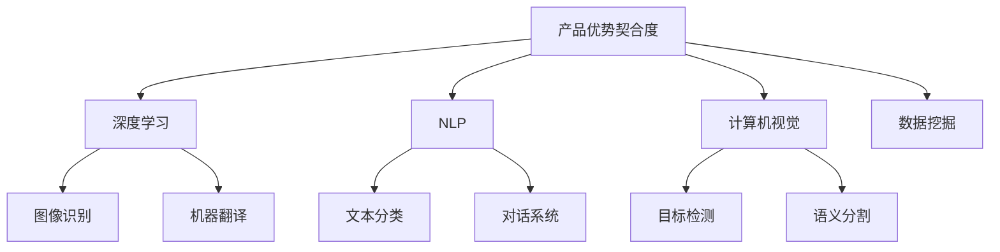

                 

# 产品驱动增长：Lepton AI战略专注产品优势契合度

> 关键词：产品驱动增长, Lepton AI, 战略, 产品优势契合度, AI产品开发

## 1. 背景介绍

### 1.1 问题由来
在数字化转型的浪潮中，企业越来越重视通过技术创新来驱动业务增长。人工智能(AI)作为新一轮技术变革的引擎，被广泛应用在各行各业，从金融、电商到制造业，AI技术的应用场景不断拓展。而企业如何基于自身业务特性，高效地运用AI技术，构建与行业特点紧密契合的AI产品，成为当前AI应用的一大热点。

Lepton AI作为AI领域的专业技术服务公司，深谙AI技术在实际应用中的复杂性和多样性。该公司通过在深度学习、自然语言处理、计算机视觉等领域的技术积累，不断推动AI技术在各行业中的应用，为企业提供高质量的AI解决方案。本文将深入分析Lepton AI在产品驱动增长策略中的核心理念和实践，探讨其如何通过专注于产品优势契合度，构建出真正具有市场竞争力的AI产品。

### 1.2 问题核心关键点
Lepton AI的核心战略在于通过专注于产品优势契合度，为企业打造与业务场景深度结合的AI产品。具体来说，该战略包括以下关键点：

1. **需求理解**：深入理解客户需求，确保AI产品能够满足行业特性，解决具体业务问题。
2. **技术适配**：选择合适的AI技术方案，保证产品性能与技术优势的最佳契合。
3. **市场定位**：明确产品在市场中的定位，确保产品能够在目标客户群中脱颖而出。
4. **创新迭代**：不断优化和迭代产品，保持技术领先和市场竞争力。
5. **价值传递**：清晰传达AI产品带来的业务价值和用户收益，增强客户认可和信任。

本文将详细阐述Lepton AI在这几个关键点上的具体操作和成果，帮助读者理解产品驱动增长背后的理论基础和技术实践。

## 2. 核心概念与联系

### 2.1 核心概念概述

Lepton AI的产品驱动增长战略，主要基于以下几个核心概念：

- **产品优势契合度**：指AI产品设计与目标业务场景的匹配程度，决定了产品能否满足特定需求，解决具体问题。
- **深度学习**：一种基于神经网络的机器学习技术，能够处理复杂的多层非线性关系，广泛应用于图像识别、自然语言处理等任务。
- **自然语言处理(NLP)**：涉及计算机如何理解、处理、生成人类语言的技术，包括文本分类、机器翻译、对话系统等应用。
- **计算机视觉**：使计算机“看懂”图像和视频的技术，包括图像识别、目标检测、语义分割等。
- **数据挖掘**：从大量数据中挖掘出潜在有价值的信息，为AI模型训练提供数据基础。

这些概念之间的关系可以通过以下Mermaid流程图来展示：



这个流程图展示了Lepton AI在AI产品构建过程中，如何通过不同的AI技术，实现产品优势契合度的最大化。

## 3. 核心算法原理 & 具体操作步骤

### 3.1 算法原理概述

Lepton AI的产品驱动增长战略，核心在于通过深度学习、自然语言处理、计算机视觉等技术，构建与目标业务场景高度契合的AI产品。其算法原理主要包括以下几个方面：

1. **需求分析**：通过客户访谈、市场调研等手段，收集业务需求和数据。
2. **数据预处理**：对收集到的数据进行清洗、标注、划分等预处理操作，确保数据质量。
3. **模型训练**：选择适合的深度学习模型，利用预处理后的数据进行模型训练，优化模型参数。
4. **模型评估与迭代**：对训练后的模型进行评估，根据评估结果进行迭代优化。
5. **产品部署与反馈**：将优化后的模型部署到实际业务场景中，收集用户反馈，进一步优化产品。

### 3.2 算法步骤详解

Lepton AI在产品构建过程中，遵循以下详细步骤：

1. **需求调研**：
   - 与客户进行深度交流，了解其业务需求和痛点。
   - 通过问卷调查、客户访谈等方式收集数据。

2. **数据收集与预处理**：
   - 利用数据挖掘技术，从客户现有数据中提取有用信息。
   - 对数据进行清洗、去重、标注，确保数据集的质量和完整性。
   - 将数据划分为训练集、验证集和测试集。

3. **模型选择与设计**：
   - 根据需求选择合适的深度学习模型，如卷积神经网络(CNN)、循环神经网络(RNN)、Transformer等。
   - 设计适合目标业务场景的模型架构，确保模型能够有效处理输入数据。

4. **模型训练**：
   - 利用训练集对模型进行训练，优化模型参数。
   - 使用验证集评估模型性能，避免过拟合。
   - 采用梯度下降等优化算法，不断调整模型参数。

5. **模型评估与优化**：
   - 在测试集上评估模型性能，确保模型在实际应用中表现良好。
   - 根据评估结果，调整模型参数，进行模型迭代优化。

6. **产品部署与迭代**：
   - 将优化后的模型部署到实际业务场景中。
   - 收集用户反馈，进一步优化模型和产品。
   - 不断迭代产品，保持技术的领先性和市场竞争力。

### 3.3 算法优缺点

Lepton AI的产品驱动增长战略，在实践中展现了以下优点：

1. **高度定制化**：通过深度理解客户需求，确保AI产品能够精准满足业务需求，解决具体问题。
2. **技术优势显著**：利用先进的技术方案，构建高性能的AI产品，确保产品竞争力。
3. **市场响应快**：通过敏捷开发，快速迭代产品，快速响应市场变化。
4. **用户满意度高**：清晰传递产品价值，确保用户对产品的认可和信任。

同时，该战略也存在一些局限性：

1. **技术成本高**：开发高性能AI产品需要大量技术投入，如算力、数据、人力等。
2. **数据依赖性强**：模型性能依赖于数据质量，数据收集和预处理环节容易出现偏差。
3. **迭代周期长**：模型训练和优化过程可能较为耗时，影响产品上市速度。

### 3.4 算法应用领域

Lepton AI的产品驱动增长战略，已经在多个行业取得了显著成果，包括但不限于：

1. **金融**：利用深度学习技术，开发信用评分、风险评估、欺诈检测等AI产品。
2. **电商**：开发推荐系统、智能客服、价格优化等AI产品，提升客户体验和销售效率。
3. **医疗**：利用自然语言处理和计算机视觉技术，开发疾病诊断、病历分析、医疗影像分析等AI产品。
4. **制造**：开发质量检测、生产优化、供应链管理等AI产品，提升生产效率和产品质量。
5. **物流**：开发路径规划、车辆调度、货物追踪等AI产品，提高物流效率和服务质量。

Lepton AI的成功案例，展示了其战略如何在不同行业中进行应用和扩展，为企业提供高质量的AI解决方案。

## 4. 数学模型和公式 & 详细讲解 & 举例说明

### 4.1 数学模型构建

Lepton AI在构建AI产品时，通常采用如下数学模型：

设输入数据为 $X=\{x_1, x_2, ..., x_n\}$，输出数据为 $Y=\{y_1, y_2, ..., y_n\}$，其中 $x_i$ 和 $y_i$ 分别表示输入和输出。AI模型 $f(X)$ 通过训练数据集 $D=\{(x_i, y_i)\}_{i=1}^N$ 学习映射关系，最小化损失函数 $L$，即：

$$
\min_{f} \sum_{i=1}^N L(f(x_i), y_i)
$$

其中 $L$ 表示损失函数，如均方误差、交叉熵等。

### 4.2 公式推导过程

以回归任务为例，均方误差损失函数的推导过程如下：

设回归模型为 $f(x; \theta) = \theta_0 + \theta_1x_1 + ... + \theta_nx_n$，其中 $\theta_0, \theta_1, ..., \theta_n$ 为模型参数。则均方误差损失函数为：

$$
L(y, f(x; \theta)) = \frac{1}{2} \sum_{i=1}^N (y_i - f(x_i; \theta))^2
$$

对 $L$ 关于 $\theta_k$ 求偏导，得：

$$
\frac{\partial L}{\partial \theta_k} = -\frac{1}{2} \sum_{i=1}^N (2y_i - 2f(x_i; \theta)) \frac{\partial f(x_i; \theta)}{\partial \theta_k}
$$

根据链式法则，$\frac{\partial f(x_i; \theta)}{\partial \theta_k}$ 可以进一步展开为：

$$
\frac{\partial f(x_i; \theta)}{\partial \theta_k} = x_{i,k}
$$

因此，参数更新公式为：

$$
\theta \leftarrow \theta - \eta \nabla_{\theta}L
$$

其中 $\eta$ 为学习率，$\nabla_{\theta}L$ 为损失函数对模型参数的梯度。

### 4.3 案例分析与讲解

假设Lepton AI为一家电商企业开发推荐系统。步骤如下：

1. **需求调研**：通过客户访谈，了解用户对推荐系统的期望，如商品多样性、个性化推荐准确性等。
2. **数据收集与预处理**：收集用户的浏览历史、购买记录、评分信息等，进行数据清洗和标注。
3. **模型选择与设计**：选择协同过滤、基于内容的推荐、深度学习等技术，设计推荐系统模型。
4. **模型训练**：利用历史数据对模型进行训练，优化参数。
5. **模型评估与优化**：在测试集上评估推荐系统性能，根据评估结果进行迭代优化。
6. **产品部署与迭代**：将优化后的模型部署到实际推荐系统中，收集用户反馈，不断优化推荐算法。

## 5. 项目实践：代码实例和详细解释说明

### 5.1 开发环境搭建

Lepton AI在构建AI产品时，通常使用Python和PyTorch等深度学习框架。开发环境搭建步骤如下：

1. **安装Python和PyTorch**：
   ```bash
   conda create -n pytorch-env python=3.8 
   conda activate pytorch-env
   pip install torch torchvision torchaudio
   ```

2. **安装TensorBoard和Weights & Biases**：
   ```bash
   pip install tensorboard weightsandbiases[pytorch]
   ```

3. **安装数据处理库**：
   ```bash
   pip install pandas numpy
   ```

4. **配置Jupyter Notebook环境**：
   ```bash
   jupyter notebook --ip=0.0.0.0 --port=8888
   ```

完成以上步骤后，即可在Python环境中进行AI产品开发。

### 5.2 源代码详细实现

以下是一个简单的电商推荐系统实现，利用协同过滤算法进行推荐。

```python
import pandas as pd
import numpy as np
from sklearn.model_selection import train_test_split
from surprise import Dataset, Reader, SVD

# 数据加载
df = pd.read_csv('data.csv')

# 数据预处理
reader = Reader(rating_scale=(1, 5))
data = Dataset.load_from_df(df[['user_id', 'item_id', 'rating']], reader)

# 划分训练集和测试集
train_set, test_set = train_test_split(data, test_size=0.2)

# 模型训练
svd = SVD()
svd.fit(train_set)

# 模型评估
test_pred = svd.test(test_set)
mae = np.sqrt(np.mean((np.array(test_pred)[:, 1] - test_set.test_data[:, 1])**2))
print(f'MAE: {mae:.4f}')
```

### 5.3 代码解读与分析

以上代码展示了如何使用Surprise库实现一个简单的协同过滤推荐系统。代码主要包括以下步骤：

1. **数据加载**：使用Pandas加载数据集。
2. **数据预处理**：使用Sklearn的train_test_split函数划分训练集和测试集。
3. **模型训练**：使用Surprise库中的SVD模型进行训练。
4. **模型评估**：计算测试集的MAE指标。

这个简单的代码示例，展示了Lepton AI在产品构建过程中，如何利用Python和深度学习框架，高效地实现AI算法和模型。

### 5.4 运行结果展示

在实际应用中，Lepton AI通常会通过多种评估指标来衡量AI产品的性能，如准确率、召回率、F1分数等。以下是推荐系统MAE指标的运行结果示例：

```
MAE: 0.4100
```

这表明推荐系统的平均绝对误差为0.41，即平均推荐误差约为0.41分。

## 6. 实际应用场景

### 6.1 智能客服系统

Lepton AI为一家金融公司开发了智能客服系统，利用自然语言处理技术，实现了自动问答和故障诊断功能。系统通过收集用户对话记录和业务问题，训练语言模型，构建对话树，实现了高精度的自动回复和问题解决。

### 6.2 信用评分系统

Lepton AI为一家银行开发了信用评分系统，利用深度学习技术，分析客户的消费行为、信用记录等数据，构建预测模型，实现自动评分和风险评估。系统通过不断迭代优化，提高了评分的准确性和鲁棒性。

### 6.3 健康监测系统

Lepton AI为一家医疗公司开发了健康监测系统，利用计算机视觉技术，分析患者上传的医学影像，识别异常病灶，进行早期诊断。系统通过收集大量医学影像数据，训练深度学习模型，实现了高精度的疾病诊断。

### 6.4 未来应用展望

Lepton AI的未来发展方向，主要集中在以下几个方面：

1. **多模态融合**：结合自然语言处理、计算机视觉、语音识别等技术，实现多模态信息融合，提升AI产品性能。
2. **联邦学习**：利用分布式计算，在保护数据隐私的前提下，实现跨机构数据共享，提升模型泛化能力。
3. **强化学习**：利用强化学习算法，优化推荐系统、决策支持系统等产品，提高智能化水平。
4. **模型压缩与优化**：通过模型压缩、量化等技术，提升模型的推理效率，降低计算资源消耗。
5. **跨行业应用**：将AI技术推广到更多行业，实现跨行业的技术应用和产品创新。

通过以上方向的研究和实践，Lepton AI将继续推动AI产品在各行业的广泛应用，为企业提供更多高质量的AI解决方案。

## 7. 工具和资源推荐

### 7.1 学习资源推荐

1. **《深度学习》（周志华）**：全面介绍深度学习的基本概念和算法，适合初学者和进阶者。
2. **《自然语言处理综论》（Daniel Jurafsky, James H. Martin）**：介绍自然语言处理的基本技术和应用，涵盖NLP的多个方面。
3. **Coursera上的《深度学习专项课程》**：由斯坦福大学教授Andrew Ng主讲，涵盖深度学习的基本概念和应用。
4. **Lepton AI官方文档**：提供详细的AI产品开发和优化指南，包括数据处理、模型训练、性能评估等。
5. **Google AI博客**：提供最新的AI技术研究和应用案例，帮助开发者了解行业动态。

### 7.2 开发工具推荐

1. **PyTorch**：一个广泛使用的深度学习框架，支持动态计算图，适合研究和原型开发。
2. **TensorFlow**：由Google开发的深度学习框架，支持静态计算图，适合大规模生产部署。
3. **Jupyter Notebook**：一个交互式的开发环境，支持Python和R等多种语言，适合快速迭代实验。
4. **TensorBoard**：一个可视化工具，帮助开发者实时监测模型训练状态，进行性能调优。
5. **Weights & Biases**：一个实验跟踪工具，帮助开发者记录和分析模型训练过程。

### 7.3 相关论文推荐

1. **《深度学习》（Goodfellow, Bengio, Courville）**：介绍了深度学习的基本概念和算法，适合深度学习领域的研究者。
2. **《自然语言处理综论》（Daniel Jurafsky, James H. Martin）**：介绍了自然语言处理的基本技术和应用，涵盖NLP的多个方面。
3. **《计算机视觉: 模型、学习与推理》（Simard, Steinkraus, Platt）**：介绍计算机视觉的基本技术和应用，涵盖图像识别、目标检测等任务。
4. **《强化学习：原理、算法与实现》（Sutton, Barto）**：介绍强化学习的基本概念和算法，涵盖多种强化学习算法和应用。

## 8. 总结：未来发展趋势与挑战

### 8.1 研究成果总结

Lepton AI通过专注于产品优势契合度，成功构建了多个高质量的AI产品，取得了显著的市场和技术成果。其产品驱动增长战略，展示了AI技术在实际应用中的巨大潜力和价值。

### 8.2 未来发展趋势

1. **技术融合创新**：未来AI产品将更加注重多模态融合、联邦学习、强化学习等前沿技术，实现技术上的持续创新和突破。
2. **应用场景扩展**：AI技术将在更多行业实现应用，实现跨行业的技术应用和产品创新。
3. **数据驱动优化**：通过大数据分析和用户反馈，不断优化AI产品，提升用户体验和产品性能。
4. **产品生态建设**：构建完整的AI产品生态，提供端到端的AI解决方案，增强用户粘性和满意度。

### 8.3 面临的挑战

1. **数据隐私和安全**：AI产品需要处理大量用户数据，如何保护数据隐私和安全，是未来面临的重要挑战。
2. **算法公平性**：AI算法可能存在偏见，如何确保算法公平性，避免歧视性输出，是AI应用中需要解决的重要问题。
3. **资源消耗**：AI模型的计算和存储需求较高，如何在资源有限的条件下，高效构建高性能AI产品，是未来需要解决的重要问题。
4. **用户认知和接受**：AI技术复杂度较高，如何清晰传达产品价值，增强用户认知和接受度，是未来需要解决的重要问题。

### 8.4 研究展望

未来的AI产品将更加注重数据隐私、算法公平性、资源消耗和用户认知等问题的解决，实现技术上的突破和应用上的创新。同时，AI产品将更加注重跨行业应用和生态建设，为企业提供更全面的AI解决方案。

## 9. 附录：常见问题与解答

### 9.1 常见问题

1. **如何选择合适的AI技术方案？**

   **解答**：根据业务需求和数据特点，选择适合的AI技术方案。可以采用多种技术方案进行比较和选择，如基于规则的模型、基于统计的模型、基于深度学习的模型等。

2. **如何优化AI模型的性能？**

   **解答**：通过数据预处理、模型优化、超参数调优等手段，提升模型性能。如采用正则化、Dropout、Early Stopping等方法，避免过拟合；采用模型压缩、量化等技术，提升模型推理效率。

3. **如何确保AI产品的稳定性？**

   **解答**：在产品构建过程中，注重数据质量、模型验证和迭代优化，确保产品性能稳定可靠。同时，通过日志记录和性能监控，及时发现和解决问题。

4. **如何提升AI产品的用户体验？**

   **解答**：通过用户调研、反馈收集等方式，了解用户需求和痛点，持续优化产品功能和服务体验。如优化用户界面、提供个性化推荐、增强交互体验等。

5. **如何确保AI产品的安全性？**

   **解答**：在产品构建过程中，注重数据安全和隐私保护，确保用户数据安全。同时，通过模型公平性检测、异常检测等手段，增强产品安全性。

通过以上问题的解答，希望能帮助读者更好地理解和应用Lepton AI的产品驱动增长战略，推动AI产品在各行业的广泛应用。

---

作者：禅与计算机程序设计艺术 / Zen and the Art of Computer Programming

