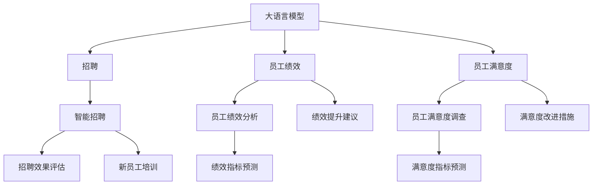

                 

# 人力资源和 LLM：高效的人才管理

> 关键词：大语言模型,HR,人才管理,招聘,员工绩效,员工满意度,HR分析,人工智能应用

## 1. 背景介绍

### 1.1 问题由来
在现代企业的快速发展和市场竞争加剧的背景下，人力资源管理（Human Resource Management, HRM）的重要性日益凸显。传统的人力资源管理模式已难以应对日益复杂的组织结构和多样化的员工需求。如何通过智能化的手段优化人力资源管理，提高人才吸引和保留能力，提升组织效能，成为了一个迫切需要解决的问题。

大语言模型（Large Language Model, LLM）作为一种新兴的AI技术，凭借其强大的自然语言处理能力，为HRM提供了全新的解决方案。LLM技术可以应用于招聘、员工绩效评估、员工满意度分析、HR数据分析等多个方面，极大地提升了人力资源管理的工作效率和精准度。

### 1.2 问题核心关键点
基于LLM的人力资源管理方法的核心在于利用自然语言处理技术，对HR相关的文本数据进行智能分析。核心关键点包括：
- 使用LLM进行简历筛选和招聘分析。
- 利用LLM分析员工绩效、员工满意度等文本数据。
- 通过LLM对人力资源相关数据进行深度分析和预测。
- 通过LLM实现与员工沟通的自动化，提高效率和准确性。

这些关键点共同构成了基于LLM的人力资源管理系统的设计框架，旨在通过智能化手段，全面优化人力资源管理流程。

## 2. 核心概念与联系

### 2.1 核心概念概述

为更好地理解基于LLM的人力资源管理方法，本节将介绍几个密切相关的核心概念：

- 大语言模型(Large Language Model, LLM)：以自回归(如GPT)或自编码(如BERT)模型为代表的大规模预训练语言模型。通过在大规模无标签文本语料上进行预训练，学习通用的语言表示，具备强大的语言理解和生成能力。

- 人力资源管理(Human Resource Management, HRM)：通过有组织、系统化的人力资源管理活动，使人力资源得到合理配置和有效利用，满足组织目标和员工需求。

- 招聘（Recruitment）：通过各种渠道寻找适合组织需求的潜在员工，并进行初步筛选和面试。

- 员工绩效（Employee Performance）：衡量员工在工作中的表现，包括工作质量、工作效率、团队协作等。

- 员工满意度（Employee Satisfaction）：员工对工作环境、薪酬福利、职业发展等各方面的满意程度。

- 员工流失率（Employee Turnover Rate）：员工从组织中离开的比率，是衡量组织吸引和保留员工能力的重要指标。

- 智能招聘（Intelligent Recruitment）：利用AI技术，如自然语言处理、机器学习等，优化招聘流程，提高招聘效率和质量。

- 员工绩效分析（Employee Performance Analysis）：通过数据挖掘和机器学习等手段，对员工绩效进行定量分析，评估员工表现。

- 员工满意度调查（Employee Satisfaction Survey）：收集员工对工作环境、福利待遇等方面的反馈，通过自然语言处理技术进行情感分析。

- 人力资源数据分析（HR Data Analysis）：利用数据挖掘、机器学习等技术，对HR相关数据进行分析和预测，支持人力资源决策。

这些核心概念之间的逻辑关系可以通过以下Mermaid流程图来展示：



这个流程图展示了大语言模型在人力资源管理中的应用场景：

1. 大语言模型用于招聘筛选和智能招聘，帮助HR快速找到合适的候选人。
2. 大语言模型用于员工绩效分析和满意度调查，帮助HR准确评估员工表现和满意度。
3. 大语言模型用于招聘效果评估和绩效提升建议，帮助HR优化招聘流程和绩效管理。
4. 大语言模型用于新员工培训和满意度改进措施，帮助HR提高员工满意度，减少流失率。

## 3. 核心算法原理 & 具体操作步骤
### 3.1 算法原理概述

基于大语言模型的人力资源管理方法，本质上是一个通过自然语言处理技术，对HR相关文本数据进行智能分析的过程。其核心思想是：将大语言模型视作一个强大的文本理解工具，通过对其输入的自然语言文本进行语义分析，提取关键信息，支持人力资源管理的决策和优化。

形式化地，假设有一份简历 $r$ 和一份职位描述 $j$，简历中包含的候选人的技能和经历，职位描述中包含的职位要求和期望。通过大语言模型 $M$ 的输入，将简历和职位描述转换为向量表示，计算它们之间的相似度 $s$。设 $\theta$ 为模型的参数，则相似度 $s$ 的计算公式为：

$$
s = \mathcal{F}(M(r), M(j))
$$

其中 $\mathcal{F}$ 为相似度函数，通常使用余弦相似度、欧几里得距离等。

通过计算简历和职位描述之间的相似度，可以判断候选人是否符合职位要求，从而提高招聘的效率和质量。

### 3.2 算法步骤详解

基于大语言模型的人力资源管理方法一般包括以下几个关键步骤：

**Step 1: 准备数据集**
- 收集HR相关的文本数据，如简历、职位描述、员工反馈等。
- 将文本数据进行预处理，包括去除停用词、分词、词性标注等。

**Step 2: 构建模型输入**
- 将预处理后的文本数据输入到预训练的大语言模型中，得到向量表示。
- 使用特定的任务适配层（如Softmax层）进行输出，得到评分或分类结果。

**Step 3: 训练模型**
- 根据任务目标（如招聘、绩效分析等），设计合适的损失函数，如交叉熵损失、均方误差损失等。
- 使用优化算法（如Adam、SGD等）对模型进行训练，最小化损失函数，优化模型参数。

**Step 4: 模型评估**
- 在验证集上评估模型性能，如准确率、召回率、F1值等。
- 根据评估结果调整模型参数，进行迭代优化。

**Step 5: 模型应用**
- 将训练好的模型应用于实际场景，如简历筛选、员工绩效评估等。
- 根据模型输出，结合领域知识，做出人力资源管理决策。

以上是基于大语言模型的人力资源管理的一般流程。在实际应用中，还需要针对具体任务的特点，对模型进行优化设计，如改进任务适配层，引入更多的正则化技术，搜索最优的超参数组合等，以进一步提升模型性能。

### 3.3 算法优缺点

基于大语言模型的人力资源管理方法具有以下优点：
1. 高效自动化。利用大语言模型自动化处理HR相关文本数据，大大提高了工作效率。
2. 精准度较高。LLM能够从文本中提取关键信息，支持更精准的招聘筛选和员工评估。
3. 可解释性强。大语言模型的输出通常具备较好的可解释性，便于HR理解和管理决策。

同时，该方法也存在一定的局限性：
1. 数据质量要求高。模型的性能很大程度上依赖于输入文本的数据质量和多样性。
2. 偏见和歧视问题。LLM可能会学习到输入数据中的偏见和歧视，造成模型输出偏差。
3. 资源消耗大。大语言模型的计算和存储资源消耗较大，对硬件设备要求较高。
4. 需要大量标注数据。部分任务（如员工满意度分析）需要大量的标注数据，才能训练出高效的模型。

尽管存在这些局限性，但就目前而言，基于大语言模型的人力资源管理方法仍是大规模文本处理任务中的一种重要范式。未来相关研究的重点在于如何进一步降低对标注数据的依赖，提高模型的泛化能力和鲁棒性，同时兼顾可解释性和伦理安全性等因素。

### 3.4 算法应用领域

基于大语言模型的人力资源管理方法已经在招聘、员工绩效评估、员工满意度分析等多个领域得到应用，具体如下：

- 智能招聘：通过LLM自动解析简历和职位描述，筛选出符合条件的候选人，提高招聘效率和质量。
- 员工绩效分析：利用LLM分析员工绩效评估表、工作日志等文本数据，提取关键指标，支持绩效管理。
- 员工满意度调查：通过自然语言处理技术分析员工满意度调查问卷，识别员工意见和建议，提供改进措施。
- 人力资源数据分析：利用LLM对HR相关数据进行深度分析，预测招聘趋势、员工流失率等，支持决策支持。

除了这些经典应用外，LLM还应用于新员工培训、员工关系管理等多个场景中，为HRM带来了新的创新和发展。

## 4. 数学模型和公式 & 详细讲解  
### 4.1 数学模型构建

本节将使用数学语言对基于大语言模型的人力资源管理方法进行更加严格的刻画。

假设有一个简历 $r$ 和一份职位描述 $j$，简历中包含的候选人的技能和经历，职位描述中包含的职位要求和期望。通过大语言模型 $M$ 的输入，将简历和职位描述转换为向量表示，计算它们之间的相似度 $s$。设 $\theta$ 为模型的参数，则相似度 $s$ 的计算公式为：

$$
s = \mathcal{F}(M(r), M(j))
$$

其中 $\mathcal{F}$ 为相似度函数，通常使用余弦相似度、欧几里得距离等。

对于员工绩效评估，假设有一份员工绩效评估表 $e$，通过大语言模型 $M$ 输入员工绩效评估表，得到向量表示。设 $\theta$ 为模型的参数，则绩效评估表评分 $p$ 的计算公式为：

$$
p = M(e)
$$

其中 $M(e)$ 为员工绩效评估表 $e$ 通过大语言模型 $M$ 的输出，通常是一个实数，表示绩效评估的得分。

对于员工满意度调查，假设有一份员工满意度调查问卷 $s$，通过大语言模型 $M$ 输入员工满意度调查问卷，得到向量表示。设 $\theta$ 为模型的参数，则满意度评分 $t$ 的计算公式为：

$$
t = M(s)
$$

其中 $M(s)$ 为员工满意度调查问卷 $s$ 通过大语言模型 $M$ 的输出，通常是一个实数，表示满意度的得分。

### 4.2 公式推导过程

以下我们以员工绩效评估为例，推导评分预测模型的训练过程。

假设有一份员工绩效评估表 $e$，通过大语言模型 $M$ 输入得到向量表示 $v$。设 $\theta$ 为模型的参数，则绩效评估表评分 $p$ 的计算公式为：

$$
p = M(e) = \mathcal{F}(v)
$$

其中 $\mathcal{F}$ 为评分函数，通常使用Softmax层进行分类或回归，得到员工绩效评估表评分 $p$。

将 $p$ 与真实评分 $y$ 进行比较，得到损失函数 $\ell$：

$$
\ell = \frac{1}{N}\sum_{i=1}^N [y_i \log p_i + (1-y_i) \log (1-p_i)]
$$

其中 $y_i$ 为第 $i$ 个员工绩效评估表的真实评分，$N$ 为样本数量。

利用梯度下降等优化算法，对模型进行训练，最小化损失函数 $\ell$，得到最优参数 $\theta^*$：

$$
\theta^* = \mathop{\arg\min}_{\theta} \ell
$$

通过上述过程，模型可以学习到员工绩效评估表与评分之间的映射关系，从而在实际应用中进行性能评估。

## 5. 项目实践：代码实例和详细解释说明
### 5.1 开发环境搭建

在进行人力资源管理模型开发前，我们需要准备好开发环境。以下是使用Python进行PyTorch开发的环境配置流程：

1. 安装Anaconda：从官网下载并安装Anaconda，用于创建独立的Python环境。

2. 创建并激活虚拟环境：
```bash
conda create -n hr-env python=3.8 
conda activate hr-env
```

3. 安装PyTorch：根据CUDA版本，从官网获取对应的安装命令。例如：
```bash
conda install pytorch torchvision torchaudio cudatoolkit=11.1 -c pytorch -c conda-forge
```

4. 安装Transformers库：
```bash
pip install transformers
```

5. 安装各类工具包：
```bash
pip install numpy pandas scikit-learn matplotlib tqdm jupyter notebook ipython
```

完成上述步骤后，即可在`hr-env`环境中开始人力资源管理模型的开发。

### 5.2 源代码详细实现

下面我们以员工绩效评估为例，给出使用Transformers库对BERT模型进行人力资源管理任务开发的PyTorch代码实现。

首先，定义员工绩效评估表的数据处理函数：

```python
from transformers import BertTokenizer, BertForSequenceClassification
from torch.utils.data import Dataset
import torch

class PerformanceDataset(Dataset):
    def __init__(self, texts, labels, tokenizer, max_len=128):
        self.texts = texts
        self.labels = labels
        self.tokenizer = tokenizer
        self.max_len = max_len
        
    def __len__(self):
        return len(self.texts)
    
    def __getitem__(self, item):
        text = self.texts[item]
        label = self.labels[item]
        
        encoding = self.tokenizer(text, return_tensors='pt', max_length=self.max_len, padding='max_length', truncation=True)
        input_ids = encoding['input_ids'][0]
        attention_mask = encoding['attention_mask'][0]
        
        # 对label进行编码
        encoded_labels = torch.tensor(label, dtype=torch.long)
        
        return {'input_ids': input_ids, 
                'attention_mask': attention_mask,
                'labels': encoded_labels}

# 标签与id的映射
label2id = {'Poor': 0, 'Average': 1, 'Good': 2, 'Excellent': 3}

# 创建dataset
tokenizer = BertTokenizer.from_pretrained('bert-base-cased')

train_dataset = PerformanceDataset(train_texts, train_labels, tokenizer)
dev_dataset = PerformanceDataset(dev_texts, dev_labels, tokenizer)
test_dataset = PerformanceDataset(test_texts, test_labels, tokenizer)
```

然后，定义模型和优化器：

```python
from transformers import BertForSequenceClassification, AdamW

model = BertForSequenceClassification.from_pretrained('bert-base-cased', num_labels=len(label2id))

optimizer = AdamW(model.parameters(), lr=2e-5)
```

接着，定义训练和评估函数：

```python
from torch.utils.data import DataLoader
from tqdm import tqdm
from sklearn.metrics import classification_report

device = torch.device('cuda') if torch.cuda.is_available() else torch.device('cpu')
model.to(device)

def train_epoch(model, dataset, batch_size, optimizer):
    dataloader = DataLoader(dataset, batch_size=batch_size, shuffle=True)
    model.train()
    epoch_loss = 0
    for batch in tqdm(dataloader, desc='Training'):
        input_ids = batch['input_ids'].to(device)
        attention_mask = batch['attention_mask'].to(device)
        labels = batch['labels'].to(device)
        model.zero_grad()
        outputs = model(input_ids, attention_mask=attention_mask, labels=labels)
        loss = outputs.loss
        epoch_loss += loss.item()
        loss.backward()
        optimizer.step()
    return epoch_loss / len(dataloader)

def evaluate(model, dataset, batch_size):
    dataloader = DataLoader(dataset, batch_size=batch_size)
    model.eval()
    preds, labels = [], []
    with torch.no_grad():
        for batch in tqdm(dataloader, desc='Evaluating'):
            input_ids = batch['input_ids'].to(device)
            attention_mask = batch['attention_mask'].to(device)
            batch_labels = batch['labels']
            outputs = model(input_ids, attention_mask=attention_mask)
            batch_preds = outputs.logits.argmax(dim=2).to('cpu').tolist()
            batch_labels = batch_labels.to('cpu').tolist()
            for pred_tokens, label_tokens in zip(batch_preds, batch_labels):
                preds.append(pred_tokens[:len(label_tokens)])
                labels.append(label_tokens)
                
    print(classification_report(labels, preds))
```

最后，启动训练流程并在测试集上评估：

```python
epochs = 5
batch_size = 16

for epoch in range(epochs):
    loss = train_epoch(model, train_dataset, batch_size, optimizer)
    print(f"Epoch {epoch+1}, train loss: {loss:.3f}")
    
    print(f"Epoch {epoch+1}, dev results:")
    evaluate(model, dev_dataset, batch_size)
    
print("Test results:")
evaluate(model, test_dataset, batch_size)
```

以上就是使用PyTorch对BERT进行员工绩效评估任务的人力资源管理模型开发的完整代码实现。可以看到，得益于Transformers库的强大封装，我们可以用相对简洁的代码完成BERT模型的加载和微调。

### 5.3 代码解读与分析

让我们再详细解读一下关键代码的实现细节：

**PerformanceDataset类**：
- `__init__`方法：初始化文本、标签、分词器等关键组件。
- `__len__`方法：返回数据集的样本数量。
- `__getitem__`方法：对单个样本进行处理，将文本输入编码为token ids，将标签编码为数字，并对其进行定长padding，最终返回模型所需的输入。

**label2id和id2label字典**：
- 定义了标签与数字id之间的映射关系，用于将模型输出的数字解码为实际的绩效评估标签。

**训练和评估函数**：
- 使用PyTorch的DataLoader对数据集进行批次化加载，供模型训练和推理使用。
- 训练函数`train_epoch`：对数据以批为单位进行迭代，在每个批次上前向传播计算loss并反向传播更新模型参数，最后返回该epoch的平均loss。
- 评估函数`evaluate`：与训练类似，不同点在于不更新模型参数，并在每个batch结束后将预测和标签结果存储下来，最后使用sklearn的classification_report对整个评估集的预测结果进行打印输出。

**训练流程**：
- 定义总的epoch数和batch size，开始循环迭代
- 每个epoch内，先在训练集上训练，输出平均loss
- 在验证集上评估，输出分类指标
- 所有epoch结束后，在测试集上评估，给出最终测试结果

可以看到，PyTorch配合Transformers库使得BERT微调的代码实现变得简洁高效。开发者可以将更多精力放在数据处理、模型改进等高层逻辑上，而不必过多关注底层的实现细节。

当然，工业级的系统实现还需考虑更多因素，如模型的保存和部署、超参数的自动搜索、更灵活的任务适配层等。但核心的微调范式基本与此类似。

## 6. 实际应用场景
### 6.1 智能招聘

智能招聘是大语言模型在人力资源管理中的重要应用场景之一。通过LLM自动化处理简历筛选和职位描述匹配，可以显著提高招聘的效率和质量。

具体而言，可以收集公司历史招聘数据，将职位描述和简历数据输入到预训练的LLM模型中，得到向量表示。利用模型计算职位描述和简历向量之间的相似度，筛选出符合要求的候选人，生成推荐列表。如此构建的智能招聘系统，能大幅缩短招聘周期，提升候选人匹配度。

### 6.2 员工绩效评估

员工绩效评估是大语言模型在人力资源管理中的另一个重要应用场景。通过LLM分析员工绩效评估表，可以自动提取关键指标，生成绩效评估报告。

具体而言，可以收集员工绩效评估数据，将其输入到预训练的LLM模型中，得到评分。利用评分对员工绩效进行分类或回归分析，提取关键绩效指标，生成绩效评估报告。这不仅提高了绩效评估的效率，还减少了人为误差。

### 6.3 员工满意度调查

员工满意度调查是大语言模型在人力资源管理中的重要应用场景之一。通过LLM分析员工满意度调查问卷，可以自动提取关键信息，生成满意度分析报告。

具体而言，可以收集员工满意度调查问卷数据，将其输入到预训练的LLM模型中，得到评分。利用评分对员工满意度进行分析，识别出满意度和不满意的方面，生成满意度分析报告。这不仅提高了满意度调查的效率，还减少了人为误差。

### 6.4 未来应用展望

随着大语言模型和微调方法的不断发展，基于LLM的人力资源管理技术将呈现以下几个发展趋势：

1. 模型规模持续增大。随着算力成本的下降和数据规模的扩张，预训练语言模型的参数量还将持续增长。超大规模语言模型蕴含的丰富语言知识，有望支撑更加复杂多变的招聘和绩效管理任务。

2. 微调方法日趋多样。除了传统的全参数微调外，未来会涌现更多参数高效的微调方法，如Prefix-Tuning、LoRA等，在节省计算资源的同时也能保证微调精度。

3. 持续学习成为常态。随着数据分布的不断变化，微调模型也需要持续学习新知识以保持性能。如何在不遗忘原有知识的同时，高效吸收新样本信息，将成为重要的研究课题。

4. 标注样本需求降低。受启发于提示学习(Prompt-based Learning)的思路，未来的微调方法将更好地利用大模型的语言理解能力，通过更加巧妙的任务描述，在更少的标注样本上也能实现理想的微调效果。

5. 多模态微调崛起。当前的微调主要聚焦于纯文本数据，未来会进一步拓展到图像、视频、语音等多模态数据微调。多模态信息的融合，将显著提升语言模型对现实世界的理解和建模能力。

6. 模型通用性增强。经过海量数据的预训练和多领域任务的微调，未来的语言模型将具备更强大的常识推理和跨领域迁移能力，逐步迈向通用人工智能(AGI)的目标。

以上趋势凸显了大语言模型在人力资源管理中的应用前景。这些方向的探索发展，必将进一步提升HR管理系统的性能和应用范围，为企业管理带来新的变革。

## 7. 工具和资源推荐
### 7.1 学习资源推荐

为了帮助开发者系统掌握大语言模型在人力资源管理中的应用，这里推荐一些优质的学习资源：

1. 《Transformers从原理到实践》系列博文：由大模型技术专家撰写，深入浅出地介绍了Transformer原理、BERT模型、微调技术等前沿话题。

2. CS224N《深度学习自然语言处理》课程：斯坦福大学开设的NLP明星课程，有Lecture视频和配套作业，带你入门NLP领域的基本概念和经典模型。

3. 《Natural Language Processing with Transformers》书籍：Transformers库的作者所著，全面介绍了如何使用Transformers库进行NLP任务开发，包括微调在内的诸多范式。

4. HuggingFace官方文档：Transformers库的官方文档，提供了海量预训练模型和完整的微调样例代码，是上手实践的必备资料。

5. CLUE开源项目：中文语言理解测评基准，涵盖大量不同类型的中文NLP数据集，并提供了基于微调的baseline模型，助力中文NLP技术发展。

通过对这些资源的学习实践，相信你一定能够快速掌握大语言模型在人力资源管理中的应用精髓，并用于解决实际的NLP问题。
###  7.2 开发工具推荐

高效的开发离不开优秀的工具支持。以下是几款用于大语言模型在人力资源管理中应用的常用工具：

1. PyTorch：基于Python的开源深度学习框架，灵活动态的计算图，适合快速迭代研究。大部分预训练语言模型都有PyTorch版本的实现。

2. TensorFlow：由Google主导开发的开源深度学习框架，生产部署方便，适合大规模工程应用。同样有丰富的预训练语言模型资源。

3. Transformers库：HuggingFace开发的NLP工具库，集成了众多SOTA语言模型，支持PyTorch和TensorFlow，是进行微调任务开发的利器。

4. Weights & Biases：模型训练的实验跟踪工具，可以记录和可视化模型训练过程中的各项指标，方便对比和调优。与主流深度学习框架无缝集成。

5. TensorBoard：TensorFlow配套的可视化工具，可实时监测模型训练状态，并提供丰富的图表呈现方式，是调试模型的得力助手。

6. Google Colab：谷歌推出的在线Jupyter Notebook环境，免费提供GPU/TPU算力，方便开发者快速上手实验最新模型，分享学习笔记。

合理利用这些工具，可以显著提升大语言模型在人力资源管理中的应用开发效率，加快创新迭代的步伐。

### 7.3 相关论文推荐

大语言模型和微调技术的发展源于学界的持续研究。以下是几篇奠基性的相关论文，推荐阅读：

1. Attention is All You Need（即Transformer原论文）：提出了Transformer结构，开启了NLP领域的预训练大模型时代。

2. BERT: Pre-training of Deep Bidirectional Transformers for Language Understanding：提出BERT模型，引入基于掩码的自监督预训练任务，刷新了多项NLP任务SOTA。

3. Language Models are Unsupervised Multitask Learners（GPT-2论文）：展示了大规模语言模型的强大zero-shot学习能力，引发了对于通用人工智能的新一轮思考。

4. Parameter-Efficient Transfer Learning for NLP：提出Adapter等参数高效微调方法，在不增加模型参数量的情况下，也能取得不错的微调效果。

5. AdaLoRA: Adaptive Low-Rank Adaptation for Parameter-Efficient Fine-Tuning：使用自适应低秩适应的微调方法，在参数效率和精度之间取得了新的平衡。

这些论文代表了大语言模型和微调技术的发展脉络。通过学习这些前沿成果，可以帮助研究者把握学科前进方向，激发更多的创新灵感。

## 8. 总结：未来发展趋势与挑战

### 8.1 总结

本文对基于大语言模型的人力资源管理方法进行了全面系统的介绍。首先阐述了大语言模型和微调技术在人力资源管理中的应用背景和意义，明确了微调在优化招聘、员工绩效评估、员工满意度分析等方面的独特价值。其次，从原理到实践，详细讲解了基于大语言模型的微调方法，给出了微调任务开发的完整代码实例。同时，本文还广泛探讨了微调方法在智能招聘、员工绩效评估、员工满意度分析等多个领域的应用前景，展示了微调范式的巨大潜力。此外，本文精选了微调技术的各类学习资源，力求为读者提供全方位的技术指引。

通过本文的系统梳理，可以看到，基于大语言模型的微调方法正在成为人力资源管理的重要范式，极大地优化了招聘和绩效管理的工作流程，提高了效率和精准度。未来，伴随预训练语言模型和微调方法的持续演进，基于大语言模型的HRM技术必将在企业管理中发挥更加重要的作用，推动企业智能化转型。

### 8.2 未来发展趋势

展望未来，基于大语言模型的人力资源管理技术将呈现以下几个发展趋势：

1. 模型规模持续增大。随着算力成本的下降和数据规模的扩张，预训练语言模型的参数量还将持续增长。超大规模语言模型蕴含的丰富语言知识，有望支撑更加复杂多变的招聘和绩效管理任务。

2. 微调方法日趋多样。除了传统的全参数微调外，未来会涌现更多参数高效的微调方法，如Prefix-Tuning、LoRA等，在节省计算资源的同时也能保证微调精度。

3. 持续学习成为常态。随着数据分布的不断变化，微调模型也需要持续学习新知识以保持性能。如何在不遗忘原有知识的同时，高效吸收新样本信息，将成为重要的研究课题。

4. 标注样本需求降低。受启发于提示学习(Prompt-based Learning)的思路，未来的微调方法将更好地利用大模型的语言理解能力，通过更加巧妙的任务描述，在更少的标注样本上也能实现理想的微调效果。

5. 多模态微调崛起。当前的微调主要聚焦于纯文本数据，未来会进一步拓展到图像、视频、语音等多模态数据微调。多模态信息的融合，将显著提升语言模型对现实世界的理解和建模能力。

6. 模型通用性增强。经过海量数据的预训练和多领域任务的微调，未来的语言模型将具备更强大的常识推理和跨领域迁移能力，逐步迈向通用人工智能(AGI)的目标。

以上趋势凸显了大语言模型在人力资源管理中的应用前景。这些方向的探索发展，必将进一步提升HR管理系统的性能和应用范围，为企业管理带来新的变革。

### 8.3 面临的挑战

尽管基于大语言模型的人力资源管理技术已经取得了瞩目成就，但在迈向更加智能化、普适化应用的过程中，它仍面临着诸多挑战：

1. 标注成本瓶颈。虽然微调大大降低了标注数据的需求，但对于长尾应用场景，难以获得充足的高质量标注数据，成为制约微调性能的瓶颈。如何进一步降低微调对标注数据的依赖，将是一大难题。

2. 模型鲁棒性不足。当前微调模型面对域外数据时，泛化性能往往大打折扣。对于测试样本的微小扰动，微调模型的预测也容易发生波动。如何提高微调模型的鲁棒性，避免灾难性遗忘，还需要更多理论和实践的积累。

3. 推理效率有待提高。大规模语言模型虽然精度高，但在实际部署时往往面临推理速度慢、内存占用大等效率问题。如何在保证性能的同时，简化模型结构，提升推理速度，优化资源占用，将是重要的优化方向。

4. 可解释性亟需加强。当前微调模型更像是"黑盒"系统，难以解释其内部工作机制和决策逻辑。对于医疗、金融等高风险应用，算法的可解释性和可审计性尤为重要。如何赋予微调模型更强的可解释性，将是亟待攻克的难题。

5. 安全性有待保障。预训练语言模型难免会学习到有偏见、有害的信息，通过微调传递到下游任务，产生误导性、歧视性的输出，给实际应用带来安全隐患。如何从数据和算法层面消除模型偏见，避免恶意用途，确保输出的安全性，也将是重要的研究课题。

6. 知识整合能力不足。现有的微调模型往往局限于任务内数据，难以灵活吸收和运用更广泛的先验知识。如何让微调过程更好地与外部知识库、规则库等专家知识结合，形成更加全面、准确的信息整合能力，还有很大的想象空间。

正视微调面临的这些挑战，积极应对并寻求突破，将是大语言模型微调走向成熟的必由之路。相信随着学界和产业界的共同努力，这些挑战终将一一被克服，基于大语言模型的HRM技术必将在企业管理中发挥更加重要的作用。

### 8.4 研究展望

面对大语言模型微调所面临的种种挑战，未来的研究需要在以下几个方面寻求新的突破：

1. 探索无监督和半监督微调方法。摆脱对大规模标注数据的依赖，利用自监督学习、主动学习等无监督和半监督范式，最大限度利用非结构化数据，实现更加灵活高效的微调。

2. 研究参数高效和计算高效的微调范式。开发更加参数高效的微调方法，在固定大部分预训练参数的同时，只更新极少量的任务相关参数。同时优化微调模型的计算图，减少前向传播和反向传播的资源消耗，实现更加轻量级、实时性的部署。

3. 融合因果和对比学习范式。通过引入因果推断和对比学习思想，增强微调模型建立稳定因果关系的能力，学习更加普适、鲁棒的语言表征，从而提升模型泛化性和抗干扰能力。

4. 引入更多先验知识。将符号化的先验知识，如知识图谱、逻辑规则等，与神经网络模型进行巧妙融合，引导微调过程学习更准确、合理的语言模型。同时加强不同模态数据的整合，实现视觉、语音等多模态信息与文本信息的协同建模。

5. 结合因果分析和博弈论工具。将因果分析方法引入微调模型，识别出模型决策的关键特征，增强输出解释的因果性和逻辑性。借助博弈论工具刻画人机交互过程，主动探索并规避模型的脆弱点，提高系统稳定性。

6. 纳入伦理道德约束。在模型训练目标中引入伦理导向的评估指标，过滤和惩罚有偏见、有害的输出倾向。同时加强人工干预和审核，建立模型行为的监管机制，确保输出符合人类价值观和伦理道德。

这些研究方向的探索，必将引领大语言模型微调技术迈向更高的台阶，为构建安全、可靠、可解释、可控的智能系统铺平道路。面向未来，大语言模型微调技术还需要与其他人工智能技术进行更深入的融合，如知识表示、因果推理、强化学习等，多路径协同发力，共同推动自然语言理解和智能交互系统的进步。只有勇于创新、敢于突破，才能不断拓展语言模型的边界，让智能技术更好地造福人类社会。

## 9. 附录：常见问题与解答
----------------------------------------------------------------
**Q1：大语言模型微调是否适用于所有HR任务？**

A: 大语言模型微调在大多数HR任务上都能取得不错的效果，特别是对于数据量较小的任务。但对于一些特定领域的任务，如医学、法律等，仅仅依靠通用语料预训练的模型可能难以很好地适应。此时需要在特定领域语料上进一步预训练，再进行微调，才能获得理想效果。此外，对于一些需要时效性、个性化很强的任务，如对话、推荐等，微调方法也需要针对性的改进优化。

**Q2：微调过程中如何选择合适的学习率？**

A: 微调的学习率一般要比预训练时小1-2个数量级，如果使用过大的学习率，容易破坏预训练权重，导致过拟合。一般建议从1e-5开始调参，逐步减小学习率，直至收敛。也可以使用warmup策略，在开始阶段使用较小的学习率，再逐渐过渡到预设值。需要注意的是，不同的优化器(如AdamW、Adafactor等)以及不同的学习率调度策略，可能需要设置不同的学习率阈值。

**Q3：采用大语言模型微调时会面临哪些资源瓶颈？**

A: 目前主流的预训练大模型动辄以亿计的参数规模，对算力、内存、存储都提出了很高的要求。GPU/TPU等高性能设备是必不可少的，但即便如此，超大批次的训练和推理也可能遇到显存不足的问题。因此需要采用一些资源优化技术，如梯度积累、混合精度训练、模型并行等，来突破硬件瓶颈。同时，模型的存储和读取也可能占用大量时间和空间，需要采用模型压缩、稀疏化存储等方法进行优化。

**Q4：如何缓解微调过程中的过拟合问题？**

A: 过拟合是微调面临的主要挑战，尤其是在标注数据不足的情况下。常见的缓解策略包括：
1. 数据增强：通过回译、近义替换等方式扩充训练集
2. 正则化：使用L2正则、Dropout、Early Stopping等避免过拟合
3. 对抗训练：引入对抗样本，提高模型鲁棒性
4. 参数高效微调：只调整少量参数(如Adapter、Prefix等)，减小过拟合风险
5. 多模型集成：训练多个微调模型，取平均输出，抑制过拟合

这些策略往往需要根据具体任务和数据特点进行灵活组合。只有在数据、模型、训练、推理等各环节进行全面优化，才能最大限度地发挥大模型微调的威力。

**Q5：微调模型在落地部署时需要注意哪些问题？**

A: 将微调模型转化为实际应用，还需要考虑以下因素：
1. 模型裁剪：去除不必要的层和参数，减小模型尺寸，加快推理速度
2. 量化加速：将浮点模型转为定点模型，压缩存储空间，提高计算效率
3. 服务化封装：将模型封装为标准化服务接口，便于集成调用
4. 弹性伸缩：根据请求流量动态调整资源配置，平衡服务质量和成本
5. 监控告警：实时采集系统指标，设置异常告警阈值，确保服务稳定性
6. 安全防护：采用访问鉴权、数据脱敏等措施，保障数据和模型安全

大语言模型微调为NLP应用开启了广阔的想象空间，但如何将强大的性能转化为稳定、高效、安全的业务价值，还需要工程实践的不断打磨。唯有从数据、算法、工程、业务等多个维度协同发力，才能真正实现人工智能技术在垂直行业的规模化落地。总之，微调需要开发者根据具体任务，不断迭代和优化模型、数据和算法，方能得到理想的效果。

---

作者：禅与计算机程序设计艺术 / Zen and the Art of Computer Programming

