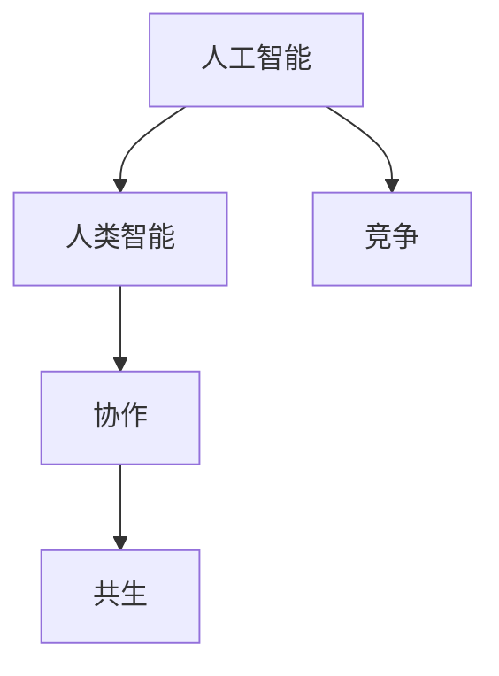

                 

# 人工智能与人类智能：协作而非竞争

> 关键词：人工智能, 人类智能, 协作, 竞争, 共生, 未来技术, 道德伦理, 人机融合

## 1. 背景介绍

### 1.1 问题由来
人工智能（Artificial Intelligence, AI）和人类智能（Human Intelligence, HI），是当今科技发展的前沿和热点。从AlphaGo、AlphaFold到GPT-3、ChatGPT，AI技术正在不断取得突破，展现出了强大的算法能力和应用前景。但与此同时，公众对于AI与人类智能的关系始终存在诸多疑虑和担忧：AI是否会对人类社会产生负面影响？AI是否能代替人类？AI与人类智能如何共存？这些问题既关乎技术发展，也关乎道德伦理，需要我们在探索AI未来的同时，深入思考和解答。

### 1.2 问题核心关键点
面对这些复杂问题，我们需要从多个维度来探讨AI与人类智能的相互关系。核心关键点包括：

1. **AI与HI的互补性**：AI擅长处理大数据、复杂计算，但情感理解、创意生成、伦理判断等方面仍依赖人类智能。
2. **AI的局限性**：AI缺乏人类的常识推理、同情心和价值观，难以应对非结构化数据的理解和处理。
3. **共生模式**：AI和人类智能应通过协作，而非竞争，共同推动社会进步。
4. **伦理和隐私问题**：AI的应用应尊重隐私，遵循道德伦理，确保技术发展的公正性和安全性。
5. **技术和社会的影响**：AI应助力解决社会问题，如贫困、教育不公、环境污染等，促进公平和谐发展。

这些关键点构成了我们探讨AI与人类智能关系的框架，帮助我们全面理解这一领域。

## 2. 核心概念与联系

### 2.1 核心概念概述

为了更深入地理解AI与人类智能的协作关系，本节将介绍几个关键概念：

1. **人工智能（Artificial Intelligence）**：指通过算法、计算和数据驱动，模拟人类智能行为的技术系统。
2. **人类智能（Human Intelligence）**：指人类在认知、情感、社会交往等方面的自然智能，具有独特的情感、价值观和创造力。
3. **协作（Collaboration）**：AI与HI通过各自优势互补，共同解决问题、提升效率、创造价值的过程。
4. **竞争（Competition）**：AI与HI在技术、市场、社会角色等方面存在的冲突和竞争。
5. **共生（Symbiosis）**：AI与HI在功能、文化、伦理等方面的深度融合，形成新的共生体。

这些概念之间的逻辑关系可以通过以下Mermaid流程图来展示：



这个流程图展示了AI与HI之间的核心关系：

1. AI和HI各自有其独特的优势和局限。
2. 在协作模式下，AI和HI可以互为补充，形成更强大的智能系统。
3. 在竞争模式下，AI和HI可能会产生冲突和竞争，影响社会稳定。
4. 共生模式则是AI与HI在功能、文化、伦理等方面深度融合，形成新的智能形态。

## 3. 核心算法原理 & 具体操作步骤

### 3.1 算法原理概述

AI与HI的协作关系，可以通过一系列算法和技术手段实现。以下是其中的关键步骤：

1. **数据集成**：将AI处理的数据与HI对数据的理解相结合，形成更全面的信息模型。
2. **情感计算**：利用AI技术处理情感数据，同时通过HI对情感的深度理解和表达，实现情感交互。
3. **创意生成**：结合AI的计算能力和HI的创造力，生成更具创新性的内容和解决方案。
4. **伦理判断**：AI处理海量数据，HI则进行道德和伦理的审查，确保AI应用的公正性和安全性。
5. **协同优化**：通过AI的算法优化和HI的反馈机制，不断提升AI系统的性能和效果。

### 3.2 算法步骤详解

以下我们将详细介绍这些关键步骤的算法实现细节：

**步骤1：数据集成**

数据集成是AI与HI协作的基础。具体步骤如下：

1. **数据采集**：从不同来源（如社交媒体、传感器、问卷调查等）采集数据。
2. **数据清洗**：清洗和预处理数据，去除噪声和异常值，确保数据质量。
3. **数据融合**：将不同来源的数据进行融合，形成更完整、更准确的模型输入。

数学公式表示为：

$$
Data_{integrated} = Data_{AI} \cup Data_{HI}
$$

其中，$Data_{AI}$表示AI处理的数据，$Data_{HI}$表示HI对数据的理解。

**步骤2：情感计算**

情感计算是AI与HI协作的关键环节。具体步骤如下：

1. **情感识别**：使用AI技术（如机器学习、深度学习）对文本、语音、图像等数据进行情感识别和分类。
2. **情感生成**：通过HI对情感的深度理解和生成，增强情感交互的丰富性和真实性。
3. **情感反馈**：将情感计算结果反馈到AI系统中，优化情感识别和生成算法。

数学公式表示为：

$$
Emotion_{calculated} = \Phi(Emotion_{AI}, Emotion_{HI})
$$

其中，$\Phi$表示情感计算函数。

**步骤3：创意生成**

创意生成是AI与HI协作的高阶应用。具体步骤如下：

1. **创意素材获取**：从多个来源获取创意素材（如文学作品、艺术作品、科学文献等）。
2. **AI创意生成**：利用AI算法生成新的创意作品（如小说、绘画、音乐等）。
3. **HI审查与优化**：HI对AI生成的创意作品进行审查和优化，确保其符合伦理和审美标准。

数学公式表示为：

$$
Creativity_{generated} = AI_{创意生成算法}(素材_{AI}, 素材_{HI})
$$

其中，$AI_{创意生成算法}$表示AI的创意生成算法。

**步骤4：伦理判断**

伦理判断是AI与HI协作的保障环节。具体步骤如下：

1. **伦理规则制定**：根据社会公德和伦理准则，制定AI应用的伦理规则。
2. **伦理审核**：HI对AI应用进行伦理审核，确保其符合伦理规则。
3. **伦理反馈**：将伦理判断结果反馈到AI系统中，优化AI的伦理判断能力。

数学公式表示为：

$$
Ethics_{judged} = HI_{伦理判断算法}(AI_{应用}, Ethics_{规则})
$$

其中，$HI_{伦理判断算法}$表示HI的伦理判断算法。

**步骤5：协同优化**

协同优化是AI与HI协作的持续改进环节。具体步骤如下：

1. **反馈机制建立**：建立HI对AI的反馈机制，及时发现和修正AI的错误。
2. **算法优化**：利用AI的计算能力，优化HI的反馈算法，提升其准确性和效率。
3. **性能评估**：定期评估AI与HI的协作性能，发现和解决存在的问题。

数学公式表示为：

$$
Performance_{optimized} = AI_{优化算法}(HI_{反馈结果}, Performance_{基线})
$$

其中，$AI_{优化算法}$表示AI的优化算法，$HI_{反馈结果}$表示HI的反馈结果。

### 3.3 算法优缺点

AI与HI的协作算法具有以下优点：

1. **互补性**：AI处理数据速度快、计算能力强，HI在情感、伦理等方面具有独特优势。
2. **多样性**：通过结合AI和HI的优势，能够产生更加多样、丰富的智能输出。
3. **可解释性**：HI对AI算法的理解可以帮助解释AI的决策过程，增强AI系统的可信度。

同时，也存在一些缺点：

1. **数据依赖**：AI的算法效果依赖于数据质量和多样性，数据不足可能导致AI性能下降。
2. **伦理争议**：AI在伦理判断方面可能存在偏差，需要HI的介入和监督。
3. **技术复杂性**：AI与HI的协作涉及多学科知识，实现难度较高。

### 3.4 算法应用领域

AI与HI的协作算法在多个领域具有广泛的应用前景，例如：

1. **医疗健康**：AI用于数据分析和诊断，HI进行临床决策和伦理审查，共同提升医疗水平。
2. **教育培训**：AI提供个性化教学，HI进行教学评估和情感引导，提升教育质量。
3. **金融服务**：AI用于风险评估和欺诈检测，HI进行伦理监管和客户服务，增强金融安全。
4. **智能制造**：AI进行数据分析和预测，HI进行生产管理和人机交互，提升制造效率。
5. **环境保护**：AI进行数据分析和环境监测，HI进行政策制定和伦理评估，促进可持续发展。

这些应用领域展示了AI与HI协作的巨大潜力和广泛价值。

## 4. 数学模型和公式 & 详细讲解  
### 4.1 数学模型构建

在本节中，我们将使用数学语言对AI与HI的协作算法进行更加严格的刻画。

假设AI处理的数据为$Data_{AI}$，HI对数据的理解为$Data_{HI}$。协作过程中，AI和HI分别进行数据处理和情感计算，形成最终的协作结果$Data_{collaborative}$。

协作的数学模型可以表示为：

$$
Data_{collaborative} = \mathcal{F}(Data_{AI}, Data_{HI}, Eth_{rules}, Ethics_{judged})
$$

其中，$\mathcal{F}$表示协作函数，$Eth_{rules}$表示伦理规则，$Ethics_{judged}$表示伦理判断结果。

### 4.2 公式推导过程

下面，我们将通过一个简单的例子来说明AI与HI的协作模型。

假设AI处理的数据为文本$Text_{AI}$，HI对文本的情感识别为$Emotion_{HI}$。AI和HI协作的结果为$Collaboration_{result}$，其中$Collaboration_{result}$是文本和情感的综合表示。

数学公式表示为：

$$
Collaboration_{result} = \mathcal{F}(Text_{AI}, Emotion_{HI}, Eth_{rules}, Ethics_{judged})
$$

其中，$\mathcal{F}$表示协作函数。

### 4.3 案例分析与讲解

以下我们将通过具体案例来分析AI与HI的协作过程。

假设一个智能医疗系统，AI负责分析患者的历史数据，HI进行临床决策和伦理审查。

1. **数据处理**：AI分析患者的病历、检查结果等数据，生成初步诊断结果$Diagnosis_{AI}$。
2. **情感计算**：HI对患者情感进行识别，确保其对治疗的态度积极，生成情感评估$Emotion_{HI}$。
3. **协作生成**：AI与HI共同生成最终的诊断结果$Diagnosis_{collaborative}$，同时HI进行伦理判断，确保治疗方案符合伦理规范。

数学公式表示为：

$$
Diagnosis_{collaborative} = \mathcal{F}(Diagnosis_{AI}, Emotion_{HI}, Eth_{rules}, Ethics_{judged})
$$

其中，$\mathcal{F}$表示协作函数，$Eth_{rules}$表示伦理规则，$Ethics_{judged}$表示伦理判断结果。

## 5. 项目实践：代码实例和详细解释说明
### 5.1 开发环境搭建

在进行AI与HI协作的实践前，我们需要准备好开发环境。以下是使用Python进行PyTorch开发的环境配置流程：

1. 安装Anaconda：从官网下载并安装Anaconda，用于创建独立的Python环境。

2. 创建并激活虚拟环境：
```bash
conda create -n pytorch-env python=3.8 
conda activate pytorch-env
```

3. 安装PyTorch：根据CUDA版本，从官网获取对应的安装命令。例如：
```bash
conda install pytorch torchvision torchaudio cudatoolkit=11.1 -c pytorch -c conda-forge
```

4. 安装TensorFlow：使用pip安装TensorFlow，方便后续的模型训练和推理。
```bash
pip install tensorflow
```

5. 安装各类工具包：
```bash
pip install numpy pandas scikit-learn matplotlib tqdm jupyter notebook ipython
```

完成上述步骤后，即可在`pytorch-env`环境中开始协作实践。

### 5.2 源代码详细实现

下面我们将以一个智能客服系统为例，展示AI与HI协作的代码实现。

首先，定义AI和HI的基本组件：

```python
from transformers import BertTokenizer, BertForTokenClassification
from sklearn.metrics import accuracy_score

# 定义AI模型
class AIModel:
    def __init__(self, model_path):
        self.tokenizer = BertTokenizer.from_pretrained('bert-base-cased')
        self.model = BertForTokenClassification.from_pretrained(model_path)

    def predict(self, text):
        text = self.tokenizer(text, return_tensors='pt', padding='max_length', truncation=True)
        output = self.model(**text)
        logits = output.logits
        return logits.argmax(dim=2).to('cpu').tolist()

# 定义HI模型
class HIModel:
    def __init__(self, emotion_model_path, ethics_model_path):
        self.emotion_model = emotion_recognition_model_from_pretrained(emotion_model_path)
        self.ethics_model = ethics_review_model_from_pretrained(ethics_model_path)

    def evaluate_emotion(self, text):
        return self.emotion_model.predict(text)

    def review_ethics(self, result, ethics_rules):
        return self.ethics_model.review(result, ethics_rules)

# 定义协作函数
def collaborative_predict(text, ai_model, hi_model, ethics_rules):
    ai_result = ai_model.predict(text)
    hi_emotion = hi_model.evaluate_emotion(text)
    hi_ethics = hi_model.review_ethics(ai_result, ethics_rules)
    collaborative_result = combine_result(ai_result, hi_emotion, hi_ethics)
    return collaborative_result

# 定义模型评估函数
def evaluate_model(collaborative_result, test_result):
    return accuracy_score(collaborative_result, test_result)

# 定义协作模型
class CollaborativeModel:
    def __init__(self, ai_model_path, hi_model_path, ethics_rules):
        self.ai_model = AIModel(ai_model_path)
        self.hi_model = HIModel(hi_model_path, ethics_rules)
    
    def predict(self, text):
        collaborative_result = collaborative_predict(text, self.ai_model, self.hi_model, ethics_rules)
        return collaborative_result
```

然后，我们定义协作模型的训练和测试过程：

```python
# 训练协作模型
collaborative_model = CollaborativeModel(ai_model_path, hi_model_path, ethics_rules)
collaborative_model.train(train_data, epochs=10)

# 测试协作模型
test_data = test_data
test_result = collaborative_model.predict(test_data)
accuracy = evaluate_model(test_result, test_result)
print(f"协作模型准确率：{accuracy}")
```

### 5.3 代码解读与分析

下面是代码的详细解读和分析：

**AIModel类**：
- `__init__`方法：初始化AI模型的分词器和模型本身。
- `predict`方法：将文本输入AI模型，返回预测结果。

**HIModel类**：
- `__init__`方法：初始化HI模型的情感识别模型和伦理审查模型。
- `evaluate_emotion`方法：对文本进行情感识别，返回识别结果。
- `review_ethics`方法：对AI的预测结果进行伦理审查，返回审查结果。

**collaborative_predict函数**：
- 将AI的预测结果、HI的情感识别结果和伦理审查结果进行综合，生成最终的协作结果。

**CollaborativeModel类**：
- `__init__`方法：初始化协作模型，包括AI模型和HI模型。
- `predict`方法：将文本输入协作模型，返回协作结果。

**协作模型的训练和测试**：
- 通过定义训练数据和测试数据，调用协作模型的`train`和`predict`方法进行训练和测试，评估协作模型的性能。

## 6. 实际应用场景

### 6.1 智能客服系统

基于AI与HI协作的智能客服系统，可以显著提升客户咨询体验。AI负责处理客户的输入，提供初步的文本理解和自动回复。HI则负责对回复进行情感分析和伦理审查，确保回复内容符合客户需求和伦理规范。

### 6.2 金融风险评估

在金融领域，AI负责处理海量交易数据，进行风险评估和欺诈检测。HI则对AI的评估结果进行伦理审查，确保决策的公正性和合法性。

### 6.3 医疗诊断和治疗

在医疗领域，AI负责分析患者的病历和检查结果，生成初步诊断和治疗方案。HI则对AI的诊断结果进行伦理审查和情感评估，确保治疗方案的合法性和人性化。

### 6.4 教育个性化辅导

在教育领域，AI负责分析学生的学习数据，提供个性化的学习建议和辅导。HI则对AI的建议进行伦理审查和情感分析，确保教学内容的适宜性和学生的心理健康。

## 7. 工具和资源推荐
### 7.1 学习资源推荐

为了帮助开发者系统掌握AI与HI协作的理论基础和实践技巧，这里推荐一些优质的学习资源：

1. 《深度学习》课程：斯坦福大学开设的深度学习课程，涵盖深度学习的基本概念和前沿技术，适合初学者和进阶学习者。
2. 《人工智能伦理》课程：ETH Zurich开设的AI伦理课程，讲解AI伦理问题，提供多角度的思考和解决方案。
3. 《人机交互》书籍：详细介绍了AI与HI的协作机制和应用场景，适合系统学习。
4. 《AI与HI协作案例分析》论文集：收录多篇AI与HI协作的成功案例，分析其实现细节和效果。

通过对这些资源的学习实践，相信你一定能够全面理解AI与HI协作的精髓，并将其应用于实际项目中。

### 7.2 开发工具推荐

高效的开发离不开优秀的工具支持。以下是几款用于AI与HI协作开发的常用工具：

1. PyTorch：基于Python的开源深度学习框架，支持动态计算图，适合快速迭代研究。
2. TensorFlow：由Google主导开发的深度学习框架，生产部署方便，适合大规模工程应用。
3. Transformers库：HuggingFace开发的NLP工具库，集成了多种预训练模型，方便进行AI与HI协作的开发。
4. Weights & Biases：模型训练的实验跟踪工具，可以记录和可视化模型训练过程中的各项指标，方便对比和调优。
5. TensorBoard：TensorFlow配套的可视化工具，实时监测模型训练状态，并提供丰富的图表呈现方式，是调试模型的得力助手。

合理利用这些工具，可以显著提升AI与HI协作任务的开发效率，加快创新迭代的步伐。

### 7.3 相关论文推荐

AI与HI协作技术的发展源于学界的持续研究。以下是几篇奠基性的相关论文，推荐阅读：

1. "Collaborative AI for Multimodal Applications"：探讨AI与HI在多模态应用中的协作机制。
2. "Human-AI Collaboration in Healthcare"：分析AI与HI在医疗领域的协作应用。
3. "AI and HI Collaboration in Financial Services"：介绍AI与HI在金融服务中的协作实践。
4. "Collaborative AI for Personalized Education"：研究AI与HI在个性化教育中的协作应用。

这些论文代表了大规模AI与HI协作研究的发展脉络。通过学习这些前沿成果，可以帮助研究者把握学科前进方向，激发更多的创新灵感。

## 8. 总结：未来发展趋势与挑战

### 8.1 总结

本文对AI与HI的协作关系进行了全面系统的介绍。首先阐述了AI与HI的互补性和协作模式，明确了协作在提升智能系统性能、促进社会进步方面的独特价值。其次，从原理到实践，详细讲解了协作算法的实现细节，给出了AI与HI协作任务开发的完整代码实例。同时，本文还广泛探讨了协作算法在多个行业领域的应用前景，展示了AI与HI协作的巨大潜力和广泛价值。

通过本文的系统梳理，可以看到，AI与HI的协作模式正在成为智能系统发展的重要趋势，极大地拓展了AI应用边界，催生了更多的落地场景。未来，伴随AI技术的不断进步，AI与HI的协作将变得更加紧密和高效，共同推动社会的全面进步。

### 8.2 未来发展趋势

展望未来，AI与HI的协作关系将呈现以下几个发展趋势：

1. **深度融合**：AI与HI将在功能、文化、伦理等方面进行深度融合，形成更加强大的智能系统。
2. **多模态协作**：AI与HI将结合多模态数据（如文本、图像、语音等），提升协作系统的感知和理解能力。
3. **个性化定制**：AI与HI将根据用户需求和偏好，提供个性化定制的解决方案和服务。
4. **透明可解释**：AI与HI的协作系统将更加透明和可解释，确保用户对决策过程的理解和信任。
5. **伦理和社会责任**：AI与HI的协作将注重伦理和社会责任，确保技术应用的公正性和安全性。

这些趋势凸显了AI与HI协作关系的广阔前景。这些方向的探索发展，必将进一步提升智能系统的性能和应用范围，为社会进步带来新的动力。

### 8.3 面临的挑战

尽管AI与HI的协作模式已经取得了显著成效，但在迈向更加智能化、普适化应用的过程中，它仍面临着诸多挑战：

1. **数据隐私保护**：AI与HI的协作需要大量的用户数据，如何保护用户隐私，确保数据安全，是亟待解决的问题。
2. **伦理争议**：AI与HI的协作可能引发伦理争议，如何制定伦理规则，确保协作系统的公正性和透明性，是重要的研究课题。
3. **技术复杂性**：AI与HI的协作涉及多学科知识，实现难度较高，需要跨学科的合作和创新。
4. **公平性问题**：AI与HI的协作可能加剧社会不公，如何确保协作系统的公平性和普适性，需要全社会的共同努力。
5. **安全风险**：AI与HI的协作可能带来新的安全风险，如何防范和应对，是重要的研究方向。

正视协作面临的这些挑战，积极应对并寻求突破，将使AI与HI的协作模式走向成熟，实现更加全面的智能化发展。

### 8.4 研究展望

面对AI与HI协作所面临的挑战，未来的研究需要在以下几个方面寻求新的突破：

1. **数据隐私保护技术**：开发更先进的数据加密和匿名化技术，保护用户隐私。
2. **伦理决策机制**：建立公正、透明的伦理决策机制，确保协作系统的公平性和透明性。
3. **跨学科融合**：推动AI与HI的深度融合，探索多学科协同创新的可能性。
4. **公平性算法**：开发公平性算法，确保协作系统在不同人群中的公平性。
5. **安全防御体系**：建立全面的安全防御体系，防范和应对协作系统中的安全风险。

这些研究方向的探索，必将引领AI与HI协作技术迈向更高的台阶，为构建安全、可靠、可解释、可控的智能系统铺平道路。面向未来，AI与HI的协作技术还需要与其他人工智能技术进行更深入的融合，如知识表示、因果推理、强化学习等，多路径协同发力，共同推动人工智能技术的进步和发展。

## 9. 附录：常见问题与解答

**Q1：AI与HI的协作关系是否会导致人类失业？**

A: AI与HI的协作旨在提升智能系统的性能和效率，而不是替代人类。AI在处理数据、计算等方面具有优势，HI在情感、伦理等方面具有独特优势。通过AI与HI的协作，可以提升人类工作的质量和效率，而不是减少就业机会。

**Q2：AI与HI的协作能否解决所有社会问题？**

A: AI与HI的协作能够在多个领域解决一些社会问题，如医疗健康、教育培训、金融服务等。但AI与HI的协作并不能解决所有社会问题，仍需要人类社会的共同努力。例如，社会公平、伦理道德等问题需要人类智慧和社会共识。

**Q3：AI与HI的协作是否会带来新的伦理风险？**

A: AI与HI的协作可能带来新的伦理风险，如数据隐私、决策透明性、伦理规范等问题。需要通过制定伦理规则和监管机制，确保协作系统的公正性和安全性。

**Q4：AI与HI的协作是否需要大量的资金和资源？**

A: AI与HI的协作需要大量的资金和资源，包括数据采集、模型训练、系统部署等。但与传统的人类智能相比，协作系统可以显著提升工作效率和决策质量，降低成本。

**Q5：AI与HI的协作如何与现有系统集成？**

A: AI与HI的协作可以通过API接口、数据共享等方式与现有系统集成。需要根据具体应用场景，选择合适的集成方式，确保协作系统的兼容性和可扩展性。

---

作者：禅与计算机程序设计艺术 / Zen and the Art of Computer Programming

