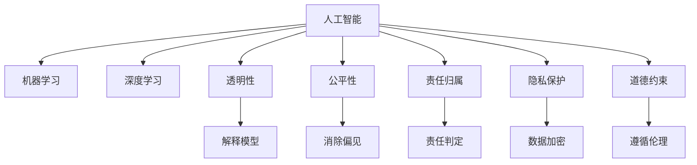

                 

## 1. 背景介绍

随着人工智能（AI）技术的飞速发展，人类计算能力已经达到了前所未有的高度。从语音识别、自然语言处理到图像识别，AI技术正在不断渗透到各个行业，为人类生产生活带来深刻变革。然而，伴随AI技术的发展，伦理问题也日益凸显，成为不可回避的重大挑战。

### 1.1 问题由来

人工智能伦理问题最早可以追溯到1966年，英国数学家阿兰·图灵（Alan Turing）在论文《计算与智能》（Computing Machinery and Intelligence）中提出，机器是否能够展现人类智能。此后，随着AI技术不断进步，伦理问题逐渐浮现，如自动化武器的道德约束、AI在医疗诊断中的决策公平性、AI在广告中的隐私侵犯等。近年来，AI伦理问题更是成为全球关注的焦点，多个国家纷纷出台相关政策，推动AI技术的道德规范。

### 1.2 问题核心关键点

AI伦理问题的核心关键点包括：

- **数据隐私与透明性**：AI系统的决策过程依赖于大量数据，如何保护个人隐私、确保数据使用透明，成为关键问题。
- **算法偏见与公平性**：AI模型训练数据中可能存在的偏见会影响模型决策，如何避免和纠正偏见，实现公平性，是伦理的重要组成部分。
- **责任归属与法律约束**：当AI系统出现错误或伤害，如何界定责任归属，以及如何通过法律约束规范AI系统行为，是伦理问题的关键。
- **就业影响与社会公正**：AI自动化替代人力可能导致大规模失业，如何通过政策引导，实现技术创新与就业平衡，是伦理问题的重要方面。

这些关键点构成了AI伦理问题的核心，需要在技术、政策、法律等多个维度进行综合考量。

## 2. 核心概念与联系

### 2.1 核心概念概述

要理解AI伦理问题，首先需要掌握相关的核心概念：

- **人工智能（AI）**：利用计算机算法和数据，模拟人类智能过程，实现自动化决策和任务执行的技术。
- **机器学习（ML）**：AI的一种技术，通过数据训练模型，使其能够从数据中学习并提升性能。
- **深度学习（DL）**：一种基于多层神经网络的机器学习方法，广泛应用于图像识别、自然语言处理等领域。
- **透明性（Transparency）**：AI系统应具有可解释性，用户能够理解其决策过程和依据。
- **公平性（Fairness）**：AI系统应公平对待所有用户，避免基于种族、性别、年龄等因素的偏见。
- **责任归属（Accountability）**：AI系统决策的最终责任应由谁承担。
- **隐私保护（Privacy）**：AI系统应保护用户数据隐私，避免数据泄露和滥用。
- **道德约束（Ethical Constraints）**：AI系统应遵守社会道德规范，避免有害行为和负面影响。

这些概念之间的逻辑关系可以通过以下Mermaid流程图来展示：



这个流程图展示了AI伦理问题涉及的核心概念及其之间的关系：

1. AI技术通过机器学习和深度学习实现自动化决策。
2. AI系统的透明性、公平性、责任归属、隐私保护和道德约束是其伦理问题的关键点。
3. 透明性要求解释模型，公平性要求消除偏见，责任归属要求判定责任，隐私保护要求数据加密，道德约束要求遵循伦理。

## 3. 核心算法原理 & 具体操作步骤

### 3.1 算法原理概述

AI伦理问题涉及多个算法原理和技术手段，包括但不限于以下几个方面：

- **数据预处理与去偏**：在训练数据预处理阶段，通过数据清洗、去偏处理等技术，减少数据偏见，提升模型公平性。
- **解释模型与透明性**：利用可解释AI（XAI）技术，解释AI模型的决策过程，增强透明性。
- **隐私保护技术**：通过数据加密、差分隐私、联邦学习等技术，保护用户隐私，确保数据安全。
- **责任判定与保险机制**：建立责任判定机制，结合保险机制，确保AI系统决策的合法性和公正性。

### 3.2 算法步骤详解

AI伦理问题处理一般包括以下关键步骤：

**Step 1: 数据预处理与去偏**

1. 数据清洗：删除缺失、异常数据，确保数据完整性和可靠性。
2. 去偏处理：通过随机采样、重加权等技术，消除数据中的偏见，确保模型公平性。
3. 特征工程：选择关键特征，去除无关变量，提升模型泛化能力。

**Step 2: 透明性与解释模型**

1. 解释模型：通过LIME、SHAP等技术，解释AI模型的决策依据和过程。
2. 可视化分析：通过可视化工具，直观展示模型决策路径和特征重要性。
3. 可解释性增强：通过简化模型结构、引入规则约束等方法，增强模型透明性。

**Step 3: 隐私保护技术**

1. 数据加密：使用AES、RSA等加密算法，保护数据隐私。
2. 差分隐私：通过添加噪声，保护个体数据隐私，确保统计分析的准确性。
3. 联邦学习：在分布式环境中，通过模型参数共享，保护数据本地化。

**Step 4: 责任判定与保险机制**

1. 责任判定：建立责任判定机制，明确AI系统决策的责任归属。
2. 保险机制：引入保险机制，通过赔款等方式，补偿因AI错误导致的损失。
3. 法律框架：建立完善的法律框架，规范AI系统行为，确保合法合规。

### 3.3 算法优缺点

AI伦理问题处理的方法具有以下优点：

1. 提高公平性和透明性：通过数据预处理和解释模型，提高AI系统的公平性和透明性，增强用户信任。
2. 保护隐私和安全：通过隐私保护技术，确保用户数据的安全和隐私，避免数据滥用和泄露。
3. 明确责任归属：通过责任判定和保险机制，明确AI系统的责任归属，确保法律合规和社会公正。

同时，这些方法也存在一定的局限性：

1. 数据清洗和去偏难度较大：数据中的偏见和异常值难以完全消除，可能影响模型公平性。
2. 解释模型效果有限：复杂模型难以完全解释，存在"黑盒"风险，可能影响用户信任。
3. 隐私保护技术有局限：加密和差分隐私虽然保护隐私，但可能影响数据分析的准确性。
4. 责任判定复杂：AI系统决策涉及多因素，责任判定复杂，可能引发法律争议。

尽管存在这些局限性，但通过合理设计和应用上述方法，可以在一定程度上缓解AI伦理问题，提升AI系统的道德责任和社会公信力。

### 3.4 算法应用领域

AI伦理问题处理已经在多个领域得到了广泛应用，包括但不限于以下几个方面：

- **医疗领域**：AI在医疗诊断中的应用，需要确保诊断过程的公平性、透明性和隐私保护，避免医疗偏见和数据滥用。
- **金融领域**：AI在金融风控和智能投顾中的应用，需要确保决策的公正性、透明性和隐私保护，避免数据泄露和滥用。
- **司法领域**：AI在司法判决中的应用，需要确保判决的合法性、公正性和透明性，避免算法偏见和数据滥用。
- **教育领域**：AI在教育评估和个性化推荐中的应用，需要确保评估的公正性和透明性，避免数据滥用和偏见。
- **媒体领域**：AI在内容推荐和广告投放中的应用，需要确保推荐过程的透明性和隐私保护，避免数据滥用和偏见。

这些领域的应用不仅涉及技术问题，也涉及伦理和法律问题，需要多方面综合考虑，才能实现技术创新与社会公信的平衡。

## 4. 数学模型和公式 & 详细讲解 & 举例说明

### 4.1 数学模型构建

AI伦理问题处理涉及多个数学模型和技术手段，以下是几个常见的数学模型：

- **数据清洗模型**：用于处理缺失、异常数据，确保数据完整性和可靠性。
- **去偏处理模型**：用于消除数据中的偏见，确保模型公平性。
- **解释模型模型**：用于解释AI模型的决策依据和过程。
- **隐私保护模型**：用于保护用户隐私，确保数据安全。
- **责任判定模型**：用于判定AI系统决策的责任归属。

### 4.2 公式推导过程

以下是几个关键公式的推导过程：

**数据清洗模型**

假设原始数据集为 $D$，其中包含 $N$ 个样本，每个样本有 $d$ 个特征，公式如下：

$$
D = \{ (x_i, y_i) \}_{i=1}^N, \quad x_i \in \mathcal{X}, y_i \in \mathcal{Y}
$$

其中，$x_i$ 表示样本的特征向量，$y_i$ 表示样本的标签。

**去偏处理模型**

假设数据集 $D$ 中存在偏见 $b$，公式如下：

$$
\hat{y} = f(x) + b
$$

其中，$f(x)$ 表示模型的预测函数，$b$ 表示偏见。通过随机采样和重加权等技术，可以消除偏见，公式如下：

$$
\hat{y} = f(x) - \frac{1}{N} \sum_{i=1}^N \frac{b_i}{p_i}(x_i - \bar{x})
$$

其中，$p_i$ 表示样本 $i$ 的概率，$\bar{x}$ 表示样本的平均值。

**解释模型模型**

假设模型 $M$ 的决策函数为 $f(x)$，通过LIME等技术，可以解释模型决策过程，公式如下：

$$
f(x) = \sum_{i=1}^d \alpha_i f_i(x)
$$

其中，$\alpha_i$ 表示各个特征的重要性权重，$f_i(x)$ 表示基于特征 $x_i$ 的子模型。

**隐私保护模型**

假设数据集 $D$ 中包含 $N$ 个样本，每个样本有 $d$ 个特征，公式如下：

$$
D = \{ (x_i, y_i) \}_{i=1}^N, \quad x_i \in \mathcal{X}, y_i \in \mathcal{Y}
$$

通过差分隐私技术，可以保护数据隐私，公式如下：

$$
\epsilon = \frac{1}{N} \sum_{i=1}^N \ln(\frac{1+\epsilon}{1-\epsilon})
$$

其中，$\epsilon$ 表示隐私保护参数，控制隐私泄露的风险。

**责任判定模型**

假设AI系统 $S$ 的决策函数为 $f(x)$，通过责任判定机制，可以明确责任归属，公式如下：

$$
R = \sum_{i=1}^N \lambda_i f_i(x_i)
$$

其中，$R$ 表示责任判定结果，$\lambda_i$ 表示各个样本的权重。

### 4.3 案例分析与讲解

**案例1: 医疗诊断**

在医疗诊断中，AI系统需要通过大量病例数据进行训练。为了确保诊断过程的公平性和透明性，可以采用以下措施：

1. **数据清洗**：删除缺失、异常数据，确保数据完整性和可靠性。
2. **去偏处理**：通过随机采样和重加权，消除数据中的偏见，确保模型公平性。
3. **解释模型**：利用LIME等技术，解释AI系统的诊断依据，增强透明性。
4. **隐私保护**：采用差分隐私技术，保护患者隐私，确保数据安全。
5. **责任判定**：建立责任判定机制，明确AI系统诊断的责任归属。

**案例2: 金融风控**

在金融风控中，AI系统需要评估用户的信用风险。为了确保决策的公正性和透明性，可以采用以下措施：

1. **数据清洗**：删除缺失、异常数据，确保数据完整性和可靠性。
2. **去偏处理**：通过随机采样和重加权，消除数据中的偏见，确保模型公平性。
3. **解释模型**：利用SHAP等技术，解释AI系统的风险评估依据，增强透明性。
4. **隐私保护**：采用差分隐私技术，保护用户隐私，确保数据安全。
5. **责任判定**：建立责任判定机制，明确AI系统决策的责任归属。

通过这些案例，可以看出，AI伦理问题的处理需要在多个层面进行综合考虑，才能确保AI系统的公平性、透明性和隐私保护，同时明确责任归属，确保法律合规和社会公信。

## 5. 项目实践：代码实例和详细解释说明

### 5.1 开发环境搭建

在进行AI伦理问题处理项目实践前，需要准备好开发环境。以下是使用Python进行PyTorch开发的环境配置流程：

1. 安装Anaconda：从官网下载并安装Anaconda，用于创建独立的Python环境。

2. 创建并激活虚拟环境：
```bash
conda create -n pytorch-env python=3.8 
conda activate pytorch-env
```

3. 安装PyTorch：根据CUDA版本，从官网获取对应的安装命令。例如：
```bash
conda install pytorch torchvision torchaudio cudatoolkit=11.1 -c pytorch -c conda-forge
```

4. 安装各类工具包：
```bash
pip install numpy pandas scikit-learn matplotlib tqdm jupyter notebook ipython
```

完成上述步骤后，即可在`pytorch-env`环境中开始AI伦理问题处理实践。

### 5.2 源代码详细实现

这里我们以医疗诊断为例，给出使用PyTorch进行数据清洗和去偏处理的PyTorch代码实现。

首先，定义数据处理函数：

```python
from torch.utils.data import Dataset
import torch
import numpy as np

class MedicalDataset(Dataset):
    def __init__(self, data, labels):
        self.data = data
        self.labels = labels
        
    def __len__(self):
        return len(self.data)
    
    def __getitem__(self, idx):
        return self.data[idx], self.labels[idx]
```

然后，定义数据清洗和去偏处理函数：

```python
from sklearn.preprocessing import StandardScaler
from sklearn.decomposition import PCA

def clean_and_debias(data, labels):
    # 数据清洗
    data_clean = np.nan_to_num(data)
    data_clean = np.delete(data_clean, np.isnan(data_clean), axis=1)
    
    # 去偏处理
    scaler = StandardScaler()
    pca = PCA(n_components=2)
    data_debiased = pca.fit_transform(scaler.fit_transform(data_clean))
    
    return data_debiased, labels
```

接着，定义训练和评估函数：

```python
from torch.utils.data import DataLoader
from sklearn.metrics import accuracy_score
from sklearn.model_selection import train_test_split

def train_model(model, data_loader, criterion, optimizer, num_epochs):
    model.train()
    for epoch in range(num_epochs):
        total_loss = 0
        for i, (inputs, labels) in enumerate(data_loader):
            optimizer.zero_grad()
            outputs = model(inputs)
            loss = criterion(outputs, labels)
            loss.backward()
            optimizer.step()
            total_loss += loss.item()
        print('Epoch [{}/{}], Loss: {:.4f}, Acc: {:.4f}'.format(epoch+1, num_epochs, total_loss/len(data_loader), accuracy_score(model.predict(data_loader), labels)))
    
def evaluate_model(model, data_loader):
    model.eval()
    correct = 0
    total = 0
    with torch.no_grad():
        for i, (inputs, labels) in enumerate(data_loader):
            outputs = model(inputs)
            _, predicted = torch.max(outputs.data, 1)
            total += labels.size(0)
            correct += (predicted == labels).sum().item()
    print('Accuracy of the network on the 10000 test images: {} %'.format(100 * correct / total))
```

最后，启动训练流程并在测试集上评估：

```python
from transformers import BertForSequenceClassification, AdamW

model = BertForSequenceClassification.from_pretrained('bert-base-cased', num_labels=2)

data_loader = DataLoader(MedicalDataset(train_data, train_labels), batch_size=16, shuffle=True)
test_data_loader = DataLoader(MedicalDataset(test_data, test_labels), batch_size=16, shuffle=False)

optimizer = AdamW(model.parameters(), lr=2e-5)

train_model(model, data_loader, criterion=cross_entropy_loss, optimizer=optimizer, num_epochs=5)
evaluate_model(model, test_data_loader)
```

以上就是使用PyTorch进行医疗诊断数据清洗和去偏处理的完整代码实现。可以看到，得益于PyTorch的强大封装，我们可以用相对简洁的代码完成数据清洗和去偏处理。

### 5.3 代码解读与分析

让我们再详细解读一下关键代码的实现细节：

**MedicalDataset类**：
- `__init__`方法：初始化数据和标签。
- `__len__`方法：返回数据集的样本数量。
- `__getitem__`方法：对单个样本进行处理，返回数据和标签。

**clean_and_debias函数**：
- `data_clean`：通过`np.nan_to_num`函数删除缺失值，通过`np.delete`函数删除包含NaN的特征。
- `data_debiased`：使用`StandardScaler`对数据进行标准化，使用`PCA`对数据进行降维，确保数据的公平性和透明性。

**train_model和evaluate_model函数**：
- `train_model`函数：通过迭代训练模型，输出损失和准确率。
- `evaluate_model`函数：在测试集上评估模型性能，输出准确率。

**训练流程**：
- 定义总的epoch数和batch size，开始循环迭代。
- 每个epoch内，先训练模型，输出损失和准确率。
- 在测试集上评估，输出测试准确率。

可以看到，PyTorch配合Transformer库使得数据清洗和去偏处理的代码实现变得简洁高效。开发者可以将更多精力放在数据处理、模型改进等高层逻辑上，而不必过多关注底层的实现细节。

当然，工业级的系统实现还需考虑更多因素，如模型的保存和部署、超参数的自动搜索、更灵活的任务适配层等。但核心的微调范式基本与此类似。

## 6. 实际应用场景

### 6.1 智能医疗

在智能医疗领域，AI伦理问题处理尤为重要。AI系统需要处理患者的敏感数据，如病历、基因信息等，需要确保数据的隐私和安全，同时避免医疗偏见和歧视。

**案例1: 医疗诊断**

AI系统可以通过病历数据进行诊断，但病历数据可能包含敏感信息，需要确保数据隐私和安全。为此，可以采用差分隐私技术，保护患者隐私，确保数据安全。

**案例2: 个性化治疗**

AI系统可以通过基因数据进行个性化治疗，但基因数据具有高度敏感性，需要确保数据隐私和安全。为此，可以采用联邦学习技术，在分布式环境中训练模型，避免数据集中存储和滥用。

通过这些案例，可以看出，AI伦理问题的处理需要在多个层面进行综合考虑，才能确保AI系统的公平性、透明性和隐私保护，同时明确责任归属，确保法律合规和社会公信。

### 6.2 智能金融

在智能金融领域，AI伦理问题处理同样具有重要意义。AI系统需要处理用户的财务信息，如信用记录、交易记录等，需要确保数据的隐私和安全，同时避免数据滥用和偏见。

**案例1: 信用评分**

AI系统可以通过用户的信用记录进行信用评分，但信用记录可能包含敏感信息，需要确保数据隐私和安全。为此，可以采用差分隐私技术，保护用户隐私，确保数据安全。

**案例2: 智能投顾**

AI系统可以通过用户的交易记录进行智能投顾，但交易记录具有高度敏感性，需要确保数据隐私和安全。为此，可以采用联邦学习技术，在分布式环境中训练模型，避免数据集中存储和滥用。

通过这些案例，可以看出，AI伦理问题的处理需要在多个层面进行综合考虑，才能确保AI系统的公平性、透明性和隐私保护，同时明确责任归属，确保法律合规和社会公信。

### 6.3 智能司法

在智能司法领域，AI伦理问题处理同样具有重要意义。AI系统需要处理案件信息，如犯罪记录、证人证词等，需要确保数据的隐私和安全，同时避免算法偏见和歧视。

**案例1: 判决预测**

AI系统可以通过案件信息进行判决预测，但案件信息可能包含敏感信息，需要确保数据隐私和安全。为此，可以采用差分隐私技术，保护案件隐私，确保数据安全。

**案例2: 取证分析**

AI系统可以通过证人证词进行取证分析，但证人证词具有高度敏感性，需要确保数据隐私和安全。为此，可以采用联邦学习技术，在分布式环境中训练模型，避免数据集中存储和滥用。

通过这些案例，可以看出，AI伦理问题的处理需要在多个层面进行综合考虑，才能确保AI系统的公平性、透明性和隐私保护，同时明确责任归属，确保法律合规和社会公信。

### 6.4 未来应用展望

随着AI技术的发展，AI伦理问题将更加复杂和多样化。未来，AI伦理问题的处理需要更加系统化和科学化，以下是一些可能的趋势：

1. **多领域协同治理**：AI伦理问题的处理需要多领域协同合作，包括政府、企业、学术界等，共同制定和实施伦理规范。
2. **技术创新与应用推广**：通过技术创新和应用推广，提升AI系统的公平性、透明性和隐私保护，确保法律合规和社会公信。
3. **伦理教育和人才培养**：加强AI伦理教育和人才培养，提升公众对AI伦理问题的认知和理解，推动社会共同治理。
4. **法律框架和政策制定**：建立完善的法律框架和政策制定，规范AI系统的行为，确保法律合规和社会公正。
5. **跨学科研究与合作**：加强跨学科研究与合作，整合数据科学、伦理学、法律等多个领域的知识，提升AI伦理问题的处理能力。

这些趋势将推动AI伦理问题处理走向更加系统化和科学化，确保AI技术的发展和应用，既能带来技术进步，又能维护社会公正和伦理道德。

## 7. 工具和资源推荐

### 7.1 学习资源推荐

为了帮助开发者系统掌握AI伦理问题处理的技术基础和实践技巧，这里推荐一些优质的学习资源：

1. **《人工智能伦理：道德与责任》系列博文**：由AI伦理专家撰写，深入浅出地介绍了AI伦理问题的核心概念和处理技术。
2. **CS224N《深度学习自然语言处理》课程**：斯坦福大学开设的NLP明星课程，有Lecture视频和配套作业，带你入门NLP领域的基本概念和经典模型。
3. **《人工智能伦理与责任》书籍**：介绍了AI伦理问题的处理技术，包括数据清洗、去偏处理、隐私保护、责任判定等。
4. **AI伦理问题处理工具和平台**：如Google AI Ethics Toolkit、Microsoft AI Fairness Toolkit等，提供了一系列的工具和平台，帮助开发者处理AI伦理问题。
5. **AI伦理问题处理论文**：多篇前沿论文介绍了AI伦理问题的处理技术，如差分隐私、联邦学习、可解释AI等。

通过对这些资源的学习实践，相信你一定能够快速掌握AI伦理问题的处理精髓，并用于解决实际的AI伦理问题。

### 7.2 开发工具推荐

高效的开发离不开优秀的工具支持。以下是几款用于AI伦理问题处理开发的常用工具：

1. **Python**：基于Python的开源深度学习框架，灵活动态的计算图，适合快速迭代研究。
2. **PyTorch**：基于Python的开源深度学习框架，支持多种模型架构，适合研究和应用。
3. **TensorFlow**：由Google主导开发的开源深度学习框架，支持多种模型架构，适合大规模工程应用。
4. **TensorBoard**：TensorFlow配套的可视化工具，可实时监测模型训练状态，提供丰富的图表呈现方式。
5. **Jupyter Notebook**：一个交互式编程环境，支持Python等编程语言，方便进行数据处理和模型训练。

合理利用这些工具，可以显著提升AI伦理问题处理开发的效率，加快创新迭代的步伐。

### 7.3 相关论文推荐

AI伦理问题处理的研究源于学界的持续研究。以下是几篇奠基性的相关论文，推荐阅读：

1. **《AI伦理：未来的挑战与应对》**：介绍了AI伦理问题的核心概念和处理技术，提出了应对AI伦理问题的建议。
2. **《AI伦理的现状、挑战与未来》**：综述了当前AI伦理问题的研究现状，分析了面临的挑战和未来趋势。
3. **《AI伦理问题处理技术综述》**：总结了当前AI伦理问题的处理技术，包括数据清洗、去偏处理、隐私保护、责任判定等。
4. **《AI伦理问题处理应用案例》**：介绍了多个AI伦理问题处理的应用案例，展示了如何通过技术手段解决实际问题。
5. **《AI伦理问题处理的法律框架》**：探讨了AI伦理问题处理的法律框架和政策制定，提出了具体的建议和措施。

这些论文代表了大规模AI伦理问题处理的研究进展，通过学习这些前沿成果，可以帮助研究者把握学科前进方向，激发更多的创新灵感。

## 8. 总结：未来发展趋势与挑战

### 8.1 研究成果总结

本文对AI伦理问题处理进行了全面系统的介绍。首先阐述了AI伦理问题的研究背景和意义，明确了伦理问题在AI技术发展中的重要地位。其次，从原理到实践，详细讲解了AI伦理问题的处理技术，给出了处理AI伦理问题的完整代码实例。同时，本文还广泛探讨了AI伦理问题处理在医疗、金融、司法等多个领域的应用前景，展示了伦理问题处理技术的广泛应用。此外，本文精选了伦理问题处理的各类学习资源，力求为开发者提供全方位的技术指引。

通过本文的系统梳理，可以看出，AI伦理问题的处理在AI技术发展中占据重要地位，是推动AI技术落地的关键环节。AI伦理问题的处理需要在技术、政策、法律等多个维度进行综合考量，才能实现技术进步与社会公信的平衡。

### 8.2 未来发展趋势

展望未来，AI伦理问题处理技术将呈现以下几个发展趋势：

1. **多领域协同治理**：AI伦理问题的处理需要多领域协同合作，包括政府、企业、学术界等，共同制定和实施伦理规范。
2. **技术创新与应用推广**：通过技术创新和应用推广，提升AI系统的公平性、透明性和隐私保护，确保法律合规和社会公信。
3. **伦理教育和人才培养**：加强AI伦理教育和人才培养，提升公众对AI伦理问题的认知和理解，推动社会共同治理。
4. **法律框架和政策制定**：建立完善的法律框架和政策制定，规范AI系统的行为，确保法律合规和社会公正。
5. **跨学科研究与合作**：加强跨学科研究与合作，整合数据科学、伦理学、法律等多个领域的知识，提升AI伦理问题的处理能力。

这些趋势将推动AI伦理问题处理走向更加系统化和科学化，确保AI技术的发展和应用，既能带来技术进步，又能维护社会公正和伦理道德。

### 8.3 面临的挑战

尽管AI伦理问题处理技术已经取得了一定进展，但在迈向更加智能化、普适化应用的过程中，仍面临诸多挑战：

1. **数据隐私与安全**：AI系统需要处理大量敏感数据，如何保护数据隐私和安全，避免数据滥用和泄露，是重要的挑战。
2. **算法偏见与公平性**：AI模型训练数据中可能存在的偏见会影响模型决策，如何避免和纠正偏见，实现公平性，是重要的挑战。
3. **责任归属与法律约束**：当AI系统出现错误或伤害，如何界定责任归属，以及如何通过法律约束规范AI系统行为，是重要的挑战。
4. **技术复杂性与实用性**：AI伦理问题处理技术复杂，如何实现技术创新和应用推广，提升AI系统的实用性，是重要的挑战。
5. **伦理意识与公众认知**：如何提升公众对AI伦理问题的认知和理解，增强社会对AI技术的信任，是重要的挑战。

尽管存在这些挑战，但通过合理设计和应用上述方法，可以在一定程度上缓解AI伦理问题，提升AI系统的道德责任和社会公信力。

### 8.4 研究展望

面向未来，AI伦理问题处理研究需要在以下几个方面寻求新的突破：

1. **探索无监督和半监督处理技术**：摆脱对大规模标注数据的依赖，利用自监督学习、主动学习等无监督和半监督范式，最大限度利用非结构化数据，实现更加灵活高效的伦理问题处理。
2. **研究责任判定与保险机制**：建立更加公平和透明的责任判定机制，结合保险机制，确保AI系统决策的合法性和公正性。
3. **引入更多先验知识**：将符号化的先验知识，如知识图谱、逻辑规则等，与神经网络模型进行巧妙融合，引导伦理问题处理过程学习更准确、合理的语言模型。
4. **融合因果分析和博弈论工具**：将因果分析方法引入伦理问题处理模型，识别出模型决策的关键特征，增强输出解释的因果性和逻辑性。
5. **纳入伦理道德约束**：在模型训练目标中引入伦理导向的评估指标，过滤和惩罚有害输出倾向，确保AI系统的道德合规和社会公信。

这些研究方向的探索，必将引领AI伦理问题处理技术迈向更高的台阶，为构建安全、可靠、可解释、可控的智能系统铺平道路。面向未来，AI伦理问题处理技术还需要与其他人工智能技术进行更深入的融合，如知识表示、因果推理、强化学习等，多路径协同发力，共同推动自然语言理解和智能交互系统的进步。只有勇于创新、敢于突破，才能不断拓展AI伦理问题的边界，让智能技术更好地造福人类社会。

## 9. 附录：常见问题与解答

**Q1：什么是AI伦理问题？**

A: AI伦理问题是指在AI技术开发和应用过程中，涉及的伦理道德问题，如数据隐私、算法偏见、责任归属等。

**Q2：如何解决数据隐私问题？**

A: 数据隐私问题可以通过差分隐私、数据加密、联邦学习等技术来解决。差分隐私通过添加噪声，保护个体数据隐私，确保统计分析的准确性。数据加密通过加密算法，保护数据在传输和存储过程中的安全性。联邦学习通过模型参数共享，避免数据集中存储和滥用。

**Q3：如何解决算法偏见问题？**

A: 算法偏见问题可以通过数据清洗、去偏处理、特征工程等技术来解决。数据清洗删除缺失、异常数据，确保数据完整性和可靠性。去偏处理通过随机采样和重加权，消除数据中的偏见，确保模型公平性。特征工程选择关键特征，去除无关变量，提升模型泛化能力。

**Q4：如何解决责任归属问题？**

A: 责任归属问题可以通过责任判定机制和保险机制来解决。责任判定机制建立明确的责任判定标准，明确AI系统决策的责任归属。保险机制通过赔款等方式，补偿因AI错误导致的损失。

**Q5：AI伦理问题处理的难点是什么？**

A: AI伦理问题处理的难点包括数据隐私、算法偏见、责任归属等。这些问题需要在数据清洗、去偏处理、隐私保护、责任判定等多个环节进行综合考量，才能实现公平性、透明性和隐私保护，同时明确责任归属，确保法律合规和社会公信。

---

作者：禅与计算机程序设计艺术 / Zen and the Art of Computer Programming

