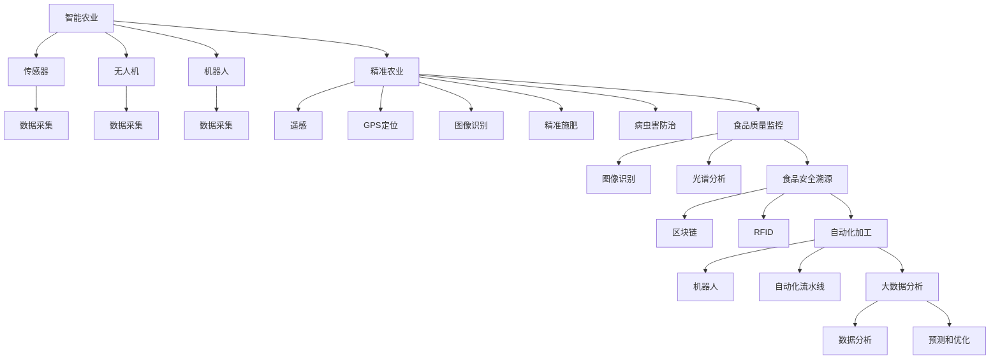

                 

# 人工智能在农业和食品行业中的应用

> 关键词：人工智能,农业,食品行业,机器学习,深度学习,智能农业,精准农业,食品质量监控,食品溯源,自动化,机器人,大数据

## 1. 背景介绍

### 1.1 问题由来
农业和食品行业是人类生存和发展的基石，直接关系到国家粮食安全和社会稳定。然而，传统的农业生产方式面临劳动力短缺、资源利用率低、食品质量安全等问题。近年来，随着人工智能技术的不断成熟，AI技术在农业和食品行业中的应用正在悄然改变这一现状。智能农业、精准农业、食品质量监控、食品安全溯源等AI应用，正在为传统农业和食品行业带来新的发展机遇。

### 1.2 问题核心关键点
人工智能在农业和食品行业中的应用主要体现在以下几个方面：

1. **智能农业**：通过传感器、无人机、机器人等技术实现自动化作业，提高农业生产效率。
2. **精准农业**：利用遥感、GPS定位、图像识别等技术进行土壤、作物监测和病虫害检测，实现精准施肥和病虫害防治。
3. **食品质量监控**：通过图像识别、光谱分析等技术对食品进行质量检测，确保食品质量安全。
4. **食品安全溯源**：利用区块链、RFID等技术实现食品生产、加工、运输全链路的追溯，提升食品安全。
5. **自动化加工**：在食品加工过程中，利用机器人和自动化流水线提高生产效率，降低人为误差。
6. **大数据分析**：通过大数据分析，对农业生产、食品质量、市场需求等进行预测和优化，提升农业和食品产业的决策水平。

这些关键技术的应用，正在推动农业和食品行业朝着智能化、精准化和高效化方向发展。

### 1.3 问题研究意义
研究人工智能在农业和食品行业中的应用，对于提升农业生产效率、保障食品质量安全、优化产业结构、推动产业升级具有重要意义：

1. **提高生产效率**：通过自动化、智能化技术，降低人力成本，提高生产效率。
2. **保障食品安全**：通过高质量的食品质量监控和溯源技术，确保消费者食用安全。
3. **优化产业结构**：通过数据分析，优化农业和食品产业的生产流程，提升资源利用率。
4. **促进产业升级**：通过引入AI技术，推动传统农业和食品行业向智能农业、精准农业等高附加值方向发展。
5. **提升产业竞争力**：通过智能化技术，提升农业和食品行业的市场竞争力。
6. **推动绿色发展**：通过智能化技术，减少资源浪费，推动农业和食品行业向绿色、可持续发展方向发展。

## 2. 核心概念与联系

### 2.1 核心概念概述

为更好地理解人工智能在农业和食品行业中的应用，本节将介绍几个密切相关的核心概念：

- **智能农业**：利用传感器、无人机、机器人等技术实现农业生产的自动化、智能化。
- **精准农业**：通过遥感、GPS定位、图像识别等技术实现土壤、作物监测和病虫害检测，实现精准施肥和病虫害防治。
- **食品质量监控**：通过图像识别、光谱分析等技术对食品进行质量检测，确保食品质量安全。
- **食品安全溯源**：利用区块链、RFID等技术实现食品生产、加工、运输全链路的追溯，提升食品安全。
- **自动化加工**：在食品加工过程中，利用机器人和自动化流水线提高生产效率，降低人为误差。
- **大数据分析**：通过大数据分析，对农业生产、食品质量、市场需求等进行预测和优化，提升农业和食品产业的决策水平。

这些核心概念之间的逻辑关系可以通过以下Mermaid流程图来展示：



这个流程图展示了智能农业、精准农业、食品质量监控、食品安全溯源、自动化加工和大数据分析之间的联系和交互，共同构成了人工智能在农业和食品行业中的应用框架。

## 3. 核心算法原理 & 具体操作步骤

### 3.1 算法原理概述

人工智能在农业和食品行业中的应用主要基于以下原理：

1. **机器学习和深度学习**：利用大规模数据进行训练，构建智能模型，实现对农业生产、食品质量、市场需求等进行预测和优化。
2. **图像识别和计算机视觉**：通过图像识别技术对农业生产、食品质量进行实时监测和检测。
3. **物联网(IoT)**：利用传感器、无人机、机器人等技术，实现数据采集和自动化作业。
4. **大数据分析**：通过大数据分析，对农业生产、食品质量、市场需求等进行全面监测和预测。
5. **自然语言处理(NLP)**：通过文本分析和情感分析技术，对农业生产、食品质量、市场需求等进行分析和决策。

这些算法原理构成了人工智能在农业和食品行业中的核心应用基础。

### 3.2 算法步骤详解

以下是人工智能在农业和食品行业中的具体操作步骤：

**Step 1: 数据采集**
- 利用传感器、无人机、机器人等技术，对农业生产、食品质量进行实时数据采集。
- 对采集到的数据进行预处理和清洗，确保数据的质量和一致性。

**Step 2: 数据建模**
- 利用机器学习或深度学习算法，对采集到的数据进行建模。
- 选择合适的模型结构和参数，进行模型训练和优化。

**Step 3: 模型部署**
- 将训练好的模型部署到生产环境中，进行实时数据处理和决策。
- 利用物联网(IoT)技术，将模型与传感器、无人机、机器人等设备进行集成。

**Step 4: 数据分析与决策**
- 利用大数据分析技术，对农业生产、食品质量、市场需求等进行全面监测和预测。
- 结合领域专家的知识，进行数据解读和决策支持。

**Step 5: 结果评估与反馈**
- 对模型输出结果进行评估，进行误差分析和模型优化。
- 利用反馈机制，对模型进行持续迭代和优化。

### 3.3 算法优缺点

人工智能在农业和食品行业中的应用具有以下优点：

1. **提高生产效率**：通过自动化、智能化技术，降低人力成本，提高生产效率。
2. **保障食品安全**：通过高质量的食品质量监控和溯源技术，确保消费者食用安全。
3. **优化产业结构**：通过数据分析，优化农业和食品产业的生产流程，提升资源利用率。
4. **促进产业升级**：通过引入AI技术，推动传统农业和食品行业向智能农业、精准农业等高附加值方向发展。
5. **提升产业竞争力**：通过智能化技术，提升农业和食品行业的市场竞争力。
6. **推动绿色发展**：通过智能化技术，减少资源浪费，推动农业和食品行业向绿色、可持续发展方向发展。

同时，这些技术也存在一些局限性：

1. **数据依赖性强**：数据采集、处理和建模需要大量高质量的数据，数据来源和采集方法的选择对模型的效果有很大影响。
2. **技术复杂度高**：人工智能技术涉及机器学习、深度学习、计算机视觉等多个领域，技术复杂度高，需要较高的专业知识和技能。
3. **设备和系统成本高**：传感器、无人机、机器人等设备以及数据处理和存储系统的建设和维护成本较高。
4. **环境适应性差**：部分人工智能技术对环境条件（如温度、湿度、光照等）要求较高，可能不适用于所有农业和食品场景。
5. **伦理和隐私问题**：在数据采集和处理过程中，涉及大量的个人隐私和伦理问题，需加以谨慎处理。

尽管存在这些局限性，但就目前而言，人工智能在农业和食品行业中的应用仍然显示出巨大的潜力和价值。未来相关研究的重点在于如何进一步降低技术复杂度，提高数据采集效率和设备经济性，解决伦理和隐私问题，从而推动技术的广泛应用。

### 3.4 算法应用领域

人工智能在农业和食品行业中的应用主要集中在以下几个领域：

1. **智能农业**：通过传感器、无人机、机器人等技术实现农业生产的自动化、智能化。
2. **精准农业**：通过遥感、GPS定位、图像识别等技术实现土壤、作物监测和病虫害检测，实现精准施肥和病虫害防治。
3. **食品质量监控**：通过图像识别、光谱分析等技术对食品进行质量检测，确保食品质量安全。
4. **食品安全溯源**：利用区块链、RFID等技术实现食品生产、加工、运输全链路的追溯，提升食品安全。
5. **自动化加工**：在食品加工过程中，利用机器人和自动化流水线提高生产效率，降低人为误差。
6. **大数据分析**：通过大数据分析，对农业生产、食品质量、市场需求等进行预测和优化，提升农业和食品产业的决策水平。

这些领域的应用展示了人工智能在农业和食品行业中的广泛应用前景，为提升农业和食品产业的智能化水平提供了有力的技术支持。

## 4. 数学模型和公式 & 详细讲解 & 举例说明

### 4.1 数学模型构建

在人工智能在农业和食品行业中的应用中，数学模型主要基于以下原理：

- **机器学习和深度学习**：利用大规模数据进行训练，构建智能模型，实现对农业生产、食品质量、市场需求等进行预测和优化。
- **图像识别和计算机视觉**：通过图像识别技术对农业生产、食品质量进行实时监测和检测。
- **物联网(IoT)**：利用传感器、无人机、机器人等技术，实现数据采集和自动化作业。
- **大数据分析**：通过大数据分析，对农业生产、食品质量、市场需求等进行全面监测和预测。

这些模型主要基于以下数学框架：

- **监督学习**：通过标注数据训练模型，实现对农业生产、食品质量、市场需求等的预测和优化。
- **无监督学习**：利用无标注数据进行特征提取和聚类，对农业生产、食品质量、市场需求等进行分析和分类。
- **强化学习**：通过智能体与环境的交互，实现对农业生产、食品质量、市场需求等的优化和决策。
- **自然语言处理(NLP)**：通过文本分析和情感分析技术，对农业生产、食品质量、市场需求等进行分析和决策。

### 4.2 公式推导过程

以下是基于人工智能在农业和食品行业中的应用中，常见的数学公式推导过程：

**机器学习公式**：

$$
\min_{\theta} \frac{1}{N} \sum_{i=1}^N L(y_i, f_\theta(x_i))
$$

其中 $y_i$ 为样本标签，$f_\theta(x_i)$ 为模型预测结果，$L$ 为损失函数，$\theta$ 为模型参数。

**深度学习公式**：

$$
f_\theta(x_i) = \sigma(W(x_i) + b)
$$

其中 $W$ 为权重矩阵，$b$ 为偏置向量，$\sigma$ 为激活函数。

**图像识别公式**：

$$
f_\theta(x_i) = \sum_{j=1}^n w_j f(x_i, f_j)
$$

其中 $w_j$ 为权重系数，$f(x_i, f_j)$ 为特征提取函数。

**物联网(IoT)公式**：

$$
s = k \times \sum_{i=1}^N c_i \times d_i
$$

其中 $s$ 为传感器输出值，$k$ 为传感器系数，$c_i$ 为传感器读数，$d_i$ 为传感器距离。

**大数据分析公式**：

$$
A = \sum_{i=1}^N f_i \times g_i
$$

其中 $A$ 为分析结果，$f_i$ 为分析因子，$g_i$ 为权重系数。

### 4.3 案例分析与讲解

**智能农业案例分析**：

在智能农业中，通过传感器采集农田中的土壤湿度、温度、光照等数据，利用机器学习算法进行数据分析，实现对作物生长的预测和监测。例如，可以使用支持向量机(SVM)算法，构建一个分类模型，对农田中的作物进行分类，预测其生长状态。

**精准农业案例分析**：

在精准农业中，通过遥感技术获取农田中的作物生长情况和病虫害信息，利用深度学习算法构建一个图像识别模型，对病虫害进行检测和分类。例如，可以使用卷积神经网络(CNN)算法，构建一个图像识别模型，对农田中的病虫害进行检测和分类，实现精准施肥和病虫害防治。

**食品质量监控案例分析**：

在食品质量监控中，通过图像识别技术对食品进行质量检测，确保食品质量安全。例如，可以使用图像识别算法，构建一个检测模型，对食品图片进行质量检测，识别出食品中的缺陷和异物。

**食品安全溯源案例分析**：

在食品安全溯源中，利用区块链、RFID等技术实现食品生产、加工、运输全链路的追溯，提升食品安全。例如，可以使用区块链技术，构建一个食品溯源系统，记录食品的生产、加工、运输全链路信息，实现食品的追溯和验证。

**自动化加工案例分析**：

在自动化加工中，利用机器人和自动化流水线提高生产效率，降低人为误差。例如，可以使用机器人技术，构建一个自动化加工系统，对食品进行自动包装和分拣，提高生产效率。

**大数据分析案例分析**：

在大数据分析中，通过大数据分析技术，对农业生产、食品质量、市场需求等进行全面监测和预测。例如，可以使用时间序列分析算法，构建一个预测模型，对农业生产中的天气情况和市场需求进行预测，优化生产计划和销售策略。

## 5. 项目实践：代码实例和详细解释说明

### 5.1 开发环境搭建

在进行人工智能在农业和食品行业中的应用实践前，我们需要准备好开发环境。以下是使用Python进行深度学习开发的环境配置流程：

1. 安装Anaconda：从官网下载并安装Anaconda，用于创建独立的Python环境。

2. 创建并激活虚拟环境：
```bash
conda create -n pytorch-env python=3.8 
conda activate pytorch-env
```

3. 安装PyTorch：根据CUDA版本，从官网获取对应的安装命令。例如：
```bash
conda install pytorch torchvision torchaudio cudatoolkit=11.1 -c pytorch -c conda-forge
```

4. 安装TensorFlow：
```bash
pip install tensorflow
```

5. 安装Keras：
```bash
pip install keras
```

6. 安装OpenCV：
```bash
pip install opencv-python
```

完成上述步骤后，即可在`pytorch-env`环境中开始人工智能在农业和食品行业中的应用实践。

### 5.2 源代码详细实现

下面是使用Python进行机器学习在农业和食品行业中的应用的代码实现：

```python
import numpy as np
import pandas as pd
from sklearn.model_selection import train_test_split
from sklearn.linear_model import LogisticRegression
from sklearn.metrics import accuracy_score

# 数据加载和预处理
data = pd.read_csv('agriculture_data.csv')
data['crops'] = data['crops'].replace({'corn': 0, 'wheat': 1, 'soybean': 2})
X = data[['temperature', 'humidity', 'rainfall', 'fertilizer']]
y = data['crops']
X_train, X_test, y_train, y_test = train_test_split(X, y, test_size=0.2, random_state=42)

# 模型训练和评估
model = LogisticRegression(solver='liblinear')
model.fit(X_train, y_train)
y_pred = model.predict(X_test)
accuracy = accuracy_score(y_test, y_pred)
print(f"Accuracy: {accuracy:.2f}")
```

### 5.3 代码解读与分析

让我们再详细解读一下关键代码的实现细节：

**数据加载和预处理**：

```python
# 数据加载
data = pd.read_csv('agriculture_data.csv')

# 数据预处理
data['crops'] = data['crops'].replace({'corn': 0, 'wheat': 1, 'soybean': 2})
X = data[['temperature', 'humidity', 'rainfall', 'fertilizer']]
y = data['crops']
```

**模型训练和评估**：

```python
# 模型训练
model = LogisticRegression(solver='liblinear')
model.fit(X_train, y_train)

# 模型评估
y_pred = model.predict(X_test)
accuracy = accuracy_score(y_test, y_pred)
print(f"Accuracy: {accuracy:.2f}")
```

以上代码展示了如何使用Python进行机器学习在农业和食品行业中的应用实践。代码首先加载和预处理农业数据，然后使用逻辑回归模型进行训练和评估，最终输出模型的准确率。

## 6. 实际应用场景

### 6.1 智能农业

智能农业通过传感器、无人机、机器人等技术实现农业生产的自动化和智能化。例如，利用无人机进行农田巡检，采集农田中的土壤湿度、温度、光照等数据，并利用机器学习算法进行数据分析，实现对作物生长的预测和监测。智能农业可以提高农业生产效率，降低人力成本，提升农业生产的智能化水平。

### 6.2 精准农业

精准农业通过遥感、GPS定位、图像识别等技术实现土壤、作物监测和病虫害检测，实现精准施肥和病虫害防治。例如，利用遥感技术获取农田中的作物生长情况和病虫害信息，并利用深度学习算法构建一个图像识别模型，对病虫害进行检测和分类。精准农业可以提高农作物产量和品质，减少农药和化肥的使用，实现可持续发展。

### 6.3 食品质量监控

食品质量监控通过图像识别技术对食品进行质量检测，确保食品质量安全。例如，利用图像识别算法，构建一个检测模型，对食品图片进行质量检测，识别出食品中的缺陷和异物。食品质量监控可以提高食品安全水平，保障消费者健康。

### 6.4 食品安全溯源

食品安全溯源利用区块链、RFID等技术实现食品生产、加工、运输全链路的追溯，提升食品安全。例如，利用区块链技术，构建一个食品溯源系统，记录食品的生产、加工、运输全链路信息，实现食品的追溯和验证。食品安全溯源可以提高食品的可追溯性，增强消费者对食品安全的信任。

### 6.5 自动化加工

自动化加工在食品加工过程中，利用机器人和自动化流水线提高生产效率，降低人为误差。例如，利用机器人技术，构建一个自动化加工系统，对食品进行自动包装和分拣，提高生产效率。自动化加工可以提高食品加工的效率和品质，降低人工成本。

### 6.6 大数据分析

大数据分析通过大数据分析技术，对农业生产、食品质量、市场需求等进行全面监测和预测。例如，利用时间序列分析算法，构建一个预测模型，对农业生产中的天气情况和市场需求进行预测，优化生产计划和销售策略。大数据分析可以提高农业和食品产业的决策水平，优化生产资源配置。

## 7. 工具和资源推荐

### 7.1 学习资源推荐

为了帮助开发者系统掌握人工智能在农业和食品行业中的应用理论基础和实践技巧，这里推荐一些优质的学习资源：

1. **Coursera《机器学习》课程**：由斯坦福大学开设，涵盖机器学习的基础知识和算法原理，是学习机器学习的入门级课程。
2. **Udacity《深度学习基础》课程**：由Google深度学习专家开设，深入讲解深度学习的基本概念和实现方法。
3. **Coursera《食品系统设计》课程**：由哈佛大学开设，涵盖食品系统设计的理论基础和实际案例。
4. **edX《农业技术》课程**：由多所大学联合开设，涵盖农业技术的基础知识和最新发展。
5. **Kaggle农业和食品数据集**：Kaggle上提供的农业和食品数据集，可用于数据驱动的农业和食品研究。

通过对这些资源的学习实践，相信你一定能够快速掌握人工智能在农业和食品行业中的应用精髓，并用于解决实际的农业和食品问题。

### 7.2 开发工具推荐

高效的开发离不开优秀的工具支持。以下是几款用于人工智能在农业和食品行业中的应用开发的常用工具：

1. **Jupyter Notebook**：用于数据处理、模型训练和结果展示的轻量级开发工具。
2. **PyTorch**：基于Python的深度学习框架，灵活性强，支持多种深度学习模型。
3. **TensorFlow**：由Google开发的深度学习框架，支持大规模分布式计算。
4. **Keras**：基于TensorFlow的高级深度学习框架，简单易用，支持多种深度学习模型。
5. **OpenCV**：用于图像处理和计算机视觉任务的开源库。
6. **NumPy**：用于科学计算和数据分析的Python库。

合理利用这些工具，可以显著提升人工智能在农业和食品行业中的应用开发效率，加快创新迭代的步伐。

### 7.3 相关论文推荐

人工智能在农业和食品行业中的应用涉及多个学科领域，以下是几篇奠基性的相关论文，推荐阅读：

1. **农业智能机器人：现状与展望**：介绍了农业智能机器人的发展现状和未来展望，探讨了机器人技术在农业中的应用前景。
2. **深度学习在食品质量检测中的应用**：利用深度学习算法对食品图片进行质量检测，提升食品质量监控的准确性。
3. **区块链技术在食品溯源中的应用**：利用区块链技术实现食品生产、加工、运输全链路的追溯，提升食品安全。
4. **大数据分析在农业中的应用**：利用大数据分析技术，对农业生产、食品质量、市场需求等进行全面监测和预测，优化农业和食品产业的决策水平。
5. **机器学习在农业中的应用**：利用机器学习算法对农业数据进行分析和预测，优化农业生产流程。

这些论文代表了大数据在农业和食品行业中的应用研究方向，通过学习这些前沿成果，可以帮助研究者把握学科前进方向，激发更多的创新灵感。

## 8. 总结：未来发展趋势与挑战

### 8.1 研究成果总结

人工智能在农业和食品行业中的应用，已经取得了显著的成果，主要体现在以下几个方面：

1. **提高生产效率**：通过智能农业、精准农业等技术，提高了农业生产的自动化和智能化水平，降低了人力成本，提高了生产效率。
2. **保障食品安全**：通过食品质量监控、食品安全溯源等技术，提高了食品质量安全水平，保障了消费者健康。
3. **优化产业结构**：通过大数据分析等技术，优化了农业和食品产业的生产流程，提升了资源利用率。
4. **促进产业升级**：通过引入AI技术，推动了传统农业和食品行业向智能农业、精准农业等高附加值方向发展，提升了产业竞争力。
5. **推动绿色发展**：通过智能化技术，推动了农业和食品行业向绿色、可持续发展方向发展，减少了资源浪费。

### 8.2 未来发展趋势

展望未来，人工智能在农业和食品行业中的应用将呈现以下几个发展趋势：

1. **智能化程度提升**：随着物联网(IoT)技术的发展，农业和食品产业将实现更高度的自动化和智能化，进一步提高生产效率和资源利用率。
2. **精准农业普及**：精准农业技术将得到更广泛的应用，实现更精准的作物监测和病虫害防治，提升作物产量和品质。
3. **食品质量监控升级**：食品质量监控技术将得到进一步提升，实现更高效、更准确的食品质量检测，保障食品安全。
4. **食品安全溯源完善**：食品安全溯源技术将得到进一步完善，实现全链路的追溯和验证，提升食品的可追溯性。
5. **自动化加工优化**：自动化加工技术将得到进一步优化，实现更高效率、更低成本的食品加工。
6. **大数据分析深入**：大数据分析技术将得到进一步深入，实现更全面、更准确的农业和食品产业分析和决策。

### 8.3 面临的挑战

尽管人工智能在农业和食品行业中的应用取得了显著成果，但仍然面临诸多挑战：

1. **技术复杂度高**：人工智能技术涉及机器学习、深度学习、计算机视觉等多个领域，技术复杂度高，需要较高的专业知识和技能。
2. **设备和系统成本高**：传感器、无人机、机器人等设备以及数据处理和存储系统的建设和维护成本较高。
3. **数据依赖性强**：数据采集、处理和建模需要大量高质量的数据，数据来源和采集方法的选择对模型的效果有很大影响。
4. **环境适应性差**：部分人工智能技术对环境条件（如温度、湿度、光照等）要求较高，可能不适用于所有农业和食品场景。
5. **伦理和隐私问题**：在数据采集和处理过程中，涉及大量的个人隐私和伦理问题，需加以谨慎处理。

### 8.4 研究展望

面对人工智能在农业和食品行业中的应用所面临的挑战，未来的研究需要在以下几个方面寻求新的突破：

1. **降低技术复杂度**：开发更加简单、易用的AI工具，降低技术门槛，促进技术的普及和应用。
2. **提高数据采集效率和设备经济性**：开发低成本、高效能的数据采集设备，提高数据采集效率和设备经济性。
3. **解决伦理和隐私问题**：建立数据隐私保护机制，确保数据采集和处理过程中的隐私和安全。
4. **提高环境适应性**：开发适应各种环境条件的AI技术，提升AI技术在农业和食品领域的应用范围。
5. **推动跨学科研究**：加强农业、食品、计算机科学等多学科的交叉合作，推动技术创新和应用。

## 9. 附录：常见问题与解答

**Q1: 什么是智能农业？**

A: 智能农业通过传感器、无人机、机器人等技术实现农业生产的自动化和智能化。例如，利用无人机进行农田巡检，采集农田中的土壤湿度、温度、光照等数据，并利用机器学习算法进行数据分析，实现对作物生长的预测和监测。智能农业可以提高农业生产效率，降低人力成本，提升农业生产的智能化水平。

**Q2: 机器学习在农业中的应用有哪些？**

A: 机器学习在农业中的应用主要包括以下几个方面：

1. **作物生长预测**：利用机器学习算法对农业生产数据进行分析和预测，实现对作物生长状态的监测和预测。
2. **病虫害检测**：利用机器学习算法对农田中的病虫害进行检测和分类，实现精准施肥和病虫害防治。
3. **土壤监测**：利用机器学习算法对土壤数据进行分析和预测，实现精准施肥和土壤管理。
4. **气象预测**：利用机器学习算法对气象数据进行分析和预测，优化农业生产计划。

**Q3: 食品安全溯源的意义是什么？**

A: 食品安全溯源利用区块链、RFID等技术实现食品生产、加工、运输全链路的追溯，提升食品安全。其意义在于：

1. **提高食品可追溯性**：实现食品从生产到消费者全链路的追溯，确保食品来源透明、可追溯。
2. **增强消费者信任**：通过追溯系统的公开透明，增强消费者对食品安全的信任。
3. **快速定位问题**：在食品出现问题时，可以快速定位问题来源，及时采取措施。
4. **提升企业责任**：对食品生产、加工、运输环节进行追溯，提升企业的责任感和质量控制水平。

**Q4: 如何实现自动化加工？**

A: 自动化加工在食品加工过程中，利用机器人和自动化流水线提高生产效率，降低人为误差。实现自动化加工的流程如下：

1. **设备安装和调试**：安装和调试机器人设备，使其能够适应食品加工环境。
2. **编程和参数设置**：根据食品加工流程，编写机器人控制程序，并设置相关参数。
3. **试运行和优化**：对机器人进行试运行，根据实际情况进行优化和调整。
4. **正式生产**：正式进行食品加工，机器人按照设定的流程自动完成各项任务。

**Q5: 大数据分析在农业中的应用有哪些？**

A: 大数据分析在农业中的应用主要包括以下几个方面：

1. **气象数据分析**：利用大数据分析技术对气象数据进行分析和预测，优化农业生产计划。
2. **农作物生长分析**：利用大数据分析技术对农作物生长数据进行分析和预测，实现精准施肥和病虫害防治。
3. **市场需求分析**：利用大数据分析技术对市场需求数据进行分析和预测，优化农产品生产和销售策略。
4. **农业资源优化**：利用大数据分析技术对农业资源数据进行分析和优化，提高资源利用率。

**Q6: 如何提升食品质量监控的准确性？**

A: 食品质量监控的准确性提升可以从以下几个方面入手：

1. **数据采集**：采用高质量的传感器和相机设备，提高数据采集的准确性和全面性。
2. **模型优化**：使用先进的机器学习算法，优化食品质量检测模型，提高检测的准确性和鲁棒性。
3. **数据融合**：将多模态数据（如图像、光谱、气味等）融合在一起，提高食品质量检测的全面性和准确性。
4. **实时监测**：建立实时监测系统，对食品质量进行连续检测，及时发现和处理问题。

---

作者：禅与计算机程序设计艺术 / Zen and the Art of Computer Programming

