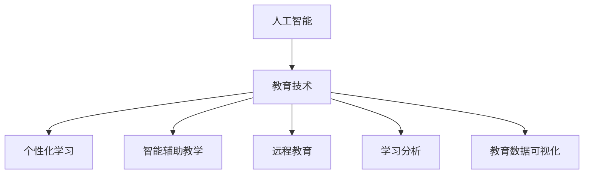

                 

# 人工智能：教育变革的催化剂

> 关键词：人工智能,教育变革,教育技术,个性化学习,智能辅助教学,远程教育

## 1. 背景介绍

### 1.1 问题由来
人工智能(AI)技术的迅速发展正在深刻改变各个领域，而教育作为人类文明传承的核心领域，也正面临着一场以AI为催化剂的变革。从教学内容的自动生成，到个性化学习路径的规划，再到智能辅助教学系统的构建，AI正在以前所未有的方式重塑教育的未来。

### 1.2 问题核心关键点
本节将介绍几个核心问题，并阐述其重要性和可能的解决方案。

1. **教育资源不均衡**：全球范围内，教育资源分布不均是一个长期存在的问题，AI技术有望通过智能化的方式，将优质教育资源触达更多的学生。
2. **个性化学习需求**：每个学生的学习能力和兴趣各不相同，AI能够根据学生的个性化数据，提供量身定制的学习方案。
3. **智能辅助教学**：AI可以辅助教师完成课堂管理和教学任务，如自动批改作业、智能答疑等。
4. **远程教育的普及**：新冠疫情期间，远程教育得到了前所未有的重视，AI在提升远程教育质量、增强师生互动方面具有巨大潜力。
5. **评估和反馈的精准化**：AI可以实时分析学生的学习状态和进度，提供精准的评估和反馈，帮助学生调整学习策略。

### 1.3 问题研究意义
AI在教育领域的应用，能够显著提高教学质量，扩大教育覆盖面，促进教育公平，提升学生的学习效果。通过AI技术，可以实现资源优化配置，教师教学效率的提升，以及学生的自主学习和个性化发展的支持，为教育变革提供了新的驱动力。

## 2. 核心概念与联系

### 2.1 核心概念概述

为更好地理解AI在教育中的应用，本节将介绍几个密切相关的核心概念：

- **人工智能**：通过计算机算法和数据，让机器模仿人类智能，实现问题求解、学习、推理等认知功能的技术。
- **教育技术**：利用信息技术手段，改善教育过程和教育结果的技术。
- **个性化学习**：根据学生的个体差异，提供符合其认知水平和兴趣爱好的学习内容和路径。
- **智能辅助教学**：利用AI技术辅助教师完成教学任务，提高教学效率和质量。
- **远程教育**：通过网络技术，实现异地教学和管理，使得教育资源能够跨越地理限制传播。
- **学习分析**：通过分析学习行为和结果数据，提供基于数据的教学决策支持。
- **教育数据可视化**：将教育数据以图表形式展示，直观展示学生的学习进度和效果。

这些核心概念之间的逻辑关系可以通过以下Mermaid流程图来展示：



这个流程图展示出人工智能在教育中扮演的核心角色，以及其与其他教育概念的联系。

## 3. 核心算法原理 & 具体操作步骤
### 3.1 算法原理概述

AI在教育中的核心算法原理主要包括以下几个方面：

1. **机器学习**：通过算法使计算机从数据中学习，并在未来数据中应用所学知识，优化学习过程。
2. **自然语言处理(NLP)**：使计算机能够理解和生成人类语言，广泛应用于智能答疑、自动化批改、情感分析等任务。
3. **计算机视觉**：使计算机能够识别和理解图像和视频内容，在虚拟教室、作业批改、实验模拟等领域具有广泛应用。
4. **强化学习**：通过试错训练，使机器在特定环境中逐步优化行为策略，在智能辅导系统中发挥重要作用。
5. **知识图谱**：构建实体和关系的知识网络，辅助AI在知识检索、推荐系统、智能辅导等领域应用。

### 3.2 算法步骤详解

AI在教育中的具体操作步骤包括以下几个关键步骤：

1. **数据采集与预处理**：收集学生的学习数据（如考试成绩、作业提交、课堂互动等），并对其进行清洗和标准化处理。
2. **特征提取与建模**：从处理后的数据中提取关键特征，并使用机器学习算法建立模型。
3. **模型训练与优化**：使用训练数据训练模型，并通过交叉验证等技术优化模型性能。
4. **模型部署与测试**：将训练好的模型部署到实际教育场景中，并进行测试和评估，确保其能够稳定运行。
5. **持续学习与更新**：根据新的数据和反馈，不断更新模型，提升其在实际应用中的表现。

### 3.3 算法优缺点

AI在教育中的应用具有以下优点：

1. **高效性**：自动化的数据处理和模型训练，节省了大量时间和人力成本。
2. **个性化**：能够根据学生的个性化需求，提供定制化的学习方案。
3. **即时反馈**：能够实时提供学习反馈，帮助学生及时调整学习策略。
4. **智能辅助**：通过智能系统辅助教学，减轻教师负担，提升教学效果。
5. **数据驱动**：基于数据的决策和评估，提高了教学决策的科学性和客观性。

同时，这些应用也存在一些局限性：

1. **数据隐私**：教育数据涉及学生的隐私，如何在保护隐私的前提下进行数据利用，是一大挑战。
2. **算法公平性**：AI算法可能存在偏见，需要在模型训练和应用中关注算法公平性问题。
3. **模型解释性**：一些AI模型如深度学习模型，其决策过程较为复杂，难以解释其内部工作机制。
4. **资源依赖**：AI系统的应用需要较高的计算资源和数据支持，对于一些资源有限的学校和地区，可能存在应用障碍。
5. **教师角色**：AI技术的应用需要教师的积极配合，如何平衡教师与AI的角色，是一个重要课题。

### 3.4 算法应用领域

AI在教育中的应用领域广泛，涵盖以下方面：

1. **个性化学习系统**：根据学生的学习数据，生成个性化的学习路径和推荐内容。
2. **智能答疑系统**：自动回答学生提出的问题，辅助教师教学。
3. **作业自动批改系统**：自动批改作业，并提供详细的批改反馈。
4. **虚拟教室**：利用VR和AR技术，构建虚拟教室，增强课堂互动和沉浸感。
5. **情感分析系统**：分析学生的情绪和行为，提供针对性的心理支持和学习策略。
6. **智能评估系统**：自动评估学生的学习效果，提供精准的评估报告。
7. **学习管理系统(LMS)**：集成多种AI功能，管理学生的学习进度和成绩。

## 4. 数学模型和公式 & 详细讲解  
### 4.1 数学模型构建

本节将使用数学语言对AI在教育中的应用进行更加严格的刻画。

假设学生的数据集为 $D=\{(x_i, y_i)\}_{i=1}^N$，其中 $x_i$ 为学生的学习行为数据（如做题时间、错误次数等），$y_i$ 为学生的学习效果数据（如考试成绩、进步率等）。

定义模型 $M$ 在数据样本 $(x,y)$ 上的损失函数为 $\ell(M(x),y)$，则在数据集 $D$ 上的经验风险为：

$$
\mathcal{L}(M) = \frac{1}{N} \sum_{i=1}^N \ell(M(x_i),y_i)
$$

在实际应用中，常用的损失函数包括均方误差损失、交叉熵损失等。

### 4.2 公式推导过程

以均方误差损失为例，假设模型 $M$ 在输入 $x$ 上的预测值为 $M(x)$，则均方误差损失为：

$$
\ell(M(x),y) = \frac{1}{2} (M(x) - y)^2
$$

其梯度为：

$$
\frac{\partial \ell(M(x),y)}{\partial M(x)} = M(x) - y
$$

将上述梯度带入模型参数的更新公式：

$$
M \leftarrow M - \eta \frac{\partial \ell(M(x),y)}{\partial M(x)}
$$

其中 $\eta$ 为学习率。

在实际应用中，通常使用反向传播算法计算梯度，并通过梯度下降等优化算法更新模型参数。

### 4.3 案例分析与讲解

**案例一：个性化学习系统**

假设有一个在线学习平台，记录了学生的学习行为和成绩数据，目标是根据这些数据生成个性化的学习路径。可以建立如下的机器学习模型：

- **输入**：学生的学习行为数据 $x$
- **输出**：推荐的学习内容 $y$

可以使用随机森林、决策树、深度学习等模型进行训练，并使用交叉验证等技术进行优化。

训练好的模型可以应用于实际场景，根据学生的当前学习状态，生成个性化的学习路径和推荐内容，以最大化学习效果。

**案例二：智能答疑系统**

假设有一个智能答疑系统，记录了学生提出的问题和系统给出的答案，目标是根据历史数据训练模型，预测学生可能提出的问题，并生成相应的答案。

可以建立如下的序列生成模型：

- **输入**：学生的历史问题 $x$
- **输出**：推荐的答案 $y$

可以使用循环神经网络(RNN)、长短时记忆网络(LSTM)、Transformer等模型进行训练，并使用交叉熵损失进行优化。

训练好的模型可以应用于实际场景，根据学生的当前问题，预测可能的后续问题，并生成相应的答案，以提高答疑效率和准确性。

## 5. 项目实践：代码实例和详细解释说明
### 5.1 开发环境搭建

在进行AI教育应用开发前，我们需要准备好开发环境。以下是使用Python进行TensorFlow开发的环境配置流程：

1. 安装Anaconda：从官网下载并安装Anaconda，用于创建独立的Python环境。

2. 创建并激活虚拟环境：
```bash
conda create -n tf-env python=3.8 
conda activate tf-env
```

3. 安装TensorFlow：根据CUDA版本，从官网获取对应的安装命令。例如：
```bash
conda install tensorflow -c conda-forge -c pytorch
```

4. 安装相关库：
```bash
pip install numpy pandas sklearn matplotlib tensorflow-hub
```

完成上述步骤后，即可在`tf-env`环境中开始AI教育应用开发。

### 5.2 源代码详细实现

下面我们以个性化学习系统为例，给出使用TensorFlow进行模型训练和预测的PyTorch代码实现。

```python
import tensorflow as tf
from tensorflow.keras import layers
from tensorflow.keras.optimizers import Adam

# 构建模型
model = tf.keras.Sequential([
    layers.Dense(64, activation='relu', input_shape=(3,)),
    layers.Dense(64, activation='relu'),
    layers.Dense(1)
])

# 编译模型
model.compile(optimizer=Adam(0.01), loss='mse')

# 训练模型
model.fit(train_data, train_labels, epochs=10, batch_size=32, validation_split=0.2)

# 预测新数据
predictions = model.predict(test_data)

# 可视化预测结果
import matplotlib.pyplot as plt
plt.scatter(test_data[:,0], test_labels)
plt.plot(test_data[:,0], predictions, color='red')
plt.show()
```

### 5.3 代码解读与分析

让我们再详细解读一下关键代码的实现细节：

**构建模型**：
- 使用`Sequential`模型，堆叠多个`Dense`层，每层使用ReLU激活函数，最后一层为线性层。
- `input_shape`参数指定输入数据的维度，本例中为(3,)，表示三个特征。

**编译模型**：
- 使用`Adam`优化器，设置学习率为0.01。
- 使用均方误差损失函数`mse`。

**训练模型**：
- 使用`fit`方法训练模型，传入训练数据`train_data`和标签`train_labels`，设置训练轮数为10，批大小为32，并使用20%的数据进行验证。

**预测新数据**：
- 使用`predict`方法对新数据`test_data`进行预测，得到预测结果`predictions`。

**可视化预测结果**：
- 使用`matplotlib`库将真实标签与预测结果进行可视化，对比两者之间的关系。

通过上述代码，可以看到，使用TensorFlow进行AI教育应用的开发相对简单高效，能够快速构建和训练模型，并进行预测和可视化。

## 6. 实际应用场景
### 6.1 智能课堂

基于AI的智能课堂系统能够实时监控学生的学习状态，提供个性化的学习建议，并在课堂上进行智能互动。

具体而言，智能课堂系统可以记录学生的注意力数据（如眼动轨迹、鼠标操作等），使用机器学习模型分析学生的学习状态，提供针对性的学习建议。在课堂上，系统可以自动识别学生提出的问题，并通过AI生成的讲解视频或答案进行解答，提升教学效率和效果。

### 6.2 虚拟教室

虚拟教室系统通过虚拟现实(VR)和增强现实(AR)技术，构建沉浸式学习环境，使学生能够在虚拟世界中进行互动和探索。

虚拟教室可以模拟实验室环境，让学生在虚拟实验室中进行实验操作和数据采集，提升实验技能和科学素养。同时，虚拟教室还可以提供虚拟的课堂讲授和互动环节，让学生在虚拟环境中进行知识的掌握和应用。

### 6.3 自适应学习系统

自适应学习系统能够根据学生的学习进度和表现，动态调整学习内容和学习路径，确保学生始终处于最优的学习状态。

系统可以记录学生的学习数据，包括做题时间、错误次数等，并使用机器学习模型分析学生的学习状态，生成个性化的学习路径和推荐内容，帮助学生提高学习效果。

### 6.4 未来应用展望

随着AI技术的不断发展，教育领域的应用场景将更加广泛，未来可能出现以下趋势：

1. **深度学习**：深度学习模型在教育领域的应用将更加广泛，能够处理更为复杂和多样的学习任务。
2. **自适应学习**：自适应学习系统将进一步提升个性化和智能化水平，帮助学生更高效地掌握知识。
3. **虚拟现实**：虚拟现实技术将使学习环境更加丰富和沉浸，提升学生的学习体验和效果。
4. **AI助教**：AI助教将协助教师完成教学任务，提高教学效率和质量。
5. **大数据分析**：大数据分析技术将帮助学校更好地了解学生的学习状态和需求，优化教育资源配置。
6. **教育数据隐私**：教育数据隐私保护将成为重要的研究方向，确保学生数据的安全和隐私。

## 7. 工具和资源推荐
### 7.1 学习资源推荐

为了帮助开发者系统掌握AI在教育中的应用理论基础和实践技巧，这里推荐一些优质的学习资源：

1. **《人工智能教育应用》课程**：斯坦福大学开设的课程，系统讲解了AI在教育中的各种应用，包括个性化学习、智能答疑、虚拟教室等。

2. **《深度学习在教育中的应用》书籍**：介绍了深度学习在教育中的应用，包括模型训练、评估和优化等。

3. **TensorFlow官网文档**：提供了丰富的TensorFlow应用案例和API文档，适合初学者快速上手。

4. **PyTorch官网文档**：提供了丰富的PyTorch应用案例和API文档，适合快速开发和调试AI模型。

5. **Coursera在线课程**：提供多种AI教育应用相关课程，包括机器学习、深度学习、自然语言处理等。

6. **Kaggle数据集**：提供多种教育相关数据集，适合进行AI教育应用的研究和实践。

通过对这些资源的学习实践，相信你一定能够快速掌握AI在教育中的应用精髓，并用于解决实际的NLP问题。

### 7.2 开发工具推荐

高效的开发离不开优秀的工具支持。以下是几款用于AI教育应用开发的常用工具：

1. **TensorFlow**：基于Python的开源深度学习框架，灵活动态的计算图，适合快速迭代研究。TensorFlow提供了丰富的机器学习模型和API，支持GPU加速和分布式训练。

2. **PyTorch**：基于Python的开源深度学习框架，灵活易用，适合快速开发和调试。PyTorch提供了丰富的深度学习模型和API，支持GPU加速和动态计算图。

3. **Keras**：高层次的深度学习API，支持TensorFlow和PyTorch后端，易于上手和调试。

4. **Jupyter Notebook**：交互式开发环境，支持Python、R等语言，方便数据探索和模型调试。

5. **Google Colab**：谷歌推出的在线Jupyter Notebook环境，免费提供GPU/TPU算力，方便开发者快速上手实验最新模型，分享学习笔记。

合理利用这些工具，可以显著提升AI教育应用的开发效率，加快创新迭代的步伐。

### 7.3 相关论文推荐

AI在教育领域的研究源于学界的持续研究。以下是几篇奠基性的相关论文，推荐阅读：

1. **《深度学习在教育中的应用》**：探讨了深度学习在教育中的各种应用，包括模型训练、评估和优化等。

2. **《个性化学习系统的设计与实现》**：介绍了个性化学习系统的设计思路和实现方法，包括数据采集、特征提取、模型训练等。

3. **《基于深度学习的智能答疑系统》**：介绍了一种基于深度学习的智能答疑系统的设计和实现方法，能够自动回答学生提出的问题。

4. **《虚拟现实在教育中的应用》**：探讨了虚拟现实技术在教育中的应用，包括虚拟课堂、虚拟实验等。

5. **《自适应学习系统的设计与实现》**：介绍了自适应学习系统的设计思路和实现方法，能够动态调整学习内容和路径。

这些论文代表了大规模语言模型微调技术的发展脉络。通过学习这些前沿成果，可以帮助研究者把握学科前进方向，激发更多的创新灵感。

## 8. 总结：未来发展趋势与挑战
### 8.1 总结

本文对AI在教育中的应用进行了全面系统的介绍。首先阐述了AI在教育变革中的重要性和当前面临的挑战，明确了个性化学习、智能辅助教学、远程教育等重要概念，并提出了具体的解决方案。其次，从原理到实践，详细讲解了AI在教育中的核心算法原理和具体操作步骤，给出了AI教育应用开发的完整代码实例。同时，本文还广泛探讨了AI在教育领域的实际应用场景，展示了AI技术在教育中的巨大潜力。最后，本文精选了AI教育应用的各类学习资源，力求为读者提供全方位的技术指引。

通过本文的系统梳理，可以看到，AI在教育领域的应用正在逐步成为主流，AI技术为教育变革提供了强大的技术支撑，有助于提高教育质量和效率，推动教育公平，提升学生的学习效果。未来，随着AI技术的进一步发展，AI在教育中的应用将更加广泛和深入，带来更加智能、高效、个性化的教育体验。

### 8.2 未来发展趋势

展望未来，AI在教育中的应用将呈现以下几个发展趋势：

1. **自适应学习系统**：自适应学习系统将进一步提升个性化和智能化水平，帮助学生更高效地掌握知识。
2. **智能助教**：AI助教将协助教师完成教学任务，提高教学效率和质量。
3. **虚拟现实**：虚拟现实技术将使学习环境更加丰富和沉浸，提升学生的学习体验和效果。
4. **大数据分析**：大数据分析技术将帮助学校更好地了解学生的学习状态和需求，优化教育资源配置。
5. **教育数据隐私**：教育数据隐私保护将成为重要的研究方向，确保学生数据的安全和隐私。
6. **教育数据的持续更新**：教育数据的持续更新和处理将使AI在教育中的效果更加显著。

### 8.3 面临的挑战

尽管AI在教育中的应用已经取得了一定的成果，但在迈向更加智能化、普适化应用的过程中，仍面临诸多挑战：

1. **数据隐私**：教育数据涉及学生的隐私，如何在保护隐私的前提下进行数据利用，是一大挑战。
2. **算法公平性**：AI算法可能存在偏见，需要在模型训练和应用中关注算法公平性问题。
3. **模型解释性**：一些AI模型如深度学习模型，其决策过程较为复杂，难以解释其内部工作机制。
4. **资源依赖**：AI系统的应用需要较高的计算资源和数据支持，对于一些资源有限的学校和地区，可能存在应用障碍。
5. **教师角色**：AI技术的应用需要教师的积极配合，如何平衡教师与AI的角色，是一个重要课题。

### 8.4 研究展望

未来研究需要在以下几个方面寻求新的突破：

1. **深度学习**：深度学习模型在教育领域的应用将更加广泛，能够处理更为复杂和多样的学习任务。
2. **自适应学习**：自适应学习系统将进一步提升个性化和智能化水平，帮助学生更高效地掌握知识。
3. **虚拟现实**：虚拟现实技术将使学习环境更加丰富和沉浸，提升学生的学习体验和效果。
4. **AI助教**：AI助教将协助教师完成教学任务，提高教学效率和质量。
5. **大数据分析**：大数据分析技术将帮助学校更好地了解学生的学习状态和需求，优化教育资源配置。
6. **教育数据隐私**：教育数据隐私保护将成为重要的研究方向，确保学生数据的安全和隐私。

这些研究方向的探索，必将引领AI在教育中的应用走向更高的台阶，为构建安全、可靠、可解释、可控的智能系统铺平道路。面向未来，AI在教育中的应用还需要与其他人工智能技术进行更深入的融合，如知识表示、因果推理、强化学习等，多路径协同发力，共同推动自然语言理解和智能交互系统的进步。只有勇于创新、敢于突破，才能不断拓展语言模型的边界，让智能技术更好地造福人类社会。

## 9. 附录：常见问题与解答
----------------------------------------------------------------

**Q1：AI在教育中的主要应用有哪些？**

A: AI在教育中的主要应用包括个性化学习系统、智能答疑系统、作业自动批改系统、虚拟教室、情感分析系统、智能评估系统、学习管理系统等。这些应用能够提高教学效率和效果，提升学生的学习体验和效果。

**Q2：如何构建自适应学习系统？**

A: 构建自适应学习系统需要以下步骤：
1. 数据采集：收集学生的学习数据，如做题时间、错误次数等。
2. 特征提取：从处理后的数据中提取关键特征。
3. 模型训练：使用机器学习模型进行训练，生成个性化学习路径和推荐内容。
4. 模型部署：将训练好的模型部署到实际教育场景中，根据学生的当前学习状态，生成个性化的学习路径和推荐内容。

**Q3：AI在教育中面临的主要挑战有哪些？**

A: AI在教育中面临的主要挑战包括数据隐私、算法公平性、模型解释性、资源依赖和教师角色的平衡等。这些挑战需要从技术、政策和伦理等多个方面进行综合考虑和应对。

**Q4：如何保护教育数据的隐私？**

A: 保护教育数据的隐私需要以下措施：
1. 数据匿名化：对教育数据进行去标识化处理，确保数据无法直接关联到个人。
2. 数据加密：对教育数据进行加密存储和传输，防止数据泄露和篡改。
3. 访问控制：设置严格的数据访问权限，确保只有授权人员能够访问教育数据。
4. 合规审查：遵循相关的数据保护法规，确保教育数据的使用符合法律要求。

通过上述措施，可以有效保护教育数据的隐私，保障学生数据的权益和安全。

**Q5：AI在教育中的发展前景如何？**

A: AI在教育中的应用前景广阔，未来可能出现以下趋势：
1. 深度学习：深度学习模型在教育领域的应用将更加广泛，能够处理更为复杂和多样的学习任务。
2. 自适应学习：自适应学习系统将进一步提升个性化和智能化水平，帮助学生更高效地掌握知识。
3. 虚拟现实：虚拟现实技术将使学习环境更加丰富和沉浸，提升学生的学习体验和效果。
4. AI助教：AI助教将协助教师完成教学任务，提高教学效率和质量。
5. 大数据分析：大数据分析技术将帮助学校更好地了解学生的学习状态和需求，优化教育资源配置。
6. 教育数据隐私：教育数据隐私保护将成为重要的研究方向，确保学生数据的安全和隐私。

这些发展趋势将进一步推动AI在教育中的应用，带来更加智能、高效、个性化的教育体验。

---

作者：禅与计算机程序设计艺术 / Zen and the Art of Computer Programming

