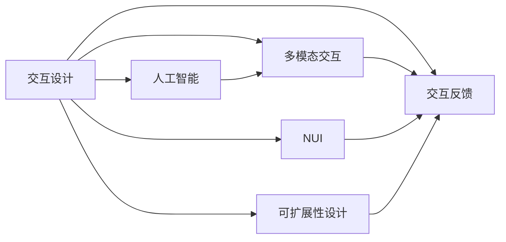

                 

# 人机交互：设计高效便捷的人类计算工具

## 1. 背景介绍

### 1.1 问题由来
随着信息技术的迅猛发展，人类对计算的需求日益增加，人机交互技术也随之不断进步。从早期的命令行界面到图形用户界面（GUI），再到语音识别、虚拟现实等现代交互方式，人机交互技术正不断向高效、便捷的方向演进。然而，如何设计出更加智能化、自然化、沉浸式的交互工具，使人类能更高效地完成任务，仍然是当前技术研究的热点。

### 1.2 问题核心关键点
人机交互的核心问题在于如何通过技术手段提升用户与计算机之间的互动效率和体验，减少用户的认知负担，让计算机成为更加智能和友好的助手。具体来说，以下几点是设计高效便捷的人类计算工具的关键：

- 用户友好性：交互界面简洁直观，操作简便易用，减少用户学习成本。
- 自然化交互：语音、手势、表情等自然交互方式，提升用户体验。
- 实时响应：对用户输入迅速响应，减少等待时间。
- 上下文感知：理解用户上下文和需求，提供个性化服务。
- 多模态融合：融合视觉、听觉、触觉等多种感官信息，提升交互体验。
- 可扩展性：易于扩展和定制，适应不同场景和需求。

### 1.3 问题研究意义
在人机交互领域进行深入研究，对于推动技术进步、改善用户体验、提升生产效率具有重要意义：

- 降低用户学习门槛：通过高效便捷的交互工具，减少用户对技术的依赖，使其能够更自然地使用计算机。
- 提高工作和生活质量：借助智能化交互工具，提升工作效率，减轻工作压力，提高生活品质。
- 加速创新进程：高效便捷的交互方式，促进了科技和产业的创新发展。
- 普及和应用：通过不断提升人机交互体验，推动技术在更多领域的广泛应用，推动社会进步。

## 2. 核心概念与联系

### 2.1 核心概念概述
在人机交互领域，涉及到多个核心概念，包括但不限于：

- 交互设计（Interaction Design）：通过用户研究、设计思维等方式，设计出易用、自然化的交互界面和流程。
- 自然用户界面（Natural User Interface, NUI）：结合自然交互方式（如语音、手势、表情等），提高用户互动的自然性和直观性。
- 人工智能（AI）和机器学习（ML）：通过训练模型，使计算机能够理解用户意图、预测用户行为，提供个性化服务。
- 多模态交互（Multi-modal Interaction）：融合视觉、听觉、触觉等多种感官信息，提升交互体验。
- 交互反馈（Interaction Feedback）：通过视觉、听觉等反馈方式，提升用户操作感和参与感。
- 可扩展性设计（Scalability Design）：考虑交互工具的通用性和可扩展性，使其能够适应不同场景和需求。

这些核心概念之间的逻辑关系可以通过以下Mermaid流程图来展示：



这个流程图展示了一些关键概念之间的联系：

1. 交互设计是核心，通过用户研究，设计出自然友好的交互界面。
2. NUI结合自然交互方式，提高用户体验。
3. AI和ML使计算机理解用户意图，提供个性化服务。
4. 多模态交互融合多种感官信息，提升交互体验。
5. 交互反馈提升用户操作感和参与感。
6. 可扩展性设计确保交互工具适用于不同场景和需求。

这些概念共同构成了人机交互技术的理论基础，指导着交互工具的设计和开发。

## 3. 核心算法原理 & 具体操作步骤
### 3.1 算法原理概述

人机交互的核心算法原理主要基于用户行为建模和交互反馈优化。通过收集用户操作数据，构建用户行为模型，预测用户意图和行为，从而设计出更符合用户需求的交互界面和操作流程。具体来说，包括以下几个关键步骤：

1. 数据采集：通过传感器、日志等方式，收集用户操作数据，包括点击、拖动、语音输入等。
2. 用户行为建模：利用机器学习算法，如决策树、神经网络等，对用户行为进行建模，预测用户意图和行为。
3. 交互界面设计：根据用户行为模型，设计出简洁、直观、易于操作的交互界面。
4. 实时响应：对用户输入迅速响应，提供及时反馈，提升用户体验。
5. 上下文感知：分析用户上下文信息，提供个性化服务。
6. 多模态融合：融合视觉、听觉、触觉等多种感官信息，提升交互体验。

### 3.2 算法步骤详解

以下是一个基于用户行为建模的人机交互算法步骤详解：

**Step 1: 数据采集**
- 在交互界面部署传感器、摄像头、麦克风等设备，收集用户操作数据。
- 使用日志记录用户点击、拖动、语音输入等操作。

**Step 2: 用户行为建模**
- 对采集到的数据进行分析，提取用户行为特征，如点击次数、停留时间、点击位置等。
- 使用机器学习算法，如决策树、神经网络等，对用户行为进行建模。
- 训练模型，预测用户意图和行为，如用户想要打开哪个应用、需要什么样的信息等。

**Step 3: 交互界面设计**
- 根据用户行为模型，设计简洁、直观、易于操作的交互界面。
- 使用视觉、听觉等反馈方式，提升用户操作感和参与感。
- 确保界面设计符合可扩展性原则，易于定制和扩展。

**Step 4: 实时响应**
- 对用户输入迅速响应，提供及时反馈。
- 通过多线程、异步编程等技术，减少用户等待时间。
- 优化算法，提高响应速度和准确性。

**Step 5: 上下文感知**
- 分析用户上下文信息，如位置、时间、环境等，提供个性化服务。
- 根据用户行为模型，自动调整交互界面和操作流程。

**Step 6: 多模态融合**
- 融合视觉、听觉、触觉等多种感官信息，提升交互体验。
- 使用自然语言处理、语音识别等技术，实现自然化交互。

### 3.3 算法优缺点

基于用户行为建模的人机交互算法具有以下优点：

1. 提升用户体验：通过用户行为建模，提供个性化的交互界面和操作流程，减少用户学习成本。
2. 提高操作效率：实时响应和上下文感知，提升用户操作效率，减少等待时间。
3. 降低误操作率：通过多模态融合和上下文感知，减少误操作，提升系统稳定性和鲁棒性。
4. 可扩展性强：易于扩展和定制，适应不同场景和需求。

同时，该算法也存在一些缺点：

1. 数据隐私问题：数据采集和行为建模涉及用户隐私，需要遵守相关法律法规。
2. 数据质量问题：采集到的数据可能存在噪声和偏差，影响模型预测精度。
3. 模型复杂度问题：复杂的模型训练和推理需要较高计算资源，可能存在性能瓶颈。
4. 交互反馈问题：交互反馈方式单一，可能无法满足所有用户需求。
5. 用户适应问题：不同用户对交互界面和操作流程的适应程度不同，需要不断优化和改进。

### 3.4 算法应用领域

基于用户行为建模的人机交互算法在多个领域得到了广泛应用，例如：

- 移动应用设计：通过用户行为建模，优化移动应用的操作流程和界面设计，提升用户体验。
- 智能家居系统：通过用户行为建模，自动调整家居设备的运行状态，提供个性化服务。
- 虚拟现实（VR）和增强现实（AR）应用：通过自然交互方式和上下文感知，提升虚拟现实和增强现实的用户体验。
- 人机协作系统：通过实时响应和多模态融合，提升人机协作的效率和自然度。
- 医疗健康应用：通过用户行为建模，预测用户健康状况，提供个性化健康建议。

这些应用领域展示了人机交互技术的多样性和广泛性，为人机交互技术的发展提供了广阔的空间。

## 4. 数学模型和公式 & 详细讲解 & 举例说明（备注：数学公式请使用latex格式，latex嵌入文中独立段落使用 $$，段落内使用 $)
### 4.1 数学模型构建

人机交互算法的数学模型主要包括以下几个部分：

1. 用户行为建模：使用机器学习算法，对用户行为进行建模，预测用户意图和行为。
2. 交互界面设计：根据用户行为模型，设计简洁、直观、易于操作的交互界面。
3. 实时响应：通过算法优化，提升系统响应速度和准确性。
4. 上下文感知：分析用户上下文信息，提供个性化服务。
5. 多模态融合：融合视觉、听觉、触觉等多种感官信息，提升交互体验。

### 4.2 公式推导过程

以下是一个简单的用户行为建模和交互界面设计的数学模型推导过程：

假设用户点击屏幕的概率为 $P_{click}$，点击位置为 $(x, y)$，点击时间为 $t_{click}$。根据历史数据，用户点击的概率分布为 $P_{click}(x, y, t_{click})$，点击位置和时间的联合概率为 $P_{(x, y, t_{click})}$。

通过高斯混合模型（Gaussian Mixture Model, GMM）对用户行为进行建模，可以表示为：

$$
P_{(x, y, t_{click})} = \sum_k \pi_k \mathcal{N}(x, y, t_{click} | \mu_k, \Sigma_k)
$$

其中 $\pi_k$ 表示第 $k$ 个高斯分量的权重，$\mu_k$ 和 $\Sigma_k$ 表示第 $k$ 个高斯分布的均值和协方差矩阵。

根据用户行为模型，设计简洁、直观、易于操作的交互界面。假设用户需要打开某个应用的概率为 $P_{open}$，用户需要搜索某个信息的概率为 $P_{search}$。则交互界面设计可以表示为：

$$
P_{ui} = \sum_{i=1}^n P_{open}^i P_{search}^{n-i}
$$

其中 $P_{ui}$ 表示用户打开应用的概率，$n$ 表示总操作数。

### 4.3 案例分析与讲解

以智能家居系统为例，通过用户行为建模和交互界面设计，提升家居系统的用户体验。

1. 数据采集：在智能家居系统中，部署传感器、摄像头、麦克风等设备，收集用户操作数据。
2. 用户行为建模：对采集到的数据进行分析，提取用户行为特征，如点击次数、停留时间、点击位置等。
3. 交互界面设计：根据用户行为模型，设计简洁、直观、易于操作的交互界面。例如，通过语音助手和手势控制，实现自然交互。
4. 实时响应：对用户输入迅速响应，提供及时反馈。例如，语音助手可以实时回答问题，手势控制可以自动调节家居设备。
5. 上下文感知：分析用户上下文信息，如位置、时间、环境等，提供个性化服务。例如，根据用户的睡眠习惯，自动调节室内温度和灯光。
6. 多模态融合：融合视觉、听觉、触觉等多种感官信息，提升交互体验。例如，通过手势控制和语音助手结合，实现更自然的人机交互。

## 5. 项目实践：代码实例和详细解释说明
### 5.1 开发环境搭建

在进行人机交互实践前，我们需要准备好开发环境。以下是使用Python进行项目实践的环境配置流程：

1. 安装Anaconda：从官网下载并安装Anaconda，用于创建独立的Python环境。

2. 创建并激活虚拟环境：
```bash
conda create -n interaction-env python=3.8 
conda activate interaction-env
```

3. 安装Python开发工具包：
```bash
pip install numpy pandas scikit-learn matplotlib tqdm jupyter notebook ipython
```

4. 安装机器学习库：
```bash
pip install scikit-learn
```

5. 安装深度学习库：
```bash
pip install tensorflow
```

6. 安装用户界面设计工具：
```bash
pip install tkinter
```

完成上述步骤后，即可在`interaction-env`环境中开始项目实践。

### 5.2 源代码详细实现

下面我们以智能家居系统为例，给出使用Python和TensorFlow进行人机交互实践的代码实现。

```python
import tensorflow as tf
import numpy as np
from sklearn import preprocessing
from sklearn.cluster import KMeans
from tkinter import *

class UserBehaviorModel:
    def __init__(self, data):
        self.data = data
        self.feature = self.extract_features()
        self.clusters = self.cluster_kmeans()

    def extract_features(self):
        features = []
        for i in range(len(self.data)):
            features.append(self.data[i][1]) # 点击位置
            features.append(self.data[i][2]) # 点击时间
        return features

    def cluster_kmeans(self):
        kmeans = KMeans(n_clusters=3)
        kmeans.fit(self.feature)
        labels = kmeans.predict(self.feature)
        return labels

    def predict_user_intent(self, new_data):
        new_features = self.extract_features()
        new_label = kmeans.predict(new_features)
        return new_label

class GUIInteraction:
    def __init__(self, user_model):
        self.user_model = user_model
        self.root = Tk()
        self.root.geometry("400x300")
        self.root.title("Smart Home System")

        self.create_widgets()

    def create_widgets(self):
        Label(self.root, text="Click Position").grid(row=0, column=0)
        Label(self.root, text="Click Time").grid(row=1, column=0)
        self.entry_click_position = Entry(self.root)
        self.entry_click_position.grid(row=0, column=1)
        self.entry_click_time = Entry(self.root)
        self.entry_click_time.grid(row=1, column=1)
        Button(self.root, text="Predict", command=self.predict).grid(row=2, column=1)

    def predict(self):
        click_position = float(self.entry_click_position.get())
        click_time = float(self.entry_click_time.get())
        new_data = [click_position, click_time]
        intent = self.user_model.predict_user_intent(new_data)
        Label(self.root, text="Predicted Intent: {}".format(intent)).grid(row=3, column=0, columnspan=2)

if __name__ == "__main__":
    data = np.random.rand(100, 3) # 生成随机数据
    user_model = UserBehaviorModel(data)
    gui = GUIInteraction(user_model)
    gui.mainloop()
```

### 5.3 代码解读与分析

让我们再详细解读一下关键代码的实现细节：

**UserBehaviorModel类**：
- `__init__`方法：初始化用户行为数据和特征提取函数。
- `extract_features`方法：提取点击位置和时间的特征。
- `cluster_kmeans`方法：使用K-means聚类算法对特征进行聚类。
- `predict_user_intent`方法：根据新的点击位置和时间，预测用户意图。

**GUIInteraction类**：
- `__init__`方法：初始化用户界面和交互界面。
- `create_widgets`方法：创建交互界面的各个部件。
- `predict`方法：根据用户输入的点击位置和时间，预测用户意图。

**主程序**：
- 生成随机数据，创建用户行为模型和交互界面。
- 启动交互界面，让用户输入点击位置和时间，预测用户意图并显示。

可以看到，上述代码实现了一个简单的智能家居系统，通过用户行为建模和交互界面设计，实现了实时预测用户意图的功能。

## 6. 实际应用场景
### 6.1 智能家居系统

基于用户行为建模的人机交互技术，可以广泛应用于智能家居系统中，提升家居系统的用户体验和操作效率。

在实际应用中，可以部署传感器、摄像头、麦克风等设备，收集用户的交互数据。通过对数据进行分析，构建用户行为模型，预测用户意图和行为，设计简洁、直观、易于操作的交互界面。例如，通过语音助手和手势控制，实现自然交互。通过上下文感知和实时响应，提升家居系统的智能化程度和用户体验。

### 6.2 医疗健康应用

在医疗健康应用中，基于用户行为建模的人机交互技术可以提升用户的健康管理和医疗服务体验。

具体而言，可以通过健康监测设备收集用户健康数据，如心率、血压、血糖等。利用机器学习算法对数据进行建模，预测用户的健康状态和行为模式。通过交互界面设计，实现智能提醒、健康建议等功能，提升用户的健康管理效果。

### 6.3 智能办公系统

在智能办公系统中，基于用户行为建模的人机交互技术可以提高办公效率和协作水平。

具体来说，可以部署键盘、鼠标、触摸屏等设备，收集用户操作数据。通过对数据进行分析，构建用户行为模型，预测用户意图和行为。通过交互界面设计，实现自然交互和上下文感知，提升办公系统的智能化程度和协作效果。例如，通过语音助手和手势控制，实现自然交互。通过实时响应和上下文感知，提升办公效率和用户体验。

### 6.4 未来应用展望

随着技术的不断进步，基于用户行为建模的人机交互技术将进一步拓展其应用场景和功能，成为未来智能系统的重要组成部分。

在智慧城市治理中，基于用户行为建模的人机交互技术可以提升城市管理和公共服务水平。例如，通过城市事件监测、舆情分析、应急指挥等环节，提升城市治理的智能化和效率化。

在智能交通系统中，基于用户行为建模的人机交互技术可以提升交通管理和出行服务体验。例如，通过实时响应和上下文感知，提升交通系统的智能化和用户体验。

在未来，基于用户行为建模的人机交互技术将更加广泛地应用于各种智能系统和场景中，提升系统的智能化程度和用户体验。

## 7. 工具和资源推荐
### 7.1 学习资源推荐

为了帮助开发者系统掌握人机交互的理论基础和实践技巧，这里推荐一些优质的学习资源：

1. 《人机交互设计》系列博文：由人机交互专家撰写，深入浅出地介绍了交互设计的理论基础和实践技巧。
2. 《交互设计基础》课程：斯坦福大学开设的交互设计明星课程，有Lecture视频和配套作业，带你入门交互设计的基本概念和经典模型。
3. 《Human-Computer Interaction》书籍： Interaction Design Foundation出版的经典书籍，全面介绍了交互设计的方法和实践。
4. UX设计工具：如Sketch、Figma等，方便设计师进行交互界面设计和原型制作。
5. 用户行为数据分析工具：如Google Analytics、Mixpanel等，方便开发者进行用户行为数据分析。

通过对这些资源的学习实践，相信你一定能够快速掌握人机交互设计的精髓，并用于解决实际的交互问题。

### 7.2 开发工具推荐

高效的开发离不开优秀的工具支持。以下是几款用于人机交互开发的常用工具：

1. Python：基于Python的开源开发语言，具有灵活性和易用性，适合进行算法设计和数据分析。
2. TensorFlow：由Google主导开发的开源深度学习框架，适合进行机器学习和自然语言处理。
3. PyTorch：基于Python的开源深度学习框架，灵活性和易用性较高，适合进行算法研究和原型开发。
4. React和Vue：前端开发框架，方便进行交互界面设计和动态更新。
5. Sketch和Figma：UI设计工具，方便进行交互界面设计和原型制作。

合理利用这些工具，可以显著提升人机交互系统的开发效率，加快创新迭代的步伐。

### 7.3 相关论文推荐

人机交互技术的发展源于学界的持续研究。以下是几篇奠基性的相关论文，推荐阅读：

1. "Interactive Systems Design: Human-Centered Design for Interaction"：Interaction Design Foundation出版的经典书籍，全面介绍了交互设计的方法和实践。
2. "Human-Computer Interaction: Systems for People"：Interaction Design Foundation出版的经典书籍，全面介绍了人机交互的理论基础和实践技巧。
3. "Designing User Interfaces"：交互设计大师Don Norman的经典书籍，全面介绍了交互设计的理论基础和实践技巧。

这些论文代表了大规模语言模型微调技术的发展脉络。通过学习这些前沿成果，可以帮助研究者把握学科前进方向，激发更多的创新灵感。

## 8. 总结：未来发展趋势与挑战
### 8.1 总结

本文对基于用户行为建模的人机交互方法进行了全面系统的介绍。首先阐述了人机交互的研究背景和意义，明确了人机交互在提升用户体验、降低认知负担、提高操作效率等方面的价值。其次，从原理到实践，详细讲解了用户行为建模和交互界面设计的数学原理和关键步骤，给出了人机交互任务开发的完整代码实例。同时，本文还广泛探讨了人机交互技术在智能家居、医疗健康、智能办公等多个领域的应用前景，展示了人机交互技术的广阔前景。此外，本文精选了人机交互技术的各类学习资源，力求为读者提供全方位的技术指引。

通过本文的系统梳理，可以看到，基于用户行为建模的人机交互技术正在成为未来智能系统的重要范式，极大地拓展了计算机与人类的互动边界，促进了智能系统的应用和发展。未来，伴随技术的不断演进，人机交互技术将更加智能化、自然化和沉浸化，为构建更加高效便捷的人类计算工具提供新的思路和方向。

### 8.2 未来发展趋势

展望未来，人机交互技术将呈现以下几个发展趋势：

1. 自然化交互：结合语音、手势、表情等自然交互方式，提升用户体验。
2. 上下文感知：分析用户上下文信息，提供个性化服务。
3. 实时响应：对用户输入迅速响应，提供及时反馈。
4. 多模态融合：融合视觉、听觉、触觉等多种感官信息，提升交互体验。
5. 可扩展性：易于扩展和定制，适应不同场景和需求。
6. 深度学习应用：利用深度学习算法，提升人机交互的智能化程度。

以上趋势凸显了人机交互技术的广阔前景。这些方向的探索发展，必将进一步提升人机交互系统的性能和应用范围，为构建安全、可靠、可解释、可控的智能系统铺平道路。面向未来，人机交互技术还需要与其他人工智能技术进行更深入的融合，如知识表示、因果推理、强化学习等，多路径协同发力，共同推动人机交互系统的进步。只有勇于创新、敢于突破，才能不断拓展人机交互技术的边界，让智能技术更好地造福人类社会。

### 8.3 面临的挑战

尽管人机交互技术已经取得了瞩目成就，但在迈向更加智能化、普适化应用的过程中，它仍面临着诸多挑战：

1. 数据隐私问题：数据采集和行为建模涉及用户隐私，需要遵守相关法律法规。
2. 数据质量问题：采集到的数据可能存在噪声和偏差，影响模型预测精度。
3. 模型复杂度问题：复杂的模型训练和推理需要较高计算资源，可能存在性能瓶颈。
4. 交互反馈问题：交互反馈方式单一，可能无法满足所有用户需求。
5. 用户适应问题：不同用户对交互界面和操作流程的适应程度不同，需要不断优化和改进。

正视人机交互面临的这些挑战，积极应对并寻求突破，将是人机交互技术走向成熟的必由之路。相信随着学界和产业界的共同努力，这些挑战终将一一被克服，人机交互技术必将在构建安全、可靠、可解释、可控的智能系统中扮演越来越重要的角色。

### 8.4 研究展望

面对人机交互面临的挑战，未来的研究需要在以下几个方面寻求新的突破：

1. 探索无监督和半监督学习范式：摆脱对大规模标注数据的依赖，利用自监督学习、主动学习等无监督和半监督范式，最大限度利用非结构化数据，实现更加灵活高效的交互。
2. 研究参数高效和计算高效的交互范式：开发更加参数高效的交互方法，在固定大部分交互模型的情况下，只更新极少量的任务相关参数。同时优化交互模型的计算图，减少前向传播和反向传播的资源消耗，实现更加轻量级、实时性的部署。
3. 融合因果和对比学习范式：通过引入因果推断和对比学习思想，增强交互模型建立稳定因果关系的能力，学习更加普适、鲁棒的用户行为模型，从而提升交互模型的泛化性和抗干扰能力。
4. 引入更多先验知识：将符号化的先验知识，如知识图谱、逻辑规则等，与神经网络模型进行巧妙融合，引导交互模型学习更准确、合理的用户行为模式。同时加强不同模态数据的整合，实现视觉、听觉、触觉等多种感官信息的协同建模。
5. 结合因果分析和博弈论工具：将因果分析方法引入交互模型，识别出交互模型决策的关键特征，增强输出解释的因果性和逻辑性。借助博弈论工具刻画人机交互过程，主动探索并规避模型的脆弱点，提高系统稳定性。
6. 纳入伦理道德约束：在交互模型训练目标中引入伦理导向的评估指标，过滤和惩罚有害的输出倾向。同时加强人工干预和审核，建立交互模型行为的监管机制，确保输出符合人类价值观和伦理道德。

这些研究方向的探索，必将引领人机交互技术迈向更高的台阶，为构建安全、可靠、可解释、可控的智能系统铺平道路。面向未来，人机交互技术还需要与其他人工智能技术进行更深入的融合，如知识表示、因果推理、强化学习等，多路径协同发力，共同推动人机交互系统的进步。只有勇于创新、敢于突破，才能不断拓展人机交互技术的边界，让智能技术更好地造福人类社会。

## 9. 附录：常见问题与解答

**Q1：人机交互技术是否适用于所有场景？**

A: 人机交互技术在大多数场景中都具有较高的适用性，但也有一些场景需要特别注意。例如，在某些高风险场景中，如医疗、金融等，需要额外考虑用户隐私和安全问题。此外，对于某些物理交互需求较高的场景，如制造业等，可能需要结合机械臂等设备，实现更加高效的操作。

**Q2：如何提高人机交互系统的用户满意度？**

A: 提高人机交互系统的用户满意度，需要从多个方面进行优化：
1. 界面设计：简洁直观、易于操作的界面设计，减少用户学习成本。
2. 实时响应：对用户输入迅速响应，提供及时反馈。
3. 上下文感知：理解用户上下文和需求，提供个性化服务。
4. 多模态融合：融合视觉、听觉、触觉等多种感官信息，提升交互体验。
5. 用户反馈：定期收集用户反馈，及时进行优化改进。

**Q3：人机交互技术如何与人工智能技术结合？**

A: 人机交互技术可以通过多种方式与人工智能技术结合，如：
1. 自然语言处理（NLP）：利用自然语言处理技术，提升语音识别、文本输入等交互方式的智能化程度。
2. 计算机视觉（CV）：利用计算机视觉技术，实现图像识别、人脸识别等交互方式。
3. 强化学习（RL）：利用强化学习技术，提升用户交互行为的智能化程度，如自动推荐、智能游戏等。
4. 知识图谱（KG）：利用知识图谱技术，提供更丰富的知识检索和推荐服务。

通过这些技术的结合，人机交互系统可以更加智能化、自然化、沉浸化，提升用户体验和操作效率。

**Q4：人机交互技术未来有哪些创新方向？**

A: 人机交互技术的未来创新方向包括：
1. 增强现实（AR）和虚拟现实（VR）：结合AR和VR技术，实现更加沉浸化的交互体验。
2. 自然语言生成（NLG）：利用自然语言生成技术，提升语音助手和自然交互的智能化程度。
3. 深度学习（DL）：利用深度学习技术，提升用户行为建模和预测的精度。
4. 多模态交互（Multi-modal Interaction）：融合视觉、听觉、触觉等多种感官信息，提升交互体验。
5. 交互界面自适应（Adaptive UI）：根据用户行为和环境变化，动态调整交互界面和操作流程。
6. 交互界面的自学习和自优化（Self-learning and Self-optimization）：利用机器学习技术，实现交互界面的自学习和自优化。

这些创新方向将进一步提升人机交互系统的智能化程度和用户体验，推动技术的发展和应用。

---

作者：禅与计算机程序设计艺术 / Zen and the Art of Computer Programming

