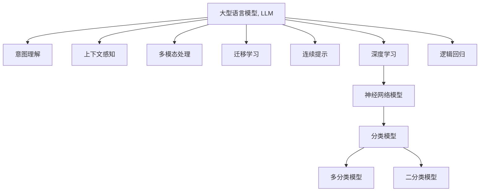

                 

## 1. 背景介绍

### 1.1 问题由来

在人工智能飞速发展的今天，大型语言模型（Large Language Models, LLMs）已经成为连接人类与计算机的桥梁，它们在自然语言处理（NLP）领域展示了前所未有的能力。然而，虽然这些模型在语言学、语法和语义方面表现出色，但在真正理解和实现人类意图方面仍存在一定局限。

### 1.2 问题核心关键点

LLMs通过在大量无标签数据上进行预训练，学习到广泛的语义和语法规则，但在实际应用中，尤其是在需要精确理解和回应用户意图时，预训练的通用知识往往不足。这一问题被称为“意图理解”，即如何使LLMs能够真正“理解”人类意图，并作出符合期望的响应。

### 1.3 问题研究意义

解决意图理解问题，将显著提升LLMs在NLP任务中的表现，使它们能够更加贴近人类的思维模式和需求，提供更加智能、高效和符合预期的服务。这对于推动人机协作的发展，构建更智能的智能助手、自动化客服系统、医疗咨询、教育辅导等应用具有重要意义。

## 2. 核心概念与联系

### 2.1 核心概念概述

为更好地理解如何使LLMs真正理解人类意图，本节将介绍几个密切相关的核心概念：

- **大型语言模型（Large Language Model, LLM）**：基于自回归或自编码模型的预训练语言模型，通过在大量文本数据上进行预训练，学习到丰富的语言知识。
- **意图理解（Intent Understanding）**：指LLMs在理解用户输入后，能够准确识别用户的真实需求和意图，作出符合预期的回应。
- **上下文感知（Context-Aware）**：指模型能够在对话或文本中理解上下文信息，以更好地理解用户意图。
- **多模态处理（Multi-modal Processing）**：指模型能够同时处理文本、图像、语音等多种模态的信息，提升理解深度和广度。
- **迁移学习（Transfer Learning）**：指通过在特定任务上微调预训练模型，使其具备特定领域的知识。
- **连续提示（Continuous Prompting）**：指在输入文本中设计引导性提示，帮助模型更好地理解用户意图。
- **深度学习（Deep Learning）**：指利用神经网络模型进行复杂数据分析和模式识别。
- **逻辑回归（Logistic Regression）**：指一种常用的分类算法，用于将连续值映射到0或1的二分类。

这些核心概念之间的逻辑关系可以通过以下Mermaid流程图来展示：



这个流程图展示了大语言模型意图理解的核心概念及其之间的联系：

1. 大型语言模型通过预训练学习到基础的语言知识。
2. 意图理解要求模型能够真正理解用户输入的含义。
3. 上下文感知帮助模型理解输入文本的上下文信息。
4. 多模态处理使模型能够处理多种类型的数据。
5. 迁移学习使模型能够应用特定领域的知识。
6. 连续提示通过引导性提示帮助模型理解用户意图。
7. 深度学习提供了强大的模型训练和表示能力。
8. 逻辑回归作为分类算法，用于输出模型预测结果。

## 3. 核心算法原理 & 具体操作步骤
### 3.1 算法原理概述

意图理解问题本质上是一个序列分类问题，即给定一段文本，LLMs需要识别出用户输入的意图，并将其映射到预定义的意图类别上。为了解决这一问题，常用的方法是将LLMs的输出与意图标签进行对比，最小化分类误差。

具体而言，假设给定文本序列 $x=(x_1, x_2, ..., x_n)$，模型输出为 $y=(y_1, y_2, ..., y_n)$，意图标签为 $t=(t_1, t_2, ..., t_n)$。意图理解的目的是找到最优参数 $\theta$，使得模型输出 $y$ 与意图标签 $t$ 最接近。常用的评估指标包括交叉熵损失、F1得分等。

### 3.2 算法步骤详解

基于意图理解的算法一般包括以下几个关键步骤：

**Step 1: 准备数据集**

- 收集标注好的意图数据集，分为训练集、验证集和测试集。
- 对数据进行预处理，包括分词、去停用词、词向量表示等。

**Step 2: 模型选择与适配**

- 选择适合的预训练模型，如BERT、GPT等。
- 在模型顶层添加意图分类器，如全连接层或Transformer层。
- 设置损失函数，如交叉熵损失。

**Step 3: 训练模型**

- 使用优化算法（如AdamW、SGD等）训练模型。
- 使用数据增强、对抗训练等技术提高模型鲁棒性。
- 在验证集上评估模型性能，选择最优模型。

**Step 4: 模型评估**

- 在测试集上评估模型的性能，使用指标如精确度、召回率、F1得分等。
- 使用混淆矩阵、ROC曲线等工具分析模型表现。

**Step 5: 部署与应用**

- 将训练好的模型部署到应用系统中，接受用户输入。
- 通过推理接口，输出模型预测的意图类别。

### 3.3 算法优缺点

基于意图理解的算法具有以下优点：

1. **简单高效**：只需要少量标注数据，即可通过微调使模型具备意图理解能力。
2. **灵活性强**：能够适用于多种NLP任务，如对话系统、文本摘要、机器翻译等。
3. **可解释性强**：模型输出与意图标签的对比过程具有较好的可解释性。

然而，也存在一些局限性：

1. **依赖标注数据**：模型的性能很大程度上取决于标注数据的质量和数量。
2. **泛化能力有限**：当数据分布与训练集差异较大时，模型的泛化性能可能下降。
3. **对抗样本敏感**：对抗样本可能使模型输出错误的结果。
4. **计算资源消耗大**：大规模模型的训练和推理需要大量计算资源。

## 4. 数学模型和公式 & 详细讲解 & 举例说明

### 4.1 数学模型构建

在数学上，意图理解问题可以表示为如下的形式：

$$
\min_{\theta} \mathcal{L}(y, t) = -\sum_{i=1}^{n} t_i \log y_i + (1-t_i) \log(1-y_i)
$$

其中 $\mathcal{L}$ 为交叉熵损失函数，$y$ 为模型输出，$t$ 为意图标签。

### 4.2 公式推导过程

根据交叉熵损失函数的定义，可以将其展开为：

$$
\mathcal{L}(y, t) = -\sum_{i=1}^{n} t_i \log \hat{y}_i + (1-t_i) \log(1-\hat{y}_i)
$$

其中 $\hat{y}_i$ 为模型对文本序列中第 $i$ 个位置的意图预测概率。

使用链式法则对 $y_i$ 求导，得到：

$$
\frac{\partial \mathcal{L}}{\partial y_i} = -(t_i - \hat{y}_i)
$$

利用梯度下降等优化算法，更新模型参数 $\theta$，使得 $\mathcal{L}$ 最小化。

### 4.3 案例分析与讲解

以一个简单的二分类问题为例，假设有两个意图类别 A 和 B，使用逻辑回归模型进行意图预测。给定样本 $(x, y)$，其中 $y \in \{0, 1\}$，模型的输出 $y' = \hat{y} = \sigma(Wx + b)$，其中 $W$ 和 $b$ 为模型参数，$\sigma$ 为sigmoid函数。

根据逻辑回归模型的定义，模型的预测概率为：

$$
\hat{y} = \frac{1}{1 + e^{-W^T x - b}}
$$

假设意图标签 $t=1$，则模型需要最大化 $y$ 的预测概率，即：

$$
\max_{\theta} y' = \max_{\theta} \hat{y}
$$

通过计算梯度并更新模型参数，可以得到：

$$
\frac{\partial \mathcal{L}}{\partial \theta} = \frac{\partial \mathcal{L}}{\partial W} = -(t - \hat{y}) \frac{\partial \hat{y}}{\partial W} = (1-\hat{y})(1 - 2\hat{y}) x
$$

通过上述过程，模型可以逐步优化自身参数，提升意图预测的准确性。

## 5. 项目实践：代码实例和详细解释说明

### 5.1 开发环境搭建

在进行意图理解实践前，我们需要准备好开发环境。以下是使用Python进行PyTorch开发的环境配置流程：

1. 安装Anaconda：从官网下载并安装Anaconda，用于创建独立的Python环境。
2. 创建并激活虚拟环境：
```bash
conda create -n pytorch-env python=3.8 
conda activate pytorch-env
```
3. 安装PyTorch：根据CUDA版本，从官网获取对应的安装命令。例如：
```bash
conda install pytorch torchvision torchaudio cudatoolkit=11.1 -c pytorch -c conda-forge
```
4. 安装Transformers库：
```bash
pip install transformers
```
5. 安装各类工具包：
```bash
pip install numpy pandas scikit-learn matplotlib tqdm jupyter notebook ipython
```

完成上述步骤后，即可在`pytorch-env`环境中开始意图理解实践。

### 5.2 源代码详细实现

这里我们以情感分析任务为例，给出使用Transformers库对BERT模型进行意图理解的PyTorch代码实现。

首先，定义意图理解任务的数据处理函数：

```python
from transformers import BertTokenizer
from torch.utils.data import Dataset
import torch

class IntentDataset(Dataset):
    def __init__(self, texts, tags, tokenizer, max_len=128):
        self.texts = texts
        self.tags = tags
        self.tokenizer = tokenizer
        self.max_len = max_len
        
    def __len__(self):
        return len(self.texts)
    
    def __getitem__(self, item):
        text = self.texts[item]
        tag = self.tags[item]
        
        encoding = self.tokenizer(text, return_tensors='pt', max_length=self.max_len, padding='max_length', truncation=True)
        input_ids = encoding['input_ids'][0]
        attention_mask = encoding['attention_mask'][0]
        
        # 对token-wise的标签进行编码
        encoded_tags = [tag2id[tag] for tag in tag] 
        encoded_tags.extend([tag2id['O']] * (self.max_len - len(encoded_tags)))
        labels = torch.tensor(encoded_tags, dtype=torch.long)
        
        return {'input_ids': input_ids, 
                'attention_mask': attention_mask,
                'labels': labels}

# 标签与id的映射
tag2id = {'O': 0, 'Positive': 1, 'Negative': 2}
id2tag = {v: k for k, v in tag2id.items()}

# 创建dataset
tokenizer = BertTokenizer.from_pretrained('bert-base-cased')

train_dataset = IntentDataset(train_texts, train_tags, tokenizer)
dev_dataset = IntentDataset(dev_texts, dev_tags, tokenizer)
test_dataset = IntentDataset(test_texts, test_tags, tokenizer)
```

然后，定义模型和优化器：

```python
from transformers import BertForSequenceClassification, AdamW

model = BertForSequenceClassification.from_pretrained('bert-base-cased', num_labels=len(tag2id))

optimizer = AdamW(model.parameters(), lr=2e-5)
```

接着，定义训练和评估函数：

```python
from torch.utils.data import DataLoader
from tqdm import tqdm
from sklearn.metrics import classification_report

device = torch.device('cuda') if torch.cuda.is_available() else torch.device('cpu')
model.to(device)

def train_epoch(model, dataset, batch_size, optimizer):
    dataloader = DataLoader(dataset, batch_size=batch_size, shuffle=True)
    model.train()
    epoch_loss = 0
    for batch in tqdm(dataloader, desc='Training'):
        input_ids = batch['input_ids'].to(device)
        attention_mask = batch['attention_mask'].to(device)
        labels = batch['labels'].to(device)
        model.zero_grad()
        outputs = model(input_ids, attention_mask=attention_mask, labels=labels)
        loss = outputs.loss
        epoch_loss += loss.item()
        loss.backward()
        optimizer.step()
    return epoch_loss / len(dataloader)

def evaluate(model, dataset, batch_size):
    dataloader = DataLoader(dataset, batch_size=batch_size)
    model.eval()
    preds, labels = [], []
    with torch.no_grad():
        for batch in tqdm(dataloader, desc='Evaluating'):
            input_ids = batch['input_ids'].to(device)
            attention_mask = batch['attention_mask'].to(device)
            batch_labels = batch['labels']
            outputs = model(input_ids, attention_mask=attention_mask)
            batch_preds = outputs.logits.argmax(dim=2).to('cpu').tolist()
            batch_labels = batch_labels.to('cpu').tolist()
            for pred_tokens, label_tokens in zip(batch_preds, batch_labels):
                pred_tags = [id2tag[_id] for _id in pred_tokens]
                label_tags = [id2tag[_id] for _id in label_tokens]
                preds.append(pred_tags[:len(label_tokens)])
                labels.append(label_tags)
                
    print(classification_report(labels, preds))
```

最后，启动训练流程并在测试集上评估：

```python
epochs = 5
batch_size = 16

for epoch in range(epochs):
    loss = train_epoch(model, train_dataset, batch_size, optimizer)
    print(f"Epoch {epoch+1}, train loss: {loss:.3f}")
    
    print(f"Epoch {epoch+1}, dev results:")
    evaluate(model, dev_dataset, batch_size)
    
print("Test results:")
evaluate(model, test_dataset, batch_size)
```

以上就是使用PyTorch对BERT进行意图理解任务微调的完整代码实现。可以看到，得益于Transformers库的强大封装，我们可以用相对简洁的代码完成BERT模型的加载和微调。

### 5.3 代码解读与分析

让我们再详细解读一下关键代码的实现细节：

**IntentDataset类**：
- `__init__`方法：初始化文本、标签、分词器等关键组件。
- `__len__`方法：返回数据集的样本数量。
- `__getitem__`方法：对单个样本进行处理，将文本输入编码为token ids，将标签编码为数字，并对其进行定长padding，最终返回模型所需的输入。

**tag2id和id2tag字典**：
- 定义了标签与数字id之间的映射关系，用于将token-wise的预测结果解码回真实的标签。

**训练和评估函数**：
- 使用PyTorch的DataLoader对数据集进行批次化加载，供模型训练和推理使用。
- 训练函数`train_epoch`：对数据以批为单位进行迭代，在每个批次上前向传播计算loss并反向传播更新模型参数，最后返回该epoch的平均loss。
- 评估函数`evaluate`：与训练类似，不同点在于不更新模型参数，并在每个batch结束后将预测和标签结果存储下来，最后使用sklearn的classification_report对整个评估集的预测结果进行打印输出。

**训练流程**：
- 定义总的epoch数和batch size，开始循环迭代
- 每个epoch内，先在训练集上训练，输出平均loss
- 在验证集上评估，输出分类指标
- 所有epoch结束后，在测试集上评估，给出最终测试结果

可以看到，PyTorch配合Transformers库使得BERT微调的代码实现变得简洁高效。开发者可以将更多精力放在数据处理、模型改进等高层逻辑上，而不必过多关注底层的实现细节。

当然，工业级的系统实现还需考虑更多因素，如模型的保存和部署、超参数的自动搜索、更灵活的任务适配层等。但核心的意图理解范式基本与此类似。

## 6. 实际应用场景
### 6.1 智能客服系统

基于意图理解的对话技术，可以广泛应用于智能客服系统的构建。传统客服往往需要配备大量人力，高峰期响应缓慢，且一致性和专业性难以保证。而使用意图理解技术的对话模型，可以7x24小时不间断服务，快速响应客户咨询，用自然流畅的语言解答各类常见问题。

在技术实现上，可以收集企业内部的历史客服对话记录，将问题和最佳答复构建成监督数据，在此基础上对预训练对话模型进行微调。意图理解模型能够自动理解用户意图，匹配最合适的答案模板进行回复。对于客户提出的新问题，还可以接入检索系统实时搜索相关内容，动态组织生成回答。如此构建的智能客服系统，能大幅提升客户咨询体验和问题解决效率。

### 6.2 金融舆情监测

金融机构需要实时监测市场舆论动向，以便及时应对负面信息传播，规避金融风险。传统的人工监测方式成本高、效率低，难以应对网络时代海量信息爆发的挑战。基于意图理解的文本分类和情感分析技术，为金融舆情监测提供了新的解决方案。

具体而言，可以收集金融领域相关的新闻、报道、评论等文本数据，并对其进行主题标注和情感标注。在此基础上对预训练语言模型进行微调，使其能够自动判断文本属于何种主题，情感倾向是正面、中性还是负面。将意图理解模型应用到实时抓取的网络文本数据，就能够自动监测不同主题下的情感变化趋势，一旦发现负面信息激增等异常情况，系统便会自动预警，帮助金融机构快速应对潜在风险。

### 6.3 个性化推荐系统

当前的推荐系统往往只依赖用户的历史行为数据进行物品推荐，无法深入理解用户的真实兴趣偏好。基于意图理解的个性化推荐系统可以更好地挖掘用户行为背后的语义信息，从而提供更加精准、多样的推荐内容。

在实践中，可以收集用户浏览、点击、评论、分享等行为数据，提取和用户交互的物品标题、描述、标签等文本内容。将文本内容作为模型输入，用户的后续行为（如是否点击、购买等）作为监督信号，在此基础上微调预训练语言模型。意图理解模型能够从文本内容中准确把握用户的兴趣点。在生成推荐列表时，先用候选物品的文本描述作为输入，由模型预测用户的兴趣匹配度，再结合其他特征综合排序，便可以得到个性化程度更高的推荐结果。

### 6.4 未来应用展望

随着意图理解技术的不断发展，基于意图理解的NLP系统将广泛应用于各种场景中，为NLP技术带来新的突破。

在智慧医疗领域，基于意图理解的医疗问答、病历分析、药物研发等应用将提升医疗服务的智能化水平，辅助医生诊疗，加速新药开发进程。

在智能教育领域，意图理解技术可应用于作业批改、学情分析、知识推荐等方面，因材施教，促进教育公平，提高教学质量。

在智慧城市治理中，意图理解模型可应用于城市事件监测、舆情分析、应急指挥等环节，提高城市管理的自动化和智能化水平，构建更安全、高效的未来城市。

此外，在企业生产、社会治理、文娱传媒等众多领域，基于意图理解的NLP技术也将不断涌现，为NLP技术带来新的突破。

## 7. 工具和资源推荐
### 7.1 学习资源推荐

为了帮助开发者系统掌握意图理解技术的理论基础和实践技巧，这里推荐一些优质的学习资源：

1. 《Transformer从原理到实践》系列博文：由大模型技术专家撰写，深入浅出地介绍了Transformer原理、BERT模型、意图理解技术等前沿话题。

2. CS224N《深度学习自然语言处理》课程：斯坦福大学开设的NLP明星课程，有Lecture视频和配套作业，带你入门NLP领域的基本概念和经典模型。

3. 《Natural Language Processing with Transformers》书籍：Transformers库的作者所著，全面介绍了如何使用Transformers库进行NLP任务开发，包括意图理解在内的诸多范式。

4. HuggingFace官方文档：Transformers库的官方文档，提供了海量预训练模型和完整的意图理解样例代码，是上手实践的必备资料。

5. CLUE开源项目：中文语言理解测评基准，涵盖大量不同类型的中文NLP数据集，并提供了基于意图理解的baseline模型，助力中文NLP技术发展。

通过对这些资源的学习实践，相信你一定能够快速掌握意图理解技术的精髓，并用于解决实际的NLP问题。

### 7.2 开发工具推荐

高效的开发离不开优秀的工具支持。以下是几款用于意图理解任务开发的常用工具：

1. PyTorch：基于Python的开源深度学习框架，灵活动态的计算图，适合快速迭代研究。大部分预训练语言模型都有PyTorch版本的实现。

2. TensorFlow：由Google主导开发的开源深度学习框架，生产部署方便，适合大规模工程应用。同样有丰富的预训练语言模型资源。

3. Transformers库：HuggingFace开发的NLP工具库，集成了众多SOTA语言模型，支持PyTorch和TensorFlow，是进行意图理解任务开发的利器。

4. Weights & Biases：模型训练的实验跟踪工具，可以记录和可视化模型训练过程中的各项指标，方便对比和调优。与主流深度学习框架无缝集成。

5. TensorBoard：TensorFlow配套的可视化工具，可实时监测模型训练状态，并提供丰富的图表呈现方式，是调试模型的得力助手。

6. Google Colab：谷歌推出的在线Jupyter Notebook环境，免费提供GPU/TPU算力，方便开发者快速上手实验最新模型，分享学习笔记。

合理利用这些工具，可以显著提升意图理解任务的开发效率，加快创新迭代的步伐。

### 7.3 相关论文推荐

意图理解技术的发展源于学界的持续研究。以下是几篇奠基性的相关论文，推荐阅读：

1. Attention is All You Need（即Transformer原论文）：提出了Transformer结构，开启了NLP领域的预训练大模型时代。

2. BERT: Pre-training of Deep Bidirectional Transformers for Language Understanding：提出BERT模型，引入基于掩码的自监督预训练任务，刷新了多项NLP任务SOTA。

3. Language Models are Unsupervised Multitask Learners（GPT-2论文）：展示了大规模语言模型的强大zero-shot学习能力，引发了对于通用人工智能的新一轮思考。

4. Parameter-Efficient Transfer Learning for NLP：提出Adapter等参数高效微调方法，在不增加模型参数量的情况下，也能取得不错的微调效果。

5. Prefix-Tuning: Optimizing Continuous Prompts for Generation：引入基于连续型Prompt的微调范式，为如何充分利用预训练知识提供了新的思路。

6. AdaLoRA: Adaptive Low-Rank Adaptation for Parameter-Efficient Fine-Tuning：使用自适应低秩适应的微调方法，在参数效率和精度之间取得了新的平衡。

这些论文代表了大语言模型意图理解技术的发展脉络。通过学习这些前沿成果，可以帮助研究者把握学科前进方向，激发更多的创新灵感。

## 8. 总结：未来发展趋势与挑战
### 8.1 总结

本文对基于意图理解的LLM技术进行了全面系统的介绍。首先阐述了意图理解问题的由来和研究意义，明确了意图理解在NLP任务中的重要性。其次，从原理到实践，详细讲解了意图理解的数学原理和关键步骤，给出了意图理解任务开发的完整代码实例。同时，本文还广泛探讨了意图理解技术在智能客服、金融舆情、个性化推荐等多个行业领域的应用前景，展示了意图理解技术的巨大潜力。

通过本文的系统梳理，可以看到，基于意图理解的LLM技术正在成为NLP领域的重要范式，极大地拓展了预训练语言模型的应用边界，催生了更多的落地场景。受益于大规模语料的预训练和先进的模型架构，意图理解模型在理解复杂语言结构、多轮对话等方面表现出色，对提升NLP系统的人机交互能力具有重要意义。

### 8.2 未来发展趋势

展望未来，意图理解技术将呈现以下几个发展趋势：

1. **模型规模持续增大**：随着算力成本的下降和数据规模的扩张，预训练语言模型的参数量还将持续增长。超大规模语言模型蕴含的丰富语言知识，有望支撑更加复杂多变的意图理解任务。

2. **多模态意图理解**：未来的意图理解模型将能够同时处理文本、图像、语音等多种模态的信息，提升理解深度和广度。多模态信息融合将成为提升意图理解能力的重要方向。

3. **深度学习与认知科学结合**：意图理解技术将借鉴认知科学中的理论和方法，探索更加自然、智能的推理机制。神经网络与认知模型的结合，有望使意图理解模型更接近人类的思考方式。

4. **少样本学习与迁移学习**：未来的意图理解模型将能够在更少的标注样本上，通过少样本学习和迁移学习，实现高精度的意图预测。这将显著降低意图理解任务对标注数据的依赖。

5. **逻辑推理与因果推断**：未来的意图理解模型将具备更强的逻辑推理和因果推断能力，能够更好地理解复杂的语言结构和语义关系。

6. **持续学习与适应性**：意图理解模型将具备持续学习的能力，能够实时更新模型参数，适应数据分布的变化。持续学习将成为意图理解技术的重要特征。

7. **集成化与模块化**：未来的意图理解模型将更加模块化和集成化，不同模块可以独立优化，提升整体的意图理解能力。

8. **多领域应用拓展**：意图理解技术将进一步拓展到更多领域，如医疗、金融、教育、智能家居等，为各领域提供智能化的解决方案。

以上趋势凸显了意图理解技术的广阔前景。这些方向的探索发展，必将进一步提升意图理解模型的性能和应用范围，为构建人机协同的智能系统铺平道路。

### 8.3 面临的挑战

尽管意图理解技术已经取得了显著进展，但在迈向更加智能化、普适化应用的过程中，仍面临以下挑战：

1. **标注数据质量与数量**：意图理解模型的性能很大程度上取决于标注数据的质量和数量。如何获取高精度的标注数据，特别是在小数据场景下，仍然是一个难题。

2. **对抗样本与鲁棒性**：对抗样本可能使意图理解模型输出错误的结果。如何提高模型的鲁棒性，避免对抗样本的干扰，是一个重要的研究方向。

3. **计算资源消耗**：大规模语言模型的训练和推理需要大量计算资源。如何在保证性能的同时，优化计算资源消耗，提高模型部署的效率，是一个关键的挑战。

4. **模型可解释性与透明性**：意图理解模型的决策过程往往难以解释，缺乏可解释性和透明性，导致在应用场景中难以调试和优化。

5. **伦理与安全**：意图理解模型可能会学习到有偏见、有害的信息，如何保证模型的伦理与安全，避免恶意用途，是一个重要的研究方向。

6. **跨领域迁移能力**：当前的意图理解模型往往局限于特定领域，如何在不同领域之间实现迁移，是一个挑战。

7. **多模态融合能力**：意图理解模型需要同时处理多种模态的信息，如何在不同模态之间进行有效融合，提升整体性能，是一个重要的研究方向。

8. **持续学习与适应性**：未来的意图理解模型需要具备持续学习的能力，能够实时更新模型参数，适应数据分布的变化。持续学习的能力将是一个重要的研究方向。

这些挑战需要研究者不断探索和创新，寻找解决方案，才能使意图理解技术进一步提升，真正实现人机协同的目标。

### 8.4 研究展望

面向未来，意图理解技术需要在以下几个方面进行进一步探索：

1. **无监督学习与自监督学习**：探索无监督和自监督学习方法，摆脱对大规模标注数据的依赖，最大化利用非结构化数据。

2. **多模态融合方法**：研究多模态信息的融合方法，提升意图理解模型的理解深度和广度。

3. **逻辑推理与因果推断**：借鉴认知科学中的逻辑推理与因果推断方法，提升意图理解模型的推理能力。

4. **少样本学习与迁移学习**：研究少样本学习与迁移学习方法，降低意图理解模型对标注数据的依赖。

5. **逻辑回归与深度学习结合**：研究逻辑回归与深度学习的结合方法，提升意图理解模型的性能。

6. **模型压缩与优化**：研究模型压缩与优化方法，提高意图理解模型的计算效率和部署灵活性。

7. **可解释性与透明性**：研究可解释性与透明性方法，提升意图理解模型的可解释性和透明性。

8. **伦理与安全保障**：研究伦理与安全保障方法，保证意图理解模型的公平性、安全性与透明性。

9. **跨领域迁移能力**：研究跨领域迁移能力，提升意图理解模型在不同领域之间的适应性。

10. **多模态融合能力**：研究多模态融合方法，提升意图理解模型在不同模态之间的融合能力。

11. **持续学习与适应性**：研究持续学习与适应性方法，使意图理解模型具备持续学习的能力，能够适应数据分布的变化。

这些研究方向将为意图理解技术带来新的突破，推动人机协同系统向更加智能化、普适化方向发展。只有不断突破技术瓶颈，才能使意图理解技术真正实现其潜力，为人类认知智能的进化带来深远影响。

## 9. 附录：常见问题与解答

**Q1：意图理解模型是否适用于所有NLP任务？**

A: 意图理解模型在大多数NLP任务上都能取得不错的效果，特别是对于数据量较小的任务。但对于一些特定领域的任务，如医学、法律等，仅仅依靠通用语料预训练的模型可能难以很好地适应。此时需要在特定领域语料上进一步预训练，再进行微调，才能获得理想效果。此外，对于一些需要时效性、个性化很强的任务，如对话、推荐等，意图理解方法也需要针对性的改进优化。

**Q2：如何选择合适的意图理解模型？**

A: 选择合适的意图理解模型需要考虑多个因素，如数据规模、任务类型、模型大小等。通常，数据规模较小、任务较为简单的情况下，可以选择较小的模型；数据规模较大、任务较为复杂的情况下，可以选择较大的模型。此外，还需要考虑模型的预训练方法，如自监督预训练、监督预训练等，以及模型架构，如Transformer、LSTM等。

**Q3：意图理解模型在落地部署时需要注意哪些问题？**

A: 将意图理解模型转化为实际应用，还需要考虑以下因素：
1. 模型裁剪：去除不必要的层和参数，减小模型尺寸，加快推理速度。
2. 量化加速：将浮点模型转为定点模型，压缩存储空间，提高计算效率。
3. 服务化封装：将模型封装为标准化服务接口，便于集成调用。
4. 弹性伸缩：根据请求流量动态调整资源配置，平衡服务质量和成本。
5. 监控告警：实时采集系统指标，设置异常告警阈值，确保服务稳定性。
6. 安全防护：采用访问鉴权、数据脱敏等措施，保障数据和模型安全。

意图理解模型在实际部署中，还需要进行优化，提高推理速度和系统稳定性，同时确保数据和模型安全。只有在数据、模型、工程、业务等多个维度协同发力，才能真正实现意图理解技术的落地应用。

