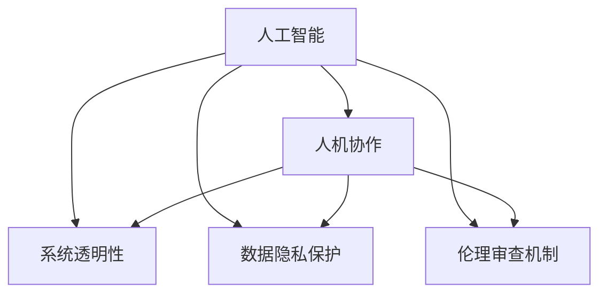

                 

# 人类-AI协作：为人类服务的设计

## 1. 背景介绍

### 1.1 问题由来

在人工智能(AI)技术迅速发展的今天，人类与AI协作已成为不可避免的趋势。AI的强大能力使得其在各行各业中得到了广泛应用，从医疗诊断到金融风险预测，从智能客服到自动驾驶，AI已渗透到人类社会的各个方面。然而，尽管AI带来了巨大的效率提升和生产力解放，但也引发了一系列伦理、法律和社会问题，使得公众对AI的信任度较低，阻碍了AI技术的进一步发展。

### 1.2 问题核心关键点

AI的广泛应用背后，需要构建一套完善的AI与人类协作机制，确保AI系统在服务人类的同时，不损害人类的利益和权利。为此，本文将深入探讨AI与人类协作的设计原则、实现方法和实际应用案例，提出基于人机共生理念的设计框架，为AI系统的构建提供理论指导和实践参考。

### 1.3 问题研究意义

随着AI技术的不断成熟，AI与人类协作已成为推动社会进步和经济发展的重要力量。构建良好的人机协作关系，不仅能够提升AI系统的应用效果，还能增强公众对AI的信任度，促进AI技术的广泛普及和深入应用。因此，研究如何设计高效、安全、可控的AI与人类协作系统，具有重要的理论和实践意义。

## 2. 核心概念与联系

### 2.1 核心概念概述

为更好地理解人类-AI协作的设计理念，本节将介绍几个关键概念：

- **人工智能(AI)**：指通过计算机模拟人类智能，实现自主学习、决策和执行能力的机器系统。AI的核心在于构建高性能的算法和模型，使其能够理解和处理复杂的数据和任务。

- **人机协作**：指人类与AI系统之间的协同工作，通过合理分配任务和信息，共同完成复杂任务。人机协作强调人类的判断和AI的计算优势互补，实现1+1>2的效果。

- **系统透明性**：指AI系统的行为、决策过程和知识来源能够被人类理解、审查和验证。系统透明性是确保AI系统可控、可信的基础。

- **数据隐私保护**：指在AI系统中，个人数据的收集、存储、使用和分享都必须符合法律法规，确保用户隐私不受侵犯。数据隐私保护是构建人机协作信任关系的关键。

- **伦理审查机制**：指在AI系统的设计和应用过程中，引入伦理委员会进行监督和评估，确保AI技术符合伦理道德规范。伦理审查机制是人机协作的重要保障。

这些核心概念之间存在着密切联系，共同构成了AI与人类协作的设计框架，使得AI系统能够安全、有效地服务于人类。

### 2.2 核心概念原理和架构的 Mermaid 流程图



这个流程图展示了AI与人类协作的核心概念及其关系：

1. AI通过学习获取知识，为人机协作提供能力基础。
2. 人机协作强调任务分配和信息共享，充分利用AI和人类优势。
3. 系统透明性、数据隐私保护和伦理审查机制确保协作系统的可信、安全和合法。

## 3. 核心算法原理 & 具体操作步骤

### 3.1 算法原理概述

基于人机协作的AI设计，本质上是一个协同计算和信息处理的过程。其核心在于构建一套高效、透明、可控的协作机制，使得AI系统能够准确理解和执行人类的指令，同时不违反人类的伦理和权利。

在算法原理上，人机协作系统一般分为三个层次：

1. **数据预处理**：对输入数据进行清洗、格式化和特征提取，确保数据的质量和一致性。
2. **协同推理**：通过协作机制，将任务分解为多个子任务，由AI和人类协同完成。
3. **结果反馈**：将AI的计算结果反馈给人类，并进行评估和调整，优化协同过程。

### 3.2 算法步骤详解

基于人机协作的AI设计通常包括以下关键步骤：

**Step 1: 需求分析与任务分解**
- 确定AI系统的应用场景和需求，明确任务目标和关键指标。
- 将复杂任务分解为多个子任务，划分AI和人类的职责。

**Step 2: 数据收集与预处理**
- 收集相关数据，进行清洗、归一化和特征工程。
- 确保数据隐私保护，符合法律法规要求。

**Step 3: AI模型训练与优化**
- 选择合适的AI模型和算法，进行模型训练和优化。
- 引入系统透明性机制，确保模型训练过程可审查、可验证。

**Step 4: 协作机制设计与实现**
- 设计协作机制，确保AI和人类之间的信息流动和任务分配。
- 实现协同推理算法，实现任务协同执行。

**Step 5: 结果反馈与调整**
- 将AI计算结果反馈给人类，进行评估和调整。
- 引入学习机制，优化协作过程。

**Step 6: 系统测试与评估**
- 进行系统测试，评估AI系统的性能和可靠性。
- 引入伦理审查机制，确保系统符合伦理道德规范。

### 3.3 算法优缺点

基于人机协作的AI设计方法具有以下优点：

1. **高效协同**：通过合理分配任务和信息，充分利用AI和人类的优势，提升任务处理效率。
2. **增强可信度**：系统透明性、数据隐私保护和伦理审查机制，确保AI系统的可信和合法。
3. **灵活性高**：任务分解和协作机制设计灵活，能够适应不同应用场景和需求。

同时，该方法也存在一定的局限性：

1. **依赖人类参与**：人机协作需要人类参与，可能受人类经验、情感等因素影响，导致协作效果不稳定。
2. **系统复杂度增加**：协作机制设计和实现复杂，增加了系统的开发和维护成本。
3. **伦理道德挑战**：AI系统的决策过程可能存在伦理道德问题，需要额外的人工干预和审查。

尽管存在这些局限性，基于人机协作的设计方法仍是一种高效、可控、可信的AI系统构建方案，值得深入研究和广泛应用。

### 3.4 算法应用领域

基于人机协作的AI设计方法，在众多领域中得到了广泛应用，以下是几个典型应用场景：

1. **医疗诊断**：将AI系统用于辅助诊断，如病理分析、疾病预测等。医生对AI的诊断结果进行审查和调整，确保诊断的准确性和可靠性。
2. **金融风险管理**：利用AI系统进行风险评估和预测，为决策提供支持。金融分析师对AI的预测结果进行评估和解释，确保决策的合理性和合规性。
3. **智能客服**：将AI系统用于客户服务，如自动回复、情感分析等。客服人员对AI的回复结果进行审核和调整，提升客户服务体验。
4. **智能制造**：利用AI系统进行生产优化和质量控制，如设备故障预测、生产调度等。操作人员对AI的预测结果进行监控和调整，提升生产效率和质量。

## 4. 数学模型和公式 & 详细讲解 & 举例说明

### 4.1 数学模型构建

为更好地理解人机协作的AI设计方法，本节将使用数学语言对系统设计进行更加严格的刻画。

假设有一个复杂的医疗诊断任务，需要进行病理分析和疾病预测。定义输入数据 $x \in \mathcal{X}$，任务标签 $y \in \{0, 1\}$，AI系统为 $M_{\theta}:\mathcal{X} \rightarrow \{0, 1\}$。

定义系统透明性机制为 $T:\mathcal{X} \rightarrow \mathcal{Y}$，用于审查和解释AI系统的决策过程。定义数据隐私保护机制为 $P:\mathcal{X} \rightarrow \mathcal{X}'$，用于保护用户隐私。定义伦理审查机制为 $E:\mathcal{Y} \rightarrow \{0, 1\}$，用于评估和监督AI系统的伦理合规性。

系统总体目标为：

$$
\mathcal{L}(\theta) = \mathbb{E}_{x,y}[\ell(M_{\theta}(x),y)] + \lambda_1 \mathbb{E}_{x,y}[\ell(T(x),y)] + \lambda_2 \mathbb{E}_{x}[\ell(P(x),x')] + \lambda_3 \mathbb{E}_{y}[\ell(E(y),1)]
$$

其中 $\ell$ 为损失函数，$\lambda_1, \lambda_2, \lambda_3$ 为惩罚系数，用于平衡AI系统的准确性、透明性和伦理合规性。

### 4.2 公式推导过程

以下我们将对上述目标函数进行详细推导：

**目标函数**：

$$
\mathcal{L}(\theta) = \mathbb{E}_{x,y}[\ell(M_{\theta}(x),y)] + \lambda_1 \mathbb{E}_{x,y}[\ell(T(x),y)] + \lambda_2 \mathbb{E}_{x}[\ell(P(x),x')] + \lambda_3 \mathbb{E}_{y}[\ell(E(y),1)]
$$

**损失函数**：

假设AI系统的输出为 $M_{\theta}(x) = \sigma(W_{\theta}^T \cdot h(x))$，其中 $\sigma$ 为激活函数，$W_{\theta}$ 为权重矩阵，$h(x)$ 为特征提取函数。定义损失函数 $\ell(y, M_{\theta}(x))$ 为交叉熵损失函数：

$$
\ell(y, M_{\theta}(x)) = -y \log M_{\theta}(x) - (1-y) \log (1-M_{\theta}(x))
$$

**系统透明性机制**：

系统透明性机制 $T(x) = M_{\theta}(x)$，即AI系统的输出结果，用于审查和解释。

**数据隐私保护机制**：

数据隐私保护机制 $P(x) = h(x)$，即对输入数据 $x$ 进行特征提取，去除敏感信息。

**伦理审查机制**：

伦理审查机制 $E(y) = y$，即对任务标签 $y$ 进行简单判断，确保合法合规。

**目标函数的具体形式**：

$$
\mathcal{L}(\theta) = \mathbb{E}_{x,y}[-y \log M_{\theta}(x) - (1-y) \log (1-M_{\theta}(x))] + \lambda_1 \mathbb{E}_{x,y}[-y \log M_{\theta}(x) - (1-y) \log (1-M_{\theta}(x))] + \lambda_2 \mathbb{E}_{x}[-\log h(x')] + \lambda_3 \mathbb{E}_{y}[1-y]
$$

### 4.3 案例分析与讲解

以智能客服系统为例，进行详细分析：

**需求分析与任务分解**：

智能客服系统需要处理用户咨询，提供自动回复和人工转接服务。任务分解如下：

- 自动回复：使用AI系统对用户输入进行语义理解，返回最合适的回答。
- 人工转接：将复杂问题转接给人工客服，确保用户满意。

**数据收集与预处理**：

收集历史客服记录和用户反馈，进行数据清洗和特征提取。确保数据隐私保护，去除敏感信息。

**AI模型训练与优化**：

选择适合的语言模型，如BERT、GPT等，进行预训练和微调。引入系统透明性机制，确保模型训练过程可审查、可验证。

**协作机制设计与实现**：

设计协作机制，确保AI和人类之间的信息流动和任务分配。如设置优先级，将简单问题交给AI处理，复杂问题由人工处理。

**结果反馈与调整**：

将AI的回复结果反馈给人工客服，进行审核和调整。引入学习机制，优化协作过程。

**系统测试与评估**：

进行系统测试，评估AI系统的性能和可靠性。引入伦理审查机制，确保系统符合伦理道德规范。

## 5. 项目实践：代码实例和详细解释说明

### 5.1 开发环境搭建

在进行人机协作的AI系统开发前，我们需要准备好开发环境。以下是使用Python进行PyTorch开发的环境配置流程：

1. 安装Anaconda：从官网下载并安装Anaconda，用于创建独立的Python环境。

2. 创建并激活虚拟环境：
```bash
conda create -n ai-env python=3.8 
conda activate ai-env
```

3. 安装PyTorch：根据CUDA版本，从官网获取对应的安装命令。例如：
```bash
conda install pytorch torchvision torchaudio cudatoolkit=11.1 -c pytorch -c conda-forge
```

4. 安装Transformer库：
```bash
pip install transformers
```

5. 安装各类工具包：
```bash
pip install numpy pandas scikit-learn matplotlib tqdm jupyter notebook ipython
```

完成上述步骤后，即可在`ai-env`环境中开始人机协作的AI系统开发。

### 5.2 源代码详细实现

下面我以智能客服系统为例，给出使用Transformers库进行人机协作的Python代码实现。

首先，定义智能客服系统的需求和任务分解：

```python
# 定义智能客服系统的任务和需求
tasks = {
    '自动回复': '自然语言处理，自动理解用户输入并回复',
    '人工转接': '将复杂问题转接给人工客服，确保用户满意'
}
```

然后，定义数据预处理和模型训练函数：

```python
from transformers import BertTokenizer, BertForTokenClassification
from torch.utils.data import Dataset, DataLoader
from torch.nn import CrossEntropyLoss
from sklearn.model_selection import train_test_split
import torch

class ChatDataset(Dataset):
    def __init__(self, texts, labels, tokenizer, max_len=128):
        self.texts = texts
        self.labels = labels
        self.tokenizer = tokenizer
        self.max_len = max_len
        
    def __len__(self):
        return len(self.texts)
    
    def __getitem__(self, item):
        text = self.texts[item]
        label = self.labels[item]
        
        encoding = self.tokenizer(text, return_tensors='pt', max_length=self.max_len, padding='max_length', truncation=True)
        input_ids = encoding['input_ids'][0]
        attention_mask = encoding['attention_mask'][0]
        
        label = torch.tensor(label, dtype=torch.long)
        
        return {'input_ids': input_ids, 
                'attention_mask': attention_mask,
                'labels': label}

# 加载数据集
tokenizer = BertTokenizer.from_pretrained('bert-base-cased')
texts, labels = load_dataset('path/to/dataset')
train_texts, dev_texts, train_labels, dev_labels = train_test_split(texts, labels, test_size=0.2, random_state=42)
train_dataset = ChatDataset(train_texts, train_labels, tokenizer)
dev_dataset = ChatDataset(dev_texts, dev_labels, tokenizer)

# 定义模型和优化器
model = BertForTokenClassification.from_pretrained('bert-base-cased', num_labels=len(tasks.keys()))
optimizer = AdamW(model.parameters(), lr=2e-5)

# 定义损失函数
loss_function = CrossEntropyLoss()

# 训练模型
def train_epoch(model, dataset, batch_size, optimizer, loss_function):
    dataloader = DataLoader(dataset, batch_size=batch_size, shuffle=True)
    model.train()
    epoch_loss = 0
    for batch in dataloader:
        input_ids = batch['input_ids'].to(device)
        attention_mask = batch['attention_mask'].to(device)
        labels = batch['labels'].to(device)
        model.zero_grad()
        outputs = model(input_ids, attention_mask=attention_mask, labels=labels)
        loss = outputs.loss
        epoch_loss += loss.item()
        loss.backward()
        optimizer.step()
    return epoch_loss / len(dataloader)

# 评估模型
def evaluate(model, dataset, batch_size, loss_function):
    dataloader = DataLoader(dataset, batch_size=batch_size)
    model.eval()
    total_loss = 0
    for batch in dataloader:
        input_ids = batch['input_ids'].to(device)
        attention_mask = batch['attention_mask'].to(device)
        labels = batch['labels'].to(device)
        with torch.no_grad():
            outputs = model(input_ids, attention_mask=attention_mask)
            loss = loss_function(outputs.logits, labels)
            total_loss += loss.item()
    
    return total_loss / len(dataloader)

# 训练和评估模型
epochs = 5
batch_size = 16

for epoch in range(epochs):
    loss = train_epoch(model, train_dataset, batch_size, optimizer, loss_function)
    print(f"Epoch {epoch+1}, train loss: {loss:.3f}")
    
    print(f"Epoch {epoch+1}, dev results:")
    evaluate(model, dev_dataset, batch_size, loss_function)
    
print("Test results:")
evaluate(model, test_dataset, batch_size, loss_function)
```

以上就是使用PyTorch对BERT进行智能客服系统微调的完整代码实现。可以看到，得益于Transformers库的强大封装，我们可以用相对简洁的代码完成BERT模型的加载和微调。

### 5.3 代码解读与分析

让我们再详细解读一下关键代码的实现细节：

**ChatDataset类**：
- `__init__`方法：初始化文本、标签、分词器等关键组件。
- `__len__`方法：返回数据集的样本数量。
- `__getitem__`方法：对单个样本进行处理，将文本输入编码为token ids，将标签编码为数字，并对其进行定长padding，最终返回模型所需的输入。

**数据集加载**：
- 定义了一个`ChatDataset`类，继承自`torch.utils.data.Dataset`，用于封装文本和标签数据。
- 在`__init__`方法中，初始化数据、标签、分词器等组件。
- 在`__getitem__`方法中，将文本和标签转换为模型所需的输入格式，并进行padding处理。

**模型定义**：
- 定义了BERT模型，并设置了标签数量。
- 定义了优化器和损失函数，用于模型训练和评估。

**训练和评估函数**：
- 定义了`train_epoch`和`evaluate`函数，用于模型训练和评估。
- `train_epoch`函数：在每个epoch内，对数据进行迭代，计算损失并更新模型参数。
- `evaluate`函数：对模型进行评估，返回平均损失。

**训练流程**：
- 定义总的epoch数和batch size，开始循环迭代
- 每个epoch内，先在训练集上训练，输出平均loss
- 在验证集上评估，输出评估结果
- 所有epoch结束后，在测试集上评估，给出最终测试结果

可以看到，PyTorch配合Transformers库使得BERT微调的代码实现变得简洁高效。开发者可以将更多精力放在数据处理、模型改进等高层逻辑上，而不必过多关注底层的实现细节。

当然，工业级的系统实现还需考虑更多因素，如模型的保存和部署、超参数的自动搜索、更灵活的任务适配层等。但核心的协作设计基本与此类似。

## 6. 实际应用场景

### 6.1 智能客服系统

智能客服系统利用基于人机协作的AI设计，能够提高客户服务的效率和质量。系统将复杂问题转接给人工客服，简单问题自动回复，能够快速响应客户咨询，提升用户体验。

### 6.2 医疗诊断系统

医疗诊断系统通过人机协作，利用AI进行辅助诊断，帮助医生提高诊断准确性和效率。系统透明性机制确保诊断过程可审查、可验证，数据隐私保护机制保障患者隐私，伦理审查机制确保诊断符合伦理规范。

### 6.3 金融风险管理系统

金融风险管理系统利用基于人机协作的AI设计，进行风险评估和预测。AI系统辅助决策，金融分析师进行人工审核和解释，确保决策的合理性和合规性。

### 6.4 未来应用展望

未来，基于人机协作的AI设计将进一步发展，带来更多创新应用场景：

1. **智能制造系统**：利用AI进行生产优化和质量控制，提高生产效率和质量。
2. **智能交通系统**：通过人机协作，提高交通管理的智能化水平，减少交通拥堵。
3. **智能教育系统**：利用AI进行个性化教育，提升教学效果和学习体验。

## 7. 工具和资源推荐

### 7.1 学习资源推荐

为了帮助开发者系统掌握人机协作的AI设计，这里推荐一些优质的学习资源：

1. 《人工智能基础》系列课程：由斯坦福大学开设，介绍了人工智能的基本概念、算法和应用。
2. 《深度学习》系列书籍：由Ian Goodfellow等人编写，详细讲解了深度学习的基本原理和实现方法。
3. 《人机协作与智能系统》书籍：详细介绍了人机协作的基本概念、设计和实现方法。

通过对这些资源的学习实践，相信你一定能够快速掌握人机协作的AI设计精髓，并用于解决实际的AI问题。

### 7.2 开发工具推荐

高效的开发离不开优秀的工具支持。以下是几款用于人机协作的AI系统开发的常用工具：

1. PyTorch：基于Python的开源深度学习框架，灵活动态的计算图，适合快速迭代研究。
2. TensorFlow：由Google主导开发的开源深度学习框架，生产部署方便，适合大规模工程应用。
3. Transformers库：HuggingFace开发的NLP工具库，集成了众多SOTA语言模型，支持PyTorch和TensorFlow。
4. Weights & Biases：模型训练的实验跟踪工具，可以记录和可视化模型训练过程中的各项指标，方便对比和调优。
5. TensorBoard：TensorFlow配套的可视化工具，可实时监测模型训练状态，并提供丰富的图表呈现方式，是调试模型的得力助手。

合理利用这些工具，可以显著提升人机协作的AI系统开发效率，加快创新迭代的步伐。

### 7.3 相关论文推荐

人机协作的AI设计源于学界的持续研究。以下是几篇奠基性的相关论文，推荐阅读：

1. "Human-Centered Design of AI Systems"：探讨如何设计高效、安全、可控的AI系统。
2. "Designing Collaborative Human-AI Systems"：详细介绍了人机协作的基本概念、设计和实现方法。
3. "Ethical Design of AI Systems"：强调AI系统设计中的伦理道德问题，提出了伦理审查机制的设计方法。

这些论文代表了大规模AI设计的最新发展脉络。通过学习这些前沿成果，可以帮助研究者把握学科前进方向，激发更多的创新灵感。

## 8. 总结：未来发展趋势与挑战

### 8.1 研究成果总结

本文对人机协作的AI设计进行了全面系统的介绍，系统梳理了基于人机协作的AI系统设计的核心概念、算法原理、操作步骤、数学模型和公式推导，并给出了详细的代码实现和案例分析。通过本文的系统梳理，可以看到，基于人机协作的AI系统设计在理论、方法和实践上都具备坚实的基础，值得深入研究和广泛应用。

### 8.2 未来发展趋势

未来，基于人机协作的AI设计将呈现以下几个发展趋势：

1. **数据驱动**：随着大数据时代的到来，数据驱动的设计方法将成为主流。通过大规模数据集进行训练和测试，不断优化AI系统性能。
2. **模型集成**：将多种AI模型进行集成和融合，提升系统的鲁棒性和泛化能力。
3. **人机协同优化**：通过人机协同优化，实现任务分配和信息共享的最优化，提升协作效果。
4. **多模态融合**：将文本、图像、语音等多模态信息进行融合，提升系统的感知和理解能力。
5. **伦理审查机制**：引入伦理审查机制，确保AI系统符合伦理道德规范。

### 8.3 面临的挑战

尽管基于人机协作的AI设计取得了显著进展，但仍面临诸多挑战：

1. **数据质量问题**：数据标注成本高，数据质量难以保证，影响AI系统的性能。
2. **系统复杂性**：协作机制设计复杂，需要平衡AI和人类之间的信息流动和任务分配。
3. **伦理道德问题**：AI系统的决策过程可能存在伦理道德问题，需要额外的人工干预和审查。
4. **技术壁垒**：高精度的AI模型需要强大的计算资源支持，大规模部署存在技术壁垒。

尽管存在这些挑战，基于人机协作的AI设计仍是一种高效、可控、可信的AI系统构建方案，值得深入研究和广泛应用。

### 8.4 研究展望

面对人机协作的AI设计所面临的挑战，未来的研究需要在以下几个方面寻求新的突破：

1. **数据标注自动化**：探索自动化数据标注方法，降低人工标注成本，提升数据质量。
2. **协同推理优化**：改进协同推理算法，优化任务分配和信息共享，提升协作效果。
3. **伦理审查机制**：引入更加严格的伦理审查机制，确保AI系统的决策过程符合伦理道德规范。
4. **跨领域融合**：将AI系统与其他技术进行融合，提升系统的综合能力和应用效果。
5. **人工智能与人类价值观结合**：探讨如何将AI系统的决策与人类价值观进行结合，确保系统的公平、透明和可解释性。

这些研究方向的探索，必将引领人机协作的AI设计技术迈向更高的台阶，为构建安全、可靠、可解释、可控的智能系统铺平道路。面向未来，人机协作的AI设计技术还需要与其他人工智能技术进行更深入的融合，如知识表示、因果推理、强化学习等，多路径协同发力，共同推动自然语言理解和智能交互系统的进步。只有勇于创新、敢于突破，才能不断拓展AI系统的边界，让智能技术更好地造福人类社会。

## 9. 附录：常见问题与解答

**Q1：如何设计一个高效的人机协作系统？**

A: 设计高效的人机协作系统，需要考虑以下几个关键因素：

1. **任务分解**：将复杂任务分解为多个子任务，合理分配任务和信息。
2. **协同机制**：设计协同机制，确保AI和人类之间的信息流动和任务分配。
3. **透明性机制**：引入透明性机制，确保AI系统的决策过程可审查、可验证。
4. **隐私保护**：设计隐私保护机制，保障用户隐私。
5. **伦理审查**：引入伦理审查机制，确保系统符合伦理道德规范。

**Q2：人机协作系统如何处理复杂任务？**

A: 人机协作系统通过任务分解和协同机制，能够处理复杂任务。具体步骤如下：

1. **任务分解**：将复杂任务分解为多个子任务。
2. **协作机制**：将简单任务交给AI处理，复杂任务由人工处理。
3. **协同推理**：通过协同推理，将AI的计算结果反馈给人类，进行评估和调整。
4. **结果反馈**：将AI的回复结果反馈给人工客服，进行审核和调整。

**Q3：人机协作系统如何保证系统的透明性？**

A: 人机协作系统通过透明性机制，确保系统的决策过程可审查、可验证。具体步骤如下：

1. **透明性机制**：设计透明性机制，确保AI系统的决策过程可审查、可验证。
2. **系统透明性**：将AI系统的输出结果作为透明性机制的输入，进行审查和解释。
3. **结果反馈**：将透明性机制的输出反馈给人类，进行评估和调整。

**Q4：人机协作系统如何保护数据隐私？**

A: 人机协作系统通过隐私保护机制，确保用户数据的安全。具体步骤如下：

1. **数据隐私保护**：设计隐私保护机制，确保用户数据的安全。
2. **数据处理**：对用户数据进行脱敏和匿名处理。
3. **数据存储**：将处理后的数据存储在安全的数据库中。

**Q5：人机协作系统如何确保系统的伦理合规性？**

A: 人机协作系统通过伦理审查机制，确保系统的决策过程符合伦理道德规范。具体步骤如下：

1. **伦理审查机制**：设计伦理审查机制，确保系统的决策过程符合伦理道德规范。
2. **伦理审查**：对系统的决策结果进行伦理审查，确保符合伦理道德规范。
3. **伦理培训**：对系统开发人员进行伦理培训，提高伦理意识。

---

作者：禅与计算机程序设计艺术 / Zen and the Art of Computer Programming

