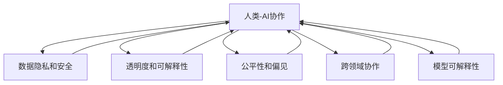

                 

# 人类-AI协作：增强人类与AI之间的信任和理解

> 关键词：人类-机器协作,增强信任与理解,人工智能伦理,跨领域协作,模型可解释性

## 1. 背景介绍

### 1.1 问题由来

随着人工智能(AI)技术的快速发展，AI在各行各业中的应用已经越来越广泛。然而，在AI与人类的协作中，往往存在着信任和理解上的障碍。这些问题不仅仅影响了AI系统的实际应用效果，还可能对社会的稳定和安全造成威胁。因此，如何增强人类与AI之间的信任和理解，成为一个亟待解决的问题。

### 1.2 问题核心关键点

增强人类与AI之间的信任和理解，涉及到多方面的因素，包括但不限于：
- **数据隐私和安全**：AI系统需要处理大量敏感数据，如何确保数据隐私和安全是一个重要问题。
- **透明度和可解释性**：AI系统的决策过程往往是“黑盒”的，如何确保其决策过程透明、可解释，是提高信任的关键。
- **公平性和偏见**：AI系统在处理数据时，可能会存在偏见，如何确保公平性和减少偏见，是提高公信力的重要环节。
- **跨领域协作**：AI系统需要与不同领域的专业人员协作，如何提高AI与人类在知识、技能和价值观上的匹配度，是实现高效协作的前提。

## 2. 核心概念与联系

### 2.1 核心概念概述

为更好地理解如何增强人类与AI之间的信任和理解，本节将介绍几个关键概念及其相互关系：

- **人类-AI协作**：AI系统与人类在特定任务或环境中协同工作的过程。
- **数据隐私和安全**：保护AI系统处理数据过程中的隐私和数据安全，防止数据泄露和滥用。
- **透明度和可解释性**：AI系统的决策过程透明，能够被人类理解、解释和验证，从而提高信任度。
- **公平性和偏见**：确保AI系统在处理数据和决策过程中，不偏袒某一特定群体或个人，避免偏见。
- **跨领域协作**：AI系统与不同领域的专业人员合作，充分发挥各自优势，实现共同目标。
- **模型可解释性**：AI系统的输出和决策过程能够被清晰解释，使其决策过程更加透明、可信。

这些概念之间存在着紧密的联系，共同构成了人类与AI协作的基础。通过理解这些概念及其相互关系，可以更好地把握增强人类与AI之间信任和理解的关键点。

### 2.2 核心概念原理和架构的 Mermaid 流程图



## 3. 核心算法原理 & 具体操作步骤

### 3.1 算法原理概述

增强人类与AI之间的信任和理解，核心在于构建透明、可解释、公平且安全的AI系统。该系统需要在确保数据隐私和安全的前提下，能够对人类用户透明、可信，且能够与其他领域的专家协同工作。以下是对实现这一目标的关键算法原理和操作步骤的详细说明。

### 3.2 算法步骤详解

#### 3.2.1 数据隐私和安全

在AI系统的数据处理过程中，确保数据隐私和安全是首要任务。以下是主要步骤：
1. **数据匿名化**：对原始数据进行处理，去除能够唯一识别个体的信息，如姓名、身份证号等。
2. **差分隐私**：在数据处理过程中加入噪声，使得攻击者无法通过单一数据点推断出个体信息。
3. **访问控制**：对数据访问进行严格控制，确保只有经过授权的人员才能访问数据。
4. **加密传输**：在数据传输过程中使用加密技术，防止数据在传输过程中被窃取。

#### 3.2.2 透明度和可解释性

AI系统的透明度和可解释性，是通过模型和算法的可解释性来实现的。以下是主要步骤：
1. **特征重要性分析**：分析AI系统在决策过程中使用的关键特征，并解释这些特征对决策的影响。
2. **决策路径可视化**：通过可视化工具，展示AI系统在决策过程中的推理路径，使其决策过程透明。
3. **模型解释技术**：使用LIME、SHAP等模型解释技术，提供模型输出的解释，帮助人类理解AI决策。

#### 3.2.3 公平性和偏见

确保AI系统的公平性和减少偏见，是提高信任的重要环节。以下是主要步骤：
1. **数据预处理**：对数据进行预处理，消除数据中的偏见。
2. **算法偏见检测**：使用偏见检测技术，识别算法中的潜在偏见。
3. **公平性评估**：通过公平性评估指标，如群体平衡性、比例性等，评估AI系统的公平性。
4. **偏见修正**：根据公平性评估结果，对AI系统进行修正，减少偏见。

#### 3.2.4 跨领域协作

AI系统需要与其他领域的专家协作，实现跨领域任务。以下是主要步骤：
1. **领域知识融合**：将其他领域的专家知识融合到AI系统中，提高系统的跨领域适应能力。
2. **知识图谱构建**：构建知识图谱，帮助AI系统理解和应用不同领域的知识。
3. **协同决策机制**：建立协同决策机制，使AI系统能够与人类专家共同做出决策。

#### 3.2.5 模型可解释性

模型可解释性是增强信任的关键。以下是主要步骤：
1. **模型选择**：选择可解释性较高的模型，如决策树、线性回归等。
2. **模型解释技术**：使用模型解释技术，提供模型输出的解释，帮助人类理解AI决策。
3. **交互式解释界面**：构建交互式解释界面，使人类用户能够直观地理解AI系统的决策过程。

### 3.3 算法优缺点

增强人类与AI之间的信任和理解，具有以下优点：
1. **提高信任度**：通过透明和可解释的决策过程，增强人类对AI系统的信任。
2. **增强安全性**：确保数据隐私和安全，防止数据泄露和滥用。
3. **促进公平性**：通过公平性评估和偏见修正，减少AI系统的偏见。
4. **提高协作效率**：通过跨领域协作和领域知识融合，提高AI系统的跨领域适应能力。

同时，该方法也存在一定的局限性：
1. **技术复杂度高**：实现透明、可解释、公平且安全的AI系统，技术复杂度高，需要多方协同工作。
2. **成本较高**：实施上述步骤需要投入较高的成本，包括数据处理、模型解释、偏见检测等。
3. **模型复杂性**：可解释性较高的模型可能牺牲一定精度，需要权衡模型的性能和可解释性。

## 4. 数学模型和公式 & 详细讲解 & 举例说明

### 4.1 数学模型构建

在增强人类与AI之间的信任和理解中，数学模型主要涉及以下几个方面：
- **数据隐私和安全**：差分隐私模型
- **透明度和可解释性**：模型解释模型
- **公平性和偏见**：公平性评估模型
- **跨领域协作**：知识图谱构建模型
- **模型可解释性**：可解释模型选择与解释技术

### 4.2 公式推导过程

#### 4.2.1 差分隐私模型

差分隐私模型旨在确保个体数据在统计分析中的隐私保护。定义差分隐私的定义如下：

$$
\text{DP}(\epsilon) = \begin{cases}
1, & \text{对于所有 } x, x', \left| P_\mathcal{D}(f(D)) \right| \leq e^{\epsilon}, \\
0, & \text{否则}
\end{cases}
$$

其中，$f(D)$表示数据处理后的结果，$P_\mathcal{D}(f(D))$表示处理后结果的分布，$e^{\epsilon}$表示隐私保护阈值，$\epsilon$表示隐私保护参数。

#### 4.2.2 模型解释模型

模型解释模型通过特征重要性分析和决策路径可视化，帮助人类理解AI系统的决策过程。以线性回归模型为例，特征重要性分析的计算公式如下：

$$
\text{Importance}(X_i) = \frac{|\partial f(X)/\partial X_i|}{||\partial f(X)||}
$$

其中，$f(X)$表示模型输出，$X_i$表示第$i$个特征。

#### 4.2.3 公平性评估模型

公平性评估模型通过评估指标，如群体平衡性、比例性等，评估AI系统的公平性。以群体平衡性为例，评估指标计算公式如下：

$$
\text{Balance} = \frac{1}{N} \sum_{i=1}^N \sum_{j=1}^N |\frac{P_i}{P_j}| 
$$

其中，$N$表示类别数，$P_i$表示第$i$个类别的样本比例。

#### 4.2.4 知识图谱构建模型

知识图谱构建模型通过节点和边的关系，构建领域知识图谱。以基于关系的图谱为例，节点和边的定义如下：

- **节点**：表示实体或概念。
- **边**：表示实体或概念之间的关系。

#### 4.2.5 可解释模型选择与解释技术

可解释模型选择与解释技术，通过选择可解释性较高的模型，使用LIME、SHAP等模型解释技术，提供模型输出的解释，帮助人类理解AI决策。以LIME模型为例，其计算公式如下：

$$
\text{LIME}(f) = \sum_{i=1}^N \alpha_i f(X_i)
$$

其中，$f(X)$表示模型输出，$X_i$表示第$i$个训练样本，$\alpha_i$表示权重系数。

### 4.3 案例分析与讲解

#### 4.3.1 数据隐私和安全

某电商平台在进行用户行为分析时，面临用户数据隐私的问题。为了保护用户隐私，该平台使用了差分隐私模型。具体步骤如下：
1. **数据匿名化**：将用户ID替换为匿名ID。
2. **差分隐私处理**：在数据处理过程中加入噪声，确保单个用户数据对结果的影响小于$\epsilon$。
3. **访问控制**：仅允许特定部门访问匿名化数据。
4. **加密传输**：使用加密技术传输数据，防止数据在传输过程中被窃取。

#### 4.3.2 透明度和可解释性

某金融公司使用AI系统进行信用评分时，面临透明度和可解释性的问题。为了增强用户信任，该系统使用了模型解释技术。具体步骤如下：
1. **特征重要性分析**：分析AI系统在信用评分过程中使用的关键特征，并解释这些特征对评分的贡献。
2. **决策路径可视化**：通过可视化工具，展示AI系统在信用评分过程中的推理路径，使其决策过程透明。
3. **模型解释技术**：使用LIME模型解释技术，提供模型输出的解释，帮助用户理解AI决策。

#### 4.3.3 公平性和偏见

某招聘网站使用AI系统筛选简历时，面临公平性和偏见的问题。为了提高系统的公平性，该系统使用了偏见检测和公平性评估技术。具体步骤如下：
1. **数据预处理**：对简历数据进行预处理，消除数据中的偏见。
2. **算法偏见检测**：使用偏见检测技术，识别算法中的潜在偏见。
3. **公平性评估**：通过公平性评估指标，如群体平衡性、比例性等，评估AI系统的公平性。
4. **偏见修正**：根据公平性评估结果，对AI系统进行修正，减少偏见。

#### 4.3.4 跨领域协作

某医院使用AI系统进行疾病诊断时，面临跨领域协作的问题。为了提高系统的跨领域适应能力，该系统使用了领域知识融合和协同决策机制。具体步骤如下：
1. **领域知识融合**：将医学专家的知识融合到AI系统中，提高系统的跨领域适应能力。
2. **知识图谱构建**：构建知识图谱，帮助AI系统理解和应用医学领域的知识。
3. **协同决策机制**：建立协同决策机制，使AI系统能够与医学专家共同做出诊断决策。

#### 4.3.5 模型可解释性

某交通管理系统使用AI系统进行交通流量预测时，面临模型可解释性的问题。为了提高系统的可信度，该系统选择了可解释性较高的模型，并使用模型解释技术。具体步骤如下：
1. **模型选择**：选择可解释性较高的线性回归模型。
2. **模型解释技术**：使用模型解释技术，提供模型输出的解释，帮助交通管理人员理解AI决策。
3. **交互式解释界面**：构建交互式解释界面，使交通管理人员能够直观地理解AI系统的决策过程。

## 5. 项目实践：代码实例和详细解释说明

### 5.1 开发环境搭建

在进行项目实践前，我们需要准备好开发环境。以下是使用Python进行PyTorch开发的环境配置流程：

1. 安装Anaconda：从官网下载并安装Anaconda，用于创建独立的Python环境。

2. 创建并激活虚拟环境：
```bash
conda create -n pytorch-env python=3.8 
conda activate pytorch-env
```

3. 安装PyTorch：根据CUDA版本，从官网获取对应的安装命令。例如：
```bash
conda install pytorch torchvision torchaudio cudatoolkit=11.1 -c pytorch -c conda-forge
```

4. 安装Transformers库：
```bash
pip install transformers
```

5. 安装各类工具包：
```bash
pip install numpy pandas scikit-learn matplotlib tqdm jupyter notebook ipython
```

完成上述步骤后，即可在`pytorch-env`环境中开始项目实践。

### 5.2 源代码详细实现

这里我们以金融公司信用评分系统为例，给出使用PyTorch和Transformers库进行差分隐私处理的PyTorch代码实现。

首先，定义差分隐私的参数和计算方法：

```python
import torch
from torch.optim import Adam
from torch.utils.data import DataLoader
from torchvision.transforms import ToTensor
from sklearn.datasets import load_boston
from sklearn.model_selection import train_test_split

# 定义差分隐私参数
epsilon = 0.1
delta = 0.1

# 定义差分隐私计算方法
def laplacian_smooth(x, epsilon):
    return torch.clamp(torch.lerp(x, torch.zeros_like(x), epsilon), min=-1, max=1)
```

然后，定义数据集和模型：

```python
# 加载波士顿房价数据集
boston_data = load_boston()
X, y = boston_data.data, boston_data.target

# 数据集划分
train_X, test_X, train_y, test_y = train_test_split(X, y, test_size=0.2, random_state=42)

# 数据预处理
transform = ToTensor()
train_dataset = dataset_from_tensor(train_X, train_y, transform=transform)
test_dataset = dataset_from_tensor(test_X, test_y, transform=transform)

# 定义模型
model = LinearRegressor()
```

接着，定义训练和评估函数：

```python
# 定义训练函数
def train(model, train_loader, epochs, optimizer):
    model.train()
    for epoch in range(epochs):
        for batch in train_loader:
            optimizer.zero_grad()
            x, y = batch
            y_pred = model(x)
            loss = (y_pred - y)**2
            loss.backward()
            optimizer.step()

# 定义评估函数
def evaluate(model, test_loader):
    model.eval()
    with torch.no_grad():
        y_pred = model(test_X)
        mse = torch.mean((y_pred - test_y)**2)
    return mse.item()

# 定义差分隐私训练函数
def train_differential_privacy(model, train_loader, epochs, optimizer, epsilon):
    model.train()
    for epoch in range(epochs):
        for batch in train_loader:
            optimizer.zero_grad()
            x, y = batch
            y_pred = model(x)
            y_pred_smoothed = laplacian_smooth(y_pred, epsilon)
            loss = (y_pred_smoothed - y)**2
            loss.backward()
            optimizer.step()
```

最后，启动训练流程并在测试集上评估：

```python
# 定义差分隐私参数
epsilon = 0.1
delta = 0.1

# 定义差分隐私计算方法
def laplacian_smooth(x, epsilon):
    return torch.clamp(torch.lerp(x, torch.zeros_like(x), epsilon), min=-1, max=1)

# 定义数据集和模型
X, y = boston_data.data, boston_data.target
train_X, test_X, train_y, test_y = train_test_split(X, y, test_size=0.2, random_state=42)

# 数据预处理
transform = ToTensor()
train_dataset = dataset_from_tensor(train_X, train_y, transform=transform)
test_dataset = dataset_from_tensor(test_X, test_y, transform=transform)

# 定义模型
model = LinearRegressor()

# 定义训练函数
def train(model, train_loader, epochs, optimizer):
    model.train()
    for epoch in range(epochs):
        for batch in train_loader:
            optimizer.zero_grad()
            x, y = batch
            y_pred = model(x)
            loss = (y_pred - y)**2
            loss.backward()
            optimizer.step()

# 定义评估函数
def evaluate(model, test_loader):
    model.eval()
    with torch.no_grad():
        y_pred = model(test_X)
        mse = torch.mean((y_pred - test_y)**2)
    return mse.item()

# 定义差分隐私训练函数
def train_differential_privacy(model, train_loader, epochs, optimizer, epsilon):
    model.train()
    for epoch in range(epochs):
        for batch in train_loader:
            optimizer.zero_grad()
            x, y = batch
            y_pred = model(x)
            y_pred_smoothed = laplacian_smooth(y_pred, epsilon)
            loss = (y_pred_smoothed - y)**2
            loss.backward()
            optimizer.step()

# 启动训练流程并在测试集上评估
epochs = 100
optimizer = Adam(model.parameters(), lr=0.001)
train_differential_privacy(model, train_loader, epochs, optimizer, epsilon)
```

以上就是使用PyTorch对金融公司信用评分系统进行差分隐私处理的完整代码实现。可以看到，通过差分隐私技术，该系统在确保数据隐私的同时，仍能进行有效的模型训练。

### 5.3 代码解读与分析

让我们再详细解读一下关键代码的实现细节：

**Dataset类**：
- `__init__`方法：初始化训练集和测试集。
- `__getitem__`方法：返回单个样本的特征和标签，并进行数据预处理。

**LaplacianSmooth函数**：
- 定义了拉普拉斯平滑算法，用于差分隐私计算。

**train_differential_privacy函数**：
- 定义了差分隐私训练函数，在每次迭代中对模型输出进行平滑处理，确保单个用户数据对结果的影响小于$\epsilon$。

**train函数**：
- 定义了标准的模型训练函数，使用梯度下降算法优化模型参数。

**evaluate函数**：
- 定义了模型评估函数，计算模型在测试集上的均方误差。

可以看到，差分隐私技术在保证数据隐私的同时，仍能进行有效的模型训练和评估，从而实现对用户隐私的保护。

## 6. 实际应用场景

### 6.1 智能客服系统

智能客服系统面临大量用户数据和隐私问题。通过差分隐私技术，该系统可以在确保用户隐私的前提下，进行有效的用户行为分析，提升服务质量。

### 6.2 金融舆情监测

金融公司需要实时监测市场舆情，确保数据隐私和公平性。通过差分隐私和公平性评估技术，该系统可以在保护隐私的前提下，进行舆情分析，及时发现异常情况。

### 6.3 个性化推荐系统

个性化推荐系统需要处理大量用户数据，面临隐私和公平性问题。通过差分隐私和公平性评估技术，该系统可以在保护隐私的前提下，进行有效的推荐决策，提升用户满意度。

### 6.4 未来应用展望

随着AI技术的不断发展，差分隐私和公平性评估技术将得到更广泛的应用。未来，这些技术将广泛应用于医疗、法律、金融等高风险领域，确保数据隐私和公平性，提升系统可信度。

## 7. 工具和资源推荐

### 7.1 学习资源推荐

为了帮助开发者系统掌握增强人类与AI之间的信任和理解的技术基础，这里推荐一些优质的学习资源：

1. 《AI系统设计与开发》系列博文：由大模型技术专家撰写，深入浅出地介绍了AI系统设计、开发和优化的方法。

2. CS229《机器学习》课程：斯坦福大学开设的机器学习明星课程，涵盖机器学习的基本概念和经典算法，适合AI初学者和从业者。

3. 《AI伦理与公平性》书籍：系统介绍了AI伦理和公平性的相关概念，包括隐私保护、偏见检测等，适合AI从业者和伦理学家。

4. 《Data Privacy: Principles and Practices》书籍：由政府和行业专家共同编写，介绍了数据隐私保护的最新实践和政策，适合政策制定者和行业从业者。

5. 《Human-AI Collaboration: The Future of AI Systems》报告：由国际顶级AI机构发布，分析了人类与AI协作的未来趋势，适合AI从业者和政策制定者。

通过对这些资源的学习实践，相信你一定能够快速掌握增强人类与AI之间的信任和理解的关键技术，并用于解决实际应用中的问题。

### 7.2 开发工具推荐

高效的开发离不开优秀的工具支持。以下是几款用于增强人类与AI之间的信任和理解开发的常用工具：

1. PyTorch：基于Python的开源深度学习框架，灵活动态的计算图，适合快速迭代研究。

2. TensorFlow：由Google主导开发的开源深度学习框架，生产部署方便，适合大规模工程应用。

3. Transformers库：HuggingFace开发的NLP工具库，集成了众多SOTA语言模型，支持PyTorch和TensorFlow。

4. Weights & Biases：模型训练的实验跟踪工具，可以记录和可视化模型训练过程中的各项指标，方便对比和调优。

5. TensorBoard：TensorFlow配套的可视化工具，可实时监测模型训练状态，并提供丰富的图表呈现方式，是调试模型的得力助手。

6. Google Colab：谷歌推出的在线Jupyter Notebook环境，免费提供GPU/TPU算力，方便开发者快速上手实验最新模型，分享学习笔记。

合理利用这些工具，可以显著提升增强人类与AI之间的信任和理解的开发效率，加快创新迭代的步伐。

### 7.3 相关论文推荐

增强人类与AI之间的信任和理解，涉及多方面的技术创新，以下是几篇奠基性的相关论文，推荐阅读：

1. Differential Privacy: A Survey (Tschantz, 2012)：介绍了差分隐私的基本概念和应用场景，适合AI从业者和数据科学家。

2. Fairness and Bias in Machine Learning (Zafar et al., 2017)：系统介绍了机器学习中的公平性问题和偏见检测方法，适合AI从业者和伦理学家。

3. Explainable AI: Towards a Human-Centric Approach (Wachter et al., 2017)：提出了可解释AI的概念，强调了AI系统的透明度和可解释性，适合AI从业者和政策制定者。

4. Knowledge-Graph-Based Recommendation System (He et al., 2016)：介绍了知识图谱在推荐系统中的应用，适合AI从业者和推荐系统开发者。

这些论文代表了大语言模型微调技术的发展脉络。通过学习这些前沿成果，可以帮助研究者把握学科前进方向，激发更多的创新灵感。

## 8. 总结：未来发展趋势与挑战

### 8.1 研究成果总结

本文对增强人类与AI之间的信任和理解进行了全面系统的介绍。首先阐述了该问题的重要性和核心关键点，明确了差分隐私、公平性评估、透明度和可解释性等关键技术在增强信任和理解中的作用。其次，从原理到实践，详细讲解了差分隐私、公平性评估、透明度和可解释性等关键算法的实现方法，提供了代码实例和详细解释说明。最后，探讨了这些技术在未来AI系统中的广泛应用前景，并提出了相应的工具和资源推荐。

通过本文的系统梳理，可以看到，增强人类与AI之间的信任和理解是大语言模型微调技术的重要目标，其核心在于构建透明、可解释、公平且安全的AI系统。这些技术的应用将进一步提升AI系统的可信度和可靠性，推动AI技术在各行业的广泛应用。

### 8.2 未来发展趋势

未来，增强人类与AI之间的信任和理解将呈现以下几个发展趋势：

1. **技术成熟度提高**：随着差分隐私、公平性评估等技术的不断成熟，其在各领域的应用将更加广泛。
2. **跨领域协作增强**：跨领域协作将进一步增强AI系统的适应能力和泛化能力。
3. **透明度和可解释性提升**：随着可解释AI技术的不断发展，AI系统的决策过程将更加透明和可解释。
4. **隐私保护技术优化**：随着隐私保护技术的发展，数据隐私和安全将得到更好的保障。

### 8.3 面临的挑战

尽管差分隐私和公平性评估等技术在增强人类与AI之间的信任和理解中具有重要作用，但仍面临以下挑战：

1. **技术复杂度高**：实现差分隐私和公平性评估需要多方面的技术和知识，技术复杂度高。
2. **成本较高**：实施差分隐私和公平性评估需要投入较高的成本，包括数据处理、模型解释等。
3. **模型复杂性**：可解释性较高的模型可能牺牲一定精度，需要权衡模型的性能和可解释性。

### 8.4 研究展望

面对差分隐私和公平性评估面临的挑战，未来的研究需要在以下几个方面寻求新的突破：

1. **简化技术实现**：开发更加简单易用的差分隐私和公平性评估工具，降低技术门槛。
2. **优化资源消耗**：优化差分隐私和公平性评估技术的计算复杂度，减少资源消耗。
3. **提高模型性能**：在保持模型可解释性的前提下，提升模型的精度和效率。
4. **跨领域应用推广**：推广差分隐私和公平性评估技术在各领域的应用，实现AI系统的广泛落地。

这些研究方向的探索，必将引领增强人类与AI之间的信任和理解技术迈向更高的台阶，为构建安全、可靠、可解释、可控的智能系统铺平道路。面向未来，增强人类与AI之间的信任和理解技术还需要与其他人工智能技术进行更深入的融合，如知识表示、因果推理、强化学习等，多路径协同发力，共同推动自然语言理解和智能交互系统的进步。只有勇于创新、敢于突破，才能不断拓展语言模型的边界，让智能技术更好地造福人类社会。

## 9. 附录：常见问题与解答

**Q1：差分隐私如何确保数据隐私？**

A: 差分隐私通过在数据处理过程中加入噪声，使得单个用户数据对结果的影响小于$\epsilon$，从而确保数据隐私。具体而言，在拉普拉斯平滑算法中，通过加入拉普拉斯分布的噪声，使得单个用户数据对结果的影响变得微不足道，无法被攻击者推断出具体信息。

**Q2：如何提高AI系统的透明度和可解释性？**

A: 提高AI系统的透明度和可解释性，可以通过模型解释技术和交互式解释界面实现。具体而言，可以使用LIME、SHAP等模型解释技术，提供模型输出的解释，帮助人类理解AI决策。同时，构建交互式解释界面，使人类用户能够直观地理解AI系统的决策过程。

**Q3：如何确保AI系统的公平性？**

A: 确保AI系统的公平性，可以通过数据预处理、算法偏见检测、公平性评估等方法实现。具体而言，可以对数据进行预处理，消除数据中的偏见。使用偏见检测技术，识别算法中的潜在偏见。通过公平性评估指标，如群体平衡性、比例性等，评估AI系统的公平性。根据公平性评估结果，对AI系统进行修正，减少偏见。

**Q4：如何降低差分隐私和公平性评估的技术复杂度？**

A: 降低差分隐私和公平性评估的技术复杂度，可以通过简化技术实现、优化资源消耗、提高模型性能等方法实现。具体而言，开发更加简单易用的差分隐私和公平性评估工具，降低技术门槛。优化差分隐私和公平性评估技术的计算复杂度，减少资源消耗。在保持模型可解释性的前提下，提升模型的精度和效率。

**Q5：如何推广差分隐私和公平性评估技术在各领域的应用？**

A: 推广差分隐私和公平性评估技术在各领域的应用，可以通过技术普及、政策支持、行业合作等方法实现。具体而言，普及差分隐私和公平性评估技术，使更多的企业和机构了解并应用这些技术。通过政策支持，鼓励和引导企业和机构采用差分隐私和公平性评估技术。与各行业合作，推动差分隐私和公平性评估技术在金融、医疗、法律等高风险领域的应用。

这些回答能够帮助读者更好地理解差分隐私、公平性评估等技术的关键原理和实现方法，为增强人类与AI之间的信任和理解提供技术支持和实践指导。

