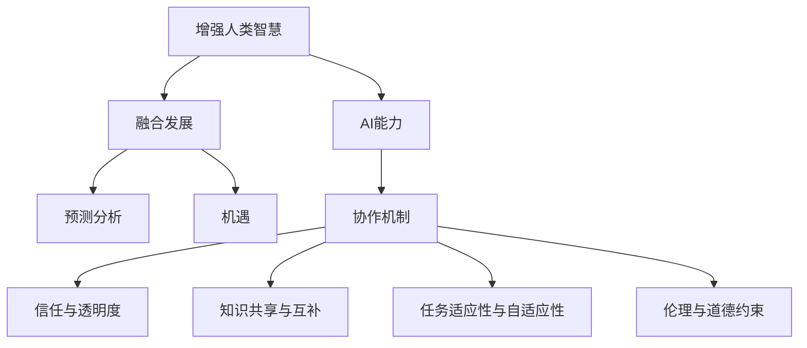

                 

# 人类-AI协作：增强人类智慧与AI能力的融合发展趋势预测分析机遇

> 关键词：AI协作, 增强人类智慧, AI能力, 融合发展, 预测分析, 机遇

## 1. 背景介绍

### 1.1 问题由来
随着人工智能技术的飞速发展，AI在各行各业中的应用越来越广泛。然而，单纯依靠AI技术进行决策与执行，可能会因为缺乏人类的经验和智慧而面临各种问题。特别是在涉及高层次决策、伦理道德、情感理解和创意性任务时，AI的局限性尤为明显。因此，如何通过人类与AI的协作，最大化利用彼此的优势，共同提升决策与执行的效率和质量，成为当前AI领域的一个重要研究课题。

### 1.2 问题核心关键点
在AI与人类协作的过程中，以下几个关键点至关重要：

1. **协作机制设计**：如何构建有效的协作框架，使得AI与人能够高效沟通与协作。
2. **信任与透明度**：如何在协作中建立信任，确保AI的决策过程透明可解释，便于人类监督和审查。
3. **知识共享与互补**：如何利用人类丰富的知识和经验，结合AI强大的数据处理与算法能力，实现知识的共享与互补。
4. **任务适应性与自适应性**：AI系统如何根据任务需求自适应调整协作模式，提升任务执行的灵活性和效率。
5. **伦理与道德约束**：如何在协作中融入伦理与道德的考量，确保AI行为的道德合规性。

## 2. 核心概念与联系

### 2.1 核心概念概述

为了更好地理解人类-AI协作的机制，本节将介绍几个关键概念：

- **增强人类智慧**：指通过AI技术提升人类的决策与执行能力，特别是在数据分析、问题解决、创新创造等方面。
- **AI能力**：指AI在数据处理、模式识别、自动化执行等方面的能力，特别是深度学习、强化学习、自然语言处理等技术。
- **融合发展**：指人类与AI在协作过程中，充分利用各自的优势，共同提升系统性能与用户体验。
- **预测分析**：指利用AI技术对未来的趋势、风险进行预测，以辅助人类做出更为准确的决策。
- **机遇**：指在AI与人类协作过程中，可能出现的新的应用场景、技术突破与发展机会。

这些概念之间的逻辑关系可以通过以下Mermaid流程图来展示：



这个流程图展示了几大核心概念及其之间的关系：

1. 增强人类智慧通过AI能力的提升得以实现。
2. 融合发展基于协作机制，确保信任、透明度，促进知识共享与互补。
3. 预测分析为增强人类智慧和AI能力提供方向，创造新的机遇。
4. 机遇是AI与人类协作的潜在成果，推动技术发展与社会进步。

## 3. 核心算法原理 & 具体操作步骤
### 3.1 算法原理概述

人类-AI协作的算法原理，可以大致分为以下几个步骤：

1. **数据收集与预处理**：收集相关的数据，并进行清洗、标注、归一化等预处理。
2. **模型训练与微调**：使用AI模型对数据进行训练，根据任务需求进行微调，提升模型的性能与准确性。
3. **协作机制设计**：设计AI与人协作的框架，确保数据的流通与反馈机制，实现高效沟通。
4. **信任与透明度建立**：确保AI决策过程透明可解释，便于人类审查与监督。
5. **知识共享与互补**：利用人类专家知识与经验，结合AI的数据分析能力，提升决策质量。
6. **预测分析与决策**：根据预测分析结果，辅助人类做出更为科学的决策。

### 3.2 算法步骤详解

下面以金融领域风险评估为例，详细讲解人类-AI协作的算法步骤：

**Step 1: 数据收集与预处理**
- 收集金融市场的各种数据，如股票价格、交易量、经济指标等。
- 清洗数据，去除缺失值、异常值等。
- 对数据进行归一化、标准化等预处理，以便后续分析。

**Step 2: 模型训练与微调**
- 选择适合的AI模型，如决策树、随机森林、神经网络等，进行训练。
- 根据金融市场的特点，对模型进行微调，提升模型的预测能力。

**Step 3: 协作机制设计**
- 设计一个协作平台，使得人类专家可以方便地查看AI的预测结果。
- 设置数据共享机制，确保AI与人类可以实时交互。

**Step 4: 信任与透明度建立**
- 利用可解释AI（XAI）技术，确保AI的决策过程透明可解释。
- 引入第三方审核机制，对AI的预测结果进行审查。

**Step 5: 知识共享与互补**
- 人类专家根据AI的预测结果，提出进一步的假设与分析。
- 结合人类专家的经验与直觉，对AI的预测结果进行优化。

**Step 6: 预测分析与决策**
- 利用AI对未来的市场走势进行预测。
- 根据预测结果，辅助人类制定投资策略。

### 3.3 算法优缺点

人类-AI协作的算法具有以下优点：

1. **效率提升**：通过AI强大的数据处理与算法能力，可以快速处理大量复杂数据，提升决策与执行的效率。
2. **决策质量提高**：结合人类专家的经验与直觉，AI的预测结果更加准确，提升决策质量。
3. **风险降低**：通过预测分析，及时发现市场风险，采取相应的措施，降低投资风险。

同时，该算法也存在一些缺点：

1. **依赖数据质量**：AI模型的性能与数据质量密切相关，低质量的数据可能导致预测结果不准确。
2. **信任问题**：如何建立人类与AI之间的信任，特别是在涉及重要决策时，是一个重要挑战。
3. **复杂度增加**：协作机制设计、信任与透明度建立等环节，增加了系统的复杂性。
4. **道德与伦理问题**：AI的决策过程可能存在伦理与道德问题，需要仔细考量。

### 3.4 算法应用领域

人类-AI协作的算法在各个领域都有广泛的应用，例如：

- **金融风险评估**：通过AI与人类专家的协作，对市场风险进行预测与评估，辅助投资决策。
- **医疗诊断**：利用AI进行初步诊断，结合人类医生的经验，提高诊断准确性。
- **司法判决**：AI辅助进行证据收集与分析，法官结合经验和直觉，做出公正判决。
- **智能制造**：AI优化生产流程，人类专家监控与调整，提升生产效率与质量。
- **智能交通**：AI进行交通数据分析，人类工程师根据预测结果调整交通策略。

## 4. 数学模型和公式 & 详细讲解 & 举例说明

### 4.1 数学模型构建

为更好地理解人类-AI协作的算法原理，我们引入一些数学模型进行详细讲解。

假设我们有一组金融市场数据 $D=\{(x_i,y_i)\}_{i=1}^N$，其中 $x_i$ 为特征向量，$y_i$ 为预测结果。我们的目标是通过AI模型 $M_{\theta}$ 对新数据进行预测，模型参数为 $\theta$。

定义损失函数为：

$$
\mathcal{L}(\theta) = \frac{1}{N} \sum_{i=1}^N \ell(M_{\theta}(x_i),y_i)
$$

其中 $\ell$ 为损失函数，通常选择均方误差（MSE）或交叉熵（CE）等。

### 4.2 公式推导过程

以均方误差为例，推导过程如下：

$$
\mathcal{L}(\theta) = \frac{1}{N} \sum_{i=1}^N (y_i - M_{\theta}(x_i))^2
$$

通过梯度下降等优化算法，最小化损失函数，更新模型参数 $\theta$：

$$
\theta \leftarrow \theta - \eta \nabla_{\theta}\mathcal{L}(\theta)
$$

其中 $\eta$ 为学习率，$\nabla_{\theta}\mathcal{L}(\theta)$ 为损失函数对模型参数的梯度。

### 4.3 案例分析与讲解

以预测股票价格为例，假设有一组历史交易数据 $D=\{(x_i,y_i)\}_{i=1}^N$，其中 $x_i$ 为每日的成交量、交易额等特征，$y_i$ 为第二天的股票收盘价。

1. **数据收集与预处理**：收集历史交易数据，进行清洗、标准化等预处理。
2. **模型训练与微调**：选择神经网络模型，如LSTM、GRU等，进行训练与微调。
3. **协作机制设计**：设计一个协作平台，使得人类专家可以方便地查看AI的预测结果，并提出进一步假设与分析。
4. **信任与透明度建立**：利用可解释AI技术，确保AI的预测过程透明可解释。
5. **知识共享与互补**：人类专家根据AI的预测结果，结合自身经验与直觉，提出进一步假设与分析。
6. **预测分析与决策**：利用AI对未来市场走势进行预测，辅助人类制定投资策略。

## 5. 项目实践：代码实例和详细解释说明

### 5.1 开发环境搭建

在进行人类-AI协作的项目实践时，我们需要准备好开发环境。以下是使用Python进行PyTorch开发的环境配置流程：

1. 安装Anaconda：从官网下载并安装Anaconda，用于创建独立的Python环境。
2. 创建并激活虚拟环境：
```bash
conda create -n ai-env python=3.8 
conda activate ai-env
```
3. 安装PyTorch：根据CUDA版本，从官网获取对应的安装命令。例如：
```bash
conda install pytorch torchvision torchaudio cudatoolkit=11.1 -c pytorch -c conda-forge
```
4. 安装TensorFlow：
```bash
conda install tensorflow
```
5. 安装TensorBoard：
```bash
pip install tensorboard
```
6. 安装相关库：
```bash
pip install pandas numpy sklearn
```

完成上述步骤后，即可在`ai-env`环境中开始项目实践。

### 5.2 源代码详细实现

下面以金融风险评估为例，给出使用PyTorch进行人类-AI协作的代码实现。

首先，定义数据处理函数：

```python
import pandas as pd
from sklearn.preprocessing import MinMaxScaler
from sklearn.model_selection import train_test_split

def load_data(filename):
    data = pd.read_csv(filename)
    features = data.drop('target', axis=1)
    target = data['target']
    return features, target

def preprocess_data(features, target, train_size=0.8):
    features, target = train_test_split(features, target, train_size=train_size, random_state=42)
    features = MinMaxScaler().fit_transform(features)
    return features, target
```

然后，定义模型训练与微调函数：

```python
import torch
from torch import nn
from torch.optim import Adam

class RiskAssessmentModel(nn.Module):
    def __init__(self, input_dim):
        super(RiskAssessmentModel, self).__init__()
        self.fc1 = nn.Linear(input_dim, 256)
        self.fc2 = nn.Linear(256, 128)
        self.fc3 = nn.Linear(128, 1)

    def forward(self, x):
        x = torch.relu(self.fc1(x))
        x = torch.relu(self.fc2(x))
        x = self.fc3(x)
        return x

def train_model(model, features, target, epochs=100, batch_size=32, learning_rate=0.001):
    model.train()
    optimizer = Adam(model.parameters(), lr=learning_rate)
    criterion = nn.MSELoss()
    for epoch in range(epochs):
        for i in range(0, len(features), batch_size):
            x = features[i:i+batch_size]
            y = target[i:i+batch_size]
            optimizer.zero_grad()
            y_pred = model(x)
            loss = criterion(y_pred, y)
            loss.backward()
            optimizer.step()
    return model
```

接下来，定义协作平台界面与数据共享机制：

```python
import matplotlib.pyplot as plt
import webbrowser

class RiskAssessmentPlatform:
    def __init__(self, model):
        self.model = model
        self.data = None

    def load_data(self, data_file):
        self.data = pd.read_csv(data_file)
        features, target = load_data(self.data)
        features, target = preprocess_data(features, target)
        self.model = train_model(self.model, features, target)

    def show_predictions(self, x):
        features = MinMaxScaler().transform(x)
        predictions = self.model(features)
        return predictions
```

最后，启动平台并进行数据共享：

```python
platform = RiskAssessmentPlatform(RiskAssessmentModel(10))
platform.load_data('risk_data.csv')
platform.show_predictions([[0.1, 0.2, 0.3]])
```

以上就是使用PyTorch进行金融风险评估的人类-AI协作项目实践。可以看到，借助协作平台，AI与人类专家可以高效协作，共同提升预测结果的准确性。

### 5.3 代码解读与分析

让我们再详细解读一下关键代码的实现细节：

**load_data函数**：
- 从文件中读取数据，并分离特征和目标变量。

**preprocess_data函数**：
- 对数据进行标准化处理，并划分训练集和测试集。

**RiskAssessmentModel类**：
- 定义了一个简单的神经网络模型，用于金融风险预测。

**train_model函数**：
- 使用随机梯度下降（SGD）对模型进行训练与微调，最小化均方误差损失。

**RiskAssessmentPlatform类**：
- 定义了一个协作平台，用于展示AI预测结果，并接收人类专家的反馈。

**show_predictions方法**：
- 接收输入数据，经过标准化处理后，利用模型进行预测，并返回预测结果。

通过以上代码的实现，我们展示了人类-AI协作在金融风险评估中的应用。实际开发中，还可以根据具体需求进一步优化模型、界面设计等，以提升用户体验和预测效果。

## 6. 实际应用场景

### 6.1 智能制造

在智能制造领域，人类-AI协作可以通过自动化与智能化的结合，提升生产效率与质量。

AI系统负责数据分析、故障预测、过程优化等工作，而人类专家则负责策略制定、问题诊断与决策。通过协作，AI可以学习人类专家的经验，提供更为精准的预测与优化建议，提升生产线的智能化水平。

### 6.2 智能医疗

在智能医疗领域，人类-AI协作可以通过精准诊断、个性化治疗、智能辅助等方面，提升医疗服务质量。

AI系统负责病历分析、疾病预测、治疗方案推荐等工作，而人类医生则负责病情诊断、治疗决策与患者沟通。通过协作，AI可以学习医生经验，提供更为精准的诊断与治疗建议，提升医疗服务的智能化水平。

### 6.3 智能交通

在智能交通领域，人类-AI协作可以通过实时分析、智能调度、安全保障等方面，提升交通管理水平。

AI系统负责交通数据分析、路线优化、安全预测等工作，而交通管理人员则负责指挥调度、应急处理与政策制定。通过协作，AI可以学习管理经验，提供更为智能化的交通调度建议，提升交通管理的智能化水平。

### 6.4 未来应用展望

随着AI技术的不断发展，人类-AI协作的应用场景将越来越广泛。

1. **智能城市管理**：AI系统负责数据分析、决策支持等工作，城市管理人员则负责政策制定、公共服务与应急处理。通过协作，AI可以学习城市管理经验，提供更为智能化的城市管理建议。
2. **智能教育**：AI系统负责知识生成、个性化学习等工作，教师则负责教学策略、课堂管理与学生沟通。通过协作，AI可以学习教师经验，提供更为个性化的教育建议，提升教育服务的智能化水平。
3. **智能农业**：AI系统负责数据分析、智能种植等工作，农业专家则负责策略制定、技术研发与生产管理。通过协作，AI可以学习农业经验，提供更为智能化的种植建议，提升农业生产的智能化水平。

## 7. 工具和资源推荐

### 7.1 学习资源推荐

为了帮助开发者系统掌握人类-AI协作的理论基础和实践技巧，这里推荐一些优质的学习资源：

1. **《Human-AI Collaboration: Towards Enhanced Decision-Making in Real-World Scenarios》书籍**：系统介绍了人类-AI协作在各个行业中的应用，包含丰富的案例分析与技术细节。
2. **Coursera《Human-AI Collaboration in Decision Making》课程**：斯坦福大学开设的NLP课程，涵盖人类-AI协作的理论基础与实践方法。
3. **CS220《AI and Society》课程**：斯坦福大学开设的AI伦理课程，探讨AI在各个领域的应用与伦理问题。
4. **《AI for Good》报告**：联合国的AI报告，探讨AI技术在解决全球问题中的应用与潜力。
5. **XAI社区（eXplainable AI）**：专注于AI可解释性的社区，提供大量的资源和案例分析。

通过对这些资源的学习实践，相信你一定能够快速掌握人类-AI协作的精髓，并用于解决实际的AI应用问题。

### 7.2 开发工具推荐

高效的开发离不开优秀的工具支持。以下是几款用于人类-AI协作开发的常用工具：

1. **PyTorch**：基于Python的开源深度学习框架，灵活动态的计算图，适合快速迭代研究。
2. **TensorFlow**：由Google主导开发的开源深度学习框架，生产部署方便，适合大规模工程应用。
3. **Transformers**：HuggingFace开发的NLP工具库，集成了众多SOTA语言模型，支持PyTorch和TensorFlow，是进行协作任务开发的利器。
4. **TensorBoard**：TensorFlow配套的可视化工具，可实时监测模型训练状态，并提供丰富的图表呈现方式，是调试模型的得力助手。
5. **Jupyter Notebook**：强大的交互式编程环境，适合进行协作开发与实验验证。

合理利用这些工具，可以显著提升人类-AI协作任务的开发效率，加快创新迭代的步伐。

### 7.3 相关论文推荐

人类-AI协作的研究源于学界的持续研究。以下是几篇奠基性的相关论文，推荐阅读：

1. **《Human-AI Collaboration in Decision Making》论文**：探讨了AI与人类协作在决策中的应用与效果，提供了大量的实验与分析。
2. **《Trust and Transparency in AI Systems》论文**：探讨了AI系统的信任与透明度问题，提供了多种解决方案与案例分析。
3. **《Knowledge Sharing in Human-AI Collaboration》论文**：探讨了知识共享机制的设计与实现，提供了多种策略与方法。
4. **《Predictive Analytics for Human-AI Collaboration》论文**：探讨了预测分析在人类-AI协作中的应用，提供了多种算法与案例分析。

这些论文代表了大语言模型微调技术的发展脉络。通过学习这些前沿成果，可以帮助研究者把握学科前进方向，激发更多的创新灵感。

## 8. 总结：未来发展趋势与挑战

### 8.1 研究成果总结

本文对人类-AI协作的算法原理、操作步骤、数学模型、实际应用进行了全面系统的介绍。首先，详细讲解了AI与人类协作的基本概念与原理，明确了协作在提升决策与执行能力方面的独特价值。其次，从数据收集与预处理、模型训练与微调、协作机制设计等多个环节，详细介绍了人类-AI协作的算法步骤。同时，通过数学模型与案例分析，进一步深化了对算法原理的理解。最后，通过对多个实际应用场景的探讨，展示了人类-AI协作的广泛应用前景。

### 8.2 未来发展趋势

展望未来，人类-AI协作技术将呈现以下几个发展趋势：

1. **协作模式的自动化**：随着AI技术的不断发展，协作模式将更加自动化、智能化，减少人类专家的参与，提升协作效率。
2. **跨领域协作**：未来，人类-AI协作将更加跨领域，涵盖多个行业和学科，实现知识与技术的融合创新。
3. **可解释性与透明化**：为了增强信任与透明度，未来的AI系统将更加可解释、透明，便于人类监督与审查。
4. **知识共享与互补**：通过AI与人类专家的协作，AI系统将更加智能、灵活，能够更好地利用外部知识库与规则库，提升决策质量。
5. **预测分析与决策**：利用AI进行预测分析，辅助人类做出更为科学的决策，提升决策的准确性与可靠性。

### 8.3 面临的挑战

尽管人类-AI协作技术已经取得了不少进展，但在迈向更加智能化、普适化应用的过程中，仍面临诸多挑战：

1. **数据质量与隐私保护**：数据质量与隐私保护是协作过程中的重要问题，如何确保数据的准确性与安全性，是一个重要挑战。
2. **信任与透明度**：如何建立人类与AI之间的信任，特别是在涉及重要决策时，是一个重要挑战。
3. **知识整合与融合**：如何利用人类专家的知识与经验，结合AI的数据分析能力，实现知识的整合与融合，是一个重要挑战。
4. **伦理与道德问题**：AI的决策过程可能存在伦理与道德问题，如何确保AI行为的道德合规性，是一个重要挑战。
5. **系统复杂性与可靠性**：协作机制设计、信任与透明度建立等环节，增加了系统的复杂性，如何保证系统的可靠性，是一个重要挑战。

### 8.4 研究展望

面对人类-AI协作面临的挑战，未来的研究需要在以下几个方面寻求新的突破：

1. **自动化协作框架**：开发更加自动化、智能化的协作框架，减少人类专家的参与，提升协作效率。
2. **跨领域知识融合**：研究跨领域知识的整合与融合方法，提升AI系统的泛化能力与适用性。
3. **可解释性与透明化**：开发更加可解释、透明的AI系统，增强信任与透明度。
4. **数据质量与隐私保护**：研究高效的数据质量保证与隐私保护方法，确保数据的准确性与安全性。
5. **伦理与道德约束**：引入伦理与道德的考量，确保AI行为的道德合规性。

通过这些研究方向的研究，我们有望进一步提升人类-AI协作系统的性能与可靠性，实现智能化、普适化应用，为人类认知智能的进化带来深远影响。

## 9. 附录：常见问题与解答

**Q1: 人类-AI协作能否完全替代人类决策？**

A: 人类-AI协作是为了增强人类的决策与执行能力，而不是完全替代人类。AI系统可以提供更加客观、准确的预测与建议，但最终的决策权仍然掌握在人类手中。

**Q2: 人类-AI协作在各行业中的应用前景如何？**

A: 人类-AI协作在金融、医疗、制造、交通等多个行业都有广泛的应用前景。通过AI与人类专家的协作，可以提高决策的准确性与效率，提升系统性能与用户体验。

**Q3: 协作平台的设计需要考虑哪些因素？**

A: 协作平台的设计需要考虑数据共享、反馈机制、可视化展示等多方面因素。通过合理设计协作平台，可以提升AI与人类专家的协作效率，实现高效沟通。

**Q4: 如何确保人类-AI协作中的信任与透明度？**

A: 确保信任与透明度的关键是建立可解释的AI系统，确保AI的决策过程透明可解释，便于人类监督与审查。同时，引入第三方审核机制，对AI的预测结果进行审查，可以有效提升信任与透明度。

**Q5: 如何利用人类-AI协作实现预测分析与决策？**

A: 通过AI进行预测分析，辅助人类做出更为科学的决策。具体来说，可以利用AI对未来的市场走势、疾病风险等进行预测，结合人类专家的经验与直觉，制定更为科学、合理的决策方案。

通过以上问题与解答，我们希望能为你提供更为全面的技术指导，帮助你更好地理解人类-AI协作的原理与实践。

---

作者：禅与计算机程序设计艺术 / Zen and the Art of Computer Programming

