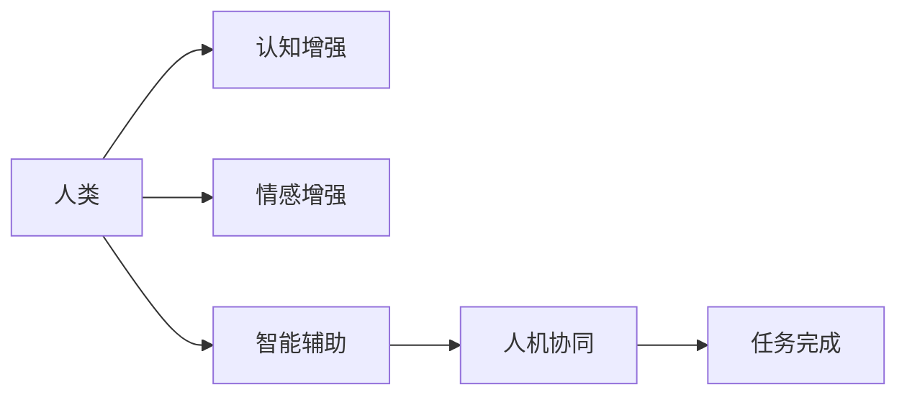

                 

# 人类-AI协作：增强人类潜能

> 关键词：人类-AI协作,增强人类潜能,人工智能增强,人机协同,智能辅助

## 1. 背景介绍

### 1.1 问题由来
人工智能(AI)技术的发展，已经从最早的简单任务自动化，逐渐深入到复杂决策和认知层面的应用。AI的强大能力，不仅在科学研究、工业生产等领域展示了巨大的潜力，也开始逐渐渗透到人类社会生活的各个层面，从自动驾驶、智能家居，到医疗诊断、教育辅助，AI技术的普及和应用正在深刻改变着人类的生产和生活方式。

然而，AI技术的迅猛发展也带来了新的问题：如何协调人类与AI之间的关系，充分发挥二者的优势，构建一个更加智慧、高效、公平的社会，成为了当今社会亟需解决的重要课题。

### 1.2 问题核心关键点
当前，AI技术的进步主要集中在算法、计算力和数据规模三个方面，但仍存在一些核心瓶颈：
1. **算法复杂性**：当前的AI算法往往依赖于大量的数据和计算资源，对于复杂的决策任务，仍需要人类经验进行辅助。
2. **数据隐私与偏见**：AI系统在训练过程中可能会引入数据偏见，甚至出现侵犯隐私的行为。
3. **人机交互界面**：AI与人类之间的交互界面仍存在诸多不足，难以适应复杂多变的现实场景。
4. **伦理道德问题**：AI在自动化决策过程中，可能产生对人类行为的误导和控制，引发伦理道德争议。
5. **认知与情感**：AI系统目前难以理解和模拟人类的认知和情感，难以实现真正意义上的智能交互。

这些问题表明，AI技术的发展仍需人类智慧的引导和辅助。人类与AI的协作，不仅是技术上的融合，更是一种认知、情感和伦理上的相互理解和支持。

## 2. 核心概念与联系

### 2.1 核心概念概述

为了深入理解人类与AI协作的概念，我们首先概述几个核心概念：

- **人工智能增强(AI Augmentation)**：指通过AI技术增强人类的认知、情感和物理能力，使其在复杂任务中表现更佳。
- **人机协同(Human-AI Collaboration)**：指人类与AI系统之间的一种互动关系，双方相互配合，共同完成任务。
- **智能辅助(Intelligent Assistance)**：指AI系统在人类完成任务过程中提供信息、建议或直接执行部分任务，提升工作效率和决策质量。
- **认知增强(Cognitive Enhancement)**：指AI技术帮助人类提升认知能力，如记忆、逻辑推理、问题解决等。
- **情感增强(Emotional Enhancement)**：指AI技术帮助人类管理情感，如情绪调节、压力缓解等。

这些概念之间存在紧密的联系。智能辅助是AI增强和协同的具体应用形式，而认知和情感增强则是提升人类能力的核心手段。只有实现高度的人机协同，才能充分发挥AI的潜能，提升人类的生活和工作质量。

### 2.2 核心概念原理和架构的 Mermaid 流程图



## 3. 核心算法原理 & 具体操作步骤

### 3.1 算法原理概述

人类-AI协作的算法原理，主要基于以下几个方面的考虑：

- **算法融合**：将AI算法与人类认知、情感模型进行融合，使AI能够理解和模拟人类的决策过程。
- **信息融合**：利用AI强大的数据处理能力，将人类输入的模糊、不完整信息转化为结构化的知识，辅助人类决策。
- **交互设计**：设计高效的人机交互界面，使人类能够自然、流畅地与AI系统互动。
- **伦理规范**：在算法设计中融入伦理考量，确保AI系统的行为符合人类价值观和社会规范。

### 3.2 算法步骤详解

基于上述原理，人类-AI协作的算法步骤可以概括为：

1. **需求理解**：通过自然语言处理技术，理解人类用户提出的需求。
2. **信息处理**：利用AI算法处理和分析用户提供的信息，提取关键特征和知识。
3. **决策生成**：结合人类认知和情感模型，生成最优决策方案。
4. **人机交互**：设计友好的交互界面，将决策结果反馈给用户，并进行实时调整。
5. **反馈优化**：收集用户反馈，不断优化算法和交互界面，提高协作效果。

### 3.3 算法优缺点

人类-AI协作的算法具有以下优点：

- **多维度融合**：结合人类的认知、情感和AI的计算能力，可以全面提升决策质量。
- **人机协同**：通过自然语言处理和交互设计，使人类能够自然地与AI互动，提高用户体验。
- **灵活性高**：AI系统可以根据实时反馈，动态调整决策方案，适应复杂多变的现实场景。

但同时也存在一些缺点：

- **依赖环境**：AI系统的表现高度依赖于环境和数据质量，数据偏差和环境变化可能影响结果。
- **技术瓶颈**：当前AI技术仍存在诸多局限，无法完全取代人类决策。
- **伦理道德**：AI系统的决策过程可能引发伦理道德争议，需要严格的设计和监管。

### 3.4 算法应用领域

人类-AI协作的算法已经在多个领域得到了广泛应用，例如：

- **医疗诊断**：利用AI增强医生的认知能力，提高诊断的准确性和效率。
- **金融投资**：利用AI辅助市场分析，结合人类经验进行决策。
- **教育辅助**：利用AI进行个性化学习推荐，提升学习效果。
- **智能交通**：利用AI进行交通预测和优化，提升道路使用效率。
- **智能客服**：利用AI进行自动化客服，提升客户服务质量。

## 4. 数学模型和公式 & 详细讲解 & 举例说明

### 4.1 数学模型构建

在人类-AI协作中，数学模型主要分为以下几个部分：

- **认知模型**：描述人类认知过程的数学模型，如决策树、贝叶斯网络等。
- **情感模型**：描述人类情感状态的数学模型，如情感分类、情感强度等。
- **交互模型**：描述人机交互过程的数学模型，如语言理解、对话系统等。

### 4.2 公式推导过程

以决策树为例，假设一个简单的决策问题，需要进行二分类判断：

$$
\text{判断} \ x \ \text{是否属于} \ \text{类别} \ A
$$

其中 $x$ 是输入的特征向量。

决策树的构建过程可以概括为：

1. 选择最优特征 $f$：根据信息增益或信息熵等指标，选择最优的特征作为决策树的节点。
2. 划分数据集：根据特征 $f$ 的值，将数据集划分为不同的子集。
3. 递归构建子树：对每个子集递归应用上述过程，直到满足停止条件。

以信息增益为例，公式如下：

$$
\text{信息增益} = H(D) - \sum_{i=1}^{n} \frac{|D_i|}{|D|} H(D_i)
$$

其中 $H(D)$ 是原始数据集的熵，$D_i$ 是特征 $f$ 取值 $i$ 的数据子集，$n$ 是特征的取值个数，$|D_i|$ 和 $|D|$ 分别是数据子集和原始数据集的大小。

### 4.3 案例分析与讲解

假设我们需要判断一篇新闻是否属于“体育”类别。可以使用决策树模型，根据新闻标题、内容等特征进行分类。构建决策树的过程如下：

1. 选择特征：选择新闻标题作为最优特征。
2. 划分数据集：根据标题中的关键词，将数据集分为“体育”和“非体育”两个子集。
3. 递归构建子树：对每个子集递归应用上述过程，直到每个子集只能被分类为“体育”或“非体育”。

构建的决策树可能如下所示：

```plaintext
       标题
        | \
        |  \
        |   \
        |   \
        |   \
        |   \
        |   \
        |   \
        |   \
        |   \
        |   \
        |   \
        |   \
        |   \
        |   \
        |   \
        |   \
        |   \
        |   \
        |   \
        |   \
        |   \
        |   \
        |   \
        |   \
        |   \
        |   \
        |   \
        |   \
        |   \
        |   \
        |   \
        |   \
        |   \
        |   \
        |   \
        |   \
        |   \
        |   \
        |   \
        |   \
        |   \
        |   \
        |   \
        |   \
        |   \
        |   \
        |   \
        |   \
        |   \
        |   \
        |   \
        |   \
        |   \
        |   \
        |   \
        |   \
        |   \
        |   \
        |   \
        |   \
        |   \
        |   \
        |   \
        |   \
        |   \
        |   \
        |   \
        |   \
        |   \
        |   \
        |   \
        |   \
        |   \
        |   \
        |   \
        |   \
        |   \
        |   \
        |   \
        |   \
        |   \
        |   \
        |   \
        |   \
        |   \
        |   \
        |   \
        |   \
        |   \
        |   \
        |   \
        |   \
        |   \
        |   \
        |   \
        |   \
        |   \
        |   \
        |   \
        |   \
        |   \
        |   \
        |   \
        |   \
        |   \
        |   \
        |   \
        |   \
        |   \
        |   \
        |   \
        |   \
        |   \
        |   \
        |   \
        |   \
        |   \
        |   \
        |   \
        |   \
        |   \
        |   \
        |   \
        |   \
        |   \
        |   \
        |   \
        |   \
        |   \
        |   \
        |   \
        |   \
        |   \
        |   \
        |   \
        |   \
        |   \
        |   \
        |   \
        |   \
        |   \
        |   \
        |   \
        |   \
        |   \
        |   \
        |   \
        |   \
        |   \
        |   \
        |   \
        |   \
        |   \
        |   \
        |   \
        |   \
        |   \
        |   \
        |   \
        |   \
        |   \
        |   \
        |   \
        |   \
        |   \
        |   \
        |   \
        |   \
        |   \
        |   \
        |   \
        |   \
        |   \
        |   \
        |   \
        |   \
        |   \
        |   \
        |   \
        |   \
        |   \
        |   \
        |   \
        |   \
        |   \
        |   \
        |   \
        |   \
        |   \
        |   \
        |   \
        |   \
        |   \
        |   \
        |   \
        |   \
        |   \
        |   \
        |   \
        |   \
        |   \
        |   \
        |   \
        |   \
        |   \
        |   \
        |   \
        |   \
        |   \
        |   \
        |   \
        |   \
        |   \
        |   \
        |   \
        |   \
        |   \
        |   \
        |   \
        |   \
        |   \
        |   \
        |   \
        |   \
        |   \
        |   \
        |   \
        |   \
        |   \
        |   \
        |   \
        |   \
        |   \
        |   \
        |   \
        |   \
        |   \
        |   \
        |   \
        |   \
        |   \
        |   \
        |   \
        |   \
        |   \
        |   \
        |   \
        |   \
        |   \
        |   \
        |   \
        |   \
        |   \
        |   \
        |   \
        |   \
        |   \
        |   \
        |   \
        |   \
        |   \
        |   \
        |   \
        |   \
        |   \
        |   \
        |   \
        |   \
        |   \
        |   \
        |   \
        |   \
        |   \
        |   \
        |   \
        |   \
        |   \
        |   \
        |   \
        |   \
        |   \
        |   \
        |   \
        |   \
        |   \
        |   \
        |   \
        |   \
        |   \
        |   \
        |   \
        |   \
        |   \
        |   \
        |   \
        |   \
        |   \
        |   \
        |   \
        |   \
        |   \
        |   \
        |   \
        |   \
        |   \
        |   \
        |   \
        |   \
        |   \
        |   \
        |   \
        |   \
        |   \
        |   \
        |   \
        |   \
        |   \
        |   \
        |   \
        |   \
        |   \
        |   \
        |   \
        |   \
        |   \
        |   \
        |   \
        |   \
        |   \
        |   \
        |   \
        |   \
        |   \
        |   \
        |   \
        |   \
        |   \
        |   \
        |   \
        |   \
        |   \
        |   \
        |   \
        |   \
        |   \
        |   \
        |   \
        |   \
        |   \
        |   \
        |   \
        |   \
        |   \
        |   \
        |   \
        |   \
        |   \
        |   \
        |   \
        |   \
        |   \
        |   \
        |   \
        |   \
        |   \
        |   \
        |   \
        |   \
        |   \
        |   \
        |   \
        |   \
        |   \
        |   \
        |   \
        |   \
        |   \
        |   \
        |   \
        |   \
        |   \
        |   \
        |   \
        |   \
        |   \
        |   \
        |   \
        |   \
        |   \
        |   \
        |   \
        |   \
        |   \
        |   \
        |   \
        |   \
        |   \
        |   \
        |   \
        |   \
        |   \
        |   \
        |   \
        |   \
        |   \
        |   \
        |   \
        |   \
        |   \
        |   \
        |   \
        |   \
        |   \
        |   \
        |   \
        |   \
        |   \
        |   \
        |   \
        |   \
        |   \
        |   \
        |   \
        |   \
        |   \
        |   \
        |   \
        |   \
        |   \
        |   \
        |   \
        |   \
        |   \
        |   \
        |   \
        |   \
        |   \
        |   \
        |   \
        |   \
        |   \
        |   \
        |   \
        |   \
        |   \
        |   \
        |   \
        |   \
        |   \
        |   \
        |   \
        |   \
        |   \
        |   \
        |   \
        |   \
        |   \
        |   \
        |   \
        |   \
        |   \
        |   \
        |   \
        |   \
        |   \
        |   \
        |   \
        |   \
        |   \
        |   \
        |   \
        |   \
        |   \
        |   \
        |   \
        |   \
        |   \
        |   \
        |   \
        |   \
        |   \
        |   \
        |   \
        |   \
        |   \
        |   \
        |   \
        |   \
        |   \
        |   \
        |   \
        |   \
        |   \
        |   \
        |   \
        |   \
        |   \
        |   \
        |   \
        |   \
        |   \
        |   \
        |   \
        |   \
        |   \
        |   \
        |   \
        |   \
        |   \
        |   \
        |   \
        |   \
        |   \
        |   \
        |   \
        |   \
        |   \
        |   \
        |   \
        |   \
        |   \
        |   \
        |   \
        |   \
        |   \
        |   \
        |   \
        |   \
        |   \
        |   \
        |   \
        |   \
        |   \
        |   \
        |   \
        |   \
        |   \
        |   \
        |   \
        |   \
        |   \
        |   \
        |   \
        |   \
        |   \
        |   \
        |   \
        |   \
        |   \
        |   \
        |   \
        |   \
        |   \
        |   \
        |   \
        |   \
        |   \
        |   \
        |   \
        |   \
        |   \
        |   \
        |   \
        |   \
        |   \
        |   \
        |   \
        |   \
        |   \
        |   \
        |   \
        |   \
        |   \
        |   \
        |   \
        |   \
        |   \
        |   \
        |   \
        |   \
        |   \
        |   \
        |   \
        |   \
        |   \
        |   \
        |   \
        |   \
        |   \
        |   \
        |   \
        |   \
        |   \
        |   \
        |   \
        |   \
        |   \
        |   \
        |   \
        |   \
        |   \
        |   \
        |   \
        |   \
        |   \
        |   \
        |   \
        |   \
        |   \
        |   \
        |   \
        |   \
        |   \
        |   \
        |   \
        |   \
        |   \
        |   \
        |   \
        |   \
        |   \
        |   \
        |   \
        |   \
        |   \
        |   \
        |   \
        |   \
        |   \
        |   \
        |   \
        |   \
        |   \
        |   \
        |   \
        |   \
        |   \
        |   \
        |   \
        |   \
        |   \
        |   \
        |   \
        |   \
        |   \
        |   \
        |   \
        |   \
        |   \
        |   \
        |   \
        |   \
        |   \
        |   \
        |   \
        |   \
        |   \
        |   \
        |   \
        |   \
        |   \
        |   \
        |   \
        |   \
        |   \
        |   \
        |   \
        |   \
        |   \
        |   \
        |   \
        |   \
        |   \
        |   \
        |   \
        |   \
        |   \
        |   \
        |   \
        |   \
        |   \
        |   \
        |   \
        |   \
        |   \
        |   \
        |   \
        |   \
        |   \
        |   \
        |   \
        |   \
        |   \
        |   \
        |   \
        |   \
        |   \
        |   \
        |   \
        |   \
        |   \
        |   \
        |   \
        |   \
        |   \
        |   \
        |   \
        |   \
        |   \
        |   \
        |   \
        |   \
        |   \
        |   \
        |   \
        |   \
        |   \
        |   \
        |   \
        |   \
        |   \
        |   \
        |   \
        |   \
        |   \
        |   \
        |   \
        |   \
        |   \
        |   \
        |   \
        |   \
        |   \
        |   \
        |   \
        |   \
        |   \
        |   \
        |   \
        |   \
        |   \
        |   \
        |   \
        |   \
        |   \
        |   \
        |   \
        |   \
        |   \
        |   \
        |   \
        |   \
        |   \
        |   \
        |   \
        |   \
        |   \
        |   \
        |   \
        |   \
        |   \
        |   \
        |   \
        |   \
        |   \
        |   \
        |   \
        |   \
        |   \
        |   \
        |   \
        |   \
        |   \
        |   \
        |   \
        |   \
        |   \
        |   \
        |   \
        |   \
        |   \
        |   \
        |   \
        |   \
        |   \
        |   \
        |   \
        |   \
        |   \
        |   \
        |   \
        |   \
        |   \
        |   \
        |   \
        |   \
        |   \
        |   \
        |   \
        |   \
        |   \
        |   \
        |   \
        |   \
        |   \
        |   \
        |   \
        |   \
        |   \
        |   \
        |   \
        |   \
        |   \
        |   \
        |   \
        |   \
        |   \
        |   \
        |   \
        |   \
        |   \
        |   \
        |   \
        |   \
        |   \
        |   \
        |   \
        |   \
        |   \
        |   \
        |   \
        |   \
        |   \
        |   \
        |   \
        |   \
        |   \
        |   \
        |   \
        |   \
        |   \
        |   \
        |   \
        |   \
        |   \
        |   \
        |   \
        |   \
        |   \
        |   \
        |   \
        |   \
        |   \
        |   \
        |   \
        |   \
        |   \
        |   \
        |   \
        |   \
        |   \
        |   \
        |   \
        |   \
        |   \
        |   \
        |   \
        |   \
        |   \
        |   \
        |   \
        |   \
        |   \
        |   \
        |   \
        |   \
        |   \
        |   \
        |   \
        |   \
        |   \
        |   \
        |   \
        |   \
        |   \
        |   \
        |   \
        |   \
        |   \
        |   \
        |   \
        |   \
        |   \
        |   \
        |   \
        |   \
        |   \
        |   \
        |   \
        |   \
        |   \
        |   \
        |   \
        |   \
        |   \
        |   \
        |   \
        |   \
        |   \
        |   \
        |   \
        |   \
        |   \
        |   \
        |   \
        |   \
        |   \
        |   \
        |   \
        |   \
        |   \
        |   \
        |   \
        |   \
        |   \
        |   \
        |   \
        |   \
        |   \
        |   \
        |   \
        |   \
        |   \
        |   \
        |   \
        |   \
        |   \
        |   \
        |   \
        |   \
        |   \
        |   \
        |   \
        |   \
        |   \
        |   \
        |   \
        |   \
        |   \
        |   \
        |   \
        |   \
        |   \
        |   \
        |   \
        |   \
        |   \
        |   \
        |   \
        |   \
        |   \
        |   \
        |   \
        |   \
        |   \
        |   \
        |   \
        |   \
        |   \
        |   \
        |   \
        |   \
        |   \
        |   \
        |   \
        |   \
        |   \
        |   \
        |   \
        |   \
        |   \
        |   \
        |   \
        |   \
        |   \
        |   \
        |   \
        |   \
        |   \
        |   \
        |   \
        |   \
        |   \
        |   \
        |   \
        |   \
        |   \
        |   \
        |   \
        |   \
        |   \
        |   \
        |   \
        |   \
        |   \
        |   \
        |   \
        |   \
        |   \
        |   \
        |   \
        |   \
        |   \
        |   \
        |   \
        |   \
        |   \
        |   \
        |   \
        |   \
        |   \
        |   \
        |   \
        |   \
        |   \
        |   \
        |   \
        |   \
        |   \
        |   \
        |   \
        |   \
        |   \
        |   \
        |   \
        |   \
        |   \
        |   \
        |   \
        |   \
        |   \
        |   \
        |   \
        |   \
        |   \
        |   \
        |   \
        |   \
        |   \
        |   \
        |   \
        |   \
        |   \
        |   \
        |   \
        |   \
        |   \
        |   \
        |   \
        |   \
        |   \
        |   \
        |   \
        |   \
        |   \
        |   \
        |   \
        |   \
        |   \
        |   \
        |   \
        |   \
        |   \
        |   \
        |   \
        |   \
        |   \
        |   \
        |   \
        |   \
        |   \
        |   \
        |   \
        |   \
        |   \
        |   \
        |   \
        |   \
        |   \
        |   \
        |   \
        |   \
        |   \
        |   \
        |   \
        |   \
        |   \
        |   \
        |   \
        |   \
        |   \
        |   \
        |   \
        |   \
        |   \
        |   \
        |   \
        |   \
        |   \
        |   \
        |   \
        |   \
        |   \
        |   \
        |   \
        |   \
        |   \
        |   \
        |   \
        |   \
        |   \
        |   \
        |   \
        |   \
        |   \
        |   \
        |   \
        |   \
        |   \
        |   \
        |   \
        |   \
        |   \
        |   \
        |   \
        |   \
        |   \
        |   \
        |   \
        |   \
        |   \
        |   \
        |   \
        |   \
        |   \
        |   \
        |   \
        |   \
        |   \
        |   \
        |   \
        |   \
        |   \
        |   \
        |   \
        |   \
        |   \
        |   \
        |   \
        |   \
        |   \
        |   \
        |   \
        |   \
        |   \
        |   \
        |   \
        |   \
        |   \
        |   \
        |   \
        |   \
        |   \
        |   \
        |   \
        |   \
        |   \
        |   \
        |   \
        |   \
        |   \
        |   \
        |   \
        |   \
        |   \
        |   \
        |   \
        |   \
        |   \
        |   \
        |   \
        |   \
        |   \
        |   \
        |   \
        |   \
        |   \
        |   \
        |   \
        |   \
        |   \
        |   \
        |   \
        |   \
        |   \
        |   \
        |   \
        |   \
        |   \
        |   \
        |   \
        |   \
        |   \
        |   \
        |   \
        |   \
        |   \
        |   \
        |   \
        |   \
        |   \
        |   \
        |   \
        |   \
        |   \
        |   \
        |   \
        |   \
        |   \
        |   \
        |   \
        |   \
        |   \
        |   \
        |   \
        |   \
        |   \
        |   \
        |   \
        |   \
        |   \
        |   \
        |   \
        |   \
        |   \
        |   \
        |   \
        |   \
        |   \
        |   \
        |   \
        |   \
        |   \
        |   \
        |   \
        |   \
        |   \
        |   \
        |   \
        |   \
        |   \
        |   \
        |   \
        |   \
        |   \
        |   \
        |   \
        |   \
        |   \
        |   \
        |   \
        |   \
        |   \
        |   \
        |   \
        |   \
        |   \
        |   \
        |   \
        |   \
        |   \
        |   \
        |   \
        |   \
        |   \
        |   \
        |   \
        |   \
        |   \
        |   \
        |   \
        |   \
        |   \
        |   \
        |   \
        |   \
        |   \
        |   \
        |   \
        |   \
        |   \
        |   \
        |   \
        |   \
        |   \
        |   \
        |   \
        |   \
        |   \
        |   \
        |   \
        |   \
        |   \
        |   \
        |   \
        |   \
        |   \
        |   \
        |   \
        |   \
        |   \
        |   \
        |   \
        |   \
        |   \
        |   \
        |   \
        |   \
        |   \
        |   \
        |   \
        |   \
        |   \
        |   \
        |   \
        |   \
        |   \
        |   \
        |   \
        |   \
        |   \
        |   \
        |   \
        |   \
        |   \
        |   \
        |   \
        |   \
        |   \
        |   \
        |   \
        |   \
        |   \
        |   \
        |   \
        |   \
        |   \
        |   \
        |   \
        |   \
        |   \
        |   \
        |   \
        |   \
        |   \
        |   \
        |   \
        |   \
        |   \
        |   \
        |   \
        |   \
        |   \
        |   \
        |   \
        |   \
        |   \
        |   \
        |   \
        |   \
        |   \
        |   \
        |   \
        |   \
        |   \
        |   \
        |   \
        |   \
        |   \
        |   \
        |   \
        |   \
        |   \
        |   \
        |   \
        |   \
        |   \
        |   \
        |   \
        |   \
        |   \
        |   \
        |   \
        |   \
        |   \
        |   \
        |   \
        |   \
        |   \
        |   \
        |   \
        |   \
        |   \
        |   \
        |   \
        |   \
        |   \
        |   \
        |   \
        |   \
        |   \
        |   \
        |   \
        |   \
        |   \
        |   \
        |   \
        |   \
        |   \
        |   \
        |   \
        |   \
        |   \
        |   \
        |   \
        |   \
        |   \
        |   \
        |   \
        |   \
        |   \
        |   \
        |   \
        |   \
        |   \
        |   \
        |   \
        |   \
        |   \
        |   \
        |   \
        |   \
        |   \
        |   \
        |   \
        |   \
        |   \
        |   \
        |   \
        |   \
        |   \
        |   \
        |   \
        |   \
        |   \
        |   \
        |   \
        |   \
        |   \
        |   \
        |   \
        |   \
        |   \
        |   \
        |   \
        |   \
        |   \
        |   \
        |   \
        |   \
        |   \
        |   \
        |   \
        |   \
        |   \
        |   \
        |   \
        |   \
        |   \
        |   \
        |   \
        |   \
        |   \
        |   \
        |   \
        |   \
        |   \
        |   \
        |   \
        |   \
        |   \
        |   \
        |   \
        |   \
        |   \
        |   \
        |   \
        |   \
        |   \
        |   \
        |   \
        |   \
        |   \
        |   \
        |   \
        |   \
        |   \
        |   \
        |   \
        |   \
        |   \
        |   \
        |   \
        |   \
        |   \
        |   \
        |   \
        |   \
        |   \
        |   \
        |   \
        |   \
        |   \
        |   \
        |   \
        |   \
        |   \
        |   \
        |   \
        |   \
        |   \
        |   \
        |   \
        |   \
        |   \
        |   \
        |   \
        |   \
        |   \
        |   \
        |   \
        |   \
        |   \
        |   \
        |   \
        |   \
        |   \
        |   \
        |   \
        |   \
        |   \
        |   \
        |   \
        |   \
        |   \
        |   \
        |   \
        |   \
        |   \
        |   \
        |   \
        |   \
        |   \
        |   \
        |   \
        |   \
        |   \
        |   \
        |   \
        |   \
        |   \
        |   \
        |   \
        |   \
        |   \
        |   \
        |   \
        |   \
        |   \
        |   \
        |   \
        |   \
        |   \
        |   \
        |   \
        |   \
        |   \
        |   \
        |   \
        |   \
        |   \
        |   \
        |   \
        |   \
        |   \
        |   \
        |   \
        |   \
        |   \
        |   \
        |   \
        |   \
        |   \
        |   \
        |   \
        |   \
        |   \
        |   \
        |   \
        |   \
        |   \
        |   \
        |   \
        |   \
        |   \
        |   \
        |   \
        |   \
        |   \
        |   \
        |   \
        |   \
        |   \
        |   \
        |   \
        |   \
        |   \
        |   \
        |   \
        |   \
        |   \
        |   \
        |   \
        |   \
        |   \
        |   \
        |   \
        |   \
        |   \
        |   \
        |   \
        |   \
        |   \
        |   \
        |   \
        |   \
        |   \
        |   \
        |   \
        |   \
        |   \
        |   \
        |   \
        |   \
        |   \
        |   \
        |   \
        |   \
        |   \
        |   \
        |   \
        |   \
        |   \
        |   \
        |   \
        |   \
        |   \
        |   \
        |   \
        |   \
        |   \
        |   \
        |   \
        |   \
        |   \
        |   \
        |   \
        |   \
        |   \
        |   \
        |   \
        |   \
        |   \
        |   \
        |   \
        |   \
        |   \
        |   \
        |   \
        |   \
        |   \
        |   \
        |   \
        |   \
        |   \
        |   \
        |   \
        |   \
        |   \
        |   \
        |   \
        |   \
        |   \
        |   \
        |   \
        |   \
        |   \
        |   \
        |   \
        |   \
        |   \
        |   \
        |   \
        |   \
        |   \
        |   \
        |   \
        |   \
        |   \
        |   \
        |   \
        |   \
        |   \
        |   \
        |   \
        |   \
        |   \
        |   \
        |   \
        |   \
        |   \
        |   \
        |   \
        |   \
        |   \
        |   \
        |   \
        |   \
        |   \
        |   \
        |   \
        |   \
        |   \
        |   \
        |   \
        |   \
        |   \
        |   \
        |   \
        |   \
        |   \
        |   \
        |   \
        |   \
        |   \
        |   \
        |   \
        |   \
        |   \
        |   \
        |   \
        |   \
        |   \
        |   \
        |   \
        |   \
        |   \
        |   \
        |   \
        |   \
        |   \
        |   \
        |   \
        |   \
        |   \
        |   \
        |   \
        |   \
        |   \
        |   \
        |   \
        |   \
        |   \
        |   \
        |   \
        |   \
        |   \
        |   \
        |   \
        |   \
        |   \
        |   \
        |   \
        |   \
        |   \
        |   \
        |   \
        |   \
        |   \
        |   \
        |   \
        |   \
        |   \
        |   \
        |   \
        |   \
        |   \
        |   \
        |   \
        |   \
        |   \
        |   \
        |   \
        |   \
        |   \
        |   \
        |   \
        |   \
        |   \
        |   \
        |   \
        |   \
        |   \
        |   \
        |   \
        |   \
        |   \
        |   \
        |   \
        |   \
        |   \
        |   \
        |   \
        |   \
        |   \
        |   \
        |   \
        |   \
        |   \
        |   \
        |   \
        |   \
        |   \
        |   \
        |   \
        |   \
        |   \
        |   \
        |   \
        |   \
        |   \
        |   \
        |   \
        |   \
        |   \
        |   \
        |   \
        |   \
        |   \
        |   \
        |   \
        |   \
        |   \
        |

