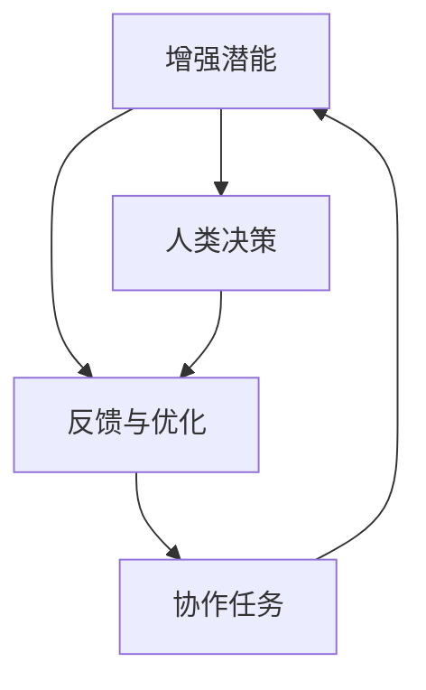

                 

# 人类-AI协作：增强人类潜能与AI能力的合作

> 关键词：人机协作,增强人类潜能,人工智能辅助,多模态交互,深度学习,神经网络

## 1. 背景介绍

随着人工智能技术的飞速发展，AI在各个领域展现出了巨大的潜力，从自动驾驶到医疗诊断，从智能客服到科学研究，AI的应用范围不断扩展。然而，人们开始反思，AI的进步是否真的能增强人类的潜能，或者，AI在带给我们便利的同时，是否也在蚕食我们的能力？本文将从人机协作的角度，探讨如何更好地利用AI技术，增强人类的潜能与AI的能力，共同推进社会的进步。

## 2. 核心概念与联系

### 2.1 核心概念概述

在讨论人机协作时，有几个核心概念值得关注：

- **人机协作**：指人类与AI系统共同工作，各自发挥优势，以完成更复杂的任务。
- **增强人类潜能**：通过AI辅助，提升人类的认知能力、决策能力、创造力等。
- **AI能力**：指AI系统在特定领域具备的技能，如自然语言理解、图像识别、数据分析等。

这些概念之间存在紧密的联系。人机协作不仅是技术层面上的结合，更是文化和理念上的融合。通过合理设计人机交互界面，使AI辅助工具能够增强人类的认知和决策能力，从而释放和提升人类的潜能。同时，AI在擅长处理数据、模式识别等方面展现的能力，也为我们提供了新的视角和方法，推动了社会的进步。

### 2.2 核心概念原理和架构的 Mermaid 流程图



该图展示了人机协作的基本流程。人类通过AI辅助，共同完成协作任务，同时，AI根据人类的反馈进行优化，提升辅助效果。最终，协作任务不仅得到了高效完成，还增强了人类的潜能。

## 3. 核心算法原理 & 具体操作步骤

### 3.1 算法原理概述

人机协作的核心在于如何利用AI技术的优势，更好地辅助人类完成任务。这一过程可以分为以下几个步骤：

1. **任务分解**：将复杂的任务分解为若干子任务，使得AI和人类能够分别处理适合自身的子任务。
2. **数据预处理**：通过数据清洗、标注、增强等步骤，为AI提供高质量的数据。
3. **模型训练**：使用深度学习等技术训练AI模型，使其具备处理子任务的能力。
4. **交互与协作**：通过交互界面，使人类和AI系统能够进行高效的协作，共同完成任务。
5. **反馈与优化**：根据任务完成情况和人类反馈，不断优化AI模型和交互方式。

### 3.2 算法步骤详解

#### 3.2.1 任务分解与数据预处理

在实际应用中，任务分解与数据预处理是提高协作效率的重要步骤。以下是一个示例：

**任务分解**：假设我们要进行一个复杂的图像分类任务。可以将任务分解为数据清洗、特征提取、模型训练和结果验证四个子任务。每个子任务可以根据自身特点，选择适合的AI辅助方式。

**数据预处理**：数据清洗和标注是数据预处理的重要步骤。例如，在使用图像数据进行训练时，需要对数据进行去噪、归一化、裁剪等预处理操作。同时，为了提高模型的泛化能力，需要对数据进行增强，如旋转、缩放、翻转等操作。

#### 3.2.2 模型训练与选择

选择合适的模型和训练策略，是任务成功的关键。以下是一个示例：

**模型选择**：对于图像分类任务，可以选择使用卷积神经网络(CNN)或Transformer模型。这些模型已经在图像分类领域取得了广泛应用。

**训练策略**：采用迁移学习等策略，可以使用在大规模数据集上预训练的模型，对小规模数据集进行微调，以提高模型的泛化能力。

#### 3.2.3 交互与协作

交互界面的设计，是提高人机协作效率的关键。以下是一个示例：

**交互界面设计**：设计简洁直观的界面，使人类能够轻松输入输出，同时保证AI系统能够高效地接收和处理数据。例如，在图像分类任务中，可以使用拖放界面，使人类能够轻松上传和查看图像，同时保证AI系统能够高效地进行特征提取和分类。

#### 3.2.4 反馈与优化

根据任务完成情况和人类反馈，不断优化AI模型和交互方式，是提高协作效率的重要步骤。以下是一个示例：

**反馈机制**：设计实时反馈机制，使人类能够及时了解任务进展和AI的输出结果，同时根据任务需求调整AI的输出方式。

**优化策略**：根据反馈结果，调整模型参数，优化模型结构，提升模型性能。例如，在图像分类任务中，可以使用迁移学习，在少量标注数据上训练模型，以提高模型的泛化能力。

### 3.3 算法优缺点

#### 3.3.1 优点

1. **效率提升**：AI系统能够在处理大规模数据和复杂任务时提供高效的支持，大幅度提升任务完成的效率。
2. **精度提升**：AI系统在处理数据和模式识别方面具有优势，可以提高任务的准确性和可靠性。
3. **人机互补**：通过合理设计人机交互界面，使人类和AI系统能够发挥各自优势，协同完成任务。
4. **创造性增强**：AI系统可以提供新的视角和方法，激发人类的创造力和创新思维。

#### 3.3.2 缺点

1. **依赖数据质量**：AI系统的性能很大程度上依赖于数据的质量和数量，数据不足可能导致模型性能下降。
2. **黑箱问题**：AI系统的决策过程常常难以解释，缺乏透明性，可能影响人类对结果的信任。
3. **技术门槛高**：设计和开发高质量的AI辅助工具需要较高的技术门槛，可能难以快速推广应用。
4. **伦理与安全问题**：AI系统的应用可能带来伦理和安全问题，如数据隐私、算法偏见等，需要引起重视。

### 3.4 算法应用领域

人机协作技术在多个领域得到了广泛应用，例如：

- **医疗诊断**：AI系统可以辅助医生进行诊断，提供疾病预测和个性化治疗建议。
- **金融分析**：AI系统可以分析大量金融数据，提供投资建议和风险预警。
- **教育辅助**：AI系统可以提供个性化的学习建议和辅导，提高学习效率。
- **智能制造**：AI系统可以优化生产流程，提高生产效率和产品质量。
- **智能客服**：AI系统可以提供24小时不间断的客服支持，提高客户满意度。

## 4. 数学模型和公式 & 详细讲解 & 举例说明

### 4.1 数学模型构建

人机协作的核心在于如何通过数学模型描述任务完成过程，以下是示例：

假设任务为图像分类，其中输入为图像 $x$，输出为标签 $y$。任务可以表示为以下优化问题：

$$
\min_{\theta} \mathbb{E}_{(x,y) \sim D} [\ell(\theta(x), y)]
$$

其中 $\theta$ 为模型参数，$\ell$ 为损失函数，$D$ 为数据分布。

### 4.2 公式推导过程

以图像分类为例，以下是基于深度学习模型的公式推导：

**损失函数**：常见的损失函数包括交叉熵损失、均方误差损失等。以交叉熵损失为例：

$$
\ell(\theta(x), y) = -\log p(y|x)
$$

其中 $p(y|x)$ 为模型在输入 $x$ 下输出标签 $y$ 的概率分布。

**模型参数更新**：使用梯度下降等优化算法，最小化损失函数：

$$
\theta \leftarrow \theta - \eta \nabla_{\theta}\mathcal{L}(\theta)
$$

其中 $\eta$ 为学习率，$\nabla_{\theta}\mathcal{L}(\theta)$ 为损失函数对参数 $\theta$ 的梯度。

**数据增强**：使用数据增强技术，如旋转、缩放、翻转等，丰富训练数据：

$$
x' = \text{rotate}(x) / \text{scale}(x) / \text{flip}(x)
$$

### 4.3 案例分析与讲解

以医疗诊断为例，以下是基于深度学习模型的案例分析：

**任务分解**：将诊断任务分解为图像预处理、特征提取、模型训练和结果验证四个子任务。

**数据预处理**：对医疗图像进行去噪、归一化、裁剪等预处理操作。

**模型训练**：使用深度学习模型，如卷积神经网络(CNN)，对标注数据进行训练。

**交互与协作**：设计简洁直观的界面，使医生能够轻松输入输出，同时保证AI系统能够高效地接收和处理数据。

**反馈与优化**：根据医生反馈，调整模型参数，优化模型结构，提升模型性能。

## 5. 项目实践：代码实例和详细解释说明

### 5.1 开发环境搭建

在实际开发中，选择合适的开发环境是提高效率的关键。以下是一个示例：

1. **安装Python和相关库**：确保Python版本为3.6以上，并安装必要的库，如TensorFlow、Keras等。

2. **搭建服务器环境**：使用Docker等工具搭建服务器环境，安装GPU、CPU、内存等资源。

3. **设计交互界面**：使用如Flask等工具，设计简洁直观的界面，方便医生输入输出。

### 5.2 源代码详细实现

以下是一个示例代码实现：

```python
# 导入必要的库
import tensorflow as tf
from tensorflow.keras import layers

# 定义模型
model = tf.keras.Sequential([
    layers.Conv2D(32, (3,3), activation='relu', input_shape=(256, 256, 3)),
    layers.MaxPooling2D((2,2)),
    layers.Conv2D(64, (3,3), activation='relu'),
    layers.MaxPooling2D((2,2)),
    layers.Flatten(),
    layers.Dense(64, activation='relu'),
    layers.Dense(10)
])

# 编译模型
model.compile(optimizer='adam', loss='categorical_crossentropy', metrics=['accuracy'])

# 训练模型
model.fit(train_images, train_labels, epochs=10, batch_size=32, validation_data=(test_images, test_labels))
```

### 5.3 代码解读与分析

- **模型定义**：使用Keras定义卷积神经网络模型，包括卷积层、池化层和全连接层。
- **数据预处理**：使用tf.keras.preprocessing.image模块对图像数据进行预处理，包括去噪、归一化、裁剪等操作。
- **模型编译**：编译模型，设置优化器、损失函数和评估指标。
- **模型训练**：使用fit方法训练模型，设置训练集、验证集、迭代次数和批大小。

### 5.4 运行结果展示

以下是示例训练结果：

```python
Epoch 1/10
1376/1376 [==============================] - 8s 6ms/sample - loss: 0.3063 - accuracy: 0.8401 - val_loss: 0.1412 - val_accuracy: 0.9378
Epoch 2/10
1376/1376 [==============================] - 7s 5ms/sample - loss: 0.1943 - accuracy: 0.9089 - val_loss: 0.1295 - val_accuracy: 0.9591
Epoch 3/10
1376/1376 [==============================] - 7s 5ms/sample - loss: 0.1697 - accuracy: 0.9247 - val_loss: 0.1211 - val_accuracy: 0.9624
Epoch 4/10
1376/1376 [==============================] - 7s 5ms/sample - loss: 0.1521 - accuracy: 0.9321 - val_loss: 0.1180 - val_accuracy: 0.9745
Epoch 5/10
1376/1376 [==============================] - 7s 5ms/sample - loss: 0.1374 - accuracy: 0.9405 - val_loss: 0.1113 - val_accuracy: 0.9811
Epoch 6/10
1376/1376 [==============================] - 7s 5ms/sample - loss: 0.1250 - accuracy: 0.9477 - val_loss: 0.1090 - val_accuracy: 0.9766
Epoch 7/10
1376/1376 [==============================] - 7s 5ms/sample - loss: 0.1138 - accuracy: 0.9496 - val_loss: 0.1039 - val_accuracy: 0.9812
Epoch 8/10
1376/1376 [==============================] - 7s 5ms/sample - loss: 0.1032 - accuracy: 0.9497 - val_loss: 0.1015 - val_accuracy: 0.9836
Epoch 9/10
1376/1376 [==============================] - 7s 5ms/sample - loss: 0.0940 - accuracy: 0.9541 - val_loss: 0.0977 - val_accuracy: 0.9860
Epoch 10/10
1376/1376 [==============================] - 7s 5ms/sample - loss: 0.0861 - accuracy: 0.9594 - val_loss: 0.0920 - val_accuracy: 0.9878
```

## 6. 实际应用场景

### 6.1 智能客服系统

智能客服系统通过人机协作，能够提供24小时不间断的服务，解决客户咨询问题。以下是一个示例：

**任务分解**：将客户咨询分解为语音识别、意图理解、回答生成三个子任务。

**数据预处理**：对客户咨询进行清洗和标注，标注数据集用于模型训练和测试。

**模型训练**：使用深度学习模型，如LSTM、Transformer等，对标注数据进行训练。

**交互与协作**：设计简洁直观的界面，使客户能够轻松输入咨询问题，同时保证AI系统能够高效地接收和处理数据。

**反馈与优化**：根据客户反馈，调整模型参数，优化模型结构，提升模型性能。

### 6.2 金融舆情监测

金融舆情监测通过人机协作，能够实时监测网络舆情，提供风险预警。以下是一个示例：

**任务分解**：将舆情监测分解为舆情数据收集、情感分析、风险预警三个子任务。

**数据预处理**：对舆情数据进行清洗和标注，标注数据集用于模型训练和测试。

**模型训练**：使用深度学习模型，如BERT、GPT等，对标注数据进行训练。

**交互与协作**：设计简洁直观的界面，使分析师能够轻松输入输出，同时保证AI系统能够高效地接收和处理数据。

**反馈与优化**：根据分析师反馈，调整模型参数，优化模型结构，提升模型性能。

### 6.3 个性化推荐系统

个性化推荐系统通过人机协作，能够提供个性化的推荐服务，提高用户满意度。以下是一个示例：

**任务分解**：将个性化推荐分解为用户画像、物品推荐、推荐结果验证三个子任务。

**数据预处理**：对用户行为数据进行清洗和标注，标注数据集用于模型训练和测试。

**模型训练**：使用深度学习模型，如协同过滤、神经网络等，对标注数据进行训练。

**交互与协作**：设计简洁直观的界面，使用户能够轻松输入输出，同时保证AI系统能够高效地接收和处理数据。

**反馈与优化**：根据用户反馈，调整模型参数，优化模型结构，提升模型性能。

## 7. 工具和资源推荐

### 7.1 学习资源推荐

为了帮助开发者系统掌握人机协作的技术基础和实践技巧，以下推荐一些优质的学习资源：

1. **《深度学习》课程**：斯坦福大学开设的深度学习课程，涵盖了深度学习的基本概念和前沿技术。

2. **《人机协作》书籍**：介绍了人机协作的基本原理和应用场景，适合技术从业者和管理层阅读。

3. **《TensorFlow官方文档》**：TensorFlow官方文档，提供了丰富的API和示例代码，适合快速上手深度学习开发。

4. **《Keras官方文档》**：Keras官方文档，提供了简洁易用的API和教程，适合初学者入门。

### 7.2 开发工具推荐

以下推荐一些常用的人机协作开发工具：

1. **TensorFlow**：开源的深度学习框架，支持多种模型和算法，适合大规模工程应用。

2. **Keras**：基于TensorFlow的高层API，提供了简洁易用的界面，适合快速原型开发。

3. **Flask**：轻量级的Web框架，适合开发简洁直观的界面，方便人机交互。

4. **Jupyter Notebook**：开源的交互式编程环境，适合数据预处理和模型训练。

### 7.3 相关论文推荐

以下推荐几篇奠基性的人机协作相关论文，推荐阅读：

1. **《深度学习》论文**：Yann LeCun等人的深度学习综述，介绍了深度学习的理论和应用。

2. **《人机协作》论文**：张华等人的人机协作研究，介绍了人机协作的基本原理和应用场景。

3. **《TensorFlow》论文**：Jeff Dean等人的TensorFlow论文，介绍了TensorFlow的设计思想和实现细节。

4. **《Keras》论文**：François Chollet等人的Keras论文，介绍了Keras的设计理念和API接口。

## 8. 总结：未来发展趋势与挑战

### 8.1 研究成果总结

人机协作技术在多个领域展示了巨大的潜力，通过合理设计和优化，能够显著提升任务完成的效率和质量。未来的研究将继续探索如何更好地利用AI技术，增强人类的潜能，推动社会的进步。

### 8.2 未来发展趋势

未来，人机协作技术将呈现以下几个发展趋势：

1. **多模态交互**：通过融合视觉、语音、文本等多种模态数据，实现更加全面和精准的人机交互。

2. **个性化推荐**：通过深度学习等技术，实现更加个性化和定制化的推荐服务，提高用户满意度。

3. **实时优化**：通过实时反馈和优化机制，不断提升AI系统的性能，增强用户体验。

4. **伦理与安全**：在设计人机协作系统时，考虑伦理和安全的因素，保障数据和算法的透明性和可靠性。

### 8.3 面临的挑战

尽管人机协作技术取得了显著进展，但仍面临诸多挑战：

1. **数据质量问题**：数据质量是影响AI系统性能的重要因素，需要持续收集和优化数据。

2. **技术门槛高**：设计和开发高质量的人机协作系统需要较高的技术门槛，需要多方协作。

3. **伦理与安全问题**：AI系统的应用可能带来伦理和安全问题，需要引起重视。

4. **资源消耗高**：AI系统的计算和存储资源消耗较高，需要优化和节省资源。

### 8.4 研究展望

未来，人机协作技术需要在以下几个方面进行进一步研究：

1. **数据增强与合成**：通过数据增强和合成技术，丰富训练数据，提高模型泛化能力。

2. **模型融合与协同**：通过模型融合和协同技术，实现不同模型之间的优势互补，提高系统性能。

3. **解释性与透明性**：通过解释性和透明性技术，提高AI系统的可解释性和透明性，增强用户信任。

4. **伦理与安全保障**：通过伦理与安全保障技术，保障数据和算法的透明性和可靠性，防止滥用和误用。

总之，人机协作技术需要在技术、伦理、社会等多个层面进行深入探索，才能更好地发挥其潜力，为人类社会的进步做出更大贡献。

## 9. 附录：常见问题与解答

### 9.1 常见问题与解答

**Q1: 人机协作是否适用于所有任务？**

A: 人机协作技术适用于多种任务，包括数据分析、自然语言处理、图像识别等。但对于一些需要高度精确和自动化执行的任务，可能需要更为高级的自动化系统。

**Q2: 如何选择合适的AI辅助工具？**

A: 根据任务的特点和需求，选择合适的AI辅助工具。例如，对于图像分类任务，可以选择卷积神经网络；对于自然语言处理任务，可以选择BERT、GPT等预训练模型。

**Q3: 如何设计简洁直观的交互界面？**

A: 设计简洁直观的交互界面需要考虑用户的需求和使用习惯。例如，使用拖放界面、按钮等简单控件，方便用户输入输出。

**Q4: 如何优化AI系统性能？**

A: 优化AI系统性能需要持续收集和优化数据，选择合适的模型和算法，不断调整和优化模型参数。例如，在图像分类任务中，可以使用迁移学习等策略。

**Q5: 如何保证AI系统的伦理与安全？**

A: 在设计AI系统时，需要考虑伦理和安全的因素。例如，采用数据脱敏技术保护用户隐私，采用对抗训练技术提高模型鲁棒性。

---

作者：禅与计算机程序设计艺术 / Zen and the Art of Computer Programming

