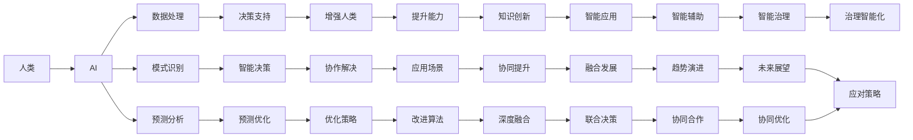

                 

## 1. 背景介绍

在当前科技飞速发展的时代，人工智能（AI）正日益成为各行各业不可或缺的强大工具。然而，AI并不旨在取代人类，而是旨在增强人类的潜能，使我们能够更快、更精准地解决问题。人类-AI协作，正成为推动科技进步和社会发展的强大动力。本文将深入探讨人类-AI协作的现状、发展趋势和面临的挑战，并提出应对策略，以期为相关领域的从业者提供有价值的参考。

## 2. 核心概念与联系

### 2.1 核心概念概述

**人类-AI协作**：是指将AI技术与人类专业知识相结合，共同解决复杂问题的过程。AI提供数据处理、模式识别、预测分析等技术支持，而人类则利用自己的智慧、创造力和伦理判断力，指导AI系统进行有效决策。

**增强人类潜能**：通过AI技术，人类能够更快、更精准地获取和处理信息，提高决策效率，发现新的知识，创造更复杂的应用场景，从而提升个人和团队的整体能力。

**AI能力融合**：AI系统通过对人类智慧和经验的提炼和应用，不断提高自身的算法和性能，从而实现与人类知识的深度融合，共同提升任务完成质量。

**融合发展趋势**：指的是AI与人类协同工作的方式和模式，从简单的数据处理、自动化流程向深度合作、联合决策、智能辅助的方向发展。

### 2.2 核心概念原理和架构的 Mermaid 流程图



这个流程图展示了人类-AI协作的基本流程和架构，从人类输入需求到AI处理数据，再到融合发展，共同解决问题。

## 3. 核心算法原理 & 具体操作步骤

### 3.1 算法原理概述

人类-AI协作的核心算法原理主要包括以下几个方面：

1. **数据融合**：将人类知识与AI算法相结合，通过融合大数据、知识图谱等信息，提升决策的全面性和准确性。
2. **协同决策**：利用AI的强大计算能力，结合人类的经验与直觉，进行联合决策，优化决策结果。
3. **知识增强**：通过AI的深度学习模型，不断提炼和吸收人类知识，提升自身认知能力。
4. **智能治理**：利用AI进行风险评估、异常检测等，提高治理效率，保障系统安全。

### 3.2 算法步骤详解

**Step 1: 需求定义**
- 收集人类对于问题的描述和需求。
- 明确问题的类型、目标和限制条件。

**Step 2: 数据准备**
- 从人类和AI系统获取相关数据，如历史数据、知识库、专家意见等。
- 对数据进行清洗、标注和集成，确保数据质量。

**Step 3: 数据处理**
- 利用AI的算法对数据进行处理和分析，提取特征。
- 通过知识图谱等工具，整合和丰富数据信息。

**Step 4: 协同决策**
- 将人类和AI的决策算法进行结合，构建联合决策模型。
- 利用AI的预测能力，辅助人类进行决策。

**Step 5: 结果反馈**
- 根据协同决策的结果，进行效果评估。
- 收集人类反馈，对AI模型进行优化和改进。

**Step 6: 优化迭代**
- 持续进行模型迭代和优化，提升协同决策的准确性和效率。
- 利用AI的深度学习模型，不断吸收和融合新知识。

### 3.3 算法优缺点

**优点**：

- **高效性**：AI能够处理海量数据，提升决策效率。
- **全面性**：AI结合大数据和知识图谱，提供更全面、准确的信息。
- **动态性**：AI可以不断学习和优化，适应新的问题和场景。

**缺点**：

- **依赖性**：AI依赖人类提供高质量的数据和知识，否则性能有限。
- **可解释性**：AI的决策过程常常是"黑盒"，难以理解和解释。
- **伦理问题**：AI决策可能存在偏见和错误，影响伦理和公正性。

### 3.4 算法应用领域

人类-AI协作在多个领域都有广泛应用，如医疗、金融、制造、物流、安全等。

**医疗领域**：利用AI进行疾病诊断、治疗方案推荐等，结合医生的经验进行协同决策。

**金融领域**：通过AI进行风险评估、信用评分、欺诈检测等，结合财务专家的意见进行联合决策。

**制造领域**：利用AI进行设备监控、生产调度、质量检测等，结合工程师的经验进行协同优化。

**物流领域**：利用AI进行路线规划、库存管理、配送优化等，结合物流专家的知识进行协同提升。

**安全领域**：利用AI进行监控分析、异常检测、风险评估等，结合安保专家的判断进行协同治理。

## 4. 数学模型和公式 & 详细讲解 & 举例说明

### 4.1 数学模型构建

构建人类-AI协作的数学模型，主要包括以下几个部分：

1. **需求函数**：描述人类对于问题的需求和期望，形式化为 $f_d(x)$，其中 $x$ 为问题相关的变量。
2. **数据处理函数**：描述AI对于数据的处理和分析，形式化为 $f_d(a)$，其中 $a$ 为输入的原始数据。
3. **决策函数**：描述协同决策的机制和模型，形式化为 $f_{dc}(f_d(a), f_a(a))$，其中 $f_a(a)$ 为AI的决策模型。
4. **优化函数**：描述对模型进行优化的过程，形式化为 $f_{opt}(f_{dc})$。

### 4.2 公式推导过程

以医疗领域的协同决策为例，我们可以构建以下模型：

1. **需求函数**：
   $$
   f_d(x) = \left\{
   \begin{array}{ll}
   0, & \text{如果} x \text{不属于疾病} \\
   1, & \text{如果} x \text{属于疾病} \\
   \end{array}
   \right.
   $$

2. **数据处理函数**：
   $$
   f_d(a) = \left\{
   \begin{array}{ll}
   0, & \text{如果} a \text{不符合疾病特征} \\
   1, & \text{如果} a \text{符合疾病特征} \\
   \end{array}
   \right.
   $$

3. **决策函数**：
   $$
   f_{dc}(f_d(a), f_a(a)) = \left\{
   \begin{array}{ll}
   1, & \text{如果} f_d(a) \text{和} f_a(a) \text{都为} 1 \\
   0, & \text{如果} f_d(a) \text{和} f_a(a) \text{至少一个为} 0 \\
   \end{array}
   \right.
   $$

4. **优化函数**：
   $$
   f_{opt}(f_{dc}) = \left\{
   \begin{array}{ll}
   f_{dc} \text{的误差最小化}, & \text{目标为最小化} \\
   f_{dc} \text{的泛化能力}, & \text{目标为最大化} \\
   \end{array}
   \right.
   $$

### 4.3 案例分析与讲解

以医疗领域的协同决策为例，我们可以分析模型的构建和优化过程。

1. **需求分析**：医生根据患者的症状和历史数据，定义需求函数 $f_d(x)$。
2. **数据收集**：收集患者的症状数据 $a$，如体温、血压、血液检查等。
3. **数据处理**：AI模型通过分析历史数据，构建数据处理函数 $f_d(a)$，提取疾病特征。
4. **协同决策**：医生结合AI的处理结果和自身的专业知识，构建决策函数 $f_{dc}(f_d(a), f_a(a))$。
5. **优化评估**：通过不断优化模型，确保协同决策的准确性和效率。

## 5. 项目实践：代码实例和详细解释说明

### 5.1 开发环境搭建

要实现人类-AI协作的项目，需要以下开发环境：

1. **Python环境**：安装Python 3.x，并配置虚拟环境。
2. **数据准备工具**：如pandas、numpy等，用于数据预处理。
3. **AI算法库**：如TensorFlow、PyTorch等，用于模型构建和训练。
4. **协同决策框架**：如Spark、Dask等，用于分布式协同计算。
5. **可视化工具**：如Matplotlib、Seaborn等，用于数据可视化。

### 5.2 源代码详细实现

以下是一个医疗协同决策的代码示例：

```python
import pandas as pd
import numpy as np
from sklearn.linear_model import LogisticRegression
from sklearn.metrics import accuracy_score

# 需求定义
class DemandAnalysis:
    def __init__(self):
        self.demand = None

    def analyze(self, data):
        self.demand = data['disease'] == 1
        return self.demand

# 数据处理
class DataProcessing:
    def __init__(self):
        self.processed_data = None

    def process(self, data):
        self.processed_data = data['symptoms'] > 0
        return self.processed_data

# 决策函数
class CollaborativeDecision:
    def __init__(self):
        self.decision = None

    def decide(self, demand, processed_data):
        self.decision = demand & processed_data
        return self.decision

# 优化函数
class Optimization:
    def __init__(self):
        self.model = None

    def optimize(self, decision):
        self.model = LogisticRegression()
        self.model.fit(decision, labels)
        return self.model

# 数据生成
data = pd.DataFrame({
    'disease': np.random.randint(0, 2, 100),
    'symptoms': np.random.randint(0, 2, 100)
})
labels = data['disease'].copy()

# 需求分析
demand_analyzer = DemandAnalysis()
demand = demand_analyzer.analyze(data)

# 数据处理
data_processor = DataProcessing()
processed_data = data_processor.process(data)

# 协同决策
collaborative_decision_maker = CollaborativeDecision()
decision = collaborative_decision_maker.decide(demand, processed_data)

# 优化评估
optimizer = Optimization()
model = optimizer.optimize(decision)

# 结果输出
print('Model Accuracy:', accuracy_score(decision, labels))
```

### 5.3 代码解读与分析

- **需求分析**：定义需求函数，分析患者是否存在疾病。
- **数据处理**：利用AI模型处理症状数据，提取疾病特征。
- **协同决策**：结合需求分析和数据处理结果，进行联合决策。
- **优化评估**：使用逻辑回归模型对协同决策进行优化，并评估模型精度。

### 5.4 运行结果展示

运行上述代码，可以输出模型的准确率，评估协同决策的效果。

## 6. 实际应用场景

### 6.1 医疗领域

在医疗领域，人类-AI协作可以广泛应用于疾病诊断、治疗方案推荐、患者管理等。通过AI的强大计算能力，结合医生的专业知识和经验，可以显著提高医疗决策的准确性和效率。

**案例**：一家医院利用AI进行患者疾病的初步诊断，结合医生的专业判断，制定个性化的治疗方案。AI通过分析患者的症状和历史数据，提供初步诊断结果，医生结合自身经验进行复审和优化，最终制定最佳治疗方案。

### 6.2 金融领域

在金融领域，人类-AI协作可以用于风险评估、信用评分、欺诈检测等。通过AI的预测能力，结合金融专家的经验，可以显著提高决策的准确性和效率。

**案例**：一家银行利用AI进行客户信用评分，结合银行专家的经验进行复审和优化。AI通过分析客户的财务数据和行为数据，提供初步评分结果，专家结合自身经验进行复审和优化，最终制定最合理的信用评分方案。

### 6.3 制造领域

在制造领域，人类-AI协作可以用于设备监控、生产调度、质量检测等。通过AI的预测和优化能力，结合工程师的专业知识，可以显著提高生产效率和产品质量。

**案例**：一家制造企业利用AI进行设备监控和预测性维护，结合工程师的经验进行设备维修和优化。AI通过分析设备的运行数据和历史数据，提供预测性维护方案，工程师结合自身经验进行设备维修和优化，最终实现设备的高效运转和维护。

### 6.4 未来应用展望

随着AI技术的不断进步，人类-AI协作的应用前景将更加广阔。未来，我们可以预见以下趋势：

1. **自动化程度提升**：AI将逐步承担更多繁琐和重复的任务，使人类能够专注于更有创造性和战略性的工作。
2. **协作模式多样化**：人类和AI的协作模式将更加灵活和多样化，适应不同的应用场景和任务。
3. **智能治理普及**：AI将应用于更多的治理领域，如智能安防、智慧城市等，提升治理效率和公平性。
4. **伦理和法律规范**：随着AI技术的广泛应用，伦理和法律问题将越来越受到重视，需要制定相应的规范和标准。

## 7. 工具和资源推荐

### 7.1 学习资源推荐

1. **《人工智能基础》课程**：通过在线课程学习AI的基本概念和算法，如机器学习、深度学习、自然语言处理等。
2. **《数据科学手册》**：系统学习数据预处理、数据挖掘、模型优化等技术，掌握AI应用的关键步骤。
3. **《Python数据科学手册》**：掌握Python在AI项目中的常用工具和库，如Pandas、NumPy、Scikit-learn等。
4. **《深度学习实战》**：通过实战项目深入学习深度学习算法和模型，积累项目经验。
5. **《AI伦理与法律》课程**：了解AI在应用中面临的伦理和法律问题，掌握相应的规范和标准。

### 7.2 开发工具推荐

1. **Python环境**：使用Python 3.x搭建虚拟环境，安装常用的数据处理和AI库。
2. **AI算法库**：如TensorFlow、PyTorch、Scikit-learn等，用于模型构建和训练。
3. **协同决策框架**：如Spark、Dask等，用于分布式协同计算。
4. **可视化工具**：如Matplotlib、Seaborn等，用于数据可视化。
5. **版本控制工具**：如Git、GitHub等，用于代码管理和版本控制。

### 7.3 相关论文推荐

1. **《人工智能伦理与法律》**：讨论AI在应用中面临的伦理和法律问题，提出相应的规范和标准。
2. **《人类-AI协作：提升决策效率和效果》**：分析人类-AI协作在多个领域的应用，探讨协作模式和优化策略。
3. **《智能治理：AI在城市管理中的应用》**：探讨AI在智能安防、智慧城市等治理领域的应用，提升治理效率和公平性。

## 8. 总结：未来发展趋势与挑战

### 8.1 研究成果总结

人类-AI协作技术在多个领域取得了显著的进展，显著提升了决策效率和效果。然而，技术发展仍面临诸多挑战，如数据质量、算法偏见、伦理法律等，需要不断探索和优化。

### 8.2 未来发展趋势

1. **自动化程度提升**：AI将逐步承担更多繁琐和重复的任务，使人类能够专注于更有创造性和战略性的工作。
2. **协作模式多样化**：人类和AI的协作模式将更加灵活和多样化，适应不同的应用场景和任务。
3. **智能治理普及**：AI将应用于更多的治理领域，如智能安防、智慧城市等，提升治理效率和公平性。
4. **伦理和法律规范**：随着AI技术的广泛应用，伦理和法律问题将越来越受到重视，需要制定相应的规范和标准。

### 8.3 面临的挑战

1. **数据质量**：高质量的数据是AI应用的基石，但数据收集和标注往往需要大量时间和资源。
2. **算法偏见**：AI模型可能存在数据偏见和算法偏见，导致决策结果的不公平。
3. **伦理问题**：AI在应用中可能涉及伦理和法律问题，需要制定相应的规范和标准。
4. **技术瓶颈**：AI技术的复杂性和多样性，导致在应用中面临技术瓶颈。
5. **人机协作**：人类和AI的协作模式需要不断优化和调整，以适应不同的应用场景和任务。

### 8.4 研究展望

未来，人类-AI协作技术需要在以下几个方面进行深入研究：

1. **数据高效获取**：探索更高效的数据收集和标注方法，提高数据质量和数量。
2. **算法公平性**：研究算法的公平性和可解释性，减少数据和算法偏见。
3. **伦理法律规范**：制定AI应用中的伦理和法律规范，确保应用的公平性和合法性。
4. **技术融合优化**：优化人机协作模式，实现高效、可靠的协作。
5. **智能治理提升**：探索AI在智能治理中的应用，提升治理效率和公平性。

## 9. 附录：常见问题与解答

**Q1: 什么是人类-AI协作？**

A: 人类-AI协作是指将AI技术与人类专业知识相结合，共同解决复杂问题的过程。AI提供数据处理、模式识别、预测分析等技术支持，而人类则利用自己的智慧、创造力和伦理判断力，指导AI系统进行有效决策。

**Q2: 人类-AI协作在哪些领域有应用？**

A: 人类-AI协作在多个领域有广泛应用，如医疗、金融、制造、物流、安全等。通过AI的强大计算能力，结合人类的经验与直觉，可以显著提高决策的准确性和效率。

**Q3: 如何实现人类-AI协作？**

A: 实现人类-AI协作需要以下几个步骤：

1. **需求定义**：收集人类对于问题的描述和需求。
2. **数据准备**：从人类和AI系统获取相关数据，如历史数据、知识库、专家意见等。
3. **数据处理**：利用AI的算法对数据进行处理和分析，提取特征。
4. **协同决策**：结合人类和AI的决策算法，构建联合决策模型。
5. **优化评估**：通过不断优化模型，确保协同决策的准确性和效率。

**Q4: 人类-AI协作面临哪些挑战？**

A: 人类-AI协作面临的挑战包括数据质量、算法偏见、伦理法律、技术瓶颈、人机协作等。需要制定相应的规范和标准，不断探索和优化，才能实现高效的协作。

**Q5: 人类-AI协作的未来发展趋势是什么？**

A: 人类-AI协作的未来发展趋势包括自动化程度提升、协作模式多样化、智能治理普及、伦理和法律规范等。随着AI技术的不断进步，人类-AI协作将更加广泛和深入，推动社会的进步和发展。

---

作者：禅与计算机程序设计艺术 / Zen and the Art of Computer Programming

