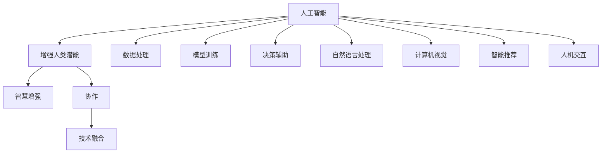

                 

# 人类-AI协作：增强人类潜能和智慧

> 关键词：人工智能, 人类潜能, 智慧增强, 协作, 技术融合

## 1. 背景介绍

### 1.1 问题由来
随着人工智能技术的迅速发展，特别是深度学习和自然语言处理领域的突破，AI已经成为一个能够影响人类生活的强大工具。人工智能不仅在数据处理、决策辅助、信息检索等方面展现出巨大的潜力，还能在诸如教育、医疗、金融等实际应用中提供巨大价值。然而，技术的飞跃也带来了新的挑战。

### 1.2 问题核心关键点
1. **人工智能与人类潜能的结合**：如何最大化利用AI，提升人类的决策和处理能力，同时保持人类特有的创造力和情感交流能力？
2. **智慧增强**：AI在哪些方面可以增强人类的智慧？例如，智能助手、知识库、数据分析工具等。
3. **协作**：AI与人类如何高效协作，形成互为补充的智能系统？
4. **技术融合**：AI如何与其他技术（如机器学习、物联网、区块链等）深度融合，创造出新的应用场景？

### 1.3 问题研究意义
研究人类-AI协作，不仅有助于提升人类潜能和智慧，还能推动社会进步，促进人类社会的可持续发展。以下是几个重要的研究意义：

1. **优化决策过程**：AI能够快速处理海量数据，辅助人类做出更准确的决策。
2. **提升创新能力**：AI可以提供新颖的视角和解决方案，激发人类的创新思维。
3. **提高生产效率**：AI能够自动化处理重复性工作，使人类专注于更具创造性的任务。
4. **增强教育效果**：AI可以个性化定制学习方案，提高教育质量和效率。
5. **促进医疗进步**：AI可以辅助医生进行精准诊断和治疗，提升医疗服务的质量。

## 2. 核心概念与联系

### 2.1 核心概念概述

为了更好地理解人类-AI协作的概念，需要掌握以下几个关键概念：

- **人工智能**：人工智能是一种能够模拟人类智能行为的技术。从简单的算法到复杂的深度学习模型，AI技术在不断进步。
- **增强人类潜能**：通过AI技术，增强人类的学习能力、工作效率、创新能力等，使得人类能更有效地利用自身潜能。
- **智慧增强**：AI在知识获取、数据处理、决策分析等方面，可以增强人类的智慧，辅助人类解决复杂问题。
- **协作**：AI与人类相互配合，各自发挥优势，形成更高效、更智能的团队。
- **技术融合**：AI与其他技术的结合，创造出全新的应用场景和解决方案。

这些概念之间存在紧密的联系。人工智能通过各种技术手段，增强人类的潜能，提升智慧水平，最终通过协作，共同解决复杂问题，实现技术融合。

### 2.2 核心概念原理和架构的 Mermaid 流程图



该图展示了大语言模型与人类增强的联系。人工智能技术通过处理数据、训练模型、提供决策辅助、自然语言处理、计算机视觉、智能推荐和人机交互等方式，提升人类的潜能和智慧，促进协作，实现技术融合。

## 3. 核心算法原理 & 具体操作步骤
### 3.1 算法原理概述

人类-AI协作的核心算法原理是利用AI技术提升人类的能力。通过机器学习、自然语言处理、计算机视觉等技术，AI可以处理大量数据，生成有价值的洞察，辅助人类进行决策。

在实际应用中，人类-AI协作需要以下几个步骤：

1. **数据收集**：收集相关的数据，数据来源包括互联网、社交媒体、传感器等。
2. **数据预处理**：清洗数据，去除噪声，进行特征提取。
3. **模型训练**：使用机器学习算法训练模型，如深度神经网络、支持向量机等。
4. **模型评估**：使用评估指标（如准确率、召回率、F1分数等）评估模型性能。
5. **模型部署**：将训练好的模型部署到生产环境中，进行实时预测。
6. **反馈调整**：根据反馈数据不断调整模型，提升模型效果。

### 3.2 算法步骤详解

以下以自然语言处理(NLP)为例，详细讲解AI增强人类智慧的算法步骤：

**Step 1: 数据收集**
- 从互联网、社交媒体等渠道收集相关文本数据。
- 选择有代表性的数据进行清洗和预处理。

**Step 2: 数据预处理**
- 去除停用词、标点符号等噪声。
- 进行分词、词性标注、命名实体识别等预处理操作。
- 将文本转换为数值形式，如TF-IDF、Word2Vec等。

**Step 3: 模型训练**
- 选择合适的模型，如BERT、GPT等预训练模型。
- 使用标注好的数据训练模型，调整超参数，如学习率、批次大小等。
- 使用GPU/TPU等高性能设备进行训练。

**Step 4: 模型评估**
- 在验证集上测试模型性能，如准确率、召回率、F1分数等。
- 使用混淆矩阵、ROC曲线等可视化工具进行结果分析。

**Step 5: 模型部署**
- 将训练好的模型导出为可部署的格式，如TensorFlow SavedModel、PyTorch模型等。
- 部署到服务器或云端，提供API接口供外部调用。

**Step 6: 反馈调整**
- 定期收集用户反馈，分析模型的预测结果和实际结果的差异。
- 根据反馈数据调整模型，优化算法，提高模型精度。

### 3.3 算法优缺点

人工智能增强人类潜能的算法有如下优点：

1. **高效处理数据**：AI可以处理海量数据，帮助人类在短时间内获得有价值的洞察。
2. **提高决策质量**：AI可以辅助人类进行数据分析和决策，提高决策的准确性和速度。
3. **个性化推荐**：AI可以根据用户行为，提供个性化的推荐和服务，提升用户体验。
4. **自动化处理**：AI可以自动化处理重复性工作，解放人类的时间和精力。

同时，算法也存在一些缺点：

1. **数据质量依赖**：AI的预测结果取决于输入数据的质量，存在数据偏差风险。
2. **模型解释性不足**：AI模型通常是一个"黑箱"，难以解释其内部工作机制。
3. **依赖性强**：AI模型依赖于硬件设备，如高性能的GPU/TPU。
4. **成本高**：构建和维护AI模型需要较高的技术和资金投入。

### 3.4 算法应用领域

人工智能增强人类潜能的算法在多个领域有广泛应用：

- **金融分析**：利用AI进行数据挖掘和情感分析，预测市场趋势，辅助投资决策。
- **医疗诊断**：利用AI进行影像分析和病历数据处理，辅助医生进行精准诊断。
- **教育培训**：利用AI进行个性化学习方案设计，提升教育质量和效率。
- **智能推荐**：利用AI进行推荐系统，提升电商、社交媒体等平台的用户体验。
- **安全监控**：利用AI进行视频分析和异常检测，提高安全监控系统的准确性。
- **智能客服**：利用AI进行自然语言处理和机器翻译，提升客服系统的响应速度和质量。

## 4. 数学模型和公式 & 详细讲解 & 举例说明

### 4.1 数学模型构建

以自然语言处理为例，一个基本的数学模型是使用word embedding（词向量）表示文本中的单词。

设文本由 $N$ 个单词组成，每个单词表示为一个 $d$ 维的向量 $x_i \in \mathbb{R}^d$。文本表示为 $X=[x_1, x_2, ..., x_N] \in \mathbb{R}^{N \times d}$。

### 4.2 公式推导过程

假设我们有一个简单的词嵌入模型，其预测概率为 $P(y|x)$，其中 $y$ 是预测的单词，$x$ 是输入的单词。

根据贝叶斯公式，预测概率为：

$$
P(y|x) = \frac{P(y)}{P(x|y)P(x)}
$$

其中 $P(x|y)$ 表示在给定 $y$ 的条件下，$x$ 的条件概率。在自然语言处理中，通常使用softmax函数对 $P(x|y)$ 进行建模：

$$
P(x|y) = \frac{exp(u_y^Tx)}{Z_y}
$$

其中 $u_y$ 是单词 $y$ 的词向量，$Z_y$ 是归一化因子。

最终，通过最大化 $P(y|x)$ 来找到最可能的单词 $y$。

### 4.3 案例分析与讲解

以BERT模型为例，BERT是一个预训练的大语言模型，用于文本表示和自然语言理解。

BERT模型基于Transformer架构，通过自监督学习任务（如掩码语言模型、下一句预测等）对大规模无标签文本进行预训练。在预训练后，可以用于各种自然语言处理任务，如文本分类、情感分析、命名实体识别等。

## 5. 项目实践：代码实例和详细解释说明
### 5.1 开发环境搭建

在项目实践之前，需要搭建好开发环境。以下是使用Python和TensorFlow搭建环境的步骤：

1. 安装Anaconda：从官网下载并安装Anaconda，用于创建独立的Python环境。
2. 创建并激活虚拟环境：
```bash
conda create -n tf-env python=3.8 
conda activate tf-env
```
3. 安装TensorFlow：根据CUDA版本，从官网获取对应的安装命令。例如：
```bash
pip install tensorflow -c tf-nightly
```
4. 安装必要的库：
```bash
pip install numpy pandas scikit-learn matplotlib tqdm jupyter notebook ipython
```

完成上述步骤后，即可在`tf-env`环境中开始项目实践。

### 5.2 源代码详细实现

以下是一个使用BERT模型进行情感分析的Python代码实现：

```python
import tensorflow as tf
import numpy as np
import pandas as pd
from transformers import BertTokenizer, TFBertForSequenceClassification

# 加载数据
data = pd.read_csv('imdb_reviews.csv', encoding='utf-8')

# 数据预处理
tokenizer = BertTokenizer.from_pretrained('bert-base-uncased')
sentences = [tokenizer.tokenize(s) for s in data['review']]
inputs = tokenizer(sentences, return_tensors='tf', padding=True, truncation=True)

# 模型构建
model = TFBertForSequenceClassification.from_pretrained('bert-base-uncased', num_labels=2)

# 模型训练
train_dataset = tf.data.Dataset.from_tensor_slices((inputs['input_ids'], inputs['attention_mask'], data['label']))
train_dataset = train_dataset.shuffle(1000).batch(16).repeat()
train_loss = tf.keras.losses.SparseCategoricalCrossentropy(from_logits=True)
train_optimizer = tf.keras.optimizers.Adam(learning_rate=2e-5)

@tf.function
def train_step(inputs):
    with tf.GradientTape() as tape:
        outputs = model(inputs['input_ids'], attention_mask=inputs['attention_mask'])
        loss = train_loss(inputs['label'], outputs.logits)
    gradients = tape.gradient(loss, model.trainable_variables)
    train_optimizer.apply_gradients(zip(gradients, model.trainable_variables))
    return loss

@tf.function
def evaluate(inputs):
    outputs = model(inputs['input_ids'], attention_mask=inputs['attention_mask'])
    predictions = tf.nn.softmax(outputs.logits, axis=1)
    return predictions

# 训练和评估
for epoch in range(5):
    total_loss = 0.0
    for step, inputs in enumerate(train_dataset):
        loss = train_step(inputs)
        total_loss += loss.numpy()
        if step % 100 == 0:
            print(f'Epoch {epoch+1}, Step {step}, Loss: {loss.numpy()}')
    
    predictions = evaluate(inputs)
    accuracy = np.mean(np.argmax(predictions, axis=1) == inputs['label'])
    print(f'Epoch {epoch+1}, Accuracy: {accuracy:.3f}')
```

### 5.3 代码解读与分析

以下是代码的详细解读：

1. 加载和预处理数据：使用Pandas库加载IMDB电影评论数据，使用BertTokenizer对文本进行分词和编码，转化为模型输入。
2. 模型构建：使用TFBertForSequenceClassification加载预训练的BERT模型，并指定标签数。
3. 模型训练：定义训练函数train_step，在每个批次上进行前向传播和反向传播，计算损失和梯度。
4. 模型评估：定义评估函数evaluate，使用softmax函数将模型输出转化为概率，计算准确率。
5. 训练和评估循环：在多个epoch内循环训练和评估模型。

## 6. 实际应用场景
### 6.1 智能客服系统

智能客服系统是一个典型的AI增强人类潜能的案例。传统客服需要大量人力，且响应速度和效率有限。而利用AI进行智能客服，可以24小时不间断服务，快速响应客户咨询，提升客户体验和满意度。

在技术实现上，可以使用BERT等预训练模型，结合自然语言处理和机器翻译技术，构建智能客服系统。系统可以根据客户提出的问题，自动匹配最佳回答，并提供实时查询和数据检索功能，提升客服效率和质量。

### 6.2 金融舆情监测

金融舆情监测是AI在金融领域的一个重要应用。传统人工舆情监测方式成本高、效率低。利用AI进行情感分析和文本分类，可以实时监测金融市场舆情变化，识别潜在的风险和机会，辅助投资者进行决策。

具体实现中，可以收集金融新闻、社交媒体、用户评论等数据，进行情感分析和主题分类。通过机器学习模型训练，可以在新的金融数据上实时监测舆情，提供预警和分析报告，帮助投资者规避风险。

### 6.3 个性化推荐系统

个性化推荐系统是另一个AI增强人类潜能的典型应用。传统的推荐系统依赖用户历史行为数据进行推荐，缺乏对用户兴趣和行为的深入理解。利用AI进行推荐系统，可以分析用户的多模态数据，生成更加精准和个性化的推荐内容。

在实现上，可以使用BERT等预训练模型，结合用户行为数据和文本数据，构建推荐模型。模型可以根据用户浏览、点击、评分等行为，生成推荐列表，提高用户满意度和平台粘性。

### 6.4 未来应用展望

随着AI技术的不断进步，未来AI将进一步增强人类潜能，提升智慧水平，推动人类社会的可持续发展。以下是几个未来应用展望：

1. **医疗健康**：AI可以辅助医生进行精准诊断、药物研发和个性化治疗，提升医疗服务质量和效率。
2. **教育培训**：AI可以提供个性化学习方案、智能评估和教育数据分析，提升教育效果和质量。
3. **智能交通**：AI可以优化交通流量、智能调度和驾驶辅助，提升交通安全和效率。
4. **环境保护**：AI可以进行环境数据分析和预测，辅助制定环境保护策略。
5. **艺术创作**：AI可以生成艺术作品、创作音乐和影视作品，推动艺术领域的发展。

## 7. 工具和资源推荐
### 7.1 学习资源推荐

为了帮助开发者系统掌握AI增强人类潜能的技术，推荐以下学习资源：

1. 《深度学习》书籍：Ian Goodfellow等著，深入浅出地介绍了深度学习的基本概念和算法。
2. Coursera《深度学习专项课程》：由Andrew Ng等名师开设，涵盖深度学习的理论和实践。
3. arXiv《人工智能增强人类潜能》论文：最新研究论文，探讨AI如何增强人类潜能的多种方式。
4. Kaggle比赛：参加Kaggle比赛，实战练习AI技术，积累经验。
5. AI开发者社区：加入AI开发者社区，交流经验和分享最新研究成果。

### 7.2 开发工具推荐

以下是几款用于AI增强人类潜能开发的常用工具：

1. TensorFlow：由Google主导开发的深度学习框架，适合大规模工程应用。
2. PyTorch：基于Python的开源深度学习框架，灵活性和可扩展性高。
3. Jupyter Notebook：用于编写和共享代码的交互式环境，支持多种语言和库。
4. Google Colab：谷歌推出的在线Jupyter Notebook环境，免费提供GPU/TPU算力，方便实验。
5. Weights & Biases：模型训练的实验跟踪工具，记录和可视化模型训练过程。

### 7.3 相关论文推荐

以下是几篇奠基性的相关论文，推荐阅读：

1. 《AlphaGo》论文：DeepMind公司发表的围棋AI论文，展示了AI在复杂决策任务中的潜力。
2. 《BERT: Pre-training of Deep Bidirectional Transformers for Language Understanding》：BERT模型论文，介绍了大规模预训练模型的构建和应用。
3. 《GPT-3: Language Models are Unsupervised Multitask Learners》：GPT-3模型论文，展示了AI在自然语言处理中的零样本学习能力。
4. 《AutoML: Automated Machine Learning》：AutoML技术的综述论文，介绍了自动化的机器学习方法和应用。
5. 《Transformers: State-of-the-Art Transfer Learning for Natural Language Processing》：Transformers技术的综述论文，介绍了基于自注意力机制的模型设计。

## 8. 总结：未来发展趋势与挑战
### 8.1 总结

本文对AI增强人类潜能的原理和实践进行了全面系统的介绍。通过了解AI如何通过数据分析、模型训练、自然语言处理、计算机视觉等技术手段，提升人类的潜能和智慧，理解AI与人类的协作机制，掌握AI增强人类潜能的应用场景和工具。

### 8.2 未来发展趋势

未来AI增强人类潜能将呈现以下几个发展趋势：

1. **AI技术的不断进步**：随着算力和数据的不断提升，AI技术的精度和速度将不断提高，应用领域也将不断扩展。
2. **多模态AI的应用**：AI将结合图像、视频、语音等多种模态，提供更加全面、智能的解决方案。
3. **伦理和隐私保护**：AI的应用需要考虑伦理和隐私保护，确保数据安全和使用合规。
4. **人机协作**：AI将更多地与人类协作，共同解决复杂问题，实现协同创新。
5. **跨领域融合**：AI将与其他领域技术（如区块链、物联网等）深度融合，提供更加多样化的应用场景。

### 8.3 面临的挑战

尽管AI增强人类潜能有广泛的应用前景，但也面临诸多挑战：

1. **数据隐私和安全**：如何保护用户数据隐私和安全，防止数据泄露和滥用。
2. **模型可解释性**：AI模型的内部机制难以解释，影响其应用可信度。
3. **技术壁垒**：构建和维护AI系统需要高技术门槛，中小企业难以承受。
4. **伦理道德**：AI的决策过程可能存在伦理和道德问题，需要制定相应的规范和标准。
5. **法律和监管**：AI应用需要符合相关法律法规和标准，确保合法合规。

### 8.4 研究展望

未来研究需要重点关注以下几个方向：

1. **跨领域融合**：将AI与其他领域技术进行深度融合，提供更加多样化的应用场景。
2. **伦理和隐私保护**：制定AI伦理和隐私保护标准，确保数据安全和使用合规。
3. **模型可解释性**：提升AI模型的可解释性，增强用户信任和系统透明性。
4. **技术普及**：降低AI技术的门槛，使更多企业能够应用AI技术，推动产业升级。
5. **人机协作**：构建更加高效、智能的人机协作系统，提升工作效率和用户体验。

## 9. 附录：常见问题与解答

**Q1：AI如何增强人类潜能？**

A: AI通过数据处理、模型训练、自然语言处理、计算机视觉等技术手段，提供数据分析、决策辅助、智能推荐等功能，从而增强人类的潜能和智慧。

**Q2：AI在实际应用中需要注意哪些问题？**

A: 在实际应用中，AI需要注意数据隐私和安全、模型可解释性、技术壁垒、伦理道德、法律和监管等问题。

**Q3：如何构建高效的AI系统？**

A: 构建高效的AI系统需要选择合适的算法、模型、数据和硬件，并进行充分的测试和优化。同时需要考虑用户体验和系统的可扩展性。

**Q4：AI在哪些领域有广泛应用？**

A: AI在金融、医疗、教育、交通、环境保护、艺术创作等领域有广泛应用，能够提升各个行业的效率和质量。

总之，人类-AI协作不仅能够增强人类的潜能和智慧，还能推动社会进步，促进可持续发展。通过不断探索和实践，AI技术将在各个领域发挥更大作用，成为人类社会的重要组成部分。

