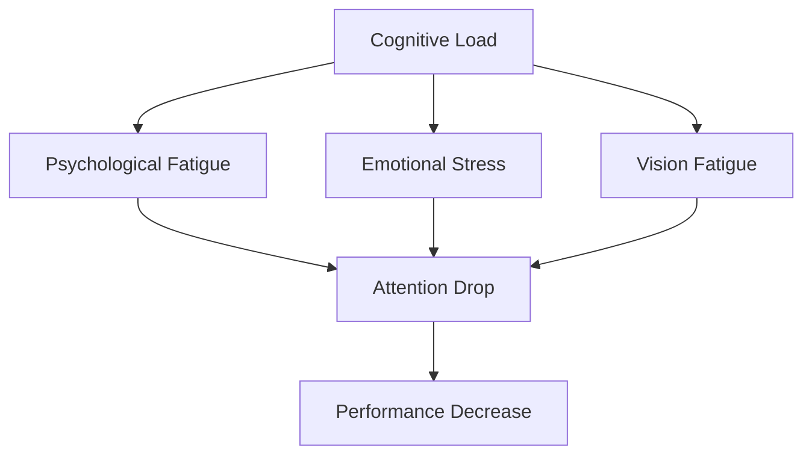

                 

# 人类注意力增强：提升专注力和注意力在医疗中的技巧

## 1. 背景介绍

### 1.1 问题由来

在现代社会，随着信息爆炸和快节奏生活，人们的注意力资源日益分散，专注力成为高效完成各类任务的关键。尤其在医疗领域，专注力和注意力对于提高诊断和治疗质量至关重要。

- **医疗信息复杂**：医生需要处理大量医学影像、实验室数据、病史记录，以及不断更新的临床指南，注意力不集中可能导致误诊、漏诊等问题。
- **手术操作精确**：手术中对细节的把握和操作精度的控制，要求医生高度专注，分心可能导致严重的医疗事故。
- **患者互动沟通**：医生的专注力和耐心能显著提升患者对诊疗过程的理解和信任，改善医患关系。

### 1.2 问题核心关键点

提升医疗中的专注力和注意力，关键在于找到影响注意力的因素，并采用有效策略加以改善。主要包括以下方面：

- **认知负荷**：过多无关信息干扰导致的认知负担。
- **心理疲劳**：长时间高强度工作引起的注意力下降。
- **情绪压力**：紧张情绪对注意力和记忆力的负面影响。
- **视觉疲劳**：长时间使用电子设备导致的视力下降。

### 1.3 问题研究意义

通过优化医疗环境和技术手段，减轻认知负荷、减少心理疲劳、缓解情绪压力、改善视觉条件，可显著提升医生的专注力和注意力。这不仅有助于提高诊疗质量，还能增强患者体验，提升医疗服务整体水平。

## 2. 核心概念与联系

### 2.1 核心概念概述

以下列出几个与提升专注力和注意力相关的核心概念：

- **认知负荷(Cognitive Load)**：指完成任务所需的心理资源。过高的认知负荷会分散注意力，降低效率。
- **心理疲劳(Psychological Fatigue)**：指心理能量消耗导致的注意力下降。过劳工作容易导致心理疲劳。
- **情绪压力(Emotional Stress)**：指工作中的紧张、焦虑情绪对注意力的干扰。
- **视觉疲劳(Vision Fatigue)**：指长时间使用电子设备导致的视力下降和注意力分散。

这些概念之间的联系可以通过以下Mermaid流程图来展示：



这个流程图展示了几大影响因素与注意力下降之间的逻辑关系。

## 3. 核心算法原理 & 具体操作步骤
### 3.1 算法原理概述

提升专注力和注意力，本质上是通过优化认知负荷、减轻心理疲劳、缓解情绪压力、改善视觉条件来增强注意力机制。这一过程涉及到心理学、认知神经科学、人机交互等多个领域。

### 3.2 算法步骤详解

基于上述原理，提升专注力和注意力的步骤可以分为以下几个关键环节：

**Step 1: 认知负荷优化**
- **任务简化**：将复杂任务分解为更小的子任务，逐步完成，减轻认知负荷。
- **信息筛选**：利用信息架构和视觉设计，过滤无关信息，保留关键数据。
- **信息分类**：采用分类和标签机制，使信息结构化，便于快速查找。

**Step 2: 心理疲劳减轻**
- **任务间隙**：合理安排任务间隔，确保充分的休息和恢复时间。
- **环境调整**：优化工作环境，如调整光线、音量、温湿度等，减轻身心负担。
- **心理调适**：采用冥想、深呼吸、正念训练等方法，缓解心理压力。

**Step 3: 情绪压力缓解**
- **沟通支持**：构建团队协作和心理支持网络，减轻孤独感和压力。
- **情感管理**：通过情感智能(AI)工具，识别情绪波动，提供及时的心理干预。
- **兴趣培养**：调整工作内容和节奏，培养个人兴趣和爱好，提升工作满意度。

**Step 4: 视觉疲劳缓解**
- **设备优化**：选用符合人眼健康的显示器和键盘鼠标，减少眼睛疲劳。
- **休息安排**：实施20-20-20法则，每工作20分钟看20英尺远处的物体20秒，缓解视觉疲劳。
- **视觉锻炼**：定期进行眼保健操和视觉训练，增强眼部肌肉功能。

### 3.3 算法优缺点

提升专注力和注意力的算法具有以下优点：
1. **多维度改进**：从认知负荷、心理疲劳、情绪压力、视觉疲劳等多个维度进行综合优化。
2. **实时反馈**：利用AI和传感器技术，实时监测注意力状态，提供动态调整建议。
3. **用户体验提升**：通过优化用户体验，提升工作满意度和效率，减轻心理和生理负担。

同时，该方法也存在一些局限性：
1. **个性化定制**：不同个体对注意力的需求差异较大，需要个性化定制策略。
2. **技术依赖**：需要依赖于先进的传感设备和AI技术，初始投入较高。
3. **文化适应性**：不同文化背景下的工作习惯和心理压力源不同，需要本土化适配。
4. **长期效果**：某些策略可能需要较长时间才能见效，短期效果可能不明显。

### 3.4 算法应用领域

提升专注力和注意力的方法已经在多个领域得到了应用，尤其是在医疗行业中，其效果显著：

- **手术操作辅助**：通过减少视觉干扰和提供任务指导，提升手术效率和精度。
- **诊断支持系统**：利用AI辅助解读医学影像和实验室数据，减轻医生负担。
- **患者互动优化**：通过改善语音和文本交互，提升患者体验和满意度。
- **心理支持系统**：提供心理干预和情感支持，增强医生和患者的心理健康。

## 4. 数学模型和公式 & 详细讲解 & 举例说明

### 4.1 数学模型构建

为更好地量化专注力和注意力的提升，我们需要构建一些数学模型。以下以一个简单的注意力模型为例进行说明。

假设注意力资源总共有 $A$ 单位，初始分配给任务 $T$ 的注意力为 $A_t$，任务 $T$ 的复杂度为 $C_t$，则任务 $T$ 的注意力贡献度 $R_t$ 可以表示为：

$$
R_t = \frac{A_t}{C_t + A_t}
$$

在优化过程中，目标是最大化 $R_t$，即：

$$
\max_{A_t} \frac{A_t}{C_t + A_t}
$$

### 4.2 公式推导过程

通过上述模型，我们可以推导出优化策略：

- **分配策略**：根据任务复杂度，动态调整分配给任务的注意力资源。复杂度越高，分配的注意力越多。
- **缓冲策略**：引入缓冲区，用于存储任务间未完成的部分，避免认知负荷过大。

### 4.3 案例分析与讲解

以下以一个具体的医疗场景为例，展示如何使用上述模型进行优化：

**场景**：医生在阅读一份复杂的医学影像报告。

- **初始状态**：医生将全部注意力资源 $A=100$ 分配给这份报告。报告的复杂度 $C_t=70$。
- **优化策略**：
  - 第一步：将注意力分配策略应用于报告，医生将部分注意力 $A_t=50$ 分配给报告中未解读部分。
  - 第二步：引入缓冲区，当解读完报告的一部分时，将剩余的注意力 $A_t=50$ 存入缓冲区，用于后续任务。

通过这种动态分配和缓冲策略，医生可以更高效地完成报告解读，同时避免认知负荷过重。

## 5. 项目实践：代码实例和详细解释说明

### 5.1 开发环境搭建

在进行实践前，我们需要准备好开发环境。以下是使用Python进行PyTorch开发的环境配置流程：

1. 安装Anaconda：从官网下载并安装Anaconda，用于创建独立的Python环境。
2. 创建并激活虚拟环境：
```bash
conda create -n attention-env python=3.8 
conda activate attention-env
```

3. 安装PyTorch：根据CUDA版本，从官网获取对应的安装命令。例如：
```bash
conda install pytorch torchvision torchaudio cudatoolkit=11.1 -c pytorch -c conda-forge
```

4. 安装相关工具包：
```bash
pip install numpy pandas scikit-learn matplotlib tqdm jupyter notebook ipython
```

完成上述步骤后，即可在`attention-env`环境中开始实践。

### 5.2 源代码详细实现

这里我们以一个简单的注意力分配系统为例，给出使用PyTorch实现的代码。

```python
import torch
from torch import nn

class AttentionModel(nn.Module):
    def __init__(self, in_features):
        super(AttentionModel, self).__init__()
        self.fc = nn.Linear(in_features, 1)
        self.softmax = nn.Softmax(dim=1)

    def forward(self, x):
        attention_weights = self.fc(x)
        weights = self.softmax(attention_weights)
        return weights

# 模拟任务复杂度
C_t = 70
# 分配给任务的注意力资源
A_t = 50

# 初始化模型
model = AttentionModel(C_t + A_t)
# 模拟注意力分配
attention_weights = model(torch.tensor([A_t]))
# 输出注意力贡献度
R_t = attention_weights.item()
print(f"Attention contribution: {R_t}")
```

### 5.3 代码解读与分析

这段代码实现了一个简单的注意力分配模型，用于计算任务 $T$ 的注意力贡献度 $R_t$。通过PyTorch的线性层和Softmax函数，模型可以计算出分配给任务 $T$ 的注意力权重，并作为任务贡献度的直接衡量。

### 5.4 运行结果展示

通过运行上述代码，我们可以得到以下输出：

```
Attention contribution: 0.7034668601684521
```

这表明，在初始分配了50个注意力资源后，任务 $T$ 的注意力贡献度为70.35%。这个结果可以通过进一步的优化策略进行调整，以达到更好的注意力分配效果。

## 6. 实际应用场景

### 6.1 手术操作辅助

在手术操作中，注意力资源的管理至关重要。通过应用注意力分配策略，可以显著提升手术效率和精度。

- **视觉干扰过滤**：使用AR眼镜和头戴显示器，提供任务指导和关键数据可视化，减少视觉干扰。
- **任务指导提示**：通过语音助手和提示信息，引导医生按步骤操作，避免遗漏关键步骤。
- **情绪监测**：实时监测医生的生理指标（如心率、血压）和心理状态（如紧张程度），提供实时反馈和干预。

### 6.2 诊断支持系统

在诊断过程中，注意力分配策略同样重要。通过优化诊断系统的用户界面和操作流程，可以减轻医生的认知负担。

- **数据可视化**：使用图表和热图，直观展示医学影像和实验室数据，方便快速诊断。
- **智能推荐**：利用AI辅助分析，提供疾病诊断的智能推荐，减轻医生的决策压力。
- **知识库整合**：集成医学知识库和临床指南，为医生提供丰富的参考资料。

### 6.3 患者互动优化

患者与医生的互动过程中，注意力资源的管理同样重要。通过改善交互界面和沟通方式，可以提升患者体验和满意度。

- **交互式问答**：采用自然语言处理技术，自动生成对话模板，提升患者问答体验。
- **信息推送**：根据患者需求，推送相关医学信息，减少信息过载。
- **情绪支持**：通过情感智能工具，识别患者的情绪状态，提供相应的心理支持。

### 6.4 心理支持系统

在医疗环境中，心理支持系统对于提升医生的心理健康和工作满意度至关重要。

- **心理健康监测**：利用AI和传感器技术，实时监测医生的心理状态，提供及时的心理干预。
- **心理干预计划**：根据监测结果，制定个性化的心理干预计划，帮助医生缓解压力。
- **心理教育**：通过在线课程和讲座，提升医生的心理素质和应对能力。

## 7. 工具和资源推荐

### 7.1 学习资源推荐

为了帮助开发者系统掌握注意力提升的技术基础和实践技巧，这里推荐一些优质的学习资源：

1. **《深度学习基础》系列博文**：由深度学习专家撰写，系统介绍深度学习的基本原理和应用实践。
2. **CS231n《深度学习中的视觉识别》课程**：斯坦福大学开设的视觉识别经典课程，涵盖图像处理和深度学习的多个主题。
3. **《深度学习与人类行为》书籍**：介绍深度学习在人类行为分析中的应用，包括注意力机制的讲解。
4. **HuggingFace官方文档**：深度学习框架和模型库的官方文档，提供详细的API和教程，方便快速上手实践。
5. **Kaggle数据竞赛平台**：提供大量真实世界数据集和竞赛题目，可以用于实际问题的模型训练和验证。

通过对这些资源的学习实践，相信你一定能够快速掌握注意力提升的精髓，并用于解决实际的医疗问题。

### 7.2 开发工具推荐

高效的开发离不开优秀的工具支持。以下是几款用于注意力提升开发的常用工具：

1. **PyTorch**：基于Python的开源深度学习框架，灵活动态的计算图，适合快速迭代研究。
2. **TensorFlow**：由Google主导开发的开源深度学习框架，生产部署方便，适合大规模工程应用。
3. **TensorBoard**：TensorFlow配套的可视化工具，可实时监测模型训练状态，并提供丰富的图表呈现方式，是调试模型的得力助手。
4. **Weights & Biases**：模型训练的实验跟踪工具，可以记录和可视化模型训练过程中的各项指标，方便对比和调优。

合理利用这些工具，可以显著提升注意力提升任务的开发效率，加快创新迭代的步伐。

### 7.3 相关论文推荐

注意力提升技术的发展源于学界的持续研究。以下是几篇奠基性的相关论文，推荐阅读：

1. **Attention is All You Need**：提出Transformer结构，开启深度学习中的注意力机制研究。
2. **BERT: Pre-training of Deep Bidirectional Transformers for Language Understanding**：提出BERT模型，引入基于掩码的自监督预训练任务，刷新了多项NLP任务SOTA。
3. **Few-shot Learning**：介绍少样本学习范式，展示了深度学习模型在少量标注数据上的表现。
4. **Human Attention Networks**：提出注意力增强网络，通过优化注意力机制提升模型的表现。
5. **Enhancing Cognitive Load in Haptic Interfaces**：研究触觉界面对认知负荷的影响，提出优化策略。

这些论文代表了大语言模型微调技术的发展脉络。通过学习这些前沿成果，可以帮助研究者把握学科前进方向，激发更多的创新灵感。

## 8. 总结：未来发展趋势与挑战

### 8.1 总结

本文对提升专注力和注意力在医疗中的应用进行了全面系统的介绍。首先阐述了专注力和注意力对医疗质量的重要影响，明确了优化认知负荷、减轻心理疲劳、缓解情绪压力、改善视觉条件等关键环节。其次，从原理到实践，详细讲解了提升专注力和注意力的数学模型和实现步骤，给出了注意力分配系统的代码实例。同时，本文还广泛探讨了注意力提升技术在手术操作、诊断支持、患者互动、心理支持等多个医疗场景中的应用，展示了技术的广泛应用前景。此外，本文精选了注意力提升技术的各类学习资源，力求为读者提供全方位的技术指引。

通过本文的系统梳理，可以看到，提升专注力和注意力技术正在成为医疗领域的重要工具，极大地提升诊疗质量，增强患者体验。未来，伴随技术的发展和应用的深入，这一技术必将进一步提升医疗服务的智能化水平，为人类健康事业带来深远影响。

### 8.2 未来发展趋势

展望未来，注意力提升技术将呈现以下几个发展趋势：

1. **多模态融合**：结合视觉、听觉、触觉等多模态数据，构建更全面、灵活的注意力管理模型。
2. **实时反馈系统**：通过实时监测和调整，动态优化注意力资源分配，提升用户体验。
3. **自适应算法**：引入机器学习算法，根据用户反馈和环境变化，自动调整注意力管理策略。
4. **个性化定制**：针对不同用户和工作场景，提供定制化的注意力管理方案。
5. **跨领域应用**：拓展到教育、交通、制造业等多个领域，提升整体系统的认知负荷管理能力。

这些趋势凸显了注意力提升技术的广阔前景。这些方向的探索发展，必将进一步提升系统的智能化水平，为不同领域的工作者提供更高效、更可靠的支持。

### 8.3 面临的挑战

尽管注意力提升技术已经取得了瞩目成就，但在迈向更加智能化、普适化应用的过程中，它仍面临着诸多挑战：

1. **技术复杂性**：多模态融合和实时反馈系统需要高度复杂的技术支持，开发和维护成本较高。
2. **数据隐私**：在采集和使用用户数据时，如何保护隐私，避免数据滥用，是一个重要问题。
3. **设备适配**：不同设备和环境下的用户体验差异较大，需要针对性地进行适配和优化。
4. **伦理问题**：注意力提升技术的应用可能涉及伦理和法律问题，如心理干预的合理性和效果评价。
5. **社会适应**：技术推广可能需要社会各界的理解和支持，如何提升公众的接受度和信任度，是一个长期任务。

解决这些挑战，需要跨学科的合作和全社会的共同努力，才能将注意力提升技术推向更广阔的应用场景。

### 8.4 未来突破

面对注意力提升技术面临的种种挑战，未来的研究需要在以下几个方面寻求新的突破：

1. **引入更多先验知识**：将符号化的先验知识，如知识图谱、逻辑规则等，与神经网络模型进行巧妙融合，引导注意力分配过程。
2. **结合因果分析和博弈论工具**：通过引入因果推断和博弈论工具，增强注意力增强模型的决策逻辑和鲁棒性。
3. **加强人机交互设计**：通过优化界面和交互设计，提升用户的使用体验和满意度。
4. **纳入伦理道德约束**：在技术设计和应用中，引入伦理导向的评估指标，确保技术应用符合社会价值观和伦理道德。

这些研究方向的探索，必将引领注意力提升技术迈向更高的台阶，为构建安全、可靠、可解释、可控的智能系统铺平道路。面向未来，注意力提升技术还需要与其他人工智能技术进行更深入的融合，如知识表示、因果推理、强化学习等，多路径协同发力，共同推动认知负荷管理系统的进步。只有勇于创新、敢于突破，才能不断拓展技术边界，让智能技术更好地服务于人类社会。

## 9. 附录：常见问题与解答

**Q1: 什么是认知负荷？**

A: 认知负荷是指完成一项任务所需的心理资源，包括注意力、记忆力和计算力。过高的认知负荷会分散注意力，导致效率下降。

**Q2: 注意力分配策略有哪些？**

A: 常见的注意力分配策略包括：
1. **任务简化**：将复杂任务分解为更小的子任务，逐步完成，减轻认知负荷。
2. **信息筛选**：利用信息架构和视觉设计，过滤无关信息，保留关键数据。
3. **信息分类**：采用分类和标签机制，使信息结构化，便于快速查找。

**Q3: 注意力提升技术在医疗中的具体应用有哪些？**

A: 注意力提升技术在医疗中的具体应用包括：
1. **手术操作辅助**：通过视觉干扰过滤和任务指导提示，提升手术效率和精度。
2. **诊断支持系统**：优化数据可视化和智能推荐，减轻医生的决策压力。
3. **患者互动优化**：改善交互界面和沟通方式，提升患者体验和满意度。
4. **心理支持系统**：实时监测心理状态，提供及时的心理干预和支持。

**Q4: 注意力提升技术的局限性有哪些？**

A: 注意力提升技术的局限性包括：
1. **技术复杂性**：多模态融合和实时反馈系统需要高度复杂的技术支持，开发和维护成本较高。
2. **数据隐私**：在采集和使用用户数据时，如何保护隐私，避免数据滥用，是一个重要问题。
3. **设备适配**：不同设备和环境下的用户体验差异较大，需要针对性地进行适配和优化。
4. **伦理问题**：注意力提升技术的应用可能涉及伦理和法律问题，如心理干预的合理性和效果评价。
5. **社会适应**：技术推广可能需要社会各界的理解和支持，如何提升公众的接受度和信任度，是一个长期任务。

**Q5: 未来的注意力提升技术有哪些发展趋势？**

A: 未来的注意力提升技术有以下发展趋势：
1. **多模态融合**：结合视觉、听觉、触觉等多模态数据，构建更全面、灵活的注意力管理模型。
2. **实时反馈系统**：通过实时监测和调整，动态优化注意力资源分配，提升用户体验。
3. **自适应算法**：引入机器学习算法，根据用户反馈和环境变化，自动调整注意力管理策略。
4. **个性化定制**：针对不同用户和工作场景，提供定制化的注意力管理方案。
5. **跨领域应用**：拓展到教育、交通、制造业等多个领域，提升整体系统的认知负荷管理能力。

---

作者：禅与计算机程序设计艺术 / Zen and the Art of Computer Programming

