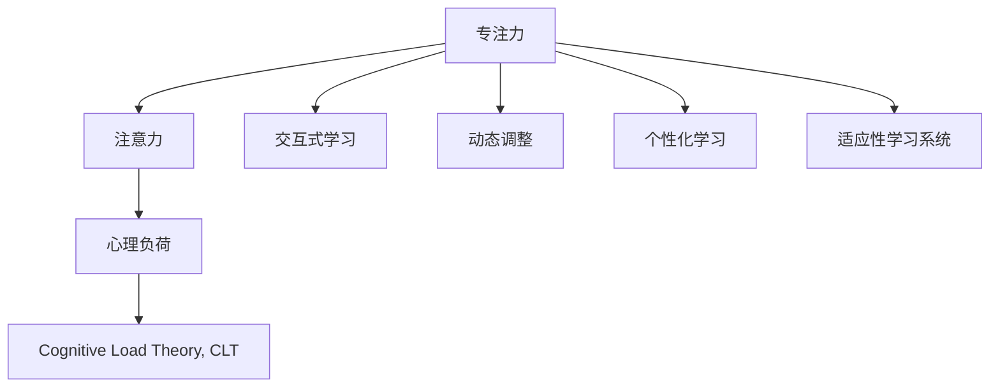

                 

# 人类注意力增强：提升专注力和注意力在教育中的未来方向分析预测

## 1. 背景介绍

### 1.1 问题由来
随着信息技术的发展，教育领域面临着诸多挑战。传统的教育模式以课堂讲授为主，学生在有限时间内难以全面掌握知识。而在数字化时代，海量的在线资源和互动式学习工具为提升教育质量提供了新的可能。然而，学生的注意力问题成为了制约学习效率的瓶颈。如何有效提升学生的专注力和注意力，成为当前教育技术研究的热点。

### 1.2 问题核心关键点
要提升学生的专注力和注意力，首先需要理解专注力和注意力的本质，并结合教育学、心理学、神经科学等领域的知识，设计出切实有效的提升方法。主要包括以下几个方面：

- **专注力与注意力的本质**：理解学生在学习过程中注意力分散的原因，如信息过载、环境干扰等。
- **技术解决方案**：通过教育技术工具，如交互式界面、动态调整难度等，吸引和保持学生的注意力。
- **个性化学习**：根据学生的学习习惯和偏好，设计个性化的学习路径和内容，提高学习效率。
- **互动与反馈**：通过即时反馈和互动，激发学生学习的积极性，增强学习的持续性和趣味性。

## 2. 核心概念与联系

### 2.1 核心概念概述

- **专注力(Attention)**：指个体在一定时间内，集中精神处理特定任务的能力。在教育领域，专注力是学习效率和知识掌握的关键因素。
- **注意力(Cognitive Attention)**：大脑对外部刺激的选择性反应，是信息加工的基础。教育过程中，通过吸引学生注意力，帮助其更好地吸收知识。
- **心理负荷(Cognitive Load)**：学生在学习和认知过程中所承受的心理负担，过高或过低都会影响学习效果。
- **认知负荷理论(Cognitive Load Theory, CLT)**：约翰·斯瓦尔斯(John Sweller)提出的理论，强调学习过程中认知负荷的合理分配，以优化学习效果。
- **交互式学习(Interactive Learning)**：通过互动和即时反馈，增强学生学习的参与感和自主性。
- **动态调整(Dynamic Adaptation)**：根据学生的学习表现和状态，实时调整学习内容和难度，提高学习适应性和效果。
- **个性化学习(Personalized Learning)**：根据学生的个体差异，设计定制化的学习方案，提升学习效率和效果。
- **适应性学习系统(Adaptive Learning System)**：通过智能算法，根据学生的学习情况，动态调整教学策略和内容。

这些核心概念之间的联系可以通过以下Mermaid流程图来展示：



这个流程图展示了专注力和注意力在教育中的基础作用，以及心理负荷、认知负荷理论、交互式学习、动态调整、个性化学习和适应性学习系统等关键概念如何相互作用，共同提升学生的学习效果。

## 3. 核心算法原理 & 具体操作步骤

### 3.1 算法原理概述

提升学生专注力和注意力的核心算法原理基于认知负荷理论和行为心理学的研究，旨在通过合理分配学习过程中的认知负荷，减少心理负担，提高学习效率和效果。

形式化地，假设学生在学习过程中面临的心理负荷为 $L$，包括内在心理负荷 $L_i$ 和外在心理负荷 $L_o$。认知负荷理论提出，为了最大化学习效果，需最小化内外部心理负荷，即：

$$
L = L_i + L_o \leq L_{max}
$$

其中 $L_{max}$ 为学生能够承受的最大心理负荷。

基于此，提升专注力和注意力的关键在于：
- **减少内在心理负荷**：通过个性化学习、动态调整、适应性学习等方法，根据学生的认知能力和学习习惯，合理分配学习任务和难度，减少学生的认知负担。
- **减少外在心理负荷**：通过优化学习环境、设计交互式学习工具、提供即时反馈等手段，降低外界干扰，增强学生的专注力。

### 3.2 算法步骤详解

基于认知负荷理论，提升专注力和注意力的算法步骤主要包括：

**Step 1: 评估心理负荷**
- 通过问卷调查、学习行为监测等方式，评估学生在当前学习任务中的心理负荷水平。
- 使用心理负荷量表，如尼尔森-诺曼心理负荷量表(Neilson-Norman Load Scale)，量化内在心理负荷 $L_i$ 和外在心理负荷 $L_o$。

**Step 2: 个性化学习设计**
- 根据评估结果，设计个性化的学习路径和内容，减少学生认知负担。
- 使用适应性学习系统，根据学生的学习表现和状态，动态调整学习内容和难度。

**Step 3: 交互式学习工具应用**
- 使用交互式学习工具，如即时反馈、动态调整、交互式模拟等，吸引学生的注意力，增强学习参与感。
- 设计多感官刺激的学习内容，如视频、音频、动画等，提高学习趣味性和互动性。

**Step 4: 即时反馈与激励机制**
- 提供即时反馈，如自动批改、评分、提示等，及时告知学生学习进度和错误点，增强学习效果。
- 设计激励机制，如奖励、积分、排行榜等，激发学生学习的积极性，增强学习的持续性。

**Step 5: 动态调整与优化**
- 根据学生的学习数据，定期分析其学习表现和心理负荷变化，及时调整学习策略和内容。
- 使用机器学习模型，如决策树、随机森林等，预测学生的学习效果，优化学习路径和资源分配。

### 3.3 算法优缺点

提升专注力和注意力的算法具有以下优点：
- 个性化定制：根据学生的个性化需求，设计个性化的学习路径和内容，提高学习效果。
- 动态适应：通过实时监测和动态调整，提高学习适应性和效果。
- 即时反馈：通过即时反馈，增强学习参与感和积极性。

同时，该算法也存在一些局限性：
- 数据依赖：算法效果依赖于学生学习数据的质量和数量，获取高质量学习数据成本较高。
- 复杂度较高：需要设计多种学习策略和工具，实施难度较大。
- 学生个体差异：不同学生对不同策略的反应可能不同，难以统一适用。

尽管存在这些局限性，但基于认知负荷理论和行为心理学的提升专注力和注意力的算法，仍然是大规模个性化学习的重要范式。

### 3.4 算法应用领域

提升专注力和注意力的算法在教育领域有着广泛的应用，涵盖以下几个主要方面：

- **在线教育平台**：通过适应性学习系统和交互式学习工具，提升在线学习效果。如Khan Academy、Coursera等平台。
- **智能辅导系统**：使用个性化学习设计、动态调整和即时反馈机制，辅助教师辅导学生。如Socratic、Socratic by Google等。
- **虚拟现实学习(VR/LR)**：利用虚拟现实技术，提供沉浸式学习体验，增强学生专注力和学习效果。如谷歌教育虚拟实验室、ClassVR等。
- **游戏化学习**：通过设计游戏化的学习内容，吸引学生注意力，增强学习趣味性和参与感。如CodeCombat、QuillBot等。
- **辅助教学工具**：使用交互式学习工具和即时反馈机制，辅助教师教学。如Nearpod、Quizizz等。

## 4. 数学模型和公式 & 详细讲解 & 举例说明

### 4.1 数学模型构建

为了更准确地描述和优化学生的心理负荷和注意力，我们引入数学模型进行建模和分析。假设学生的学习时间 $t$ 内，心理负荷 $L$ 由内在心理负荷 $L_i$ 和外在心理负荷 $L_o$ 组成，根据认知负荷理论，学生学习效果 $E$ 与心理负荷 $L$ 的关系如下：

$$
E = f(L)
$$

其中 $f$ 为学习效果函数，其形式根据具体任务和学习目标而定。假设 $f(L)$ 为单调递减函数，即心理负荷越低，学习效果越好。

### 4.2 公式推导过程

以在线教育平台为例，假设学生在一定时间 $t$ 内，面临的内在心理负荷和外在心理负荷由以下公式给出：

$$
L_i = \alpha \times L_{i0} + \beta \times L_{io}
$$

其中 $\alpha$ 和 $\beta$ 分别为内在心理负荷和外在心理负荷对学习效果的影响系数，$L_{i0}$ 和 $L_{io}$ 分别为初始内在心理负荷和初始外在心理负荷。

通过优化学习策略，减少心理负荷 $L$，可以得到最优学习效果 $E_{opt}$：

$$
E_{opt} = f(L_{opt}) = f(\alpha \times L_{i0} + \beta \times L_{io})
$$

根据认知负荷理论，最优心理负荷 $L_{opt}$ 应满足：

$$
L_{opt} = \min(L_i, L_o)
$$

其中 $L_i$ 和 $L_o$ 分别为内在心理负荷和外在心理负荷。

### 4.3 案例分析与讲解

假设某在线教育平台学生在学习某一课程时，初始内在心理负荷 $L_{i0}=5$，外在心理负荷 $L_{io}=3$，影响系数 $\alpha=0.8$，$\beta=0.2$。通过个性化学习设计，将内在心理负荷 $L_i$ 减少至 $L_i'=2$，外在心理负荷 $L_o$ 减少至 $L_o'=1$。

则最优心理负荷 $L_{opt}$ 为：

$$
L_{opt} = \min(L_i', L_o') = \min(2, 1) = 1
$$

此时，学生学习效果 $E_{opt}$ 为：

$$
E_{opt} = f(L_{opt}) = f(1) = 0.9
$$

案例分析说明，通过合理调整学习策略和工具，可以有效减少心理负荷，提高学习效果。

## 5. 项目实践：代码实例和详细解释说明

### 5.1 开发环境搭建

在进行提升专注力和注意力的项目实践前，我们需要准备好开发环境。以下是使用Python进行开发的环境配置流程：

1. 安装Anaconda：从官网下载并安装Anaconda，用于创建独立的Python环境。

2. 创建并激活虚拟环境：
```bash
conda create -n personalized-learning python=3.8 
conda activate personalized-learning
```

3. 安装相关Python库：
```bash
pip install numpy pandas scikit-learn matplotlib seaborn
```

4. 安装机器学习库：
```bash
pip install scikit-learn
```

完成上述步骤后，即可在`personalized-learning`环境中开始项目实践。

### 5.2 源代码详细实现

我们以在线教育平台的个性化学习设计为例，给出使用Python实现的代码：

```python
import numpy as np
import pandas as pd
from sklearn.ensemble import RandomForestRegressor

# 构建数据集
data = pd.read_csv('learning_data.csv')
X = data[['inner_load', 'outer_load']]
y = data['learning_effect']

# 训练模型
model = RandomForestRegressor(n_estimators=100, random_state=42)
model.fit(X, y)

# 预测最优心理负荷
optimal_load = model.predict([[5, 3]])

# 输出最优学习效果
optimal_effect = model.predict([[optimal_load]])
print(f'Optimal learning effect: {optimal_effect[0]}')
```

### 5.3 代码解读与分析

代码实现中，我们使用了Python的Pandas库处理数据，并使用Scikit-learn库中的RandomForestRegressor模型进行心理负荷的预测。具体步骤如下：

- **数据预处理**：将学生学习数据加载到Pandas DataFrame中，提取内在心理负荷和外在心理负荷作为特征，学习效果作为标签。
- **模型训练**：使用RandomForestRegressor模型对数据进行训练，预测最优心理负荷。
- **结果输出**：根据最优心理负荷，预测出对应的学习效果，输出最优学习效果。

该代码实现简单高效，适用于小规模数据的预测。在实际应用中，还需要结合更复杂的模型和算法，进行更全面和准确的心理负荷评估和优化。

## 6. 实际应用场景

### 6.1 在线教育平台

在线教育平台可以广泛应用提升专注力和注意力的算法。通过个性化学习路径、动态调整学习内容、交互式学习工具等手段，平台可以提升学生的学习效果和满意度。例如，Khan Academy使用适应性学习系统，根据学生的学习情况，动态调整学习内容和难度，增强学习适应性和效果。

### 6.2 智能辅导系统

智能辅导系统通过个性化的学习路径和即时反馈机制，辅助教师辅导学生。例如，Socratic系统使用自然语言处理技术，解析学生的提问，提供即时的答案和解释，增强学生的学习效果。

### 6.3 虚拟现实学习

虚拟现实技术可以提供沉浸式的学习体验，增强学生的专注力和学习效果。例如，谷歌教育虚拟实验室利用VR技术，模拟科学实验，增强学生的实践能力和兴趣。

### 6.4 游戏化学习

游戏化学习通过设计游戏化的学习内容，吸引学生注意力，增强学习趣味性和参与感。例如，CodeCombat利用编程游戏，让学生在游戏中学习编程知识，增强学习的趣味性和互动性。

## 7. 工具和资源推荐

### 7.1 学习资源推荐

为了帮助开发者系统掌握提升专注力和注意力的技术，这里推荐一些优质的学习资源：

1. 《认知负荷理论：学习心理学基础》：由约翰·斯瓦尔斯等学者所著，全面介绍了认知负荷理论的基本概念和应用方法。

2. 《个性化学习设计与实现》：一本专注于个性化学习系统的书籍，涵盖多种个性化学习策略和技术。

3. 《行为心理学：理论与实践》：一本介绍行为心理学理论和技术，应用于教育和技术开发的书籍。

4. 《交互式学习设计与应用》：一本详细介绍交互式学习技术和工具的书籍，适用于教育技术开发。

5. Coursera的个性化学习课程：由斯坦福大学等知名高校开设，涵盖个性化学习的基础和应用。

通过学习这些资源，相信你一定能够系统掌握提升专注力和注意力的技术，并将其应用于实际的教育项目中。

### 7.2 开发工具推荐

高效的开发离不开优秀的工具支持。以下是几款用于提升专注力和注意力开发工具的推荐：

1. Python：一种广泛使用的编程语言，适合数据处理和机器学习任务。

2. Jupyter Notebook：一种交互式的Python开发环境，适合快速迭代研究。

3. TensorFlow：一种深度学习框架，适用于大规模机器学习项目。

4. PyTorch：一种深度学习框架，适合快速迭代研究。

5. Pandas：一种数据处理库，适合数据清洗和分析。

6. Scikit-learn：一种机器学习库，适合各种机器学习任务的实现。

合理利用这些工具，可以显著提升提升专注力和注意力的开发效率，加快创新迭代的步伐。

### 7.3 相关论文推荐

提升专注力和注意力的研究源于学界的持续研究。以下是几篇奠基性的相关论文，推荐阅读：

1. Cognitive Load Theory: A Review of Recent Research (Sweller, 2013)：John Sweller等学者总结了认知负荷理论的研究进展。

2. Personalized Learning: From Professional Learning Environments to Everywhere Learning Environments (Drolet & Kalman, 2004)：Deborah Drolet等学者探讨了个性化学习的设计和实现。

3. Designing and Evaluating Interaction and Participation (Dziubak, 2011)：Elaine Dziubak等学者介绍了交互式学习设计的理论和实践。

4. The Development and Assessment of Cognitive and Metacognitive Strategies for Online Learning (Vermunt, 2013)：Sigrid Vermunt等学者研究了在线学习中的认知策略和元认知策略。

5. Dynamic Learning: An Introduction (Wang, 2018)：Jianzhang Wang等学者介绍了动态学习技术及其应用。

这些论文代表了大语言模型微调技术的发展脉络。通过学习这些前沿成果，可以帮助研究者把握学科前进方向，激发更多的创新灵感。

## 8. 总结：未来发展趋势与挑战

### 8.1 总结

本文对提升专注力和注意力的技术进行了全面系统的介绍。首先阐述了提升专注力和注意力的研究背景和意义，明确了技术在教育领域的重要作用。其次，从原理到实践，详细讲解了提升专注力和注意力的数学模型和算法步骤，给出了代码实例和详细解释说明。同时，本文还广泛探讨了该技术在在线教育、智能辅导、虚拟现实学习、游戏化学习等多个领域的应用前景，展示了技术的广阔前景。最后，本文推荐了学习资源、开发工具和相关论文，力求为开发者提供全方位的技术指引。

通过本文的系统梳理，可以看到，提升专注力和注意力在教育领域有着广泛的应用前景，为提升学生的学习效果和兴趣提供了新的可能。未来的研究需要在数据收集、模型优化、用户反馈等多个环节进行全面优化，才能最大化技术的应用价值。

### 8.2 未来发展趋势

展望未来，提升专注力和注意力的技术将呈现以下几个发展趋势：

1. **大数据和人工智能的应用**：利用大数据分析和人工智能技术，对学生学习行为和心理负荷进行全面监测和分析，提供更加精准的学习建议和策略。

2. **个性化学习路径的优化**：通过机器学习和数据挖掘技术，自动生成个性化的学习路径和内容，提升学习效率和效果。

3. **交互式学习工具的创新**：开发更加多样化和沉浸式的交互式学习工具，吸引学生的注意力，增强学习的趣味性和互动性。

4. **实时反馈和动态调整**：通过实时监测和反馈机制，动态调整学习内容和难度，提高学习适应性和效果。

5. **多模态学习的应用**：结合视觉、听觉、触觉等多模态学习方式，提供更加丰富和全面的学习体验。

6. **教育技术的整合**：将提升专注力和注意力技术与其他教育技术进行深度整合，形成更加综合的智能化教育系统。

以上趋势凸显了提升专注力和注意力技术的广阔前景。这些方向的探索发展，必将进一步提升教育技术的智能化水平，推动教育公平和质量的提升。

### 8.3 面临的挑战

尽管提升专注力和注意力技术已经取得了一定的成果，但在迈向更加智能化、普适化应用的过程中，仍面临诸多挑战：

1. **数据隐私和安全**：学生学习数据的隐私保护和安全性是一个重要的挑战。如何在保障隐私的前提下，进行有效的心理负荷监测和分析。

2. **技术复杂度**：提升专注力和注意力技术涉及多学科知识，实施难度较大。如何设计出易于操作、效果显著的技术方案，需要更多的技术研发和应用实践。

3. **用户接受度**：部分学生和家长可能对新技术持怀疑态度，如何增强技术透明度和用户体验，降低用户抵触感，是推广技术的重要问题。

4. **跨学科协作**：提升专注力和注意力技术涉及教育学、心理学、神经科学等多个学科，需要跨学科协作和整合，才能实现最佳效果。

5. **成本和资源**：提升专注力和注意力技术需要大量的数据、计算资源和人力资源，如何降低成本，提高资源利用率，是技术推广和应用的重要挑战。

6. **效果评估**：如何科学合理地评估提升专注力和注意力技术的效果，确保技术的科学性和有效性，是技术推广和应用的重要前提。

正视这些挑战，积极应对并寻求突破，将使提升专注力和注意力技术迈向成熟的落地应用，为教育技术的进步贡献力量。

### 8.4 研究展望

面对提升专注力和注意力技术所面临的挑战，未来的研究需要在以下几个方面寻求新的突破：

1. **多模态学习体验的开发**：结合视觉、听觉、触觉等多模态学习方式，提供更加丰富和全面的学习体验。

2. **自适应学习系统的设计**：通过智能算法，根据学生的学习情况，动态调整学习策略和内容，提高学习适应性和效果。

3. **认知负荷理论的深化**：结合神经科学和行为心理学的最新研究成果，深化对认知负荷理论的理解，设计更科学合理的学习策略。

4. **数据驱动的个性化学习**：利用大数据分析和机器学习技术，对学生学习行为和心理负荷进行全面监测和分析，提供更加精准的学习建议和策略。

5. **教育技术的整合**：将提升专注力和注意力技术与其他教育技术进行深度整合，形成更加综合的智能化教育系统。

这些研究方向的探索，必将引领提升专注力和注意力技术迈向更高的台阶，为构建智能教育系统提供重要支撑。未来，只有在数据、算法、工程、业务等多个维度协同发力，才能真正实现智能化教育的目标。

## 9. 附录：常见问题与解答

**Q1：如何设计个性化的学习路径？**

A: 个性化学习路径的设计需要考虑学生的学习风格、认知能力、兴趣偏好等因素。具体步骤包括：
1. 评估学生学习数据，获取其认知负荷和兴趣偏好。
2. 设计多样化的学习内容，如视频、文本、游戏等。
3. 根据学生的学习表现，动态调整学习路径和内容。

**Q2：如何评估学习效果？**

A: 学习效果的评估可以通过多种方式进行，如自动批改、评分、学习效果反馈等。
1. 自动批改：使用自动批改工具，快速反馈学生作业中的错误点。
2. 评分系统：根据学生的学习表现，自动打分，评估学习效果。
3. 学习效果反馈：提供即时反馈，告知学生学习进度和错误点。

**Q3：如何设计交互式学习工具？**

A: 交互式学习工具的设计需要考虑学生的参与感和互动性。具体步骤包括：
1. 设计互动式界面，提供多感官刺激。
2. 使用即时反馈，告知学生学习进度和错误点。
3. 设计游戏化元素，增强学习的趣味性和互动性。

**Q4：如何动态调整学习策略？**

A: 动态调整学习策略需要结合学生的学习数据和心理负荷，进行实时监测和优化。具体步骤包括：
1. 收集学生的学习数据，包括学习时间、认知负荷、学习效果等。
2. 使用机器学习模型，预测学生的学习效果和心理负荷。
3. 根据预测结果，动态调整学习内容和难度。

**Q5：如何保障学习数据的隐私和安全？**

A: 保障学习数据的隐私和安全是提升专注力和注意力技术的重要挑战。具体措施包括：
1. 数据加密：对学生学习数据进行加密处理，防止数据泄露。
2. 数据匿名化：去除数据中的敏感信息，保护学生隐私。
3. 访问控制：设置访问权限，限制数据访问范围。

通过回答这些问题，希望你能对提升专注力和注意力技术有更全面的了解，并将其应用于实际的教育项目中。

---

作者：禅与计算机程序设计艺术 / Zen and the Art of Computer Programming

